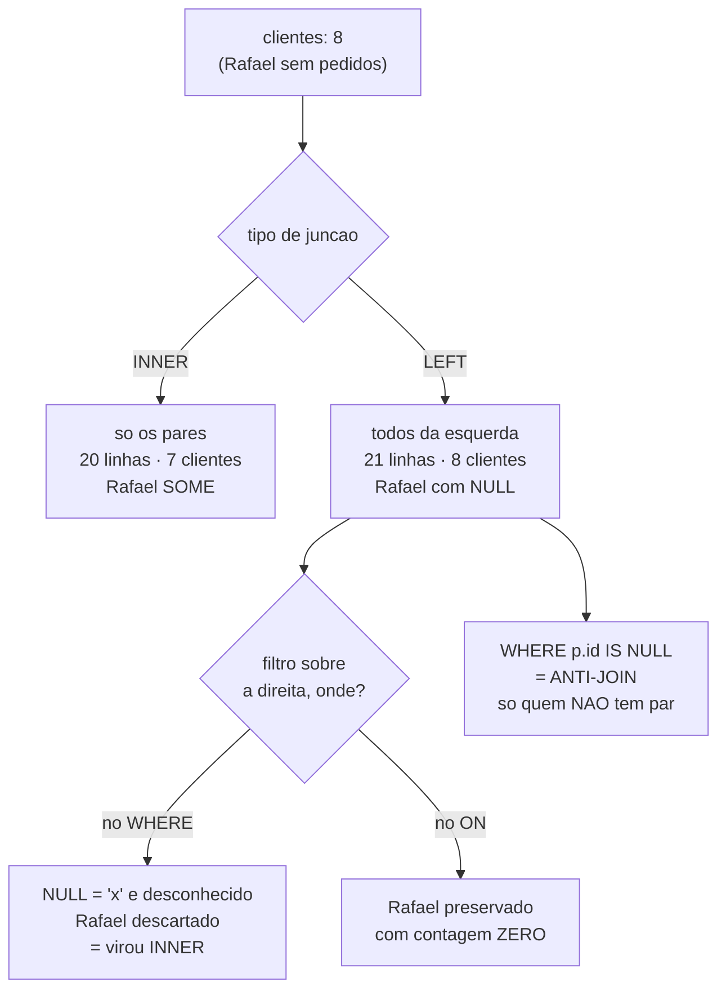

# 03.08 — `JOIN` — parte 2: `LEFT`/`RIGHT`/`FULL`

> **Módulo 03 — SQL** · Nível: N2 · Tempo estimado: 3h00 · Código: `codigo/cap08/`

## 1. Objetivo

- **Prever** o resultado de cada tipo de junção sobre os mesmos dados.
- **Aplicar** `LEFT JOIN` para perguntas do tipo "todos os clientes, tenham comprado ou não".
- **Construir** anti-joins com `LEFT JOIN ... WHERE ... IS NULL` — "quem nunca comprou".
- **Diagnosticar** o erro clássico: o filtro no `WHERE` que transforma um `LEFT JOIN` em `INNER`.

Ao final, você responde perguntas **pela ausência** — e conhece o erro de uma palavra que faz um relatório perder linhas em silêncio.

---

## 2. Pré-requisitos

- [03.07 — `JOIN` — parte 1: `INNER`](07-join-parte-1-inner.md) — **a dívida deste capítulo**: linhas sem correspondência desaparecem, e você registrou que `ON` e `WHERE` coincidem no `INNER`. Aqui deixam de coincidir.
- [03.03 — `SELECT` e `WHERE`](03-select-e-where.md) — a lógica de três valores volta com um papel novo: o `NULL` passa a ser **criado** pela junção.

**Autoteste:** (1) Quantos clientes aparecem numa consulta que junta `clientes` com `pedidos`? (2) Como você descobriria quem nunca comprou, com o que sabe até agora? (3) O que `WHERE coluna IS NULL` faz? As três se encontram neste capítulo.

---

## 3. Motivação

O `INNER JOIN` do capítulo anterior tem uma característica que parece razoável e é a origem de uma família inteira de relatórios errados: **linhas sem correspondência desaparecem, sem aviso**.

O Rafael Torres está cadastrado e nunca comprou. Qualquer consulta que junte `clientes` com `pedidos` mostra **sete** clientes numa base de oito — e nada indica a ausência. Um relatório de "clientes e seus pedidos" não o menciona, e quem lê conclui que a base tem sete clientes.

O Mousepad Grande está no catálogo e nunca foi vendido. Some do relatório de faturamento por produto. A lista de "produtos e suas vendas" tem onze itens de doze.

E o problema piora quando a ausência **é a pergunta**:

*"Quais clientes nunca compraram?"* · *"Quais produtos estão encalhados?"* · *"Quais pedidos ainda não foram pagos?"*

Nenhuma delas se responde com `INNER JOIN`, porque ele mostra exatamente o que **tem** correspondência — o oposto do que se quer. Responder pela ausência exige a família de junções que **preserva** o lado sem par: `LEFT`, `RIGHT` e `FULL`.

E há um detalhe que faz deste um dos capítulos mais importantes do módulo: existe um erro de **uma palavra** que transforma um `LEFT JOIN` de volta em `INNER`, silenciosamente. A consulta continua com `LEFT` escrito, o relatório perde linhas, e ninguém percebe.

---

## 4. Modelo mental

> 🧠 **Modelo mental**
> O `LEFT JOIN` diz: **"traga todas as linhas da esquerda; onde não houver par à direita, preencha com `NULL`"**. É a mesma colagem lado a lado do 03.07, com uma promessa a mais — o lado esquerdo é **garantido**. E é dessa promessa que nasce a técnica mais elegante do capítulo: se a linha da direita veio toda em `NULL`, é porque **não havia par** — e filtrar por esse `NULL` responde perguntas sobre ausência.

**Exercício de previsão.** A Aurora tem 8 clientes e 20 pedidos; o Rafael não tem nenhum pedido. Sem rodar, decida quantas linhas devolvem:

- (a) `clientes c JOIN pedidos p ON p.cliente_id = c.id`
- (b) `clientes c LEFT JOIN pedidos p ON p.cliente_id = c.id`
- (c) a versão (b) com `WHERE p.status = 'concluido'` acrescentado

*Resposta comentada:* (a) **20** — uma por pedido; o Rafael some. (b) **21** — os mesmos 20, mais **uma** linha para o Rafael, com todas as colunas de `pedidos` em `NULL`. (c) **17** — e aqui está a armadilha: o `WHERE` avalia `p.status = 'concluido'` **na linha do Rafael também**, onde `p.status` é `NULL`; a comparação dá **desconhecido**, a linha é descartada, e o `LEFT JOIN` volta a se comportar como `INNER`. Se você respondeu 18 em (c), esperando que o Rafael sobrevivesse, acabou de encontrar o erro mais comum deste capítulo — e a correção é mover a condição para o `ON`.

---

## 5. Analogia

Volte às **duas listas de papel** do capítulo anterior: sócios e reservas da quadra.

O `INNER JOIN` produzia uma lista de reservas com o nome do sócio ao lado. Sócios que nunca reservaram não apareciam — o que faz sentido se você quer **listar reservas**, e é um desastre se você quer **avaliar a base de sócios**.

O `LEFT JOIN` é começar pela lista de **sócios** e, para cada um, anotar as reservas ao lado. Quem nunca reservou continua na folha, com o espaço das reservas **em branco**. A promessa mudou: agora a lista de sócios está inteira, aconteça o que acontecer do outro lado.

E o gesto que resolve o problema difícil: para achar quem nunca reservou, você percorre a folha e **procura os espaços em branco**. É o anti-join — filtrar pelo vazio que a própria operação criou.

**Onde a analogia quebra:** os espaços em branco do papel são ambíguos (pode ser que o funcionário esqueceu de anotar); o `NULL` do `LEFT JOIN` é inequívoco — ele **só** existe porque não havia par. E há um detalhe importante: se, depois de montar a folha, alguém riscar todas as linhas cujo horário não seja "manhã", os sócios sem reserva somem junto — porque o espaço em branco também não é "manhã". É exatamente o erro do `WHERE`.

---

## 6. Teoria

### As quatro junções

| Tipo | Preserva | Uso típico |
|---|---|---|
| `INNER JOIN` | só os pares | "pedidos com seus clientes" |
| `LEFT JOIN` | **tudo da esquerda** | "todos os clientes, com pedidos ou sem" |
| `RIGHT JOIN` | tudo da direita | idem, invertido — raro |
| `FULL OUTER JOIN` | **os dois lados** | conciliação entre duas fontes |

`LEFT JOIN` é abreviação de `LEFT OUTER JOIN`; a palavra `OUTER` é opcional e quase nunca escrita.

Na prática, **`LEFT` domina**: escreve-se a tabela principal à esquerda e as complementares à direita. O `RIGHT` é o mesmo `LEFT` com as tabelas trocadas de lado, e quase todo código o evita por legibilidade — ler uma consulta em que a tabela principal está no meio é desnecessariamente difícil.

> 📌 **Dialeto**
> **O SQLite só ganhou `RIGHT` e `FULL OUTER JOIN` na versão 3.39 (2022).** Em versões anteriores — incluindo a que acompanha muitas instalações de Python — a tentativa devolve:
>
> ```text
> Erro de SQL: RIGHT and FULL OUTER JOINs are not currently supported
> ```
>
> Isso não atrapalha o aprendizado, e há um motivo pedagógico feliz: **todo `RIGHT JOIN` pode ser reescrito como `LEFT`** invertendo as tabelas, e o `FULL` pode ser emulado com dois `LEFT` unidos por `UNION`. PostgreSQL e MySQL suportam os quatro.

### `LEFT JOIN`: a promessa da esquerda

```sql
SELECT c.nome, COUNT(p.id) AS pedidos
FROM clientes c
LEFT JOIN pedidos p ON p.cliente_id = c.id
GROUP BY c.id, c.nome
ORDER BY pedidos, c.nome;
```

```text
nome             | pedidos
-----------------+--------
Rafael Torres    |       0
Beatriz Nogueira |       2
Diego Alves      |       2
...
Fernanda Lima    |       5
```

**Oito** linhas — o Rafael aparece, com zero. Com `INNER JOIN`, seriam sete, e ninguém saberia da ausência.

Repare no `COUNT(p.id)`, e não `COUNT(*)`. É a aplicação do 03.05 no lugar em que ela mais importa: a linha do Rafael **existe** (então `COUNT(*)` daria 1), mas `p.id` nela é `NULL` (então `COUNT(p.id)` dá 0, que é a resposta certa). Trocar um pelo outro produz um relatório em que ninguém tem zero pedidos.

### O `NULL` que a junção cria

```sql
SELECT c.nome, p.id AS pedido, p.data
FROM clientes c LEFT JOIN pedidos p ON p.cliente_id = c.id
WHERE c.nome = 'Rafael Torres';
```

```text
nome          | pedido | data
--------------+--------+-----
Rafael Torres | NULL   | NULL
```

Este `NULL` é diferente de todos os que você viu até aqui: ele **não está nos dados**. A tabela `pedidos` não tem nenhuma linha com `id` nulo — o `NULL` foi **fabricado pela junção** para preencher o par que não existia. E é justamente por ser fabricado que ele serve de sinal.

### Anti-join: responder pela ausência

```sql
SELECT c.nome
FROM clientes c
LEFT JOIN pedidos p ON p.cliente_id = c.id
WHERE p.id IS NULL;
```

```text
nome
-------------
Rafael Torres
```

A leitura da consulta é o padrão inteiro: *"todos os clientes com seus pedidos; agora fique só com aqueles cujo pedido veio vazio"* — ou seja, os que não têm pedido nenhum.

**A regra de ouro do anti-join:** teste `IS NULL` numa coluna que **nunca é nula na tabela original** — a chave primária é a escolha canônica. Se você testar uma coluna que aceita nulos, vai misturar "não havia par" com "havia par, mas o valor é nulo", e o resultado fica errado sem avisar.

```sql
-- Produtos que nunca foram vendidos
SELECT pr.nome
FROM produtos pr
LEFT JOIN itens_pedido i ON i.produto_id = pr.id
WHERE i.id IS NULL;
```

```text
nome
---------------
Mousepad Grande
```

### A armadilha: `ON` × `WHERE`

Aqui a distinção que o 03.07 registrou como "não faz diferença" passa a fazer **toda** a diferença.

```sql
-- ERRADO: o WHERE avalia a linha do Rafael, onde p.status é NULL
SELECT c.nome, COUNT(p.id) AS concluidos
FROM clientes c LEFT JOIN pedidos p ON p.cliente_id = c.id
WHERE p.status = 'concluido'
GROUP BY c.id, c.nome;
```

```text
(7 linhas)   ← o Rafael sumiu
```

```sql
-- CERTO: a condição faz parte da LIGAÇÃO
SELECT c.nome, COUNT(p.id) AS concluidos
FROM clientes c LEFT JOIN pedidos p ON p.cliente_id = c.id
                                   AND p.status = 'concluido'
GROUP BY c.id, c.nome;
```

```text
nome             | concluidos
-----------------+-----------
Rafael Torres    |          0
Beatriz Nogueira |          1
...
(8 linhas)
```

> ⚠️ **Atenção**
> **Num `LEFT JOIN`, condição sobre a tabela da direita vai no `ON`, não no `WHERE`.** O motivo é a ordem das operações: o `ON` decide **quais pares se formam** (e as linhas sem par são preservadas com `NULL` depois disso); o `WHERE` age sobre o resultado **já montado**, e `NULL = 'concluido'` é desconhecido — a linha preservada é descartada. O `LEFT` continua escrito na consulta, e o comportamento virou `INNER`. É o erro mais frequente do capítulo, e o mais silencioso: o relatório perde linhas sem nenhum sinal.
>
> A exceção é justamente o anti-join: ali o `WHERE ... IS NULL` **precisa** estar no `WHERE`, porque ele filtra o resultado depois de montado. A regra completa: **condição de negócio sobre a direita → `ON`; teste de ausência → `WHERE`.**

### `FULL OUTER JOIN` e a emulação

```sql
-- Onde houver suporte:
SELECT ... FROM a FULL OUTER JOIN b ON a.k = b.k;

-- Emulação portável (funciona em qualquer banco):
SELECT ... FROM a LEFT JOIN b ON a.k = b.k
UNION
SELECT ... FROM b LEFT JOIN a ON a.k = b.k;
```

O caso de uso real do `FULL` é **conciliação**: comparar duas fontes que deveriam conter as mesmas chaves e descobrir o que existe só de um lado — pedidos sem pagamento **e** pagamentos sem pedido, na mesma consulta. Fora disso, é raro.

### Escolher a junção pela pergunta

| A pergunta é... | Junção |
|---|---|
| "X com seus Y" (só quem tem) | `INNER` |
| "todos os X, com Y quando houver" | `LEFT` |
| "quais X **não têm** Y" | `LEFT` + `WHERE y.pk IS NULL` |
| "o que existe só de um lado, dos dois lados" | `FULL` (ou dois `LEFT` + `UNION`) |

---

## 7. Funcionamento interno

Por dentro, na medida N2: o `LEFT JOIN` usa as mesmas três estratégias do 03.07 (laço aninhado, dispersão, ordenação), com um passo adicional — o banco precisa **rastrear quais linhas da esquerda não encontraram par** e emitir, para cada uma, uma linha com nulos do lado direito. Isso tem duas consequências práticas. A primeira: o `LEFT JOIN` **não pode** reduzir o número de linhas abaixo do tamanho da tabela esquerda, o que dá ao otimizador menos liberdade — ele não pode, por exemplo, decidir começar pela direita se isso descartar linhas da esquerda. A segunda, e é a que explica a armadilha da seção 6: o otimizador **reconhece** quando uma condição do `WHERE` sobre a tabela direita torna as linhas preservadas impossíveis de sobreviver, e nesse caso converte a consulta em `INNER JOIN` internamente — porque o resultado é o mesmo e o `INNER` é mais barato. Ou seja: o banco não está errando; ele está executando exatamente o que a consulta pede, e o que a consulta pede não é o que se queria.

---

## 8. Visualização do fluxo

O que cada junção preserva:



**Como ler:** o ramo `LEFT` se abre em três destinos, e é aí que mora o capítulo. Repare que `F` e `G` partem da **mesma** consulta, com a mesma palavra `LEFT` escrita — a única diferença é **onde** a condição foi colocada, e o resultado difere em uma linha inteira. E note que `H` usa o `WHERE` de propósito: o anti-join **precisa** filtrar depois da montagem, porque o `NULL` que ele testa só existe depois que a junção o fabricou.

---

## 9. Aplicação prática

**Passo 1 — Confirme o desaparecimento:**

```bash
python codigo/sql.py "SELECT COUNT(DISTINCT c.id) AS clientes_no_resultado FROM clientes c JOIN pedidos p ON p.cliente_id = c.id"
```

```text
clientes_no_resultado
---------------------
                    7
```

Sete de oito. O `INNER JOIN` não avisa que perdeu alguém.

**Passo 2 — O `LEFT JOIN` traz todos:**

```bash
python codigo/sql.py "SELECT c.nome, COUNT(p.id) AS pedidos FROM clientes c LEFT JOIN pedidos p ON p.cliente_id = c.id GROUP BY c.id, c.nome ORDER BY pedidos, c.nome"
```

```text
nome             | pedidos
-----------------+--------
Rafael Torres    |       0
Beatriz Nogueira |       2
Diego Alves      |       2
Helena Prado     |       2
Juliana Castro   |       2
Carlos Menezes   |       3
Ana Souza        |       4
Fernanda Lima    |       5
```

Oito linhas, e o zero do Rafael é uma informação de negócio: **um cliente cadastrado que nunca comprou** é alguém para a equipe de vendas procurar.

**Passo 3 — Veja o `NULL` fabricado:**

```bash
python codigo/sql.py "SELECT c.nome, p.id AS pedido, p.data FROM clientes c LEFT JOIN pedidos p ON p.cliente_id = c.id WHERE c.nome = 'Rafael Torres'"
```

```text
nome          | pedido | data
--------------+--------+-----
Rafael Torres | NULL   | NULL
```

Não existe pedido com `id` nulo na tabela. Este `NULL` foi criado pela junção.

**Passo 4 — Os dois anti-joins:**

```bash
python codigo/sql.py "SELECT c.nome FROM clientes c LEFT JOIN pedidos p ON p.cliente_id = c.id WHERE p.id IS NULL"
python codigo/sql.py "SELECT pr.nome FROM produtos pr LEFT JOIN itens_pedido i ON i.produto_id = pr.id WHERE i.id IS NULL"
```

```text
nome                    nome
-------------           ---------------
Rafael Torres           Mousepad Grande
```

Duas perguntas de negócio reais — "quem nunca comprou" e "o que está encalhado" — respondidas pelo mesmo padrão.

**Passo 5 — A armadilha, medida:**

```bash
python codigo/sql.py "SELECT COUNT(DISTINCT c.id) FROM clientes c LEFT JOIN pedidos p ON p.cliente_id = c.id WHERE p.status = 'concluido'"
python codigo/sql.py "SELECT COUNT(DISTINCT c.id) FROM clientes c LEFT JOIN pedidos p ON p.cliente_id = c.id AND p.status = 'concluido'"
```

```text
7          ← WHERE: virou INNER
8          ← ON: preservou
```

Uma palavra de diferença — `WHERE` contra `AND` dentro do `ON` — e um cliente inteiro entra ou sai do relatório.

**Passo 6 — O arquivo completo:**

```bash
python codigo/sql.py codigo/cap08/preservando.sql
```

> 🎯 **Checkpoint rápido**
> De cabeça: por que `COUNT(*)` daria 1 e `COUNT(p.id)` dá 0 na linha do Rafael? E por que um filtro no `WHERE` transforma `LEFT` em `INNER`, mas o `IS NULL` do anti-join **precisa** estar no `WHERE`?

---

## 10. Código comentado

Arquivo completo em [`codigo/cap08/preservando.sql`](codigo/cap08/preservando.sql).

```sql
-- ------------------------------------------------------------
-- preservando.sql
-- Capítulo 03.08 — JOIN parte 2: LEFT/RIGHT/FULL
-- O que este arquivo demonstra: o desaparecimento no INNER, a
--   preservação no LEFT, os anti-joins e a armadilha do WHERE
-- Como executar: python codigo/sql.py codigo/cap08/preservando.sql
-- ------------------------------------------------------------

-- [1] INNER: 7 clientes de 8. O Rafael some, SEM AVISO.
SELECT COUNT(DISTINCT c.id) AS clientes_no_inner
FROM clientes c JOIN pedidos p ON p.cliente_id = c.id;

-- [2] LEFT: os 8 aparecem. Note COUNT(p.id), não COUNT(*) —
--     a linha do Rafael existe, mas p.id nela é NULL (03.05)
SELECT c.nome, COUNT(p.id) AS pedidos
FROM clientes c
LEFT JOIN pedidos p ON p.cliente_id = c.id
GROUP BY c.id, c.nome
ORDER BY pedidos, c.nome;

-- [3] O NULL FABRICADO pela junção: não existe pedido com id nulo
SELECT c.nome, p.id AS pedido, p.data
FROM clientes c
LEFT JOIN pedidos p ON p.cliente_id = c.id
WHERE c.nome = 'Rafael Torres';

-- [4] ANTI-JOIN: "quem nunca comprou?"
--     Teste IS NULL na CHAVE PRIMÁRIA — coluna que nunca é nula
SELECT c.nome AS nunca_comprou
FROM clientes c
LEFT JOIN pedidos p ON p.cliente_id = c.id
WHERE p.id IS NULL;

-- [5] ANTI-JOIN: "quais produtos estão encalhados?"
SELECT pr.nome AS nunca_vendido
FROM produtos pr
LEFT JOIN itens_pedido i ON i.produto_id = pr.id
WHERE i.id IS NULL;

-- [6] A ARMADILHA: filtro no WHERE mata o LEFT.
--     NULL = 'concluido' é DESCONHECIDO -> o Rafael é descartado
--     -> 7 clientes. O LEFT virou INNER, sem aviso.
SELECT COUNT(DISTINCT c.id) AS clientes_com_where
FROM clientes c
LEFT JOIN pedidos p ON p.cliente_id = c.id
WHERE p.status = 'concluido';

-- [7] A CORREÇÃO: a condição faz parte da LIGAÇÃO -> 8 clientes
SELECT COUNT(DISTINCT c.id) AS clientes_com_on
FROM clientes c
LEFT JOIN pedidos p ON p.cliente_id = c.id
                   AND p.status = 'concluido';

-- [8] O relatório correto: todos os clientes, com os concluídos
SELECT c.nome, COUNT(p.id) AS pedidos_concluidos
FROM clientes c
LEFT JOIN pedidos p ON p.cliente_id = c.id
                   AND p.status = 'concluido'
GROUP BY c.id, c.nome
ORDER BY pedidos_concluidos, c.nome;
```

Os comandos [6] e [7] são o núcleo do capítulo, e vale executá-los em sequência para ver **7** e **8** saindo de consultas quase idênticas. A diferença cabe numa palavra, e o efeito é um cliente inteiro presente ou ausente do relatório.

Os comandos [4] e [5] mostram que o anti-join é **um padrão**, não um truque para um caso: a mesma estrutura responde "quem nunca comprou" e "o que nunca vendeu", e responderia "quais pedidos não foram pagos" se a tabela existisse. Sempre que a pergunta contiver a palavra **"nunca"**, "sem" ou "ainda não", o padrão é este.

E o comando [2] esconde a lição do 03.05 no lugar em que ela mais rende: `COUNT(p.id)` em vez de `COUNT(*)`. Com `COUNT(*)`, o Rafael apareceria com **1** — contando a linha fabricada — e o relatório diria que todo mundo comprou pelo menos uma vez.

---

## 11. Erros comuns

### Erro 1 — Filtro da direita no `WHERE` de um `LEFT JOIN`

**Sintoma:** o relatório perde exatamente as linhas que o `LEFT JOIN` deveria preservar. Nenhum erro, nenhum aviso — só menos linhas.
**Causa:** o `WHERE` age depois da junção, e `NULL = 'valor'` é desconhecido; as linhas preservadas são descartadas.
**Correção:** mova a condição para o `ON`, com `AND`. Regra de reconhecimento: **num `LEFT JOIN`, toda condição sobre colunas da tabela direita pertence ao `ON`** — a única exceção é o `IS NULL` do anti-join. E a verificação prática: se a consulta tem `LEFT JOIN` e o `WHERE` menciona a tabela da direita sem ser `IS NULL`, provavelmente há um bug ali.

### Erro 2 — `COUNT(*)` num `LEFT JOIN`

**Sintoma:** ninguém aparece com zero. O cliente sem pedidos mostra "1 pedido".
**Causa:** a linha preservada **existe**, então `COUNT(*)` a conta; o que é nulo são as colunas da direita.
**Correção:** `COUNT(coluna_da_direita)` — de preferência a chave primária, que nunca é nula na tabela original. É o mesmo raciocínio do 03.05 (`COUNT(*)` conta linhas, `COUNT(coluna)` conta valores), aplicado ao lugar em que a diferença muda o significado do relatório. Vale para `SUM` e `AVG` também: eles ignoram os nulos e devolvem `NULL` quando o cliente não tem nada — daí o `COALESCE(SUM(...), 0)`.

### Erro 3 — Anti-join testando a coluna errada

**Sintoma:** o anti-join devolve linhas a mais — inclui casos em que **havia** par, mas a coluna testada era nula.
**Causa:** testar `IS NULL` numa coluna que aceita nulos na tabela original. Se você escrever `WHERE p.status IS NULL` num anti-join sobre pedidos, e existir um pedido com status nulo, ele entra no resultado como se fosse ausência de pedido.
**Correção:** teste sempre a **chave primária** da tabela direita (`WHERE p.id IS NULL`). Ela nunca é nula nos dados, então o único `NULL` possível ali é o fabricado pela junção — que é exatamente o sinal que se quer.

---

## 12. Boas práticas

✅ **Escolha a junção pela pergunta** — "todos os X" pede `LEFT`; "X com Y" pede `INNER`.

✅ **Condição de negócio sobre a direita vai no `ON`** — a única exceção é o `IS NULL` do anti-join.

✅ **Anti-join sempre pela chave primária** — `WHERE direita.id IS NULL`.

✅ **`COUNT(coluna_da_direita)`, nunca `COUNT(*)`, em `LEFT JOIN`** — e `COALESCE(SUM(...), 0)` para somas.

✅ **Prefira `LEFT` a `RIGHT`** — inverta as tabelas; a tabela principal à esquerda é o que torna a consulta legível.

❌ **Evite `LEFT JOIN` por precaução** — se a relação é obrigatória (todo pedido tem cliente), o `INNER` comunica melhor a intenção e é mais barato.

❌ **Evite encadear `LEFT` depois de `INNER` sem pensar** — um `INNER` mais adiante na cadeia pode descartar as linhas que o `LEFT` preservou, anulando o efeito.

---

## 13. Performance

Nesta escala, irrelevante. Duas notas com consequência. O `LEFT JOIN` costuma ser ligeiramente mais caro que o `INNER` equivalente porque o otimizador tem menos liberdade: ele não pode reordenar as tabelas livremente nem descartar linhas da esquerda, o que elimina alguns planos de execução. A diferença é pequena quando há índice na coluna do `ON` — e grande quando não há, porque o banco precisa confirmar a **ausência** de par para cada linha da esquerda, e confirmar ausência sem índice significa varrer. Vale também a nota sobre o anti-join: `LEFT JOIN ... WHERE pk IS NULL` e `NOT EXISTS` costumam gerar planos parecidos em bancos modernos, e ambos são preferíveis a `NOT IN` — que, além de ser mais lento em vários casos, tem a armadilha do 03.03 (`NOT IN` com um `NULL` na lista devolve **zero linhas**). Quando houver dúvida sobre qual forma usar para responder pela ausência, `NOT EXISTS` é a mais segura, e o 03.09 a apresenta.

---

## 14. Mercado

> 🏢 **Mercado**
> "Explique a diferença entre `INNER` e `LEFT JOIN`" é pergunta de triagem em qualquer entrevista de dados, e "como você encontra registros sem correspondência" é o passo seguinte — o anti-join é uma das técnicas mais usadas em análise: clientes inativos, produtos encalhados, pedidos sem pagamento, cadastros incompletos. Já o erro do filtro no `WHERE` é um dos achados mais frequentes em revisão de código SQL, e sobrevive em produção porque o sintoma é sutil: um relatório com menos linhas do que deveria não gera erro nem alerta, e a conferência exige alguém que conheça o número esperado. Em times maduros, a regra "condição da direita vai no `ON`" é verificada em revisão como item de checklist.
>
> **Mini-cenário:** o painel do Atlas vai mostrar "clientes e seu total gasto". Com `INNER JOIN`, ele lista sete de oito clientes e o time de vendas nunca descobre que o Rafael existe e nunca comprou. Com `LEFT JOIN` e `COALESCE(SUM(...), 0)`, ele aparece com R$ 0,00 — que é exatamente a linha mais acionável do relatório.

---

## 15. Entrevistas

**P1. "Qual a diferença entre `INNER JOIN` e `LEFT JOIN`?"**
*Resposta esperada:* o `INNER` mantém só os pares que satisfazem o `ON`; o `LEFT` mantém **todas** as linhas da esquerda, preenchendo com `NULL` onde não há par. Consequência prática que separa: com `INNER`, linhas sem correspondência **desaparecem sem aviso**, e um relatório pode perder registros silenciosamente. Citar o `COUNT(coluna)` em vez de `COUNT(*)` demonstra que a pessoa já usou.

**P2. "Como você encontra clientes que nunca compraram?"**
*Resposta esperada:* anti-join — `LEFT JOIN pedidos ON ... WHERE pedidos.id IS NULL`. E o detalhe que confirma domínio: o `IS NULL` deve testar uma coluna que **nunca é nula** na tabela original (a chave primária), porque o único `NULL` possível ali é o fabricado pela junção. Mencionar `NOT EXISTS` como alternativa, e `NOT IN` como opção arriscada por causa dos nulos, completa.

**P3. "Por que `RIGHT JOIN` é raro na prática?"**
*Resposta esperada:* porque todo `RIGHT` pode ser reescrito como `LEFT` invertendo as tabelas, e a convenção de pôr a tabela principal à esquerda torna a consulta muito mais legível — especialmente com três ou mais tabelas encadeadas. Bônus: alguns bancos nem suportam (o SQLite só a partir da 3.39).

**Pegadinha clássica: "Este relatório deveria listar todos os clientes com o número de pedidos concluídos, mas alguns clientes sumiram. O `LEFT JOIN` está lá. Por quê?"**

```sql
SELECT c.nome, COUNT(p.id)
FROM clientes c LEFT JOIN pedidos p ON p.cliente_id = c.id
WHERE p.status = 'concluido'
GROUP BY c.id;
```

Ela é excelente porque a consulta **parece correta** — o `LEFT JOIN` está escrito, e a intenção é evidente. A resposta forte explica o mecanismo em três tempos. **Primeiro**, a ordem: o `ON` monta os pares e preserva as linhas sem par com `NULL` nas colunas da direita; o `WHERE` age **depois**, sobre o resultado já montado. **Segundo**, o efeito: na linha preservada, `p.status` é `NULL`, e `NULL = 'concluido'` é **desconhecido** — não verdadeiro —, então o `WHERE` a descarta. O `LEFT` continua escrito e o comportamento virou `INNER`. **Terceiro**, a correção: mover a condição para o `ON` com `AND`, e trocar `COUNT(p.id)` por... nada, porque `COUNT(p.id)` já está certo (com `COUNT(*)` haveria um segundo bug). E o movimento que impressiona é generalizar: **num `LEFT JOIN`, toda condição sobre a tabela direita pertence ao `ON`; a única exceção é o `IS NULL` do anti-join, que precisa do `WHERE` justamente porque testa o `NULL` fabricado**. Fechar mencionando que o otimizador chega a converter a consulta em `INNER` internamente — porque o resultado é equivalente — mostra que você entende que o banco não está errando, e sim obedecendo.

---

## 16. Exercícios guiados

Enunciados completos em [`exercicios/cap08.md`](exercicios/cap08.md); gabaritos em [`exercicios/gabaritos/cap08.md`](exercicios/gabaritos/cap08.md).

### Aquecimento

- **A1** `[~10 min · quantas linhas?]` — 6 junções `INNER` × `LEFT`: preveja.
- **A2** `[~10 min · qual junção?]` — 8 perguntas de negócio: `INNER`, `LEFT` ou anti-join?
- **A3** `[~10 min · `ON` ou `WHERE`?]` — 6 condições num `LEFT JOIN`: onde vai cada uma?
- **A4** `[~10 min · ache o bug]` — 6 consultas com problema de junção externa.

### Aplicação

- **AP1** `[~25 min · o painel completo]` — Refaça três relatórios do módulo com `LEFT JOIN` e compare as contagens.
- **AP2** `[~20 min · a família de anti-joins]` — Quatro perguntas pela ausência, com o padrão completo.
- **AP3** `[~25 min · `ON` × `WHERE` medido]` — Reproduza a armadilha em três cenários diferentes.

---

## 17. Desafios

- **D1** `[~50 min · o relatório que não perde ninguém]` — **A auditoria de cobertura.** Produza um painel de clientes que **nunca** perde uma linha: (a) todos os clientes com número de pedidos, total gasto e data da última compra — quem nunca comprou aparece com 0, R$ 0,00 e "nunca"; (b) escreva a versão errada (filtro no `WHERE`) e mostre quantas linhas ela perde; (c) construa os **três** anti-joins do laboratório — clientes sem pedidos, produtos sem vendas, e categorias sem produtos ativos; (d) escreva uma consulta de conciliação que, para cada cliente, mostre se ele tem pedidos concluídos, pendentes e cancelados (zeros onde não houver); (e) explique por que `COUNT(*)`, `SUM` e `MAX` precisam de tratamentos diferentes na linha preservada. Fecho: 5 linhas sobre por que "o relatório perdeu linhas" é mais perigoso que "o relatório deu erro".

<details><summary>💡 Dica 1 (conceito)</summary>
Para o item (a), "nunca" na data: `COALESCE(MAX(p.data), 'nunca')` — o `MAX` de um conjunto vazio devolve `NULL` (03.05).
</details>
<details><summary>💡 Dica 2 (estratégia)</summary>
No item (d), três contagens condicionais na mesma consulta: `COUNT(CASE WHEN p.status = 'concluido' THEN 1 END)` — o `CASE` sem `ELSE` devolve `NULL`, que o `COUNT` ignora.
</details>
<details><summary>💡 Dica 3 (esqueleto)</summary>
LEFT JOIN + GROUP BY → COALESCE em cada agregação → versão errada com WHERE → os três anti-joins → a conciliação com CASE → a explicação por função → reflexão.
</details>

---

## 18. Mini projeto

**A auditoria de ausências** `[~50 min]`

Requisitos numerados:

1. Liste **seis** perguntas de negócio da Aurora que se respondem **pela ausência** — comece as frases com "quais X nunca...", "quais X sem...", "quais X ainda não...".
2. Para cada uma, escreva o anti-join correspondente, testando `IS NULL` na chave primária.
3. Para cada uma, escreva também a versão **positiva** (quem **tem**) e compare as contagens: elas somam o total da tabela?
4. Identifique quais das seis perguntas o laboratório atual **não** consegue responder por falta de tabela, e diga qual tabela faltaria.
5. Monte um `auditoria.sql` com as consultas que funcionam, comentadas, e execute de uma vez.

**Critério de "está bom":** o passo 3 é o critério, e ele é uma prova dos nove. Se "clientes que compraram" (7) mais "clientes que nunca compraram" (1) não der 8, uma das duas consultas está errada — e a causa mais provável é o filtro no lugar errado. Essa verificação de completude vale para toda análise por ausência, e é o que transforma um anti-join escrito de memória num anti-join **conferido**. O passo 4 tem valor próprio: reconhecer que uma pergunta não é respondível com o modelo atual é informação de modelagem, e alimenta o 03.16.

---

## 19. Revisão

**Resumo do capítulo:**

- `INNER` mantém só os pares; **linhas sem correspondência somem sem aviso**.
- `LEFT JOIN` preserva **todas** as linhas da esquerda, preenchendo a direita com `NULL`.
- Esse `NULL` é **fabricado pela junção** — não está nos dados, e por isso serve de sinal.
- **Anti-join:** `LEFT JOIN ... WHERE direita.pk IS NULL` responde perguntas pela ausência.
- Teste `IS NULL` sempre na **chave primária** da direita — coluna que nunca é nula nos dados.
- **A armadilha:** condição sobre a direita no `WHERE` transforma `LEFT` em `INNER`, em silêncio. Vai no **`ON`**.
- Exceção: o `IS NULL` do anti-join **precisa** do `WHERE`.
- Em `LEFT JOIN`, use `COUNT(coluna_da_direita)` e `COALESCE(SUM(...), 0)` — nunca `COUNT(*)`.
- `RIGHT` é raro (reescreva como `LEFT`); `FULL` é para conciliação, e emula-se com dois `LEFT` + `UNION`.
- 📌 O SQLite só suporta `RIGHT`/`FULL` a partir da versão 3.39.

**Flashcards novos** (adicionados a [`revisao/flashcards.md`](revisao/flashcards.md)):

| ID | Frente | Verso |
|---|---|---|
| 03.08-F1 | Qual a diferença entre `INNER JOIN` e `LEFT JOIN`? | `INNER` mantém só os pares; `LEFT` mantém **todas** as linhas da esquerda, com `NULL` onde não há par. Com `INNER`, registros somem **sem aviso**. |
| 03.08-F2 | Explique com suas palavras: como funciona um anti-join? | (Elaboração) `LEFT JOIN` preserva a linha sem par com `NULL` fabricado; filtrar `WHERE direita.pk IS NULL` fica só com essas — ou seja, com quem **não tem** correspondência. |
| 03.08-F3 | Preveja: `LEFT JOIN pedidos` + `WHERE p.status = 'concluido'`. O cliente sem pedidos aparece? | (Previsão) **Não** — `NULL = 'concluido'` é desconhecido, e o `WHERE` descarta a linha preservada. O `LEFT` virou `INNER`. Correção: mover a condição para o `ON`. |
| 03.08-F4 | Num `LEFT JOIN`, onde vai a condição sobre a tabela da direita? | (Decisão) No **`ON`**, com `AND`. Única exceção: o `IS NULL` do anti-join, que precisa do `WHERE` porque testa o `NULL` fabricado. |
| 03.08-F5 | Por que usar `COUNT(p.id)` e não `COUNT(*)` num `LEFT JOIN`? | A linha preservada **existe** (então `COUNT(*)` conta 1), mas `p.id` nela é `NULL` (então `COUNT(p.id)` dá 0 — a resposta certa). |

**Agendamento:** registre no `PROGRESSO.md` e marque D+1, D+7, D+30, D+90 na [`Revisoes/agenda.md`](../Revisoes/agenda.md).

---

## 20. Checklist

Perguntas de domínio — teste do sim:

- [ ] Sei prever *quantas linhas cada tipo de junção devolve sobre os mesmos dados*?
- [ ] Sei construir *um anti-join e justificar a escolha da coluna testada*?
- [ ] Sei explicar *por que o filtro no `WHERE` transforma `LEFT` em `INNER`*?
- [ ] Sei justificar *o `IS NULL` do anti-join estar no `WHERE`, e não no `ON`*?
- [ ] Sei responder *à pegadinha do relatório que perdeu clientes, pelos três tempos*?

Itens práticos:

- [ ] Rodei `preservando.sql` e vi 7 e 8 saindo de consultas quase idênticas.
- [ ] Construí os dois anti-joins e encontrei o Rafael e o Mousepad.
- [ ] Comparei `COUNT(*)` com `COUNT(p.id)` na linha preservada.
- [ ] Completei "A auditoria de ausências" — com a prova de completude do passo 3.
- [ ] Registrei a sessão e agendei as 4 revisões.

---

## 21. Próximo capítulo

Você combina tabelas em qualquer direção e responde tanto pela presença quanto pela ausência. E há uma classe de perguntas que continua fora de alcance: as que precisam do **resultado de outra consulta** no meio do caminho. *"Quais clientes gastaram acima da média?"* — a média é um número que só se conhece depois de consultar; *"qual o produto mais caro de cada categoria?"* — pergunta que o 03.04 identificou como impossível com `LIMIT` e o 03.06 deixou pendente. Ficou deliberadamente em aberto a capacidade de **aninhar consultas**: usar o resultado de uma dentro de outra, no `WHERE`, no `FROM` ou no `SELECT`. O próximo capítulo abre as subconsultas — e traz o `NOT EXISTS`, a forma mais segura de responder pela ausência, que este capítulo prometeu.

→ [03.09 — Subconsultas](09-subconsultas.md)

---

*Gerado sob spec 3.0.0*
