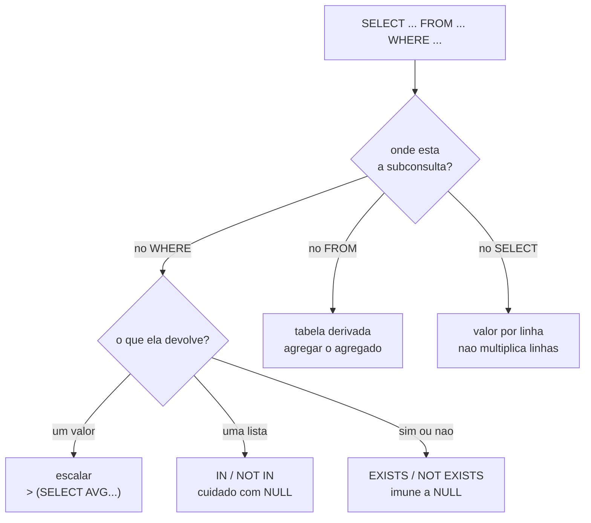

# 03.09 — Subconsultas

> **Módulo 03 — SQL** · Nível: N2 · Tempo estimado: 3h00 · Código: `codigo/cap09/`

## 1. Objetivo

- **Aplicar** subqueries em `WHERE` (com `IN`, `EXISTS`, comparação escalar).
- **Usar** subquery em `FROM` (tabela derivada) e em `SELECT` (valor calculado por linha).
- **Diferenciar** subquery correlacionada de não correlacionada, e o custo de cada uma.
- **Decidir** entre subquery e `JOIN` — quando cada uma comunica melhor a intenção.

Ao final, você paga duas dívidas antigas: *"o produto mais caro de cada categoria"* (pendente desde o 03.04) e o `NOT EXISTS` prometido no 03.08.

---

## 2. Pré-requisitos

- [03.08 — `JOIN` parte 2](08-join-parte-2-left-right-full.md) — **a dívida deste capítulo**: o `NOT EXISTS` como forma segura do anti-join.
- [03.05 — Funções de agregação](05-funcoes-de-agregacao.md) — subconsultas escalares quase sempre devolvem uma agregação.
- [03.03 — `SELECT` e `WHERE`](03-select-e-where.md) — o `NOT IN` com `NULL` volta aqui, e agora com consequência prática.

**Autoteste:** (1) O que `NOT IN` faz quando há um `NULL` na lista? (2) Como você calcularia "clientes que gastaram acima da média"? (3) Por que "o mais caro de cada categoria" não sai com `LIMIT`? As três se resolvem aqui.

---

## 3. Motivação

Você combina tabelas em qualquer direção e agrega por qualquer critério. E há uma classe de perguntas que continua fora de alcance — aquelas que precisam do **resultado de outra consulta** no meio do caminho.

*"Quais produtos custam acima da média?"* A média é um número que só se conhece **depois** de consultar. Você poderia rodar duas consultas — uma para descobrir a média, outra usando o valor —, mas aí o número fica congelado no código, e amanhã está errado.

*"Qual o produto mais caro de cada categoria?"* Esta pergunta está pendente desde o 03.04, que a identificou como impossível com `LIMIT` (que corta o resultado inteiro, não cada grupo), e desde o 03.06, que mostrou que o `GROUP BY` dá o **preço** máximo mas não o **nome** de quem o tem — pela regra de ouro.

*"Quais clientes nunca compraram?"* Você já sabe responder com anti-join. Mas o 03.08 deixou uma promessa: existe uma forma **mais segura**, que não depende de escolher a coluna certa para testar `IS NULL`.

O que todas têm em comum é a necessidade de **aninhar**: usar uma consulta dentro de outra. E o SQL permite isso em três lugares diferentes — no `WHERE`, no `FROM` e no `SELECT` —, cada um com um propósito e um custo.

---

## 4. Modelo mental

> 🧠 **Modelo mental**
> Uma subconsulta é uma consulta **entre parênteses** usada como se fosse um valor, uma lista ou uma tabela. O que ela devolve determina onde pode ser usada: **um valor** (uma linha, uma coluna) serve numa comparação; **uma lista** (várias linhas, uma coluna) serve num `IN`; **uma tabela** (várias linhas e colunas) serve num `FROM`. E há uma divisão que decide o custo: se a subconsulta **não menciona** a consulta externa, ela roda **uma vez**; se menciona, ela é *correlacionada* e roda **uma vez por linha** de fora.

**Exercício de previsão.** Duas consultas equivalentes em intenção:

```sql
-- (a)
SELECT nome FROM produtos WHERE preco_centavos > (SELECT AVG(preco_centavos) FROM produtos);

-- (b)
SELECT pr.nome FROM produtos pr
WHERE pr.preco_centavos = (SELECT MAX(preco_centavos) FROM produtos WHERE categoria = pr.categoria);
```

Sem rodar, decida: quantas vezes a subconsulta de cada uma é executada, sobre 12 produtos?

*Resposta comentada:* na **(a)**, **uma vez** — a subconsulta não menciona nada de fora, então o banco a calcula, guarda o número, e usa em todas as comparações. Na **(b)**, **até doze vezes** — ela menciona `pr.categoria`, da consulta externa, e portanto precisa ser recalculada para cada produto. Essa é a diferença entre subconsulta **não correlacionada** e **correlacionada**, e ela é a única coisa que separa uma consulta instantânea de uma que engasga com volume. Se você respondeu "uma vez" para as duas, a intuição está no lugar certo (parece que dá para calcular antes) e é justamente o que o `pr.categoria` impede.

---

## 5. Analogia

Pense em **preencher um formulário que exige uma consulta ao arquivo**.

Um campo pede "informe o valor médio dos contratos". Você vai ao arquivo, calcula a média uma vez, anota o número, e usa esse número em todos os campos que o pedirem. É a subconsulta **não correlacionada**: uma ida ao arquivo, resposta reaproveitada.

Outro campo, repetido em cada linha do formulário, pede "informe o maior contrato **do mesmo departamento desta linha**". Agora não há um número só: para cada linha, você precisa ir ao arquivo de novo, olhando o departamento daquela linha. É a subconsulta **correlacionada** — e a diferença de trabalho é evidente com cem linhas.

E há um terceiro uso: em vez de consultar um valor, você monta uma **planilha auxiliar** com totais por departamento e passa a trabalhar em cima dela. É a subconsulta no `FROM` — a tabela derivada.

**Onde a analogia quebra:** um funcionário humano perceberia que está repetindo a mesma consulta e memorizaria; o banco às vezes faz isso (o otimizador pode reescrever uma correlacionada como junção) e às vezes não. E há um detalhe que a analogia esconde: em SQL, a "planilha auxiliar" existe só durante a consulta — ela não é gravada em lugar nenhum.

---

## 6. Teoria

### Subconsulta escalar: um valor

Devolve **uma linha e uma coluna**. Usa-se onde um valor caberia.

```sql
SELECT nome, preco_centavos / 100.0 AS preco
FROM produtos
WHERE preco_centavos > (SELECT AVG(preco_centavos) FROM produtos)
ORDER BY preco_centavos DESC;
```

```text
nome                  | preco
----------------------+------
Monitor 24 polegadas  | 899.0
Fone Bluetooth XZ-9   | 469.9
Microfone Condensador | 459.0
Teclado Mecanico K2   | 329.0
Headset Gamer H7      | 279.0
```

Cinco de doze produtos acima da média (R$ 265,02). O número **não está no código** — ele é recalculado a cada execução, e o relatório continua correto quando os preços mudarem.

> ⚠️ **Atenção**
> Se uma subconsulta escalar devolver **mais de uma linha**, o banco erra em tempo de execução. Escreva `= (SELECT ...)` apenas quando tiver certeza de que o resultado é único — tipicamente porque é uma agregação (`MAX`, `AVG`, `COUNT`) ou porque há filtro por chave primária. Na dúvida, use `IN`, que aceita vários.

### Subconsulta de lista: `IN` e `NOT IN`

```sql
SELECT nome FROM clientes
WHERE id IN (SELECT cliente_id FROM pedidos WHERE status = 'cancelado');
```

```text
nome
---------
Ana Souza
```

E aqui volta, com consequência prática, a armadilha do 03.03:

```sql
-- Produtos nunca vendidos, via NOT IN
SELECT nome FROM produtos
WHERE id NOT IN (SELECT produto_id FROM itens_pedido);   -- funciona: 1 linha
```

Funciona porque `itens_pedido.produto_id` é `NOT NULL`. Se **um único** valor da lista fosse nulo:

```sql
SELECT COUNT(*) FROM produtos
WHERE id NOT IN (SELECT produto_id FROM itens_pedido UNION SELECT NULL);
```

```text
0
```

**Zero linhas**, em vez de uma. O motivo é a lógica de três valores: `id NOT IN (1, 2, NULL)` significa `id <> 1 AND id <> 2 AND id <> NULL`, e a última comparação é **desconhecida** — o `AND` inteiro nunca é verdadeiro.

> ⚠️ **Atenção**
> **Evite `NOT IN` com subconsulta**, a menos que a coluna seja comprovadamente `NOT NULL`. Prefira `NOT EXISTS`, que é imune ao problema. Este é um dos bugs mais difíceis de diagnosticar em SQL: a consulta funciona por meses e passa a devolver zero linhas no dia em que um `NULL` entra na coluna.

### `EXISTS` e `NOT EXISTS`

Não comparam valores — perguntam **se existe alguma linha**:

```sql
-- Quem nunca comprou (o NOT EXISTS prometido no 03.08)
SELECT c.nome FROM clientes c
WHERE NOT EXISTS (SELECT 1 FROM pedidos p WHERE p.cliente_id = c.id);
```

```text
nome
-------------
Rafael Torres
```

Três coisas para observar. O `SELECT 1` é convenção: como só importa **se existe** linha, o que se seleciona é irrelevante — escreve-se `1` para deixar claro que o valor não é usado. A subconsulta é **correlacionada** (menciona `c.id`). E ela é **imune a nulos**, porque não compara valor nenhum — é a razão de o `NOT EXISTS` ser a forma recomendada de responder pela ausência.

```sql
-- Quem já comprou algo de áudio
SELECT c.nome FROM clientes c
WHERE EXISTS (
    SELECT 1 FROM pedidos p
    JOIN itens_pedido i ON i.pedido_id = p.id
    JOIN produtos pr    ON pr.id = i.produto_id
    WHERE p.cliente_id = c.id AND pr.categoria = 'audio'
);
```

```text
(6 linhas)
```

Repare que o `EXISTS` **não multiplica linhas**: cada cliente aparece uma vez, mesmo tendo comprado cinco itens de áudio. É a vantagem sobre o `JOIN` quando a pergunta é "quem tem pelo menos um" — com junção, seria preciso `DISTINCT`.

### Subconsulta no `FROM`: tabela derivada

Quando o resultado de uma agregação precisa ser agregado de novo:

```sql
SELECT AVG(total_pedido) / 100.0 AS ticket_medio,
       COUNT(*)                  AS pedidos
FROM (
    SELECT p.id, SUM(i.quantidade * i.preco_unitario_centavos) AS total_pedido
    FROM pedidos p
    JOIN itens_pedido i ON i.pedido_id = p.id
    WHERE p.status = 'concluido'
    GROUP BY p.id
);
```

```text
ticket_medio       | pedidos
-------------------+--------
489.31764705882347 |      17
```

Duas etapas: a de dentro soma **por pedido**; a de fora tira a média **entre pedidos**. É a resposta para o problema de granularidade do 03.05 — não dá para calcular ticket médio numa consulta só, porque as duas operações acontecem em níveis diferentes.

📌 **Dialeto:** PostgreSQL e MySQL **exigem** apelido na tabela derivada (`) AS t`); o SQLite não. Escreva o apelido sempre — é portável e legível.

### Subconsulta no `SELECT`: valor por linha

```sql
SELECT c.nome,
       (SELECT COUNT(*)   FROM pedidos p WHERE p.cliente_id = c.id) AS pedidos,
       (SELECT MAX(p.data) FROM pedidos p WHERE p.cliente_id = c.id) AS ultima
FROM clientes c
ORDER BY pedidos DESC;
```

```text
nome             | pedidos | ultima
-----------------+---------+-----------
Fernanda Lima    |       5 | 2026-05-19
Ana Souza        |       4 | 2026-07-25
Carlos Menezes   |       3 | 2026-07-20
Beatriz Nogueira |       2 | 2026-07-12
```

Esta forma tem uma vantagem específica e importante: **cada subconsulta é independente**, então ela resolve o problema das duas tabelas filhas do 03.07 — itens e pagamentos podem ser agregados lado a lado sem se multiplicarem. O custo é que cada uma é correlacionada e roda por linha.

### A dívida do 03.04: o mais caro de cada categoria

```sql
SELECT pr.categoria, pr.nome, pr.preco_centavos / 100.0 AS preco
FROM produtos pr
WHERE pr.preco_centavos = (
    SELECT MAX(preco_centavos) FROM produtos WHERE categoria = pr.categoria
)
ORDER BY pr.categoria;
```

```text
categoria   | nome                 | preco
------------+----------------------+------
acessorios  | Hub USB-C 6 portas   | 129.9
audio       | Fone Bluetooth XZ-9  | 469.9
perifericos | Teclado Mecanico K2  | 329.0
video       | Monitor 24 polegadas | 899.0
```

A leitura: *"traga o produto cujo preço é igual ao maior preço da sua própria categoria"*. A correlação (`WHERE categoria = pr.categoria`) é o que torna "sua própria" possível.

Uma ressalva honesta: se **dois** produtos empatarem no preço máximo de uma categoria, os **dois** aparecem. Dependendo da pergunta, isso é o desejado ou não — e resolver o empate exige função de janela, que o módulo 04 apresenta.

### Correlacionada × não correlacionada

| | Não correlacionada | Correlacionada |
|---|---|---|
| Menciona a consulta externa? | não | **sim** |
| Executada | **uma vez** | uma vez por linha externa |
| Exemplo | `> (SELECT AVG(...) FROM produtos)` | `= (SELECT MAX(...) WHERE categoria = pr.categoria)` |
| Custo | baixo | proporcional às linhas externas |

### Subquery ou `JOIN`?

| Situação | Prefira |
|---|---|
| "quem tem **pelo menos um**" | `EXISTS` — não multiplica linhas |
| "quem **não tem**" | `NOT EXISTS` — imune a nulos |
| precisa de **colunas** das duas tabelas | `JOIN` |
| agregação em **dois níveis** | subquery no `FROM` |
| **duas** tabelas filhas agregadas | subquery no `SELECT` (ou CTE, 03.10) |
| comparar com um **valor calculado** | subquery escalar |

A regra que resume: se você precisa **de dados** da outra tabela, use `JOIN`; se precisa apenas **verificar uma condição** sobre ela, use `EXISTS`.

---

## 7. Funcionamento interno

Por dentro, na medida N2: o otimizador trata as duas famílias de forma bem diferente. A subconsulta **não correlacionada** é executada uma vez, antes da consulta externa, e o resultado é materializado — um valor escalar vira uma constante, uma lista vira uma estrutura de busca. Já a **correlacionada** seria, na leitura ingênua, um laço aninhado: uma execução por linha externa. Na prática, otimizadores modernos frequentemente a **reescrevem** — um `EXISTS` correlacionado costuma virar uma *semi-junção*, que percorre a tabela interna uma vez e marca as correspondências, com custo próximo ao de um `JOIN`. Daí duas consequências. Primeira: em PostgreSQL e SQL Server, `EXISTS` e `JOIN` com `DISTINCT` costumam gerar planos praticamente idênticos, e a escolha entre eles é de **legibilidade**, não de desempenho. Segunda: essa reescrita tem limites — subconsultas correlacionadas no `SELECT`, com agregação, são mais difíceis de otimizar, e são o caso em que a diferença de tempo aparece de verdade. O `EXPLAIN QUERY PLAN` (03.14) mostra o que o banco decidiu.

---

## 8. Visualização do fluxo

Onde cada tipo de subconsulta vive:



**Como ler:** os três ramos que saem do `WHERE` correspondem ao que a subconsulta **devolve** — e é isso que determina o operador. Repare que `F` traz a anotação "imune a `NULL`", enquanto `E` traz "cuidado": as duas respondem perguntas parecidas e têm comportamentos diferentes diante do desconhecido, e essa é a decisão mais consequente do capítulo. Os ramos `G` e `H` resolvem problemas que o `WHERE` não alcança: agregar em dois níveis e agregar duas tabelas filhas sem multiplicá-las.

---

## 9. Aplicação prática

**Passo 1 — Escalar: acima da média:**

```bash
python codigo/sql.py "SELECT nome, preco_centavos/100.0 AS preco FROM produtos WHERE preco_centavos > (SELECT AVG(preco_centavos) FROM produtos) ORDER BY preco_centavos DESC"
```

Cinco produtos. A média (R$ 265,02) nunca aparece no código — e é recalculada a cada execução.

**Passo 2 — Lista com `IN`:**

```bash
python codigo/sql.py "SELECT nome FROM clientes WHERE id IN (SELECT cliente_id FROM pedidos WHERE status = 'cancelado')"
```

```text
nome
---------
Ana Souza
```

**Passo 3 — A armadilha do `NOT IN`:**

```bash
python codigo/sql.py "SELECT COUNT(*) FROM produtos WHERE id NOT IN (SELECT produto_id FROM itens_pedido)"
python codigo/sql.py "SELECT COUNT(*) FROM produtos WHERE id NOT IN (SELECT produto_id FROM itens_pedido UNION SELECT NULL)"
```

```text
1          ← correto: o Mousepad
0          ← um NULL na lista, e o resultado zera
```

Um único `NULL` transforma a resposta certa em resposta vazia. **Sem erro.**

**Passo 4 — `NOT EXISTS`, a forma segura:**

```bash
python codigo/sql.py "SELECT c.nome FROM clientes c WHERE NOT EXISTS (SELECT 1 FROM pedidos p WHERE p.cliente_id = c.id)"
```

```text
nome
-------------
Rafael Torres
```

Mesmo resultado do anti-join do 03.08, sem depender de escolher a coluna certa para testar `IS NULL`.

**Passo 5 — Tabela derivada: ticket médio:**

```bash
python codigo/sql.py "SELECT AVG(total_pedido)/100.0 AS ticket_medio, COUNT(*) AS pedidos FROM (SELECT p.id, SUM(i.quantidade*i.preco_unitario_centavos) AS total_pedido FROM pedidos p JOIN itens_pedido i ON i.pedido_id=p.id WHERE p.status='concluido' GROUP BY p.id) AS totais"
```

```text
ticket_medio       | pedidos
-------------------+--------
489.31764705882347 |      17
```

**Passo 6 — A dívida do 03.04:**

```bash
python codigo/sql.py codigo/cap09/aninhando.sql
```

O arquivo termina com o produto mais caro de cada categoria — pergunta que ficou pendente por cinco capítulos.

> 🎯 **Checkpoint rápido**
> De cabeça: por que `NOT IN` com um `NULL` na lista devolve zero linhas? E quantas vezes roda a subconsulta de `WHERE preco > (SELECT AVG(preco) FROM produtos)`?

---

## 10. Código comentado

Arquivo completo em [`codigo/cap09/aninhando.sql`](codigo/cap09/aninhando.sql).

```sql
-- ------------------------------------------------------------
-- aninhando.sql
-- Capítulo 03.09 — Subconsultas
-- O que este arquivo demonstra: subquery escalar, IN, EXISTS,
--   tabela derivada, a armadilha do NOT IN e a dívida do 03.04
-- Como executar: python codigo/sql.py codigo/cap09/aninhando.sql
-- ------------------------------------------------------------

-- [1] ESCALAR no WHERE: a média é calculada UMA vez, não fica no código
SELECT nome, preco_centavos / 100.0 AS preco
FROM produtos
WHERE preco_centavos > (SELECT AVG(preco_centavos) FROM produtos)
ORDER BY preco_centavos DESC;

-- [2] LISTA com IN: quem teve pedido cancelado
SELECT nome FROM clientes
WHERE id IN (SELECT cliente_id FROM pedidos WHERE status = 'cancelado');

-- [3] NOT IN funciona AQUI porque produto_id é NOT NULL -> 1 linha
SELECT nome AS nunca_vendido FROM produtos
WHERE id NOT IN (SELECT produto_id FROM itens_pedido);

-- [4] A ARMADILHA: um único NULL na lista -> ZERO linhas, sem erro.
--     id NOT IN (1,2,NULL) vira "id<>1 AND id<>2 AND id<>NULL",
--     e a última comparação é DESCONHECIDA (03.03)
SELECT COUNT(*) AS resultado_zerado FROM produtos
WHERE id NOT IN (SELECT produto_id FROM itens_pedido UNION SELECT NULL);

-- [5] NOT EXISTS: a forma SEGURA — não compara valores, logo
--     é imune a NULL. O SELECT 1 é convenção: o valor não é usado.
SELECT c.nome AS nunca_comprou FROM clientes c
WHERE NOT EXISTS (SELECT 1 FROM pedidos p WHERE p.cliente_id = c.id);

-- [6] EXISTS não multiplica linhas: cada cliente aparece UMA vez,
--     mesmo tendo comprado vários itens de áudio (com JOIN
--     precisaria de DISTINCT)
SELECT c.nome FROM clientes c
WHERE EXISTS (
    SELECT 1 FROM pedidos p
    JOIN itens_pedido i ON i.pedido_id = p.id
    JOIN produtos pr    ON pr.id = i.produto_id
    WHERE p.cliente_id = c.id AND pr.categoria = 'audio'
);

-- [7] TABELA DERIVADA: agregar o que já foi agregado.
--     De dentro para fora: soma por pedido -> média entre pedidos
SELECT AVG(total_pedido) / 100.0 AS ticket_medio,
       COUNT(*)                  AS pedidos
FROM (
    SELECT p.id, SUM(i.quantidade * i.preco_unitario_centavos) AS total_pedido
    FROM pedidos p
    JOIN itens_pedido i ON i.pedido_id = p.id
    WHERE p.status = 'concluido'
    GROUP BY p.id
) AS totais;

-- [8] Subquery no SELECT: cada uma é INDEPENDENTE, então duas
--     tabelas filhas não se multiplicam (o problema do 03.07)
SELECT c.nome,
       (SELECT COUNT(*)    FROM pedidos p WHERE p.cliente_id = c.id) AS pedidos,
       (SELECT MAX(p.data) FROM pedidos p WHERE p.cliente_id = c.id) AS ultima
FROM clientes c
ORDER BY pedidos DESC;

-- [9] A DÍVIDA DO 03.04: o produto mais caro de CADA categoria.
--     Correlacionada: "o maior preço da SUA PRÓPRIA categoria"
SELECT pr.categoria, pr.nome, pr.preco_centavos / 100.0 AS preco
FROM produtos pr
WHERE pr.preco_centavos = (
    SELECT MAX(preco_centavos) FROM produtos WHERE categoria = pr.categoria
)
ORDER BY pr.categoria;
```

O par [3]/[4] é o núcleo do capítulo, e vale executá-lo em sequência: **1** e **0**, da mesma pergunta, com a única diferença de um `NULL` na lista. É o bug mais difícil de diagnosticar do módulo, porque a consulta funciona por meses e passa a devolver vazio no dia em que o primeiro nulo entra na coluna — sem erro, sem alerta, sem relação aparente com nada que mudou.

O comando [9] fecha uma promessa de cinco capítulos. Repare que a solução não é nenhuma das que pareciam naturais: não é `LIMIT` (que corta o resultado inteiro), não é `GROUP BY` (que dá o preço mas não o nome). É a **correlação** — a subconsulta olhando para a categoria da linha externa.

---

## 11. Erros comuns

### Erro 1 — `NOT IN` com subconsulta que pode ter `NULL`

**Sintoma:** a consulta devolve **zero linhas** onde deveria devolver várias. Nenhum erro.
**Causa:** `x NOT IN (a, b, NULL)` expande para `x <> a AND x <> b AND x <> NULL`, e a última comparação é desconhecida — o `AND` nunca é verdadeiro.
**Correção:** use **`NOT EXISTS`**, que não compara valores e é imune. Se insistir no `NOT IN`, garanta a ausência de nulos com `WHERE coluna IS NOT NULL` dentro da subconsulta — mas a primeira opção é mais segura e comunica melhor a intenção.

### Erro 2 — Subconsulta escalar devolvendo várias linhas

**Sintoma:**

```text
Erro de SQL: sub-select returns 2 columns - expected 1
```

ou, em outros bancos, "more than one row returned by a subquery used as an expression".
**Causa:** usar `= (SELECT ...)` numa subconsulta que não garante uma linha só.
**Correção:** se a intenção é comparar com **vários** valores, troque `=` por `IN`. Se é com **um**, garanta a unicidade — agregação (`MAX`, `MIN`) ou filtro por chave primária. E note que este erro só aparece quando os dados produzem mais de uma linha: uma consulta com `= (SELECT ...)` pode funcionar em teste e falhar em produção.

### Erro 3 — Correlacionada onde uma junção resolveria

**Sintoma:** a consulta funciona e fica lenta quando a tabela cresce; o plano de execução mostra a subconsulta sendo executada milhares de vezes.
**Causa:** subconsulta correlacionada no `SELECT`, com agregação, sobre uma tabela grande.
**Correção:** quando você precisa de **um único** valor agregado por linha, uma junção com tabela derivada agregada costuma ser mais eficiente — e o 03.10 mostra a forma legível de escrevê-la, com CTE. A ressalva honesta: com **duas ou mais** agregações de tabelas filhas diferentes, a subconsulta no `SELECT` continua sendo a solução correta, porque a junção multiplicaria (03.07). Meça antes de reescrever.

---

## 12. Boas práticas

✅ **`NOT EXISTS` em vez de `NOT IN`** — imune a nulos, e comunica melhor "não existe".

✅ **`EXISTS` quando a pergunta é "tem pelo menos um"** — não multiplica linhas, dispensa `DISTINCT`.

✅ **`JOIN` quando você precisa das colunas; `EXISTS` quando só precisa verificar** — a regra que resolve a escolha.

✅ **Apelido em toda tabela derivada** — `) AS totais`; obrigatório em PostgreSQL e MySQL.

✅ **`SELECT 1` dentro de `EXISTS`** — deixa explícito que o valor não é usado.

❌ **Evite subconsulta escalar sem garantia de unicidade** — o erro só aparece quando os dados crescem.

❌ **Evite aninhar mais de dois níveis** — a legibilidade despenca; é exatamente o problema que as CTEs do 03.10 resolvem.

---

## 13. Performance

Nesta escala, irrelevante. Três notas para quando importar. A subconsulta **não correlacionada** é barata por construção: uma execução, resultado reaproveitado — e o otimizador frequentemente a materializa antes de tudo. A **correlacionada** é o caso a observar, e a boa notícia é que otimizadores modernos costumam reescrever `EXISTS` correlacionado como *semi-junção*, com custo próximo ao de um `JOIN`; em PostgreSQL, `EXISTS` e `JOIN` + `DISTINCT` geram planos praticamente iguais, e a escolha entre eles passa a ser de legibilidade. O caso que **não** se reescreve bem é a subconsulta correlacionada com agregação no `SELECT`: ali o banco realmente executa uma vez por linha, e com um milhão de linhas externas isso é um milhão de agregações. A alternativa, quando o volume exigir, é agregar uma vez numa tabela derivada e juntar — que é o padrão que o 03.10 torna legível. A lição transferível: **subconsulta não é lenta por natureza**; o que custa é a correlação com agregação, e reconhecer esse caso específico vale mais que evitar subconsultas por precaução.

---

## 14. Mercado

> 🏢 **Mercado**
> Subconsultas aparecem em praticamente todo teste prático de SQL de nível pleno, e a pergunta sobre `NOT IN` × `NOT EXISTS` é um clássico — porque separa quem entende a lógica de três valores de quem decorou sintaxe. O bug do `NOT IN` com nulos é real e caro: ele derruba relatórios em produção meses depois de escritos, e o sintoma (zero linhas) é frequentemente confundido com "não há dados". Em revisão de código, `NOT IN` com subconsulta é achado automático. E o `EXISTS` tem um uso que vale conhecer: em verificações de permissão e regras de negócio ("este usuário tem acesso a este recurso?"), ele é a construção padrão, porque responde sim/não sem trazer dados.
>
> **Mini-cenário:** a consulta do produto mais caro por categoria é a base de uma vitrine de "destaques". No módulo 04 você vai reescrevê-la com função de janela, que resolve o empate de forma explícita; no 06 ela vira um endpoint. A versão com subconsulta correlacionada que você escreveu hoje é a que funciona em qualquer banco, inclusive nos que não têm janelas.

---

## 15. Entrevistas

**P1. "Qual a diferença entre subconsulta correlacionada e não correlacionada?"**
*Resposta esperada:* a não correlacionada **não menciona** a consulta externa e é executada **uma vez**; a correlacionada menciona, e é avaliada **por linha externa**. Exemplo de cada uma vale mais que a definição. Complemento que separa: otimizadores modernos frequentemente reescrevem `EXISTS` correlacionado como semi-junção, então "correlacionada é lenta" é uma simplificação — o caso realmente caro é a correlacionada com agregação no `SELECT`.

**P2. "Por que preferir `NOT EXISTS` a `NOT IN`?"**
*Resposta esperada:* porque `NOT IN` com um `NULL` na lista devolve **zero linhas**, sempre — `x NOT IN (a, NULL)` expande para uma conjunção que inclui `x <> NULL`, que é desconhecido. `NOT EXISTS` não compara valores, apenas verifica existência, e é imune. Citar que o bug é silencioso (nenhum erro, resultado plausível) demonstra que a pessoa já o encontrou.

**P3. "Quando usar `JOIN` e quando usar subconsulta?"**
*Resposta esperada:* `JOIN` quando você precisa de **colunas** da outra tabela; `EXISTS` quando precisa apenas **verificar uma condição** (e com a vantagem de não multiplicar linhas). Subconsulta no `FROM` para agregação em dois níveis; subconsulta no `SELECT` quando há **duas** tabelas filhas a agregar, porque a junção as multiplicaria. Amarrar cada escolha a um problema concreto é o que se avalia.

**Pegadinha clássica: "Esta consulta funcionou por dois anos e hoje devolve zero linhas. Nada no código mudou."**

```sql
SELECT * FROM produtos
WHERE id NOT IN (SELECT produto_id FROM itens_pedido);
```

Ela é excelente porque a informação decisiva **não está na consulta** — está nos dados. A resposta forte começa pela hipótese certa: **apareceu um `NULL`** na coluna `produto_id`. A explicação do mecanismo: `NOT IN` expande para uma conjunção de desigualdades, e `id <> NULL` é **desconhecido**; um `AND` com desconhecido nunca é verdadeiro, então **nenhuma** linha passa — independentemente de quantos produtos existam. O diagnóstico prático é uma consulta de uma linha: `SELECT COUNT(*) FROM itens_pedido WHERE produto_id IS NULL`. E as correções, em ordem de qualidade: **(1)** reescrever com `NOT EXISTS`, que é imune e comunica melhor; **(2)** acrescentar `WHERE produto_id IS NOT NULL` na subconsulta, que resolve o sintoma; **(3)** a correção estrutural — declarar a coluna `NOT NULL`, se a regra de negócio permitir, eliminando a classe inteira de problema (03.13). O movimento que impressiona é apontar que o defeito **não é da consulta**: ela sempre esteve errada, e apenas não tinha como se manifestar. Consultas assim são bombas com temporizador ligado à qualidade dos dados, e é por isso que `NOT IN` com subconsulta é achado automático em revisão.

---

## 16. Exercícios guiados

Enunciados completos em [`exercicios/cap09.md`](exercicios/cap09.md); gabaritos em [`exercicios/gabaritos/cap09.md`](exercicios/gabaritos/cap09.md).

### Aquecimento

- **A1** `[~10 min · onde vai a subconsulta?]` — 6 perguntas: `WHERE`, `FROM` ou `SELECT`?
- **A2** `[~10 min · correlacionada?]` — 6 subconsultas: quantas vezes cada uma roda?
- **A3** `[~10 min · `IN`, `EXISTS` ou escalar?]` — 6 situações: qual operador?
- **A4** `[~10 min · ache o bug]` — 6 consultas com problema de subconsulta.

### Aplicação

- **AP1** `[~25 min · as três posições]` — Escreva a mesma pergunta com subquery no `WHERE`, no `FROM` e no `SELECT`.
- **AP2** `[~20 min · `NOT IN` × `NOT EXISTS`]` — Reproduza a armadilha e meça as duas formas.
- **AP3** `[~25 min · subquery × `JOIN`]` — Cinco perguntas escritas das duas formas, com a justificativa da escolha.

---

## 17. Desafios

- **D1** `[~50 min · o painel de destaques]` — **Perguntas que exigem aninhamento.** Produza cinco consultas que só se resolvem com subconsulta: (a) produtos acima da média de preço **da sua própria categoria** (não da média geral); (b) o produto mais caro de cada categoria, com o nome; (c) clientes que gastaram acima da média de gasto dos clientes; (d) clientes que compraram **todos** os produtos de alguma categoria — ou, se nenhum, demonstre que a consulta está correta devolvendo vazio; (e) o pedido de maior valor de cada cliente. Para cada uma: identifique se a subconsulta é correlacionada, diga quantas vezes ela roda, e escreva a versão com `JOIN` quando existir. Fecho: 5 linhas sobre quando o aninhamento ajuda a legibilidade e quando a prejudica.

<details><summary>💡 Dica 1 (conceito)</summary>
No item (a), a correlação é a mesma do "mais caro de cada categoria": `AVG(...) FROM produtos WHERE categoria = pr.categoria`.
</details>
<details><summary>💡 Dica 2 (estratégia)</summary>
No item (d), "comprou todos" se escreve como "não existe produto da categoria que ele não tenha comprado" — `NOT EXISTS` dentro de `NOT EXISTS`. É difícil de propósito.
</details>
<details><summary>💡 Dica 3 (esqueleto)</summary>
Cada item: pergunta → SQL → correlacionada? quantas execuções? → versão com JOIN (ou "não existe") → reflexão.
</details>

---

## 18. Mini projeto

**A caixa de ferramentas do aninhamento** `[~50 min]`

Requisitos numerados:

1. Escreva **dez** perguntas de negócio sobre a Aurora que exijam o resultado de uma consulta dentro de outra.
2. Classifique cada uma **antes** de escrever o SQL: precisa de valor escalar, de lista, de verificação de existência, ou de tabela derivada?
3. Escreva as dez consultas, aplicando a classificação.
4. Para cada uma, marque se a subconsulta é correlacionada e estime quantas vezes ela roda no laboratório.
5. Reescreva **três** delas com `JOIN` e compare: qual versão comunica melhor a intenção? Registre a sua escolha e o motivo.

**Critério de "está bom":** o passo 2 é o critério, e ele é a habilidade real do capítulo. A sintaxe das subconsultas é pequena; o que é difícil é **reconhecer qual formato a pergunta pede** — e classificar antes de escrever força esse reconhecimento. O passo 5 tem uma resposta que costuma surpreender: em pelo menos uma das três, a versão com `JOIN` vai ficar melhor, e admitir isso é mais valioso que defender a subconsulta. A ferramenta certa depende da pergunta, não da que você acabou de aprender.

---

## 19. Revisão

**Resumo do capítulo:**

- Subconsulta = consulta entre parênteses usada como **valor**, **lista** ou **tabela**.
- **Escalar** (1 linha, 1 coluna) → comparação: `> (SELECT AVG(...))`.
- **Lista** → `IN` / `NOT IN`. **`NOT IN` com um `NULL` na lista devolve ZERO linhas.**
- **`EXISTS` / `NOT EXISTS`** → verificam existência; **imunes a `NULL`**; não multiplicam linhas.
- **No `FROM`** → tabela derivada: agregar o que já foi agregado (ticket médio).
- **No `SELECT`** → valor por linha; resolve o problema das **duas tabelas filhas** (03.07).
- **Correlacionada** menciona a externa e roda **por linha**; não correlacionada roda **uma vez**.
- `JOIN` quando precisa de **colunas**; `EXISTS` quando precisa **verificar**.
- A dívida do 03.04: "o mais caro de cada categoria" = subconsulta **correlacionada** com `MAX`.

**Flashcards novos** (adicionados a [`revisao/flashcards.md`](revisao/flashcards.md)):

| ID | Frente | Verso |
|---|---|---|
| 03.09-F1 | Por que `NOT IN` com um `NULL` na lista devolve zero linhas? | Expande para `x <> a AND x <> b AND x <> NULL`; a última é **desconhecida**, e o `AND` nunca é verdadeiro. Use **`NOT EXISTS`**, que é imune. |
| 03.09-F2 | Explique com suas palavras: correlacionada × não correlacionada. | (Elaboração) A não correlacionada **não menciona** a consulta externa → roda **uma vez**. A correlacionada menciona → roda **por linha externa**. |
| 03.09-F3 | Preveja: `WHERE preco > (SELECT AVG(preco) FROM produtos)`, 12 produtos. Quantas vezes a subconsulta roda? | (Previsão) **Uma** — não é correlacionada. Já `= (SELECT MAX(...) WHERE categoria = pr.categoria)` rodaria até 12 vezes. |
| 03.09-F4 | Quando usar `JOIN` e quando usar `EXISTS`? | (Decisão) `JOIN` quando precisa de **colunas** da outra tabela; `EXISTS` quando só precisa **verificar** uma condição — e com a vantagem de não multiplicar linhas. |
| 03.09-F5 | Como obter "o mais caro de cada categoria", com o nome? | Subconsulta **correlacionada**: `WHERE preco = (SELECT MAX(preco) FROM produtos WHERE categoria = pr.categoria)`. `GROUP BY` daria o preço, não o nome. |

**Agendamento:** registre no `PROGRESSO.md` e marque D+1, D+7, D+30, D+90 na [`Revisoes/agenda.md`](../Revisoes/agenda.md).

---

## 20. Checklist

Perguntas de domínio — teste do sim:

- [ ] Sei escolher *entre subquery no `WHERE`, no `FROM` e no `SELECT` conforme a pergunta*?
- [ ] Sei explicar *por que `NOT IN` com `NULL` zera o resultado*?
- [ ] Sei identificar *se uma subconsulta é correlacionada e prever quantas vezes roda*?
- [ ] Sei decidir *entre `JOIN` e `EXISTS` pela regra "colunas × verificação"*?
- [ ] Sei responder *à pegadinha da consulta que funcionou por dois anos*?

Itens práticos:

- [ ] Rodei `aninhando.sql` e vi **1** e **0** nos comandos [3] e [4].
- [ ] Escrevi o `NOT EXISTS` e confirmei que dá o mesmo resultado do anti-join.
- [ ] Resolvi a dívida do 03.04 com correlação.
- [ ] Completei "A caixa de ferramentas do aninhamento" — com a classificação feita antes.
- [ ] Registrei a sessão e agendei as 4 revisões.

---

## 21. Próximo capítulo

Você aninha consultas — e as consultas começam a ficar difíceis de ler. Uma subconsulta é elegante; duas aninhadas exigem esforço; três são um problema de manutenção. E há perguntas que precisam de **etapas**: calcule o total por pedido, depois a média por cliente, depois compare com a média geral — três níveis que, escritos com parênteses dentro de parênteses, viram algo que ninguém entende em dois meses. Ficou deliberadamente em aberto a construção que dá **nome** a cada etapa e permite lê-las de cima para baixo, como um roteiro: as CTEs. O próximo capítulo mostra como transformar uma consulta ilegível numa sequência de passos nomeados — e por que legibilidade em SQL é critério de engenharia, não de estética.

→ [03.10 — CTEs (`WITH`)](10-ctes-with.md)

---

*Gerado sob spec 3.0.0*
