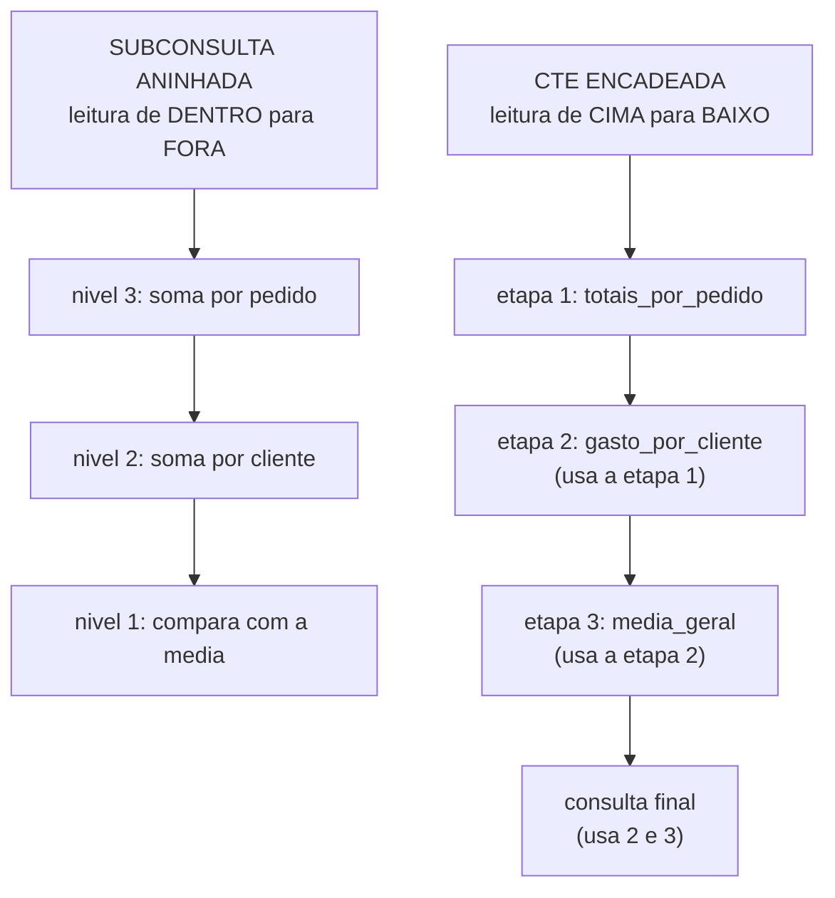

# 03.10 — CTEs (`WITH`)

> **Módulo 03 — SQL** · Nível: N2 · Tempo estimado: 2h30 · Código: `codigo/cap10/`

## 1. Objetivo

- **Refatorar** consultas aninhadas em etapas nomeadas com `WITH`.
- **Justificar** a legibilidade como critério de engenharia, não de estética.
- **Encadear** múltiplas CTEs, construindo o raciocínio de cima para baixo.
- **Reconhecer** os limites: CTE não é variável, e nem toda consulta melhora ao ser quebrada.

Ao final, você transforma uma consulta que ninguém lê num roteiro de passos com nome — e resolve, de forma limpa, o problema das duas tabelas filhas que persegue o módulo desde o 03.07.

---

## 2. Pré-requisitos

- [03.09 — Subconsultas](09-subconsultas.md) — **a dívida deste capítulo**: o aninhamento funciona e fica ilegível; e a subconsulta **não pode ser reaproveitada**.
- [01.18 — Funções parte 1](../01-Python/18-funcoes-parte-1.md) — dar nome a um trecho para poder reusá-lo e lê-lo; a ideia é a mesma.

**Autoteste:** (1) Por que você extrai uma função em Python? (2) O que acontece quando o mesmo cálculo aparece duas vezes numa consulta? (3) Como você calcularia "quanto cada cliente representa do faturamento total"? A terceira exige usar o mesmo resultado duas vezes.

---

## 3. Motivação

O capítulo anterior terminou com uma consulta assim:

```sql
SELECT AVG(total_pedido) / 100.0 AS ticket_medio, COUNT(*) AS pedidos
FROM (
    SELECT p.id, SUM(i.quantidade * i.preco_unitario_centavos) AS total_pedido
    FROM pedidos p JOIN itens_pedido i ON i.pedido_id = p.id
    WHERE p.status = 'concluido'
    GROUP BY p.id
) AS totais;
```

Ela funciona, e já exige que você leia **de dentro para fora** — comece na linha 4, entenda o que ela produz, volte à linha 1. Com dois níveis, é desconfortável. Com três, torna-se um problema de manutenção real: alguém abre a consulta seis meses depois e leva vinte minutos para entender o que ela faz.

E há um limite que nenhuma dose de disciplina resolve: **a subconsulta não pode ser reaproveitada**. Se o mesmo cálculo aparece em dois lugares da consulta — o gasto de cada cliente, e o total geral que é a soma desses gastos —, ele precisa ser **escrito duas vezes**. Duas cópias que fazem a mesma coisa e que vão divergir na primeira manutenção, porque alguém vai corrigir uma e esquecer a outra.

A CTE (*Common Table Expression*, ou expressão de tabela comum) resolve os dois problemas com um mecanismo simples: **dar nome a uma consulta antes de usá-la**. O que era um parêntese anônimo no meio do `FROM` vira uma etapa com nome, declarada no topo, que se lê de cima para baixo e pode ser referenciada quantas vezes for preciso.

Este é o capítulo mais curto do bloco de consultas, e um dos que mais muda a qualidade do que você escreve.

---

## 4. Modelo mental

> 🧠 **Modelo mental**
> Uma CTE é uma **tabela temporária com nome, que existe só durante a consulta**. Você declara `WITH nome AS (consulta)` e, dali em diante, `nome` pode ser usado como se fosse uma tabela — no `FROM`, num `JOIN`, dentro de outra CTE. É exatamente o que uma função faz em Python (01.18): dá nome a um trecho para que ele possa ser **lido** e **reusado**. E a mudança mais visível é a ordem de leitura: em vez de decifrar de dentro para fora, você lê **de cima para baixo**, um passo por vez.

**Exercício de previsão.** Duas consultas produzem o mesmo resultado — uma com subconsulta no `FROM`, outra com CTE. Sem rodar, decida: (a) o desempenho difere? (b) a CTE pode ser usada duas vezes na mesma consulta? (c) a subconsulta pode?

*Resposta comentada:* (a) **em geral, não** — na maioria dos bancos modernos a CTE é apenas outra forma de escrever a mesma coisa, e o otimizador gera o mesmo plano; a diferença é de legibilidade. (b) **Sim** — e é a vantagem decisiva: uma CTE declarada uma vez pode ser referenciada em vários pontos. (c) **Não** — a subconsulta no `FROM` existe apenas naquele ponto; para usá-la de novo, é preciso repetir o texto inteiro. Se você respondeu que a CTE é mais lenta, está pensando numa ressalva que já foi verdadeira em versões antigas de PostgreSQL, e que a seção 13 explica.

---

## 5. Analogia

Pense na diferença entre uma **frase com muitas orações encaixadas** e uma **receita numerada**.

A subconsulta aninhada é a frase: *"calcule a média dos totais dos pedidos concluídos que somam os itens de cada pedido"*. Está tudo lá, é gramaticalmente correta, e você precisa lê-la duas ou três vezes para saber onde começa cada parte.

A CTE é a receita: *"**passo 1**: some os itens de cada pedido concluído — chame isso de totais por pedido. **Passo 2**: tire a média dos totais por pedido."* Mesma informação, mesma quantidade de texto, e um leitor entende na primeira passada — porque cada etapa **tem nome** e as etapas vêm na ordem em que acontecem.

E há a vantagem que só a receita tem: se dois passos usam "a massa preparada no passo 1", ela é preparada **uma vez** e referenciada duas. Na versão em frase única, você precisaria descrever o preparo da massa duas vezes.

**Onde a analogia quebra:** os passos de uma receita acontecem em ordem; as CTEs são declaradas em ordem mas executadas conforme o otimizador decidir — inclusive fora de ordem, ou nem executadas, se o resultado não for usado. E há um detalhe que a analogia esconde: uma CTE não guarda nada. Ela existe só durante a consulta, e a próxima consulta não a conhece.

---

## 6. Teoria

### A forma

```sql
WITH nome_da_etapa AS (
    SELECT ...
)
SELECT ... FROM nome_da_etapa ...;
```

A mesma consulta do 03.09, reescrita:

```sql
WITH totais_por_pedido AS (
    SELECT p.id AS pedido_id,
           p.cliente_id,
           SUM(i.quantidade * i.preco_unitario_centavos) AS total_centavos
    FROM pedidos p
    JOIN itens_pedido i ON i.pedido_id = p.id
    WHERE p.status = 'concluido'
    GROUP BY p.id, p.cliente_id
)
SELECT AVG(total_centavos) / 100.0 AS ticket_medio,
       COUNT(*)                    AS pedidos
FROM totais_por_pedido;
```

```text
ticket_medio       | pedidos
-------------------+--------
489.31764705882347 |      17
```

**Mesmo número** da versão com subconsulta. O que mudou é que a etapa tem nome (`totais_por_pedido`), a leitura é de cima para baixo, e a consulta final ficou com duas linhas legíveis.

### Encadeando etapas

Uma CTE pode usar as anteriores — e é aí que a construção se paga:

```sql
WITH totais_por_pedido AS (
    SELECT p.id AS pedido_id, p.cliente_id,
           SUM(i.quantidade * i.preco_unitario_centavos) AS total_centavos
    FROM pedidos p
    JOIN itens_pedido i ON i.pedido_id = p.id
    WHERE p.status = 'concluido'
    GROUP BY p.id, p.cliente_id
),
gasto_por_cliente AS (
    SELECT cliente_id,
           SUM(total_centavos) AS gasto_centavos,
           COUNT(*)            AS pedidos
    FROM totais_por_pedido
    GROUP BY cliente_id
),
media_geral AS (
    SELECT AVG(gasto_centavos) AS media FROM gasto_por_cliente
)
SELECT c.nome,
       g.pedidos,
       g.gasto_centavos / 100.0 AS gasto,
       ROUND(g.gasto_centavos - (SELECT media FROM media_geral), 0) / 100.0 AS acima_da_media
FROM gasto_por_cliente g
JOIN clientes c ON c.id = g.cliente_id
ORDER BY gasto DESC;
```

```text
nome             | pedidos | gasto  | acima_da_media
-----------------+---------+--------+---------------
Carlos Menezes   |       3 | 2528.4 |        1340.06
Fernanda Lima    |       5 | 1812.2 |         623.86
Ana Souza        |       3 |  988.6 |        -199.74
...
```

Três etapas, três nomes, uma leitura linear: *somar por pedido → somar por cliente → comparar com a média*. Escrita com subconsultas, seria um aninhamento de três níveis que exigiria leitura de dentro para fora.

Repare na vírgula entre as CTEs, e no `WITH` que aparece **uma vez só**, no início. É a fonte do erro de sintaxe mais comum do capítulo.

### O reuso — a vantagem que a subconsulta não tem

```sql
WITH gasto AS (
    SELECT p.cliente_id, SUM(i.quantidade * i.preco_unitario_centavos) AS total
    FROM pedidos p JOIN itens_pedido i ON i.pedido_id = p.id
    WHERE p.status = 'concluido'
    GROUP BY p.cliente_id
)
SELECT c.nome,
       g.total / 100.0 AS gasto,
       ROUND(g.total * 100.0 / (SELECT SUM(total) FROM gasto), 1) AS pct_do_total
FROM gasto g
JOIN clientes c ON c.id = g.cliente_id
ORDER BY gasto DESC;
```

```text
nome             | gasto  | pct_do_total
-----------------+--------+-------------
Carlos Menezes   | 2528.4 |         30.4
Fernanda Lima    | 1812.2 |         21.8
Ana Souza        |  988.6 |         11.9
...
```

A CTE `gasto` é usada **duas vezes**: no `FROM` e dentro da subconsulta do percentual. Com tabela derivada, o bloco inteiro teria que ser escrito duas vezes — e as duas cópias divergiriam no dia em que alguém acrescentasse um filtro a uma delas.

### A solução limpa para as duas tabelas filhas

O problema que persegue o módulo desde o 03.07 — agregar itens e pagamentos sem que se multipliquem — tem aqui a forma canônica:

```sql
WITH itens AS (
    SELECT pedido_id,
           SUM(quantidade * preco_unitario_centavos) AS total_itens,
           COUNT(*)                                  AS qtd_itens
    FROM itens_pedido GROUP BY pedido_id
)
SELECT p.id, p.status, i.qtd_itens, i.total_itens / 100.0 AS valor
FROM pedidos p
JOIN itens i ON i.pedido_id = p.id
ORDER BY valor DESC;
```

Cada tabela filha é agregada **na sua própria CTE**, e só depois se junta ao pai — já reduzida a uma linha por pedido. Com uma segunda filha (`pagamentos`), acrescenta-se uma segunda CTE e um segundo `JOIN`, e nada se multiplica. É a resposta definitiva à pegadinha do 03.07.

### CTE recursiva

Uma CTE pode referenciar **a si mesma**, o que permite percorrer hierarquias e gerar sequências:

```sql
WITH RECURSIVE contagem(n) AS (
    SELECT 1                                   -- caso base
    UNION ALL
    SELECT n + 1 FROM contagem WHERE n < 5     -- passo recursivo
)
SELECT n FROM contagem;
```

```text
n
-
1
2
3
4
5
```

> 📌 **Dialeto e escopo**
> A recursão tem duas partes, como toda recursão: o **caso base** e o **passo**, unidos por `UNION ALL`. O uso real é percorrer estruturas de árvore — organograma, categorias com subcategorias, lista de materiais. **A palavra `RECURSIVE` é exigida** por SQLite e PostgreSQL, e **proibida** pelo SQL Server (que usa só `WITH`). O assunto é apresentado aqui como reconhecimento — quando você encontrar uma hierarquia no módulo 10, vai saber que a ferramenta existe. E o alerta que acompanha: **sem condição de parada, a recursão não termina**.

### O que a CTE **não** é

Três limites que evitam frustração:

- **Não é variável.** Ela guarda um **conjunto de linhas**, não um valor solto. Para usar um número escalar, ainda é preciso `(SELECT coluna FROM cte)`.
- **Não persiste.** Existe apenas durante a consulta; a próxima não a enxerga. Para persistir, é `VIEW` (que o 03.12 menciona) ou tabela.
- **Não é executada uma vez por garantia.** Se você referencia a CTE duas vezes, o banco **pode** calculá-la duas vezes — a menos que decida materializar. Isso não afeta o resultado, só o desempenho, e a seção 13 detalha.

### Quando **não** usar

CTE é uma ferramenta de legibilidade, e legibilidade tem ponto ótimo. Quebrar uma consulta simples em três etapas nomeadas a torna **mais** difícil de ler, não menos — o leitor precisa percorrer três blocos para entender algo que cabia em quatro linhas. A regra prática: use CTE quando houver **uma etapa com nome próprio** (algo que você conseguiria explicar numa frase), ou quando o mesmo resultado for usado mais de uma vez. Para uma junção com filtro, escreva a junção com filtro.

---

## 7. Funcionamento interno

Por dentro, na medida N2: o tratamento das CTEs mudou bastante e vale conhecer a história, porque ela explica conselhos contraditórios que circulam. Durante muitos anos, o **PostgreSQL até a versão 11** tratava toda CTE como uma **barreira de otimização**: ela era materializada (calculada e guardada em memória) antes do resto, e o otimizador não podia empurrar filtros da consulta externa para dentro dela. Isso significava que `WITH t AS (SELECT * FROM tabela_enorme) SELECT * FROM t WHERE id = 5` lia a tabela inteira, enquanto a versão com subconsulta filtraria direto — e daí veio a fama de "CTE é mais lenta". **Da versão 12 em diante**, o PostgreSQL passou a *incorporar* a CTE por padrão quando ela é usada uma única vez, gerando o mesmo plano da subconsulta; e oferece `MATERIALIZED` / `NOT MATERIALIZED` para controlar explicitamente. SQLite e SQL Server sempre incorporaram. A consequência prática para hoje: **escreva pela legibilidade**, e se uma consulta com CTE ficar lenta num PostgreSQL antigo, saiba que a causa pode ser essa — e que `EXPLAIN` (03.14) mostra se houve materialização.

---

## 8. Visualização do fluxo

Aninhamento contra encadeamento:



**Como ler:** os dois caminhos produzem o mesmo resultado, e a diferença está na **direção da leitura**. À esquerda, você precisa achar o nível mais interno e subir; o nome de cada etapa não existe, então é preciso reconstruir mentalmente o que cada parêntese produz. À direita, cada etapa tem nome e vem na ordem em que o raciocínio acontece — e a última caixa mostra a vantagem exclusiva: a consulta final usa **duas** etapas anteriores, coisa que o aninhamento não permite sem repetir texto.

---

## 9. Aplicação prática

**Passo 1 — A mesma consulta, agora legível:**

```bash
python codigo/sql.py "WITH totais_por_pedido AS (SELECT p.id AS pedido_id, SUM(i.quantidade*i.preco_unitario_centavos) AS total_centavos FROM pedidos p JOIN itens_pedido i ON i.pedido_id=p.id WHERE p.status='concluido' GROUP BY p.id) SELECT AVG(total_centavos)/100.0 AS ticket_medio, COUNT(*) AS pedidos FROM totais_por_pedido"
```

```text
ticket_medio       | pedidos
-------------------+--------
489.31764705882347 |      17
```

Compare com o valor do 03.09: **idêntico**. A CTE não mudou o que a consulta faz — mudou quem consegue lê-la.

**Passo 2 — Três etapas encadeadas:**

```bash
python codigo/sql.py codigo/cap10/etapas.sql
```

O arquivo contém a consulta de três CTEs da seção 6, e a saída mostra cada cliente comparado à média de gasto.

**Passo 3 — O reuso:**

```bash
python codigo/sql.py "WITH gasto AS (SELECT p.cliente_id, SUM(i.quantidade*i.preco_unitario_centavos) AS total FROM pedidos p JOIN itens_pedido i ON i.pedido_id=p.id WHERE p.status='concluido' GROUP BY p.cliente_id) SELECT c.nome, g.total/100.0 AS gasto, ROUND(g.total*100.0/(SELECT SUM(total) FROM gasto),1) AS pct FROM gasto g JOIN clientes c ON c.id=g.cliente_id ORDER BY gasto DESC"
```

```text
nome             | gasto  | pct
-----------------+--------+-----
Carlos Menezes   | 2528.4 | 30.4
Fernanda Lima    | 1812.2 | 21.8
Ana Souza        |  988.6 | 11.9
```

A CTE `gasto` aparece duas vezes no texto da consulta e foi escrita **uma**.

**Passo 4 — A recursiva, para reconhecer:**

```bash
python codigo/sql.py "WITH RECURSIVE contagem(n) AS (SELECT 1 UNION ALL SELECT n+1 FROM contagem WHERE n < 5) SELECT n FROM contagem"
```

```text
n
-
1
2
3
4
5
```

Cinco linhas geradas do nada — sem tabela nenhuma. Guarde o mecanismo; o uso real (hierarquias) aparece no módulo 10.

**Passo 5 — O erro de sintaxe que todo mundo comete:**

Escreva `WITH a AS (...) WITH b AS (...)` e veja o erro. O `WITH` aparece **uma vez**; as CTEs seguintes são separadas por **vírgula**.

> 🎯 **Checkpoint rápido**
> De cabeça: qual a vantagem da CTE que a subconsulta no `FROM` não tem? E por que "CTE é mais lenta" era verdade e deixou de ser?

---

## 10. Código comentado

Arquivo completo em [`codigo/cap10/etapas.sql`](codigo/cap10/etapas.sql).

```sql
-- ------------------------------------------------------------
-- etapas.sql
-- Capítulo 03.10 — CTEs (WITH)
-- O que este arquivo demonstra: a mesma consulta antes e depois,
--   o encadeamento de etapas, o reuso e a CTE recursiva
-- Como executar: python codigo/sql.py codigo/cap10/etapas.sql
-- ------------------------------------------------------------

-- [1] ANTES (03.09): subconsulta no FROM — leitura de dentro pra fora
SELECT AVG(total_pedido) / 100.0 AS ticket_medio, COUNT(*) AS pedidos
FROM (
    SELECT p.id, SUM(i.quantidade * i.preco_unitario_centavos) AS total_pedido
    FROM pedidos p JOIN itens_pedido i ON i.pedido_id = p.id
    WHERE p.status = 'concluido'
    GROUP BY p.id
) AS totais;

-- [2] DEPOIS: a etapa ganhou NOME e a leitura virou de cima pra baixo.
--     Mesmo resultado — 489.3176... — a CTE não muda o que a consulta faz.
WITH totais_por_pedido AS (
    SELECT p.id AS pedido_id,
           SUM(i.quantidade * i.preco_unitario_centavos) AS total_centavos
    FROM pedidos p
    JOIN itens_pedido i ON i.pedido_id = p.id
    WHERE p.status = 'concluido'
    GROUP BY p.id
)
SELECT AVG(total_centavos) / 100.0 AS ticket_medio,
       COUNT(*)                    AS pedidos
FROM totais_por_pedido;

-- [3] ENCADEAMENTO: WITH aparece UMA vez; as demais vêm por VÍRGULA.
--     Leia como um roteiro: por pedido -> por cliente -> vs. média
WITH totais_por_pedido AS (
    SELECT p.id AS pedido_id, p.cliente_id,
           SUM(i.quantidade * i.preco_unitario_centavos) AS total_centavos
    FROM pedidos p
    JOIN itens_pedido i ON i.pedido_id = p.id
    WHERE p.status = 'concluido'
    GROUP BY p.id, p.cliente_id
),
gasto_por_cliente AS (
    SELECT cliente_id,
           SUM(total_centavos) AS gasto_centavos,
           COUNT(*)            AS pedidos
    FROM totais_por_pedido            -- usa a CTE anterior
    GROUP BY cliente_id
),
media_geral AS (
    SELECT AVG(gasto_centavos) AS media FROM gasto_por_cliente
)
SELECT c.nome,
       g.pedidos,
       g.gasto_centavos / 100.0 AS gasto,
       ROUND(g.gasto_centavos - (SELECT media FROM media_geral), 0) / 100.0
           AS acima_da_media
FROM gasto_por_cliente g
JOIN clientes c ON c.id = g.cliente_id
ORDER BY gasto DESC;

-- [4] REUSO: a CTE 'gasto' é usada DUAS vezes — no FROM e no percentual.
--     Com tabela derivada, o bloco teria que ser escrito duas vezes.
WITH gasto AS (
    SELECT p.cliente_id, SUM(i.quantidade * i.preco_unitario_centavos) AS total
    FROM pedidos p JOIN itens_pedido i ON i.pedido_id = p.id
    WHERE p.status = 'concluido'
    GROUP BY p.cliente_id
)
SELECT c.nome,
       g.total / 100.0 AS gasto,
       ROUND(g.total * 100.0 / (SELECT SUM(total) FROM gasto), 1) AS pct_do_total
FROM gasto g
JOIN clientes c ON c.id = g.cliente_id
ORDER BY gasto DESC;

-- [5] A SOLUÇÃO do problema do 03.07: cada tabela filha agregada na
--     SUA CTE, reduzida a uma linha por pedido ANTES de juntar ao pai.
--     Com uma segunda filha, acrescenta-se outra CTE — nada multiplica.
WITH itens AS (
    SELECT pedido_id,
           SUM(quantidade * preco_unitario_centavos) AS total_itens,
           COUNT(*)                                  AS qtd_itens
    FROM itens_pedido
    GROUP BY pedido_id
)
SELECT p.id, p.status, i.qtd_itens, i.total_itens / 100.0 AS valor
FROM pedidos p
JOIN itens i ON i.pedido_id = p.id
ORDER BY valor DESC
LIMIT 4;

-- [6] RECURSIVA: caso base UNION ALL passo. Sem condição de parada,
--     não termina. Uso real: hierarquias (módulo 10).
WITH RECURSIVE contagem(n) AS (
    SELECT 1
    UNION ALL
    SELECT n + 1 FROM contagem WHERE n < 5
)
SELECT n FROM contagem;
```

Os comandos [1] e [2] são o par central: **mesmo resultado, mesma quantidade de texto, legibilidade diferente**. Vale executá-los em sequência e comparar não o número, mas o esforço de entender cada um.

O comando [4] é a vantagem exclusiva. E o [5] fecha uma dívida de três capítulos: o problema das duas tabelas filhas, identificado no 03.07 e contornado com subconsultas no 03.09, tem aqui a forma que se escreve em produção.

---

## 11. Erros comuns

### Erro 1 — `WITH` repetido

**Sintoma:**

```text
Erro de SQL: near "WITH": syntax error
```

**Causa:** `WITH a AS (...) WITH b AS (...)`. O `WITH` inicia o bloco **uma vez**.
**Correção:** separe as CTEs por **vírgula**: `WITH a AS (...), b AS (...)`. É o erro de sintaxe mais comum do capítulo, e some depois da terceira vez.

### Erro 2 — Tratar CTE como variável

**Sintoma:**

```text
Erro de SQL: no such column: media_geral
```

ou uma comparação que não funciona: `WHERE gasto > media_geral`.
**Causa:** a CTE guarda um **conjunto de linhas**, não um valor. Mesmo quando tem uma linha e uma coluna, ela continua sendo uma tabela.
**Correção:** extraia o valor com uma subconsulta escalar — `WHERE gasto > (SELECT media FROM media_geral)` — ou junte a CTE com `CROSS JOIN`, que é a forma mais eficiente quando o valor é usado em várias colunas.

### Erro 3 — Quebrar demais

**Sintoma:** nenhum erro; uma consulta de quatro linhas virou trinta, com cinco CTEs de um `SELECT` cada, e ninguém entende melhor.
**Causa:** aplicar a ferramenta como regra em vez de como remédio.
**Correção:** cada CTE deve representar **uma etapa com nome próprio** — algo que você explicaria numa frase ("os totais por pedido", "o gasto de cada cliente"). Se o nome que você daria for `passo2` ou `temp`, provavelmente aquela etapa não existe conceitualmente e deveria estar embutida. É o mesmo critério de quando extrair uma função em Python (01.18): o nome revela se a abstração é real.

---

## 12. Boas práticas

✅ **Uma CTE por etapa com nome próprio** — se você não consegue nomeá-la bem, provavelmente ela não deveria existir.

✅ **Nomes descritivos** — `totais_por_pedido`, não `t1`. O nome é a documentação.

✅ **Ordem do raciocínio** — declare as etapas na ordem em que elas acontecem, de cima para baixo.

✅ **CTE para agregar cada tabela filha antes de juntar** — a solução limpa do problema do 03.07.

✅ **CTE quando o mesmo resultado é usado duas vezes** — é a única forma de não repetir o texto.

❌ **Evite quebrar consultas simples** — legibilidade tem ponto ótimo, e passar dele piora.

❌ **Evite mais de quatro ou cinco CTEs numa consulta** — a partir daí, considere se aquilo não deveria ser uma `VIEW` (03.12) ou um processo em etapas.

---

## 13. Performance

Nesta escala, irrelevante — e há uma história de desempenho que vale conhecer porque ela ainda gera conselhos desatualizados. Até o **PostgreSQL 11**, toda CTE era uma **barreira de otimização**: materializada antes do restante, sem que filtros externos pudessem ser empurrados para dentro dela. Nesse cenário, `WITH t AS (SELECT * FROM tabela_grande) SELECT * FROM t WHERE id = 5` lia a tabela inteira, enquanto a subconsulta equivalente usaria o índice — daí a fama de "CTE é lenta". **Do PostgreSQL 12 em diante**, a CTE usada **uma única vez** é incorporada por padrão, gerando o mesmo plano da subconsulta, e existem as palavras `MATERIALIZED` e `NOT MATERIALIZED` para decidir explicitamente. SQLite e SQL Server sempre incorporaram. Uma nota que continua válida: quando a CTE é referenciada **duas ou mais** vezes, materializar costuma ser vantajoso (calcula uma vez, usa duas) e é o que os bancos tendem a fazer. A orientação prática de hoje: **escreva pela legibilidade e meça se houver problema** — e, se uma consulta com CTE estiver lenta num PostgreSQL antigo, a materialização é o primeiro suspeito.

---

## 14. Mercado

> 🏢 **Mercado**
> CTEs são o padrão de escrita em engenharia de dados moderna, e a razão é de manutenção: consultas analíticas vivem anos, são lidas por várias pessoas, e uma consulta de cem linhas em etapas nomeadas é mantível enquanto a mesma lógica aninhada não é. Ferramentas de transformação de dados (o dbt, que o módulo 10 apresenta) são construídas em cima dessa ideia — cada modelo é essencialmente uma CTE com nome, versionada. Em entrevistas, pedir para "reescrever esta consulta de forma mais legível" é exercício comum, e a resposta esperada é `WITH`. E há um sinal cultural: código SQL de produção escrito com subconsultas de três níveis costuma indicar uma base antiga ou uma equipe sem revisão de código.
>
> **Mini-cenário:** o painel de faturamento do Atlas, que no 03.06 era uma consulta de oito linhas, vai crescer — por cidade, por categoria, comparado ao mês anterior, com percentual do total. Escrito com aninhamento, vira ilegível na terceira métrica; escrito com CTEs, cada métrica é uma etapa que se lê sozinha. É a diferença entre uma consulta que a próxima pessoa mantém e uma que ela reescreve do zero.

---

## 15. Entrevistas

**P1. "O que é uma CTE e para que serve?"**
*Resposta esperada:* uma consulta nomeada, declarada com `WITH`, que existe durante a execução e pode ser usada como tabela. Serve para **legibilidade** (etapas nomeadas, leitura de cima para baixo) e para **reuso** (a mesma etapa referenciada várias vezes, coisa que a subconsulta não permite). Citar que é equivalente a extrair uma função demonstra o modelo mental certo.

**P2. "CTE é mais lenta que subconsulta?"**
*Resposta esperada:* **em geral, não** — na maioria dos bancos é apenas outra forma de escrever, com o mesmo plano. A resposta completa menciona a exceção histórica: PostgreSQL até a 11 materializava toda CTE, criando uma barreira de otimização; da 12 em diante ela é incorporada quando usada uma vez, com `MATERIALIZED`/`NOT MATERIALIZED` para controle explícito. Saber disso separa quem leu documentação de quem repete conselho antigo.

**P3. "Como você calcularia, na mesma consulta, o gasto de cada cliente e o percentual que ele representa do total?"**
*Resposta esperada:* uma CTE com o gasto por cliente, usada **duas vezes** — no `FROM` e numa subconsulta escalar que soma o total. É o caso em que a CTE é a única solução limpa: com tabela derivada, o bloco precisaria ser escrito duas vezes.

**Pegadinha clássica: "Esta consulta precisa mostrar, por pedido, o total dos itens e o total pago. Escreva."**
Ela é a mesma do 03.07, e agora tem uma resposta boa — o que a torna um bom teste de **integração**. A armadilha continua sendo juntar `pedidos`, `itens_pedido` e `pagamentos` numa junção só: um pedido com 3 itens e 2 pagamentos produz 6 linhas, e as duas somas saem infladas por fatores diferentes. A resposta forte agrega **cada filha na sua própria CTE** antes de juntar:

```sql
WITH itens AS (
    SELECT pedido_id, SUM(quantidade * preco_unitario_centavos) AS total_itens
    FROM itens_pedido GROUP BY pedido_id
),
pagos AS (
    SELECT pedido_id, SUM(valor_centavos) AS total_pago
    FROM pagamentos GROUP BY pedido_id
)
SELECT p.id, i.total_itens, COALESCE(g.total_pago, 0) AS total_pago
FROM pedidos p
LEFT JOIN itens i ON i.pedido_id = p.id
LEFT JOIN pagos g ON g.pedido_id = p.id;
```

Três detalhes que demonstram domínio, e cada um vem de um capítulo diferente: as CTEs reduzem cada filha a **uma linha por pedido** antes da junção, então nada se multiplica (03.07); o `LEFT JOIN` preserva pedidos sem pagamento (03.08); e o `COALESCE` transforma o `NULL` da ausência em zero (03.05). Fechar enunciando a regra geral — *duas tabelas filhas do mesmo pai se agregam separadamente e só depois se juntam* — mostra que você reconhece o padrão, e não decorou uma consulta.

---

## 16. Exercícios guiados

Enunciados completos em [`exercicios/cap10.md`](exercicios/cap10.md); gabaritos em [`exercicios/gabaritos/cap10.md`](exercicios/gabaritos/cap10.md).

### Aquecimento

- **A1** `[~10 min · leia a CTE]` — 5 consultas com `WITH`: o que cada etapa produz?
- **A2** `[~10 min · CTE ou não?]` — 6 consultas: qual melhora com CTE, qual piora?
- **A3** `[~10 min · ache o erro]` — 6 consultas com `WITH` defeituoso.
- **A4** `[~10 min · nomeie a etapa]` — 6 blocos anônimos: que nome você daria?

### Aplicação

- **AP1** `[~25 min · refatorando]` — Reescreva três consultas aninhadas do módulo com CTEs.
- **AP2** `[~20 min · o reuso]` — Três consultas em que a mesma etapa é usada duas vezes.
- **AP3** `[~25 min · as duas filhas]` — Resolva o problema do 03.07 com CTEs, do começo ao fim.

---

## 17. Desafios

- **D1** `[~50 min · o painel executivo]` — **Uma consulta que outra pessoa mantém.** Construa, com CTEs, um painel de clientes contendo: nome, cidade, número de pedidos concluídos, valor total gasto, ticket médio do cliente, percentual que ele representa do faturamento total, e a diferença entre o gasto dele e a média geral. Requisitos: (a) mínimo de **três** CTEs encadeadas, cada uma com nome que descreve o que produz; (b) todos os clientes aparecem, inclusive quem nunca comprou (03.08); (c) nenhuma soma inflada por multiplicação de linhas (03.07); (d) escreva a **mesma** consulta sem CTEs, com aninhamento, e compare as duas lado a lado; (e) peça a alguém — ou ao seu eu de amanhã — para ler as duas e dizer o que cada uma faz, cronometrando. Fecho: 5 linhas sobre por que legibilidade em SQL é critério de engenharia e não de estética.

<details><summary>💡 Dica 1 (conceito)</summary>
Estrutura sugerida: `totais_por_pedido` → `resumo_por_cliente` → `totais_gerais`, e a consulta final juntando `clientes` (com `LEFT JOIN`) ao resumo.
</details>
<details><summary>💡 Dica 2 (estratégia)</summary>
Para o item (b), a última junção precisa partir de `clientes` com `LEFT JOIN` ao resumo — e `COALESCE` em todas as agregações.
</details>
<details><summary>💡 Dica 3 (esqueleto)</summary>
WITH etapa1 AS (...), etapa2 AS (...), etapa3 AS (...) SELECT ... FROM clientes c LEFT JOIN etapa2 ... → versão aninhada → comparação cronometrada → reflexão.
</details>

---

## 18. Mini projeto

**A refatoração** `[~50 min]`

Requisitos numerados:

1. Escolha as **cinco** consultas mais complexas que você escreveu nos capítulos 03.05 a 03.09 — as com subconsultas, aninhamento ou várias junções.
2. Para cada uma, **antes de reescrever**, escreva em português os passos que ela executa, numerados. Esses passos são os nomes das suas CTEs.
3. Reescreva as cinco com `WITH`, usando os nomes do passo 2.
4. Verifique que o resultado é **idêntico** ao da versão original — mesmo número de linhas, mesmos valores.
5. Para cada par, decida honestamente: a versão com CTE ficou melhor, igual ou pior? Registre a resposta e o motivo.

**Critério de "está bom":** o passo 5 é o critério, e a resposta esperada **não** é "todas melhoraram". Em pelo menos uma das cinco, a versão original provavelmente era mais clara — porque a consulta era simples e a CTE acrescentou cerimônia sem acrescentar clareza. Reconhecer isso é o aprendizado: a CTE é remédio para um problema específico (etapas sem nome, reuso impossível), e aplicá-la onde o problema não existe é o mesmo erro de extrair uma função de uma linha em Python. O passo 4 é a rede de segurança: refatoração que muda o resultado não é refatoração, é bug.

---

## 19. Revisão

**Resumo do capítulo:**

- CTE = **consulta nomeada** declarada com `WITH`, existente só durante a execução.
- Muda a leitura de **dentro para fora** para **de cima para baixo**.
- **Encadeamento:** `WITH a AS (...), b AS (...)` — o `WITH` aparece **uma vez**; vírgula entre as CTEs.
- Uma CTE pode **usar as anteriores**, formando um roteiro de etapas.
- **Reuso:** a mesma CTE referenciada várias vezes — a vantagem que a subconsulta não tem.
- **A solução do 03.07:** agregar cada tabela filha na sua CTE antes de juntar ao pai.
- **`WITH RECURSIVE`:** caso base `UNION ALL` passo; para hierarquias. Sem parada, não termina.
- CTE **não é variável** (guarda linhas), **não persiste** e **não garante** execução única.
- Desempenho: em geral igual à subconsulta. Exceção histórica: PostgreSQL ≤ 11 materializava tudo.
- **Não quebre consultas simples** — legibilidade tem ponto ótimo.

**Flashcards novos** (adicionados a [`revisao/flashcards.md`](revisao/flashcards.md)):

| ID | Frente | Verso |
|---|---|---|
| 03.10-F1 | O que é uma CTE e quais as duas vantagens sobre a subconsulta? | Consulta nomeada com `WITH`, viva só durante a execução. Vantagens: **legibilidade** (etapas nomeadas, leitura de cima para baixo) e **reuso** (referenciada várias vezes). |
| 03.10-F2 | Explique com suas palavras: por que a CTE resolve o problema das duas tabelas filhas? | (Elaboração) Cada filha é agregada na **sua própria CTE**, virando uma linha por pai; só então se junta. Nada se multiplica, porque a multiplicação acontecia entre as filhas. |
| 03.10-F3 | Preveja: `WITH a AS (...) WITH b AS (...)`. O que acontece? | (Previsão) **Erro de sintaxe**. O `WITH` aparece **uma vez**; as CTEs seguintes são separadas por **vírgula**: `WITH a AS (...), b AS (...)`. |
| 03.10-F4 | "CTE é mais lenta que subconsulta" — verdadeiro ou falso? | (Decisão) Em geral **falso**; costumam gerar o mesmo plano. A exceção histórica é PostgreSQL ≤ 11, que materializava toda CTE (barreira de otimização). Da 12 em diante, incorpora quando usada uma vez. |
| 03.10-F5 | Quando **não** usar CTE? | Quando a consulta é simples e a etapa não tem nome próprio. Se o nome que você daria é `passo2` ou `temp`, a abstração não existe — embuta. |

**Agendamento:** registre no `PROGRESSO.md` e marque D+1, D+7, D+30, D+90 na [`Revisoes/agenda.md`](../Revisoes/agenda.md).

---

## 20. Checklist

Perguntas de domínio — teste do sim:

- [ ] Sei transformar *uma consulta aninhada em etapas nomeadas*?
- [ ] Sei explicar *a vantagem do reuso, que a subconsulta não tem*?
- [ ] Sei resolver *o problema das duas tabelas filhas com CTEs*?
- [ ] Sei responder *à pergunta sobre desempenho, com a exceção histórica*?
- [ ] Sei reconhecer *quando quebrar em CTEs piora a legibilidade*?

Itens práticos:

- [ ] Rodei `etapas.sql` e comparei os comandos [1] e [2] — mesmo número, esforço diferente.
- [ ] Escrevi uma consulta com três CTEs encadeadas.
- [ ] Usei a mesma CTE duas vezes na mesma consulta.
- [ ] Completei "A refatoração" — inclusive o caso em que a CTE **não** melhorou.
- [ ] Registrei a sessão e agendei as 4 revisões.

---

## 21. Próximo capítulo

O bloco de **consulta** termina aqui. Dos primeiros `SELECT` às CTEs, você percorreu tudo o que é preciso para fazer perguntas a dados que já existem — e não escreveu **nenhuma** linha no banco. Todo o laboratório foi construído por um script Python, e você só leu.

Ficou deliberadamente em aberto o outro lado: **modificar dados**. Inserir, atualizar, apagar. E com ele vem uma mudança de postura, porque escrever é diferente de ler em um aspecto que muda tudo: **consulta errada dá resposta errada; escrita errada destrói dados**. O próximo capítulo apresenta `INSERT`, `UPDATE` e `DELETE` — e a disciplina que os acompanha, começando pela regra que já salvou muito emprego: **`SELECT` antes de `UPDATE`, sempre**.

→ [03.11 — `INSERT`, `UPDATE`, `DELETE`](11-insert-update-delete.md)

---

*Gerado sob spec 3.0.0*
