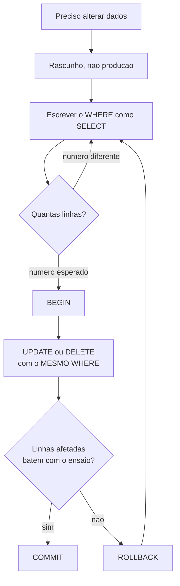

# 03.11 — `INSERT`, `UPDATE`, `DELETE`

> **Módulo 03 — SQL** · Nível: N1 · Tempo estimado: 2h30 · Código: `codigo/cap11/`

## 1. Objetivo

- **Executar** `INSERT`, `UPDATE` e `DELETE` com a disciplina que a escrita exige.
- **Aplicar** o ensaio: rodar o `WHERE` como `SELECT` **antes** de qualquer comando que altera.
- **Reconhecer** as três redes de segurança: o rascunho, a transação e a chave estrangeira.
- **Conferir** o resultado de uma escrita pelo número de linhas afetadas.

Ao final, você escreve no banco sem medo — não porque o medo some, mas porque você tem um procedimento que torna o desastre difícil de acontecer e reversível quando acontece.

---

## 2. Pré-requisitos

- [03.03 — `SELECT` e `WHERE`](03-select-e-where.md) — **o capítulo mais importante deste aqui**: todo o poder destrutivo do `UPDATE` e do `DELETE` está no `WHERE`, e todo o `WHERE` você já sabe.
- [03.09 — Subconsultas](09-subconsultas.md) — `NOT EXISTS` para escolher o que alterar.
- [02.12 — Desfazendo com segurança](../02-Git-Linux/12-desfazendo-e-mini-projeto.md) — a ideia de "operação reversível" volta aqui com outro nome.

**Autoteste:** (1) O que `WHERE categoria = 'acessorios'` seleciona? (2) O que acontece com uma consulta `SELECT` sem `WHERE`? (3) Você tem backup do que está prestes a alterar?

---

## 3. Motivação

Até aqui, tudo que você fez foi **ler**. A pior consequência de um `SELECT` errado é uma resposta errada — irritante, corrigível. A partir deste capítulo, os comandos **alteram** o banco. E a pior consequência de um `UPDATE` errado é uma tabela em que todas as linhas ficaram iguais, sem nenhuma mensagem de erro, sem nenhuma pergunta de confirmação.

Existe uma história que todo profissional de dados ouve na primeira semana, porque ela é verdadeira e acontece toda semana em algum lugar:

```sql
UPDATE produtos SET preco_centavos = 1990 WHERE id = 7
```

O profissional selecionou o texto com o mouse para executar. A seleção parou no `7`? Ou parou antes, no `WHERE`? O banco não pergunta. Ele executa o que recebeu. Se recebeu até `1990`, todos os produtos passam a custar R$ 19,90 — e o e-commerce vende o notebook por dezenove reais até alguém perceber.

Este capítulo tem uma tese: **a escrita não é mais difícil que a leitura — é mais perigosa.** A sintaxe do `UPDATE` cabe em duas linhas e você a aprende em dez minutos. O que leva o resto do capítulo é o procedimento em volta dela.

---

## 4. Modelo mental

Pense nos três comandos como três verbos sobre linhas:

| Comando | O que faz com as linhas | O que o `WHERE` controla |
|---|---|---|
| `INSERT` | **acrescenta** linhas novas | nada — `INSERT` não tem `WHERE` |
| `UPDATE` | **altera** linhas existentes | **quais** linhas serão alteradas |
| `DELETE` | **remove** linhas existentes | **quais** linhas serão removidas |

A assimetria é o ponto: `INSERT` não pode atingir uma linha que já existe, então erra pouco. `UPDATE` e `DELETE` sem `WHERE` atingem **a tabela inteira** — e a ausência do `WHERE` não é erro de sintaxe. É um comando válido, que o banco executa com prazer.

**A regra que organiza tudo:** o `WHERE` de um `UPDATE` ou `DELETE` deve ser escrito e testado como `SELECT` **antes**, sem exceção. O `SELECT` mostra exatamente as linhas que serão afetadas. Se o `SELECT` devolve 4 linhas, o `UPDATE` deve afetar 4. Se afetou 12, você errou e ainda dá tempo de reagir.

---

## 5. Analogia

Um `SELECT` é tirar uma fotografia de uma sala: você pode tirar quantas quiser, de qualquer ângulo, e a sala continua igual. Um `UPDATE` é **repintar** a sala. Um `DELETE` é **jogar móveis fora**.

Ninguém repinta uma parede sem antes marcar com fita crepe onde a tinta pode ir. A fita crepe é o `SELECT` de ensaio: ela não pinta nada, mas mostra, antes da tinta, exatamente a área que será atingida. Quem pula essa etapa às vezes acerta — e é justamente quem acerta algumas vezes que aprende a pular sempre.

A transação (`BEGIN` … `ROLLBACK`) é o outro lado: é ter a foto do "antes" e poder devolver a sala ao estado anterior enquanto a tinta ainda não secou. E a chave estrangeira é o vizinho que segura sua mão quando você vai jogar fora o móvel que sustenta a prateleira.

---

## 6. Teoria

### 6.1 O rascunho: onde você vai errar de propósito

Antes da primeira escrita, uma providência. Todos os capítulos anteriores usaram `dados/aurora.db`, e ele precisa continuar como está — os gabaritos do módulo inteiro comparam com os números dele. A partir daqui você escreve num **rascunho descartável**:

```bash
python codigo/cap11/preparar_rascunho.py
```

O script copia `aurora.db` para `dados/rascunho.db`. Todo comando de escrita deste capítulo aponta para o rascunho:

```bash
AURORA_BANCO=dados/rascunho.db python codigo/sql.py "UPDATE ..."
```

Se você bagunçar o rascunho — e vai bagunçar, é o objetivo —, rode o script de novo e recomece limpo. No Windows, com o Git Bash, a sintaxe `VAR=valor comando` funciona igual (02.06).

### 6.2 `INSERT`: nomeie as colunas

A forma completa:

```sql
INSERT INTO clientes (nome, email, cidade, data_cadastro)
VALUES ('Otavio Ramos', 'otavio@exemplo.com', 'jundiai', '2026-08-04');
```

Existe uma forma abreviada, sem a lista de colunas, em que os valores são ligados às colunas **pela ordem em que a tabela foi criada**. Evite-a. A ordem das colunas é uma decisão de quem criou a tabela, e essa decisão pode mudar; quando muda, o `INSERT` abreviado não dá erro — passa a gravar o e-mail na coluna da cidade. Nomear as colunas transforma um contrato invisível em contrato escrito.

**Várias linhas num comando só:**

```sql
INSERT INTO clientes (nome, email, cidade, data_cadastro) VALUES
    ('Priscila Nunes', 'priscila@exemplo.com', 'campinas', '2026-08-04'),
    ('Tadeu Moraes',   'tadeu@exemplo.com',    'santos',   '2026-08-04'),
    ('Vera Lucia',     NULL,                    NULL,      '2026-08-04');
```

Repare na terceira linha: `NULL` sem aspas é o valor nulo do 03.03; `'NULL'` com aspas seria o texto de quatro letras. A coluna `email` aceita nulo, `nome` não — a tabela declara `NOT NULL` ali, e o banco recusa.

**As colunas que você não precisa passar.** `clientes.id` é `INTEGER PRIMARY KEY`: o SQLite gera o valor. E `produtos.ativo` tem `DEFAULT 1` — omitir a coluna faz o banco usar 1:

```sql
INSERT INTO produtos (nome, categoria, preco_centavos)
VALUES ('Suporte de Monitor', 'acessorios', 18900);
```

```
id | nome               | ativo
---+--------------------+------
13 | Suporte de Monitor |     1
```

**Omitir a coluna não é o mesmo que passar `NULL` nela.** Omitir aciona o `DEFAULT`; passar `NULL` explicitamente grava nulo (ou dá erro, se a coluna for `NOT NULL`). É uma distinção que aparece em entrevista.

### 6.3 O ensaio: o `SELECT` que vem antes

Este é o procedimento central do capítulo. Você quer reajustar em 10% o preço dos acessórios ativos. **Primeiro**, escreva o `WHERE` como `SELECT`:

```sql
SELECT id, nome, preco_centavos
FROM produtos
WHERE categoria = 'acessorios' AND ativo = 1;
```

```
id | nome                  | preco_centavos
---+-----------------------+---------------
 7 | Hub USB-C 6 portas    |          12990
 8 | Suporte para Notebook |           7990
10 | Cabo HDMI 2m          |           3490
13 | Suporte de Monitor    |          18900

(4 linhas)
```

Quatro linhas. Agora — e só agora — o `UPDATE`, com o **mesmo** `WHERE`, copiado e colado, não redigitado:

```sql
UPDATE produtos
SET preco_centavos = CAST(preco_centavos * 1.10 AS INTEGER)
WHERE categoria = 'acessorios' AND ativo = 1;
```

```
OK. Linhas afetadas: 4
```

**Quatro no ensaio, quatro na execução.** Essa comparação é a conferência, e ela é obrigatória. Se o número tivesse vindo 12, o `WHERE` teria se perdido no caminho — e você saberia disso em um segundo, em vez de descobrir pelo relatório de vendas na segunda-feira.

O `CAST(... AS INTEGER)` está ali por causa do 03.05: `12990 * 1.10` dá `14289.000000000002` em ponto flutuante, e preço é inteiro em centavos. Truncar é uma decisão de negócio — arredondar para cima ou para baixo muda a receita —, e o `CAST` a torna explícita em vez de deixá-la para o acaso da conversão implícita.

### 6.4 `UPDATE` com subconsulta

O `SET` pode usar qualquer expressão, e o `WHERE` pode usar tudo que você aprendeu no 03.09. Desativar produtos que nunca foram vendidos:

```sql
UPDATE produtos
SET ativo = 0
WHERE NOT EXISTS (
    SELECT 1 FROM itens_pedido i WHERE i.produto_id = produtos.id
);
```

```
OK. Linhas afetadas: 2
```

`NOT EXISTS` e não `NOT IN` — a armadilha do `NULL` do 03.09 vale igual na escrita, e aqui ela é pior: um `NOT IN` que devolve zero linhas num `SELECT` mostra uma tela vazia e você percebe; num `UPDATE`, mostra `Linhas afetadas: 0` e parece que não havia nada a fazer.

As duas linhas afetadas são o Mousepad Grande (que nunca vendeu, desde o 03.01) e o Suporte de Monitor recém-inserido. Faz sentido: acabou de nascer, ainda não vendeu nada.

### 6.5 `DELETE`: o mesmo `WHERE`, consequência maior

```sql
DELETE FROM clientes WHERE data_cadastro = '2026-08-04';
```

```
OK. Linhas afetadas: 4
```

`DELETE` não tem lista de colunas: ele remove a **linha inteira**. "Apagar só o e-mail de um cliente" não é `DELETE`, é `UPDATE ... SET email = NULL`. Confundir os dois apaga o cliente.

E `DELETE FROM clientes;` — sem `WHERE` — esvazia a tabela. Não é erro de sintaxe. É um comando válido e um dos jeitos mais rápidos de arruinar um dia.

### 6.6 A rede que o banco estende: a chave estrangeira

Tente apagar um cliente que tem pedidos:

```sql
DELETE FROM clientes WHERE id = 1;
```

```
Erro de SQL: FOREIGN KEY constraint failed
```

O banco **recusou**. A tabela `pedidos` declara `FOREIGN KEY (cliente_id) REFERENCES clientes(id)`, e apagar o cliente 1 deixaria pedidos apontando para um cliente que não existe — um "órfão". A regra que você desenhou no 03.02 virou uma proteção ativa.

Duas observações que valem o capítulo inteiro. **Primeira:** no SQLite essa verificação vem **desligada** por padrão; é preciso `PRAGMA foreign_keys = ON` a cada conexão. O `codigo/sql.py` faz isso desde o 03.01 — e é por isso que o erro aparece aqui. Num banco onde ninguém ligou o pragma, o mesmo `DELETE` teria passado, deixando os órfãos para alguém descobrir meses depois. **Segunda:** essa rede protege contra apagar o *pai*; ela não protege contra nenhum dos outros erros deste capítulo. Um `UPDATE` que zera todos os preços não viola chave estrangeira nenhuma.

### 6.7 A rede que você mesmo estende: a transação

```sql
BEGIN;
UPDATE produtos SET preco_centavos = 1;      -- o desastre
SELECT COUNT(*) AS a_um_centavo FROM produtos WHERE preco_centavos = 1;
ROLLBACK;
```

```
--- [12] UPDATE produtos SET preco_centavos = 1
OK. Linhas afetadas: 13

--- [13] SELECT COUNT(*) AS a_um_centavo ...
a_um_centavo
------------
          13
```

Treze produtos a um centavo. Dentro da transação, o estrago é real e visível. Então:

```sql
ROLLBACK;
SELECT COUNT(*) AS a_um_centavo FROM produtos WHERE preco_centavos = 1;
```

```
a_um_centavo
------------
           0
```

**Zero.** O `ROLLBACK` desfez tudo que aconteceu desde o `BEGIN`. O oposto é `COMMIT`, que confirma. A regra prática: em qualquer alteração que você não faz todo dia, abra `BEGIN`, execute, **confira com um `SELECT`**, e só então `COMMIT` — ou `ROLLBACK` se o número não bateu.

Repare também na saída de `BEGIN` e `ROLLBACK`: `Linhas afetadas: -1`. O `-1` significa "não se aplica" — nenhuma linha foi lida ou alterada por esses comandos; eles marcam limites. É a convenção do driver, não um erro.

Uma honestidade sobre o executor deste laboratório: para que o `ROLLBACK` acima funcionasse, foi preciso desligar o gerenciamento automático de transações do driver Python (`isolation_level = None` em `codigo/sql.py`). Sem isso, o driver abria e fechava transações por conta própria e o seu `ROLLBACK` não teria o que desfazer. **Toda ferramenta que fala com um banco tem uma política de transação**, e ela nem sempre é a que você imagina — o que sua ferramenta faz é a primeira coisa a descobrir antes de confiar num `ROLLBACK`. O assunto completo, com os quatro níveis de isolamento e o que acontece quando duas pessoas escrevem ao mesmo tempo, é o [03.15](15-transacoes-e-acid.md).

### 6.8 A ordem de operação, resumida

O procedimento que este capítulo defende, em cinco passos:

1. **Rascunho** — nunca ensaie no banco de produção.
2. **Ensaio** — o `WHERE` como `SELECT`; anote quantas linhas.
3. **Transação** — `BEGIN` antes de qualquer alteração fora do rotineiro.
4. **Execução** — o comando, com o `WHERE` **copiado** do ensaio.
5. **Conferência** — linhas afetadas × linhas do ensaio. Bateu, `COMMIT`. Não bateu, `ROLLBACK`.

⚠️ **Caixa-preta 1:** `BEGIN`, `COMMIT` e `ROLLBACK` aparecem aqui como três palavras que abrem, confirmam e desfazem. O que acontece quando duas conexões alteram a mesma linha ao mesmo tempo, o que o banco garante e o que ele não garante — isso é o [03.15 — Transações e ACID](15-transacoes-e-acid.md).

⚠️ **Caixa-preta 2:** `FOREIGN KEY` apareceu recusando um `DELETE`. Como declarar, quais opções existem (`ON DELETE CASCADE`, `ON DELETE SET NULL`) e por que a escolha entre elas é uma decisão de negócio — [03.13 — Constraints e integridade](13-constraints-e-integridade.md).

---

## 7. Funcionamento interno

Um `UPDATE` não reescreve a tabela: o banco localiza as linhas que satisfazem o `WHERE` (com índice, se houver — 03.14; varrendo tudo, se não houver) e altera cada uma. Por isso o custo de um `UPDATE` cresce com o número de linhas **afetadas**, e o custo de *encontrá-las* cresce com o tamanho da tabela.

A alteração não vai direto para o arquivo do banco. Ela é registrada primeiro num diário (o *journal*, ou *WAL*), e é esse diário que permite o `ROLLBACK` — desfazer é ler o diário ao contrário. É também o que salva o banco de uma queda de energia no meio da escrita: ao reabrir, ele consulta o diário e decide o que completar e o que descartar.

---

## 8. Visualização do fluxo



**Como ler:** o fluxo entra pelo topo e só chega ao `COMMIT` por um caminho — passando por duas conferências numéricas. Os dois retornos a "escrever o `WHERE`" são o ponto do diagrama: errar o `WHERE` é esperado, e o procedimento existe para que errar seja barato. O `ROLLBACK` não é o caminho do fracasso; é uma das duas saídas normais.

---

## 9. Aplicação prática

**A dor da Aurora.** O time comercial pediu três coisas ao mesmo tempo, numa quinta-feira à tarde: cadastrar quatro clientes que vieram de uma feira, reajustar os acessórios em 10%, e "limpar os produtos que não vendem" do catálogo.

O terceiro pedido é o interessante, porque está mal formulado — e você só descobre isso ao tentar executá-lo.

**"Limpar" quer dizer apagar?** Se for `DELETE FROM produtos WHERE ...`, e algum desses produtos aparecer em `itens_pedido`, a chave estrangeira recusa. E isso é uma sorte: apagar um produto que já foi vendido destruiria o histórico — os pedidos antigos passariam a apontar para o nada, e o faturamento do ano passado mudaria retroativamente.

O que o comercial quer não é apagar; é **tirar da vitrine**. Isso é `UPDATE produtos SET ativo = 0`. A coluna `ativo` existe exatamente para isso: é o *soft delete*, o "apagado" que preserva a linha.

Esse é um dos julgamentos mais frequentes na profissão: **quando o pedido diz "apagar", quase sempre quer dizer "desativar"**. Dados apagados não voltam. Dados desativados voltam com um `UPDATE`. A pergunta que resolve — "esse dado aparece em algum histórico, relatório ou obrigação legal?" — decide entre os dois, e a resposta é "sim" com mais frequência do que se imagina.

**A entrega.** Os quatro `INSERT`, o reajuste conferido (4 linhas no ensaio, 4 na execução) e o `UPDATE ... SET ativo = 0` com `NOT EXISTS`. Nenhum `DELETE` em produto. O histórico intacto.

---

## 10. Código comentado

O arquivo `codigo/cap11/escrita.sql` executa a sequência inteira. Antes, prepare o rascunho:

```bash
python codigo/cap11/preparar_rascunho.py
AURORA_BANCO=dados/rascunho.db python codigo/sql.py codigo/cap11/escrita.sql
```

O arquivo termina de propósito com um comando que **falha** — o `DELETE` bloqueado pela chave estrangeira. O executor para no primeiro erro, então esse comando é o último: a falha é a última cena, não uma interrupção.

Três trechos merecem comentário.

**O ensaio e a execução, lado a lado** (comandos `[4]` e `[5]`) — o mesmo `WHERE`, literalmente copiado. Se você redigitar em vez de copiar, um dia vai digitar `ativo = 1` como `ativo` e o `WHERE` inteiro muda de sentido sem dar erro.

**O `NOT EXISTS` no `UPDATE`** (comando `[7]`) — a subconsulta correlacionada referencia `produtos.id` de fora. É a mesma construção do 03.09, agora escolhendo o que alterar em vez de o que exibir.

**A transação** (comandos `[9]` e `[10]`) — o `UPDATE` sem `WHERE` está ali de propósito, protegido pelo `BEGIN`. É a única circunstância em que escrever um `UPDATE` sem `WHERE` é uma boa ideia: dentro de uma transação, num rascunho, para ver o estrago com os próprios olhos e desfazê-lo.

Sobre `preparar_rascunho.py`: ele usa `shutil.copyfile` (01.24) e verifica a existência da origem antes de copiar, devolvendo código de saída 1 com uma mensagem útil se o laboratório não foi criado — o padrão de saída do 02.07.

---

## 11. Erros comuns

**1. `UPDATE` ou `DELETE` sem `WHERE`.** O erro clássico. Não dá mensagem de erro: dá `Linhas afetadas: 13`.
→ Ensaio antes, transação em volta.

**2. Executar uma seleção parcial do comando.** Selecionar com o mouse e apertar "executar" é como o comando sem `WHERE` acontece na prática.
→ Execute arquivos, não seleções. Se a ferramenta executa a seleção, selecione com `Ctrl+A` ou não selecione nada.

**3. Confundir `DELETE` com "apagar uma coluna".** `DELETE` remove a linha inteira.
→ Para esvaziar um campo: `UPDATE ... SET campo = NULL`.

**4. `NOT IN` com subconsulta que pode conter `NULL`.** No `SELECT`, devolve tela vazia; no `UPDATE`, devolve `Linhas afetadas: 0` e parece que não havia trabalho.
→ `NOT EXISTS` (03.09).

**5. Aritmética de dinheiro em ponto flutuante.** `preco * 1.10` produz `14289.000000000002`.
→ `CAST(... AS INTEGER)`, e a decisão de arredondamento explícita.

**6. `INSERT` sem lista de colunas.** Funciona hoje; grava no campo errado no dia em que alguém acrescentar uma coluna.
→ Sempre nomeie as colunas.

**7. Achar que o `ROLLBACK` sempre está disponível.** Muitas ferramentas rodam em autocommit: cada comando é confirmado assim que executa, e não há o que desfazer.
→ Descubra a política da sua ferramenta **antes** de precisar dela.

**8. Apagar quando o certo era desativar.** O pedido diz "remover"; o histórico diz outra coisa.
→ Pergunte se o dado aparece em algum relatório ou obrigação. Quase sempre aparece.

---

## 12. Boas práticas

- **Ensaio obrigatório.** O `WHERE` como `SELECT`, sempre, inclusive quando você tem certeza. Sobretudo quando você tem certeza.
- **Confira o número de linhas afetadas** contra o do ensaio. É uma conferência de dois segundos que pega quase todos os erros deste capítulo.
- **`BEGIN` em qualquer alteração fora da rotina.** O custo é uma palavra; o benefício é reversibilidade.
- **Copie o `WHERE`, não o redigite.**
- **Prefira desativar a apagar** quando o dado tem histórico.
- **Nomeie as colunas no `INSERT`.**
- **Escreva um comando por vez** e leia a saída de cada um antes do próximo.
- **Nunca ensaie em produção** — nem "só para ver".

---

## 13. Performance

`UPDATE` e `DELETE` pagam duas contas: **encontrar** as linhas (o `WHERE`, que se beneficia de índice — 03.14) e **alterá-las**. Alterar 1 milhão de linhas num comando só mantém uma transação enorme aberta, o que pressiona a memória e o diário, e pode bloquear outras conexões durante todo o tempo.

A prática usual é fazer em lotes — 10 mil linhas por vez, em transações separadas. O detalhe que importa: com lotes, a operação **deixa de ser atômica**. Se falhar no lote 7 de 100, os seis primeiros já foram confirmados. Isso é aceitável para algumas tarefas e inaceitável para outras, e a escolha precisa ser consciente. O assunto completo está no 03.15.

---

## 14. Mercado

Escrita é onde a responsabilidade aparece. Um analista que só lê tem acesso `SELECT`; a partir do momento em que alguém pode escrever, a conversa passa a ser sobre permissões, ambientes separados e auditoria — três coisas que existem porque a alternativa já deu errado em algum lugar.

Em times maduros, alteração de dados em produção não é feita à mão. Ela vira um **script versionado**, revisado por outra pessoa, executado por uma ferramenta que registra quem rodou, quando e quantas linhas mudaram. O `UPDATE` digitado direto no terminal de produção é, em muitos lugares, motivo de conversa séria — não porque o comando seja difícil, mas porque ele não deixa rastro.

Também é aqui que nasce o hábito que separa quem apanha de quem não apanha: a pessoa que sempre roda o `SELECT` antes é a mesma que, anos depois, não tem nenhuma história de terror para contar. As histórias existem; elas só não são dela.

---

## 15. Entrevistas

- **"Você precisa corrigir o e-mail de um cliente em produção. Descreva o que você faz."** A resposta esperada não é o `UPDATE` — é o procedimento: `SELECT` para localizar e confirmar que é uma linha, `BEGIN`, `UPDATE` com `WHERE id = ...` pela chave primária, conferir `Linhas afetadas: 1`, `COMMIT`.
- **"Qual a diferença entre `DELETE` e `TRUNCATE`?"** `DELETE` aceita `WHERE`, remove linha a linha e é transacional. `TRUNCATE` esvazia a tabela inteira, é mais rápido e, em vários bancos, não é revertível por `ROLLBACK`. O SQLite não tem `TRUNCATE`.
- **"O que é *soft delete* e quando usar?"** Marcar como inativo em vez de remover. Use quando há histórico, auditoria ou obrigação legal — quase sempre.
- **"Rodei um `UPDATE` sem `WHERE` em produção. O que faço agora?"** Testam frieza. Não abrir outra transação para "consertar"; verificar se há transação aberta (então `ROLLBACK`); se já foi confirmada, parar de escrever, avisar imediatamente e restaurar do backup ou do log. E o mais importante: **avisar antes de tentar consertar sozinho.**

---

## 16. Exercícios guiados

Em [`exercicios/cap11.md`](exercicios/cap11.md):

- **A1** `[~10 min · prevê a saída]` — 6 comandos de escrita: quantas linhas cada um afeta?
- **A2** `[~10 min · ache o perigo]` — 6 comandos: qual é destrutivo e por quê?
- **A3** `[~10 min · o ensaio]` — 5 `UPDATE`: escreva o `SELECT` de ensaio de cada um.
- **A4** `[~10 min · apagar ou desativar?]` — 6 situações: qual pede `DELETE`, qual pede `UPDATE`?
- **AP1** `[~20 min · o cadastro]` — Insira clientes, produtos e um pedido completo com itens.
- **AP2** `[~25 min · o reajuste]` — Três reajustes com ensaio e conferência documentados.
- **AP3** `[~20 min · a rede]` — Provoque três erros de propósito e desfaça cada um.
- **D1** `[~50 min · a correção de produção]` — **Um roteiro que outra pessoa executa.**

---

## 17. Desafios

**D1 — A correção de produção.** Um relatório apontou que 3 pedidos ficaram com `status = 'pendente'` há mais de 90 dias, e o comercial confirmou que devem virar `'cancelado'`. Escreva o **roteiro completo** que você entregaria a um colega para executar: o `SELECT` de investigação, o de ensaio, o comando, a conferência, e o que fazer se o número não bater. Inclua o `ROLLBACK` de emergência e uma consulta de verificação final que prove que só os 3 pedidos certos mudaram.

---

## 18. Mini projeto

**Um script de manutenção da Aurora.** Escreva `manutencao.sql` que, em uma única transação, execute a rotina mensal do catálogo: desativa produtos sem venda nos últimos 180 dias, cancela pedidos pendentes com mais de 90 dias, e insere uma linha numa tabela `log_manutencao` com a data e o número de linhas afetadas em cada etapa.

Requisitos: cada etapa precedida do seu `SELECT` de ensaio comentado com o número esperado; a transação inteira dentro de `BEGIN`/`COMMIT`; nenhum `DELETE`; e um comentário no topo explicando como reverter caso a rotina rode com o filtro errado.

---

## 19. Revisão

**Resumo em 5 frases.** `INSERT` acrescenta, `UPDATE` altera, `DELETE` remove — e só os dois últimos aceitam `WHERE`, que é onde mora todo o perigo. O procedimento que torna a escrita segura tem cinco passos: rascunho, ensaio como `SELECT`, `BEGIN`, execução com o `WHERE` copiado, conferência das linhas afetadas. A chave estrangeira protege contra apagar um pai com filhos, e nada mais. A transação desfaz tudo desde o `BEGIN` — quando a sua ferramenta permite, o que você precisa saber de antemão. E quando o pedido diz "apagar", ele quase sempre quer dizer "desativar".

**Flashcards** (também em [`revisao/flashcards.md`](revisao/flashcards.md)):

| ID | Frente | Verso |
|---|---|---|
| 03.11-F1 | Qual o procedimento de 5 passos antes de um `UPDATE`? | Rascunho → `SELECT` de ensaio (anote as linhas) → `BEGIN` → comando com o `WHERE` **copiado** → conferir linhas afetadas contra o ensaio → `COMMIT` ou `ROLLBACK`. |
| 03.11-F2 | Explique com suas palavras: por que `UPDATE` sem `WHERE` é pior que um erro de sintaxe? | (Elaboração) Erro de sintaxe **não executa**. `UPDATE` sem `WHERE` é comando válido: executa em silêncio, afeta a tabela inteira e só é descoberto pelo efeito — quando já está confirmado. |
| 03.11-F3 | Preveja: `DELETE FROM clientes WHERE id = 1` no banco da Aurora. | (Previsão) **Falha**: `FOREIGN KEY constraint failed`. O cliente 1 tem pedidos, e o pragma `foreign_keys` está ligado. Sem o pragma, passaria e deixaria órfãos. |
| 03.11-F4 | O pedido diz "remover produtos que não vendem". `DELETE` ou `UPDATE`? | (Decisão) `UPDATE ... SET ativo = 0`. `DELETE` destruiria o histórico dos pedidos antigos — e a chave estrangeira recusaria, o que é uma sorte. |
| 03.11-F5 | Omitir uma coluna no `INSERT` é o mesmo que passar `NULL` nela? | **Não.** Omitir aciona o `DEFAULT` da coluna (`produtos.ativo` → 1); passar `NULL` grava nulo, ou dá erro se a coluna for `NOT NULL`. |

**Revisão espaçada:** D+1 refaça A1 e A3 sem consultar · D+7 o D1 inteiro · D+30 explique o procedimento de 5 passos em voz alta, sem olhar.

---

## 20. Checklist

- [ ] Criei `dados/rascunho.db` e entendi por que ele existe.
- [ ] Escrevi um `INSERT` com colunas nomeadas e um de várias linhas.
- [ ] Sei a diferença entre omitir uma coluna e passar `NULL` nela.
- [ ] Rodei um `SELECT` de ensaio e conferi o número contra as linhas afetadas.
- [ ] Usei `NOT EXISTS` num `UPDATE` e sei por que não usei `NOT IN`.
- [ ] Vi a chave estrangeira recusar um `DELETE` e sei o que ela **não** protege.
- [ ] Executei `BEGIN` / `UPDATE` sem `WHERE` / `ROLLBACK` e vi o 13 virar 0.
- [ ] Sei explicar quando "apagar" quer dizer "desativar".
- [ ] Consigo enunciar os cinco passos do procedimento sem consultar.

---

## 21. Próximo capítulo

[03.12 — DDL e tipos de dados](12-ddl-e-tipos-de-dados.md). Você escreveu **dentro** de tabelas que já existiam. O próximo capítulo cria as tabelas: `CREATE TABLE`, `ALTER TABLE`, e a escolha de tipos — que é onde a decisão de guardar dinheiro em centavos, tomada lá no 03.01 e usada em todo capítulo desde então, finalmente se justifica por inteiro.
