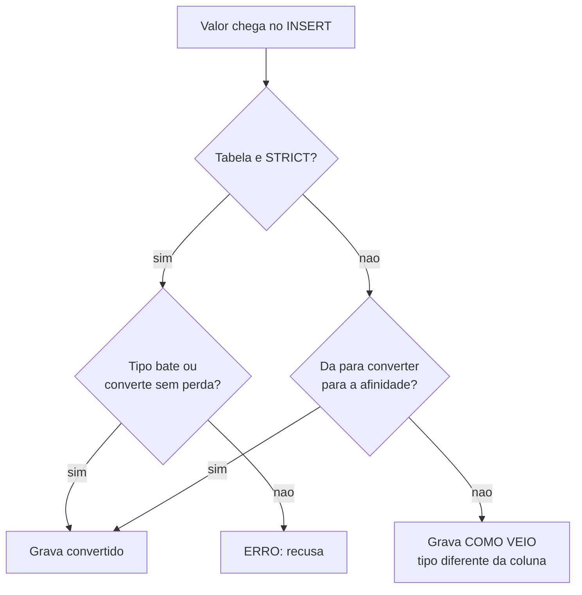

# 03.12 — DDL e tipos de dados

> **Módulo 03 — SQL** · Nível: N1 · Tempo estimado: 2h30 · Código: `codigo/cap12/`

## 1. Objetivo

- **Criar** tabelas com `CREATE TABLE`, escolhendo tipos com justificativa.
- **Alterar** e remover estruturas com `ALTER TABLE` e `DROP`, sabendo o que o SQLite não faz.
- **Explicar** afinidade de tipos — e por que o SQLite aceita calado o que outros bancos recusam.
- **Justificar** as três decisões de tipo que aparecem em toda base real: dinheiro, data e booleano.

Ao final, você lê um `CREATE TABLE` como um documento de decisões, não como uma formalidade — e escreve o seu sabendo o que cada palavra promete e o que ela não garante.

---

## 2. Pré-requisitos

- [03.02 — Tabelas, linhas e chaves](02-tabelas-linhas-e-chaves.md) — você leu o schema da Aurora; agora escreve um.
- [03.11 — `INSERT`, `UPDATE`, `DELETE`](11-insert-update-delete.md) — `DEFAULT` e `NOT NULL` apareceram lá de passagem; aqui ganham a explicação.
- [01.04 — Números e operadores](../01-Python/04-numeros-e-operadores.md) — ponto flutuante e por que dinheiro não mora nele.

**Autoteste:** (1) Por que `preco_centavos` guarda 8990 em vez de 89.90? (2) O que `NOT NULL` impede? (3) Quanto é `0.1 + 0.2`?

---

## 3. Motivação

Até aqui você **consultou** e **alterou** tabelas que alguém criou. Este capítulo passa para o outro lado: **DDL** — *Data Definition Language*, os comandos que definem a estrutura. `CREATE`, `ALTER`, `DROP`.

A sintaxe é curta. O que ocupa o capítulo é uma descoberta desconfortável: **o tipo que você declara numa coluna do SQLite não é uma garantia.** Veja:

```sql
CREATE TABLE teste_tipos (a INTEGER, b TEXT, c REAL);
INSERT INTO teste_tipos VALUES ('abacaxi', 42, 'x');
```

```
OK. Linhas afetadas: 1
```

Sem erro. Sem aviso. A palavra `abacaxi` está gravada numa coluna declarada `INTEGER`. Se isso surpreende você, ótimo — surpreende quase todo mundo, e é a terceira vez neste módulo que o SQLite aceita algo que o PostgreSQL recusaria. Da primeira vez foram as aspas duplas (03.03); da segunda, a ordem das CTEs (03.10). Não é coincidência: é uma decisão de projeto, e entendê-la vale mais que decorar tipos.

---

## 4. Modelo mental

Na maioria dos bancos, o tipo pertence à **coluna**: declarou `INTEGER`, aquela coluna só aceita inteiros, e o banco recusa qualquer outra coisa.

No SQLite, o tipo pertence ao **valor**. Cada célula carrega o próprio tipo. O que a coluna declara é uma **afinidade** — uma preferência que o banco tenta aplicar por conversão, e abandona quando a conversão não é possível.

| | Tipo estrito (PostgreSQL, MySQL) | Afinidade (SQLite padrão) |
|---|---|---|
| Onde mora o tipo | na coluna | no valor, célula a célula |
| `'abacaxi'` em coluna `INTEGER` | **erro** | aceito, gravado como texto |
| `'42'` em coluna `INTEGER` | erro ou conversão, conforme o banco | convertido para o inteiro `42` |
| Tipo inventado (`BANANA`) | erro na criação | **aceito** |

A regra da afinidade em uma frase: **converte se der; guarda como veio se não der.** É por isso que `'42'` vira número e `'abacaxi'` continua texto — na mesma coluna, no mesmo `INSERT`.

---

## 5. Analogia

Um tipo estrito é uma **gaveta com divisórias moldadas**: o garfo só entra no vão de garfo, e tentar guardar uma panela ali é fisicamente impossível.

A afinidade é uma **gaveta com etiquetas**. A etiqueta diz "talheres", e existe uma pessoa prestativa que, ao receber algo parecido com talher, o coloca na posição certa. Mas se você entregar uma panela, ela guarda a panela — na gaveta dos talheres, sem comentar.

Isso funciona bem enquanto só você usa a cozinha e você sempre entrega talheres. O problema aparece quando alguém abre a gaveta esperando talheres, seis meses depois, e o programa que lê aquela coluna assume que todo valor é número.

---

## 6. Teoria

### 6.1 O banco deste capítulo

Aqui você cria e destrói tabelas, então o banco é outro — vazio, seu:

```bash
python codigo/cap12/preparar_ddl.py
AURORA_BANCO=dados/ddl.db python codigo/sql.py codigo/cap12/tipos.sql
```

O script apaga e recria `dados/ddl.db` a cada execução, e imprime a versão do SQLite — que importa, porque um recurso central deste capítulo exige a 3.37 ou superior.

### 6.2 `CREATE TABLE`, linha a linha

```sql
CREATE TABLE produtos (
    id              INTEGER PRIMARY KEY,
    nome            TEXT    NOT NULL,
    categoria       TEXT    NOT NULL,
    preco_centavos  INTEGER NOT NULL,
    ativo           INTEGER NOT NULL DEFAULT 1
);
```

Cada linha é uma decisão:

- **`id INTEGER PRIMARY KEY`** — no SQLite, essa combinação exata tem um significado especial: a coluna vira apelido do `rowid` interno e é preenchida automaticamente. Em outros bancos, o equivalente é `SERIAL` (PostgreSQL) ou `AUTO_INCREMENT` (MySQL).
- **`TEXT NOT NULL`** — a coluna precisa de valor. Sem `DEFAULT`, quem insere é obrigado a fornecê-lo (03.11).
- **`INTEGER` para preço** — a decisão do 03.01, agora justificada por inteiro na §6.5.
- **`INTEGER NOT NULL DEFAULT 1`** — obrigatória, mas com valor de fábrica. Omitir a coluna no `INSERT` aciona o `DEFAULT`.

**Os cinco tipos que o SQLite tem de fato:** `INTEGER`, `REAL`, `TEXT`, `BLOB` e `NULL`. Tudo o mais — `VARCHAR`, `DECIMAL`, `BOOLEAN`, `DATETIME` — é traduzido para um desses cinco por regras de afinidade. Você pode escrever `VARCHAR(255)` para manter familiaridade com outros bancos, mas saiba que o `(255)` não limita nada aqui.

### 6.3 A afinidade, demonstrada

Execute os comandos `[2]` a `[4]` do arquivo. A função `typeof()` revela o que foi **realmente** gravado em cada célula:

```
a       | tipo_a  | b  | tipo_b | c   | tipo_c
--------+---------+----+--------+-----+-------
abacaxi | text    | 42 | text   | x   | text
     42 | integer | 42 | text   | 3.5 | real
```

Leia com atenção, porque há quatro fatos numa tabela pequena:

1. `'abacaxi'` na coluna `INTEGER` ficou **texto** — não deu para converter.
2. `'42'` na mesma coluna virou **inteiro** — deu para converter.
3. O número `42` na coluna `TEXT` virou **texto** — a afinidade `TEXT` converte números em texto.
4. Duas linhas da **mesma coluna** têm tipos **diferentes**. É a consequência que quebra programas: seu código Python lê a coluna esperando `int` e recebe `str` numa linha específica, num dia específico.

E o limite da permissividade (comando `[5]`):

```sql
CREATE TABLE inventado (x BANANA, y VARCHAR(3));
INSERT INTO inventado VALUES (1, 'texto muito maior que tres');
```

```
x | tipo_x  | tamanho
--+---------+--------
1 | integer |      26
```

`BANANA` foi aceito como tipo. E `VARCHAR(3)` guardou 26 caracteres. **O que você escreve na declaração pode ser inteiramente decorativo** — e a decoração passa despercebida porque nunca reclama.

### 6.4 `STRICT`: o rigor de volta

Desde a versão 3.37 (2021), o SQLite oferece a saída:

```sql
CREATE TABLE rigorosa (a INTEGER NOT NULL, b TEXT NOT NULL) STRICT;
INSERT INTO rigorosa VALUES ('abacaxi', 'ok');
```

```
Erro de SQL: cannot store TEXT value in INTEGER column rigorosa.a
```

**Recusado**, com uma mensagem que nomeia a tabela, a coluna e o problema. E tipos inventados também caem:

```sql
CREATE TABLE ruim (x BANANA) STRICT;
```

```
Erro de SQL: unknown datatype for ruim.x: "BANANA"
```

Uma nuance que vale ouro em entrevista: `STRICT` **não** desliga a conversão de valores conversíveis. `INSERT INTO rigorosa VALUES ('42', 'ok')` continua funcionando e grava o inteiro `42`. `STRICT` recusa o que **não pode** ser convertido; ele não obriga você a mandar o tipo exato. É rigor sobre o resultado, não sobre a forma de entrada.

**Quando usar:** em tabela nova, sempre — o custo é uma palavra e o benefício é o banco pegar seus erros. `STRICT` só admite os cinco tipos reais (`INT`/`INTEGER`, `REAL`, `TEXT`, `BLOB`, `ANY`), então adotá-lo obriga você a decidir de verdade.

⚠️ **Caixa-preta 1:** `NOT NULL` e `DEFAULT` apareceram como palavras que restringem. Elas são duas de cinco restrições — `UNIQUE`, `CHECK` e `FOREIGN KEY` completam o conjunto, e cada uma tem um comportamento próprio na violação. [03.13 — Constraints e integridade](13-constraints-e-integridade.md).

### 6.5 As três decisões que toda base real enfrenta

**Dinheiro: inteiro em centavos.** O comando `[7]` do arquivo:

```
soma_real           | soma_inteira | sao_iguais
--------------------+--------------+-----------
0.30000000000000004 |           30 |          0
```

`0.1 + 0.2` não dá `0.3`, e a terceira coluna é a prova formal: a comparação `0.1 + 0.2 = 0.3` devolve **0**, falso. Isso não é bug do SQLite — é como o padrão IEEE 754 representa frações binárias, e vale em Python (01.04), JavaScript e em qualquer `REAL`/`FLOAT`/`DOUBLE`.

Aplicado a dinheiro: some mil pedidos em `REAL` e o total diverge do somatório conferido, por centavos que ninguém consegue explicar. **A solução é guardar centavos como `INTEGER`** e dividir por 100 só na exibição — que é exatamente o que a Aurora faz desde o 03.01, e o motivo pelo qual todas as provas dos nove deste módulo foram feitas em centavos.

E `NUMERIC(10,2)`, que parece resolver? O comando `[8]`:

```sql
CREATE TABLE dec (v NUMERIC(10,2));
INSERT INTO dec VALUES (19.999);
```

```
v      | tipo
-------+-----
19.999 | real
```

**A precisão declarada foi ignorada.** Três casas entraram numa coluna que pedia duas. Em PostgreSQL, `NUMERIC(10,2)` é decimal exato e arredondaria para `20.00`; aqui, é `REAL` com uma etiqueta. Se você vem de outro banco, essa é a diferença que mais rápido causa prejuízo.

**Data: texto no formato ISO.** O SQLite não tem tipo de data. A convenção é `TEXT` no formato `YYYY-MM-DD`, e ela é boa por um motivo específico: nesse formato, **a ordem alfabética coincide com a ordem cronológica**. `'2026-07-12' < '2026-07-20'` é verdadeiro como texto e como data. Em `DD/MM/YYYY`, não seria — e foi o que permitiu o `WHERE data < '2026-07-20'` do 03.11 funcionar.

```
hoje       | tipo_data | verdadeiro | tipo_bool
-----------+-----------+------------+----------
2026-08-04 | text      |          1 | integer
```

**Booleano: inteiro 0 ou 1.** Também não existe tipo próprio; `TRUE` e `FALSE` são aceitos e viram 1 e 0. É por isso que `produtos.ativo` é `INTEGER` e que `WHERE ativo = 1` funciona. E é por isso que `(1 = 1)` devolve `1` — o resultado de uma comparação é um número.

### 6.6 `ALTER TABLE`: o que existe e o que não existe

O SQLite aceita quatro operações:

```sql
ALTER TABLE teste_tipos ADD COLUMN d TEXT DEFAULT 'novo';
ALTER TABLE teste_tipos DROP COLUMN c;
ALTER TABLE dec RENAME TO decimais;
ALTER TABLE decimais RENAME COLUMN v TO valor;
```

`ADD COLUMN` com `DEFAULT` preenche as linhas existentes com o valor padrão — as duas linhas antigas ficaram com `'novo'` em `d`.

E o que **não** existe:

```sql
ALTER TABLE teste_tipos ALTER COLUMN a TEXT;
```

```
Erro de SQL: near "ALTER": syntax error
```

**Não dá para mudar o tipo de uma coluna no SQLite.** O caminho é o procedimento de quatro passos:

```sql
CREATE TABLE teste_novo (a TEXT, b TEXT, c REAL, d TEXT);
INSERT INTO teste_novo SELECT a, b, c, d FROM teste_tipos;   -- 2 linhas
DROP TABLE teste_tipos;
ALTER TABLE teste_novo RENAME TO teste_tipos;
```

Funciona, e o preço é visível: durante os quatro passos os dados existem em dois lugares, chaves estrangeiras que apontavam para a tabela antiga precisam de atenção, e tudo isso deveria estar dentro de uma transação (03.15). **É a razão prática pela qual escolher o tipo certo na criação importa** — a correção é cara.

⚠️ **Caixa-preta 2:** `DROP TABLE` some com a tabela sem pedir confirmação, e não há `ROLLBACK` depois de confirmado. O que o banco garante durante uma sequência de comandos como a de quatro passos acima — e o que acontece se a energia cair entre o `DROP` e o `RENAME` — é o [03.15 — Transações e ACID](15-transacoes-e-acid.md).

### 6.7 Scripts reexecutáveis

```sql
CREATE TABLE IF NOT EXISTS decimais (valor TEXT);
DROP TABLE IF EXISTS inexistente;
```

Nenhum dos dois dá erro. `IF NOT EXISTS` e `IF EXISTS` tornam um script de criação **idempotente** — rodá-lo duas vezes tem o mesmo efeito de rodá-lo uma. É o que permite guardar o schema num arquivo versionado e executá-lo em qualquer ambiente sem verificar antes o que já existe.

O cuidado: `CREATE TABLE IF NOT EXISTS` não **atualiza** uma tabela que já existe com definição diferente. Ele apenas não faz nada. Se você alterou o schema no arquivo e rodou de novo, a tabela antiga continua exatamente como estava, e o script terminará com sucesso enganando você.

---

## 7. Funcionamento interno

O SQLite guarda o texto de cada `CREATE TABLE` numa tabela interna chamada `sqlite_master`, que você pode consultar como qualquer outra:

```sql
SELECT sql FROM sqlite_master WHERE name = 'decimais';
```

É de lá que vem a resposta quando alguém pergunta "como essa tabela foi definida?". Note que, depois de um `RENAME`, o SQLite reescreve o texto guardado com o nome novo entre aspas duplas — `CREATE TABLE "decimais" (valor NUMERIC(10,2))`.

A afinidade é aplicada na gravação, não na leitura: o valor é convertido (ou não) no momento do `INSERT`, e o que fica no arquivo é o resultado. Por isso `typeof()` conta a verdade sobre o passado, e mudar a declaração da coluna hoje não altera o que já foi gravado ontem.

---

## 8. Visualização do fluxo



**Como ler:** os dois ramos partem da mesma pergunta e terminam em lugares muito diferentes. A caixa `G` é a origem de toda esta aula: ela não é um erro, é um caminho normal do fluxo — e nada avisa quando ele foi tomado. `STRICT` existe para transformar `G` em `E`.

---

## 9. Aplicação prática

**A dor da Aurora.** O time quer registrar avaliações de produtos: nota de 1 a 5, comentário opcional, data. Alguém propõe:

```sql
CREATE TABLE avaliacoes (
    id          INTEGER PRIMARY KEY,
    produto_id  INTEGER,
    nota        REAL,
    comentario  VARCHAR(500),
    data        DATETIME,
    verificada  BOOLEAN
);
```

Roda sem erro. E tem cinco problemas.

1. **`nota REAL`** — notas de 1 a 5 são inteiras. `REAL` permite `4.7`, e mais tarde alguém vai calcular médias sobre um conjunto que mistura `4` e `4.0000001`.
2. **`VARCHAR(500)`** — o limite não existe. Um comentário de 50 mil caracteres entra.
3. **`DATETIME`** — vira afinidade `NUMERIC`, o que é pior que `TEXT` para datas ISO: números e textos podem se misturar na mesma coluna.
4. **`BOOLEAN`** — afinidade `NUMERIC`; funciona, mas `INTEGER` diz a verdade.
5. **Nenhum `NOT NULL`** — tudo é opcional, inclusive `produto_id`. Uma avaliação sem produto é uma linha sem significado, e o `NOT IN` do 03.09 já mostrou o que um `NULL` inesperado faz.

A versão com decisões:

```sql
CREATE TABLE avaliacoes (
    id          INTEGER PRIMARY KEY,
    produto_id  INTEGER NOT NULL,
    nota        INTEGER NOT NULL,          -- 1 a 5; CHECK vem no 03.13
    comentario  TEXT,                      -- opcional de propósito
    data        TEXT    NOT NULL,          -- ISO 'YYYY-MM-DD'
    verificada  INTEGER NOT NULL DEFAULT 0,
    FOREIGN KEY (produto_id) REFERENCES produtos(id)
) STRICT;
```

**A entrega.** O que mudou não foi a sintaxe — foi que cada linha agora responde a uma pergunta: esse campo pode faltar? Que valores fazem sentido? O que acontece se o produto for apagado? **Um `CREATE TABLE` é o documento em que essas respostas ficam registradas de forma que o banco as cobre** — e a versão de cima registrava, sem querer, as respostas erradas.

---

## 10. Código comentado

`codigo/cap12/tipos.sql` executa a sequência inteira contra um banco vazio. Como no 03.11, ele **termina com um comando que falha de propósito** — o `INSERT` recusado pela tabela `STRICT` —, porque o executor para no primeiro erro e essa é a última cena.

Um comando aparece **comentado** dentro do arquivo, o `CREATE TABLE ruim (x BANANA) STRICT`. Ele falharia no meio e interromperia o resto; a instrução é rodá-lo à mão para ver a mensagem. Sempre que um arquivo deste manual tiver um comando comentado com a saída esperada ao lado, é por esse motivo.

`preparar_ddl.py` faz duas coisas além de criar o banco: apaga o anterior — recomeçar limpo é o propósito — e **verifica a versão do SQLite**, avisando se for anterior à 3.37. Sem esse aviso, um leitor com versão antiga veria o comando `STRICT` falhar e concluiria a lição errada: acharia que `STRICT` não protege, quando o problema é que ele não existe naquela versão. **Uma mensagem de erro sem contexto ensina a coisa errada** — o mesmo cuidado do 02.07.

---

## 11. Erros comuns

**1. Confiar que o tipo declarado é garantido.** No SQLite padrão, não é.
→ `STRICT` em tabela nova; `typeof()` para auditar tabela existente.

**2. Guardar dinheiro em `REAL`.** `0.1 + 0.2 = 0.3` devolve falso.
→ Centavos em `INTEGER`.

**3. Achar que `NUMERIC(10,2)` arredonda.** No SQLite, a precisão é decorativa.
→ Se veio de PostgreSQL, confira; o comportamento é diferente.

**4. `VARCHAR(n)` esperando limite de tamanho.** Não limita.
→ `TEXT`, e a validação em `CHECK` (03.13) ou na aplicação.

**5. Data em formato não-ISO.** `DD/MM/YYYY` ordena errado como texto.
→ `YYYY-MM-DD`, sempre.

**6. Esquecer `NOT NULL`.** Toda coluna nasce opcional.
→ Decida coluna a coluna; o padrão deveria ser obrigatório.

**7. Tentar `ALTER COLUMN`.** Não existe.
→ Os quatro passos: criar, copiar, apagar, renomear — em transação.

**8. `CREATE TABLE IF NOT EXISTS` esperando que atualize o schema.** Ele não faz nada se a tabela existe, e termina com sucesso.
→ Migrações são scripts numerados que alteram; não são o `CREATE` original reexecutado.

---

## 12. Boas práticas

- **`STRICT` em toda tabela nova.** Uma palavra, e o banco passa a pegar seus erros.
- **`NOT NULL` como padrão mental**; opcional é a exceção, e a exceção precisa de motivo.
- **Dinheiro em centavos inteiros. Datas em `TEXT` ISO. Booleanos em `INTEGER` 0/1.**
- **Nomes no singular para colunas, plural para tabelas**, e o mesmo nome para a mesma coisa em tabelas diferentes (`cliente_id` em todo lugar, nunca `id_cliente` em uma e `cli_id` em outra).
- **Sufixo que revela a unidade**: `preco_centavos` diz mais que `preco`, e evita a pergunta que ninguém faz antes de somar.
- **`IF NOT EXISTS` em scripts de criação**, para que sejam reexecutáveis.
- **O schema mora num arquivo versionado**, não na cabeça de quem criou.

---

## 13. Performance

Tipos afetam desempenho por espaço. Um `INTEGER` no SQLite ocupa de 1 a 8 bytes conforme a magnitude — guardar centavos como inteiro é mais compacto que guardar `'89.90'` como texto. Menos bytes por linha significa mais linhas por página de disco, e menos páginas lidas por consulta.

O efeito é pequeno em milhares de linhas e mensurável em milhões. Mas há um caso em que a escolha de tipo tem efeito grande e imediato: **comparar tipos diferentes pode impedir o uso de um índice**. Se uma coluna guarda `'42'` como texto em algumas linhas e `42` como número em outras, uma comparação com número não encontra as de texto. É a afinidade sabotando o que o 03.14 vai construir.

---

## 14. Mercado

DDL é onde decisões viram permanentes. Uma consulta ruim se reescreve em cinco minutos; uma coluna com tipo errado, depois de dois anos de dados e cinco sistemas lendo dela, vira um projeto.

Por isso, em times maduros, mudanças de schema não são feitas à mão: são **migrações** — arquivos numerados e versionados, cada um com o comando que aplica e, idealmente, o que reverte. Ferramentas como Alembic (Python) e Flyway existem para isso, e o módulo 06 usa uma delas.

Vale saber que a permissividade do SQLite é uma escolha deliberada, não um descuido: ele nasceu para rodar embarcado em dispositivos, onde a flexibilidade valia mais que o rigor — e é hoje, por isso mesmo, o banco mais instalado do mundo, presente em todo celular e navegador. `STRICT` foi acrescentado em 2021 justamente porque o uso mudou. **Conhecer o motivo de uma decisão de projeto é mais útil que julgá-la**, e é o tipo de resposta que distingue numa entrevista.

---

## 15. Entrevistas

- **"Que tipo você usa para dinheiro?"** Inteiro na menor unidade (centavos), ou `DECIMAL`/`NUMERIC` em bancos onde ele é decimal exato. Nunca `FLOAT`/`REAL`. Justifique com `0.1 + 0.2`.
- **"Qual a diferença entre `CHAR`, `VARCHAR` e `TEXT`?"** Em bancos estritos: `CHAR(n)` é fixo e preenche com espaços, `VARCHAR(n)` é variável com limite, `TEXT` é variável sem limite. **No SQLite os três são a mesma coisa** — e dizer isso mostra que você sabe que a resposta depende do banco.
- **"Como você muda o tipo de uma coluna com 10 milhões de linhas em produção?"** Tabela nova, cópia em lotes, troca de nome — e a parte que interessa: como manter o sistema funcionando durante a cópia, e como reverter se falhar no meio.
- **"O que é afinidade de tipos?"** A resposta completa cita que `'abacaxi'` entra numa coluna `INTEGER`, que `'42'` vira número, e que `STRICT` resolve.

---

## 16. Exercícios guiados

Em [`exercicios/cap12.md`](exercicios/cap12.md):

- **A1** `[~10 min · prevê o typeof]` — 6 inserções: que tipo cada valor terá de fato?
- **A2** `[~10 min · escolha o tipo]` — 8 campos de negócio: que tipo e por quê?
- **A3** `[~10 min · leia o CREATE]` — 5 definições: quantos problemas você acha em cada uma?
- **A4** `[~10 min · existe ou não?]` — 6 comandos DDL: quais o SQLite aceita?
- **AP1** `[~25 min · a tabela de avaliações]` — Do rascunho ruim à versão com decisões.
- **AP2** `[~20 min · a auditoria]` — Encontre, com `typeof()`, tipos misturados numa tabela.
- **AP3** `[~25 min · mudando o tipo]` — Execute os quatro passos, em transação, com conferência.
- **D1** `[~50 min · o schema da biblioteca]` — **Um schema inteiro, com as decisões escritas.**

---

## 17. Desafios

**D1 — O schema da biblioteca.** Projete e crie o schema de uma pequena biblioteca: livros, exemplares (um livro tem vários), leitores e empréstimos. Todas as tabelas `STRICT`.

O que se avalia não é o SQL — é o **documento de decisões** que acompanha: para cada coluna, por que esse tipo, por que `NOT NULL` ou não, e que valor de negócio a escolha protege. Inclua ao menos uma decisão que você tomou de duas formas e teve que escolher, explicando o critério do desempate. Termine listando três perguntas que você faria ao "cliente" antes de considerar o schema pronto.

---

## 18. Mini projeto

**O schema da Aurora, escrito por você.** Reescreva, do zero e sem consultar, o `CREATE TABLE` das quatro tabelas da Aurora, com `STRICT` e com as restrições que você julgar corretas. Depois compare com `codigo/cap01/criar_laboratorio.py` e escreva um parágrafo para cada divergência: quem está certo, e por quê.

Requisitos: script reexecutável (`IF NOT EXISTS` ou `DROP` no topo), ordem de criação que respeite as dependências entre tabelas, e um comentário por coluna cuja escolha não seja imediata. Este exercício é o ensaio do 03.16, onde o mesmo schema é reconstruído com diagrama ER e carga inicial.

---

## 19. Revisão

**Resumo em 5 frases.** DDL define estrutura: `CREATE`, `ALTER`, `DROP`. No SQLite o tipo declarado é uma **afinidade** — ele converte quando dá e guarda como veio quando não dá, o que faz `'abacaxi'` caber numa coluna `INTEGER` sem nenhum aviso. `STRICT` devolve o rigor e deveria estar em toda tabela nova. As três decisões que toda base enfrenta têm resposta conhecida: dinheiro em centavos inteiros, data em texto ISO `YYYY-MM-DD`, booleano em inteiro 0/1. E mudar o tipo de uma coluna depois não é um comando — é um procedimento de quatro passos, e é por isso que a escolha na criação importa.

**Flashcards** (também em [`revisao/flashcards.md`](revisao/flashcards.md)):

| ID | Frente | Verso |
|---|---|---|
| 03.12-F1 | Quais são os cinco tipos reais do SQLite? | `INTEGER`, `REAL`, `TEXT`, `BLOB`, `NULL`. Todo o resto (`VARCHAR`, `DECIMAL`, `BOOLEAN`, `DATETIME`) é traduzido para um desses por afinidade. |
| 03.12-F2 | Explique com suas palavras o que é afinidade de tipos. | (Elaboração) O tipo mora no **valor**, não na coluna. A declaração é uma preferência: o banco **converte se der** (`'42'` → 42) e **guarda como veio se não der** (`'abacaxi'` fica texto numa coluna `INTEGER`). |
| 03.12-F3 | Preveja: `INSERT INTO t(a INTEGER) VALUES ('abacaxi')` — com e sem `STRICT`. | (Previsão) Sem `STRICT`: aceita, `typeof` = `text`. Com: `cannot store TEXT value in INTEGER column`. Mas `'42'` passa nos **dois** — `STRICT` recusa o inconversível, não a forma de entrada. |
| 03.12-F4 | Que tipo para dinheiro, data e booleano no SQLite? | (Decisão) Dinheiro: `INTEGER` em centavos (`0.1+0.2 = 0.3` é **falso**). Data: `TEXT` ISO `YYYY-MM-DD` (ordem alfabética = cronológica). Booleano: `INTEGER` 0/1. |
| 03.12-F5 | Como mudar o tipo de uma coluna no SQLite? | Não há `ALTER COLUMN`. Quatro passos, em transação: `CREATE` a tabela nova → `INSERT ... SELECT` → `DROP` a antiga → `RENAME`. O custo é a razão de escolher certo na criação. |

**Revisão espaçada:** D+1 refaça A1 e A4 · D+7 o AP3 (os quatro passos) · D+30 escreva de memória o `CREATE TABLE` de `avaliacoes` com todas as decisões justificadas.

---

## 20. Checklist

- [ ] Criei tabelas com `CREATE TABLE` e sei o que cada linha decide.
- [ ] Vi `'abacaxi'` entrar numa coluna `INTEGER` e sei explicar por quê.
- [ ] Usei `typeof()` para descobrir o que está de fato gravado.
- [ ] Criei uma tabela `STRICT` e vi a recusa.
- [ ] Sei que `STRICT` ainda converte `'42'` em `42`.
- [ ] Consigo justificar centavos inteiros com `0.1 + 0.2`.
- [ ] Sei por que a data ISO ordena corretamente como texto.
- [ ] Usei `ADD COLUMN`, `RENAME TO` e `RENAME COLUMN`.
- [ ] Executei os quatro passos para mudar o tipo de uma coluna.
- [ ] Sei por que `CREATE TABLE IF NOT EXISTS` pode enganar.

---

## 21. Próximo capítulo

[03.13 — Constraints e integridade](13-constraints-e-integridade.md). Você já viu duas restrições agirem: `NOT NULL` recusando um `INSERT` no 03.11 e a chave estrangeira recusando um `DELETE`. O próximo capítulo completa o conjunto com `UNIQUE`, `CHECK` e as opções de `FOREIGN KEY` — e trata da pergunta que o `nota INTEGER` deste capítulo deixou aberta: como o banco garante que a nota fique entre 1 e 5.
