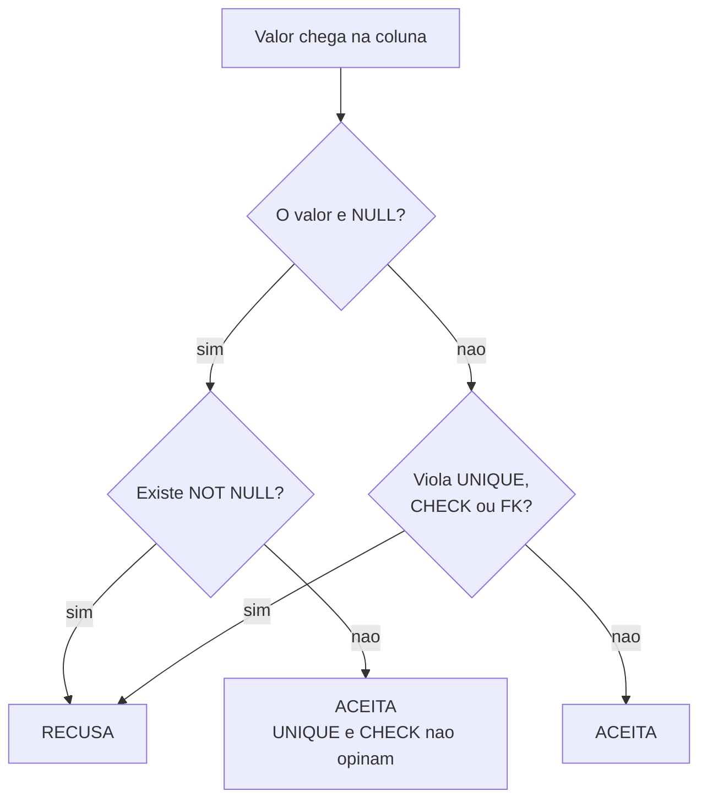

# 03.13 — Constraints e integridade

> **Módulo 03 — SQL** · Nível: N2 · Tempo estimado: 2h30 · Código: `codigo/cap13/`

## 1. Objetivo

- **Aplicar** as cinco restrições: `NOT NULL`, `UNIQUE`, `PRIMARY KEY`, `CHECK` e `FOREIGN KEY`.
- **Prever** a mensagem exata de cada violação — e reconhecê-la em produção.
- **Explicar** os dois buracos que o `NULL` abre em `UNIQUE` e `CHECK`.
- **Escolher** entre `CASCADE`, `SET NULL` e `RESTRICT` como decisão de negócio, não de sintaxe.

Ao final, você para de tratar restrição como burocracia do `CREATE TABLE` e passa a usá-la como o que ela é: a única validação que **nenhum caminho de escrita consegue burlar**.

---

## 2. Pré-requisitos

- [03.12 — DDL e tipos](12-ddl-e-tipos-de-dados.md) — `STRICT` garante tipo; este capítulo cuida de tudo o que ele não garante.
- [03.03 — `SELECT` e `WHERE`](03-select-e-where.md) — **a lógica de três valores é o capítulo inteiro**: `NULL` não é verdadeiro nem falso, e as restrições só recusam o que é comprovadamente falso.
- [03.11 — `INSERT`, `UPDATE`, `DELETE`](11-insert-update-delete.md) — você já viu `NOT NULL` e `FOREIGN KEY` recusarem comandos.

**Autoteste:** (1) `NULL = NULL` devolve o quê? (2) Por que `NOT IN` com um `NULL` na lista devolve zero linhas? (3) O que impediu o `DELETE FROM clientes WHERE id = 1` no 03.11?

---

## 3. Motivação

Uma regra de negócio pode morar em três lugares: na cabeça de quem escreve o código, na aplicação, ou no banco. Os dois primeiros têm o mesmo defeito — **são burláveis**. O analista que roda um `UPDATE` direto no terminal não passa pela validação da aplicação. O script de importação que alguém escreveu às pressas não passa. A API antiga que ninguém desligou não passa.

A restrição no banco é o único lugar onde a regra vale para **todos** os caminhos de escrita, inclusive os que ainda não existem.

O capítulo anterior terminou com um problema em aberto: a tabela `avaliacoes` declarava `nota INTEGER NOT NULL` numa tabela `STRICT`, e ainda assim aceitava `nota = 47`. `STRICT` garante que o valor é um inteiro. Não garante que seja um inteiro **que faça sentido**. A diferença entre as duas coisas é este capítulo.

E há uma segunda tese, menos confortável: **duas das cinco restrições prometem mais do que entregam**, e o motivo é o mesmo `NULL` que persegue este módulo desde o 03.03.

---

## 4. Modelo mental

Cinco restrições, cada uma respondendo a uma pergunta diferente:

| Restrição | A pergunta que responde | Pega |
|---|---|---|
| `NOT NULL` | esse campo pode faltar? | valor ausente |
| `UNIQUE` | esse valor pode se repetir? | duplicata — **exceto `NULL`** |
| `PRIMARY KEY` | o que identifica esta linha? | duplicata + ausência (em tese) |
| `CHECK` | que valores fazem sentido? | valor fora da faixa — **exceto `NULL`** |
| `FOREIGN KEY` | esse valor existe na outra tabela? | referência quebrada |

**A regra que explica os dois "exceto":** uma restrição recusa o que é **comprovadamente falso**. Quando o valor é `NULL`, a condição não é falsa — é **desconhecida**. E desconhecido não é motivo de recusa.

É a mesma mecânica de três valores do 03.03, aparecendo pela quinta vez no módulo: no `WHERE` (03.03), na agregação (03.05), no `LEFT JOIN` (03.08), no `NOT IN` (03.09) e agora nas restrições. **Se você entendeu `NULL` uma vez, entendeu cinco capítulos.**

---

## 5. Analogia

Uma restrição é o **segurança da porta**, não o aviso na parede.

O aviso — "proibida a entrada de menores" — depende de todo mundo lê-lo e respeitá-lo. Funciona com quem coopera. A validação na aplicação é o aviso: protege contra o usuário do formulário, e não contra o script de importação que entra pela porta dos fundos.

O segurança confere documento de cada pessoa, sempre, venha ela pela porta da frente, pelos fundos ou pela janela. **Ninguém entra sem passar por ele.**

E a analogia se completa no ponto desconfortável: se a pessoa não tem documento nenhum, o segurança deste prédio deixa passar. Ele foi instruído a barrar quem **comprovadamente** não pode entrar. Sem documento, ele não pode comprovar nada — e a ausência de prova não é prova de irregularidade. É exatamente assim que `UNIQUE` e `CHECK` tratam o `NULL`.

---

## 6. Teoria

### 6.1 `NOT NULL` e `DEFAULT`

A mais simples e a mais subusada. Toda coluna nasce opcional; `NOT NULL` a torna obrigatória.

```
Erro de SQL: NOT NULL constraint failed: clientes.data_cadastro
```

A mensagem nomeia tabela e coluna — uma das mais úteis que o SQLite produz.

Com `DEFAULT`, a coluna continua obrigatória, mas o banco fornece o valor quando você omite. E vale repetir a distinção do 03.11, porque ela cai em entrevista: **omitir a coluna aciona o `DEFAULT`; passar `NULL` explicitamente grava nulo** — ou falha, se houver `NOT NULL`.

### 6.2 `UNIQUE` e o primeiro buraco

```sql
CREATE TABLE assinaturas (
    id    INTEGER PRIMARY KEY,
    email TEXT UNIQUE
);

INSERT INTO assinaturas (email) VALUES ('ana@aurora.com'), (NULL), (NULL), (NULL);
```

```
linhas | emails_preenchidos
-------+-------------------
     4 |                  1
```

**Quatro linhas.** Três `NULL` numa coluna declarada `UNIQUE`, sem nenhuma reclamação.

O motivo, se você lembra do 03.03, é inevitável: `UNIQUE` recusa valores **iguais**, e `NULL = NULL` não é verdadeiro — é desconhecido. Dois `NULL` nunca são detectados como duplicados porque nunca são detectados como iguais.

Com valor de verdade, aí sim:

```
INSERT INTO assinaturas (email) VALUES ('ana@aurora.com');
-> Erro de SQL: UNIQUE constraint failed: assinaturas.email
```

**A consequência prática.** Se `email` deve ser único **e obrigatório**, `UNIQUE` sozinho não entrega: precisa de `NOT NULL UNIQUE`, os dois. Um cadastro que "não permite e-mail duplicado" e aceita e-mail vazio vai acumular linhas sem e-mail nenhum, e a unicidade que você acha que tem não existe para elas.

**`UNIQUE` composta.** A unicidade pode envolver mais de uma coluna:

```sql
CREATE TABLE comp (a INTEGER, b INTEGER, UNIQUE(a, b));
```

`(1,1)`, `(1,2)` e `(2,1)` convivem; um segundo `(1,1)` é recusado com `UNIQUE constraint failed: comp.a, comp.b`. É o que impede, por exemplo, o mesmo produto aparecer duas vezes no mesmo pedido: `UNIQUE(pedido_id, produto_id)`.

### 6.3 `PRIMARY KEY` e um furo histórico

`PRIMARY KEY` deveria ser `UNIQUE` **mais** `NOT NULL`. No SQLite, deveria:

```sql
CREATE TABLE chave_texto (id TEXT PRIMARY KEY, x TEXT);
INSERT INTO chave_texto VALUES (NULL, 'chave primaria nula');
```

```
id   | x
-----+--------------------
NULL | chave primaria nula
```

**Uma chave primária nula.** Isso é um bug antigo do SQLite, mantido por compatibilidade — a documentação o admite explicitamente. Vale só para chaves que **não** são `INTEGER PRIMARY KEY`; nessa combinação especial (03.12), o `NULL` faz o banco gerar o próximo id.

Duas formas de fechar o furo, e as duas funcionam:

```sql
CREATE TABLE pk3 (id TEXT PRIMARY KEY, x TEXT) STRICT;   -- STRICT resolve
CREATE TABLE pk4 (id TEXT PRIMARY KEY NOT NULL, x TEXT); -- explícito resolve
```

Ambas devolvem `NOT NULL constraint failed`. Mais um argumento para `STRICT` em tabela nova — ele corrige um comportamento que quase ninguém sabe que existe.

### 6.4 `CHECK` e o segundo buraco

`CHECK` é a restrição que valida **faixa** e **conjunto** — exatamente o que `STRICT` não faz:

```sql
CREATE TABLE avaliacoes (
    id     INTEGER PRIMARY KEY,
    nota   INTEGER NOT NULL CHECK (nota BETWEEN 1 AND 5),
    status TEXT             CHECK (status IN ('publicada', 'oculta'))
) STRICT;
```

O problema do capítulo anterior está resolvido:

```
INSERT INTO avaliacoes VALUES (2, 47, 'publicada');
-> Erro de SQL: CHECK constraint failed: nota BETWEEN 1 AND 5

INSERT INTO avaliacoes VALUES (3, 5, 'rascunho');
-> Erro de SQL: CHECK constraint failed: status IN ('publicada', 'oculta')
```

Repare que a mensagem repete a **condição inteira**. Quem lê o log entende o que foi violado sem abrir o schema — um bom argumento para escrever `CHECK` legível.

E o buraco:

```sql
INSERT INTO avaliacoes VALUES (1, 5, NULL);
```

```
id | nota | status
---+------+-------
 1 |    5 | NULL
```

**Passou.** `NULL IN ('publicada', 'oculta')` é desconhecido, e `CHECK` só recusa o falso. A coluna `status` promete três valores possíveis e aceita quatro: os dois da lista, mais o nulo.

**A correção é a mesma do `UNIQUE`:** se o conjunto é fechado, `NOT NULL CHECK (...)`. E se o nulo for legítimo — "ainda não decidido" —, então a lista tem três estados e é honesto escrever isso, seja com `NOT NULL` e um valor `'pendente'`, seja documentando que o nulo faz parte do domínio.

⚠️ **Caixa-preta 1:** as restrições são verificadas **quando**, exatamente? No SQLite, a cada comando. Em outros bancos existem restrições *deferidas*, checadas só no `COMMIT` — o que permite, por exemplo, inserir duas linhas que se referenciam mutuamente. O momento da verificação e o que acontece quando ela falha no meio de uma transação é o [03.15 — Transações e ACID](15-transacoes-e-acid.md).

### 6.5 `FOREIGN KEY`: as três ações

Você já viu a chave estrangeira recusar um `DELETE` (03.11) e um `INSERT` fora de ordem. O que ela faz quando o pai é apagado é **configurável**, e a escolha é de negócio:

```sql
CREATE TABLE filho_casc (
    id     INTEGER PRIMARY KEY,
    pai_id INTEGER REFERENCES pai(id) ON DELETE CASCADE
);
```

| Ação | Ao apagar o pai | Quando faz sentido |
|---|---|---|
| `CASCADE` | **apaga os filhos junto** | o filho não existe sem o pai: itens de um carrinho, endereços de um cliente removido |
| `SET NULL` | o filho sobrevive com `pai_id = NULL` | a relação é opcional: um produto sem categoria continua sendo um produto |
| `RESTRICT` | **recusa o `DELETE`** | o filho é histórico e o pai não pode sumir: pedidos de um cliente |
| `NO ACTION` | o padrão; na prática, recusa | quando você não decidiu — e não decidir é decidir por este |

Os três, executados lado a lado:

```
DELETE FROM pai WHERE id = 1;   -- CASCADE
filhos_cascade_restantes: 0     -- o filho foi junto

DELETE FROM pai WHERE id = 2;   -- SET NULL
id | pai_id
20 | NULL                       -- sobreviveu, órfão declarado

DELETE FROM pai WHERE id = 3;   -- RESTRICT
-> Erro de SQL: FOREIGN KEY constraint failed
```

**`CASCADE` é a mais perigosa das três**, e por um motivo que a sintaxe esconde: ela transforma um `DELETE` de uma linha num `DELETE` de tamanho desconhecido. Apagar um cliente com `CASCADE` até `itens_pedido` pode remover milhares de linhas de histórico — e a saída `Linhas afetadas: 1` do 03.11 mostra **1**, porque conta só a linha do comando. A conferência que o 03.11 ensinou não enxerga o cascateamento.

**A contradição que só aparece anos depois.** Considere:

```sql
CREATE TABLE filho_bug (
    id     INTEGER PRIMARY KEY,
    pai_id INTEGER NOT NULL REFERENCES pai(id) ON DELETE SET NULL
);
```

A tabela é criada sem reclamação. Os `INSERT` funcionam. Tudo parece certo por meses. Até que alguém apaga um pai:

```
Erro de SQL: NOT NULL constraint failed: filho_bug.pai_id
```

A coluna diz "nunca nula" e a ação diz "torne nula". As duas declarações se contradizem, e **o banco não avisa na criação** — ele descobre no primeiro `DELETE`, que pode acontecer anos depois, em produção, no meio de uma rotina noturna. É o tipo de defeito que só a leitura atenta do schema pega, porque nenhum teste que não apague um pai vai encontrá-lo.

⚠️ **Caixa-preta 2:** chaves estrangeiras dependem de encontrar a linha referenciada rapidamente — e é por isso que quase todo banco cria um índice automaticamente sobre a coluna referenciada. O que é um índice, por que ele torna a busca rápida e quando ele atrapalha é o [03.14 — Índices](14-indices.md).

### 6.6 O pragma que decide tudo

Vale repetir do 03.11, porque aqui é o lugar: **no SQLite a verificação de chave estrangeira vem desligada por padrão.** Sem `PRAGMA foreign_keys = ON` a cada conexão, todas as chaves estrangeiras deste capítulo viram decoração — os `DELETE` passam, os órfãos se acumulam, e nada avisa.

O `codigo/sql.py` liga o pragma desde o 03.01. Se você testar em outra ferramenta e as recusas não acontecerem, é a primeira coisa a conferir.

---

## 7. Funcionamento interno

`UNIQUE` e `PRIMARY KEY` não são verificados percorrendo a tabela — isso seria proibitivo. O banco cria um **índice** por baixo de cada uma, e a verificação de duplicata é uma busca nesse índice. É o motivo de `UNIQUE` ter custo de escrita: cada `INSERT` atualiza a estrutura.

`CHECK` é diferente: é uma expressão avaliada por linha, sem estrutura auxiliar. Custo baixo, e nenhum efeito sobre leitura.

`FOREIGN KEY`, com o pragma ligado, faz uma busca na tabela pai a cada `INSERT` ou `UPDATE` da coluna. Se a coluna referenciada é chave primária — o caso normal —, essa busca usa o índice que já existe.

---

## 8. Visualização do fluxo



**Como ler:** o ramo da esquerda é o capítulo inteiro. Quando o valor é `NULL`, a única restrição consultada é `NOT NULL` — `UNIQUE` e `CHECK` são pulados, não porque foram satisfeitos, mas porque não têm o que avaliar. A caixa `E` é onde moram os três `NULL` na coluna `UNIQUE` e o `status` fora da lista.

---

## 9. Aplicação prática

**A dor da Aurora.** O suporte relatou três problemas na mesma semana, e ninguém suspeitou que fossem o mesmo problema:

1. Dois clientes com o mesmo e-mail receberam a promoção em duplicidade.
2. Um relatório mostrou uma avaliação com nota 47 num gráfico de 1 a 5, esticando a escala.
3. Um pedido apareceu num relatório apontando para um cliente que não existe mais.

Os três são regras que **existiam** — todo mundo sabia que e-mail é único, que nota vai de 1 a 5, que pedido tem cliente. Nenhuma delas estava no banco. Estavam no formulário do site, que valida direitinho — e não é o único caminho de escrita: há um script de importação de planilha, uma API de parceiros e um analista com acesso de escrita.

**O schema corrigido:**

```sql
CREATE TABLE clientes (
    id            INTEGER PRIMARY KEY,
    nome          TEXT NOT NULL,
    email         TEXT NOT NULL UNIQUE,     -- os DOIS, pelo motivo da §6.2
    cidade        TEXT,
    data_cadastro TEXT NOT NULL
) STRICT;
```

E aqui aparece o desconforto que faz este exercício valer: **o e-mail da Beatriz é `NULL` desde o 03.01.** A regra nova recusa um dado que já existe. Você tem três saídas, e nenhuma é indolor:

- **preencher** os nulos com algo — e inventar dado é pior que não ter;
- **excluir** as linhas problemáticas — perde-se informação real;
- **aplicar a regra só daqui pra frente** — o banco não faz isso sozinho; exigiria um `CHECK` condicionado à data de cadastro, que é uma gambiarra com data de validade.

A escolha usual é a terceira em espírito e a primeira na forma: corrigir os dados históricos **manualmente**, um a um, com quem conhece o negócio, e só então aplicar a restrição.

**A entrega, e a lição que ela carrega.** Restrição é barata na criação e cara depois — não pelo comando, mas porque **os dados que já existem podem não obedecer à regra que você quer impor.** Toda restrição adicionada a uma tabela em produção começa com uma consulta: quantas linhas violariam isso hoje? Se a resposta não for zero, você não tem um problema de SQL — tem um problema de negócio para resolver antes.

---

## 10. Código comentado

`codigo/cap13/restricoes.sql` roda os 33 comandos contra `dados/ddl.db` e termina, como os dois capítulos anteriores, com uma falha proposital — a contradição `NOT NULL` + `SET NULL` da §6.5.

Quatro comandos aparecem **comentados** dentro do arquivo, com a saída esperada ao lado: as violações de `UNIQUE`, as duas de `CHECK` e a de `RESTRICT`. Todas falhariam no meio e interromperiam o resto. Rode-as à mão — vale ver cada mensagem.

O arquivo começa com oito `DROP TABLE IF EXISTS`, na ordem **filho antes de pai**. Se você inverter, o `DROP` do pai é recusado pela chave estrangeira do filho — a mesma regra do `INSERT`, ao contrário. É um detalhe que só aparece quando se escreve um script reexecutável, e é o tipo de coisa que a §6.7 do 03.12 prometeu e este arquivo entrega.

---

## 11. Erros comuns

**1. `UNIQUE` sem `NOT NULL`.** Vários `NULL` cabem numa coluna única.
→ `NOT NULL UNIQUE` quando o campo é obrigatório e único.

**2. `CHECK` sem `NOT NULL`.** `NULL` passa por qualquer `CHECK`.
→ Se o conjunto é fechado, feche também a ausência.

**3. Confiar que `PRIMARY KEY` implica `NOT NULL` no SQLite.** Em chave não-inteira, não implica.
→ `STRICT`, ou `NOT NULL` explícito.

**4. Esquecer `PRAGMA foreign_keys = ON`.** Todas as chaves estrangeiras viram enfeite.
→ Ligar em toda conexão; conferir isso antes de concluir que "a FK não funciona".

**5. `ON DELETE CASCADE` sem medir o alcance.** Um `DELETE` de uma linha pode apagar milhares.
→ Rodar o `SELECT` que conta os descendentes antes.

**6. `SET NULL` numa coluna `NOT NULL`.** Cria sem erro, quebra no primeiro `DELETE`.
→ Ler o schema procurando essa combinação; nenhum teste comum a encontra.

**7. Validar só na aplicação.** Existe sempre outro caminho de escrita.
→ A regra crítica vai no banco; a aplicação repete para dar mensagem melhor.

**8. Adicionar restrição sem auditar os dados.** No SQLite não há `ADD CONSTRAINT` (03.12) — e mesmo onde há, a restrição falha se os dados atuais a violam.
→ `SELECT COUNT(*)` das linhas violadoras **antes**.

---

## 12. Boas práticas

- **`NOT NULL` por padrão**; opcional é a exceção, e a exceção precisa de motivo escrito.
- **`NOT NULL UNIQUE` para campos únicos obrigatórios** — sempre os dois.
- **`CHECK` para todo domínio fechado**: status, categorias, faixas, sinais.
- **Restrição nomeada quando o banco permite**, para que o erro em produção diga qual regra caiu.
- **Escolha a ação de `ON DELETE` conscientemente.** Não escolher é escolher `NO ACTION`.
- **Prefira `RESTRICT` a `CASCADE`** quando houver dúvida: recusar é reversível, apagar não.
- **A regra de negócio crítica mora no banco.** A aplicação valida para dar boa mensagem ao usuário, não para ser a única defesa.
- **Antes de adicionar restrição em produção, conte as violações atuais.**

---

## 13. Performance

`UNIQUE` e `PRIMARY KEY` custam na **escrita**, porque mantêm um índice. Em compensação, esse índice acelera as leituras que filtram por aquela coluna — você paga por uma verificação e ganha uma busca rápida de brinde.

`CHECK` é praticamente gratuito: uma expressão por linha, sem estrutura.

`FOREIGN KEY` custa uma busca por escrita. Se a coluna referenciada é chave primária, a busca usa o índice existente. **Mas a coluna que aponta — a do filho — não é indexada automaticamente no SQLite**, e é ela que importa em `ON DELETE CASCADE`: apagar um pai exige encontrar todos os filhos. Sem índice em `pai_id`, é uma varredura completa da tabela filha a cada `DELETE`. É o assunto do próximo capítulo, e um dos casos em que a falta de um índice tem efeito imediato e grande.

---

## 14. Mercado

Existe uma discussão de longa data sobre onde as regras devem morar. Um lado argumenta que o banco é o guardião final e a validação pertence a ele; o outro, que regras no banco são difíceis de versionar, testar e evoluir, e que a lógica pertence à aplicação — sobretudo em arquiteturas com vários serviços, onde cada um tem seu próprio banco.

Os dois têm razão sobre pontos diferentes, e a prática mais comum é dividir por **criticidade**: as invariantes que corrompem dados se violadas (unicidade de identificadores, integridade referencial, faixas que quebram relatórios) vão para o banco; as regras que mudam com frequência ou dependem de contexto (limites por plano, promoções, permissões) ficam na aplicação. A pergunta que separa: **se essa regra for violada, dá para consertar depois?** Se a resposta é não, ela vai para o banco.

Vale conhecer o outro lado da moeda: bancos de dados NoSQL frequentemente abrem mão dessas garantias em troca de escala e flexibilidade de schema, e isso não os torna errados — torna a validação responsabilidade integral da aplicação. Saber o que se está trocando é o que distingue uma escolha de arquitetura de uma escolha por moda.

---

## 15. Entrevistas

- **"Qual a diferença entre `PRIMARY KEY` e `UNIQUE`?"** Ambas garantem unicidade. `PRIMARY KEY` é uma só por tabela e implica `NOT NULL` (na maioria dos bancos); `UNIQUE` pode haver várias e **aceita `NULL`** — e a boa resposta menciona que aceita **vários** nulos, porque `NULL ≠ NULL`.
- **"Onde você põe as regras de negócio: banco ou aplicação?"** Testam julgamento, não doutrina. A resposta forte divide por criticidade e cita o argumento decisivo: existe sempre mais de um caminho de escrita.
- **"O que acontece ao apagar um cliente que tem pedidos?"** Depende da ação declarada — e a resposta completa diz que, para pedidos, `RESTRICT` costuma ser a escolha certa, porque histórico financeiro não deve sumir junto com um cadastro.
- **"Uma coluna `UNIQUE` está aceitando duplicatas. O que investigar?"** Provavelmente são `NULL`s. Depois: o `UNIQUE` existe mesmo no schema, ou só na cabeça de alguém? E a comparação é sensível a maiúsculas — `Ana@x.com` e `ana@x.com` são valores distintos para o banco.

---

## 16. Exercícios guiados

Em [`exercicios/cap13.md`](exercicios/cap13.md):

- **A1** `[~10 min · prevê a mensagem]` — 8 comandos: qual restrição cai, e com que texto?
- **A2** `[~10 min · passa ou não passa?]` — 6 inserções com `NULL` em colunas restritas.
- **A3** `[~10 min · qual ação?]` — 6 relações: `CASCADE`, `SET NULL` ou `RESTRICT`?
- **A4** `[~10 min · a regra vai onde?]` — 6 regras de negócio: banco ou aplicação?
- **AP1** `[~25 min · fechando os buracos]` — Corrija um schema em que `UNIQUE` e `CHECK` não seguram.
- **AP2** `[~20 min · o alcance do CASCADE]` — Meça quantas linhas um `DELETE` apagaria.
- **AP3** `[~25 min · a restrição tardia]` — Audite antes, corrija os dados, aplique a regra.
- **D1** `[~50 min · o schema blindado]` — **Tente quebrar seu próprio schema.**

---

## 17. Desafios

**D1 — O schema blindado.** Pegue o schema da biblioteca que você criou no D1 do 03.12 e blinde-o com todas as restrições cabíveis. Depois — e esta é a parte que vale — escreva um arquivo `ataques.sql` com **quinze** comandos que **deveriam** ser recusados: nota fora da faixa, e-mail duplicado, empréstimo sem leitor, devolução anterior à saída, exemplar de livro inexistente, e assim por diante.

Execute os quinze. Para cada um que **passar**, você encontrou um buraco: descreva a regra que faltava, corrija o schema e rode de novo. Termine com um relatório: quantos ataques passaram na primeira rodada, quais restrições você tinha esquecido, e quantos deles o `NULL` viabilizou.

---

## 18. Mini projeto

**A auditoria da Aurora.** Escreva um script `auditoria.sql` que verifique, sobre o banco real da Aurora, se cada uma das regras abaixo é violada hoje — e por quantas linhas: e-mails duplicados; e-mails ausentes; pedidos apontando para clientes inexistentes; itens com quantidade zero ou negativa; preços não positivos; datas fora do formato ISO; status fora do conjunto conhecido.

Para cada violação encontrada, escreva: a consulta que a detecta, o número de linhas afetadas, a restrição que a impediria, e o que fazer com os dados existentes antes de aplicá-la. **É o relatório que precede toda mudança de schema em produção**, e o formato dele é o que se entrega a um time.

---

## 19. Revisão

**Resumo em 5 frases.** Restrições são a única validação que nenhum caminho de escrita burla, e por isso é onde as regras críticas devem morar. São cinco: `NOT NULL`, `UNIQUE`, `PRIMARY KEY`, `CHECK` e `FOREIGN KEY`. Duas delas têm um buraco pelo mesmo motivo — `UNIQUE` aceita vários `NULL` e `CHECK` deixa `NULL` passar, porque uma restrição recusa o **comprovadamente falso**, e desconhecido não é falso. As três ações de `ON DELETE` são decisões de negócio: `CASCADE` apaga junto (e o alcance é invisível), `SET NULL` preserva órfão, `RESTRICT` recusa. E acrescentar restrição depois é caro não pelo comando, mas porque os dados existentes podem já violá-la — toda mudança de schema começa contando as violações atuais.

**Flashcards** (também em [`revisao/flashcards.md`](revisao/flashcards.md)):

| ID | Frente | Verso |
|---|---|---|
| 03.13-F1 | Quantos `NULL` cabem numa coluna `UNIQUE`? | **Quantos você quiser.** `UNIQUE` recusa valores **iguais**, e `NULL = NULL` é desconhecido, não verdadeiro. Para um campo único e obrigatório: `NOT NULL UNIQUE`, os dois. |
| 03.13-F2 | Explique com suas palavras por que `NULL` passa por um `CHECK`. | (Elaboração) A restrição recusa o que é **comprovadamente falso**. `NULL IN ('a','b')` é **desconhecido** — não é falso —, então não há motivo de recusa. Mesma lógica de três valores do 03.03. |
| 03.13-F3 | Preveja: `pai_id INTEGER NOT NULL REFERENCES pai(id) ON DELETE SET NULL`. Quando quebra? | (Previsão) A tabela é criada e os `INSERT` funcionam. Quebra no **primeiro `DELETE` de um pai**, com `NOT NULL constraint failed` — o que pode levar anos para acontecer. |
| 03.13-F4 | `CASCADE`, `SET NULL` ou `RESTRICT` para pedidos de um cliente? | (Decisão) **`RESTRICT`**. Histórico financeiro não some junto com um cadastro. `CASCADE` seria correto para itens de carrinho; `SET NULL`, para a categoria de um produto. |
| 03.13-F5 | O que fazer **antes** de adicionar uma restrição a uma tabela em produção? | Contar as linhas que a violariam hoje: `SELECT COUNT(*) FROM t WHERE <negação da regra>`. Se não for zero, o problema é de negócio — decidir o destino desses dados vem antes do SQL. |

**Revisão espaçada:** D+1 refaça A1 e A2 · D+7 o AP3 (auditar, corrigir, aplicar) · D+30 liste as cinco restrições e os dois buracos do `NULL` de memória.

---

## 20. Checklist

- [ ] Sei enunciar as cinco restrições e a pergunta que cada uma responde.
- [ ] Inseri três `NULL` numa coluna `UNIQUE` e sei explicar por que passaram.
- [ ] Vi um `NULL` atravessar um `CHECK` com lista fechada.
- [ ] Sei que `PRIMARY KEY` de texto aceita `NULL` no SQLite, e as duas formas de fechar.
- [ ] Executei `CASCADE`, `SET NULL` e `RESTRICT` e vi os três resultados.
- [ ] Reconheço a contradição `NOT NULL` + `SET NULL` lendo um schema.
- [ ] Sei que sem `PRAGMA foreign_keys = ON` nada disso acontece.
- [ ] Consigo decidir se uma regra vai para o banco ou para a aplicação, e justificar.
- [ ] Sei o que consultar antes de adicionar uma restrição em produção.

---

## 21. Próximo capítulo

[03.14 — Índices](14-indices.md). Este capítulo mencionou índices três vezes sem explicá-los: `UNIQUE` cria um por baixo, chaves estrangeiras dependem de um para não varrer a tabela, e `ON DELETE CASCADE` sem índice na coluna filha percorre tudo a cada `DELETE`. O próximo capítulo abre a caixa: o que é uma B-tree, por que ela transforma uma busca em milhões de linhas em algumas comparações, e por que indexar tudo é uma péssima ideia.
