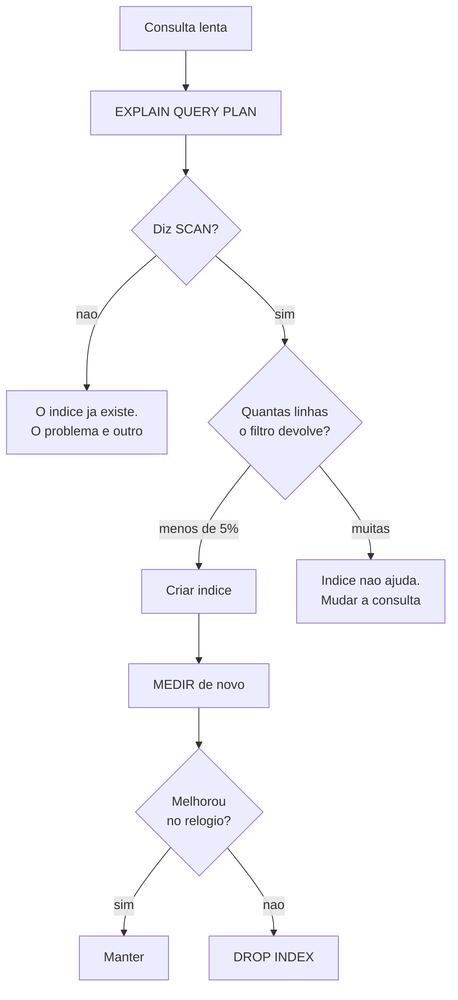

# 03.14 — Índices

> **Módulo 03 — SQL** · Nível: N2 · Tempo estimado: 2h30 · Código: `codigo/cap14/`

## 1. Objetivo

- **Explicar** o que é uma B-tree e por que ela troca varredura por poucas comparações.
- **Ler** um plano de execução e distinguir `SCAN` de `SEARCH`.
- **Medir** o ganho de um índice em vez de supô-lo.
- **Justificar** quando **não** indexar — que é a parte que separa quem entendeu.

Ao final, você para de tratar índice como remédio universal e passa a decidir por seletividade, com número na mão.

---

## 2. Pré-requisitos

- [03.13 — Constraints](13-constraints-e-integridade.md) — `UNIQUE` cria um índice por baixo; chaves estrangeiras dependem de um.
- [03.06 — `GROUP BY`](06-group-by-e-having.md) — `COUNT(DISTINCT ...)` é como se mede cardinalidade.
- [01.24 — Depuração](../01-Python/24-depuracao-no-vs-code.md) — medir antes de otimizar é o mesmo hábito, em outro contexto.

**Autoteste:** (1) Como você procura uma palavra num dicionário de papel? (2) E numa lista de compras embaralhada? (3) Qual das duas buscas fica lenta quando o número de itens dobra?

---

## 3. Motivação

Todas as consultas deste módulo rodaram sobre 71 linhas. Nesse tamanho, o banco lê a tabela inteira em microssegundos e qualquer consulta é instantânea — o que torna impossível perceber a diferença entre uma consulta boa e uma ruim.

Este capítulo troca de escala. `dados/indices.db` tem **500 mil** eventos, e aqui a diferença aparece no relógio:

```
SELECT * FROM eventos WHERE cliente_id = 27384;

SEM índice   SCAN eventos                              35.181 ms
COM índice   SEARCH eventos USING INDEX idx_cliente     0.046 ms
>>> 763x mais rápido
```

Setecentas e sessenta e três vezes, com um comando de uma linha. É o maior ganho isolado que você encontra em SQL, e a razão pela qual "põe um índice" é o primeiro conselho que qualquer pessoa dá diante de uma consulta lenta.

O problema é que o conselho está errado com a mesma frequência com que está certo. Na **mesma tabela**, com o **mesmo tipo de índice**:

```
SELECT * FROM eventos WHERE tipo = 'login';

SEM índice   SCAN eventos                             217.711 ms
COM índice   SEARCH eventos USING INDEX idx_tipo      222.894 ms
>>> nenhum ganho
```

O índice foi criado, o banco decidiu usá-lo, e não mudou nada — enquanto ocupa disco e torna toda escrita mais lenta, para sempre. **O capítulo é sobre o que diferencia os dois casos.**

---

## 4. Modelo mental

Um índice é uma **cópia ordenada** de uma coluna, mantida ao lado da tabela, com um ponteiro para a linha original.

A tabela é uma lista de compras na ordem em que você lembrou dos itens. Procurar "canela" nela exige ler tudo — é o `SCAN`. O índice é a mesma lista, copiada em ordem alfabética: procurar "canela" ali é abrir no meio, decidir para que lado ir, e repetir. É o `SEARCH`.

O que muda não é a velocidade de cada leitura — é **quantas leituras**:

| Linhas | Varredura (`SCAN`) | Busca ordenada (`SEARCH`) |
|---|---|---|
| 1 000 | 1 000 comparações | ~10 |
| 1 000 000 | 1 000 000 | ~20 |
| 1 000 000 000 | 1 000 000 000 | ~30 |

Multiplicar a tabela por mil acrescenta **dez** comparações à busca. É por isso que o ganho cresce com o tamanho da tabela — e por que ele é invisível em 71 linhas.

**Os três custos, que nenhum tutorial menciona junto com o ganho:** o índice ocupa disco (o arquivo passou de 16,6 MB para 22,3 MB com **um** índice), torna cada escrita mais lenta (porque a cópia ordenada precisa ser atualizada), e precisa ser mantido para sempre, mesmo que ninguém use a consulta que o justificava.

---

## 5. Analogia

Um índice é o **índice remissivo** no fim de um livro técnico.

Sem ele, achar todas as menções a "transação" exige folhear as 600 páginas. Com ele, você vai ao "T", encontra a entrada e pula direto para as páginas 412 e 588.

A analogia continua exatamente onde precisa continuar. Primeiro: **o índice remissivo ocupa páginas.** Ele não é de graça; o livro engordou. Segundo: **se o livro for revisado, o índice precisa ser refeito** — e essa é a razão de as escritas ficarem mais lentas. Terceiro, e mais importante: **um índice remissivo para a palavra "de" seria inútil.** Ela aparece em todas as páginas; a entrada listaria o livro inteiro, e consultá-la dá o mesmo trabalho que folhear.

`tipo = 'login'` é a palavra "de". `cliente_id = 27384` é "transação". A mesma estrutura, resultados opostos.

---

## 6. Teoria

### 6.1 O laboratório deste capítulo

```bash
python codigo/cap14/preparar_indices.py    # 500.000 linhas, nenhum índice
python codigo/cap14/medir.py               # os três experimentos
```

A tabela `eventos` tem quatro colunas com cardinalidades **deliberadamente diferentes** — é o que permite comparar:

```
cliente_id  ~50.000 valores distintos   (~10 linhas cada)
valor       ~90.000 valores distintos   (~5 linhas cada)
data           ~224 valores distintos   (~2.200 linhas cada)
tipo              5 valores distintos   (~100.000 linhas cada)
```

Guarde essa tabela: ela prevê o resultado de todos os experimentos do capítulo.

### 6.2 B-tree: por que ~20 e não 1 000 000

A estrutura por trás de quase todo índice é a **B-tree** — uma árvore em que cada nó guarda várias chaves ordenadas e ponteiros para os nós seguintes.

Procurar um valor é: ler o nó raiz, comparar, descer pelo ponteiro certo, repetir. Cada nível descartado elimina uma fração enorme do que resta. Como cada nó cabe numa página de disco e guarda centenas de chaves, a árvore fica **rasa**: milhões de linhas em três ou quatro níveis.

Duas consequências que vêm de graça e explicam metade dos comportamentos deste capítulo:

- **Faixas são rápidas.** Como as chaves estão ordenadas, `BETWEEN 100 AND 120` encontra a primeira e caminha em sequência.
- **`ORDER BY` pode sair de graça.** Se a ordenação pedida é a do índice, o banco lê na ordem e pula a etapa de ordenar. Medido: `ORDER BY cliente_id LIMIT 10` com índice levou **0,05 ms**; sem índice, 52 ms.

### 6.3 Lendo o plano de execução

`EXPLAIN QUERY PLAN` antes de qualquer consulta mostra a decisão do banco:

```sql
EXPLAIN QUERY PLAN SELECT * FROM eventos WHERE cliente_id = 27384;
```

```
SEARCH eventos USING INDEX idx_cliente (cliente_id=?)
```

**Duas palavras importam:**

- **`SCAN`** — o banco vai ler a tabela inteira. Em tabela pequena, tudo bem. Em tabela grande com filtro seletivo, é o sintoma.
- **`SEARCH`** — o banco vai usar um índice para ir direto às linhas.

É a ferramenta de diagnóstico do capítulo: **antes de criar um índice, veja se o plano diz `SCAN`; depois de criar, confirme que virou `SEARCH`.** Um índice que não aparece no plano não está sendo usado, e um índice não usado é só custo.

⚠️ **Caixa-preta 1:** o banco *decide* usar um índice — ele não é obrigado. Essa decisão é tomada por um componente chamado **otimizador**, que estima o custo de cada caminho a partir de estatísticas sobre a distribuição dos dados (no SQLite, atualizadas pelo comando `ANALYZE`). Como o otimizador estima, como ele erra e o que fazer quando ele escolhe mal é assunto do módulo 10.

### 6.4 Criando índices

```sql
CREATE INDEX idx_eventos_cliente ON eventos(cliente_id);
CREATE INDEX idx_eventos_data_tipo ON eventos(data, tipo);   -- composto
CREATE UNIQUE INDEX idx_email ON clientes(email);            -- índice + restrição
DROP INDEX idx_eventos_cliente;
```

Convenção de nome: `idx_<tabela>_<colunas>`. Parece burocracia até o dia em que você abre uma base com quarenta índices chamados `idx1`…`idx40` e precisa descobrir quais podem sair.

**Índice composto e a regra do prefixo.** Um índice em `(data, tipo)` é uma lista ordenada primeiro por `data` e, dentro de cada data, por `tipo`. Ele serve para filtros em `data`, e para filtros em `data` **e** `tipo` juntos. **Não serve para um filtro só em `tipo`** — pela mesma razão que a lista telefônica ordenada por sobrenome e depois nome não ajuda a achar todos os "João". A ordem das colunas no índice composto é uma decisão, não um detalhe.

### 6.5 Seletividade: a única coisa que importa

Aqui está o capítulo inteiro. Os dois experimentos, lado a lado:

```
[1] cliente_id = 27384   (~10 de 500.000 linhas)
  SEM  SCAN eventos                                    35.181 ms
  COM  SEARCH eventos USING INDEX idx_cliente           0.046 ms
  >>> 763x mais rápido

[2] tipo = 'login'       (~100.000 de 500.000 linhas)
  SEM  SCAN eventos                                   217.711 ms
  COM  SEARCH eventos USING INDEX idx_tipo            222.894 ms
  >>> nenhum ganho
```

**Mesma tabela, mesmo tipo de índice, resultados opostos.** A diferença está em quantas linhas o filtro devolve.

O motivo é mecânico. Encontrar as linhas no índice é rápido nos dois casos. Mas o índice guarda **ponteiros**, não as linhas — para devolver `SELECT *`, o banco precisa ir buscar cada linha na tabela. Dez idas são instantâneas. Cem mil idas, cada uma para um lugar diferente do disco, custam mais do que ler a tabela em sequência do começo ao fim.

**A regra prática:** o índice compensa quando o filtro devolve uma fração pequena da tabela — a referência usual é **menos de 5% a 10%**. Acima disso, varrer é competitivo ou melhor.

**E o `SEARCH` do caso 2 é uma armadilha de leitura.** O plano diz `SEARCH ... USING INDEX`, o que parece ótimo. O relógio diz que não mudou nada. **Ler o plano não substitui medir o tempo** — o plano conta o caminho escolhido, não se o caminho valeu a pena.

### 6.6 O que impede um índice de ser usado

Medido na mesma tabela, com os índices criados:

| Consulta | Plano | Tempo |
|---|---|---|
| `WHERE cliente_id = 27384` | `SEARCH ... USING INDEX` | 0,09 ms |
| `WHERE cliente_id BETWEEN 100 AND 120` | `SEARCH ... USING INDEX` | 0,76 ms |
| `WHERE cliente_id + 0 = 27384` | **`SCAN`** | 51,70 ms |
| `WHERE data LIKE '2026-03%'` | **`SCAN`** | 157,38 ms |
| `WHERE data LIKE '%03-15'` | **`SCAN`** | 92,61 ms |

**A regra que explica as três últimas linhas: o índice guarda o valor da coluna, não o resultado de uma conta sobre ela.** `cliente_id + 0` é uma expressão nova; a lista ordenada de `cliente_id` não serve para procurá-la. Vale para `UPPER(nome)`, `SUBSTR(cpf, 1, 3)`, `strftime('%Y', data)` — todo caso em que a coluna aparece **dentro** de uma função no `WHERE`.

A correção é reescrever o filtro para deixar a coluna sozinha de um lado. Em vez de extrair o ano da data:

```sql
WHERE data >= '2026-03-01' AND data < '2026-04-01'   -- SEARCH, usa o índice
```

E o `LIKE '%03-15'`, com o coringa no começo, é insolúvel por índice comum — é a busca por sufixo, que nenhuma ordenação alfabética ajuda. Para isso existem índices de texto completo (FTS), assunto de outro módulo.

### 6.7 O custo da escrita

```
[3] 20.000 INSERTs
  0 índices extras ->  171.0 ms
  1 índices extras ->  217.8 ms
  3 índices extras ->  283.6 ms
```

Três índices tornaram a escrita **66% mais lenta**. Cada `INSERT` passou a atualizar quatro estruturas em vez de uma; cada `UPDATE` numa coluna indexada, idem; cada `DELETE` também.

**É o que torna "indexar por precaução" uma péssima decisão.** O ganho de leitura é imediato e visível; o custo de escrita é difuso, permanente e ninguém o associa aos índices criados meses antes. Numa tabela que recebe muita escrita — logs, eventos, filas —, índices demais são a causa de lentidão, não a cura.

⚠️ **Caixa-preta 2:** este capítulo mediu tudo com uma conexão por vez. Quando duas conexões escrevem na mesma tabela indexada ao mesmo tempo, aparece um custo novo — a espera de uma pela outra. O que o banco garante nesse cenário é o [03.15 — Transações e ACID](15-transacoes-e-acid.md).

### 6.8 A armadilha do cache do plano

Um detalhe que atrapalha toda medição caseira: **o SQLite guarda o plano da consulta em cache na conexão.** Se você mede, cria um índice e mede de novo na mesma conexão, o segundo resultado pode usar o plano antigo.

Foi exatamente o que aconteceu na primeira tentativa de medir o experimento 2 deste capítulo: o plano continuou dizendo `USING INDEX` depois de o índice ter sido apagado, e a conclusão registrada foi a errada — de que o índice tornava a consulta mais lenta. Com conexão nova a cada medição, o resultado honesto apareceu: o índice não piora, ele apenas **não ajuda**.

O `medir.py` abre uma conexão nova para cada medição por causa disso. **Medição errada é pior que não medir**, porque produz um número, e números convencem.

---

## 7. Funcionamento interno

O SQLite guarda cada índice como uma B-tree separada dentro do mesmo arquivo. A chave é o valor da coluna indexada; o dado é o `rowid` da linha.

Isso explica a busca em dois tempos da §6.5: primeiro percorre-se a B-tree do índice até a chave, obtendo o `rowid`; depois vai-se à B-tree da tabela buscar a linha por esse `rowid`. Duas travessias por linha encontrada.

Há um caso em que a segunda travessia desaparece: quando **todas** as colunas pedidas já estão no índice. `SELECT cliente_id FROM eventos WHERE cliente_id = 27384` se resolve inteiramente dentro do índice. É o *covering index*, e é a razão de índices compostos às vezes acelerarem consultas de forma desproporcional.

---

## 8. Visualização do fluxo



**Como ler:** há duas perguntas antes de criar o índice e uma medição depois. O caminho `I → K` é o que quase ninguém percorre: índice criado que não ajudou costuma ficar lá para sempre, cobrando escrita. **Criar é metade do trabalho; confirmar e desfazer é a outra.**

---

## 9. Aplicação prática

**A dor da Aurora.** O painel de um cliente — pedidos, itens, total gasto — levava 4 segundos para abrir. Com 500 mil eventos e a base crescendo, a reclamação chegou ao time.

**O que não fazer:** criar índices em todas as colunas do `WHERE` e ver o que acontece. É rápido, às vezes funciona, e deixa para trás índices que ninguém sabe se são necessários.

**O procedimento:**

1. **`EXPLAIN QUERY PLAN` na consulta lenta.** O plano dizia `SCAN eventos` — a tabela inteira, para achar os eventos de um cliente.
2. **Medir a seletividade:** `SELECT COUNT(DISTINCT cliente_id) FROM eventos` devolve ~50 000 em 500 000 linhas — cerca de 10 linhas por cliente, **0,002%** da tabela. Muito abaixo dos 5%.
3. **Criar o índice** em `cliente_id`.
4. **Medir de novo:** 35 ms → 0,046 ms, e o plano virou `SEARCH`.
5. **Verificar o custo:** o arquivo cresceu de 16,6 MB para 22,3 MB, e a escrita ficou ~27% mais lenta. Numa tabela de eventos que recebe escrita constante, isso é uma conta a fazer — e neste caso ela fecha, porque o painel é aberto muito mais vezes do que os eventos são gravados.

**A entrega, e o que ela ensina.** O passo 2 é o que separa o procedimento do chute: **a decisão de indexar foi tomada por um número, antes de o índice existir.** E o passo 5 é o que quase todo mundo pula — um índice é uma dívida permanente, e assumi-la sem saber a taxa de juros é como qualquer outra decisão financeira tomada no impulso.

---

## 10. Código comentado

Dois arquivos. `preparar_indices.py` cria as 500 mil linhas — com `random.seed(42)`, para que seus números batam com os do livro — numa única transação. Sem o `BEGIN`/`COMMIT` explícito, seriam 500 mil transações e a carga levaria minutos em vez de segundos: uma demonstração lateral do 03.15.

`medir.py` roda os três experimentos. Três detalhes de método valem mais que o resultado:

**Conexão nova a cada medição**, pelo motivo da §6.8. É a linha mais importante do arquivo e a menos evidente.

**Mediana, não média.** Uma leitura de disco atrasada — o sistema operacional decidindo fazer outra coisa no meio — distorce a média de sete medições. A mediana ignora o valor extremo. É a mesma razão pela qual se relata mediana de tempo de resposta, e não média, em qualquer sistema real.

**Sete repetições.** Uma medição só não distingue sinal de ruído. Se você rodar o script duas vezes verá números diferentes na terceira casa; a conclusão — 763x contra nenhum ganho — é robusta a essa variação, e é assim que se sabe que uma medição significa algo.

---

## 11. Erros comuns

**1. Indexar sem medir a seletividade.** Coluna com poucos valores distintos não ganha nada.
→ `COUNT(DISTINCT coluna)` antes de `CREATE INDEX`.

**2. Ler `SEARCH` no plano e considerar resolvido.** O caso 2 usa o índice e não melhora.
→ O plano diz o caminho; só o relógio diz se valeu.

**3. Indexar tudo "por precaução".** Três índices custaram 66% na escrita.
→ Um índice é uma dívida permanente.

**4. Função sobre a coluna no `WHERE`.** `UPPER(nome)`, `data + 0`, `strftime(...)` desligam o índice.
→ Deixe a coluna sozinha de um lado; reescreva com faixas.

**5. `LIKE '%algo'`.** Coringa no começo não usa índice comum.
→ Índice de texto completo, ou repensar a busca.

**6. Errar a ordem de um índice composto.** `(data, tipo)` não serve para filtrar só `tipo`.
→ A coluna mais filtrada vem primeiro.

**7. Medir na mesma conexão depois de criar o índice.** Plano em cache; medição inválida.
→ Conexão nova.

**8. Criar índice e nunca verificar se ainda é usado.** Consultas mudam; índices ficam.
→ Revisar periodicamente; `DROP INDEX` é barato e reversível.

---

## 12. Boas práticas

- **Meça antes e depois.** Sempre os dois; o "antes" é o que dá sentido ao "depois".
- **`EXPLAIN QUERY PLAN` é o primeiro comando** diante de consulta lenta, não o último.
- **Índice se justifica por seletividade** — menos de 5% a 10% das linhas.
- **Nomeie `idx_<tabela>_<colunas>`.**
- **Colunas de chave estrangeira do lado filho merecem índice** — o banco não as cria sozinho, e `ON DELETE CASCADE` sem ele varre a tabela toda a cada `DELETE` (03.13).
- **Prefira poucos índices bem escolhidos** a muitos por precaução.
- **Revise os índices existentes** quando as consultas mudarem.
- **Em tabelas de escrita intensa, cada índice é uma decisão** — não um detalhe de configuração.

---

## 13. Performance

Este capítulo inteiro é sobre performance, então cabe aqui o que ele **não** cobre.

Índice resolve o custo de **encontrar** linhas. Não resolve consulta que devolve linhas demais, junção mal escrita, agregação sobre a tabela inteira, nem `SELECT *` trazendo colunas que ninguém usa. Um erro comum é indexar procurando resolver um problema que não é de busca.

E há o efeito de escala inversa: a partir de certo tamanho, o próprio índice não cabe em memória, e percorrê-lo passa a exigir leituras de disco. O ganho continua existindo, mas encolhe. É onde entram particionamento e estratégias de arquitetura — módulo 10.

**A regra que sobrevive a todos os casos: meça.** Estimativa de desempenho é, com frequência desconfortável, errada — inclusive a de quem escreve o banco.

---

## 14. Mercado

"A consulta está lenta" é um dos pedidos mais comuns na vida de quem trabalha com dados, e a resposta esperada não é um índice: é um **diagnóstico**. Plano de execução, seletividade, medição antes e depois, e a conta do custo de escrita.

Em times maduros, criar índice em produção é uma mudança revisada como qualquer outra — porque criar um índice numa tabela grande pode bloqueá-la durante a construção, e porque índices se acumulam. Bases antigas costumam ter dezenas deles, muitos criados às pressas para um problema que já não existe, todos cobrando escrita.

Isso torna a pergunta "quais índices podemos remover?" tão profissional quanto "qual índice devemos criar?" — e bem mais rara. Bancos modernos oferecem estatísticas de uso por índice; saber que elas existem já coloca você à frente na conversa.

---

## 15. Entrevistas

- **"O que é um índice e por que ele acelera?"** Cópia ordenada com ponteiro; B-tree; ~20 comparações em vez de um milhão. A resposta completa menciona que ele custa disco e escrita.
- **"Quando você *não* criaria um índice?"** A pergunta que separa. Coluna pouco seletiva, tabela pequena, tabela de escrita intensa, consulta que roda uma vez por mês. Cite o caso medido: 100 mil de 500 mil linhas, ganho zero, custo permanente.
- **"A consulta está lenta. Primeiro passo?"** `EXPLAIN QUERY PLAN`. Nunca "criar um índice".
- **"Por que `WHERE UPPER(nome) = 'ANA'` não usa o índice?"** O índice guarda `nome`, não `UPPER(nome)`. Soluções: índice sobre expressão (onde houver), coluna normalizada, ou `COLLATE NOCASE`.
- **"Índice composto `(a, b)` serve para filtrar só por `b`?"** Não — regra do prefixo. A lista telefônica ordenada por sobrenome não ajuda a achar todos os "João".

---

## 16. Exercícios guiados

Em [`exercicios/cap14.md`](exercicios/cap14.md):

- **A1** `[~10 min · SCAN ou SEARCH?]` — 8 consultas: preveja o plano antes de rodar.
- **A2** `[~10 min · vale a pena?]` — 6 colunas: qual merece índice, medindo a cardinalidade?
- **A3** `[~10 min · por que não usou?]` — 6 consultas que ignoram o índice existente.
- **A4** `[~10 min · a ordem importa]` — 5 índices compostos: que filtros cada um atende?
- **AP1** `[~25 min · o benchmark]` — Meça três consultas antes e depois, com método.
- **AP2** `[~20 min · reescrevendo o filtro]` — Faça quatro `SCAN` virarem `SEARCH` sem criar índice.
- **AP3** `[~25 min · a conta completa]` — Ganho de leitura contra custo de escrita e disco.
- **D1** `[~50 min · o parecer]` — **Um relatório que decide criar ou não criar.**

---

## 17. Desafios

**D1 — O parecer.** Você recebeu quatro consultas lentas de um sistema em produção e precisa entregar um parecer que outra pessoa executa. Para **cada** consulta: o plano atual, a seletividade medida do filtro, a recomendação (criar qual índice, ou não criar), o ganho medido, o custo em disco e em escrita, e a recomendação final com justificativa.

A parte que vale: **pelo menos uma das quatro não deve receber índice** — e o parecer precisa dizer isso com número, não com opinião. Termine com a pergunta que você faria ao time antes de aplicar em produção.

---

## 18. Mini projeto

**O auditor de índices.** Escreva `auditar_indices.py` que, sobre um banco qualquer, produza um relatório: todos os índices existentes (lidos de `sqlite_master`), a cardinalidade de cada coluna indexada, quais índices são redundantes (um índice em `(a)` é redundante se existe um em `(a, b)`), e quais colunas de chave estrangeira **não** têm índice — o caso do `ON DELETE CASCADE` do 03.13.

Requisitos: funcionar em qualquer banco SQLite passado como argumento; não alterar nada; e terminar com uma lista de recomendações ordenada por impacto estimado, cada uma com o comando SQL que a aplica.

---

## 19. Revisão

**Resumo em 5 frases.** Um índice é uma cópia ordenada de uma coluna, organizada como B-tree, que troca a varredura da tabela inteira por ~20 comparações — e o ganho cresce com o tamanho da tabela. `EXPLAIN QUERY PLAN` mostra a decisão do banco: `SCAN` é varredura, `SEARCH` é uso de índice. O que decide se vale a pena é a **seletividade**: com 10 linhas de 500 mil, 763x mais rápido; com 100 mil de 500 mil, ganho nenhum. Índice custa disco e torna toda escrita mais lenta — três índices custaram 66% no tempo de inserção —, e esse custo é permanente. E qualquer função sobre a coluna no `WHERE` desliga o índice, porque o que está indexado é o valor da coluna, não o resultado da conta.

**Flashcards** (também em [`revisao/flashcards.md`](revisao/flashcards.md)):

| ID | Frente | Verso |
|---|---|---|
| 03.14-F1 | O que `SCAN` e `SEARCH` significam num plano de execução? | `SCAN` = varre a tabela inteira. `SEARCH` = usa índice para ir direto. `EXPLAIN QUERY PLAN` é o **primeiro** comando diante de consulta lenta. |
| 03.14-F2 | Explique com suas palavras por que o índice em `tipo` não ajudou. | (Elaboração) O filtro devolve 100.000 de 500.000 linhas. O índice guarda **ponteiros**: cem mil idas à tabela, cada uma para um lugar diferente, custam mais que ler tudo em sequência. Abaixo de ~5%, compensa. |
| 03.14-F3 | Preveja o plano de `WHERE cliente_id + 0 = 27384`, com índice em `cliente_id`. | (Previsão) **`SCAN`** — 51,70 ms contra 0,09 ms. O índice guarda `cliente_id`, não `cliente_id + 0`. Vale para `UPPER()`, `SUBSTR()`, `strftime()` e qualquer função sobre a coluna. |
| 03.14-F4 | Quando **não** criar um índice? | (Decisão) Coluna pouco seletiva; tabela pequena; tabela de escrita intensa; consulta rara. Três índices custaram **66%** no tempo de escrita — e o custo é permanente. |
| 03.14-F5 | Um índice composto em `(data, tipo)` serve para filtrar só por `tipo`? | **Não** — regra do prefixo. Serve para `data`, e para `data` + `tipo`. É a lista telefônica ordenada por sobrenome: não ajuda a achar todos os "João". |

**Revisão espaçada:** D+1 refaça A1 e A3 · D+7 o AP1 (benchmark completo com método) · D+30 explique em voz alta por que o experimento 2 não ganhou nada.

---

## 20. Checklist

- [ ] Criei o banco de 500 mil linhas e rodei os três experimentos.
- [ ] Sei ler `SCAN` e `SEARCH` num plano de execução.
- [ ] Vi um índice dar 763x e outro dar nada, na mesma tabela.
- [ ] Sei calcular a seletividade de uma coluna antes de indexá-la.
- [ ] Medi o custo de escrita de 0, 1 e 3 índices.
- [ ] Sei por que uma função sobre a coluna desliga o índice, e como reescrever.
- [ ] Entendo a regra do prefixo em índice composto.
- [ ] Sei que o plano fica em cache na conexão, e por que isso invalida medições.
- [ ] Consigo defender a decisão de **não** criar um índice, com número.

---

## 21. Próximo capítulo

[03.15 — Transações e ACID](15-transacoes-e-acid.md). Você usou `BEGIN`, `COMMIT` e `ROLLBACK` desde o 03.11 sem que ninguém explicasse o que o banco garante — e este capítulo acabou de acrescentar o cenário que torna a pergunta urgente: duas conexões escrevendo na mesma tabela ao mesmo tempo. É a última caixa-preta aberta do módulo, e a única que sobrou de três capítulos seguidos.
