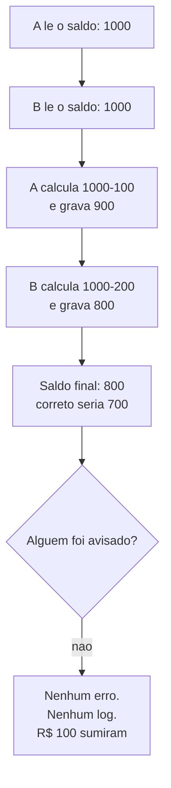

# 03.15 — Transações e ACID

> **Módulo 03 — SQL** · Nível: N2 · Tempo estimado: 2h30 · Código: `codigo/cap15/`

## 1. Objetivo

- **Explicar** as quatro letras de ACID com um exemplo cada, e o que o banco **não** garante.
- **Executar** `BEGIN`, `COMMIT`, `ROLLBACK` e `BEGIN IMMEDIATE` sabendo a diferença.
- **Prever** o que duas conexões simultâneas fazem uma com a outra.
- **Reconhecer** o *lost update* — o erro de concorrência que não produz mensagem nenhuma.

Ao final, você entende por que "o banco é ACID" não significa "meu código está correto", e sabe as duas correções que resolvem quase todos os casos.

---

## 2. Pré-requisitos

- [03.11 — `INSERT`, `UPDATE`, `DELETE`](11-insert-update-delete.md) — você usa `BEGIN`/`ROLLBACK` desde lá; aqui vem a explicação.
- [03.13 — Constraints](13-constraints-e-integridade.md) — o `CHECK` que barra o segundo passo de uma transação.
- [03.12 — DDL](12-ddl-e-tipos-de-dados.md) — a migração de quatro passos que exige transação.

**Autoteste:** (1) O que o `ROLLBACK` desfaz? (2) O que acontece se a energia cair entre o `DROP TABLE` e o `RENAME` do 03.12? (3) Duas pessoas sacando da mesma conta ao mesmo tempo — o que pode dar errado?

---

## 3. Motivação

Esta é a última caixa-preta do módulo, e ela ficou pendurada em quatro capítulos: o 03.11 usou `BEGIN` e `ROLLBACK` sem explicar; o 03.12 exigiu transação na migração de quatro passos; o 03.13 mencionou restrições deferidas; o 03.14 levantou o cenário de duas conexões escrevendo ao mesmo tempo.

A promessa que se ouve sobre bancos relacionais é: **ACID** — atomicidade, consistência, isolamento e durabilidade. Quatro garantias sérias, implementadas por gente que pensou muito no assunto.

Este capítulo tem uma tese incômoda: **as quatro garantias são reais e não impedem que você perca dinheiro.** Veja:

```
[4] LOST UPDATE
    A leu 100000 · B leu 100000
    A sacou 100, B sacou 200 de 1000.
    esperado R$ 700,00 · real R$ 800.00
    >>> o saque de A sumiu, e nada deu erro
```

Cem reais desapareceram. Nenhuma restrição foi violada, nenhuma transação falhou, nenhuma mensagem apareceu. O banco cumpriu ACID integralmente — e o resultado está errado.

Entender por quê é a diferença entre saber a sigla e saber usá-la.

---

## 4. Modelo mental

Uma transação é um **envelope**. Tudo que acontece entre `BEGIN` e `COMMIT` está dentro dele: ou o envelope inteiro é entregue, ou nenhuma folha dele.

As quatro letras, cada uma respondendo a uma pergunta diferente:

| Letra | Garante | A pergunta | O exemplo |
|---|---|---|---|
| **A**tomicidade | tudo ou nada | e se falhar no meio? | débito sem o crédito correspondente |
| **C**onsistência | as regras valem no fim | e as restrições? | saldo negativo barrado pelo `CHECK` |
| **I**solamento | uma não vê a metade da outra | e quem lê durante? | B não enxerga o saque não confirmado de A |
| **D**urabilidade | confirmado é permanente | e se cair a energia? | o `COMMIT` sobrevive ao desligamento |

**A armadilha está no "I".** Isolamento garante que B não veja um estado **intermediário** de A. Não garante que B saiba que A existe. Se os dois leem o mesmo valor antes de qualquer um escrever, os dois leram um valor válido, confirmado, consistente — e obsoleto no instante seguinte.

---

## 5. Analogia

Uma transação é a **reforma de um cômodo com a porta fechada**.

**Atomicidade:** se a reforma parar no meio, você não entrega meio cômodo — desmonta e devolve como estava.

**Consistência:** ao abrir a porta, o cômodo obedece ao código de obras. Durante, pode haver andaime.

**Isolamento:** ninguém de fora vê o andaime. Quem passa vê a porta fechada ou o cômodo pronto.

**Durabilidade:** depois de entregue, uma queda de luz não desfaz a reforma.

E o *lost update*, na mesma analogia: **dois pedreiros medem a parede pela manhã, cada um vai para sua oficina e volta à tarde com uma peça cortada para a medida da manhã.** Os dois mediram certo. Os dois trabalharam com informação válida. A porta esteve fechada o tempo todo. E a segunda peça instalada sobrescreve a primeira, porque foi cortada para uma parede que já não existia. Nenhuma das quatro garantias foi violada — elas não falam sobre isso.

---

## 6. Teoria

### 6.1 O laboratório

```bash
python codigo/cap15/transacoes.py
```

Uma tabela `contas` com Ana (R$ 1.000,00) e Bruno (R$ 500,00), saldo em centavos com `CHECK (saldo_centavos >= 0)`. O script abre **duas conexões**, `a` e `b` — é a única forma de demonstrar concorrência, e o motivo de este capítulo usar Python em vez de um arquivo `.sql`.

### 6.2 Atomicidade — e o que ela não faz sozinha

```
[1] passo 1 aplicado: Ana com 70000
    passo 2 FALHOU: CHECK constraint failed: saldo_centavos >= 0
    transacao ainda aberta? True
    >>> um COMMIT aqui gravaria METADE da operacao
    apos ROLLBACK: Ana com 100000
```

Leia a terceira linha com atenção, porque ela contraria a intuição de quase todo mundo: **o erro não desfez a transação.** Ela continua aberta, com o débito de R$ 300,00 aplicado e o crédito ausente.

Se o programa capturasse a exceção, registrasse no log e seguisse até um `COMMIT` — o que muito código faz —, **metade da operação seria gravada**. A atomicidade estaria intacta do ponto de vista do banco: ele gravou exatamente o que a transação continha no momento do `COMMIT`. O problema é que a transação continha metade da operação.

**A regra que sai daí:** atomicidade é uma garantia **condicional**. O banco promete "tudo ou nada do que estiver no envelope"; decidir se o envelope deve ser entregue continua sendo seu. Em código real, isso é o `try/except` com `ROLLBACK` explícito no `except` (01.21) — ou o gerenciador de contexto, no módulo 06.

### 6.3 Consistência

É a letra menos interessante, porque é a que você já conhece: as restrições do 03.13 valem no fim da transação. O `CHECK` que barrou o passo 2 acima é consistência agindo.

A nuance que aparece em outros bancos: restrições **deferidas** (`DEFERRABLE INITIALLY DEFERRED`, no PostgreSQL) são verificadas só no `COMMIT`, permitindo estados temporariamente inválidos dentro da transação. Serve para inserir duas linhas que se referenciam mutuamente. O SQLite verifica a cada comando; é a caixa-preta 1 do 03.13, agora aberta.

### 6.4 Isolamento

```
[2] A ve: 1
    B ve: 100000   <- o valor antigo
    apos ROLLBACK, B ve: 100000
```

A escreveu; B, numa conexão separada, continua vendo o valor antigo. Se A confirmasse, B passaria a ver o novo; como A desfez, B nunca soube que algo aconteceu.

**Isso é isolamento funcionando**, e é o que impede o pior cenário: B ler um estado que nunca existiu oficialmente — a *leitura suja* (*dirty read*).

Os quatro níveis de isolamento definidos pelo padrão SQL, do mais frouxo ao mais rígido, e o que cada um permite:

| Nível | Permite |
|---|---|
| `READ UNCOMMITTED` | leitura suja: enxergar o que não foi confirmado |
| `READ COMMITTED` | leitura não-repetível: a mesma consulta dá resultados diferentes na mesma transação |
| `REPEATABLE READ` | leitura fantasma: linhas **novas** aparecem entre duas consultas iguais |
| `SERIALIZABLE` | nada — é como se as transações rodassem uma após a outra |

**O SQLite implementa `SERIALIZABLE`**, o mais rígido — e é justamente por isso que a cena [4] é tão instrutiva: **mesmo no nível máximo de isolamento, o dinheiro sumiu.** Não foi falta de rigor do banco.

### 6.5 Durabilidade e o modo de journal

Confirmado é permanente, mesmo com queda de energia. O mecanismo é o diário mencionado no 03.11:

```sql
PRAGMA journal_mode;        -- 'delete' (padrão)
PRAGMA journal_mode = WAL;  -- 'wal'
```

No modo padrão, o SQLite copia as páginas originais para um arquivo de rollback antes de alterá-las. No modo **WAL** (*write-ahead log*), as alterações são acrescentadas a um arquivo de log e aplicadas depois. A vantagem prática do WAL: **leitores não bloqueiam o escritor**, e vice-versa — o que muda bastante o comportamento de uma aplicação com muitas leituras.

Vale saber que a durabilidade tem um preço regulável: `PRAGMA synchronous` controla o quanto o banco espera pelo disco a cada `COMMIT`. Afrouxá-lo torna a escrita muito mais rápida e abre uma janela em que um desligamento abrupto perde as últimas transações. **É a única das quatro letras que você pode negociar por configuração** — e é bom saber que a negociação existe antes de encontrá-la ligada num servidor alheio.

### 6.6 Dois escritores

```
[3] B tentou escrever -> database is locked
    depois que A confirmou, B passou. Saldo: 80000
```

Enquanto A tem uma transação de escrita aberta, B não escreve. O SQLite permite **um escritor por vez** no banco inteiro — não por linha, não por tabela: o banco todo. É a limitação mais importante dele para uso em servidor, e a razão pela qual PostgreSQL e MySQL existem para esse cenário: eles bloqueiam por linha.

O `database is locked` apareceu rápido porque as conexões do script usam `timeout=1.0`. Com o padrão (5 segundos), B esperaria antes de desistir. **Um `timeout` bem escolhido transforma um erro numa espera** — e é a primeira coisa a ajustar quando esse erro aparece em produção com SQLite.

⚠️ **Caixa-preta 1:** bancos que bloqueiam por linha resolvem isso permitindo escritores simultâneos em linhas diferentes — e criam um problema novo: duas transações podem ficar esperando uma pela outra, cada uma segurando o que a outra quer. É o *deadlock*, e o que os bancos fazem a respeito (escolher uma vítima e abortá-la) é assunto do módulo 10.

### 6.7 O *lost update*

```
[4] A leu 100000 · B leu 100000
    A sacou 100, B sacou 200 de 1000.
    esperado R$ 700,00 · real R$ 800.00
    >>> o saque de A sumiu, e nada deu erro
```

A sequência, passo a passo:

1. A lê o saldo: 100 000.
2. B lê o saldo: 100 000. **Leitura válida** — nada foi alterado ainda.
3. A calcula 100 000 − 10 000 e grava 90 000.
4. B calcula 100 000 − 20 000 e grava 80 000, sobrescrevendo o de A.

Resultado: 80 000, quando deveria ser 70 000. O saque de A evaporou.

**Nenhuma das quatro letras foi violada.** Cada transação foi atômica, consistente, isolada e durável. O problema não está em nenhuma delas: está no **padrão ler-modificar-escrever**, em que a decisão do que gravar é tomada a partir de um valor que pode envelhecer entre a leitura e a escrita.

E o mais perigoso: **é o único erro deste módulo inteiro que não produz mensagem nenhuma.** Comparado com ele, `database is locked` e `CHECK constraint failed` são presentes — falham alto, e você sabe.

### 6.8 As duas correções

**(a) Deixar o banco fazer a conta.**

```sql
UPDATE contas SET saldo_centavos = saldo_centavos - 10000 WHERE id = 1;
```

```
esperado R$ 700,00 · real R$ 700,00
```

Em vez de ler, calcular fora e gravar o resultado, o comando descreve a **operação**. Cada `UPDATE` lê e escreve atomicamente, e o segundo enxerga o efeito do primeiro. **Sempre que for possível expressar a mudança como operação sobre o valor atual, é essa a forma correta** — e ela dispensa transação explícita.

**(b) `BEGIN IMMEDIATE` quando a leitura decide a escrita.**

Nem sempre dá para escrever a conta em SQL: "só saca se o saldo for suficiente" precisa ler antes de decidir. Aí a leitura tem que estar protegida:

```
B tentou abrir -> database is locked (espera a vez)
B leu 90000 (com o saque de A) · real R$ 700,00
```

`BEGIN` comum abre em modo de leitura e só reserva a escrita no primeiro `UPDATE` — tarde demais. `BEGIN IMMEDIATE` **reserva a escrita imediatamente**, antes de ler. B espera, e quando entra, lê o valor já atualizado.

Existe uma terceira via, o **bloqueio otimista**: gravar com `WHERE saldo_centavos = <valor lido>` e verificar se afetou 1 linha. Se afetou 0, alguém mudou no meio — releia e tente de novo. É a estratégia usada quando esperar é caro demais, e ela reaproveita a conferência de linhas afetadas do 03.11 para um fim novo.

⚠️ **Caixa-preta 2:** em aplicação real, ninguém escreve `BEGIN` e `COMMIT` à mão espalhados pelo código — o esquecimento de um `ROLLBACK` num caminho de erro é questão de tempo. Frameworks resolvem com gerenciadores de contexto e decoradores de transação, que garantem o encerramento mesmo com exceção. É o módulo 06.

---

## 7. Funcionamento interno

No modo padrão, antes de alterar uma página, o SQLite copia a versão original para um arquivo `.db-journal`. O `ROLLBACK` restaura essas páginas; o `COMMIT` apaga o arquivo. Uma queda de energia deixa o journal no disco, e a próxima abertura o encontra e desfaz a transação incompleta — **é assim que a durabilidade é implementada: pela existência de um arquivo.**

No modo WAL, a lógica se inverte: as alterações vão para um arquivo `.db-wal` e o banco principal fica intacto até um *checkpoint*. Leitores consultam o banco principal mais a parte do WAL já confirmada — daí eles não bloquearem o escritor.

O `SERIALIZABLE` do SQLite é obtido pela via mais direta possível: **um escritor por vez.** Não há mágica de versionamento como nos bancos maiores; há um bloqueio. Simples, correto, e a razão da limitação da §6.6.

---

## 8. Visualização do fluxo



**Como ler:** as quatro primeiras caixas são operações legítimas — cada uma leu um valor válido e gravou um valor válido. O defeito não está em nenhuma delas isoladamente; está na **ordem**, e em B ter decidido o que gravar antes de A gravar. A caixa `F` é o que torna este o erro mais caro do módulo: ele não avisa.

---

## 9. Aplicação prática

**A dor da Aurora.** Na Black Friday, o estoque de um produto com 3 unidades registrou 5 vendas. Ninguém percebeu no dia; a divergência apareceu na conferência de inventário, uma semana depois.

O código do checkout fazia:

```python
estoque = ler_estoque(produto_id)          # 1. lê
if estoque > 0:                            # 2. decide
    gravar_estoque(produto_id, estoque - 1)  # 3. escreve
    registrar_venda(...)
```

Cinco pessoas clicaram em "comprar" no mesmo segundo. Todas leram `3`. Todas decidiram que havia estoque. Todas gravaram `2`.

**O diagnóstico.** É o *lost update* da §6.7, com a agravante de que o passo 2 toma uma **decisão de negócio** a partir de um valor que envelhece antes de ser usado. A restrição não ajudaria — `CHECK (estoque >= 0)` só barraria a partir da sexta venda, porque cada uma grava `2`, nunca um negativo.

**As correções, em ordem de preferência:**

```sql
-- (a) a operação como comando, com a condição embutida
UPDATE produtos
SET estoque = estoque - 1
WHERE id = ? AND estoque > 0;
```

E então **conferir as linhas afetadas** (03.11): se for 1, a venda vale; se for 0, o estoque acabou entre a tela e o clique, e o cliente recebe uma mensagem honesta. A decisão de negócio passou para dentro do comando atômico.

```sql
-- (b) quando a decisão for complexa demais para caber no WHERE
BEGIN IMMEDIATE;
SELECT estoque FROM produtos WHERE id = ?;
-- ... regras de negócio ...
UPDATE produtos SET estoque = ? WHERE id = ?;
COMMIT;
```

**A entrega, e a lição.** O bug não estava no banco, no SQL nem na ausência de transação — havia transação. Estava em **ler para decidir e escrever depois**, um padrão que parece correto em qualquer revisão de código feita por uma pessoa imaginando um usuário por vez. **Concorrência é o assunto em que a intuição sequencial falha em silêncio**, e é por isso que ele se estuda com dois clientes na tela, não com um raciocínio.

---

## 10. Código comentado

`codigo/cap15/transacoes.py` executa as cinco cenas. Três decisões de escrita valem comentário.

**Duas conexões, não duas threads.** Seria possível demonstrar com threads, e o código ficaria mais realista e muito mais difícil de ler — além de intermitente, porque o resultado dependeria do escalonador. Com duas conexões e ordem explícita, a cena [4] dá o mesmo resultado **toda vez**. Um exemplo de concorrência que só falha às vezes ensina menos que um que falha sempre.

**`timeout=1.0` na conexão.** O padrão do driver é 5 segundos, e o script levaria 5 segundos parado na cena [3] antes de mostrar o erro. Um segundo mostra o comportamento sem a espera — e o comentário no código registra que **esse mesmo parâmetro é o que se ajusta em produção** para transformar o erro numa espera.

**`repor()` antes de cada cena.** Cada demonstração parte de R$ 1.000,00. Sem isso, a cena [4] herdaria o saldo da [3] e o número final não bateria com o do capítulo — o mesmo cuidado do rascunho do 03.11, agora dentro de um único script.

---

## 11. Erros comuns

**1. Achar que um erro desfaz a transação.** Ela continua aberta; um `COMMIT` grava a metade.
→ `ROLLBACK` explícito no tratamento de erro.

**2. Ler, calcular fora e gravar o resultado.** É o *lost update*.
→ `SET x = x - valor`, ou `BEGIN IMMEDIATE`.

**3. Confiar que "o banco é ACID" resolve concorrência.** O SQLite é `SERIALIZABLE` e o dinheiro sumiu.
→ ACID descreve transações; o padrão de acesso é seu.

**4. Usar `BEGIN` quando a leitura decide a escrita.** Ele não reserva a escrita.
→ `BEGIN IMMEDIATE`.

**5. Transação longa demais.** Ela segura o bloqueio de escrita o tempo todo.
→ Abrir tarde, fechar cedo; nada de chamada de rede dentro.

**6. Tratar `database is locked` como bug.** Costuma ser `timeout` curto ou transação longa.
→ Ajustar o `timeout`, encurtar a transação, considerar WAL.

**7. Esquecer o `COMMIT`.** A transação fica aberta e bloqueia todo mundo até a conexão morrer.
→ Gerenciador de contexto (módulo 06).

**8. Afrouxar `synchronous` sem saber o que se trocou.** Ganha-se escrita e perde-se durabilidade.
→ Decisão consciente, documentada.

---

## 12. Boas práticas

- **Transação curta.** Abra o mais tarde possível, feche o quanto antes.
- **Nada de espera externa dentro** de uma transação: chamada de API, leitura de arquivo grande, entrada do usuário.
- **Prefira a operação ao valor**: `SET saldo = saldo - 100`, não `SET saldo = 900`.
- **`BEGIN IMMEDIATE` sempre que a leitura decidir a escrita.**
- **Confira as linhas afetadas** — é o que transforma o bloqueio otimista em detecção real (03.11).
- **`ROLLBACK` explícito no caminho de erro.** Nunca conte com o banco desfazer sozinho.
- **Trate `database is locked` como caso esperado**, com nova tentativa, e não como falha fatal.
- **Documente o nível de isolamento** com que sua aplicação conta.

---

## 13. Performance

Transações têm dois custos opostos, e escolher mal em qualquer direção sai caro.

**Transação curta demais.** Cada `COMMIT` espera o disco. Inserir 500 mil linhas uma a uma, em autocommit, leva minutos; dentro de uma transação só, leva **4,3 segundos** — foi assim que o laboratório do 03.14 foi construído. Em carga de dados, agrupar é a otimização de maior efeito.

**Transação longa demais.** No SQLite, ela segura o único bloqueio de escrita e todo o resto espera. Em bancos maiores, ela acumula versões antigas de linhas que não podem ser descartadas. Os dois casos degradam o sistema inteiro, não só quem a executou.

O equilíbrio usual é o **lote**: transações de alguns milhares de linhas. E o custo dessa escolha, dito no 03.11, continua valendo — em lotes, a operação deixa de ser atômica como um todo, e falhar no lote 7 de 100 deixa os seis primeiros confirmados. Aqui está a razão completa de por que essa troca existe.

---

## 14. Mercado

"Explique ACID" é uma das perguntas mais frequentes em entrevista de dados e backend, e quase todo mundo recita as quatro palavras. O que distingue é saber o que **não** está incluído: ACID descreve o comportamento de transações; ele não escolhe o padrão de acesso da sua aplicação, e o *lost update* é a prova.

É também o vocabulário da discussão sobre bancos NoSQL. Muitos oferecem garantias mais fracas — consistência eventual, atomicidade só por documento — em troca de distribuição e escala. O teorema CAP, que você vai encontrar citado, formaliza parte dessa troca. Nada disso torna esses bancos errados: torna a garantia responsabilidade de quem escreve a aplicação. **Saber o que se está abrindo mão é a diferença entre escolher e herdar.**

E vale conhecer o limite do SQLite com honestidade, porque ele será perguntado: um escritor por vez no banco inteiro. Para um aplicativo local, um site de leitura intensa ou um laboratório como este, é excelente — é o banco mais instalado do mundo por bons motivos. Para um sistema com muitas escritas simultâneas, é o momento de PostgreSQL.

---

## 15. Entrevistas

- **"Explique ACID."** As quatro letras com um exemplo cada. O que impressiona: terminar dizendo o que ACID **não** garante, e citar o *lost update*.
- **"O que é *lost update* e como evitar?"** Dois leem, dois escrevem, um sobrescreve o outro sem erro. Correções: operação em vez de valor; `BEGIN IMMEDIATE`; bloqueio otimista com verificação de linhas afetadas.
- **"Quais são os níveis de isolamento?"** Os quatro, do mais frouxo ao mais rígido, com o fenômeno que cada um ainda permite. E o detalhe: o SQLite é `SERIALIZABLE`, e mesmo assim o *lost update* acontece — porque ele nasce do padrão da aplicação, não do nível.
- **"Está aparecendo `database is locked`. O que investigar?"** Transação longa aberta; `timeout` curto demais; `COMMIT` esquecido em algum caminho de erro; modo de journal. Nessa ordem.
- **"Por que não usar SQLite em produção?"** Cuidado com a premissa: depende. Um escritor por vez é o limite real; leitura intensa e uso embarcado são casos em que ele é a escolha certa.

---

## 16. Exercícios guiados

Em [`exercicios/cap15.md`](exercicios/cap15.md):

- **A1** `[~10 min · qual letra?]` — 8 situações: qual garantia de ACID está em jogo?
- **A2** `[~10 min · preveja]` — 6 sequências de duas conexões: qual resultado final?
- **A3** `[~10 min · achou o lost update?]` — 6 trechos: quais têm o padrão perigoso?
- **A4** `[~10 min · `BEGIN` ou `IMMEDIATE`?]` — 6 operações: qual precisa de qual?
- **AP1** `[~25 min · reproduza e corrija]` — Provoque o *lost update* e conserte das três formas.
- **AP2** `[~20 min · o estoque da Black Friday]` — Implemente o checkout que não vende demais.
- **AP3** `[~20 min · a transação longa]` — Meça o custo de agrupar e de exagerar no agrupamento.
- **D1** `[~50 min · a transferência bancária]` — **O código que você defenderia numa auditoria.**

---

## 17. Desafios

**D1 — A transferência bancária.** Implemente `transferir(origem, destino, centavos)` que seja correta sob concorrência. Requisitos: atômica; recusa saldo insuficiente com mensagem clara; funciona com duas chamadas simultâneas na mesma conta; `ROLLBACK` explícito em todo caminho de erro; e não segura o bloqueio mais que o necessário.

Entregue junto um **teste que prova**: duas transferências simultâneas de contas com saldo justo, verificando que a soma dos saldos permanece constante e que nenhuma conta ficou negativa. E um parágrafo sobre por que testar concorrência exige provocá-la de propósito.

---

## 18. Mini projeto

**O importador transacional.** Escreva `importar.py` que carrega um CSV de pedidos para a Aurora, respeitando: cada pedido e seus itens numa transação (pedido sem itens não entra); lotes de 500 pedidos, com relatório de quais lotes falharam; `ROLLBACK` do lote inteiro em caso de erro, sem interromper os demais; e um resumo final com importados, rejeitados e o motivo de cada rejeição.

Requisitos: rodar duas vezes não duplica dados (idempotência); medir o tempo total com lotes de 1, 100 e 5 000, comparando; e um parágrafo justificando o tamanho de lote escolhido — inclusive o que se perdeu de atomicidade ao escolhê-lo.

---

## 19. Revisão

**Resumo em 5 frases.** Uma transação é um envelope: tudo entre `BEGIN` e `COMMIT` vale junto ou não vale. ACID descreve quatro garantias — atomicidade, consistência, isolamento, durabilidade —, e todas as quatro podem estar intactas enquanto o resultado está errado. O *lost update* é a prova: dois leem o mesmo valor, dois escrevem, um sobrescreve o outro, e R$ 100,00 somem **sem mensagem nenhuma** — mesmo no SQLite, que implementa o nível mais rígido de isolamento. As correções são duas: expressar a mudança como operação (`SET x = x - 100`) ou reservar a escrita antes de ler (`BEGIN IMMEDIATE`). E um erro não desfaz a transação sozinho — ela fica aberta, e um `COMMIT` distraído grava a metade da operação.

**Flashcards** (também em [`revisao/flashcards.md`](revisao/flashcards.md)):

| ID | Frente | Verso |
|---|---|---|
| 03.15-F1 | O que significa cada letra de ACID? | **A**tômico: tudo ou nada. **C**onsistente: as restrições valem no fim. **I**solado: ninguém vê o estado intermediário. **D**urável: confirmado sobrevive à queda de energia. |
| 03.15-F2 | Explique com suas palavras o *lost update*. | (Elaboração) Dois leem o mesmo valor, calculam fora do banco e gravam. O segundo sobrescreve o primeiro. **Nenhuma letra de ACID é violada** — cada leitura e cada escrita foi válida; o defeito está no padrão ler-modificar-escrever. |
| 03.15-F3 | Preveja: erro no meio de uma transação. Ela é desfeita? | (Previsão) **Não.** Ela continua **aberta** (`in_transaction: True`) com a alteração parcial aplicada. Um `COMMIT` a seguir grava metade da operação. `ROLLBACK` explícito é obrigação sua. |
| 03.15-F4 | `BEGIN` ou `BEGIN IMMEDIATE`? | (Decisão) `IMMEDIATE` sempre que uma **leitura decidir a escrita** — ele reserva a escrita antes de ler. `BEGIN` comum só reserva no primeiro `UPDATE`, tarde demais para impedir o *lost update*. |
| 03.15-F5 | Qual a limitação de concorrência do SQLite? | **Um escritor por vez no banco inteiro** — não por linha, não por tabela. Daí o `database is locked`. PostgreSQL e MySQL bloqueiam por linha, e ganham o problema do *deadlock* em troca. |

**Revisão espaçada:** D+1 refaça A2 e A3 · D+7 o AP1 (reproduzir e corrigir das três formas) · D+30 explique o *lost update* em voz alta, e por que ACID não o impede.

---

## 20. Checklist

- [ ] Sei enunciar as quatro letras com um exemplo de cada.
- [ ] Vi que um erro **não** desfaz a transação sozinho.
- [ ] Reproduzi o *lost update* e vi R$ 100,00 sumirem sem erro.
- [ ] Sei explicar por que ACID não o impede.
- [ ] Corrigi das duas formas: operação no `SET` e `BEGIN IMMEDIATE`.
- [ ] Conheço o bloqueio otimista e como as linhas afetadas o detectam.
- [ ] Sei os quatro níveis de isolamento e o fenômeno de cada um.
- [ ] Sei que o SQLite permite um escritor por vez, e o que isso implica.
- [ ] Sei o que investigar diante de `database is locked`.
- [ ] Consigo justificar um tamanho de lote, incluindo o que se perde.

---

## 21. Próximo capítulo

[03.16 — Modelagem e mini projeto](16-modelagem-e-mini-projeto.md). O último do módulo, e o que fecha o círculo: você consultou o schema da Aurora por quinze capítulos sem tê-lo projetado. Agora projeta — diagrama ER, normalização, DDL completo com tudo que aprendeu do 03.12 ao 03.15, e carga inicial em Python. E compara com o schema que usou o tempo todo, decisão por decisão.
