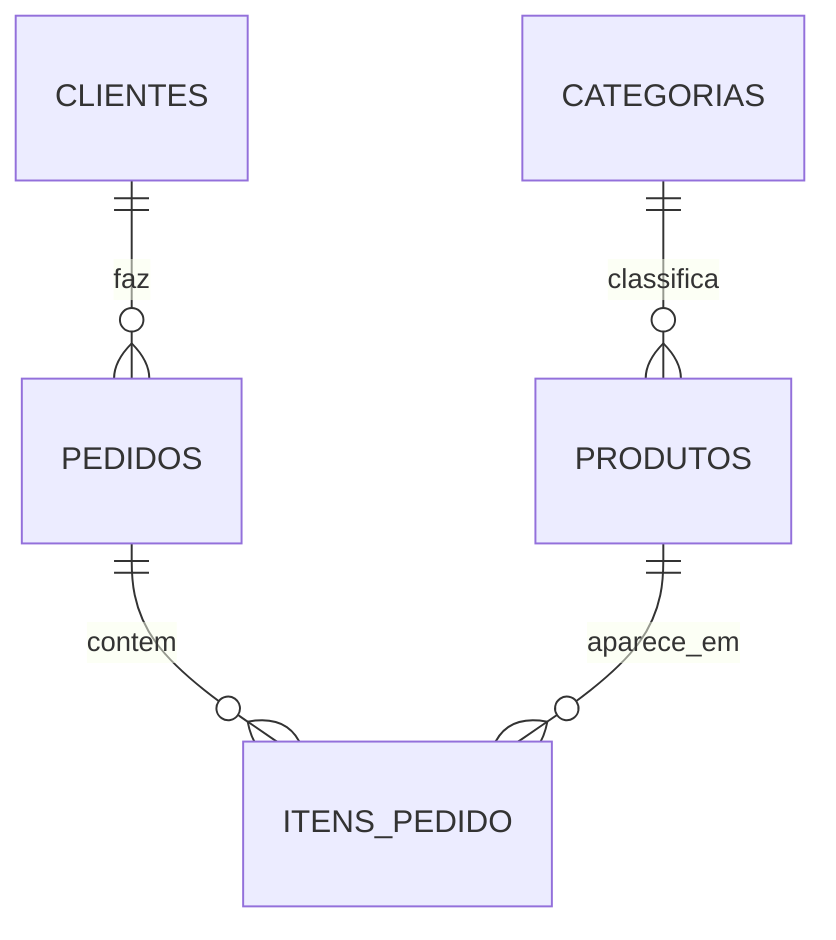
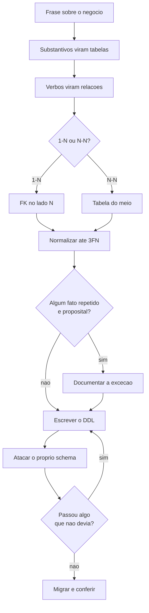

# 03.16 — Modelagem e mini projeto

> **Módulo 03 — SQL** · Nível: N2 · Tempo estimado: 3h · Código: `codigo/cap16/`

## 1. Objetivo

- **Projetar** um schema a partir de um domínio, com diagrama ER e decisões justificadas.
- **Aplicar** normalização até a 3FN — e saber quando parar de propósito.
- **Escrever** o DDL completo da Aurora usando tudo do 03.12 ao 03.15.
- **Migrar** dados de um schema para outro provando que nada se perdeu.

Ao final, você fecha o círculo: consultou o schema da Aurora por quinze capítulos, e agora o projeta — comparando cada decisão sua com a que usou o tempo todo.

---

## 2. Pré-requisitos

Este capítulo usa o módulo inteiro. Em particular:

- [03.02 — Tabelas, linhas e chaves](02-tabelas-linhas-e-chaves.md) — a leitura do schema, agora ao contrário.
- [03.12 a 03.15](12-ddl-e-tipos-de-dados.md) — tipos, restrições, índices e transações, tudo aplicado junto.
- [03.07 — `JOIN`](07-join-parte-1-inner.md) — a multiplicação de linhas que a modelagem previne ou provoca.

**Autoteste:** (1) Por que `itens_pedido` guarda `preco_unitario_centavos` se o preço já está em `produtos`? (2) Que problema surge se `categoria` for texto solto? (3) O que você conferiria depois de migrar dados de um schema para outro?

---

## 3. Motivação

Do 03.01 até aqui, o schema da Aurora foi um dado do problema. Quatro tabelas prontas, criadas por alguém, e você consultando.

Foi de propósito (decisão D-014): consultar um schema existente antes de projetar o próprio significa que agora você tem **quinze capítulos de evidência** sobre o que aquele schema faz bem e mal. Você viu o `NULL` da Beatriz complicar um `COUNT` (03.05), a multiplicação de linhas do `JOIN` (03.07), o `NOT IN` traiçoeiro (03.09), o `CHECK` que faltava (03.13) e o índice que não estava lá (03.14).

Modelagem sem essa experiência é decoração de regras. Com ela, cada decisão do schema responde a um problema que você já sentiu.

E há uma segunda razão para este capítulo existir: **é aqui que se aprende a justificar.** Um schema não se avalia pela sintaxe — ela é a parte que o banco confere. Avalia-se pelas decisões, e uma decisão sem motivo escrito é indistinguível de um acidente.

---

## 4. Modelo mental

Modelar é responder a três perguntas, nesta ordem:

1. **Que coisas existem?** → viram tabelas (entidades)
2. **Que fatos descrevem cada coisa?** → viram colunas (atributos)
3. **Como as coisas se relacionam?** → viram chaves estrangeiras

A terceira pergunta tem três respostas possíveis, e reconhecê-las é metade do trabalho:

| Relação | Exemplo | Como se implementa |
|---|---|---|
| **1 para 1** | pessoa ↔ CPF | costuma ser a mesma tabela |
| **1 para N** | cliente → pedidos | FK no lado **N** (em `pedidos`) |
| **N para N** | pedidos ↔ produtos | **tabela do meio** (`itens_pedido`) |

**A tabela do meio é a que mais se erra.** Um pedido tem vários produtos e um produto está em vários pedidos — não há onde pôr a chave estrangeira. `itens_pedido` existe por isso, e ganha de brinde o lugar certo para guardar `quantidade` e `preco_unitario_centavos`: fatos que não pertencem nem ao pedido nem ao produto, mas **ao encontro dos dois**.

---

## 5. Analogia

Modelar é **planejar a planta de uma casa antes de levantar as paredes**.

Você pode construir sem planta — pessoas fazem, e a casa fica de pé. O problema aparece quando é preciso acrescentar um banheiro e descobre-se que o encanamento não passa por ali. A obra é possível; ela custa dez vezes o que custaria se estivesse na planta.

A planta também não é uma obra de arte: é um documento que **outras pessoas leem para trabalhar**. O eletricista, o encanador e o pedreiro precisam entendê-la sem falar com o arquiteto. Um schema com colunas chamadas `tipo1`, `flag` e `data2` é uma planta que só o autor lê — e o autor vai embora.

---

## 6. Teoria

### 6.1 Do domínio ao diagrama

O ponto de partida é uma frase sobre o negócio: *"A Aurora vende produtos para clientes. Um cliente faz vários pedidos. Cada pedido contém vários produtos, em quantidades diferentes."*

Sublinhe os **substantivos** — candidatos a tabela: cliente, pedido, produto. Sublinhe os **verbos** — candidatos a relação: faz, contém.



**Como ler:** `||` é "exatamente um" e `o{` é "zero ou muitos". Leia cada linha da esquerda para a direita: *um cliente faz zero ou muitos pedidos*. A leitura inversa também importa e é onde a chave estrangeira mora: *um pedido pertence a exatamente um cliente* — por isso `cliente_id` fica em `pedidos`. E `ITENS_PEDIDO` recebe duas setas: é a tabela do meio da relação N-para-N.

### 6.2 Normalização, em três passos

Normalizar é eliminar redundância. As três formas normais que importam na prática:

**1FN — nada de listas dentro de uma célula.** Errado: `produtos: "mouse, teclado"`. Certo: uma linha por produto. O teste: você precisaria de `LIKE '%mouse%'` para procurar? Então violou.

**2FN — toda coluna depende da chave inteira.** Se a chave é `(pedido_id, produto_id)` e existe uma coluna `nome_produto`, ela depende só de `produto_id` — metade da chave. Sai da tabela.

**3FN — nenhuma coluna depende de outra coluna comum.** Se `pedidos` tivesse `cliente_id` e `cidade_do_cliente`, a segunda depende da primeira, não do pedido. Mudar a cidade de um cliente exigiria atualizar todos os pedidos dele — e esquecer um deixa a base contradizendo a si mesma.

**A regra prática que resume as três:** *cada fato mora em um só lugar*. Se um dado aparece em duas tabelas, ou uma delas está errada, ou vai estar.

**E a desnormalização deliberada**, que é a parte que separa quem entendeu de quem decorou. `itens_pedido.preco_unitario_centavos` **repete** o preço que está em `produtos` — viola a 3FN de propósito. O motivo: não é o mesmo fato. `produtos.preco_centavos` é *quanto custa hoje*; `itens_pedido.preco_unitario_centavos` é *quanto custou naquela venda*. Se o preço subir amanhã, o pedido de ontem tem de continuar valendo o que valeu.

**Normalização é sobre eliminar o mesmo fato repetido, não sobre eliminar valores parecidos.**

### 6.3 O schema v2, decisão por decisão

`codigo/cap16/schema.sql` reconstrói a Aurora. As mudanças em relação ao original:

**A tabela `categorias` é nova.** No 03.01, `categoria` era texto solto em `produtos`. Texto solto aceita `'audio'`, `'Audio'` e `'áudio'` como três categorias distintas, e um `GROUP BY categoria` (03.06) devolveria três linhas para a mesma coisa. Com tabela e chave estrangeira, o conjunto é fechado pelo banco. O custo é uma junção a mais em toda consulta de catálogo — e é uma troca consciente.

**`STRICT` em todas as tabelas** (03.12): `'abacaxi'` não entra em coluna `INTEGER`.

**`CHECK` em tudo que tem domínio conhecido** (03.13):

```sql
status  TEXT NOT NULL CHECK (status IN ('pendente','concluido','cancelado')),
ativo   INTEGER NOT NULL DEFAULT 1 CHECK (ativo IN (0,1)),
quantidade INTEGER NOT NULL CHECK (quantidade > 0),
preco_centavos INTEGER NOT NULL CHECK (preco_centavos > 0),
data TEXT NOT NULL CHECK (data LIKE '____-__-__'),
nome TEXT NOT NULL CHECK (LENGTH(TRIM(nome)) > 0)
```

O último merece comentário: `NOT NULL` impede o nulo e **não impede a string vazia**, nem uma composta só de espaços. `LENGTH(TRIM(nome)) > 0` fecha o buraco — é a lição do `''` que não é `NULL`, do gabarito do 03.12.

**`UNIQUE(pedido_id, produto_id)` em `itens_pedido`.** O mesmo produto duas vezes no mesmo pedido é erro de negócio, e é a regra que **não cabe numa coluna só** (03.13/AP1).

**Três ações de `ON DELETE`, escolhidas uma a uma:**

```sql
itens_pedido → pedidos    ON DELETE CASCADE    -- o único CASCADE
itens_pedido → produtos   ON DELETE RESTRICT
pedidos      → clientes   ON DELETE RESTRICT
produtos     → categorias ON DELETE RESTRICT
```

O item não existe sem o pedido: `CASCADE`. Todo o resto é histórico: `RESTRICT`. **Um `CASCADE` em quatro relações** — a proporção não é acidente, é o critério do 03.13 aplicado.

**E `email TEXT UNIQUE` sem `NOT NULL`, de propósito.** O 03.13 insistiu que campo único e obrigatório precisa dos dois. Aqui a decisão é outra: o cadastro de balcão não tem e-mail, e vários `NULL` convivem numa coluna `UNIQUE`. **O que muda não é a regra — é que a decisão está escrita.** Um `UNIQUE` sem `NOT NULL` por esquecimento e um por decisão produzem o mesmo SQL e são coisas diferentes; o comentário no schema é o que os separa.

### 6.4 Os índices, e os que não existem

```sql
CREATE INDEX idx_itens_pedido        ON itens_pedido(pedido_id);
CREATE INDEX idx_pedidos_cliente     ON pedidos(cliente_id, data);
CREATE INDEX idx_produtos_categoria  ON produtos(categoria_id);
```

Os três são colunas de chave estrangeira do lado **filho** — que o SQLite **não** indexa sozinho (03.13 §13). Sem o primeiro, o `ON DELETE CASCADE` varre `itens_pedido` inteira a cada `DELETE` de pedido.

O segundo é composto, `(cliente_id, data)`, na ordem que atende o painel "pedidos de um cliente, do mais recente ao mais antigo": filtra pela primeira e ordena pela segunda (03.14 §6.4).

**E não há índice em `status` nem em `ativo`.** Poucos valores distintos, ganho medido próximo de zero, custo permanente de escrita — é a lição do 03.14, e a ausência é tão deliberada quanto as presenças.

### 6.5 A migração, e a prova dos nove

`criar_aurora_v2.py` carrega os dados do `aurora.db` original para o schema novo. Três decisões:

**O schema mora num `.sql` separado.** No 03.01 ele estava embutido no Python. Aqui, quem quiser ler a estrutura lê um arquivo de estrutura, e alterá-la não exige tocar no código de carga.

**A carga é transacional** (03.15): `BEGIN`, tudo, `COMMIT` — e no `except`, `ROLLBACK` mais a remoção do arquivo. **Um banco pela metade não serve para nada**, e é pior que nenhum, porque parece pronto.

**A conferência é obrigatória:**

```
Faturamento (centavos) — v2: 831840 · original: 831840
  clientes       v2:   8 · original:   8  ok
  produtos       v2:  12 · original:  12  ok
  pedidos        v2:  20 · original:  20  ok
  itens_pedido   v2:  31 · original:  31  ok
```

**Schema diferente, mesmos números.** Comparar contagens pega linhas perdidas; comparar o **faturamento** pega algo mais sutil — valores trocados de coluna, chave estrangeira remapeada errado, item ligado ao pedido errado. Uma migração que só confere contagens passa com os dados embaralhados.

E a conferência é feita em **centavos**, nunca em reais, pela razão do 03.05 e do 03.12: em ponto flutuante, duas somas corretas podem diferir.

⚠️ **Caixa-preta 1:** aqui a migração foi um script que roda uma vez. Em produção, mudanças de schema são **migrações versionadas** — arquivos numerados, cada um com o comando que aplica e o que reverte, executados em ordem por uma ferramenta que registra o que já rodou. Alembic, no módulo 06.

### 6.6 Provar que o schema recusa

Um schema que você não tentou quebrar é um schema que você não testou (03.13/D1). Os catorze ataques ao v2, e o que cada um encontrou:

```
 1  e-mail duplicado          -> UNIQUE constraint failed: clientes.email
 2  nome só com espaços       -> CHECK failed: LENGTH(TRIM(nome)) > 0
 3  data em DD/MM/AAAA        -> CHECK failed: data_cadastro LIKE '____-__-__'
 4  e-mail em MAIÚSCULAS      -> UNIQUE constraint failed: clientes.email
 5  preço zero                -> CHECK failed: preco_centavos > 0
 6  categoria inexistente     -> FOREIGN KEY constraint failed
 7  ativo = 7                 -> CHECK failed: ativo IN (0, 1)
 8  status 'rascunho'         -> CHECK failed: status IN (...)
 9  status NULL               -> NOT NULL constraint failed: pedidos.status
10  quantidade zero           -> CHECK failed: quantidade > 0
11  produto repetido no pedido-> UNIQUE failed: itens_pedido.pedido_id, produto_id
12  apagar cliente com pedido -> FOREIGN KEY constraint failed
13  apagar categoria com prod.-> FOREIGN KEY constraint failed
14  categoria 'AUDIO'         -> UNIQUE constraint failed: categorias.nome
```

**Catorze de catorze recusados.** O ataque 4 é o que só existe por causa do `COLLATE NOCASE`, e o 14 pela mesma razão — sem ele, `'AUDIO'` e `'audio'` seriam duas categorias. O ataque 9 mostra por que `CHECK` de conjunto fechado precisa de `NOT NULL` junto (03.13 §6.4).

E o único `CASCADE`, verificado: apagar o pedido 20 levou seu item junto, de 1 para 0.

⚠️ **Caixa-preta 2:** este schema serve a um sistema que **registra vendas**. Um sistema que **analisa** vendas prefere o oposto — tabelas largas, dados repetidos de propósito, junções evitadas. As duas formas têm nome (OLTP e OLAP), e a tradução de uma para a outra é o trabalho de engenharia de dados: módulo 10.

---

## 7. Funcionamento interno

O SQLite guarda o texto de cada `CREATE TABLE` em `sqlite_master` (03.12 §7). Isso torna o schema **autodocumentado**: `SELECT sql FROM sqlite_master` devolve o que foi declarado, comentários incluídos quando o comando os contém.

É por isso que comentar decisões **dentro** do DDL, e não num documento à parte, tem uma vantagem prática: o comentário viaja com o banco. Documentação separada envelhece; a que o banco guarda, não.

---

## 8. Visualização do fluxo



**Como ler:** o fluxo desce da frase ao DDL, mas os dois losangos do fim são o que fazem dele um método. `H` é onde a desnormalização deliberada se separa do erro — a diferença entre as duas é a caixa `I`, escrever o motivo. E o ciclo `L → J` é o teste: enquanto um ataque passar, o schema volta para a prancheta.

---

## 9. Aplicação prática

**A entrega Atlas do módulo.** O módulo 01 entregou o Relatório de Vendas Aurora v0, em Python, lendo CSV. Este módulo entrega o mesmo negócio em banco relacional: schema projetado, restrições que impedem dado inválido de entrar, índices escolhidos por medição, e uma migração que prova ter preservado tudo.

A comparação entre as duas entregas é o aprendizado do módulo inteiro:

| | Relatório v0 (módulo 01) | Aurora v2 (módulo 03) |
|---|---|---|
| Dados inválidos | entram; o script tenta tratar | **recusados na entrada** |
| Duplicatas | detectadas com esforço, se lembrarem | impossíveis, por `UNIQUE` |
| Consulta nova | novo script Python | uma consulta |
| Concorrência | não existe | transações |
| Buscar um cliente | ler o arquivo inteiro | índice, ~0,05 ms |
| Regra de negócio | espalhada pelo código | no schema, junto do dado |

**A linha que mais importa é a última.** No CSV, "nota vai de 1 a 5" existe se alguém escreveu um `if`; se houver dois caminhos de escrita, ela existe em um e não no outro. No banco, ela existe **uma vez**, e vale para todos os caminhos — inclusive os que ainda não foram escritos.

---

## 10. Código comentado

`schema.sql` tem 110 linhas, das quais boa parte são comentários — e isso é a mensagem. Cada `CHECK`, cada `ON DELETE` e cada índice carrega o motivo e a referência do capítulo. É um schema que se lê como documento.

`criar_aurora_v2.py` faz três coisas que valem o hábito: executa o schema de um arquivo externo; carrega dentro de uma transação e **apaga o banco** se a carga falhar; e confere o resultado contra a origem antes de declarar sucesso, devolvendo código de saída 1 se divergir — o padrão do 02.07, agora numa migração.

A função `conferir()` é a parte que se leva para o trabalho: comparar contagens **e** um agregado financeiro. Contagem sozinha não detecta dados embaralhados.

---

## 11. Erros comuns

**1. Modelar antes de entender o domínio.** Tabela é resposta; o domínio é a pergunta.
→ Escreva a frase sobre o negócio primeiro.

**2. Guardar lista dentro de uma célula.** `"mouse, teclado"` viola a 1FN.
→ Uma linha por item; se você precisa de `LIKE '%x%'`, modelou errado.

**3. Repetir dado do pai no filho.** `cidade_do_cliente` em `pedidos` desatualiza.
→ 3FN; junte quando precisar.

**4. Confundir desnormalização deliberada com erro.** `preco_unitario` **deve** repetir.
→ Pergunte se é o mesmo fato ou dois fatos parecidos.

**5. Texto solto onde cabe uma tabela.** `'audio'`, `'Audio'`, `'áudio'`.
→ Tabela de domínio com FK, ou ao menos `CHECK` + `COLLATE NOCASE`.

**6. `NOT NULL` achando que impede vazio.** `''` não é `NULL`.
→ `CHECK (LENGTH(TRIM(coluna)) > 0)`.

**7. Migrar conferindo só contagens.** Passa com os dados embaralhados.
→ Compare também um agregado — em centavos.

**8. Deixar o banco pela metade quando a carga falha.** Parece pronto e não está.
→ Transação, e apagar o arquivo no erro.

**9. Schema sem justificativa escrita.** Decisão sem motivo é indistinguível de acidente.
→ Comente dentro do DDL; o comentário viaja com o banco.

---

## 12. Boas práticas

- **Diagrama antes do DDL.** Errar no desenho custa um traço.
- **Nomes consistentes:** tabelas no plural, colunas no singular, `<tabela>_id` para as FKs.
- **Sufixo que revela a unidade:** `preco_centavos`, `duracao_segundos`.
- **Normalize até a 3FN; desnormalize com motivo escrito.**
- **`STRICT` e `NOT NULL` como padrão**; a exceção precisa de justificativa.
- **`CHECK` para todo domínio conhecido.**
- **Escolha cada `ON DELETE` conscientemente** — na dúvida, `RESTRICT`.
- **Indexe as FKs do lado filho.**
- **Ataque o próprio schema** antes de considerá-lo pronto.
- **Toda migração termina em conferência**, não em "rodou sem erro".

---

## 13. Performance

Modelagem decide o teto de desempenho antes de qualquer índice existir.

**Normalizar demais** multiplica junções: um relatório que atravessa seis tabelas paga por isso em toda execução, e nenhum índice desfaz a estrutura.

**Normalizar de menos** cria tabelas largas com dados repetidos: mais bytes por linha, menos linhas por página, atualização em vários lugares.

O equilíbrio da Aurora v2 — quatro tabelas mais uma de domínio — atende bem um sistema transacional. **A tabela `categorias` custa uma junção a mais em toda consulta de catálogo**, e é uma troca consciente: paga-se junção para ganhar integridade. Um sistema de análise faria a troca inversa.

---

## 14. Mercado

Modelagem é a habilidade mais duradoura deste módulo. Sintaxe SQL varia pouco entre bancos e se consulta; um schema mal projetado acompanha a empresa por anos e cobra juros em cada funcionalidade nova.

É também o que mais aparece em entrevista sênior, no formato "modele um sistema de X em 30 minutos" — e o que se avalia não é a resposta certa, é o processo: as perguntas que você faz antes de desenhar, as relações que identifica, as decisões que justifica e as que reconhece como discutíveis.

Vale conhecer o limite deste capítulo. O schema aqui serve a um sistema que **registra** vendas — OLTP: muitas escritas pequenas, integridade acima de tudo. Sistemas que **analisam** vendas invertem quase todas as decisões: tabelas largas, dados repetidos, junções evitadas, integridade relaxada porque os dados chegam já validados. Nenhuma das duas está errada; elas resolvem problemas diferentes, e confundi-las é a causa mais comum de um data warehouse lento ou de um sistema transacional inconsistente.

---

## 15. Entrevistas

- **"Modele um sistema de reservas de hotel."** Perguntas primeiro: um quarto tem tipo? Reserva é de quarto ou de tipo? Cancelamento apaga ou marca? Depois entidades, relações, e as decisões justificadas.
- **"O que é normalização e até onde normalizar?"** 1FN, 2FN, 3FN com um exemplo cada, e a resposta madura: até a 3FN por padrão, desnormalizando com motivo escrito. Cite `preco_unitario`.
- **"Quando desnormalizar?"** Quando o dado repetido é **outro fato** (preço histórico), ou quando a medição mostra que a junção é o gargalo — nessa ordem, e a segunda exige número.
- **"Como você migra um schema em produção sem perder dados?"** Migração versionada, transacional, com conferência de contagens **e** de agregados, plano de reversão, e a nova estrutura convivendo com a antiga durante a transição.
- **"Qual a diferença entre OLTP e OLAP?"** Registrar contra analisar; normalizado contra largo; integridade contra velocidade de leitura. Saber que a tradução entre os dois **é** a engenharia de dados.

---

## 16. Exercícios guiados

Em [`exercicios/cap16.md`](exercicios/cap16.md):

- **A1** `[~10 min · 1-N ou N-N?]` — 8 relações: qual tipo, e onde vai a chave?
- **A2** `[~10 min · que forma normal violou?]` — 6 tabelas com defeito.
- **A3** `[~10 min · erro ou decisão?]` — 6 repetições de dado: quais são deliberadas?
- **A4** `[~10 min · substantivos]` — 4 frases de negócio: extraia entidades e relações.
- **AP1** `[~30 min · o schema da locadora]` — Do domínio ao DDL, com justificativas.
- **AP2** `[~25 min · consertando]` — Normalize um schema ruim e migre os dados.
- **AP3** `[~20 min · a conferência]` — Prove que uma migração preservou tudo.
- **D1** `[~60 min · o projeto do módulo]` — **O schema da Aurora, seu, comparado ao meu.**

---

## 17. Desafios

**D1 — O projeto do módulo.** Projete e implemente, do zero, o schema da Aurora ampliado com **três** requisitos novos: um produto pode ter várias fotos; um cliente pode ter vários endereços, e cada pedido é entregue em um deles; e cada pedido tem um histórico de mudanças de status, com data e responsável.

Entregue: o diagrama ER; o DDL completo com `STRICT`, restrições, ações de `ON DELETE` e índices; um `decisoes.md` com uma linha por coluna não-óbvia; um `ataques.sql` com quinze comandos que devem ser recusados, todos recusados; e a carga dos dados existentes com conferência.

E a parte que fecha o módulo: **compare o seu schema com `codigo/cap16/schema.sql`**, decisão por decisão. Para cada divergência, argumente quem está certo — e encontre pelo menos **uma** em que você está.

---

## 18. Mini projeto

**O relatório executivo da Aurora v2.** Escreva `relatorio.sql` que, sobre o schema novo, produza: faturamento por mês; ticket médio; os 5 produtos mais vendidos em receita; clientes acima da média de gasto; produtos que nunca venderam; e a taxa de cancelamento por mês.

Requisitos: use CTEs (03.10), preserve quem tem zero (03.08), nenhuma soma inflada (03.07), tudo em centavos, e cada consulta precedida do plano de execução com um comentário sobre usar `SCAN` ou `SEARCH` (03.14). **É o módulo inteiro num arquivo** — e a entrega Atlas do módulo 03.

---

## 19. Revisão

**Resumo em 5 frases.** Modelar é responder que coisas existem, que fatos as descrevem e como se relacionam — e relações N-para-N sempre viram uma tabela do meio. Normalize até a 3FN, cuja regra prática é *cada fato mora em um só lugar*, e desnormalize apenas quando o dado repetido for **outro fato**, como o preço no momento da venda. O DDL registra decisões, não sintaxe: `STRICT`, `NOT NULL` por padrão, `CHECK` para todo domínio conhecido, uma ação de `ON DELETE` escolhida por relação, e índices nas chaves estrangeiras do lado filho. Um schema só está pronto depois de você tentar quebrá-lo — catorze ataques, catorze recusas. E toda migração termina em conferência de contagens **e** de um agregado em centavos, porque comparar só contagens passa com os dados embaralhados.

**Flashcards** (também em [`revisao/flashcards.md`](revisao/flashcards.md)):

| ID | Frente | Verso |
|---|---|---|
| 03.16-F1 | Como se implementa uma relação N-para-N? | Com uma **tabela do meio** (`itens_pedido`), que guarda as duas chaves estrangeiras e os fatos que pertencem ao **encontro** das duas — quantidade, preço praticado. |
| 03.16-F2 | Explique com suas palavras por que `itens_pedido` repete o preço. | (Elaboração) Não é o mesmo fato. `produtos.preco_centavos` é *quanto custa hoje*; `preco_unitario_centavos` é *quanto custou naquela venda*. Normalização elimina fato repetido, não valores parecidos. |
| 03.16-F3 | Preveja: `INSERT` com `nome = '   '` numa coluna `TEXT NOT NULL`. | (Previsão) **Passa.** `''` e espaços não são `NULL`. Só um `CHECK (LENGTH(TRIM(nome)) > 0)` recusa. |
| 03.16-F4 | Migrou os dados. O que conferir antes de declarar sucesso? | (Decisão) Contagem de **cada** tabela **e** um agregado financeiro (faturamento), **em centavos**. Contagem sozinha passa com os dados embaralhados; reais podem divergir por ponto flutuante. |
| 03.16-F5 | Qual a diferença entre OLTP e OLAP? | OLTP **registra**: normalizado, integridade acima de tudo, escritas pequenas. OLAP **analisa**: tabelas largas, dados repetidos de propósito, junções evitadas. A tradução entre os dois é a engenharia de dados (módulo 10). |

**Revisão espaçada:** D+1 refaça A1 e A3 · D+7 o AP1 (locadora, do domínio ao DDL) · D+30 desenhe o ER da Aurora de memória e compare.

---

## 20. Checklist

- [ ] Sei extrair entidades e relações de uma frase sobre o negócio.
- [ ] Reconheço 1-1, 1-N e N-N, e sei onde vai a chave em cada uma.
- [ ] Sei enunciar 1FN, 2FN e 3FN com um exemplo de cada.
- [ ] Sei distinguir desnormalização deliberada de erro.
- [ ] Escrevi um DDL com `STRICT`, `CHECK`, `UNIQUE` composta e `ON DELETE` escolhido.
- [ ] Sei por que `NOT NULL` não impede string vazia.
- [ ] Indexei as chaves estrangeiras do lado filho e sei por quê.
- [ ] Ataquei o próprio schema e vi as recusas.
- [ ] Migrei dados com transação e conferi contagens **e** agregado.
- [ ] Consigo justificar cada decisão do meu schema por escrito.

---

## 21. Próximo capítulo

**Fim do módulo 03.** O pacote de fechamento está em [`revisao/`](revisao/) — resumo, mapa mental, questões e 80 flashcards —, nos simulados [A](../Simulados/modulo-03.md) e [B](../Simulados/modulo-03-b.md), no [cheatsheet de SQL](../Recursos/cheatsheets/sql.md) e nos [desafios de entrevista](entrevistas/desafios.md).

A seguir, o **módulo 04 — Python Avançado**: POO, tipagem, decoradores e assincronia. E o encontro dos dois vem no módulo 06, quando o Python passa a falar com o banco por uma API — momento em que o `preco_unitario_centavos` que você defendeu aqui vira um campo validado, e a transação do 03.15 vira um gerenciador de contexto.
