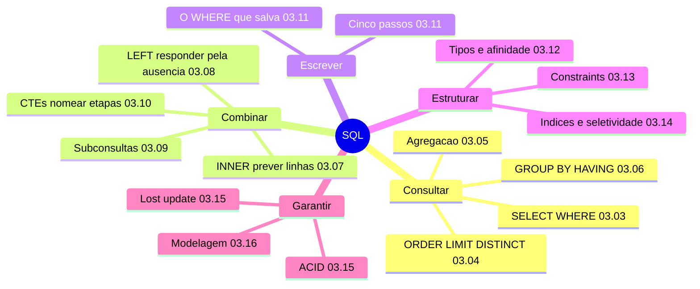

# Mapa mental — Módulo 03: SQL

Como usar: cubra o lado direito e reconstrua cada ramo em voz alta. Se travar num nó,
volte ao capítulo indicado.

**Como ler:** cinco ramos em ordem de dependência — consultar, combinar, escrever, estruturar,
garantir. O mapa é deliberadamente raso; a profundidade está nos capítulos.

---

## O fio que atravessa tudo: `NULL`

Um único conceito reaparece em cinco capítulos com consequências diferentes. Se você reconstruir
só este ramo, já recupera metade do módulo.

| Onde | O que acontece | Capítulo |
|---|---|---|
| `WHERE` | `= NULL` nunca é verdadeiro; use `IS NULL` | 03.03 |
| Agregação | `SUM`/`AVG` **ignoram**; `COUNT(col)` não conta | 03.05 |
| `GROUP BY` | agrupa todos os nulos **numa linha só** | 03.06 |
| `LEFT JOIN` | é o `NULL` que marca a ausência (*anti-join*) | 03.08 |
| `NOT IN` | um `NULL` na lista devolve **zero linhas** | 03.09 |
| `UNIQUE` | aceita **vários** nulos — nunca são "iguais" | 03.13 |
| `CHECK` | `NULL` **atravessa** qualquer condição | 03.13 |

**A frase que unifica:** `NULL` é **desconhecido**, e uma condição desconhecida não é falsa. Toda
a lista acima decorre disso.

## O segundo fio: quantas linhas?

| Onde | A pergunta | Capítulo |
|---|---|---|
| `JOIN` | o pai se multiplica pelo número de filhos? | 03.07 |
| `LEFT JOIN` com dois `JOIN` | `COUNT(DISTINCT ...)` é obrigatório? | 03.08 |
| CTEs | cada filha agregada **antes** de juntar | 03.10 |
| Escrita | linhas afetadas batem com o ensaio? | 03.11 |
| `CASCADE` | o número exibido **não** conta os descendentes | 03.13 |
| Índices | quantas linhas o filtro devolve decide tudo | 03.14 |

## O terceiro fio: o dialeto permissivo

Três vezes o SQLite aceita o que outro banco recusaria — e a lição é a mesma nas três.

- **03.03** — aspas duplas em string: aceitas, e o hábito quebra no PostgreSQL.
- **03.10** — CTE referenciando outra declarada depois: aceita, contra o padrão.
- **03.12** — `'abacaxi'` em coluna `INTEGER`, `BANANA` como tipo, `VARCHAR(3)` com 26 caracteres.

**A permissividade do dialeto não é permissão.** `STRICT` fecha a maior parte disso.

## Decisões que se repetem

| Padrão | Onde aparece |
|---|---|
| Dinheiro em centavos inteiros | 03.01, 03.05, 03.11, 03.12, 03.16 |
| Data em `TEXT` ISO | 03.04, 03.11, 03.12, 03.16 |
| Copiar o valor histórico | `preco_unitario`, endereço de entrega, nota fiscal (03.16) |
| Medir antes de decidir | 03.14 (índices), 03.15 (lote) |
| Conferir depois de escrever | 03.11, 03.15, 03.16 |
