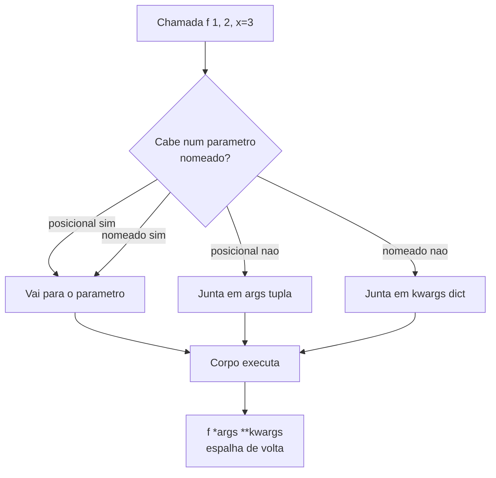

# 04.01 — `*args`, `**kwargs` e assinaturas flexíveis

> **Módulo 04 — Python Avançado** · Nível: N2 · Tempo estimado: 2h30 · Código: `codigo/cap01/`

## 1. Objetivo

- **Implementar** funções que aceitam um número variável de argumentos.
- **Explicar** o que `*` e `**` fazem ao **receber** e ao **repassar** — são operações diferentes.
- **Prever** o comportamento do default mutável, e saber por que ele acontece.
- **Restringir** a forma de chamada com `/` e `*` na assinatura, e justificar quando vale a pena.

Ao final, você lê qualquer assinatura da biblioteca padrão sem hesitar — e escreve funções que envolvem outras sem conhecer a assinatura delas, que é a base dos decoradores.

---

## 2. Pré-requisitos

- [01.18 — Funções parte 1](../01-Python/18-funcoes-parte-1.md) e [01.19 — parte 2](../01-Python/19-funcoes-parte-2-escopo-e-armadilhas.md) — parâmetros, argumentos, valores padrão.
- [01.14 — Tuplas](../01-Python/14-tuplas-e-desempacotamento.md) e [01.15 — Dicionários](../01-Python/15-dicionarios.md) — `*args` é uma tupla, `**kwargs` é um dicionário.
- [01.13 — Aliasing e cópias](../01-Python/13-listas-parte-2-metodos-copias-e-aliasing.md) — **o capítulo que explica a armadilha central deste aqui.**

**Autoteste:** (1) O que acontece quando duas variáveis apontam para a mesma lista? (2) Quando o valor padrão de um parâmetro é criado? (3) Como você escreveria uma função que aceita 1 ou 100 números?

---

## 3. Motivação

Você já escreveu `print("a", "b", "c")` centenas de vezes sem perguntar como `print` aceita três argumentos — ou trinta. E já chamou `sorted(lista, reverse=True, key=len)`, misturando posicionais e nomeados.

Este capítulo abre essas assinaturas. Mas o motivo real de ele existir é outro, e aparece agora:

```python
def adicionar(item, lista=[]):
    lista.append(item)
    return lista

adicionar("a")   # ['a']
adicionar("b")   # ['a', 'b']   <<< de onde veio o 'a'?
```

Duas chamadas independentes, e a segunda enxerga o resultado da primeira. Não há variável global, não há estado declarado, e o `[]` no default parece dizer "comece vazio". Esse é o erro de Python mais reportado por quem já sabe programar — e ele não é uma peculiaridade a decorar: é uma consequência direta do aliasing do 01.13, num lugar onde ninguém procura.

---

## 4. Modelo mental

`*` e `**` fazem **duas coisas opostas**, dependendo de onde aparecem:

| Onde | O que faz | Resultado |
|---|---|---|
| na **definição**: `def f(*args)` | **junta** os posicionais | `args` é uma **tupla** |
| na **definição**: `def f(**kwargs)` | **junta** os nomeados | `kwargs` é um **dicionário** |
| na **chamada**: `f(*lista)` | **espalha** a lista em posicionais | vira `f(a, b, c)` |
| na **chamada**: `f(**dicionario)` | **espalha** o dicionário em nomeados | vira `f(x=1, y=2)` |

**Empacotar na definição, desempacotar na chamada.** É uma operação e o seu inverso, e a mesma sintaxe serve às duas — o que confunde no início e é elegante depois.

Os nomes `args` e `kwargs` são **convenção**, não sintaxe. `def f(*valores, **opcoes)` funciona igual. O que o Python lê são o `*` e o `**`.

---

## 5. Analogia

Imagine um formulário de pedido no balcão.

**Posicionais** são os campos na ordem impressa: quem preenche precisa saber que o terceiro campo é o telefone. Rápido para quem conhece o formulário, arriscado para quem não conhece — trocar dois campos de ordem não dá erro, dá um cadastro errado.

**Nomeados** são campos com etiqueta: `telefone=...`. Mais verboso, e impossível de trocar por engano.

**`*args`** é o campo "observações adicionais" com linhas ilimitadas: escreva quantas quiser, todas chegam juntas numa lista. **`**kwargs`** é um bloco de "outros dados" onde cada linha tem etiqueta e valor.

E o **default mutável** é o balconista que, em vez de pegar um formulário em branco a cada cliente, reaproveita o mesmo — com as anotações do cliente anterior ainda nele.

---

## 6. Teoria

### 6.1 `*args` — juntando posicionais

```python
def somar(*numeros):
    return sum(numeros)

somar(1, 2)          # 3
somar(1, 2, 3, 4)    # 10
somar()              # 0
```

`numeros` é uma **tupla** (01.14) — imutável, e por isso segura de repassar. Zero argumentos produz uma tupla vazia, não um erro.

`*args` pode conviver com parâmetros normais, desde que venha **depois** deles:

```python
def registrar(nivel, *mensagens):
    return f"[{nivel}] " + " | ".join(mensagens)

registrar("INFO", "banco ok", "cache ok")   # '[INFO] banco ok | cache ok'
```

### 6.2 `**kwargs` — juntando nomeados

```python
def conectar(**opcoes):
    return opcoes

conectar(host="localhost", porta=5432)   # {'host': 'localhost', 'porta': 5432}
```

`opcoes` é um **dicionário** (01.15). A ordem de declaração é preservada desde o Python 3.7.

A assinatura completa, na ordem obrigatória:

```python
def f(posicional, padrao="x", *args, so_nomeado, **kwargs):
    ...
```

Trocar a ordem é erro de sintaxe — e a ordem faz sentido lida em voz alta: primeiro o que é obrigatório, depois o que tem padrão, depois o resto dos posicionais, depois os que exigem nome, e por fim o resto dos nomeados.

### 6.3 O repasse — a operação que sustenta o módulo

Na **chamada**, `*` e `**` fazem o inverso: espalham.

```python
def cronometrar(funcao, *args, **kwargs):
    inicio = time.perf_counter()
    resultado = funcao(*args, **kwargs)          # desempacota de volta
    return resultado, (time.perf_counter() - inicio) * 1000
```

```
cronometrar(sorted, [3,1,2], reverse=True) -> [3, 2, 1]
levou 0.0070 ms
```

**Leia o que essa função consegue fazer:** ela cronometra **qualquer** função, com **qualquer** assinatura, sem conhecer nenhuma das duas. Recebe tudo em `*args, **kwargs`, repassa tudo em `*args, **kwargs`.

Essa é a construção mais importante do capítulo, e ela reaparece em 04.03 (closures), 04.04 (decoradores) e em todo framework Python que você vier a usar. `@app.get("/rota")` do FastAPI é essa técnica, três capítulos adiante.

### 6.4 A armadilha do default mutável

```
adicionar_errado('a') -> ['a']
adicionar_errado('b') -> ['a', 'b']   <<< persistiu
```

**O mecanismo, em uma frase: o valor padrão é criado uma vez, quando a função é definida** — não a cada chamada. A lista do `def` é **a mesma lista** em todas as chamadas, e `append` a modifica no lugar (01.13).

Dá para ver o objeto guardado:

```python
adicionar_errado.__defaults__     # (['a', 'b'],)
```

Ele mora num atributo da função. Não é um comportamento oculto — é um objeto acessível, que você pode inspecionar.

**A mesma armadilha com outra roupa**, e esta pega gente experiente:

```python
def registrar_errado(quando=datetime.datetime.now()):
    return quando
```

```
duas chamadas, mesmo instante? True
```

O `now()` foi avaliado **na importação do módulo**. Um programa que roda por dias registra tudo com o horário em que subiu. Nenhum erro, nenhum aviso — só datas erradas.

**A correção é sempre a mesma:** `None` como sentinela, e o objeto criado dentro da função.

```python
def adicionar_certo(item, lista=None):
    if lista is None:
        lista = []
    lista.append(item)
    return lista
```

**A regra prática:** default só pode ser **imutável** — número, texto, `True`/`False`, `None`, tupla. Lista, dicionário, conjunto e chamadas de função vão de `None`.

⚠️ **Caixa-preta 1:** `adicionar_errado.__defaults__` mostra que funções têm **atributos** — elas são objetos, com estado próprio. O que mais um objeto-função carrega, e o que se pode fazer com isso, é o [04.02](02-funcoes-como-valores.md).

### 6.5 Restringindo a forma da chamada

Duas marcas na assinatura controlam **como** a função pode ser chamada:

```python
def relatorio(dados, /, formato="texto", *, incluir_zeros=False):
    ...
```

- **antes da `/`** — só posicional. `relatorio(dados=[1,2])` falha.
- **depois do `*`** — só nomeado. `relatorio([1,2], "json", True)` falha.

As mensagens reais:

```
relatorio(dados=[1,2])          -> TypeError: got some positional-only arguments
                                   passed as keyword arguments: 'dados'
relatorio([1,2], 'json', True)  -> TypeError: takes from 1 to 2 positional
                                   arguments but 3 were given
```

**Por que restringir de propósito?**

**Keyword-only (`*`)** é o mais útil dos dois, e a razão é legibilidade na chamada. `salvar(dados, True, False)` não diz nada a quem lê; `salvar(dados, sobrescrever=True, backup=False)` diz tudo. Forçar o nome impede a versão ilegível de existir. **Regra prática: todo parâmetro booleano deveria ser keyword-only.**

**Positional-only (`/`)**, mais raro, serve a quem publica biblioteca: ele libera você para **renomear** o parâmetro depois sem quebrar o código de ninguém, já que ninguém podia usar o nome. É por isso que aparece em funções embutidas — `len(obj, /)`.

⚠️ **Caixa-preta 2:** `inspect.signature(relatorio)` devolve `(dados, /, formato='texto', *, incluir_zeros=False)` — o Python consegue **ler a própria assinatura** em tempo de execução. Essa capacidade (introspecção) é o que permite a um framework descobrir o que a sua função espera e entregar exatamente isso. É como o FastAPI funciona, no módulo 06.

---

## 7. Funcionamento interno

Os defaults ficam em `funcao.__defaults__` (posicionais) e `funcao.__kwdefaults__` (keyword-only), avaliados uma vez no `def` e guardados no objeto-função. Isso explica tanto a armadilha da §6.4 quanto o fato de ela ser **inspecionável**: não há mágica, há um atributo.

Na chamada, o interpretador distribui os argumentos pelos parâmetros e junta o que sobrar em `args` e `kwargs`. Criar a tupla e o dicionário tem um custo pequeno, irrelevante fora de laços muito quentes.

---

## 8. Visualização do fluxo



**Como ler:** as caixas `D` e `E` são o **empacotamento** — o que sobra da distribuição vira tupla e dicionário. A caixa `G` é a operação inversa, o **desempacotamento**, e é a única do diagrama que acontece numa chamada em vez de numa definição. Reconhecer que são a mesma sintaxe em direções opostas é o que faz `f(*args, **kwargs)` parar de parecer ruído.

---

## 9. Aplicação prática

**A dor da Aurora.** O relatório do módulo 01 tem uma função que cresceu por acumulação:

```python
def gerar_relatorio(dados, formato, incluir_zeros, ordenar_por,
                    limite, mostrar_total, exportar, caminho):
    ...
```

Oito parâmetros, e a chamada real no código:

```python
gerar_relatorio(vendas, "csv", False, "valor", 10, True, True, "saida.csv")
```

**Ninguém lê isso.** O quinto argumento é `limite` ou `ordenar_por`? Os três booleanos no meio são quais? E a cada requisito novo, um parâmetro a mais — no fim, não no meio, porque no meio quebraria as chamadas existentes.

**A refatoração, em dois movimentos:**

```python
def gerar_relatorio(dados, /, formato="texto", *,
                    incluir_zeros=False, ordenar_por="nome",
                    limite=None, mostrar_total=True, **extras):
    ...
```

E a chamada:

```python
gerar_relatorio(vendas, "csv", ordenar_por="valor", limite=10)
```

**O que mudou.** O `*` tornou tudo depois dele nomeado, então a chamada se lê sozinha e a ordem dos parâmetros deixou de importar — acrescentar um novo não quebra nada. Os defaults cobrem o caso comum, e a chamada só menciona o que foge dele. E `**extras` recebe opções futuras sem alterar a assinatura.

**A ressalva honesta sobre `**extras`:** ele é conveniente e tem um custo. Um argumento com nome errado — `ordernar_por="valor"`, com a letra trocada — **não dá erro**: é silenciosamente absorvido por `extras`, e o relatório sai ordenado pelo padrão. Sem `**extras`, o Python diria `unexpected keyword argument`. **Flexibilidade e detecção de erro são um par que se opõe**, e a escolha entre os dois é a decisão real do capítulo.

---

## 10. Código comentado

`codigo/cap01/assinaturas.py` roda as cinco cenas. Três detalhes merecem atenção.

**A cena [1] mostra as duas versões lado a lado**, e a diferença entre elas é uma linha. Ver `['a','b']` e `['b']` na mesma saída torna a correção memorável de um jeito que a explicação sozinha não consegue.

**A cena [2] existe porque a armadilha muda de roupa.** Quem aprendeu "não use lista como default" frequentemente escreve `quando=datetime.now()` no mês seguinte. É o mesmo mecanismo, e reconhecer isso vale mais que decorar a lista de tipos proibidos.

**A cena [4] é a que se leva para o resto do módulo.** `cronometrar` tem cinco linhas e cronometra qualquer função existente. Guarde-a: no 04.04 ela vira decorador com duas mudanças.

---

## 11. Erros comuns

**1. Lista ou dicionário como default.** Persiste entre chamadas.
→ `None` como sentinela, objeto criado dentro.

**2. Chamada de função como default.** `datetime.now()`, `uuid4()`, `time()` — avaliados na definição.
→ Mesmo remédio.

**3. Confundir empacotar com desempacotar.** Na definição junta; na chamada espalha.
→ Leia onde o `*` está: `def` ou parêntese de chamada.

**4. Ordem errada na assinatura.** `def f(*args, a)` sem default torna `a` obrigatório e nomeado — nem sempre é o que se quis.
→ `posicional, padrão, *args, keyword-only, **kwargs`.

**5. `**kwargs` escondendo erro de digitação.** `ordernar_por=...` é absorvido em silêncio.
→ Use `**kwargs` quando a flexibilidade compensar; declare os parâmetros conhecidos.

**6. `*args` onde caberia uma lista.** `somar(*[1,2,3])` e `somar([1,2,3])` são decisões de API diferentes.
→ Se o chamador já tem a coleção, aceitar a coleção é mais honesto.

**7. Muitos booleanos posicionais.** `f(dados, True, False, True)`.
→ Keyword-only para todo booleano.

---

## 12. Boas práticas

- **Default nunca é mutável.** Sem exceção: `None` e criação interna.
- **Booleano é keyword-only.** Um `*` na assinatura resolve.
- **Cinco parâmetros é sinal de alerta.** Acima disso, considere agrupar num objeto (04.13).
- **Use `*args`/`**kwargs` para repassar**, não para evitar declarar parâmetros.
- **Nomeie os parâmetros conhecidos**; deixe `**kwargs` para o que é de fato aberto.
- **`inspect.signature`** para descobrir a assinatura de qualquer função, inclusive as da biblioteca padrão.

---

## 13. Performance

Empacotar em `*args`/`**kwargs` cria uma tupla e um dicionário a cada chamada. O custo é da ordem de dezenas de nanossegundos — irrelevante em quase todo código, mensurável dentro de um laço executado milhões de vezes.

Se um dia isso importar, o caminho não é evitar `*args`: é reduzir o número de chamadas. E a decisão deve vir de medição (03.14), não de intuição — otimizar assinatura antes de medir é o exemplo clássico de otimizar a métrica errada.

---

## 14. Mercado

`*args, **kwargs` é onipatente em código de biblioteca, e a razão é a compatibilidade: uma função que repassa tudo continua funcionando quando a função interna ganha parâmetros novos.

Em código de aplicação, o uso excessivo é sinal de alerta — uma função cuja assinatura é `(*args, **kwargs)` não documenta nada, e o leitor precisa ler o corpo para descobrir o que ela aceita. **A pergunta que separa o bom uso do ruim: você está repassando para outra função, ou evitando decidir?**

O default mutável, por sua vez, é pergunta frequente em entrevista de Python — porque revela se a pessoa entende que argumentos são referências, e não cópias.

---

## 15. Entrevistas

- **"O que imprime `def f(x, lista=[])` chamada duas vezes?"** A pergunta mais comum de Python. Responda o resultado, o **mecanismo** (default avaliado uma vez, na definição) e a correção.
- **"Qual a diferença entre `*` na definição e na chamada?"** Empacota × desempacota. A mesma sintaxe, operações inversas.
- **"Para que serve o `*` sozinho numa assinatura?"** Torna tudo depois dele keyword-only. O argumento forte é legibilidade na chamada, e o exemplo são os booleanos.
- **"Como você cronometraria qualquer função sem alterá-la?"** `def cronometrar(f, *args, **kwargs)` — e mencionar que a versão com `@` é um decorador.

---

## 16. Exercícios guiados

Em [`exercicios/cap01.md`](exercicios/cap01.md):

- **A1** `[~10 min · prevê a saída]` — 6 funções com default e argumentos variáveis.
- **A2** `[~10 min · empacota ou espalha?]` — 6 usos de `*` e `**`.
- **A3** `[~10 min · ache o erro]` — 6 assinaturas defeituosas.
- **A4** `[~10 min · como chamar?]` — 5 assinaturas com `/` e `*`.
- **AP1** `[~20 min · o repasse]` — Escreva três funções que envolvem outras.
- **AP2** `[~25 min · refatorando]` — Oito parâmetros viram uma assinatura legível.
- **AP3** `[~20 min · a armadilha]` — Reproduza o default mutável de três formas.
- **D1** `[~45 min · o registrador]` — **Uma função que outra pessoa chama sem ler o código.**

---

## 17. Desafios

**D1 — O registrador.** Escreva `registrar(evento, *detalhes, nivel="INFO", destino=None, **contexto)` que produza uma linha de log formatada. Requisitos: `nivel` e `destino` só por nome; `detalhes` opcionais entrando na mensagem; `contexto` virando pares `chave=valor` no fim; `destino=None` gravando na saída padrão e, se for um caminho, acrescentando ao arquivo.

A parte que vale: escreva **dez** chamadas de exemplo que demonstrem cada capacidade da assinatura — e mostre **uma** que a assinatura deveria recusar e recusa, com a mensagem de erro.

---

## 18. Mini projeto

**O construtor de consultas.** Escreva `montar_consulta(tabela, /, *colunas, ordenar_por=None, limite=None, **filtros)` que devolva uma tupla `(sql, parametros)` para a Aurora do módulo 03.

Requisitos: `*colunas` vazio vira `SELECT *`; cada par de `**filtros` vira uma condição `AND` com **parâmetro** (`?`), nunca interpolação de string; `ordenar_por` e `limite` opcionais; e a função devolve os parâmetros separados do SQL.

E o requisito que importa: **a função nunca deve produzir SQL a partir de valor recebido** — só de nome de coluna. Escreva um comentário explicando por quê, e teste com um valor contendo `'; DROP TABLE clientes; --`.

---

## 19. Revisão

**Resumo em 5 frases.** `*` e `**` **empacotam** na definição (tupla e dicionário) e **espalham** na chamada — a mesma sintaxe, operações inversas. A construção `def envolver(f, *args, **kwargs): return f(*args, **kwargs)` permite envolver qualquer função sem conhecer a assinatura dela, e é a base dos decoradores. O valor padrão é avaliado **uma vez, na definição**, então lista, dicionário e chamadas de função como default persistem entre chamadas — use `None` como sentinela. O `*` sozinho na assinatura torna tudo depois dele keyword-only, e todo parâmetro booleano deveria ser. E `**kwargs` compra flexibilidade ao preço da detecção de erro: um nome digitado errado é absorvido em silêncio.

**Flashcards** (também em [`revisao/flashcards.md`](revisao/flashcards.md)):

| ID | Frente | Verso |
|---|---|---|
| 04.01-F1 | O que `*args` e `**kwargs` recebem, e de que tipo? | `args` é uma **tupla** com os posicionais que sobraram; `kwargs` é um **dicionário** com os nomeados. Os nomes são convenção — o que importa são o `*` e o `**`. |
| 04.01-F2 | Explique com suas palavras por que `def f(x, lista=[])` acumula entre chamadas. | (Elaboração) O default é criado **uma vez, na definição**, e guardado em `f.__defaults__`. Todas as chamadas compartilham **o mesmo objeto**, e `append` o modifica no lugar (01.13). |
| 04.01-F3 | Preveja: `def r(q=datetime.now())` chamado duas vezes com 1 s de intervalo. | (Previsão) **O mesmo instante nas duas.** `now()` foi avaliado na importação do módulo, não na chamada. Mesma armadilha da lista, outra roupa. |
| 04.01-F4 | Quando usar keyword-only (`*`)? | (Decisão) Sempre que a chamada ficaria ilegível — **todo parâmetro booleano**. `salvar(dados, True, False)` não diz nada; `salvar(dados, sobrescrever=True)` diz. |
| 04.01-F5 | Qual o custo de aceitar `**kwargs` numa API? | Um nome digitado errado (`ordernar_por=`) é **absorvido em silêncio**, e o comportamento padrão prevalece. Sem `**kwargs`, o Python daria `unexpected keyword argument`. Flexibilidade × detecção de erro. |

**Revisão espaçada:** D+1 refaça A1 e A3 · D+7 o AP1 (as três funções que envolvem) · D+30 explique em voz alta por que o default mutável acontece.

---

## 20. Checklist

- [ ] Sei que `*args` é tupla e `**kwargs` é dicionário.
- [ ] Distingo empacotar (definição) de espalhar (chamada).
- [ ] Escrevi uma função que envolve outra sem conhecer a assinatura dela.
- [ ] Reproduzi o default mutável e sei explicar o mecanismo.
- [ ] Reconheço a mesma armadilha com `datetime.now()`.
- [ ] Sei a ordem obrigatória dos parâmetros na assinatura.
- [ ] Usei `*` para tornar booleanos keyword-only.
- [ ] Sei para que serve `/` e por que é raro em código de aplicação.
- [ ] Consigo enunciar o custo de aceitar `**kwargs`.

---

## 21. Próximo capítulo

[04.02 — Funções como valores e lambdas](02-funcoes-como-valores.md). Este capítulo terminou com uma pista: `adicionar.__defaults__` é um **atributo** de uma função. Funções têm atributos porque são objetos — podem ser guardadas em variáveis, postas em listas, passadas como argumento e devolvidas por outras funções. O próximo capítulo explora o que isso permite, começando por `sorted(pessoas, key=...)`.
