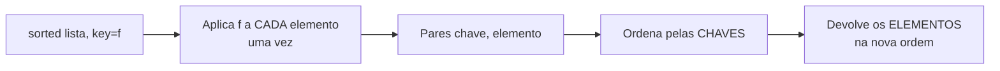

# 04.02 — Funções como valores e lambdas

> **Módulo 04 — Python Avançado** · Nível: N2 · Tempo estimado: 2h30 · Código: `codigo/cap02/`

## 1. Objetivo

- **Explicar** por que funções são objetos, e o que isso permite.
- **Aplicar** `key=` em ordenações, incluindo chaves compostas.
- **Substituir** cadeias de `if/elif` por despacho em dicionário — e saber quando não substituir.
- **Decidir** entre `lambda` e `def` com um critério, não por gosto.

Ao final, você lê `sorted(dados, key=lambda p: (p.cidade, -p.idade))` sem parar para decifrar — e sabe o que se perde ao usar `lambda`.

---

## 2. Pré-requisitos

- [04.01 — `*args` e `**kwargs`](01-args-kwargs-e-assinaturas.md) — terminou mostrando que `funcao.__defaults__` é um atributo. Este capítulo parte daí.
- [01.17 — Compreensões](../01-Python/17-compreensoes.md) — a alternativa a `map` e `filter`.
- [01.15 — Dicionários](../01-Python/15-dicionarios.md) — a estrutura do despacho.

**Autoteste:** (1) Qual a diferença entre `f` e `f()`? (2) Como ordenar uma lista de tuplas pelo segundo elemento? (3) O que acontece se você atribuir `x = print`?

---

## 3. Motivação

O capítulo anterior terminou com uma observação de passagem: `adicionar.__defaults__` é um atributo de uma função. Funções têm atributos. Funções são **objetos**.

A consequência é maior do que parece:

```python
saudar.chamadas = 0        # criando um atributo que não existia
saudar.__name__            # 'saudar'
isinstance(saudar, object) # True
```

Se uma função é um objeto, ela pode ir para onde qualquer objeto vai: uma variável, uma lista, um dicionário, um argumento, o retorno de outra função. É o que a expressão **"funções de primeira classe"** quer dizer — não há uma segunda classe de cidadania para funções, como há em linguagens onde elas só podem ser chamadas.

E isso não é curiosidade acadêmica. Você já usou:

```python
sorted(pessoas, key=lambda p: p[2])
```

O segundo argumento de `sorted` é uma **função**, entregue como valor. Este capítulo explica o que está acontecendo ali — e o que mais essa ideia permite.

---

## 4. Modelo mental

A distinção que organiza tudo é entre **a função** e **o resultado da função**:

| Escrita | O que é |
|---|---|
| `saudar` | o **objeto-função** |
| `saudar("Ana")` | o **resultado** da chamada |
| `f = saudar` | `f` aponta para o mesmo objeto |
| `f = saudar("Ana")` | `f` recebe a string `'Olá, Ana'` |

**Os parênteses são o operador de chamada.** Sem eles, você está falando **da** função; com eles, está pedindo que ela **rode**. Confundir os dois é o erro número um de quem começa a passar funções adiante — e é por isso que `key=lambda p: p[2]` não tem parênteses no fim.

Uma função que recebe ou devolve outra função tem nome: **função de ordem superior**. `sorted`, `map`, `filter` e todo decorador do 04.04 são desse tipo.

---

## 5. Analogia

Pense na diferença entre **uma receita** e **o prato pronto**.

`saudar` é a receita: um papel que você pode guardar numa gaveta, passar para outra pessoa, colocar num livro junto com outras. `saudar("Ana")` é o prato: o resultado de executar a receita com um ingrediente específico.

`sorted(pessoas, key=...)` é um chef que sabe organizar pratos em ordem, mas não sabe **qual critério** você quer. Você entrega a ele uma receita curta — "para cada pessoa, olhe a idade" — e ele a aplica a cada item antes de ordenar. Você não entrega o resultado; entrega o método de obtê-lo.

E o `lambda` é o bilhete escrito na hora, em vez da receita datilografada e arquivada: serve para uma instrução de uma linha, e é péssimo para qualquer coisa que alguém precise consultar depois.

---

## 6. Teoria

### 6.1 A função como objeto

```
__name__: saudar
__doc__:  Cumprimenta alguém pelo nome.
atributo inventado: 0
isinstance(saudar, object): True
```

`__name__` e `__doc__` vêm de graça; `saudar.chamadas = 0` cria um atributo que não existia. Guardar estado num atributo de função é raro em código de aplicação, mas é exatamente o que alguns decoradores fazem (04.04) — e saber que é possível explica construções que de outro modo pareceriam mágicas.

### 6.2 Guardando e passando

```python
f = saudar              # sem parênteses
f("Ana")                # 'Olá, Ana'
f is saudar             # True — o mesmo objeto, dois nomes
```

Em coleções:

```python
operacoes = {"soma": lambda a, b: a + b, "sub": lambda a, b: a - b}
operacoes["soma"](2, 3)     # 5
```

Leia `operacoes["soma"](2, 3)` em dois tempos: `operacoes["soma"]` **obtém** a função; `(2, 3)` a **chama**. É o mesmo encadeamento de `lista[0].upper()`.

### 6.3 `key=` — o argumento que ordena tudo

```python
sorted(PESSOAS, key=lambda p: p[2])          # por idade
sorted(PESSOAS, key=itemgetter(2))           # idem, sem lambda
```

`key` recebe uma função e a aplica a cada elemento; a ordenação usa **o resultado**, não o elemento. É a diferença entre "ordene estas tuplas" e "ordene estas tuplas **pelo terceiro campo**".

**Chave composta** — o padrão que resolve a maioria dos casos reais:

```python
sorted(PESSOAS, key=lambda p: (p[1], -p[2]))
```

```
[('Diego','rj',35), ('Bruno','rj',25), ('Carla','sp',40), ('Ana','sp',30)]
```

Cidade crescente, idade **decrescente**. A tupla é comparada elemento a elemento (01.14), e o menos inverte o segundo critério. **O truque do sinal negativo só funciona com números** — para inverter texto, é preciso ordenar duas vezes, aproveitando a estabilidade (§6.6).

**Uma medição que corrige uma intuição comum:**

```
1000 elementos -> key chamada 1000 vezes
(uma comparação por par seria ~9965)
```

`key` é chamada **uma vez por elemento**, não a cada comparação. O Python calcula todas as chaves primeiro e ordena os pares — é o padrão *decorate-sort-undecorate*. Consequência prática: uma função `key` cara é aceitável; uma função de **comparação** seria chamada `n log n` vezes.

⚠️ **Caixa-preta 1:** `itemgetter(2)` **devolve uma função** — é uma função que fabrica funções. Como uma função guarda o `2` que recebeu, para usá-lo depois, é o assunto do [04.03 — Closures](03-closures-e-fabricas.md).

### 6.4 Despacho por dicionário

O padrão que substitui cadeias de `if/elif`:

```python
AREAS = {"circulo": area_circulo, "quadrado": area_quadrado}

AREAS["circulo"](2)          # 12.566
AREAS.get("triangulo")       # None
```

Contra a alternativa:

```python
if forma == "circulo":
    return area_circulo(r)
elif forma == "quadrado":
    return area_quadrado(r)
elif ...
```

**O ganho real não é elegância, é o ponto de alteração.** Acrescentar uma forma nova ao dicionário é acrescentar **uma chave**; na cadeia de `if`, é editar uma função que cresce indefinidamente e que precisa ser retestada por inteiro. O dicionário também pode ser montado em tempo de execução — a partir de configuração, de plugins, de um registro.

**E o custo, que é real.** A cadeia de `if` permite condições compostas (`elif forma == "circulo" and unidade == "cm"`); o dicionário só casa por chave exata. Um erro de digitação vira `None` silencioso em vez de cair no `else`. **Use `.get(chave)` com um padrão explícito, ou deixe o `KeyError` estourar** — o pior dos mundos é um `None` que segue viagem.

### 6.5 `lambda` × `def`

```
lambda.__name__: <lambda>
def.__name__:    quadrado_def
lambda.__doc__:  None
```

`lambda` é uma função **anônima de uma expressão**. O que se perde:

- **o nome** — num traceback, aparece `<lambda>`, e você não sabe qual dos oito;
- **a docstring** — não há onde explicar;
- **múltiplas linhas** — só uma expressão, sem `if` de bloco, sem `try`, sem atribuição.

**O critério, e ele é simples:** use `lambda` para uma expressão curta **passada como argumento** e descartada em seguida — `key=`, `sorted`, `filter`. Para qualquer coisa que ganhe nome, use `def`.

O sinal de que você passou do ponto: `funcao = lambda x: ...`. Se o lambda está sendo **atribuído a um nome**, ele deixou de ser anônimo — e você acabou de escrever um `def` pior, sem docstring e com traceback ruim. É por isso que o PEP 8 desaconselha explicitamente essa forma, e por que linters a marcam.

### 6.6 Estabilidade da ordenação

```python
sorted([("b",1),("a",2),("c",1),("d",2)], key=lambda x: x[1])
# [('b',1), ('c',1), ('a',2), ('d',2)]
```

`b` antes de `c`, `a` antes de `d`: **a ordem original é preservada dentro de cada grupo empatado**. É uma garantia do Python, não um acaso.

Ela habilita um padrão elegante: para ordenar por vários critérios sem tupla, ordene **do menos importante para o mais importante**, em passadas sucessivas. É a única forma de obter "cidade crescente, nome decrescente" sem inverter texto.

### 6.7 `map`, `filter` e por que compreensões venceram

```
tipo: map
list(resultado): ['A', 'B']
list(resultado) de novo: []   <<< vazio
```

`map` e `filter` devolvem **iteradores preguiçosos**, não listas — e um iterador se esgota. Consumi-lo duas vezes devolve vazio na segunda, sem erro.

Compreensões fazem o mesmo trabalho, produzem uma lista de verdade e são mais legíveis para quem lê Python:

```python
[s.upper() for s in nomes]              # em vez de map(str.upper, nomes)
[n for n in nums if n > 0]              # em vez de filter(lambda n: n > 0, nums)
```

`map` ainda tem lugar quando a função já existe e tem nome (`map(int, linhas)`), e quando a preguiça importa — arquivo grande, dados infinitos. É o tema do 04.06.

⚠️ **Caixa-preta 2:** por que `map` "esgota" e uma lista não? Porque `map` é um **iterador**, e iteradores têm um protocolo próprio, com estado interno que avança e não volta. Esse protocolo é o que faz o `for` funcionar — e é o [04.05](05-iteraveis-e-iteradores.md).

---

## 7. Funcionamento interno

Um `def` cria um objeto do tipo `function` e liga um nome a ele — exatamente como uma atribuição. O corpo compilado fica em `funcao.__code__`; os padrões, em `__defaults__`; a documentação, em `__doc__`.

`lambda` cria o **mesmo tipo de objeto**. A única diferença é que a expressão vira o retorno implícito e o nome fica `<lambda>`. Não há penalidade de desempenho, nem vantagem: é açúcar sintático com um custo de legibilidade.

`sorted` implementa o *Timsort*, que é estável por construção e explora trechos já ordenados. Ele calcula todas as chaves antes de comparar — daí a medição da §6.3.

---

## 8. Visualização do fluxo



**Como ler:** a caixa `B` é a que corrige a intuição — as chaves são calculadas todas de uma vez, antes de qualquer comparação. A caixa `E` é a que costuma surpreender na direção oposta: o resultado contém os **elementos originais**, não as chaves. `key` decide a ordem e desaparece.

---

## 9. Aplicação prática

**A dor da Aurora.** O relatório precisa ordenar produtos de seis formas diferentes, conforme o que o usuário escolhe. A versão que existe:

```python
def ordenar(produtos, criterio):
    if criterio == "nome":
        return sorted(produtos, key=lambda p: p["nome"])
    elif criterio == "preco":
        return sorted(produtos, key=lambda p: p["preco_centavos"])
    elif criterio == "preco_desc":
        return sorted(produtos, key=lambda p: -p["preco_centavos"])
    # ... mais três
```

**A refatoração:**

```python
CRITERIOS = {
    "nome":       lambda p: p["nome"],
    "preco":      lambda p: p["preco_centavos"],
    "preco_desc": lambda p: -p["preco_centavos"],
    "categoria":  lambda p: (p["categoria"], p["nome"]),
}

def ordenar(produtos, criterio="nome"):
    chave = CRITERIOS.get(criterio)
    if chave is None:
        raise ValueError(
            f"critério '{criterio}' desconhecido. Use: {', '.join(CRITERIOS)}"
        )
    return sorted(produtos, key=chave)
```

**O que mudou, além do tamanho.** Os critérios viraram **dados**, e dados podem ser listados: a mensagem de erro enumera as opções válidas automaticamente, e continuará correta quando alguém acrescentar a sétima. Na versão com `if`, essa lista seria escrita à mão e ficaria desatualizada na primeira alteração.

E note que `"categoria"` usa **chave composta** — dentro de cada categoria, ordena por nome. Numa cadeia de `if`, esse caso pediria um bloco especial; aqui é só mais uma entrada.

**A ressalva honesta.** Os lambdas do dicionário não têm nome nem docstring, e um traceback dentro de qualquer um deles diz `<lambda>`. Com quatro critérios de uma linha, é aceitável. Se algum precisar de duas linhas ou de tratamento de ausência (`p.get("preco_centavos", 0)`), ele deveria virar um `def` nomeado e entrar no dicionário pelo nome. **O dicionário de despacho não obriga a usar lambdas** — ele guarda funções, e `def` produz funções melhores.

---

## 10. Código comentado

`codigo/cap02/funcoes_valores.py` roda as seis cenas. Três merecem comentário.

**A cena [3] mede em vez de afirmar.** Um contador dentro da função `key` mostra 1000 chamadas para 1000 elementos. É o tipo de afirmação que quase todo tutorial faz de cabeça e que custa nada verificar — e o número alternativo (~9965) está impresso ao lado para dar escala.

**A cena [5] imprime `__name__` das duas versões.** Ver `<lambda>` na saída torna concreto o argumento sobre tracebacks; ler que "o lambda não tem nome" é abstrato até você ver a string.

**A cena [6] consome o `map` duas vezes**, e a segunda devolve `[]`. É deliberadamente inquietante: nenhuma exceção, nenhum aviso, uma lista vazia onde havia dados. Guarde essa saída — o 04.05 explica exatamente por que isso acontece, e o 04.06 mostra por que essa característica é útil em vez de defeituosa.

---

## 11. Erros comuns

**1. Chamar quando queria passar.** `sorted(dados, key=minha_funcao())` executa a função e passa o resultado.
→ Sem parênteses: `key=minha_funcao`.

**2. Atribuir lambda a um nome.** `f = lambda x: x*2` é um `def` pior.
→ `def f(x): return x * 2`.

**3. Achar que `key` recebe dois elementos.** Ela recebe **um** e devolve o critério.
→ Comparação de pares é outra coisa (`functools.cmp_to_key`), raramente necessária.

**4. Usar `-x` para inverter texto.** `-"abc"` é `TypeError`.
→ `reverse=True`, ou duas passadas explorando a estabilidade.

**5. Consumir `map`/`filter` duas vezes.** A segunda vem vazia, em silêncio.
→ `list(...)` se for reutilizar; ou compreensão.

**6. Despacho com `KeyError` não tratado**, ou pior, `.get()` devolvendo `None` que segue viagem.
→ Padrão explícito ou erro claro com as opções válidas.

**7. Lambda com lógica demais.** `lambda x: (x*2 if x > 0 else -x) if x else 0`.
→ Se precisa parar para ler, é `def`.

---

## 12. Boas práticas

- **`lambda` só como argumento descartável.** Ganhou nome, virou `def`.
- **Chave composta com tupla** em vez de duas ordenações, quando os critérios forem todos crescentes ou numéricos.
- **`operator.itemgetter` / `attrgetter`** quando a chave é só "pegue o campo N" — mais rápido e mais legível que o lambda equivalente.
- **Despacho por dicionário** quando a cadeia de `if` passa de três casos e os casos são igualdade simples.
- **Mensagem de erro que lista as opções**, gerada a partir do próprio dicionário.
- **Compreensões no lugar de `map`/`filter`** em código de aplicação.

---

## 13. Performance

`itemgetter(2)` é mais rápido que `lambda p: p[2]` porque é implementado em C — a diferença é de ~30% na chamada, o que importa em ordenações de milhões de elementos e em nada abaixo disso.

Despacho por dicionário é **O(1)** contra **O(n)** da cadeia de `if`, mas com dez casos a diferença é de nanossegundos. **O argumento a favor do despacho é manutenção, não velocidade** — e apresentá-lo como otimização é vender a coisa errada.

O ponto em que a escolha realmente pesa é a `key` cara: como ela roda uma vez por elemento (§6.3), uma consulta a banco dentro de um `key` faz `n` consultas. A correção é buscar os dados antes e ordenar em memória — e é o tipo de erro que só aparece quando a lista cresce.

---

## 14. Mercado

Funções de primeira classe são a base de metade do Python moderno que você vai encontrar: `key=`, decoradores, *callbacks*, injeção de dependência do FastAPI, `pytest.fixture`. Não é um tópico avançado opcional — é o vocabulário.

O despacho por dicionário aparece com força em código de produção sob o nome de **registro**: bibliotecas que permitem plugins mantêm um dicionário de nome para função e o preenchem por decorador. Depois do 04.04, você reconhece o padrão inteiro.

E `lambda` é um bom termômetro de revisão de código: usado como argumento curto, é idiomático; atribuído a nomes ou com três níveis de condicional, sinaliza alguém que aprendeu a construção antes do critério.

---

## 15. Entrevistas

- **"Qual a diferença entre `f` e `f()`?"** Parece básica e separa. O objeto contra o resultado da chamada.
- **"Quando usar `lambda` em vez de `def`?"** Expressão curta passada como argumento e descartada. Se ganha nome, é `def` — e diga por quê: traceback e docstring.
- **"Como ordenar por dois critérios, um crescente e outro decrescente?"** Tupla com `-` no numérico; ou duas passadas explorando a **estabilidade** do `sorted`. Mencionar a estabilidade é o que impressiona.
- **"`key` é chamada quantas vezes?"** Uma por elemento. Muita gente responde `n log n`.
- **"Como você substituiria um `if/elif` de dez casos?"** Dicionário de despacho — e citar o custo: só casa igualdade exata, e a chave errada precisa de tratamento explícito.

---

## 16. Exercícios guiados

Em [`exercicios/cap02.md`](exercicios/cap02.md):

- **A1** `[~10 min · prevê a saída]` — 6 trechos com funções como valores.
- **A2** `[~10 min · escreva o key]` — 6 ordenações a partir da descrição.
- **A3** `[~10 min · lambda ou def?]` — 6 casos para decidir e justificar.
- **A4** `[~10 min · ache o erro]` — 6 usos defeituosos.
- **AP1** `[~20 min · o despacho]` — Converta um `if/elif` de sete casos.
- **AP2** `[~25 min · ordenando a Aurora]` — Seis critérios sobre dados reais.
- **AP3** `[~20 min · a estabilidade]` — Ordene por três critérios sem tupla.
- **D1** `[~45 min · o pipeline]` — **Uma lista de funções aplicada em sequência.**

---

## 17. Desafios

**D1 — O pipeline.** Escreva `aplicar(dados, *etapas)` que passe `dados` por cada função da sequência, alimentando a saída de uma na entrada da seguinte. Requisitos: funciona com zero etapas (devolve os dados); acumula um relatório de quantos itens entraram e saíram de cada etapa; e uma etapa que levante exceção interrompe o pipeline com uma mensagem que **nomeia a etapa** — o que exige resolver o problema do `<lambda>`.

Use-o para processar as vendas da Aurora: filtrar concluídas, converter centavos, agrupar por cidade, ordenar por total. Depois responda: em que esse pipeline é melhor e em que é pior que quatro linhas de código sequencial?

---

## 18. Mini projeto

**O ordenador configurável.** Escreva um módulo que ordene os produtos da Aurora (lidos do banco do módulo 03) por qualquer critério vindo de uma **string de configuração** no formato `"categoria,-preco,nome"` — vírgula separa critérios, `-` inverte.

Requisitos: converter a string num `key` composto; recusar campos desconhecidos com mensagem que lista os válidos; suportar inversão de campos de texto (onde o `-` não funciona); e um teste que prove que `"categoria,-preco"` e `"categoria"` seguido de `"-preco"` em duas passadas produzem o mesmo resultado.

---

## 19. Revisão

**Resumo em 5 frases.** Funções são objetos: têm atributos, cabem em variáveis, listas e dicionários, e podem ser passadas e devolvidas — daí "primeira classe". Os parênteses são o operador de chamada, e `f` contra `f()` é a distinção que organiza o capítulo. `key=` recebe uma função aplicada **uma vez por elemento** (não a cada comparação) e ordena pelo resultado, com tupla para chave composta e `-` para inverter numéricos. Despacho por dicionário substitui cadeias de `if/elif` e o ganho é o **ponto de alteração**, não a velocidade — ao custo de só casar igualdade exata. E `lambda` serve para uma expressão curta passada como argumento: se ganhou nome, virou um `def` pior, sem docstring e com traceback `<lambda>`.

**Flashcards** (também em [`revisao/flashcards.md`](revisao/flashcards.md)):

| ID | Frente | Verso |
|---|---|---|
| 04.02-F1 | Qual a diferença entre `f` e `f()`? | `f` é o **objeto-função**; `f()` é o **resultado** de chamá-la. Os parênteses são o operador de chamada — por isso `key=minha_funcao` não os leva. |
| 04.02-F2 | Explique com suas palavras por que `map` esgota e uma lista não. | (Elaboração) `map` devolve um **iterador**: tem estado interno que avança e não volta. Consumido duas vezes, a segunda devolve vazio **sem erro**. Lista é uma coleção; iterador é uma posição numa sequência. |
| 04.02-F3 | Preveja: `key` é chamada quantas vezes ao ordenar 1000 elementos? | (Previsão) **1000** — uma por elemento. O Python calcula todas as chaves antes de comparar (*decorate-sort-undecorate*). Uma função de **comparação** seria chamada ~9965 vezes. |
| 04.02-F4 | Quando usar `lambda` em vez de `def`? | (Decisão) Expressão curta passada como argumento e descartada (`key=`, `sorted`). Se está sendo **atribuído a um nome**, é um `def` pior: sem docstring e com `<lambda>` no traceback. |
| 04.02-F5 | Como ordenar por cidade crescente e idade decrescente? | Chave composta com o sinal: `key=lambda p: (p.cidade, -p.idade)`. O `-` só funciona em **números**; para texto, duas passadas explorando a **estabilidade** do `sorted`. |

**Revisão espaçada:** D+1 refaça A2 e A4 · D+7 o AP1 (despacho de sete casos) · D+30 explique em voz alta por que `key` roda `n` vezes.

---

## 20. Checklist

- [ ] Sei distinguir `f` de `f()` e explico por que `key=` não leva parênteses.
- [ ] Guardei funções em variável, lista e dicionário.
- [ ] Escrevi um `key` com chave composta e inversão numérica.
- [ ] Sei que `key` é chamada uma vez por elemento, e por que isso importa.
- [ ] Converti um `if/elif` em despacho e sei enunciar o custo.
- [ ] Tenho um critério para `lambda` × `def`, não um gosto.
- [ ] Sei o que a estabilidade do `sorted` garante e o que ela habilita.
- [ ] Vi um `map` esgotar na segunda leitura.

---

## 21. Próximo capítulo

[04.03 — Closures e fábricas de funções](03-closures-e-fabricas.md). Este capítulo usou `itemgetter(2)` — uma função que **devolve** outra função, e que de algum modo guarda o `2` para usá-lo depois. Como uma função lembra do ambiente em que nasceu é o assunto do próximo, e ele começa com um enigma: `[lambda: i for i in range(3)]` produz três funções que devolvem **`2`, `2`, `2`**.
