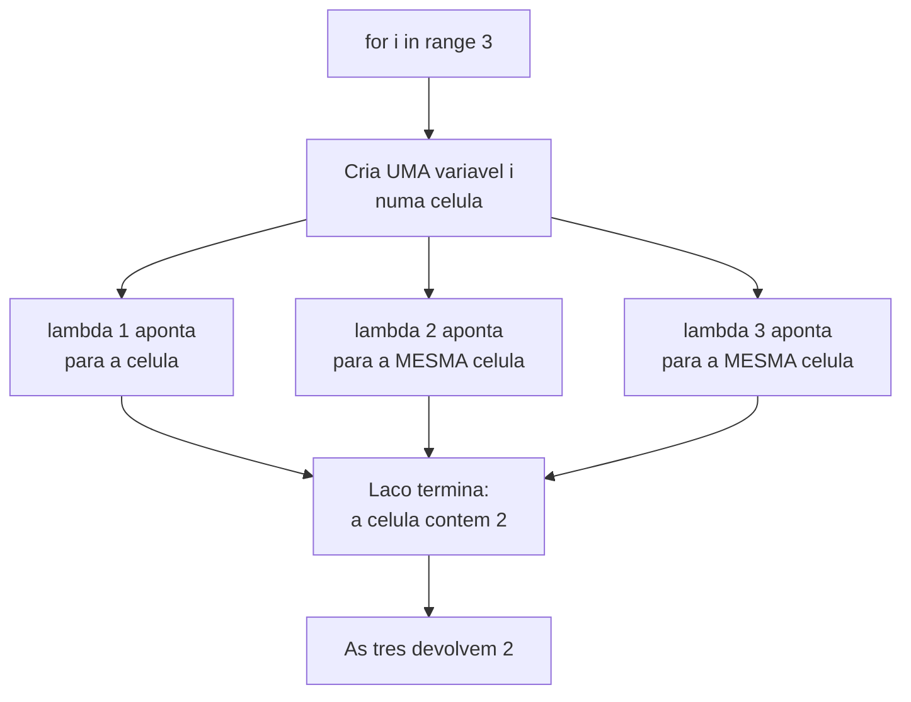

# 04.03 — Closures e fábricas de funções

> **Módulo 04 — Python Avançado** · Nível: N2 · Tempo estimado: 2h30 · Código: `codigo/cap03/`

## 1. Objetivo

- **Explicar** o que uma closure guarda, e provar com `__closure__`.
- **Prever** o resultado de funções criadas dentro de laços — o erro clássico.
- **Construir** fábricas de funções e usar `nonlocal` para manter estado.
- **Decidir** entre closure e classe quando os dois resolvem.

Ao final, `itemgetter(2)` e `@app.get("/rota")` deixam de ser construções misteriosas — e você sabe por que `[lambda: i for i in range(3)]` devolve `[2, 2, 2]`.

---

## 2. Pré-requisitos

- [04.02 — Funções como valores](02-funcoes-como-valores.md) — funções que devolvem funções; `itemgetter(2)` ficou por explicar.
- [04.01 — Assinaturas](01-args-kwargs-e-assinaturas.md) — **o default avaliado na definição vira ferramenta aqui.**
- [01.19 — Escopo](../01-Python/19-funcoes-parte-2-escopo-e-armadilhas.md) — local, global e a regra LEGB.

**Autoteste:** (1) O que acontece com as variáveis locais quando uma função termina? (2) Por que `x += 1` dentro de uma função exige `global x` se `x` for global? (3) O que `itemgetter(2)` devolve?

---

## 3. Motivação

O capítulo anterior terminou com um enigma:

```python
funcoes = [lambda: i for i in range(3)]
[f() for f in funcoes]        # [2, 2, 2]
```

Três funções criadas com `i` valendo 0, 1 e 2. Todas devolvem `2`.

Esse resultado costuma provocar duas reações erradas. A primeira é "o Python está errado". A segunda é decorar a correção (`lambda i=i: i`) sem entender por quê — o que garante que o mesmo erro reapareça com outra roupa em seis meses.

A explicação exige um conceito: **closure**. E ele não é um tópico exótico — é o mecanismo por trás de `itemgetter(2)`, de todo decorador do próximo capítulo, e de `@app.get("/usuarios")` no FastAPI.

---

## 4. Modelo mental

Normalmente, quando uma função termina, suas variáveis locais desaparecem. **Exceto** se outra função, criada ali dentro, ainda as usa. Nesse caso o Python mantém as variáveis vivas, e a função interna carrega uma referência a elas.

Essa função interna **mais** o ambiente que ela carrega é uma **closure** — "fechamento", porque a função se fecha sobre as variáveis do escopo onde nasceu.

```python
def multiplicador(fator):
    def multiplicar(x):
        return x * fator      # `fator` é uma VARIÁVEL LIVRE
    return multiplicar

dobro = multiplicador(2)
dobro(5)                      # 10 — mas `multiplicador` já terminou!
```

`fator` não é parâmetro de `multiplicar` nem variável local dela. É uma **variável livre**: usada, mas definida em outro escopo. É ela que a closure guarda.

**A frase que resolve o enigma da §3, e vale decorar: a closure guarda a VARIÁVEL, não o VALOR.** Se a variável mudar depois, a closure vê o valor novo.

---

## 5. Analogia

Uma closure é um **funcionário que sai da empresa levando a chave de uma sala**.

A empresa (a função externa) fechou. As outras salas foram desmontadas. Mas aquela sala continua de pé, porque alguém ainda tem a chave — e esse alguém pode entrar quando quiser, para ver o que há dentro.

A parte que explica o enigma: **a chave é da sala, não uma fotografia do conteúdo.** Se três funcionários receberem a chave da **mesma** sala, e alguém trocar o que há dentro depois que os três saíram, os três verão a coisa nova — não o que estava lá quando cada um pegou sua chave.

`[lambda: i for i in range(3)]` distribui três chaves da mesma sala. Quando o laço termina, o que está na sala é `2`.

---

## 6. Teoria

### 6.1 A closure é inspecionável

Nada aqui é mágica; há atributos que você pode ler:

```
dobro(5): 10 · triplo(5): 15
dobro is triplo: False (objetos diferentes)
variáveis livres: ('fator',)
célula guarda:   2
a mesma, no triplo: 3
```

- **`funcao.__code__.co_freevars`** — os **nomes** das variáveis livres.
- **`funcao.__closure__`** — uma tupla de **células**, uma por variável livre.
- **`celula.cell_contents`** — o valor guardado.

`dobro` e `triplo` são objetos **diferentes**, cada um com sua célula: 2 e 3. É a mesma constatação do 04.01 — o comportamento tem um objeto por trás, e ele é acessível.

**Uma célula é uma caixa com uma referência dentro.** É esse nível de indireção que faz a closure ver a variável, e não uma cópia dela.

### 6.2 Por que `[2, 2, 2]`

```
sem correção: [2, 2, 2]
com i=i:      [0, 1, 2]
com fábrica:  [0, 1, 2]
```

O laço `for i in range(3)` cria **uma** variável `i` e a reatribui três vezes. Os três lambdas capturam **a mesma variável**. Quando você finalmente os chama — depois do laço —, `i` vale 2.

**O detalhe que confirma o mecanismo:** o resultado não depende de quando as funções foram criadas, mas de **quando são chamadas**. Chame a primeira função dentro do laço e ela devolve o valor corrente; chame depois, e devolve 2.

**Correção 1 — o default:**

```python
[lambda i=i: i for i in range(3)]
```

Aqui a armadilha do 04.01 vira ferramenta. O default é avaliado **na definição** — no momento em que o lambda é criado, com `i` valendo 0, 1 e 2 respectivamente. O valor é **congelado** num parâmetro, e o parâmetro é local a cada função.

O custo: a assinatura ganha um parâmetro que ninguém deveria passar. `f(99)` devolve 99.

**Correção 2 — a fábrica:**

```python
def fabricar(valor):
    return lambda: valor

[fabricar(i) for i in range(3)]
```

Cada chamada de `fabricar` cria um **escopo novo**, com sua própria variável `valor` e sua própria célula. Três chamadas, três células, três valores.

**Qual usar?** A fábrica é mais verbosa e mais honesta — a assinatura não mente. O default é mais curto e idiomático em código pequeno. **Em código que outra pessoa mantém, prefira a fábrica**, porque `lambda i=i: i` exige conhecer exatamente esta armadilha para entender por que o parâmetro existe.

### 6.3 `nonlocal` — estado que sobrevive

```python
def contador(inicio=0):
    n = inicio

    def incrementar(passo=1):
        nonlocal n
        n += passo
        return n

    return incrementar
```

```
c(), c(), c(): 1 2 3
contador novo, independente: 101 102
o primeiro continua de onde parou: 4
```

Duas coisas importantes na saída. Cada chamada de `contador()` produz um contador **independente**, com sua própria célula. E o primeiro continua de onde parou depois do segundo existir — os estados não se misturam.

**Sem `nonlocal`:**

```
UnboundLocalError: local variable 'n' referenced before assignment
```

O motivo é a regra de escopo do 01.19: **qualquer atribuição a um nome, em qualquer lugar do corpo, torna esse nome local à função inteira.** `n += 1` é uma atribuição, então `n` vira local — e a leitura do lado direito acontece antes de existir valor.

`nonlocal n` declara: "`n` não é local, é do escopo de fora". É irmão de `global`, mas para escopo **envolvente**, não módulo.

**Note que ler não exige `nonlocal`.** `return x * fator` funciona sem declaração; só a **atribuição** exige. É a assimetria que confunde, e reconhecê-la explica os dois casos de uma vez.

⚠️ **Caixa-preta 1:** uma closure com `nonlocal` é um objeto com estado e comportamento — que é a definição de objeto em POO. Quando usar uma e quando usar uma classe é uma decisão real, e o vocabulário para fazê-la vem no [04.07](07-poo-classes-e-objetos.md).

### 6.4 Fábricas na prática

O padrão que você vai reconhecer em toda parte:

```python
def validador_de_faixa(minimo, maximo):
    def validar(valor):
        return minimo <= valor <= maximo
    return validar

nota_valida = validador_de_faixa(0, 10)
idade_valida = validador_de_faixa(0, 130)
```

Duas funções especializadas, uma definição. É o que `itemgetter(2)` faz: uma função que fabrica uma função que sabe pegar o índice 2.

**A alternativa sem fábrica** seria `validar(valor, minimo, maximo)` — e ela é melhor em muitos casos. A fábrica se justifica quando a função especializada precisa ser **passada adiante** com a assinatura que o destino espera: `sorted` chama `key` com um argumento, e é só isso que ele aceita.

**A comparação com `functools.partial`:**

```python
from functools import partial
nota_valida = partial(validar, minimo=0, maximo=10)
```

`partial` faz o mesmo com menos código. A fábrica ganha quando há lógica na criação — validar os limites, pré-calcular algo, escolher entre implementações.

### 6.5 Closure ou classe?

As duas guardam estado e comportamento:

```python
def contador():                    class Contador:
    n = 0                              def __init__(self):
    def inc():                             self.n = 0
        nonlocal n                     def __call__(self):
        n += 1                             self.n += 1
        return n                           return self.n
    return inc
```

**O critério prático:** uma operação e pouco estado, closure; várias operações ou estado que precisa ser inspecionado, classe.

O contador acima ilustra o limite: com a closure, **não há como ler o valor atual sem incrementá-lo**, nem zerá-lo. Adicionar essas operações exige devolver várias funções ou um dicionário delas — e nesse ponto você reinventou uma classe, pior.

⚠️ **Caixa-preta 2:** você já viu `@decorador` em código. Um decorador é exatamente o que este capítulo construiu: uma função que **recebe** uma função e **devolve** outra, capturando a original numa closure. O `@` é açúcar sintático, e o [04.04](04-decoradores.md) abre a caixa.

---

## 7. Funcionamento interno

Quando o compilador vê uma função interna usando um nome do escopo externo, ele marca esse nome como **variável de célula** na função externa e **variável livre** na interna. A variável passa a viver numa `cell` — um objeto com um único campo.

Ler `fator` dentro de `multiplicar` é ler `cell.cell_contents`. É essa indireção que faz duas closures compartilharem estado quando compartilham a célula, e é exatamente o que acontece no laço da §6.2: uma célula, três funções.

O custo de uma closure é um objeto `cell` por variável livre e uma indireção por leitura — desprezível fora de laços muito quentes.

---

## 8. Visualização do fluxo



**Como ler:** as três setas de `B` chegam ao mesmo lugar — é o diagrama inteiro. O erro não está em nenhum lambda; está em existir **uma** célula para três funções. As duas correções da §6.2 fazem a mesma coisa por caminhos diferentes: criar três células.

---

## 9. Aplicação prática

**A dor da Aurora.** O relatório precisa aplicar filtros configuráveis: preço mínimo, categoria, apenas ativos — e a combinação varia conforme quem pede.

A versão que existe:

```python
def filtrar(produtos, preco_min=None, categoria=None, so_ativos=False):
    resultado = produtos
    if preco_min is not None:
        resultado = [p for p in resultado if p["preco_centavos"] >= preco_min]
    if categoria is not None:
        resultado = [p for p in resultado if p["categoria"] == categoria]
    if so_ativos:
        resultado = [p for p in resultado if p["ativo"]]
    return resultado
```

Funciona, e cada filtro novo é mais um `if` e mais um parâmetro.

**Com fábricas:**

```python
def preco_minimo(valor):
    def filtro(p):
        return p["preco_centavos"] >= valor
    return filtro

def da_categoria(nome):
    def filtro(p):
        return p["categoria"] == nome
    return filtro

def apenas_ativos():
    def filtro(p):
        return bool(p["ativo"])
    return filtro


def filtrar(produtos, *filtros):
    return [p for p in produtos if all(f(p) for f in filtros)]
```

```python
filtrar(produtos, preco_minimo(10000), da_categoria("audio"))
```

**O que mudou.** Os filtros viraram **valores**: podem ser guardados numa lista, montados a partir de configuração, combinados em qualquer ordem, testados isoladamente. `filtrar` não conhece nenhum deles e não precisa mudar quando um novo aparece.

**A ressalva honesta, e ela é séria.** Para três filtros fixos, a primeira versão é **melhor**: cabe numa tela, não exige entender closures, e o depurador mostra o que está acontecendo. A versão com fábricas se paga quando os filtros vêm de fora — de um formulário, de um arquivo de configuração, de uma API — e o programa não sabe de antemão quais serão.

**A pergunta que decide: os filtros são conhecidos em tempo de escrita, ou só em tempo de execução?** Se são conhecidos, `if` é mais honesto. É a mesma pergunta do pipeline no 04.02, e ela vai reaparecer no 04.11 sobre composição.

---

## 10. Código comentado

`codigo/cap03/closures.py` roda as cinco cenas. Três observações.

**A cena [2] imprime `cell_contents`**, e é o que transforma a explicação em fato verificável. Ver o `2` guardado numa célula, e o `3` na célula do `triplo`, encerra qualquer dúvida sobre "onde o valor fica".

**A cena [3] mostra as duas correções lado a lado**, com a versão errada acima. A saída `[2,2,2] / [0,1,2] / [0,1,2]` na mesma tela é o resumo do capítulo.

**A cena [4] cria dois contadores e intercala as chamadas** — `c()` três vezes, depois `outro()` duas, depois `c()` de novo, que devolve 4. Isso prova o que uma execução sequencial não provaria: os estados são independentes, e cada closure tem sua célula.

---

## 11. Erros comuns

**1. Criar funções em laço sem congelar a variável.** O erro do capítulo.
→ `lambda i=i:` ou fábrica.

**2. Esquecer `nonlocal` ao atribuir.** `UnboundLocalError`.
→ Ler não exige; **atribuir** exige.

**3. Confundir `nonlocal` com `global`.** `nonlocal` é para escopo envolvente; `global`, para módulo.
→ Se não há função externa, `nonlocal` é erro de sintaxe.

**4. Usar closure onde uma classe seria melhor.** Sinal: precisar de mais de uma operação sobre o mesmo estado.
→ Uma operação, closure; várias, classe.

**5. Esperar que a closure copie o valor.** Ela referencia a variável.
→ Congelar exige um escopo novo ou um default.

**6. Fábrica onde `partial` bastaria.** Se não há lógica na criação, `functools.partial` diz o mesmo com menos.

**7. Achar que closure é lenta.** É uma indireção por leitura; irrelevante fora de laço quente.

---

## 12. Boas práticas

- **Prefira fábrica a `lambda i=i:`** em código compartilhado — a assinatura não mente.
- **`nonlocal` só quando o estado for pequeno e a operação, uma.** Duas operações já pedem classe.
- **Nomeie a função interna** (`def filtro(p)`, não `lambda`), pelo traceback (04.02).
- **`functools.partial`** quando a fábrica seria só amarrar argumentos.
- **Documente o que a closure captura** — quem lê a função interna não vê de onde vem a variável livre.
- **Desconfie de closures aninhadas em três níveis.** Costuma ser uma classe pedindo para nascer.

---

## 13. Performance

Cada variável livre custa um objeto `cell` e uma indireção por leitura. Numa fábrica chamada milhões de vezes, o custo é a criação do objeto-função a cada chamada — mais caro que reutilizar uma função pronta.

O caso em que isso importa de verdade: criar a closure **dentro** de um laço que roda muitas vezes, quando ela poderia ser criada uma vez antes. É o mesmo erro de forma que a `key` cara do 04.02.

Fora disso, closures não são um tópico de desempenho. São um tópico de **organização** — e otimizá-las antes de medir é o erro que o 03.14 documentou com números.

---

## 14. Mercado

Closures são a base de três coisas que você vai usar constantemente: decoradores (04.04), *callbacks* de bibliotecas assíncronas, e injeção de dependência em frameworks web. Não dá para ler o código do FastAPI, do Flask ou do pytest sem elas.

O erro do laço é pergunta clássica de entrevista **porque revela um modelo mental**, não porque seja frequente em produção. Quem responde `[0,1,2]` acha que closures copiam valores; quem responde `[2,2,2]` e explica a célula entendeu o mecanismo.

Vale saber que outras linguagens resolveram isso de forma diferente: em JavaScript, `let` num `for` cria uma variável nova por iteração — e o mesmo código devolve `[0,1,2]`. Não é que uma esteja certa; são decisões de projeto distintas, e conhecer a diferença evita transportar expectativas erradas entre linguagens.

---

## 15. Entrevistas

- **"O que é uma closure?"** Uma função mais o ambiente onde nasceu. Cite `__closure__` e `cell_contents` — a resposta que mostra que você já olhou.
- **"O que imprime `[lambda: i for i in range(3)]`?"** `[2,2,2]`. O importante é o **porquê**: uma variável, três referências. E as duas correções, com o custo de cada uma.
- **"Para que serve `nonlocal`?"** Atribuir a uma variável do escopo envolvente. E a assimetria: **ler** não exige, **atribuir** exige.
- **"Closure ou classe?"** Uma operação e pouco estado, closure. Várias operações sobre o mesmo estado, classe. O contador que não dá para ler sem incrementar é o exemplo do limite.
- **"Como `itemgetter(2)` funciona?"** Fábrica: devolve uma função que capturou o `2` numa célula.

---

## 16. Exercícios guiados

Em [`exercicios/cap03.md`](exercicios/cap03.md):

- **A1** `[~10 min · prevê a saída]` — 6 trechos com closures e laços.
- **A2** `[~10 min · precisa de nonlocal?]` — 6 funções internas.
- **A3** `[~10 min · o que a célula guarda]` — 5 casos para inspecionar.
- **A4** `[~10 min · closure ou classe?]` — 6 cenários para decidir.
- **AP1** `[~20 min · as fábricas]` — Três fábricas de validadores.
- **AP2** `[~25 min · os filtros da Aurora]` — Filtros combináveis, com a ressalva.
- **AP3** `[~20 min · o contador completo]` — Onde a closure quebra.
- **D1** `[~45 min · o memoizador]` — **Cache que sobrevive entre chamadas.**

---

## 17. Desafios

**D1 — O memoizador.** Escreva `memoizar(funcao)` que devolva uma versão da função com **cache**: argumentos já vistos devolvem o resultado guardado, sem recalcular.

Requisitos: o cache mora numa closure, não numa variável global; funciona com qualquer assinatura posicional; expõe `acertos` e `erros` de alguma forma; e um limite opcional de tamanho, descartando o mais antigo.

Teste com Fibonacci recursivo e **meça**: quanto tempo com e sem cache, para `fib(30)`. Depois responda: por que este desafio é difícil de fazer só com closure, e o que isso sugere?

---

## 18. Mini projeto

**O construtor de relatórios.** Escreva um módulo em que cada transformação de dados da Aurora é uma **fábrica**: `filtrar_por(campo, valor)`, `ordenar_por(campo, decrescente=False)`, `limitar(n)`, `agrupar_por(campo)`.

Requisitos: todas devolvem funções de uma coleção para uma coleção; combinam via `aplicar` do 04.02/D1; a configuração vem de um dicionário (simulando um arquivo); e mensagens de erro nomeiam a etapa — o que exige `def` nomeado dentro da fábrica, não `lambda`.

E a pergunta final: quantas linhas essa arquitetura tem, contra a versão direta? Ela se paga? **Responda com o critério da §9, não com preferência.**

---

## 19. Revisão

**Resumo em 5 frases.** Uma closure é uma função mais o ambiente em que nasceu: quando uma função interna usa uma variável do escopo externo, essa variável sobrevive ao fim da externa, guardada numa **célula** inspecionável por `__closure__[0].cell_contents`. A closure guarda a **variável**, não o valor — por isso `[lambda: i for i in range(3)]` devolve `[2,2,2]`: três funções, uma célula. As correções criam três células, por default congelado (`lambda i=i:`) ou por fábrica, e a fábrica é preferível em código compartilhado porque a assinatura não mente. `nonlocal` permite **atribuir** a uma variável do escopo envolvente — ler não exige, atribuir exige, e sem ele vem `UnboundLocalError`. E closure e classe resolvem o mesmo problema: uma operação com pouco estado pede closure; mais de uma operação sobre o mesmo estado pede classe.

**Flashcards** (também em [`revisao/flashcards.md`](revisao/flashcards.md)):

| ID | Frente | Verso |
|---|---|---|
| 04.03-F1 | O que é uma closure, e onde o valor fica guardado? | Uma função **mais** o ambiente onde nasceu. As variáveis livres vivem em **células**: `f.__code__.co_freevars` dá os nomes, `f.__closure__[0].cell_contents` dá o valor. |
| 04.03-F2 | Explique com suas palavras por que `[lambda: i for i in range(3)]` dá `[2,2,2]`. | (Elaboração) O laço cria **uma** variável `i` e a reatribui. Os três lambdas apontam para a **mesma célula**. Quando são chamados — depois do laço — a célula contém 2. A closure guarda a variável, não o valor. |
| 04.03-F3 | Preveja: `n += 1` numa função interna, sem `nonlocal`. | (Previsão) `UnboundLocalError: local variable 'n' referenced before assignment`. Qualquer **atribuição** torna o nome local à função inteira; a leitura do lado direito acontece antes de existir valor. **Ler** não exige `nonlocal`; atribuir exige. |
| 04.03-F4 | Closure ou classe? | (Decisão) Uma operação e pouco estado → closure. Mais de uma operação sobre o mesmo estado → classe. O teste: o contador em closure **não dá para ler sem incrementar** nem zerar — acrescentar isso reinventa uma classe, pior. |
| 04.03-F5 | Quais as duas correções para o erro do laço, e o custo de cada uma? | `lambda i=i:` congela no default (04.01) — custo: a assinatura ganha um parâmetro que ninguém deveria passar, e `f(99)` devolve 99. Fábrica cria escopo novo — mais verbosa e honesta. Em código compartilhado, fábrica. |

**Revisão espaçada:** D+1 refaça A1 e A2 · D+7 o AP1 (as três fábricas) · D+30 explique o `[2,2,2]` em voz alta, com a palavra "célula".

---

## 20. Checklist

- [ ] Sei explicar o que uma closure guarda, e provar com `cell_contents`.
- [ ] Sei por que `[lambda: i for i in range(3)]` dá `[2,2,2]`.
- [ ] Apliquei as duas correções e sei o custo de cada uma.
- [ ] Usei `nonlocal` e vi o `UnboundLocalError` sem ele.
- [ ] Sei que ler não exige `nonlocal` e atribuir exige.
- [ ] Construí uma fábrica de funções e sei quando `partial` a substitui.
- [ ] Tenho um critério para escolher entre closure e classe.
- [ ] Sei enunciar quando filtros como valores **não** compensam.

---

## 21. Próximo capítulo

[04.04 — Decoradores](04-decoradores.md). Você já tem todas as peças: uma função que recebe outra função (04.02), devolve uma nova (04.03), e a repassa com `*args, **kwargs` (04.01). Um decorador é exatamente isso, e `@` é açúcar sintático para uma linha que você conseguiria escrever à mão. O próximo capítulo mostra qual é essa linha — e depois disso `@app.get("/rota")` deixa de ser mágica.
