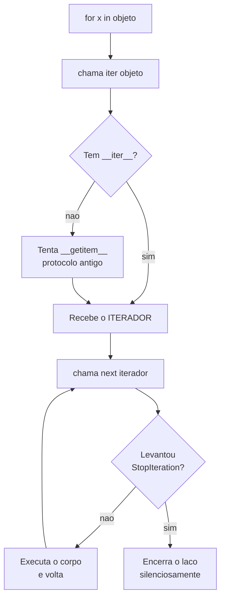

# 04.05 — Iteráveis e iteradores

> **Módulo 04 — Python Avançado** · Nível: N2 · Tempo estimado: 2h30 · Código: `codigo/cap05/`

## 1. Objetivo

- **Explicar** o protocolo que faz o `for` funcionar, em três chamadas.
- **Distinguir** iterável de iterador — a distinção que resolve metade dos bugs de coleção.
- **Prever** quais objetos esgotam e quais não.
- **Implementar** uma classe que o `for` percorre.

Ao final, você sabe exatamente por que `map` esgota, por que `range` não, e por que ler um arquivo duas vezes devolve vazio na segunda.

---

## 2. Pré-requisitos

- [04.02 — Funções como valores](02-funcoes-como-valores.md) — **este capítulo responde a pergunta que ele deixou**: por que `map` esgota.
- [01.11 — `for` e `range`](../01-Python/11-laco-for-e-range.md) — você usa o `for` desde lá sem saber como ele funciona.
- [01.21 — Exceções](../01-Python/21-excecoes.md) — `StopIteration` é uma exceção usada como sinal de controle.

**Autoteste:** (1) O que o `for` faz com uma lista, passo a passo? (2) Por que `for` funciona em lista, dicionário e arquivo, que são coisas tão diferentes? (3) O que acontece ao ler um arquivo duas vezes com o mesmo objeto aberto?

---

## 3. Motivação

O `for` funciona em lista, tupla, string, dicionário, conjunto, arquivo, `range`, `map`, `zip`, resultado de consulta SQL e resposta de API. Objetos sem nada em comum na implementação.

Isso só é possível porque o `for` não conhece nenhum deles. Ele conhece um **protocolo** — um contrato de três chamadas —, e qualquer objeto que o cumpra é percorrível, inclusive os que você escrever.

E há uma consequência prática que o 04.02 deixou pendente:

```python
resultado = map(str.upper, ["a", "b"])
list(resultado)     # ['A', 'B']
list(resultado)     # []          <<< sem erro, sem aviso
```

A segunda leitura devolve vazio. Nenhuma exceção. Um relatório que percorre esse objeto duas vezes sai pela metade — e ninguém é avisado.

Este capítulo explica por quê, e a explicação é uma distinção só.

---

## 4. Modelo mental

Duas palavras parecidas, e confundi-las é a origem de tudo:

| | **Iterável** | **Iterador** |
|---|---|---|
| É | uma **coleção** percorrível | uma **posição** numa sequência |
| Tem | `__iter__` | `__iter__` **e** `__next__` |
| `iter()` devolve | um iterador **novo** | **ele mesmo** |
| Percorrer duas vezes | funciona | a segunda vem vazia |
| Exemplos | lista, dict, str, `range`, arquivo aberto* | `map`, `filter`, `zip`, `enumerate`, gerador |

**A analogia mais direta:** o iterável é o **livro**; o iterador é o **marcador de página**. Você pode ter dois marcadores no mesmo livro, em páginas diferentes. Um marcador que chegou ao fim não volta sozinho — e é isso que "esgotar" significa.

E o `for` faz exatamente três coisas:

1. chama `iter(objeto)` para obter um iterador;
2. chama `next(iterador)` repetidamente;
3. para quando vier `StopIteration`.

Nada mais. Depois de saber isso, `for` deixa de ser sintaxe e vira uma chamada de protocolo.

---

## 5. Analogia

Uma **playlist** e a **agulha do toca-discos**.

A playlist é o iterável: uma coleção de músicas, que existe independentemente de alguém estar ouvindo. A agulha é o iterador: ela está **numa posição**, e avança.

Duas pessoas podem ouvir a mesma playlist ao mesmo tempo, cada uma com sua agulha, em pontos diferentes — é o `iter(lista) is iter(lista)` devolvendo `False`. Cada `for` pede uma agulha nova.

Um **iterador**, por outro lado, é a agulha já em movimento. Entregá-la a outra pessoa não reinicia o disco: ela continua de onde estava. E quando chega ao fim, chegou — pedir mais música devolve silêncio, não o começo.

`map` é uma agulha. Lista é um disco.

---

## 6. Teoria

### 6.1 O `for` desmontado

```python
lista = [10, 20, 30]
iterador = iter(lista)
next(iterador)        # 10
next(iterador)        # 20
next(iterador)        # 30
next(iterador)        # StopIteration
```

```
iter(lista) -> list_iterator
next: 10 20 30
4º next -> StopIteration  (o `for` para AQUI)
```

Este trecho **é** o `for`. A única diferença é que o `for` captura o `StopIteration` e encerra o laço silenciosamente, em vez de deixar a exceção subir.

Repare no tipo: `iter([10,20,30])` devolve um `list_iterator`, que é um objeto **diferente** da lista. A lista não sabe em que posição você está — quem sabe é o iterador.

**`StopIteration` é uma exceção usada como sinal de controle**, não como erro. É incomum e deliberado: sinaliza fim sem exigir um valor sentinela que poderia colidir com um dado real. É o mesmo raciocínio do `None` como sentinela do 04.01, com a vantagem de não haver valor algum que possa ser confundido.

### 6.2 A distinção, testada

```
lista    __iter__:True  __next__:False
iterador __iter__:True  __next__:True
iter(iterador) is iterador: True
iter(lista) is iter(lista): False  <- cria um NOVO a cada vez
```

Quatro linhas que contêm o capítulo.

**Uma lista tem `__iter__` mas não `__next__`.** Ela sabe produzir um percorredor, mas não sabe percorrer a si mesma — não guarda posição.

**Um iterador tem os dois**, e o `__iter__` dele devolve **ele mesmo**. Isso não é curiosidade: é o que permite escrever `for x in iterador` sem tratamento especial. O `for` sempre chama `iter()` primeiro; num iterador, essa chamada é inofensiva.

**`iter(lista) is iter(lista)` é `False`** — cada chamada cria um percorredor independente. É por isso que dois `for` aninhados sobre a mesma lista funcionam.

### 6.3 A resposta ao 04.02

```
map tem __next__? True -> é um ITERADOR, não uma coleção
list(resultado): ['A', 'B']
list(resultado): [] <<< vazio
```

`map`, `filter`, `zip` e `enumerate` são **iteradores**. Consumi-los é gastá-los.

```
zip:       [(1, 3), (2, 4)]  ·  []
enumerate: [(0, 'a')]        ·  []
```

**Por que a linguagem faz isso?** Porque um iterador não precisa que os dados existam todos ao mesmo tempo. `map(f, arquivo_de_10gb)` funciona; uma lista com o resultado, não. É preguiça deliberada — o assunto do 04.06.

**E o caso que mais causa dano na prática:**

```python
f = open("dados.txt")
[l for l in f]     # ['l1', 'l2']
[l for l in f]     # []
```

**Um arquivo aberto é um iterador.** Percorrê-lo duas vezes devolve vazio na segunda, e o programa não reclama. É a fonte mais comum de "meu relatório saiu com metade dos dados".

### 6.4 `range` é a exceção instrutiva

```
range tem __next__? False
list: [0, 1, 2] · de novo: [0, 1, 2]
```

`range` **não** é um iterador — é um **iterável**. Ele não guarda posição; guarda início, fim e passo, e produz um iterador novo a cada `for`.

Isso o torna reutilizável, indexável (`range(10)[3]`) e barato: `range(10**9)` ocupa alguns bytes, porque não materializa nada.

**A lição geral:** "preguiçoso" e "esgota" são propriedades **independentes**. `range` é preguiçoso e não esgota; `map` é preguiçoso e esgota; uma lista não é preguiçosa e não esgota. Quem trata as duas como sinônimos erra em `range`.

⚠️ **Caixa-preta 1:** escrever um iterador como classe exige duas classes ou muito cuidado (§6.6). Existe uma forma de obter o mesmo com **uma função e uma palavra-chave** — `yield` —, e é o [04.06](06-geradores-e-yield.md).

### 6.5 Escrevendo um iterável

```python
class Baralho:
    def __init__(self, cartas):
        self._cartas = list(cartas)

    def __iter__(self):
        return IteradorDeBaralho(self._cartas)     # um NOVO a cada chamada

    def __len__(self):
        return len(self._cartas)


class IteradorDeBaralho:
    def __init__(self, cartas):
        self._cartas = cartas
        self._posicao = 0

    def __iter__(self):
        return self

    def __next__(self):
        if self._posicao >= len(self._cartas):
            raise StopIteration
        carta = self._cartas[self._posicao]
        self._posicao += 1
        return carta
```

```
1ª passada: ['A♠', 'K♥', 'Q♦']
2ª passada: ['A♠', 'K♥', 'Q♦'] <- funciona de novo
dois iteradores ao mesmo tempo: A♠ A♠ K♥
```

A última linha é a que prova o projeto: dois iteradores independentes sobre o mesmo baralho, avançando separadamente.

### 6.6 O erro de juntar os dois

A tentação é economizar uma classe:

```python
class BaralhoRuim:
    def __init__(self, cartas):
        self._cartas = list(cartas)
        self._posicao = 0          # a posição no PRÓPRIO objeto

    def __iter__(self):
        return self                # devolve a si mesmo

    def __next__(self):
        ...
```

Funciona na primeira passada e falha em tudo depois: o segundo `for` vem vazio, e dois `for` aninhados sobre o mesmo objeto se interferem — o interno consome o que o externo ia visitar.

**A regra que evita isso: o iterável guarda os DADOS; o iterador guarda a POSIÇÃO.** Quando os dois são o mesmo objeto, você construiu um `map`, não uma coleção — o que às vezes é exatamente o que se quer, e nunca por acidente.

⚠️ **Caixa-preta 2:** `for` não é o único que usa o protocolo. `list()`, `sum()`, `max()`, `in`, desempacotamento (`a, b = par`) e compreensões chamam `iter()` internamente. Escrever `__iter__` numa classe a torna compatível com **todos** de uma vez — e é uma amostra do que os métodos especiais fazem, no [04.12](12-metodos-especiais.md).

---

## 7. Funcionamento interno

O `for` compila para uma sequência de instruções (`GET_ITER`, `FOR_ITER`) que chamam `iter()` uma vez e `next()` em laço. `FOR_ITER` trata o `StopIteration` sem propagá-lo — daí o laço terminar em vez de estourar.

`iter(obj)` procura `type(obj).__iter__`. Se não houver, tenta o **protocolo antigo de sequência**: se o objeto tiver `__getitem__`, o Python cria um iterador que chama `obj[0]`, `obj[1]`… até `IndexError`. É por isso que classes antigas com só `__getitem__` funcionam em `for` — um detalhe histórico que explica código que de outro modo pareceria mágico.

Um `list_iterator` guarda uma referência à lista e um índice. Consequência: **modificar uma lista durante a iteração produz comportamento surpreendente** — remover itens faz o índice pular elementos, e o Python não impede.

---

## 8. Visualização do fluxo



**Como ler:** o ciclo `F → G → H → F` é o laço inteiro. A caixa `I` é o detalhe que faz o `for` parecer mágica: o `StopIteration` é uma **exceção** capturada ali, e é por isso que ela nunca aparece no seu código. E a caixa `E` é onde a distinção do capítulo mora — se `objeto` já for um iterador, `iter()` devolve ele mesmo, e a posição vem de onde parou.

---

## 9. Aplicação prática

**A dor da Aurora.** Um script processa o arquivo de vendas e precisa de duas informações: o total e a média. A versão que existe:

```python
def analisar(caminho):
    with open(caminho) as arquivo:
        linhas = (l.strip() for l in arquivo if l.strip())
        total = sum(float(l.split(",")[2]) for l in linhas)
        quantidade = sum(1 for l in linhas)          # <<< sempre 0
    return total, total / quantidade                  # ZeroDivisionError
```

O erro é `ZeroDivisionError`, e ele aparece na **última** linha — longe da causa.

**O diagnóstico:** `linhas` é um gerador (um iterador). O primeiro `sum` o consome inteiro; o segundo encontra um iterador esgotado e conta zero. Nenhum aviso.

**As três correções, e cada uma tem um custo:**

```python
# (a) materializar — simples, e carrega tudo na memória
linhas = [l.strip() for l in arquivo if l.strip()]

# (b) uma passada só — mais rápido, e menos legível
total = quantidade = 0
for linha in arquivo:
    if linha.strip():
        total += float(linha.split(",")[2])
        quantidade += 1

# (c) reabrir — duas leituras de disco
```

**Qual escolher.** Para um arquivo de alguns MB, **(a)**: a memória é irrelevante e o código fica claro. Para um arquivo de gigabytes, **(b)**: é a única que não carrega tudo. **(c)** quase nunca — pagar duas leituras de disco para economizar linhas de código é uma troca ruim.

**A lição que fica.** O erro não foi usar gerador; foi **percorrer duas vezes** algo que só permite uma. A pergunta a fazer diante de qualquer coleção intermediária: *quantas vezes vou percorrer isto?* Se for mais de uma, materialize — ou reestruture para uma passada.

E o sintoma vale memorizar, porque ele é sempre o mesmo: **zero, vazio, ou uma média que dá erro de divisão.** Quando aparecer, procure a segunda passada.

---

## 10. Código comentado

`codigo/cap05/iteracao.py` roda as seis cenas. Três merecem comentário.

**A cena [2] imprime `hasattr` dos dois objetos**, e é a demonstração mais compacta do capítulo: quatro booleanos que separam iterável de iterador. Vale rodar antes de ler a teoria.

**A cena [5] existe para quebrar uma generalização.** Depois de ver `map`, `zip` e `enumerate` esgotarem, é natural concluir "tudo que é preguiçoso esgota". `range` desmente — e sem esse contraexemplo, o modelo mental fica errado de um jeito que só aparece meses depois.

**A cena [6] termina criando dois iteradores simultâneos** sobre o mesmo baralho e intercalando `next`. É o teste que a implementação errada (§6.6) não passa, e é a razão de existirem duas classes em vez de uma.

---

## 11. Erros comuns

**1. Percorrer um iterador duas vezes.** A segunda vem vazia, sem erro.
→ `list(...)` se for reutilizar.

**2. Achar que um arquivo aberto é uma coleção.** É iterador.
→ `linhas = arquivo.readlines()` ou uma passada só.

**3. Juntar iterável e iterador na mesma classe.** Só funciona uma vez.
→ Dados numa, posição noutra.

**4. Esquecer `raise StopIteration`.** Laço infinito.
→ É a única forma de sinalizar o fim.

**5. Achar que preguiçoso implica esgotável.** `range` é preguiçoso e reutilizável.
→ São propriedades independentes.

**6. Modificar a coleção durante a iteração.** Índices pulam elementos.
→ Itere sobre uma cópia, ou construa uma lista nova.

**7. `len()` num iterador.** `TypeError` — ele não sabe quantos faltam.
→ `sum(1 for _ in it)`, que o **consome**.

---

## 12. Boas práticas

- **Pergunte quantas vezes vai percorrer** antes de escolher entre iterador e lista.
- **Materialize com intenção**, não por hábito: `list()` explícito onde for reutilizar.
- **Duas classes** ao escrever um iterável — dados e posição separados.
- **`__iter__` numa classe** a torna compatível com `for`, `list`, `sum`, `in` e compreensões de uma vez.
- **Nunca modifique a coleção** durante a iteração.
- **Desconfie de resultado zero ou vazio** vindo de uma segunda passada.
- **`itertools.tee`** quando precisar mesmo de duas passadas sobre um iterador — e saiba que ele bufferiza.

---

## 13. Performance

Um iterador ocupa memória constante, independentemente do tamanho da fonte. `range(10**9)` ocupa dezenas de bytes; a lista equivalente ocupa dezenas de gigabytes.

O custo é uma chamada de método por elemento, o que torna a iteração um pouco mais lenta que indexar uma lista já materializada. A troca compensa quase sempre — e deixa de compensar quando você percorre várias vezes, porque aí paga a produção repetidamente.

**A regra prática:** uma passada sobre dados grandes, iterador. Muitas passadas sobre dados que cabem na memória, lista. E `itertools.tee` para duas passadas sobre uma fonte que não se pode reabrir — lembrando que ele guarda em memória tudo que uma cópia já consumiu e a outra não, o que pode anular a economia.

---

## 14. Mercado

O protocolo de iteração é o que torna o Python uniforme: aprender `for` uma vez serve para tudo. Bibliotecas se aproveitam disso — cursores de banco de dados, respostas paginadas de API e leitores de arquivo grandes são iteradores, e por isso funcionam com `for`, `list`, compreensões e `itertools` sem código de adaptação.

Em engenharia de dados, a escolha entre iterador e lista é uma decisão de arquitetura: processar um arquivo de 50 GB linha a linha é possível num laptop; carregá-lo não é. É o mesmo raciocínio que separa processamento em *streaming* de processamento em lote, e o vocabulário aparece de novo no módulo 10.

O erro de percorrer duas vezes é frequente o suficiente para ter nome informal ("consumed iterator bug") e para aparecer em revisão de código — a pergunta "isso é percorrido mais de uma vez?" é padrão em revisão de pipeline de dados.

---

## 15. Entrevistas

- **"Qual a diferença entre iterável e iterador?"** Iterável tem `__iter__`; iterador tem `__iter__` **e** `__next__`, e o `__iter__` dele devolve ele mesmo. A resposta forte cita que `iter(lista) is iter(lista)` é `False`.
- **"O que o `for` faz por baixo?"** `iter()`, `next()` em laço, `StopIteration` para parar. Se você escrever as três linhas, respondeu.
- **"Por que `map` esgota e `range` não?"** `map` é iterador (tem `__next__`); `range` é iterável. Preguiça e esgotamento são independentes.
- **"Como escrever uma classe percorrível?"** `__iter__` devolvendo um iterador novo. E mencionar por que não devolver `self`.
- **"Como contar elementos de um iterador?"** `sum(1 for _ in it)` — e avisar que isso o **consome**.

---

## 16. Exercícios guiados

Em [`exercicios/cap05.md`](exercicios/cap05.md):

- **A1** `[~10 min · esgota ou não?]` — 8 objetos para classificar.
- **A2** `[~10 min · prevê a saída]` — 6 trechos com segunda passada.
- **A3** `[~10 min · o `for` à mão]` — 5 laços reescritos com `iter`/`next`.
- **A4** `[~10 min · ache o erro]` — 6 iteradores defeituosos.
- **AP1** `[~20 min · o iterável]` — Uma classe percorrível, com o teste dos dois iteradores.
- **AP2** `[~25 min · o bug do relatório]` — Reproduza e corrija das três formas.
- **AP3** `[~20 min · itertools]` — `tee`, `islice`, `chain` e o custo de cada um.
- **D1** `[~45 min · o leitor de blocos]` — **Um iterável sobre arquivo grande.**

---

## 17. Desafios

**D1 — O leitor de blocos.** Escreva uma classe `Blocos(caminho, tamanho)` que permita:

```python
for bloco in Blocos("vendas.csv", tamanho=100):
    processar(bloco)          # bloco é uma lista de até 100 linhas
```

Requisitos: percorrível **mais de uma vez** (reabre o arquivo a cada `__iter__`); nunca carrega o arquivo inteiro na memória; o último bloco pode ser menor; suporta `len()` **só se** o arquivo já tiver sido percorrido uma vez — e se não, levanta erro explicando por quê.

**As duas perguntas do fecho:** (1) por que `__len__` é um problema aqui, e o que a biblioteca padrão faz em situações assim? (2) Como você testaria que a memória não cresce, sem um arquivo gigante?

---

## 18. Mini projeto

**O pipeline preguiçoso da Aurora.** Reescreva o processamento de vendas do módulo 01 usando **só** iteradores, do arquivo ao resultado: ler → limpar → converter → filtrar → agregar.

Requisitos: nenhuma lista intermediária; funciona num arquivo maior que a memória; **meça** o pico de memória com `tracemalloc` nas duas versões (com e sem materialização); e documente o ponto exato em que a materialização vira obrigatória — a agregação final.

E a pergunta que fecha: se a agregação precisa de tudo em memória de qualquer forma, o que a preguiça economizou?

---

## 19. Revisão

**Resumo em 5 frases.** O `for` faz três coisas: chama `iter()`, chama `next()` em laço, e para no `StopIteration` — que é uma exceção usada como sinal de controle. Um **iterável** tem `__iter__` e produz um percorredor novo a cada chamada; um **iterador** tem `__iter__` **e** `__next__`, guarda posição, e o `__iter__` dele devolve ele mesmo. `map`, `filter`, `zip`, `enumerate`, geradores e **arquivos abertos** são iteradores, e por isso esgotam: a segunda passada devolve vazio, sem erro nenhum. `range` é o contraexemplo que impede a generalização errada — preguiçoso e **não** esgotável, porque preguiça e esgotamento são propriedades independentes. E ao escrever um iterável, os dados moram numa classe e a posição noutra: juntá-los produz algo que só funciona uma vez.

**Flashcards** (também em [`revisao/flashcards.md`](revisao/flashcards.md)):

| ID | Frente | Verso |
|---|---|---|
| 04.05-F1 | O que o `for` faz por baixo, em três passos? | `iter(objeto)` → `next(iterador)` em laço → captura `StopIteration` e encerra. O `for` não conhece listas: conhece o **protocolo**. |
| 04.05-F2 | Explique com suas palavras a diferença entre iterável e iterador. | (Elaboração) Iterável é a **coleção** (só `__iter__`, produz um percorredor novo a cada chamada); iterador é a **posição** (`__iter__` + `__next__`, e o `__iter__` devolve ele mesmo). `iter(lista) is iter(lista)` é **False**. |
| 04.05-F3 | Preveja: `f = open(...)` e duas compreensões sobre `f`. | (Previsão) A primeira traz as linhas; a segunda vem **vazia**, sem erro. Arquivo aberto é **iterador**. É a causa mais comum de "o relatório saiu com metade dos dados". |
| 04.05-F4 | `map` esgota e `range` não. Por quê? | `map` tem `__next__` (é iterador); `range` não tem (é iterável, e cria um iterador novo a cada `for`). **Preguiça e esgotamento são independentes** — `range(10**9)` é preguiçoso e reutilizável. |
| 04.05-F5 | Ao escrever uma classe percorrível, por que duas classes? | (Decisão) O iterável guarda os **dados**; o iterador guarda a **posição**. Juntando os dois, o segundo `for` vem vazio e dois laços aninhados se interferem — você construiu um `map`, não uma coleção. |

**Revisão espaçada:** D+1 refaça A1 e A2 · D+7 o AP1 (com o teste dos dois iteradores simultâneos) · D+30 escreva o `for` à mão, de memória.

---

## 20. Checklist

- [ ] Escrevi o `for` à mão com `iter`, `next` e `StopIteration`.
- [ ] Sei distinguir iterável de iterador por `hasattr`.
- [ ] Sei por que `iter(lista) is iter(lista)` é `False`.
- [ ] Sei que arquivo aberto, `map`, `zip` e `enumerate` esgotam.
- [ ] Sei que `range` **não** esgota, e por quê.
- [ ] Escrevi uma classe percorrível com duas classes.
- [ ] Testei dois iteradores simultâneos sobre a mesma coleção.
- [ ] Reproduzi o bug da segunda passada e sei o sintoma (zero, vazio, divisão por zero).
- [ ] Sei quando materializar e quando fazer uma passada só.

---

## 21. Próximo capítulo

[04.06 — Geradores e `yield`](06-geradores-e-yield.md). Escrever um iterador exigiu duas classes e vinte linhas. O próximo capítulo faz o mesmo com **uma função e uma palavra-chave** — e a função ganha algo que nenhuma outra tem: ela **pausa** no meio da execução, devolve um valor, e continua exatamente de onde parou quando alguém pedir o próximo.
