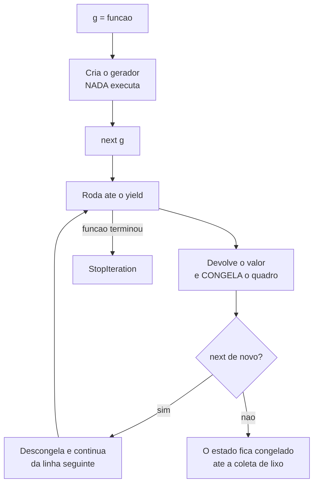

# 04.06 — Geradores e `yield`

> **Módulo 04 — Python Avançado** · Nível: N2 · Tempo estimado: 2h30 · Código: `codigo/cap06/`

## 1. Objetivo

- **Explicar** o que `yield` faz — a função **pausa** e retoma de onde parou.
- **Implementar** produção preguiçosa para processar dados maiores que a memória.
- **Justificar** a escolha entre gerador e lista medindo, e não por hábito.
- **Compor** pipelines de transformação sem listas intermediárias.

Ao final, você escreve em quatro linhas o que o 04.05 exigiu vinte — e processa um arquivo de 50 GB num laptop.

---

## 2. Pré-requisitos

- [04.05 — Iteráveis e iteradores](05-iteraveis-e-iteradores.md) — **obrigatório**: um gerador é um iterador, e o capítulo anterior explica o que isso implica.
- [01.17 — Compreensões](../01-Python/17-compreensoes.md) — a expressão geradora é uma compreensão com parênteses.
- [04.03 — Closures](03-closures-e-fabricas.md) — o gerador guarda estado entre chamadas, como uma closure com `nonlocal`.

**Autoteste:** (1) O que acontece ao percorrer um iterador duas vezes? (2) Quantas classes o Baralho do 04.05 exigiu? (3) Quanta memória ocupa uma lista com um milhão de inteiros?

---

## 3. Motivação

O capítulo anterior terminou com vinte linhas e duas classes para percorrer três cartas. Este capítulo faz o mesmo assim:

```python
class Baralho:
    def __init__(self, cartas):
        self._cartas = list(cartas)

    def __iter__(self):
        for carta in self._cartas:
            yield carta
```

Quatro linhas, uma classe — e as duas propriedades que as duas classes garantiam continuam lá: percorrível várias vezes, e com iteradores independentes.

Mas a economia de código não é o motivo real de geradores existirem. Este é:

```
lista:      40.32 MB
gerador:   0.0007 MB
razão: 56626x menos memória
```

Um milhão de quadrados, somados. O mesmo resultado, com cinquenta e seis mil vezes menos memória — porque o gerador nunca guarda mais de um valor por vez.

É a diferença entre processar um arquivo de 50 GB num laptop e não processar.

---

## 4. Modelo mental

Uma função normal **calcula tudo e devolve**. Um gerador **produz um valor e pausa**, guardando exatamente onde parou — variáveis locais, posição no laço, tudo.

```python
def contar():
    print("(entrou)")
    yield 1
    print("(retomou)")
    yield 2
```

```
chamou a função -> tipo: generator
>>> nenhum print apareceu: nada executou ainda
      (entrou)
next -> 1
      (retomou)
next -> 2
```

**Duas observações que organizam o capítulo.**

**Chamar a função não executa nada.** `contar()` devolve um objeto gerador; o corpo só começa a rodar no primeiro `next()`. Se você espera que a validação de argumentos aconteça na chamada, ela não acontece — é a armadilha da §6.6.

**O `yield` não termina a função.** `return` encerra e descarta o estado; `yield` **suspende** e o preserva. É a única construção do Python em que uma função tem "meio de execução" persistente.

| | `return` | `yield` |
|---|---|---|
| Efeito | encerra | **suspende** |
| Estado local | descartado | **preservado** |
| Pode acontecer | uma vez | muitas |
| A função devolve | o valor | um **gerador** |

---

## 5. Analogia

Uma função normal é o **cozinheiro que prepara o banquete inteiro** e chama à mesa. Se são mil pratos, a cozinha precisa de espaço para mil pratos — mesmo que você coma um de cada vez.

Um gerador é o **cozinheiro do balcão de sushi**: prepara uma peça, entrega, e **para** — de faca na mão, no meio do preparo. Quando você pede a próxima, ele retoma exatamente de onde estava.

A analogia acerta em três pontos que importam. O balcão precisa de espaço para **uma** peça, não mil. Você pode parar de pedir a qualquer momento, e o resto nunca é preparado. E o cardápio pode ser **infinito** — o cozinheiro não precisa saber quantas peças você vai querer, porque nunca prepara adiantado.

E acerta no defeito, também: **você não pode voltar** para a peça anterior nem pedir a mesma duas vezes. É o esgotamento do 04.05.

---

## 6. Teoria

### 6.1 Um gerador é um iterador

```
__iter__:True · __next__:True · iter(g) is g:True
```

Os três testes do 04.05, satisfeitos sem escrever uma linha de classe. Isso significa que tudo que vale para iteradores vale para geradores:

- funciona em `for`, `list()`, `sum()`, `in`, compreensões;
- **esgota** — segunda passada vem vazia, sem erro;
- não tem `len()`;
- ocupa memória constante.

**O `yield` é uma forma de escrever `__next__` sem escrever `__next__`.** O Python transforma a função num objeto que guarda o ponto de suspensão, e cada `next()` retoma dali até o `yield` seguinte. Chegando ao fim da função, ele levanta `StopIteration` sozinho.

### 6.2 Expressão geradora

Igual a uma compreensão, com parênteses no lugar dos colchetes:

```python
quadrados_lista   = [x * x for x in range(1_000_000)]     # 40 MB
quadrados_gerador = (x * x for x in range(1_000_000))     # ~0 MB
```

E quando é o único argumento, os parênteses são dispensáveis:

```python
sum(x * x for x in range(1_000_000))
```

**A regra prática:** se o resultado vai ser consumido **uma vez** e passado adiante, use parênteses. Se vai ser percorrido mais de uma vez, indexado ou medido com `len()`, use colchetes.

### 6.3 A medição

```
lista:      40.32 MB
gerador:   0.0007 MB
mesmo resultado? True
```

O gerador ocupa menos de um kilobyte porque guarda apenas o estado da função suspensa: a variável do laço e o ponto de retomada. A lista guarda um milhão de objetos inteiros.

**A ressalva honesta que o número esconde:** o gerador custa uma retomada de quadro por valor. Somar uma lista **já pronta** é 4,4x mais rápido que somar um gerador sobre ela — medido na §13. Num **pipeline**, porém, a conta se inverte, porque não há listas intermediárias para alocar. **A troca não se resume a "memória por tempo"**: é memória por tempo numa passada única, e memória **e** tempo num pipeline de poucas etapas. A §13 traz os dois números.

### 6.4 Sequências infinitas

```python
def naturais():
    numero = 0
    while True:
        yield numero
        numero += 1
```

```
primeiros 5: [0, 1, 2, 3, 4]
primeiros 4 pares: [0, 2, 4, 6]
```

Um `while True` que não trava, porque ninguém pediu tudo. Isso é possível **só** porque nada é materializado — e é o argumento mais forte a favor de preguiça: certos problemas não têm versão materializada.

O cuidado que vem junto: `list(naturais())` trava o programa até acabar a memória. Geradores infinitos só se consomem com `islice`, `takewhile`, `zip` com algo finito, ou um `break`.

### 6.5 `yield from` e pipelines

```python
def cabecalho_e_corpo(linhas):
    yield "=== RELATÓRIO ==="
    yield from numerar(limpar(linhas))
    yield "=== FIM ==="
```

```
=== RELATÓRIO ===
001 venda 1
002 venda 2
003 venda 3
=== FIM ===
```

`yield from x` delega a outro iterável — é açúcar para `for item in x: yield item`, e o valor está na legibilidade e em recursão sobre estruturas aninhadas.

**O que a saída esconde e importa:** `numerar(limpar(linhas))` **não** cria listas intermediárias. Cada linha atravessa as duas etapas e chega ao `print`, uma por vez. Um pipeline de cinco etapas sobre um arquivo de 10 GB ocupa a memória de **uma linha**.

**A ordem de execução é o contrário do que a leitura sugere:** o `print` puxa de `cabecalho_e_corpo`, que puxa de `numerar`, que puxa de `limpar`, que puxa do arquivo. Os dados são **puxados**, não empurrados — e reconhecer isso muda como se depura um pipeline.

⚠️ **Caixa-preta 1:** geradores também **recebem** valores, com `valor = yield` e o método `.send()`. É a base das corrotinas, e o caminho histórico que levou ao `async`/`await` do [04.22](22-asyncio-fundamentos.md).

### 6.6 As três armadilhas

**A validação que não acontece.** Nada roda até o primeiro `next()`:

```python
def ler(caminho):
    if not os.path.exists(caminho):
        raise FileNotFoundError(caminho)     # NÃO dispara na chamada
    with open(caminho) as f:
        yield from f

g = ler("inexistente.txt")     # nenhum erro aqui
list(g)                        # o erro aparece AQUI
```

O erro chega longe da chamada, e quem escreveu `try/except` em volta de `ler(...)` não pega nada. **A correção:** uma função normal que valida e devolve o gerador de uma função interna.

**O `return` num gerador não devolve valor.** Ele encerra — e o valor, se houver, vira o argumento do `StopIteration`, invisível para o `for`.

**O esgotamento, de novo.** Um gerador percorrido duas vezes devolve vazio na segunda. É o bug do 04.05 §9, e geradores o tornam mais comum, porque são mais fáceis de criar.

⚠️ **Caixa-preta 2:** um gerador interrompido no meio pode nunca chegar ao `finally` que fecha um arquivo. O Python chama `.close()` na coleta de lixo, mas o momento não é garantido. Quem cuida disso é o `with` — e escrever o seu é o [04.20](20-context-managers.md).

---

## 7. Funcionamento interno

Uma função com `yield` no corpo é compilada de forma diferente: o Python marca o objeto de código com uma flag de gerador, e chamar a função cria um objeto que guarda o quadro de execução (`gi_frame`) — variáveis locais e ponteiro de instrução.

`next()` reinstala esse quadro e continua até o `yield` seguinte, quando o quadro é congelado de novo. É por isso que o estado local sobrevive: ele nunca foi desmontado.

`gi_frame.f_lasti` mostra a instrução em que o gerador parou, e `gi_frame.f_locals` mostra as variáveis. Como no 04.03 com `cell_contents`, não há mágica — há um objeto inspecionável.

---

## 8. Visualização do fluxo



**Como ler:** a caixa `B` é a armadilha da §6.6 — chamar a função não executa nada. E a caixa `H` é a que o 04.20 vai resolver: um gerador abandonado no meio fica com o quadro congelado, e o `finally` que fecharia um arquivo pode demorar a rodar.

---

## 9. Aplicação prática

**A dor da Aurora.** O arquivo de vendas do ano tem 8 GB. O script atual:

```python
def processar(caminho):
    linhas = open(caminho).readlines()          # 8 GB na memória
    limpas = [l.strip() for l in linhas if l.strip()]
    vendas = [converter(l) for l in limpas]
    validas = [v for v in vendas if v.valor > 0]
    return sum(v.valor for v in validas)
```

Ele funciona com o arquivo de teste de 5 MB e mata o processo com o real. **Quatro listas completas**, cada uma do tamanho do arquivo.

**A versão em pipeline:**

```python
def processar(caminho):
    with open(caminho) as arquivo:
        limpas  = (l.strip() for l in arquivo if l.strip())
        vendas  = (converter(l) for l in limpas)
        validas = (v for v in vendas if v.valor > 0)
        return sum(v.valor for v in validas)
```

**Três caracteres de diferença por linha** — colchete vira parêntese — e o pico de memória passa de 8 GB para o tamanho de uma linha.

**O `with` não é detalhe.** Sem ele, o arquivo fica aberto até a coleta de lixo, e num pipeline abandonado no meio isso pode demorar. É a caixa-preta 2, e o motivo de o `with` estar aqui e não ser opcional.

**A ressalva, e ela é a mesma de sempre.** Se o resultado precisar ser percorrido **duas** vezes — total e média, por exemplo —, o pipeline preguiçoso quebra em silêncio, com o `ZeroDivisionError` do 04.05 §9. As saídas: uma passada que acumula os dois valores, ou materializar a última etapa se ela couber.

**E a ressalva menos citada:** depurar um pipeline preguiçoso é mais difícil. Um `print` no meio não roda até alguém consumir, o traceback atravessa várias funções geradoras, e inspecionar um valor intermediário exige consumir o pipeline — o que o esgota. **Ganhar memória custa observabilidade**, e vale saber disso antes de converter tudo por hábito.

---

## 10. Código comentado

`codigo/cap06/geradores.py` roda as seis cenas. Três valem comentário.

**A cena [1] põe `print` entre os `yield`.** É a única forma de ver o que ninguém vê: a função entrando, parando, e retomando na linha seguinte. Rode antes de ler a teoria — a saída ensina mais que a explicação.

**A cena [3] é o 04.05 refeito.** Ter as duas versões nos dois capítulos permite comparar linha a linha, e o teste dos dois iteradores simultâneos continua passando — que é o que prova que a redução de vinte para quatro linhas não perdeu nada.

**A cena [4] mede com `tracemalloc` e confere o resultado.** O `mesmo resultado? True` está lá de propósito: sem ele, um leitor cético poderia supor que o gerador economizou memória fazendo menos trabalho.

---

## 11. Erros comuns

**1. Esperar que a função valide na chamada.** Nada roda até o primeiro `next()`.
→ Função normal que valida e devolve o gerador interno.

**2. Percorrer o gerador duas vezes.** Vazio na segunda, sem erro.
→ `list()` se for reutilizar.

**3. `len()` num gerador.** `TypeError`.
→ `sum(1 for _ in g)`, que o **consome**.

**4. `list()` num gerador infinito.** Trava até acabar a memória.
→ `islice`, `takewhile`, ou `break`.

**5. Usar gerador para dados pequenos percorridos várias vezes.** Mais lento e menos prático.
→ Lista.

**6. Esperar que `return valor` num gerador devolva algo ao `for`.** Vira argumento do `StopIteration`.

**7. Esquecer o `with` ao gerar linhas de arquivo.** O arquivo fica aberto indefinidamente.

**8. Converter tudo em gerador por hábito.** Perde-se observabilidade.

---

## 12. Boas práticas

- **Gerador quando os dados são grandes ou percorridos uma vez.** Lista quando cabem e serão reusados.
- **Expressão geradora quando é argumento único:** `sum(x for x in dados)`.
- **`with` sempre** que o gerador abrir recurso.
- **Valide fora do gerador**, numa função normal que o devolve.
- **`yield from`** para delegar, em vez do laço manual.
- **Nomeie cada etapa do pipeline** — o traceback atravessa todas.
- **Documente que a função devolve um gerador**; a assinatura não diz.
- **Materialize a etapa que precisa ser percorrida duas vezes** — e escreva o porquê.

---

## 13. Performance

A memória é sempre menor. O **tempo** depende, e o resultado contraria a intuição nas duas direções — vale medir antes de decidir.

**Percorrer uma coleção já pronta: o gerador perde, e perde feio.**

```
sum(lista)              8,8 ms
sum(x for x in lista)  38,4 ms      <- 4,4x mais lento
```

`sum(lista)` percorre em C; acrescentar `x for x in` insere um quadro Python por elemento. **Envolver uma lista existente numa expressão geradora é puro custo** — não economiza memória (a lista já existe) e multiplica o tempo por quatro.

**Pipeline de várias etapas: a conta se inverte, porque não há listas intermediárias.**

```
1 etapa:  listas 17,8 ms · geradores 17,1 ms
2 etapas: listas 41,5 ms · geradores 27,0 ms   <- geradores ganham
4 etapas: listas 49,8 ms · geradores 51,3 ms   <- empate
```

Com duas etapas, o gerador é mais rápido: o custo por elemento é menor que o de alocar uma lista de 200 mil itens. Com quatro, o custo por elemento acumula e empata. **Não há regra simples** — há um cruzamento que depende do número de etapas, do tamanho dos dados e do custo de cada transformação.

**O que decide na prática:** quando há I/O envolvido — ler arquivo, consultar banco —, ele domina tudo e a diferença entre as duas versões some. No pipeline de 100 mil linhas do AP1, geradores levaram 281 ms contra 431 ms, mas boa parte disso é alocação, não iteração.

**As duas regras que sobrevivem à medição:** use gerador quando a lista **não caberia** na memória (aí não há escolha), e quando você consome **parte** dos dados e a produção é cara. Fora disso, meça — `tracemalloc` para memória, `perf_counter` para tempo, mediana de várias execuções (03.14 §6.8).

---

## 14. Mercado

Geradores são a espinha dorsal do processamento de dados em Python. Toda biblioteca que lê arquivos grandes, pagina API ou consome fila entrega geradores, e o padrão "ler → transformar → filtrar → agregar" em etapas preguiçosas é o vocabulário de engenharia de dados.

É também a diferença prática entre *batch* e *streaming*: carregar tudo e processar, contra processar conforme chega. A conversa sobre Kafka, Spark Streaming e afins usa exatamente essa distinção, em escala distribuída — e o módulo 10 a retoma.

Em revisão de código, a pergunta que aparece é sempre a mesma: **esta lista intermediária precisa existir?** Quatro compreensões encadeadas sobre dados grandes são quatro cópias, e trocar colchetes por parênteses costuma ser a otimização de maior efeito e menor risco de um pipeline.

---

## 15. Entrevistas

- **"O que `yield` faz?"** Suspende a função preservando o estado local, e devolve um valor. A função vira um gerador; `return` descartaria o estado.
- **"Qual a diferença entre `[x for x in y]` e `(x for x in y)`?"** Lista materializada contra gerador preguiçoso. Cite o número: 40 MB contra menos de 1 KB para um milhão de elementos.
- **"Quando NÃO usar gerador?"** Dados pequenos percorridos várias vezes; quando precisa de `len()` ou índice; quando a observabilidade importa mais que a memória.
- **"Como processar um arquivo de 50 GB?"** Pipeline de geradores, uma passada, `with`. E mencionar o cuidado: se precisar de duas estatísticas, acumule as duas na mesma passada.
- **"O que acontece se a função com `yield` levantar exceção antes do primeiro `yield`?"** Nada, até alguém chamar `next()`. É a armadilha da validação.

---

## 16. Exercícios guiados

Em [`exercicios/cap06.md`](exercicios/cap06.md):

- **A1** `[~10 min · prevê a saída]` — 6 geradores para prever, incluindo quando os `print` aparecem.
- **A2** `[~10 min · lista ou gerador?]` — 6 cenários para decidir.
- **A3** `[~10 min · converta]` — 5 funções que devolvem lista, reescritas com `yield`.
- **A4** `[~10 min · ache o erro]` — 6 geradores defeituosos.
- **AP1** `[~20 min · o pipeline]` — Quatro etapas encadeadas, com medição.
- **AP2** `[~25 min · a validação]` — Reproduza e corrija a armadilha do erro tardio.
- **AP3** `[~20 min · infinitos]` — Fibonacci, primos e `islice`.
- **D1** `[~50 min · o leitor de CSV]` — **O 04.05/D1, agora com `yield`.**

---

## 17. Desafios

**D1 — O leitor de CSV.** Refaça o `Blocos` do 04.05/D1 usando geradores, e depois **compare as duas implementações**.

Requisitos: mesmo comportamento externo (percorrível várias vezes, memória constante, último bloco menor); cabeçalho lido uma vez e devolvido separado; e uma opção `pular_invalidas` que descarta linhas com número errado de campos, **contando** quantas foram.

E a parte que importa: escreva um `comparacao.md` com as duas versões lado a lado — linhas de código, legibilidade, e **um caso em que a versão com classes é melhor**. Não force a conclusão de que geradores vencem sempre.

---

## 18. Mini projeto

**O ETL preguiçoso da Aurora.** Construa um pipeline completo do arquivo ao banco: ler → limpar → validar → converter → agrupar → gravar no SQLite do módulo 03.

Requisitos: cada etapa é um gerador nomeado; nenhuma lista intermediária até a agregação; gravação em **lotes** de 500, dentro de transação (03.15); relatório final com lidas, descartadas, gravadas e o motivo de cada descarte; e `tracemalloc` provando que o pico não cresce com o tamanho do arquivo.

E a pergunta que fecha: a agregação precisa de tudo em memória. Então **o que exatamente** a preguiça economizou — e ela teria valido a pena se o agrupamento fosse por um campo de alta cardinalidade?

---

## 19. Revisão

**Resumo em 5 frases.** `yield` **suspende** a função preservando todo o estado local, e retoma na linha seguinte no próximo `next()` — ao contrário do `return`, que encerra e descarta. Chamar uma função geradora **não executa nada**: o corpo só começa no primeiro `next()`, o que faz validações escritas no topo dispararem longe da chamada. Um gerador **é** um iterador, com tudo que isso implica do 04.05: funciona em `for` e `sum`, esgota na segunda passada, e não tem `len()`. A economia é medida: um milhão de quadrados ocupa 40 MB em lista e menos de 1 KB em gerador — e a troca é **memória por tempo**, com cada valor custando uma retomada. E pipelines de geradores encadeados não criam listas intermediárias, com os dados sendo **puxados** do fim para o começo, ao custo de observabilidade: um `print` no meio não roda até alguém consumir.

**Flashcards** (também em [`revisao/flashcards.md`](revisao/flashcards.md)):

| ID | Frente | Verso |
|---|---|---|
| 04.06-F1 | O que `yield` faz, e como difere de `return`? | **Suspende** a função preservando o estado local (variáveis e ponto de execução) e devolve um valor. `return` encerra e descarta. Uma função com `yield` devolve um **gerador**, não o valor. |
| 04.06-F2 | Explique com suas palavras por que um pipeline de geradores não usa memória. | (Elaboração) Cada etapa produz **um** valor por vez e pausa. Os dados são **puxados** do fim para o começo: o `sum` pede ao filtro, que pede ao conversor, que pede ao arquivo. Nenhuma lista intermediária existe. |
| 04.06-F3 | Preveja: uma função geradora que levanta `FileNotFoundError` na primeira linha. Quando o erro aparece? | (Previsão) No primeiro `next()`, **não** na chamada. `g = ler("inexistente")` não levanta nada; `list(g)` levanta. Um `try/except` em volta da chamada não pega. Corrija validando numa função normal que devolve o gerador. |
| 04.06-F4 | Quando **não** usar gerador? | (Decisão) Dados pequenos percorridos **várias** vezes (paga a produção a cada passada); quando precisa de `len()` ou índice; e quando a observabilidade importa — depurar pipeline preguiçoso é mais difícil, e um `print` no meio não roda até alguém consumir. |
| 04.06-F5 | Quanta memória um milhão de quadrados ocupa em lista e em gerador? | **40,3 MB** contra **0,0007 MB** — ~56 000x. O gerador guarda só o estado da função suspensa. Custo: mais lento por elemento (uma retomada de quadro por valor). Memória por tempo. |

**Revisão espaçada:** D+1 refaça A1 e A4 · D+7 o AP1 (pipeline com medição) · D+30 escreva o Baralho com `yield` de memória e explique por que duas passadas funcionam.

---

## 20. Checklist

- [ ] Vi, com `print`, onde o gerador pausa e retoma.
- [ ] Sei que chamar a função não executa nada.
- [ ] Confirmei que um gerador é iterador pelos três testes.
- [ ] Escrevi o Baralho do 04.05 em quatro linhas.
- [ ] Medi a diferença de memória com `tracemalloc`.
- [ ] Construí um gerador infinito e o consumi com `islice`.
- [ ] Usei `yield from` para delegar.
- [ ] Reproduzi a armadilha da validação tardia e sei corrigir.
- [ ] Sei enunciar dois casos em que gerador é a escolha errada.

---

## 21. Próximo capítulo

**Fim do bloco de funções.** Os seis primeiros capítulos responderam "o que uma função pode ser": valor (04.02), fábrica (04.03), envelope (04.04), protocolo (04.05) e produtor pausável (04.06). Se `@decorador` ainda parece mágica, é o momento de voltar — é o primeiro checkpoint da [visão do módulo](00-visao-do-modulo.md).

[04.07 — POO: classes e objetos](07-poo-classes-e-objetos.md) abre o segundo bloco. E ele começa onde o 04.03 parou: um dicionário com quatro funções que compartilham estado **é** um objeto, montado à mão. O próximo capítulo dá o vocabulário para deixar a linguagem montá-lo.
