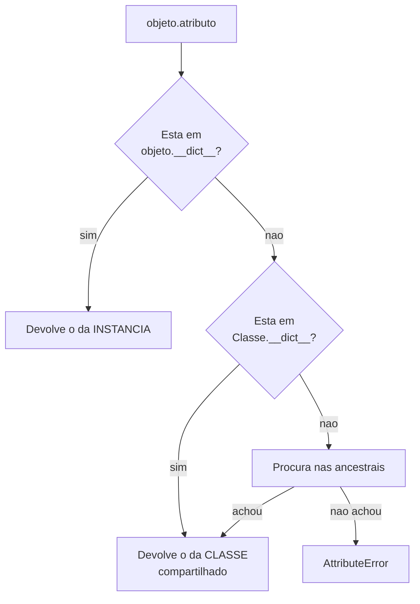

# 04.07 — POO: classes e objetos

> **Módulo 04 — Python Avançado** · Nível: N1 · Tempo estimado: 2h30 · Código: `codigo/cap07/`

## 1. Objetivo

- **Explicar** um objeto como "dados + comportamento no mesmo lugar".
- **Distinguir** classe de instância, e atributo de classe de atributo de instância.
- **Justificar** quando uma classe é melhor que um dicionário — e quando não é.
- **Prever** o comportamento de atributos mutáveis declarados na classe.

Ao final, `self` deixa de ser uma convenção misteriosa: você sabe que `objeto.metodo()` é literalmente `Classe.metodo(objeto)`.

---

## 2. Pré-requisitos

- [04.03 — Closures](03-closures-e-fabricas.md) — **o capítulo que preparou este**: o dicionário de funções do AP3 já era um objeto.
- [04.01 — Assinaturas](01-args-kwargs-e-assinaturas.md) — a armadilha do default mutável reaparece aqui, com outra roupa.
- [01.15 — Dicionários](../01-Python/15-dicionarios.md) — a alternativa contra a qual as classes vão ser comparadas.

**Autoteste:** (1) O que faltava no dicionário de funções do 04.03/AP3? (2) Por que `def f(x, lista=[])` acumula entre chamadas? (3) Como você representaria um produto da Aurora hoje, sem classes?

---

## 3. Motivação

O 04.03 terminou construindo isto:

```python
{"inc": incrementar, "ler": ler, "zerar": zerar, "definir": definir}
```

Quatro funções compartilhando estado, num dicionário. E a conclusão foi: **isso já é um objeto**, montado à mão. Este capítulo mostra o que a linguagem faz melhor quando você deixa.

A comparação mais direta é o que acontece ao errar um nome:

```
closure  -> KeyError: 'incrementar'
classe   -> AttributeError: 'Contador' object has no attribute 'incrementer'
```

A segunda mensagem **nomeia o tipo** e o atributo procurado. A primeira diz apenas que uma chave não existe — e não diz de quê. Numa base grande, essa diferença são minutos contra horas.

E há mais: `repr` do dicionário mostra endereços de funções; `repr` do objeto mostra a classe. A classe tem docstring; o dicionário não tem onde pôr uma. O `help()` funciona num; no outro, não.

**Classes não são um paradigma que você adota por gosto. São um conjunto de facilidades que a linguagem oferece a estruturas que você já estava construindo.**

---

## 4. Modelo mental

Um **objeto** é dados e comportamento no mesmo lugar. Uma **classe** é o molde que descreve como fazer objetos daquele tipo.

| | Classe | Instância (objeto) |
|---|---|---|
| É | o **molde** | a **peça** |
| Existe | uma | quantas você criar |
| Guarda | métodos, atributos de classe | atributos de instância |
| Exemplo | `Produto` | `mouse`, `teclado` |

```
type(Produto)  -> type      (a classe é um objeto do tipo `type`)
type(mouse)    -> Produto
```

**A frase que evita metade da confusão inicial:** a classe descreve **o que todo produto tem**; a instância guarda **os valores deste produto**. `Produto` não tem preço; `mouse` tem.

E `self` é o parâmetro que recebe a instância. Não é palavra reservada — é convenção. O próximo capítulo detalha; aqui só uma prova:

```
objeto.incrementar()      -> 1
Contador.incrementar(obj) -> 2      (as duas formas fazem o mesmo)
```

---

## 5. Analogia

Uma classe é a **planta de um apartamento**; os objetos são os apartamentos construídos.

A planta diz que todo apartamento tem sala, cozinha e dois quartos — mas a planta não tem móveis. Cada apartamento construído tem seus próprios móveis, sua própria pintura, seus próprios moradores.

**Onde a analogia fica útil:** o **hall do prédio** é compartilhado. Está na planta, existe uma vez, e todos os apartamentos usam o mesmo. Se alguém sujar o hall, todos veem a sujeira.

Isso é exatamente um **atributo de classe mutável** — e é a armadilha da §6.5. Uma lista declarada no corpo da classe é o hall: uma só, para todo mundo.

---

## 6. Teoria

### 6.1 A classe mínima

```python
class Contador:
    """Conta ocorrências."""

    def __init__(self, inicio=0):
        self.n = inicio

    def incrementar(self):
        self.n += 1
        return self.n
```

- **`class Nome:`** — por convenção, `CapWords` (PEP 8).
- **docstring** — a classe tem onde documentar; um dicionário não.
- **`__init__`** — chamado ao criar a instância. **Não é o construtor** (quem cria é `__new__`); é o **inicializador**, que recebe o objeto já criado e o preenche.
- **`self`** — o primeiro parâmetro de todo método de instância.

Criar é chamar a classe: `c = Contador(5)`.

### 6.2 `self` não é mágico

```
objeto.incrementar()      -> 1
Contador.incrementar(obj) -> 2
tipo de objeto.incrementar:   method
tipo de Contador.incrementar: function
objeto.incrementar.__self__ is objeto: True
```

**As duas chamadas fazem exatamente a mesma coisa.** `objeto.incrementar()` é açúcar para `Contador.incrementar(objeto)`.

O que acontece por baixo: `Contador.incrementar` é uma **função** comum. Acessá-la **através de uma instância** produz um **método vinculado** (*bound method*) — um objeto que guarda a função e a instância, e que insere a instância como primeiro argumento na chamada. `objeto.incrementar.__self__` é a instância, e você pode inspecioná-lo.

**Consequência prática:** `self` é só um nome. `def incrementar(este)` funcionaria igual — e ninguém faria isso, porque a convenção é universal e quebrar convenção sem ganho é custo puro.

### 6.3 O namespace do objeto

```
objeto.__dict__: {'n': 7}
depois de objeto.apelido = "principal": {'n': 7, 'apelido': 'principal'}
outro objeto: {'n': 0}   <- não tem apelido
```

**Cada instância tem um dicionário** com seus atributos. Atribuir `objeto.apelido = ...` acrescenta uma chave — de qualquer lugar do código, mesmo que a classe não preveja o atributo.

Isso é flexibilidade e é risco. Um erro de digitação em `self.preco = ...` dentro de um método **não dá erro**: cria um atributo novo, e o antigo continua com o valor velho. É o mesmo trade-off do `**kwargs` no 04.01, e o 04.09 mostra como fechar essa porta com `__slots__`.

### 6.4 Métodos que devolvem objetos novos

```python
def com_desconto(self, percentual):
    """Devolve um produto NOVO — não altera este."""
    novo = round(self.preco_centavos * (100 - percentual) / 100)
    return Produto(self.nome, novo, self.categoria, self.ativo)
```

```
com 10%: R$ 80.91 · original intacto: R$ 89.90
```

Duas escolhas possíveis: **mutar** o objeto (`self.preco_centavos = novo`) ou **devolver um novo**. A segunda é frequentemente melhor, porque um objeto que não muda não surpreende ninguém — quem passou o produto para a sua função sabe que ele voltará igual.

**A regra prática:** métodos que **calculam** devolvem valores novos; métodos que **registram uma mudança de estado real** (um pedido que foi pago, um contador que contou) mutam. Confundir os dois produz funções que alteram o que receberam sem avisar — e o 01.13 já mostrou o preço disso.

### 6.5 Atributo de classe vaza

```python
class ConfigErrada:
    tags = []                    # UMA lista, para todas as instâncias

    def adicionar(self, tag):
        self.tags.append(tag)
```

```
a.adicionar('x') -> b.tags: ['x']   <<< vazou
ConfigErrada.tags is a.tags is b.tags: True
```

Duas instâncias independentes, e o que uma acrescenta a outra enxerga. **É o default mutável do 04.01, com outra roupa** — e pelo mesmo motivo: o objeto é criado **uma vez**, quando a classe é definida, e compartilhado.

A correção também é a mesma em espírito: criar o objeto **dentro** do `__init__`.

```python
class ConfigCerta:
    LIMITE = 100                 # imutável: atributo de classe é adequado

    def __init__(self):
        self.tags = []           # uma lista POR INSTÂNCIA
```

**Quando atributo de classe é correto:** constantes (`LIMITE = 100`), valores imutáveis compartilhados, e contadores deliberadamente globais à classe. **Quando é armadilha:** qualquer mutável — lista, dicionário, conjunto.

**Uma sutileza que confunde:** `self.tags.append(...)` **muta** o objeto da classe; `self.tags = [...]` **cria** um atributo de instância que passa a sombrear o da classe. É exatamente a distinção mutar × reatribuir do 04.03, num terceiro contexto.

⚠️ **Caixa-preta 1:** `self.tags` funciona mesmo sem `tags` existir na instância — o Python procura primeiro na instância, depois na classe. Essa ordem de busca é o que sustenta herança, e é o [04.10](10-heranca.md).

### 6.6 Dicionário ou classe?

O mesmo produto, das duas formas:

```python
produto = {"nome": "Mouse", "preco_centavos": 8990, "categoria": "perifericos"}
mouse   = Produto("Mouse", 8990, "perifericos")
```

| | Dicionário | Classe |
|---|---|---|
| Erro de digitação | `KeyError` em produção | `AttributeError` com o nome |
| Campos garantidos | não — qualquer chave, qualquer hora | sim, o `__init__` exige |
| Comportamento junto | não | sim (`preco_reais()`) |
| Documentação | não há onde | docstring |
| Serializar para JSON | direto | precisa de conversão |
| Campos dinâmicos | natural | desajeitado |

**O critério que decide, e ele não é "classes são melhores":**

**Use dicionário** quando os dados são de passagem — vieram de JSON, vão para JSON, e ninguém opera sobre eles no meio. Converter para objeto e voltar é trabalho sem retorno.

**Use classe** quando há **comportamento** junto dos dados, quando os campos são fixos e conhecidos, ou quando o mesmo dado circula por muitas funções — porque aí o `AttributeError` cedo vale mais que a flexibilidade.

**O sinal mais confiável de que um dicionário deveria ser classe:** você escreveu três funções que recebem o mesmo dicionário e assumem as mesmas chaves. Essas funções são métodos procurando uma classe.

⚠️ **Caixa-preta 2:** a versão da classe `Produto` acima tem quatro linhas de `self.x = x` no `__init__`, e não imprime bem. Existe uma forma de obter `__init__`, `__repr__` e `__eq__` de graça, com uma linha: `@dataclass`. É o [04.13](13-dataclasses.md) — e ele é um decorador que recebe uma classe, exatamente como o 04.04 antecipou.

---

## 7. Funcionamento interno

`class Contador: ...` executa o corpo da classe num namespace próprio e cria um objeto do tipo `type`, guardando o resultado em `Contador.__dict__`. **A classe é um objeto** — pode ser guardada em variável, passada como argumento e criada em tempo de execução.

`Contador(5)` chama `type.__call__`, que chama `__new__` (aloca) e depois `__init__` (preenche). É por isso que `__init__` não é o construtor: ele recebe um objeto que já existe.

`objeto.atributo` procura em `objeto.__dict__`, depois em `type(objeto).__dict__`, depois nas classes ancestrais. Essa ordem explica a §6.5 inteira: `self.tags` não encontra `tags` na instância e vai buscar na classe — e devolve o objeto compartilhado.

---

## 8. Visualização do fluxo



**Como ler:** a caixa `E` é a armadilha da §6.5 — quando a busca chega na classe, o objeto devolvido é **um só** para todas as instâncias. E a caixa `G` é a vantagem sobre o dicionário: o erro nomeia o tipo e o atributo, em vez de dizer só que uma chave não existe.

---

## 9. Aplicação prática

**A dor da Aurora.** O relatório manipula produtos como dicionários, e o mesmo dado passa por sete funções:

```python
def calcular_desconto(produto, percentual): ...
def formatar_linha(produto): ...
def esta_ativo(produto): ...
def preco_em_reais(produto): ...
```

Todas recebem o mesmo dicionário e assumem as mesmas chaves. **São métodos sem classe.**

Três problemas concretos aparecem com o tempo:

1. **Erro de digitação vira `KeyError` em produção.** `produto["preco_centvos"]` só falha quando a linha executa — que pode ser no caso raro, meses depois.
2. **Ninguém sabe quais chaves existem.** A resposta está espalhada por sete funções, e um dicionário vindo de outra origem pode ter chaves a mais ou a menos.
3. **A regra de negócio se espalha.** "Preço em centavos, dividido por 100" aparece em quatro lugares, e um deles arredonda diferente.

**Com classe**, os três se resolvem: o `__init__` declara os campos; `preco_reais()` existe num lugar só; e o erro de digitação vira `AttributeError` com o nome do atributo.

**A ressalva honesta, e ela importa.** Se os produtos vêm de uma API em JSON e vão direto para um template HTML, sem lógica no meio, **converter para objeto é trabalho sem ganho** — você escreve o `__init__`, escreve a conversão de volta, e não ganhou nada além de linhas.

**O sinal que decide, e vale memorizar:** conte quantas funções recebem aquele dicionário e assumem a estrutura dele. **Uma ou duas, dicionário serve. Três ou mais, você tem uma classe implícita** — e o custo de não declará-la cresce com cada função nova.

---

## 10. Código comentado

`codigo/cap07/objetos.py` roda as seis cenas. Três valem comentário.

**A cena [1] põe as duas versões do contador lado a lado e erra o nome de propósito nas duas.** Ver `KeyError: 'incrementar'` contra `AttributeError: 'Contador' object has no attribute 'incrementer'` é o argumento inteiro numa tela — e note que a segunda mensagem nomeia o **tipo**, o que é decisivo quando você tem doze classes parecidas.

**A cena [3] chama o método das duas formas e imprime `__self__`.** É o que desmonta o mistério do `self`: `objeto.incrementar` é um objeto (`method`), `Contador.incrementar` é outro (`function`), e o primeiro guarda o segundo mais a instância.

**A cena [5] imprime `is` entre os três nomes** — `ConfigErrada.tags is a.tags is b.tags` — e o `True` encerra a discussão. Não há três listas; há uma.

---

## 11. Erros comuns

**1. Mutável como atributo de classe.** Vaza entre instâncias.
→ Crie no `__init__`.

**2. Esquecer `self` no parâmetro.** `TypeError: takes 0 positional arguments but 1 was given`.
→ A mensagem confunde porque você "não passou nada" — mas a instância foi passada.

**3. Esquecer `self.` ao atribuir.** `n = 5` cria uma variável local que some no fim do método.

**4. Erro de digitação em `self.x = ...`.** Cria atributo novo, sem erro.
→ O 04.09 fecha essa porta.

**5. Achar que `__init__` é o construtor.** É o inicializador; `__new__` constrói.

**6. Método que muta quando deveria devolver novo.** Surpreende quem chama.

**7. Criar classe para dado de passagem.** JSON → objeto → JSON é trabalho sem ganho.

**8. Chamar a classe sem instanciar.** `Contador.incrementar()` sem argumento falha — falta o `self`.

---

## 12. Boas práticas

- **`CapWords` para classes**, `snake_case` para métodos e atributos (PEP 8).
- **Todos os atributos declarados no `__init__`**, mesmo os que começam `None`.
- **Atributo de classe só para constantes imutáveis** — e em `MAIÚSCULAS`.
- **Docstring na classe** dizendo o que ela representa, não como funciona.
- **Prefira devolver objetos novos** a mutar, quando o método calcula.
- **Uma classe, uma responsabilidade.** Doze métodos sem relação entre si é sinal de duas classes.
- **Não crie classe para dado de passagem.**
- **Conte as funções que compartilham o dicionário** — três é o limiar.

---

## 13. Performance

Uma instância ocupa mais memória que um dicionário com os mesmos dados, porque carrega a referência à classe **e** um dicionário próprio. Para milhões de objetos pequenos, isso importa, e a solução é `__slots__` (04.09), que troca o dicionário por um vetor fixo e reduz a memória em cerca de metade.

Acesso a atributo é um pouco mais lento que acesso a chave de dicionário, porque envolve a busca da §7 — instância, classe, ancestrais. A diferença é de nanossegundos e irrelevante fora de laços muito quentes.

**A regra que vale:** escolha entre classe e dicionário por **clareza e segurança**, não por desempenho. Se um dia o desempenho decidir, `__slots__` e `@dataclass(slots=True)` recuperam a maior parte da diferença — e a medição vem antes, como no 03.14.

---

## 14. Mercado

Python não obriga POO, e código Python profissional é frequentemente uma mistura: funções para transformações, classes para entidades com estado e comportamento. Quem chega de Java tende a criar classes demais; quem chega de scripts, de menos.

Em engenharia de dados, o equilíbrio pende para funções e dicionários — os dados são de passagem, o volume é grande, e converter tudo em objeto custa memória e tempo. Em backend, pende para classes — as entidades têm regras de negócio, e é onde `Pedido.pode_ser_cancelado()` vale mais que uma função solta.

E vale saber o que vem: `@dataclass` (04.13) e Pydantic (04.15) tornaram classes de dados baratas de escrever, o que deslocou o equilíbrio. O argumento "classe dá muito trabalho para um dado simples" era forte em 2015 e é fraco hoje — uma dataclass tem uma linha a mais que o dicionário e entrega validação, comparação e `repr`.

---

## 15. Entrevistas

- **"O que é `self`?"** O parâmetro que recebe a instância. `objeto.metodo()` é `Classe.metodo(objeto)` — e demonstrar as duas formas encerra a pergunta.
- **"Qual a diferença entre atributo de classe e de instância?"** Um por classe contra um por objeto. A resposta forte cita o vazamento do mutável e o compara ao default mutável.
- **"Quando usar dicionário em vez de classe?"** Dados de passagem, campos dinâmicos, serialização direta. E o critério das três funções.
- **"`__init__` é o construtor?"** Não — é o inicializador. `__new__` constrói e devolve o objeto; `__init__` o preenche.
- **"Como um objeto guarda seus atributos?"** Num `__dict__` próprio. E a busca vai da instância para a classe, o que explica tanto herança quanto o vazamento.

---

## 16. Exercícios guiados

Em [`exercicios/cap07.md`](exercicios/cap07.md):

- **A1** `[~10 min · prevê a saída]` — 6 trechos com atributos de classe e instância.
- **A2** `[~10 min · classe ou dicionário?]` — 6 cenários para decidir.
- **A3** `[~10 min · ache o erro]` — 6 classes defeituosas.
- **A4** `[~10 min · o que `self` recebe]` — 5 chamadas para prever.
- **AP1** `[~20 min · o produto]` — Converta o dicionário da Aurora em classe.
- **AP2** `[~25 min · o vazamento]` — Reproduza e corrija de três formas.
- **AP3** `[~20 min · closure → classe]` — Reescreva o contador do 04.03/AP3.
- **D1** `[~45 min · o carrinho]` — **Uma classe com estado, e a decisão de mutar ou não.**

---

## 17. Desafios

**D1 — O carrinho.** Escreva `Carrinho` com: `adicionar(produto, quantidade)`, `remover(produto)`, `total_centavos()`, `quantidade_itens()` e `aplicar_cupom(codigo)`.

Requisitos: nenhum atributo mutável no corpo da classe; o mesmo produto adicionado duas vezes **soma** as quantidades; remover produto ausente levanta erro com mensagem útil; e `aplicar_cupom` **devolve um carrinho novo** em vez de mutar — com a justificativa escrita.

**A pergunta que fecha:** `adicionar` muta e `aplicar_cupom` não. Isso é incoerente? Defenda a escolha ou mude-a — as duas respostas podem estar certas, mas só com argumento.

---

## 18. Mini projeto

**O catálogo da Aurora, em objetos.** Modele `Produto`, `Categoria` e `Catalogo` a partir do banco do módulo 03, e reescreva o relatório usando-os.

Requisitos: `Catalogo` carrega do SQLite e devolve objetos `Produto`; filtros e ordenações viram métodos (`ativos()`, `por_categoria(nome)`, `mais_caros(n)`); dinheiro continua em centavos internamente; e nenhum método muta o catálogo.

E a parte que dá o critério: escreva também a versão com dicionários e funções, e compare em **linhas de código**, **erros que cada uma pega cedo**, e **facilidade de acrescentar um filtro novo**. Conclua com honestidade — se a versão com dicionários ficar melhor para este caso, diga.

---

## 19. Revisão

**Resumo em 5 frases.** Um objeto é dados e comportamento no mesmo lugar; a classe é o molde, e a instância é a peça. `self` não é mágico: `objeto.metodo()` é açúcar para `Classe.metodo(objeto)`, e `objeto.metodo.__self__` prova isso. Cada instância tem um `__dict__` próprio, e a busca de atributos vai da instância para a classe — o que explica ao mesmo tempo a herança e o vazamento de atributos de classe mutáveis, que é o default mutável do 04.01 com outra roupa. A vantagem prática sobre um dicionário não é filosófica: erro de digitação vira `AttributeError` com o nome do tipo em vez de `KeyError` mudo, os campos ficam declarados num lugar, e o comportamento mora junto do dado. E o critério para escolher entre os dois é contável: **três ou mais funções que recebem o mesmo dicionário e assumem as mesmas chaves são métodos procurando uma classe**.

**Flashcards** (também em [`revisao/flashcards.md`](revisao/flashcards.md)):

| ID | Frente | Verso |
|---|---|---|
| 04.07-F1 | O que `self` é, exatamente? | O parâmetro que recebe a instância. `objeto.metodo()` **é** `Classe.metodo(objeto)` — as duas formas produzem o mesmo resultado, e `objeto.metodo.__self__` é a instância. Não é palavra reservada; é convenção. |
| 04.07-F2 | Explique com suas palavras por que uma lista no corpo da classe vaza entre instâncias. | (Elaboração) O objeto é criado **uma vez**, quando a classe é definida. A busca de atributo não acha `tags` na instância, vai à classe, e devolve **o mesmo objeto** para todas. `Classe.tags is a.tags is b.tags` é `True`. É o default mutável do 04.01. |
| 04.07-F3 | Preveja: `a.tags.append("x")` com `tags = []` no corpo da classe. O que `b.tags` mostra? | (Previsão) **`['x']`** — vazou. Correção: `self.tags = []` no `__init__`. E note a diferença entre `self.tags.append(...)` (muta a da classe) e `self.tags = [...]` (cria uma de instância que sombreia). |
| 04.07-F4 | Quando usar dicionário em vez de classe? | (Decisão) Dados **de passagem** (JSON entra, JSON sai, sem lógica no meio), campos dinâmicos, serialização direta. O sinal de que virou classe: **três ou mais funções** recebem o mesmo dicionário e assumem as mesmas chaves. |
| 04.07-F5 | `__init__` é o construtor? | **Não** — é o **inicializador**. `__new__` aloca e devolve o objeto; `__init__` recebe o objeto já criado e o preenche. Daí `__init__` não devolver nada. |

**Revisão espaçada:** D+1 refaça A1 e A3 · D+7 o AP2 (vazamento, três correções) · D+30 explique em voz alta por que `objeto.metodo()` funciona sem você passar `self`.

---

## 20. Checklist

- [ ] Escrevi uma classe com `__init__`, atributos e métodos.
- [ ] Chamei um método das duas formas e vi que dão o mesmo.
- [ ] Inspecionei `objeto.__dict__` e vi os atributos.
- [ ] Reproduzi o vazamento de atributo de classe mutável.
- [ ] Sei a diferença entre `self.x.append(...)` e `self.x = [...]`.
- [ ] Sei que `__init__` não é o construtor.
- [ ] Comparei as mensagens de erro de dicionário e classe.
- [ ] Tenho um critério contável para escolher entre os dois.
- [ ] Escrevi um método que devolve objeto novo em vez de mutar.

---

## 21. Próximo capítulo

[04.08 — Atributos, métodos e `self`](08-atributos-metodos-e-self.md). Este capítulo mostrou **que** `self` funciona; o próximo mostra o resto da família: métodos de instância, de classe e estáticos; quando cada um faz sentido; e como criar objetos por caminhos alternativos — `Produto.do_banco(linha)` em vez de um `__init__` que tenta adivinhar o formato da entrada.
