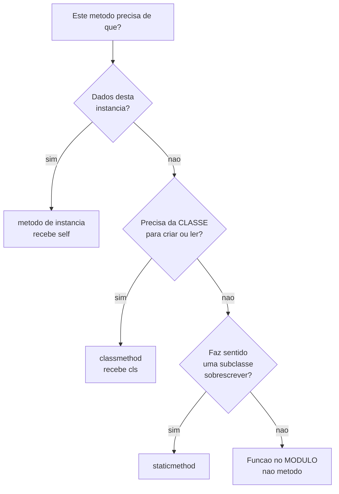

# 04.08 — Atributos, métodos e `self`

> **Módulo 04 — Python Avançado** · Nível: N1 · Tempo estimado: 2h30 · Código: `codigo/cap08/`

## 1. Objetivo

- **Distinguir** método de instância, de classe e estático pelo que cada um recebe.
- **Implementar** construtores alternativos com `@classmethod`.
- **Justificar** a escolha entre `@classmethod` e `@staticmethod` com um teste, não com gosto.
- **Prever** o que acontece ao ler, sombrear e apagar um atributo de classe pela instância.

Ao final, `Produto.do_banco(linha)` e `dict.fromkeys(chaves)` deixam de parecer sintaxe especial — você sabe escrever os dois.

---

## 2. Pré-requisitos

- [04.07 — Classes e objetos](07-poo-classes-e-objetos.md) — `self`, `__init__`, atributos de classe e instância.
- [04.04 — Decoradores](04-decoradores.md) — `@classmethod` e `@staticmethod` **são** decoradores, e este capítulo mostra o que eles devolvem.

**Autoteste:** (1) O que `objeto.metodo()` faz por baixo? (2) Por que `E.contador += 1` conta instâncias e `self.contador += 1` não? (3) Como você criaria um `Produto` a partir de uma linha do banco, sem poluir o `__init__`?

---

## 3. Motivação

O `__init__` do 04.07 recebe nome, preço e categoria. Mas produtos chegam de três lugares diferentes: digitados, lidos do SQLite, e importados de um CSV do fornecedor — cada um com um formato.

A saída tentadora é um `__init__` que adivinha:

```python
def __init__(self, dados):
    if isinstance(dados, tuple):
        self.nome, self.preco_centavos, self.categoria = dados
    elif isinstance(dados, dict):
        self.nome = dados["nome"]
        ...
```

Isso cresce a cada origem nova, e quem lê a chamada `Produto(algo)` não sabe o que `algo` deveria ser.

A saída melhor tem nome:

```python
Produto("Mouse", 8990)                    # o caso comum
Produto.do_banco(("Mouse", 8990, "perifericos"))
Produto.gratuito("Adesivo")
```

Três formas de criar, cada uma com nome que diz de onde vem. É `@classmethod`, e é o mesmo mecanismo de `dict.fromkeys()`, `datetime.now()` e `Path.cwd()` — construtores alternativos que você já usa sem reparar.

---

## 4. Modelo mental

Três tipos de método, e a diferença é **o que chega como primeiro argumento**:

| Tipo | Recebe | Usa | Chamado por |
|---|---|---|---|
| instância | `self` (o objeto) | dados **deste** objeto | instância |
| `@classmethod` | `cls` (a classe) | a classe — para criar ou ler constantes | classe **ou** instância |
| `@staticmethod` | **nada** | nem objeto nem classe | classe **ou** instância |

```
p.preco_reais()                  -> 89.9        precisa do preço DESTE produto
Produto.gratuito("Chaveiro")     -> Produto(...)  cria um produto novo
Produto.centavos_para_reais(8990) -> 89.9       não precisa de nada
```

**A pergunta que decide, e ela é literal:** *do que este método precisa?*

- Precisa dos dados **deste objeto** → instância.
- Precisa da **classe** (para criar uma instância, ou ler um atributo de classe) → `classmethod`.
- Não precisa de nenhum dos dois → `staticmethod`… ou uma função solta no módulo, e a §6.5 discute quando.

---

## 5. Analogia

Uma **fábrica de bicicletas**.

Um **método de instância** é uma operação sobre **uma bicicleta específica**: calibrar o pneu desta aqui. Sem a bicicleta, a operação não faz sentido.

Um **`classmethod`** é uma operação da **fábrica**: "monte uma bicicleta a partir desta lista de peças". Não há bicicleta ainda — ela é o resultado. E se uma fábrica filial herdar o procedimento, ela monta bicicletas **da marca dela**, não da matriz. É exatamente o que `cls` garante, e o que a §6.4 demonstra.

Um **`staticmethod`** é a **tabela de conversão de polegadas para centímetros** pendurada na parede da fábrica. Não é sobre nenhuma bicicleta nem sobre a fábrica; está ali porque é o assunto do lugar. E é justamente por isso que ela poderia estar em outra parede — que é a ressalva da §6.5.

---

## 6. Teoria

### 6.1 Método de instância

O padrão, e o que você escreveu no 04.07. Recebe `self` e opera sobre os dados do objeto.

```python
def preco_reais(self):
    return self.preco_centavos / 100
```

Chamado pela classe sem instância, falha:

```
Produto.preco_reais() -> TypeError: missing 1 required positional argument: 'self'
```

### 6.2 `@classmethod` — construtores alternativos

```python
@classmethod
def do_banco(cls, linha):
    nome, preco, categoria = linha
    return cls(nome, preco, categoria)      # `cls`, não `Produto`
```

```
Produto.do_banco(("Teclado K2", 24900, "perifericos")) -> Produto('Teclado K2')
Produto.gratuito("Adesivo") -> Produto('Adesivo')
```

**O nome do método é a documentação.** `Produto.do_banco(linha)` diz de onde o dado vem; `Produto(linha)` com um `__init__` polimórfico não diz nada.

Você já usa esse padrão na biblioteca padrão:

| Chamada | O que é |
|---|---|
| `dict.fromkeys(["a", "b"])` | construtor alternativo |
| `datetime.now()` | idem |
| `datetime.fromisoformat("2026-08-04")` | idem |
| `Path.cwd()` | idem |

`cls` também serve para ler atributos de classe sem citar o nome da classe:

```python
@classmethod
def quantos_criados(cls):
    return cls._criados
```

### 6.3 `@staticmethod` — nem um nem outro

```python
@staticmethod
def centavos_para_reais(centavos):
    return centavos / 100
```

Não recebe `self` nem `cls`. Funciona chamado pela classe ou pela instância, e é apenas uma função que mora no namespace da classe por **assunto**.

### 6.4 O teste que decide entre os dois

A pergunta "usa `cls` ou não?" resolve os casos fáceis. O teste que resolve os difíceis é a **herança**:

```python
class ProdutoDigital(Produto):
    pass
```

```
Produto.do_banco:                Produto('Ebook')
ProdutoDigital.do_banco:         ProdutoDigital('Ebook')   <- tipo CERTO
ProdutoDigital.do_banco_estatico: Produto('Ebook')         <- tipo ERRADO
```

**A versão com `staticmethod` devolveu o tipo errado.** Ela cita `Produto(...)` pelo nome, e o nome está fixo desde a definição. A versão com `classmethod` recebe `cls` — que é **a classe pela qual o método foi chamado** —, e produz o tipo certo automaticamente.

**A regra que sai daí: todo construtor alternativo é `@classmethod`, sem exceção.** Mesmo que você não tenha subclasses hoje, escrever `staticmethod` planta um defeito que só aparece quando alguém herdar — e a mensagem não é um erro, é um objeto do tipo errado circulando pelo sistema.

`cls` funciona igual chamado pela instância: `ProdutoDigital().do_banco(...)` também devolve `ProdutoDigital`.

### 6.5 Quando `staticmethod` é a escolha errada

`staticmethod` é o menos usado dos três, e frequentemente é o sinal de que a função deveria estar em outro lugar.

**A pergunta honesta: se ela não usa nem o objeto nem a classe, por que está na classe?**

Duas respostas legítimas: **coesão** — quem procura `centavos_para_reais` procura em `Produto` — e a possibilidade de uma subclasse **sobrescrevê-la**, o que uma função de módulo não permite.

E uma resposta ilegítima, que é comum: "para organizar". Uma classe cheia de `staticmethod` e sem estado não é uma classe — é um módulo com sintaxe pior. Se você tem cinco métodos estáticos e nenhum atributo de instância, o que você quer é um arquivo `.py` com cinco funções.

⚠️ **Caixa-preta 1:** `@classmethod` e `@staticmethod` são decoradores (04.04), mas não devolvem funções comuns — devolvem objetos que se comportam de forma diferente quando acessados. O mecanismo é o **protocolo de descritores**, e ele também sustenta `@property`, no [04.09](09-encapsulamento-e-properties.md).

### 6.6 Atributo de classe: ler, sombrear, restaurar

```
config.TIMEOUT: 30
mudou na CLASSE -> config.TIMEOUT: 60      (a instância vê)
config.TIMEOUT = 5 -> instância: 5 · classe: 60
config.__dict__: {'TIMEOUT': 5}
após `del config.TIMEOUT` -> volta a ler da classe: 60
```

Quatro comportamentos numa saída:

1. **A instância lê da classe** quando não tem o atributo.
2. **Alterar na classe** é visto por todas as instâncias que não sombrearam — é o que torna atributos de classe úteis para configuração.
3. **Atribuir na instância** cria uma cópia local que **sombreia** a da classe. A classe fica intacta.
4. **`del` na instância** remove o sombreamento e volta a ler da classe.

O item 3 é a §6.5 do 04.07 vista pelo outro lado: atribuir cria; mutar altera o compartilhado.

**E o item 2 tem uma consequência prática que vale registrar:** mudar `Config.TIMEOUT` em tempo de execução altera o comportamento de todos os objetos existentes. Isso é conveniente em testes (`Config.TIMEOUT = 0` para não esperar) e perigoso em produção, porque o efeito é global e invisível.

### 6.7 O que os decoradores devolvem

```
no __dict__ da classe:        acessado pela classe:
  estático:   staticmethod      estático:   function
  de classe:  classmethod       de classe:  method
  instância:  function          instância:  function
```

**Três observações que fecham o assunto do `self`:**

`@staticmethod` guarda um objeto `staticmethod`, e acessá-lo devolve a **função pura** — sem vínculo com nada. É por isso que não recebe `self`.

`@classmethod` guarda um `classmethod`, e acessá-lo devolve um **method** já vinculado à **classe**. É o `cls` chegando de graça.

Um método de instância é uma `function` no `__dict__`. Acessado **pela classe**, continua `function`; acessado **por uma instância**, vira `method` vinculado — que é exatamente o que o 04.07 §6.2 mostrou.

⚠️ **Caixa-preta 2:** métodos com nomes cercados de underscores — `__init__`, `__repr__`, `__eq__` — são chamados **pela linguagem**, não por você. `print(objeto)` chama `__str__`; `a == b` chama `__eq__`. É o [04.12](12-metodos-especiais.md).

---

## 7. Funcionamento interno

`staticmethod`, `classmethod` e funções comuns são **descritores**: objetos que definem `__get__`, chamado quando o atributo é acessado.

Ao escrever `Produto.do_banco`, o Python encontra o objeto `classmethod` no `__dict__` da classe e chama o `__get__` dele, que devolve um método vinculado à classe. Para `produto.preco_reais`, encontra uma `function` e o `__get__` dela devolve um método vinculado à instância. `staticmethod.__get__` devolve a função sem vincular nada.

**É o mesmo mecanismo nos três casos** — muda apenas o que o `__get__` decide vincular. E é o que permite a `@property` do próximo capítulo fazer algo mais radical: interceptar leitura **e** escrita.

---

## 8. Visualização do fluxo



**Como ler:** o fluxo desce por eliminação, e a caixa `H` é a que costuma faltar nas explicações. Muito código põe em `staticmethod` o que deveria ser uma função de módulo — e o critério que separa é a última pergunta: se uma subclasse nunca vai sobrescrever, a classe não está agregando nada.

---

## 9. Aplicação prática

**A dor da Aurora.** Produtos chegam de três origens, e o código atual tem três funções soltas:

```python
def produto_de_linha_sql(linha): ...
def produto_de_csv(campos): ...
def produto_de_json(dados): ...
```

Elas funcionam. Três problemas aparecem com o tempo:

1. **Estão longe da classe.** Quem lê `Produto` não descobre que existem três formas de criá-lo.
2. **Repetem o nome `Produto`.** Criar `ProdutoDigital` exige três funções novas, quase idênticas.
3. **O nome não segue a classe.** Renomear `Produto` exige caçar as três.

**Como `classmethod`:**

```python
@classmethod
def do_banco(cls, linha): ...

@classmethod
def do_csv(cls, campos): ...

@classmethod
def do_json(cls, dados): ...
```

**O ganho decisivo é o segundo problema.** `ProdutoDigital.do_banco(...)` funciona **sem escrever nada**, e devolve `ProdutoDigital`. Com funções soltas, seriam três funções novas por subclasse.

**A ressalva honesta.** Se a conversão for complexa — validar formato, tratar campos ausentes, converter tipos —, um `classmethod` de trinta linhas não é melhor que uma função de trinta linhas: é a mesma coisa num lugar mais apertado.

Nesse caso, a estrutura melhor é uma função de parsing separada **mais** um `classmethod` fino que a chama:

```python
@classmethod
def do_csv(cls, campos):
    dados = interpretar_csv(campos)     # a lógica pesada mora fora
    return cls(**dados)
```

**A regra:** o `classmethod` cuida de **qual classe criar**; a interpretação do formato pode morar em outro lugar. E é o Pydantic (04.15) que resolve a parte da validação por completo.

---

## 10. Código comentado

`codigo/cap08/metodos.py` roda as seis cenas. Três valem comentário.

**A cena [3] é a razão de o capítulo existir.** Ela cria `ProdutoDigital` sem nenhum corpo — só para provar que `classmethod` devolve `ProdutoDigital` e `staticmethod` devolve `Produto`. Uma subclasse vazia é o teste mais barato possível para uma decisão de projeto, e vale adotá-lo: **quando estiver em dúvida entre `cls` e o nome fixo, crie uma subclasse vazia e chame.**

**A cena [4] termina com `del config.TIMEOUT`**, que costuma surpreender: apagar um atributo de instância **restaura** o da classe, em vez de dar erro. É a busca da §7 do 04.07 funcionando ao contrário.

**A cena [5] imprime os tipos dos dois lados** — no `__dict__` e acessado. Ver `staticmethod → function` e `classmethod → method` explica de uma vez por que um recebe `cls` e o outro não recebe nada.

---

## 11. Erros comuns

**1. `staticmethod` como construtor alternativo.** Devolve o tipo errado em subclasses.
→ Sempre `classmethod`.

**2. Citar o nome da classe dentro do `classmethod`.** `return Produto(...)` anula o `cls`.
→ `return cls(...)`.

**3. `self.contador += 1` para contar instâncias.** Cria atributo de instância; para em 1.
→ `Classe.contador += 1`.

**4. Classe só com `staticmethod` e sem estado.** É um módulo com sintaxe pior.
→ Um arquivo `.py` com funções.

**5. `__init__` polimórfico com `isinstance`.** Cresce a cada origem, e a chamada não documenta nada.
→ Construtores nomeados.

**6. Alterar atributo de classe em produção** esperando efeito local. É global e invisível.

**7. Esquecer `@classmethod` mas escrever `cls`.** `cls` recebe a instância, e `cls(...)` falha estranhamente.

---

## 12. Boas práticas

- **Construtor alternativo é sempre `@classmethod`**, e o nome diz a origem: `do_banco`, `do_csv`, `vazio`.
- **`cls(...)`, nunca o nome da classe** dentro de um `classmethod`.
- **Atributo de classe em `MAIÚSCULAS`** quando for constante.
- **Contadores de classe via `Classe.attr`**, não `self.attr`.
- **Teste a dúvida com uma subclasse vazia.**
- **`staticmethod` só quando a subclasse pode querer sobrescrever**; senão, função de módulo.
- **Lógica de parsing fora do `classmethod`**, que fica fino.

---

## 13. Performance

`classmethod` e `staticmethod` custam o mesmo que um método de instância — a diferença está no que o descritor vincula, não no trabalho feito.

Ler um atributo de instância é ligeiramente mais rápido que ler um de classe, porque a busca para no primeiro dicionário. A diferença é de nanossegundos e nunca foi o gargalo de nada.

O que **de fato** importa: um `classmethod` que faz trabalho pesado (consultar banco, ler arquivo) esconde o custo atrás de uma chamada que parece um construtor. `Produto.do_banco(id)` parece barato e pode fazer uma consulta — e é exatamente o problema do `__len__` que faz I/O, do 04.05/D1. **Um construtor alternativo que faz I/O deveria dizer isso no nome:** `buscar_no_banco`, não `do_banco`.

---

## 14. Mercado

Construtores alternativos com `classmethod` são idiomáticos e aparecem em toda biblioteca séria — `pd.DataFrame.from_dict`, `datetime.fromtimestamp`, `Model.objects.create` no Django. Reconhecer o padrão é o que permite ler a documentação sem estranhar.

`staticmethod` é motivo recorrente de discussão em revisão de código, e o argumento costuma ser o da §6.5: se não usa nem `self` nem `cls`, por que está aqui? A resposta "coesão" é válida; a resposta "para organizar" costuma indicar uma classe que deveria ser um módulo.

E o padrão de **classe sem estado, só com métodos estáticos** é um dos sinais mais confiáveis de código escrito por quem veio de Java, onde tudo precisa estar numa classe. Em Python, funções de módulo são cidadãs de primeira classe — e usar uma classe como namespace é escolher a ferramenta mais pesada sem ganho.

---

## 15. Entrevistas

- **"Qual a diferença entre `classmethod` e `staticmethod`?"** O primeiro recebe `cls`; o segundo, nada. E a resposta forte dá o **teste da herança**: só o `classmethod` devolve o tipo certo numa subclasse.
- **"Para que serve um `classmethod`?"** Construtores alternativos, principalmente. Cite `dict.fromkeys` e `datetime.now`.
- **"Quando usar `staticmethod`?"** Quando a função é do assunto da classe e uma subclasse pode querer sobrescrevê-la. Se não for o caso, função de módulo.
- **"O que acontece ao atribuir um atributo de classe pela instância?"** Cria um atributo de instância que sombreia; a classe fica intacta; `del` restaura.
- **"Como contar quantas instâncias foram criadas?"** Atributo de classe incrementado com `Classe.contador += 1` no `__init__` — e explicar por que `self.contador += 1` não funciona.

---

## 16. Exercícios guiados

Em [`exercicios/cap08.md`](exercicios/cap08.md):

- **A1** `[~10 min · prevê a saída]` — 6 chamadas dos três tipos.
- **A2** `[~10 min · qual tipo?]` — 8 métodos para classificar.
- **A3** `[~10 min · ache o erro]` — 6 definições defeituosas.
- **A4** `[~10 min · sombreamento]` — 5 operações sobre atributo de classe.
- **AP1** `[~20 min · os construtores]` — Três origens, três `classmethod`.
- **AP2** `[~25 min · o teste da herança]` — Prove o defeito do `staticmethod`.
- **AP3** `[~20 min · classe ou módulo?]` — Converta uma classe estática em módulo.
- **D1** `[~45 min · o registro de produtos]` — **Contador, cache e construtores.**

---

## 17. Desafios

**D1 — O registro de produtos.** Escreva `Produto` com: construtores `do_banco`, `do_csv` e `gratuito`; um contador de instâncias criadas; um **cache** de instâncias por nome, de modo que `Produto.obter("Mouse")` devolva sempre o mesmo objeto; e `Produto.limpar_cache()`.

Requisitos: todos os construtores funcionam em subclasses devolvendo o tipo certo; o cache é por classe, e uma subclasse **não** compartilha o cache da mãe; e um teste que prove as duas coisas.

**A pergunta que fecha:** o cache torna `Produto.obter("Mouse") is Produto.obter("Mouse")` verdadeiro. Isso é bom? Liste dois problemas que um cache de instâncias cria — e diga em que situação ele ainda compensa.

---

## 18. Mini projeto

**O carregador da Aurora.** Escreva um módulo que carregue produtos do SQLite (03.01), de um CSV e de um JSON, todos produzindo objetos `Produto` — e uma subclasse `ProdutoImportado` que acrescenta a origem.

Requisitos: um `classmethod` por origem; a interpretação de cada formato numa função separada, com o `classmethod` fino (§9); `ProdutoImportado` reaproveita os três **sem reescrevê-los**; e um relatório final com quantos vieram de cada origem, usando um contador de classe.

E a pergunta: quantas linhas você economizou por não reescrever os construtores na subclasse? Se a resposta for "poucas", o exercício ainda valeu — explique por quê.

---

## 19. Revisão

**Resumo em 5 frases.** Três tipos de método, e a diferença é o que chega primeiro: `self` (a instância), `cls` (a classe) ou nada. A pergunta que decide é literal — *do que este método precisa?* —, e a resposta "de nada" tem duas saídas: `staticmethod`, se uma subclasse puder querer sobrescrever, ou uma função de módulo, se não. **Todo construtor alternativo é `@classmethod`**, e o teste que prova isso é a herança: `ProdutoDigital.do_banco` devolve `ProdutoDigital` com `cls` e `Produto` com o nome fixo — um objeto do tipo errado circulando, sem erro nenhum. Atributo de classe lido pela instância vem da classe; atribuído pela instância cria um sombreamento local; e `del` restaura. E os três decoradores são descritores: `staticmethod` devolve a função pura, `classmethod` devolve um método vinculado à classe, e uma função comum vira método vinculado à instância — que é a explicação completa do `self`.

**Flashcards** (também em [`revisao/flashcards.md`](revisao/flashcards.md)):

| ID | Frente | Verso |
|---|---|---|
| 04.08-F1 | O que cada tipo de método recebe como primeiro argumento? | Instância: `self` (o objeto). `@classmethod`: `cls` (a **classe pela qual foi chamado**). `@staticmethod`: **nada**. A pergunta que decide: do que este método precisa? |
| 04.08-F2 | Explique com suas palavras por que construtor alternativo é sempre `@classmethod`. | (Elaboração) `cls` é a classe da **chamada**, então `ProdutoDigital.do_banco()` devolve `ProdutoDigital`. Com `staticmethod`, o nome `Produto(...)` está fixo desde a definição e a subclasse recebe o **tipo errado** — sem erro, só um objeto errado circulando. |
| 04.08-F3 | Preveja: `c.TIMEOUT = 5` numa classe com `TIMEOUT = 30`. E depois `del c.TIMEOUT`? | (Previsão) A instância passa a ter `TIMEOUT = 5` sombreando a classe, que continua 30. `del` **remove o sombreamento** e volta a ler da classe — não dá erro. |
| 04.08-F4 | Quando `staticmethod` é a escolha errada? | (Decisão) Quando nenhuma subclasse vai sobrescrevê-lo — aí é **função de módulo**. Uma classe só com métodos estáticos e sem estado é um módulo com sintaxe pior, e é o sinal mais confiável de código escrito com hábitos de Java. |
| 04.08-F5 | Como contar instâncias criadas? | `Classe.contador += 1` no `__init__` — **nunca** `self.contador += 1`, que reatribui e cria um atributo de instância, fazendo a contagem parar em 1 para cada objeto. |

**Revisão espaçada:** D+1 refaça A2 e A4 · D+7 o AP2 (teste da herança) · D+30 escreva os três tipos de memória e diga o que cada um recebe.

---

## 20. Checklist

- [ ] Escrevi os três tipos de método e sei o que cada um recebe.
- [ ] Criei um construtor alternativo com `@classmethod`.
- [ ] Provei o defeito do `staticmethod` com uma subclasse vazia.
- [ ] Sei por que `cls(...)` é melhor que citar o nome da classe.
- [ ] Vi um atributo de classe ser lido, sombreado e restaurado com `del`.
- [ ] Sei contar instâncias com `Classe.contador`.
- [ ] Tenho um critério para `staticmethod` × função de módulo.
- [ ] Sei o que cada decorador devolve ao ser acessado.

---

## 21. Próximo capítulo

[04.09 — Encapsulamento e properties](09-encapsulamento-e-properties.md). Você já viu que `objeto.n = 999` sempre funciona — e o 04.07/AP3 usou isso como argumento a favor de closures. O próximo capítulo mostra o que Python oferece no lugar de atributos privados: `_nome` por convenção, `__nome` com *name mangling*, e `@property`, que intercepta leitura e escrita sem mudar uma vírgula do código de quem usa.
