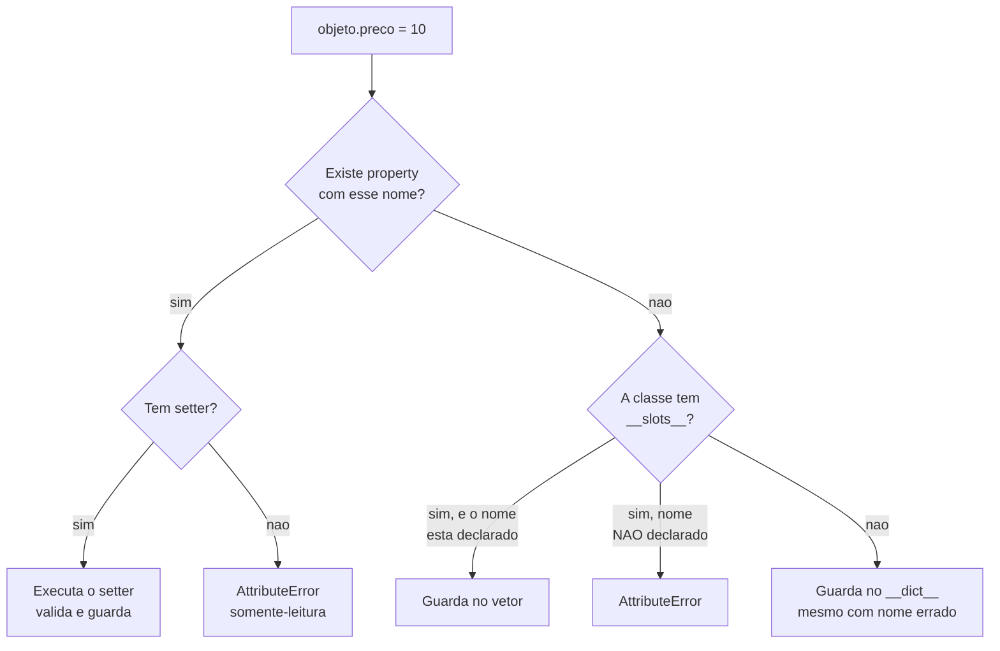

# 04.09 — Encapsulamento e properties

> **Módulo 04 — Python Avançado** · Nível: N2 · Tempo estimado: 2h30 · Código: `codigo/cap09/`

## 1. Objetivo

- **Explicar** por que Python não tem atributos privados, e o que ele oferece no lugar.
- **Distinguir** `_nome` (convenção) de `__nome` (*name mangling*) — que existe por outro motivo.
- **Implementar** `@property` para validar sem quebrar a interface de quem já usa a classe.
- **Aplicar** `__slots__` e medir o que ele custa e o que economiza.

Ao final, você acrescenta validação a uma classe em produção **sem alterar uma linha** do código que a usa.

---

## 2. Pré-requisitos

- [04.07 — Classes e objetos](07-poo-classes-e-objetos.md) — `self.prceo = 10` cria um atributo novo sem erro; este capítulo fecha essa porta.
- [04.08 — Métodos](08-atributos-metodos-e-self.md) — `@classmethod` e `@staticmethod` são descritores; `@property` é o terceiro.
- [04.04 — Decoradores](04-decoradores.md) — `@property` é um decorador, e `@x.setter` é um decorador com estado.

**Autoteste:** (1) O que o 04.07/AP3 disse que a closure faz melhor que a classe? (2) O que acontece ao digitar `self.prceo` no lugar de `self.preco`? (3) Como você validaria um preço negativo hoje?

---

## 3. Motivação

O 04.07 terminou com uma constatação incômoda: `objeto.n = 999` sempre funciona. Python não tem `private`, e o AP3 usou isso como argumento a favor de closures — nelas, o estado é de fato inacessível.

E há um problema pior, do 04.07/A3.4:

```python
self.prceo = 10        # erro de digitação
```

**Nenhum erro.** Um atributo novo nasce, o `self.preco` original fica com o valor antigo, e o programa segue com um preço desatualizado.

Este capítulo apresenta três respostas, e nenhuma é "torne privado":

| Ferramenta | Impede | Custo |
|---|---|---|
| `_nome` | **nada** — só sinaliza | zero |
| `__nome` | colisão em herança (não acesso) | zero |
| `@property` | valor **inválido** | ~45% na leitura (medido) |
| `__slots__` | atributo **inexistente** | perde flexibilidade |

A pergunta que o capítulo responde não é "como esconder", é **"que erro eu quero tornar impossível?"** — que é a mesma pergunta do fio condutor do módulo, e a mesma do 03.13 sobre restrições.

---

## 4. Modelo mental

Python trata privacidade como **contrato social**, não como cerca. A filosofia tem até uma frase — *"we're all consenting adults here"* — e ela significa: a linguagem sinaliza o que é interno, e confia em quem lê.

| Escrita | Significa | Acessível? |
|---|---|---|
| `nome` | público, faz parte da interface | sim |
| `_nome` | interno; pode mudar sem aviso | **sim** |
| `__nome` | interno **e** protegido contra colisão | sim, via `_Classe__nome` |

**A frase que corrige o mal-entendido mais comum:** `__nome` **não é privado**. Ele é **renomeado** para `_Classe__nome`, e o `__dict__` mostra isso:

```
__dict__: {'saldo': 100, '_interno': 'conv', '_Conta__secreto': 'mangle'}
```

E a `@property` faz algo diferente das três: ela não esconde nem sinaliza — **intercepta**. `objeto.preco` continua parecendo um atributo e passa a executar código.

---

## 5. Analogia

Três formas de proteger um armário de escritório.

**`_nome` é uma etiqueta escrita "não mexa".** Qualquer pessoa abre. Ela informa a intenção, e funciona porque colegas cooperam — e não funciona contra quem não leu.

**`__nome` é guardar o armário numa sala com o seu nome na porta.** Não impede ninguém de entrar; impede que **o armário de outra pessoa** seja confundido com o seu quando dois departamentos usam armários iguais. É proteção contra **colisão**, não contra acesso — e é literalmente o que o *name mangling* faz.

**`@property` é um funcionário no balcão.** Você continua pedindo "me dá a pasta X" do mesmo jeito, e agora alguém confere se o pedido faz sentido antes de entregar — e recusa se você tentar devolver uma pasta rasgada. **A interface não mudou; o que mudou foi o que acontece por trás dela.**

E **`__slots__` é um armário com gavetas rotuladas e sem espaço livre**: você não consegue inventar uma gaveta nova.

---

## 6. Teoria

### 6.1 `_nome` — convenção, e só

Um underscore inicial diz: *isto é interno, pode mudar sem aviso, não construa nada sobre isso*. O interpretador **não faz nada** com ele.

O único efeito real: `from modulo import *` não traz nomes com `_`. Fora disso, é comunicação entre pessoas.

**E funciona.** Código que acessa `_atributo` de uma biblioteca é sinalizado em revisão, quebra em atualizações, e todo mundo sabe de quem é a culpa. É uma cerca de arame — não impede, delimita.

### 6.2 `__nome` — e o que ele realmente faz

```
conta.__secreto        -> AttributeError
conta._Conta__secreto  -> 'mangle'
__dict__               -> {'_Conta__secreto': 'mangle'}
```

O Python **renomeia** `__secreto` para `_Conta__secreto` dentro do corpo da classe. Não há ocultação: há um nome menos conveniente.

**O propósito real é herança**, e o experimento mostra:

```python
class Base:
    def __init__(self):
        self.__estado = "da base"       # vira _Base__estado

class Filha(Base):
    def __init__(self):
        super().__init__()
        self.__estado = "da filha"      # vira _Filha__estado
```

```
ler_base():  da base
ler_filha(): da filha
__dict__:    {'_Base__estado': 'da base', '_Filha__estado': 'da filha'}
```

**Os dois convivem.** Sem o mangling, a subclasse sobrescreveria o atributo da mãe sem saber, e a mãe passaria a ler um valor que não é dela — um defeito silencioso e difícil de rastrear.

**A regra prática:** use `__` quando escrever uma classe **feita para ser herdada** e o atributo for detalhe interno que não deve colidir. Fora disso, `_` é suficiente e mais legível.

### 6.3 `@property` — o que muda a interface sem mudar a interface

```python
class Produto:
    def __init__(self, nome, preco_centavos):
        self.preco_centavos = preco_centavos    # já passa pelo setter

    @property
    def preco_centavos(self):
        return self._preco_centavos

    @preco_centavos.setter
    def preco_centavos(self, valor):
        if not isinstance(valor, int):
            raise TypeError("preço deve ser inteiro em centavos, não %s"
                            % type(valor).__name__)
        if valor < 0:
            raise ValueError("preço não pode ser negativo: %d" % valor)
        self._preco_centavos = valor
```

```
p.preco_centavos: 8990        (parece atributo)
após atribuir 7990: 7990
negativo  -> ValueError: preço não pode ser negativo: -100
float     -> TypeError: preço deve ser inteiro em centavos, não float
```

**O ganho decisivo é que a interface não mudou.** Todo o código que já escrevia `produto.preco_centavos = x` continua funcionando — e agora valida. Sem `property`, acrescentar validação exigiria trocar o atributo por `set_preco()` e alterar **todos** os pontos de uso.

É por isso que Python não precisa de getters e setters preventivos: **você começa com um atributo simples e o converte em `property` no dia em que precisar**, sem quebrar ninguém. Em linguagens sem esse recurso, escreve-se `getPreco()` desde o início "por precaução" — e a precaução custa verbosidade em 100% dos casos para servir em 5%.

**Note que o `__init__` também passa pelo setter.** `self.preco_centavos = preco_centavos` aciona a validação, então não existe caminho para criar um `Produto` inválido. Se o `__init__` escrevesse `self._preco_centavos` direto, a validação seria contornada na construção — que é o erro mais comum ao adotar properties.

### 6.4 Property somente-leitura

```python
@property
def preco_reais(self):
    return self._preco_centavos / 100
```

```
p.preco_reais: 89.9
p.preco_reais = 99 -> AttributeError: can't set attribute 'preco_reais'
```

Sem `setter`, o atributo é **somente-leitura**, e a mensagem é clara.

**O ganho não é impedir escrita — é impedir dessincronização.** Se `preco_reais` fosse um atributo guardado, alguém alteraria `preco_centavos` e esqueceria de atualizar o outro, e o objeto passaria a conter dois números que discordam.

É exatamente o problema do `total_centavos` derivável do 03.16/A3.5, resolvido aqui de graça: **valor derivado não se guarda, se calcula.**

⚠️ **Caixa-preta 1:** `@property` funciona porque é um **descritor** — um objeto com `__get__` e `__set__`, chamado quando o atributo é acessado. É o mesmo mecanismo de `@classmethod` e `@staticmethod` (04.08 §7), e é o que permite ao Pydantic validar campos declarativamente (04.15).

### 6.5 `__slots__` — a única defesa contra o atributo inventado

```
sem slots -> p.prceo = 10 (nenhum erro!)
com slots -> AttributeError: 'ProdutoComSlots' object has no attribute 'prceo'
tem __dict__?  sem: True · com: False
```

`__slots__` substitui o `__dict__` da instância por um vetor de tamanho fixo. Atributos não declarados **não cabem**.

**E ele economiza memória de verdade** — medido com 200 mil objetos de três campos:

```
sem slots:  37,6 MB
com slots:  16,8 MB       (55% menos)
```

O custo é flexibilidade: não dá para acrescentar atributos em tempo de execução, não há `__dict__`, e há atritos com herança múltipla e com algumas bibliotecas que esperam `__dict__`.

**Quando usar:** classes com muitas instâncias (milhões de registros em memória), e classes em que o erro de digitação é caro. **Quando não usar:** o resto — a maioria das classes tem dezenas de instâncias, e a economia é irrelevante.

### 6.6 O custo da property, medido

```
atributo direto    72,7 ms por 1M leituras
property          105,4 ms por 1M leituras
```

**Cerca de 45% mais lento** por leitura — porque cada acesso vira uma chamada de método.

Em números absolutos: 33 nanossegundos a mais por leitura. Um milhão de leituras custam 33 ms extras. **Irrelevante em qualquer código que não seja um laço numérico apertado** — e, nesse caso, o problema provavelmente não é a property.

**A regra:** use `property` quando houver validação, cálculo derivado ou compatibilidade a preservar. **Não use** como getter/setter que apenas repassa `self._x` — isso é verbosidade com custo, e o atributo simples faz o mesmo de graça.

⚠️ **Caixa-preta 2:** validar campo a campo com properties funciona e é repetitivo — cada campo pede um par de métodos. Existe uma forma declarativa de dizer "este campo é um inteiro positivo" e obter validação, mensagens de erro e conversão de tipos: é o Pydantic, no [04.15](15-pydantic.md).

---

## 7. Funcionamento interno

`property` é uma classe embutida que implementa `__get__`, `__set__` e `__delete__` — um **descritor de dados**. Descritores de dados têm prioridade sobre o `__dict__` da instância, e é por isso que `objeto.preco_centavos` chama o getter mesmo havendo uma chave com esse nome.

`@preco_centavos.setter` não é sintaxe especial: `property` tem um método `setter` que devolve uma **nova** `property` com o getter original mais o setter novo. É por isso que os dois métodos têm o mesmo nome — o segundo substitui o primeiro pelo objeto completo.

`__slots__` faz o Python criar descritores para cada nome declarado e **não criar** `__dict__`. Os valores ficam num vetor no próprio objeto, o que explica a economia: não há dicionário, com sua tabela hash e espaço ocioso.

---

## 8. Visualização do fluxo



**Como ler:** a caixa `I` é o comportamento padrão do Python, e é onde `self.prceo = 10` termina — sem erro. As caixas `D`, `E` e `H` são as três formas de sair desse caminho: validar, recusar escrita, ou recusar o nome. Escolher uma delas é escolher qual erro se torna impossível.

---

## 9. Aplicação prática

**A dor da Aurora.** O `Produto` está em produção há meses, usado em quarenta lugares:

```python
produto.preco_centavos = valor_do_formulario
```

E um bug chegou: um formulário mandou `"89.90"` (string), o produto foi salvo, e o relatório somou strings com inteiros — estourando num lugar completamente diferente, horas depois.

**A saída ruim:** trocar por `set_preco(valor)` com validação. Funciona, e obriga a alterar quarenta chamadas — quarenta oportunidades de esquecer uma, e um *pull request* enorme que ninguém revisa direito.

**A saída com `property`:**

```python
@property
def preco_centavos(self):
    return self._preco_centavos

@preco_centavos.setter
def preco_centavos(self, valor):
    if not isinstance(valor, int):
        raise TypeError(...)
    if valor < 0:
        raise ValueError(...)
    self._preco_centavos = valor
```

**Zero alterações nos quarenta lugares.** Eles continuam escrevendo `produto.preco_centavos = x`, e agora a atribuição errada falha **na origem** — na linha que tem o dado errado, não três camadas adiante.

**A ressalva honesta, e ela é a mesma do módulo 03.** A validação no objeto não substitui a do banco (03.13). Se houver um script de importação que escreve direto no SQLite, ele não passa por `Produto` — e a restrição `CHECK (preco_centavos > 0)` é a única que vale para **todos** os caminhos de escrita.

**A regra que sai daí:** valide **na fronteira** (property, Pydantic) para dar erro cedo e com mensagem útil; valide **no banco** (constraint) para garantir a invariante. As duas não competem — a primeira melhora o diagnóstico, a segunda garante o dado.

---

## 10. Código comentado

`codigo/cap09/encapsulamento.py` roda as seis cenas. Três valem comentário.

**A cena [1] imprime o `__dict__` inteiro**, e é o que desmonta o mito do `__privado`: `_Conta__secreto` está lá, à vista. Nenhuma explicação convence tão rápido quanto ver o nome renomeado no dicionário.

**A cena [2] existe porque a §6.2 é contraintuitiva.** Duas classes, o mesmo nome de atributo, e os dois valores coexistindo — é a demonstração de que o mangling resolve um problema de **colisão**, e que usá-lo pensando em privacidade é usar a ferramenta certa pelo motivo errado.

**A cena [5] mede a memória com 200 mil objetos** e imprime o `hasattr(__dict__)` dos dois. O 55% de economia é o argumento a favor; a ausência de `__dict__` é o custo — e ver os dois juntos evita adotar `__slots__` por hábito.

---

## 11. Erros comuns

**1. Achar que `__nome` é privado.** É renomeado, e acessível por `_Classe__nome`.

**2. Usar `__` por padrão.** Ele serve para evitar colisão em classes feitas para herança; fora disso, dificulta depuração sem ganho.

**3. `__init__` escrevendo `self._x` direto.** Contorna a própria validação.
→ Atribua ao nome público e deixe o setter agir.

**4. Getter/setter que apenas repassa.** `return self._x` sem validação é verbosidade com custo.
→ Atributo simples; converta em property no dia em que precisar.

**5. Property que faz I/O.** `objeto.total` parece gratuito e consulta o banco.
→ Se é caro, é um método com nome de verbo.

**6. Recursão infinita no setter.** `self.preco = valor` dentro do setter de `preco`.
→ `self._preco = valor`.

**7. `__slots__` por hábito.** Perde `__dict__` e flexibilidade para economizar o que não importa.

**8. Achar que property substitui validação no banco.** Não substitui — outro caminho de escrita a ignora.

---

## 12. Boas práticas

- **Comece com atributo público.** Converta em property quando surgir a necessidade.
- **`_nome` para interno**, `__nome` só em classes feitas para herança.
- **O `__init__` atribui ao nome público**, para passar pelo setter.
- **Property somente-leitura para valores derivados** — não guarde o que dá para calcular.
- **Mensagem de erro que diz o valor recebido**, não só que é inválido.
- **`__slots__` quando houver muitas instâncias** ou o erro de digitação for caro.
- **Valide na fronteira E no banco** — as duas têm papéis diferentes.
- **Nunca `property` que faz I/O.**

---

## 13. Performance

Medido: leitura por property é ~45% mais lenta que atributo direto (105,4 ms contra 72,7 ms para um milhão de leituras). São 33 nanossegundos a mais por acesso.

Isso importa em **um** cenário: laço numérico apertado lendo o mesmo atributo milhões de vezes. A saída, nesse caso, é ler uma vez para uma variável local antes do laço — e é uma otimização que vale para qualquer acesso a atributo, não só para properties.

`__slots__` economiza memória (55% medido) e acelera marginalmente o acesso, porque não há tabela hash. Vale em coleções grandes de objetos pequenos, e a decisão vem de medição — como no 03.14.

**E o custo que não aparece em benchmark:** uma property que faz trabalho pesado esconde o custo atrás de sintaxe de atributo. `pedido.total` que consulta o banco parece gratuito e não é. É o mesmo problema do `__len__` que faz I/O (04.05/D1) e do `do_banco` que abre conexão (04.08/A3.6) — **a interface deve sugerir o custo**.

---

## 14. Mercado

A ausência de `private` é uma das diferenças mais comentadas entre Python e Java/C#, e a reação inicial de quem vem de lá é procurar um substituto. A resposta idiomática é que a linguagem confia em convenção — e que `@property` resolve o problema real que getters e setters resolvem, sem a verbosidade preventiva.

Em revisão de código Python, escrever getters e setters triviais é sinalizado como excesso: `get_nome()`/`set_nome()` para um campo sem validação é código que a linguagem dispensa. E acessar `_atributo` de uma biblioteca externa é sinalizado como risco — não porque não funcione, mas porque vai quebrar na próxima versão sem que a mudança seja considerada incompatível.

`__slots__` aparece em bibliotecas com muitas instâncias — e é adotado depois de medir, não antes. Uma classe de aplicação com `__slots__` "por precaução" costuma indicar otimização prematura.

---

## 15. Entrevistas

- **"Python tem atributos privados?"** Não. `_nome` é convenção; `__nome` é *name mangling*, acessível por `_Classe__nome`. A resposta forte explica que o mangling existe para **colisão em herança**, não para privacidade.
- **"Para que serve `@property`?"** Interceptar leitura/escrita **sem mudar a interface** — acrescentar validação a uma classe em uso sem alterar quem a usa.
- **"Quando NÃO usar property?"** Getter que apenas repassa, sem validação; qualquer coisa cara ou com I/O, que deveria ser método.
- **"O que `__slots__` faz?"** Substitui o `__dict__` por um vetor fixo: recusa atributos não declarados e economiza memória (55% medido). Custo: flexibilidade.
- **"Como você acrescentaria validação a uma classe usada em 40 lugares?"** `property` — zero alterações nos 40. É a pergunta que mostra o valor da construção.

---

## 16. Exercícios guiados

Em [`exercicios/cap09.md`](exercicios/cap09.md):

- **A1** `[~10 min · prevê a saída]` — 6 trechos com `_`, `__` e property.
- **A2** `[~10 min · property ou não?]` — 6 casos para decidir.
- **A3** `[~10 min · ache o erro]` — 6 properties defeituosas.
- **A4** `[~10 min · o que `__slots__` recusa]` — 5 operações.
- **AP1** `[~20 min · a validação tardia]` — Acrescente validação sem tocar em quem usa.
- **AP2** `[~25 min · derivados]` — Três valores calculados, e o que aconteceria se fossem guardados.
- **AP3** `[~20 min · medindo `__slots__`]` — Memória e velocidade, com números.
- **D1** `[~45 min · a conta bancária]` — **Invariante que o objeto não deixa quebrar.**

---

## 17. Desafios

**D1 — A conta bancária.** Escreva `Conta` com `saldo` (nunca negativo), `limite` (nunca negativo), `titular` (não vazio) e um `historico` somente-leitura.

Requisitos: toda escrita passa por validação, inclusive no `__init__`; `saldo` só muda por `depositar()` e `sacar()`, nunca por atribuição direta; `historico` devolve uma cópia, de modo que alterá-lo de fora não afete a conta; e `saldo_disponivel` é derivado (`saldo + limite`).

**As duas perguntas do fecho:** (1) você conseguiu impedir `conta._saldo = -1000`? Se não, o que isso diz sobre encapsulamento em Python? (2) `historico` devolve uma cópia — qual o custo disso numa conta com 100 mil movimentações, e o que você faria?

---

## 18. Mini projeto

**O `Produto` blindado da Aurora.** Reescreva o `Produto` do 04.07 com validação completa: `nome` não vazio, `preco_centavos` inteiro positivo, `categoria` num conjunto fechado, `ativo` booleano.

Requisitos: todas as validações por property; `preco_reais` derivado e somente-leitura; `__slots__` medido nas duas versões; e um `ataques.py` com **dez** atribuições que devem ser recusadas — todas recusadas, no espírito do 03.13/D1.

E a comparação que fecha: escreva a mesma classe com as validações no banco (`CHECK` do 03.13) e responda — o que cada uma pega que a outra não pega? Dê um exemplo concreto de cada lado.

---

## 19. Revisão

**Resumo em 5 frases.** Python não tem atributos privados: `_nome` é convenção pura, e `__nome` é **renomeado** para `_Classe__nome` — visível no `__dict__`, e existente para evitar **colisão em herança**, não para esconder. `@property` intercepta leitura e escrita **sem mudar a interface**, o que permite acrescentar validação a uma classe usada em quarenta lugares sem alterar nenhum deles — e é por isso que Python dispensa getters e setters preventivos. Property somente-leitura resolve o problema do valor derivado: o que se calcula não fica dessincronizado, porque não é guardado. `__slots__` é a única forma de recusar um atributo inventado (`self.prceo = 10`), e economiza 55% de memória medida, ao custo de flexibilidade. E validar no objeto não substitui validar no banco: a property dá erro cedo e com mensagem útil; a constraint vale para **todos** os caminhos de escrita, inclusive os que não passam pela classe.

**Flashcards** (também em [`revisao/flashcards.md`](revisao/flashcards.md)):

| ID | Frente | Verso |
|---|---|---|
| 04.09-F1 | Python tem atributos privados? | **Não.** `_nome` é convenção (o interpretador ignora); `__nome` é **renomeado** para `_Classe__nome` e continua acessível — o `__dict__` mostra o nome renomeado. |
| 04.09-F2 | Explique com suas palavras para que serve o `__` de verdade. | (Elaboração) Para **evitar colisão em herança**. `Base.__estado` vira `_Base__estado` e `Filha.__estado` vira `_Filha__estado`: os dois coexistem no mesmo objeto. Sem isso, a subclasse sobrescreveria o da mãe sem saber. |
| 04.09-F3 | Preveja: uma classe em produção, usada em 40 lugares, precisa validar o preço. Quantas chamadas mudam com `@property`? | (Previsão) **Zero.** `produto.preco = x` continua funcionando e passa a validar. É o motivo de Python não precisar de getters preventivos: você começa com atributo simples e converte quando precisa. |
| 04.09-F4 | Quando **não** usar `@property`? | (Decisão) Getter que apenas repassa `self._x` — verbosidade com custo (~45% mais lento por leitura). E qualquer coisa **cara ou com I/O**: `pedido.total` que consulta o banco parece gratuito e não é. Isso é método com nome de verbo. |
| 04.09-F5 | O que `__slots__` faz, e o que custa? | Substitui o `__dict__` por um vetor fixo: **recusa atributos não declarados** (a única defesa contra `self.prceo = 10`) e economiza **55%** de memória (medido: 37,6 → 16,8 MB para 200 mil objetos). Custo: sem `__dict__`, sem atributos dinâmicos, atrito com herança múltipla. |

**Revisão espaçada:** D+1 refaça A1 e A3 · D+7 o AP1 (validação sem tocar em quem usa) · D+30 explique em voz alta por que `__nome` existe.

---

## 20. Checklist

- [ ] Vi `_Classe__nome` no `__dict__` e sei que `__` não esconde.
- [ ] Reproduzi a coexistência de `__estado` em mãe e filha.
- [ ] Escrevi uma property com getter e setter validador.
- [ ] Confirmei que o `__init__` passa pelo setter.
- [ ] Escrevi uma property somente-leitura para valor derivado.
- [ ] Vi `__slots__` recusar um atributo com nome errado.
- [ ] Medi a memória com e sem `__slots__`.
- [ ] Medi o custo de leitura da property.
- [ ] Sei por que validar no objeto não substitui validar no banco.

---

## 21. Próximo capítulo

[04.10 — Herança](10-heranca.md). O `__` deste capítulo só faz sentido porque subclasses existem, e o 04.07 já mencionou que a busca de atributos vai da instância para a classe **e depois para as ancestrais**. O próximo capítulo abre essa cadeia: como uma classe reaproveita outra, o que `super()` realmente faz, e por que a ordem de resolução de métodos tem um nome próprio quando há mais de uma mãe.
