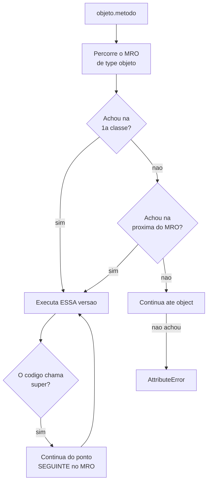

# 04.10 — Herança

> **Módulo 04 — Python Avançado** · Nível: N2 · Tempo estimado: 2h30 · Código: `codigo/cap10/`

## 1. Objetivo

- **Explicar** a cadeia de busca de atributos, e ler um MRO.
- **Aplicar** `super()` para estender comportamento em vez de substituí-lo.
- **Prever** qual método roda quando há várias classes na hierarquia.
- **Reconhecer** quando herança é a ferramenta errada — antes do capítulo que trata disso.

Ao final, `super().__init__()` deixa de ser uma linha copiada de exemplos: você sabe o que ela faz e o que quebra sem ela.

---

## 2. Pré-requisitos

- [04.07 — Classes e objetos](07-poo-classes-e-objetos.md) — a busca vai da instância para a classe; aqui ela continua subindo.
- [04.09 — Encapsulamento](09-encapsulamento-e-properties.md) — o `__nome` existe justamente para não colidir em herança.
- [04.08 — Métodos](08-atributos-metodos-e-self.md) — `cls` num `classmethod` é a classe da chamada, o que já era herança em ação.

**Autoteste:** (1) Onde o Python procura `objeto.x` quando a instância não tem? (2) Por que `_Base__estado` e `_Filha__estado` coexistem? (3) O que `ProdutoDigital.do_banco()` devolveu no 04.08, e por quê?

---

## 3. Motivação

A Aurora vende produtos físicos e digitais. Os dois têm nome, preço e descrição; só o frete difere — físico paga, digital não.

Sem herança, há duas saídas ruins. Duplicar a classe inteira, e manter as duas em sincronia para sempre. Ou pôr um `if` em cada método:

```python
def frete_centavos(self):
    if self.tipo == "digital":
        return 0
    return 2000
```

O `if` funciona com dois tipos e cresce com cada tipo novo — e ele aparece em **todo** método que difere, espalhando a mesma condição por dez lugares.

Herança oferece uma terceira saída: escrever só a diferença.

```python
class ProdutoDigital(Produto):
    def frete_centavos(self):
        return 0
```

Três linhas. Todo o resto — nome, preço, `descrever()` — vem da mãe sem uma linha escrita.

**E o capítulo tem uma segunda tese**, que aparece na §9: herança é poderosa e é a ferramenta mais usada onde não deveria. O 04.11 trata disso; este capítulo já planta o critério.

---

## 4. Modelo mental

Herança é **especialização**: a subclasse é um caso particular da mãe, e a frase que testa isso é *"todo X é um Y"*.

Todo produto digital **é um** produto. Todo cachorro **é um** animal. A frase soa natural, e é o sinal de que herança cabe.

A busca de atributos, que o 04.07 introduziu, agora tem mais um degrau:

1. `objeto.__dict__` — a instância;
2. `type(objeto).__dict__` — a classe;
3. **as ancestrais**, na ordem do **MRO**;
4. `AttributeError`.

```
MRO de ProdutoDigital: ['ProdutoDigital', 'Produto', 'object']
```

**MRO** é *Method Resolution Order* — a lista, em ordem, das classes onde o Python procura. Toda classe tem a sua, e `Classe.__mro__` a mostra. Ler o MRO é o que responde "qual método vai rodar" sem adivinhação.

E há três coisas que uma subclasse pode fazer com um método da mãe:

| Ação | Como | Quando |
|---|---|---|
| **herdar** | não escrever nada | o comportamento serve |
| **substituir** | redefinir o método | o comportamento é outro |
| **estender** | redefinir e chamar `super()` | o comportamento é o da mãe **mais** algo |

---

## 5. Analogia

Uma **franquia de restaurantes**.

A matriz define o cardápio, o padrão de atendimento e o sistema de caixa — é a classe base. Cada franquia **herda** tudo isso sem reescrever nada.

Uma franquia de aeroporto **substitui** o horário de funcionamento: 24 horas em vez de 11h às 23h. O método é redefinido por inteiro.

Uma franquia de shopping **estende** o cardápio: serve tudo o que a matriz serve **mais** duas sobremesas regionais. É o `super()` — ela chama a matriz e acrescenta.

E a analogia acerta no limite: **uma franquia é um restaurante**. Se alguém tentar herdar `Restaurante` para criar `Fornecedor` porque os dois têm CNPJ e endereço, a frase "todo fornecedor é um restaurante" soa errada — e é o sinal de que a relação é outra. O 04.11 nomeia esse erro.

---

## 6. Teoria

### 6.1 Herdar e substituir

```python
class ProdutoDigital(Produto):
    def frete_centavos(self):
        return 0
```

```
frete (sobrescrito): 0
frete da mãe:        2000
```

`ProdutoDigital` herda `__init__`, `descrever` e tudo mais; só `frete_centavos` foi redefinido. E a versão da mãe continua acessível: `Produto.frete_centavos(digital)` devolve 2000 — o método não foi apagado, foi **sombreado** pelo MRO, exatamente como um atributo de instância sombreia o de classe (04.08 §6.6).

### 6.2 `super()` no `__init__` — e o que quebra sem ele

```python
class ProdutoSemSuper(Produto):
    def __init__(self, nome, preco_centavos, tamanho_mb):
        self.tamanho_mb = tamanho_mb        # e o resto?
```

```
sem super() -> AttributeError: 'ProdutoSemSuper' object has no attribute 'nome'
```

**O `__init__` da mãe não roda sozinho.** Definir `__init__` na subclasse **substitui** o da mãe, como qualquer outro método — e o objeto nasce sem os atributos que a mãe definiria.

A correção:

```python
def __init__(self, nome, preco_centavos, tamanho_mb):
    super().__init__(nome, preco_centavos)      # a mãe primeiro
    self.tamanho_mb = tamanho_mb
```

**A ordem importa.** Chamar `super().__init__()` **antes** garante que os atributos da mãe existem quando o código da filha rodar — e se a filha tiver uma property que depende deles, a inversão quebra.

### 6.3 `super()` estende

```python
def descrever(self):
    return "%s (%d MB, sem frete)" % (super().descrever(), self.tamanho_mb)
```

```
mãe:   Ebook: R$ 49.90
filha: Ebook: R$ 49.90 (12 MB, sem frete)
```

Este é o uso mais valioso de `super()`: **aproveitar a implementação da mãe e acrescentar**, em vez de copiá-la. Se a mãe mudar o formato do preço, a filha acompanha sozinha.

**O contraste que vale registrar:** duplicar a lógica da mãe na filha funciona hoje e diverge amanhã. `super()` é o que mantém as duas em sincronia — e é a mesma razão pela qual valores derivados não se guardam (04.09 §6.4).

### 6.4 `isinstance` × `type`

```
isinstance(d, Produto):       True
type(d) is Produto:           False
issubclass(Digital, Produto): True
```

**`isinstance` aceita subclasses; `type() is` recusa.**

Isso torna `isinstance` quase sempre a escolha certa: uma função que verifica `type(x) is Produto` **rejeita** `ProdutoDigital`, que é um produto perfeitamente válido. É o oposto do que herança promete.

**A ressalva:** verificar tipo é frequentemente sinal de que falta polimorfismo. Em vez de

```python
if isinstance(p, ProdutoDigital):
    frete = 0
else:
    frete = 2000
```

escreva `p.frete_centavos()` e deixe cada classe responder. **O `if` sobre tipo é a cadeia de `if` da §3 voltando disfarçada** — e cada tipo novo exige editar todos eles.

### 6.5 Herança múltipla e o MRO

```python
class A: ...
class B(A): ...
class C(A): ...
class D(B, C): ...
```

```
D().quem(): D -> B -> C -> A
MRO de D:   ['D', 'B', 'C', 'A', 'object']
```

**A linha que surpreende:** o `super()` escrito **dentro de B** chamou **C**, não A. B não conhece C — as duas nem se referenciam. Quem decidiu foi o **MRO da instância**, que é `D`.

Isso reformula o que `super()` significa: ele **não** é "chame a classe mãe". É **"chame o próximo no MRO"** — e o próximo depende de quem instanciou, não de onde o código foi escrito.

O algoritmo que produz essa ordem (**C3 linearization**) garante três coisas: a subclasse vem antes das mães, a ordem de declaração é respeitada, e cada classe aparece **uma vez** — o que resolve o "problema do diamante", em que `A` seria inicializada duas vezes numa implementação ingênua.

⚠️ **Caixa-preta 1:** herança múltipla é usada de forma disciplinada num padrão chamado **mixin** — classes pequenas que acrescentam uma capacidade e não têm sentido sozinhas. Quando isso é boa arquitetura e quando é armadilha é o [04.11](11-composicao-vs-heranca.md).

### 6.6 O MRO impossível

```python
class X(B, A, C): pass
```

```
TypeError: Cannot create a consistent method resolution order (MRO) for bases A, C
```

Declarar `A` antes de `C` contradiz o MRO de `B` (que exige `A` **depois** de si e, por transitividade, depois de `C`). O Python **recusa a classe na definição**, não em tempo de execução.

**É um erro raro e bom de conhecer**, porque a mensagem não é evidente. Quando aparecer, a causa é sempre a mesma: a ordem das bases contradiz uma ordem já estabelecida numa delas.

⚠️ **Caixa-preta 2:** uma classe base pode declarar métodos que as filhas **precisam** implementar, e recusar a criação de quem não implementou. É `abc.ABC` com `@abstractmethod`, e ele aparece no 04.11 junto com a discussão de interfaces.

---

## 7. Funcionamento interno

`Classe.__mro__` é uma tupla calculada na criação da classe pelo algoritmo **C3**, que lineariza o grafo de herança respeitando: (1) a classe vem antes das bases; (2) a ordem das bases é preservada; (3) a ordem local de cada base é preservada. Quando não há linearização possível, o `TypeError` da §6.6.

`objeto.atributo` percorre `type(objeto).__mro__` na ordem, olhando o `__dict__` de cada classe. **A busca para no primeiro achado** — é isso que "sobrescrever" significa mecanicamente.

`super()` sem argumentos é açúcar para `super(__class__, self)`, onde `__class__` é a classe **onde o código foi escrito**. Ele devolve um objeto que procura a partir da posição **seguinte** à dessa classe no MRO de `type(self)` — e é exatamente por isso que o `super()` de B alcança C.

---

## 8. Visualização do fluxo



**Como ler:** a caixa `I` é o que a maioria das explicações erra. `super()` não sobe para "a mãe" — ele **continua a mesma lista**, a partir de onde parou. Por isso o `super()` de B alcança C num diamante: as duas estão na mesma lista, e C vem depois de B.

---

## 9. Aplicação prática

**A dor da Aurora.** Cinco tipos de produto: físico, digital, assinatura, serviço e kit. Cada um difere em frete, prazo e regra de devolução.

A herança que ocorre primeiro:

```python
class Produto: ...
class ProdutoFisico(Produto): ...
class ProdutoDigital(Produto): ...
class Assinatura(Produto): ...
class Servico(Produto): ...
class Kit(Produto): ...
```

Funciona, e **começa a rachar quando aparece a sexta combinação**: um kit que contém digitais e físicos. Ele é `Kit`? É `ProdutoFisico`? Precisa de `KitMisto(Kit, ProdutoFisico)`?

**O sintoma de que a hierarquia está errada:** você precisa de uma classe para cada **combinação** de características, e o número cresce multiplicativamente. Com três características binárias, são oito classes.

**A saída não é herança melhor — é composição:**

```python
class Produto:
    def __init__(self, nome, preco_centavos, politica_frete, politica_devolucao):
        self.politica_frete = politica_frete
        ...

    def frete_centavos(self):
        return self.politica_frete.calcular(self)
```

Agora frete e devolução são **objetos que se combinam**, e um kit misto é um `Produto` com a política de frete apropriada — nenhuma classe nova.

**A ressalva honesta, e ela vale nos dois sentidos.** Para **dois** tipos com uma diferença — físico e digital, só o frete —, a herança da §3 é melhor: três linhas contra uma arquitetura de políticas. **Não troque três linhas por um padrão de projeto.**

**A regra prática que separa:** herança para **um eixo** de variação com poucos casos; composição a partir de **dois eixos** ou quando as características se combinam. E o teste que detecta o problema cedo: se você já escreveu uma classe cujo nome é a **junção** de duas características (`KitDigitalComAssinatura`), a hierarquia estourou.

---

## 10. Código comentado

`codigo/cap10/heranca.py` roda as seis cenas. Três valem comentário.

**A cena [2] cria uma classe errada de propósito** — `ProdutoSemSuper`. Ver o `AttributeError: no attribute 'nome'` num objeto recém-criado é o que fixa a lição: definir `__init__` na filha **substitui** o da mãe, e nada acontece automaticamente.

**A cena [5] é o coração do capítulo.** `D -> B -> C -> A` com o MRO impresso ao lado prova que `super()` segue a lista, não a herança escrita. Vale rodar antes de ler a §6.5 — a saída ensina mais rápido que a explicação.

**A cena [6] usa `type("X", (B, A, C), {})`** em vez de um `class` — porque um `class` com MRO impossível quebraria o arquivo na **importação**, antes de qualquer cena rodar. É a mesma técnica dos comandos comentados nos arquivos `.sql` do módulo 03: o erro precisa acontecer **dentro** do fluxo controlado.

---

## 11. Erros comuns

**1. Esquecer `super().__init__()`.** O objeto nasce sem os atributos da mãe.

**2. Chamar `super()` depois do código da filha.** Se a filha depender de atributos da mãe, quebra.

**3. `type(x) is Classe` em vez de `isinstance`.** Rejeita subclasses — o oposto do que herança promete.

**4. `if isinstance(...)` para escolher comportamento.** É a cadeia de `if` disfarçada; use polimorfismo.

**5. Copiar o corpo da mãe na filha.** Funciona hoje, diverge amanhã. `super()` mantém em sincronia.

**6. Achar que `super()` é "a classe mãe".** É "o próximo no MRO", e num diamante isso é outra coisa.

**7. Hierarquia com uma classe por combinação.** `KitDigitalComAssinatura` é o sinal.

**8. Herdar por reúso de código, não por especialização.** Se "todo X é um Y" soa errado, a relação é outra.

---

## 12. Boas práticas

- **`super().__init__()` primeiro**, antes do código da filha.
- **`super()` sem argumentos** — a forma com argumentos é legado do Python 2.
- **Estenda com `super()`** em vez de copiar o corpo da mãe.
- **`isinstance`, nunca `type() is`** — e melhor ainda: polimorfismo em vez de verificar tipo.
- **Leia o `__mro__`** quando não souber qual método vai rodar. É uma linha.
- **Aplique o teste "todo X é um Y"** antes de herdar.
- **Hierarquias rasas.** Três níveis já é sinal de alerta.
- **Herança para um eixo de variação**; dois eixos pedem composição.

---

## 13. Performance

Cada nível de herança acrescenta uma classe ao MRO, e a busca de um atributo herdado percorre a lista até encontrá-lo. A diferença é de nanossegundos e o Python cacheia a resolução por tipo, então hierarquias rasas não custam nada mensurável.

`super()` sem argumentos tem um custo pequeno a mais que a chamada direta, porque precisa localizar a posição atual no MRO. Irrelevante fora de laços quentes.

**O custo real da herança não é de execução, é de compreensão.** Para saber o que `objeto.metodo()` faz numa hierarquia de quatro níveis, é preciso ler quatro classes — e é esse custo, e não o de CPU, que justifica hierarquias rasas.

---

## 14. Mercado

Herança foi vendida nos anos 1990 como o mecanismo central de reúso, e a experiência coletiva desde então foi mais modesta: ela funciona bem para **especialização** e mal para **reúso de código**. O conselho "prefira composição a herança" é hoje quase consenso, e o 04.11 o examina com honestidade.

Onde herança continua sendo a resposta certa: frameworks. `class MinhaView(APIView)`, `class Config(BaseSettings)`, `class Modelo(BaseModel)` — o framework define o esqueleto e você preenche as diferenças. É especialização legítima, e você vai usá-la muito no módulo 06.

Em revisão de código, dois sinais chamam atenção: hierarquias de quatro ou mais níveis, e classes cujo nome junta características. O primeiro dificulta rastrear comportamento; o segundo indica que a hierarquia estourou.

---

## 15. Entrevistas

- **"O que `super()` faz?"** Chama **o próximo no MRO** — não "a classe mãe". A diferença aparece em herança múltipla, e citar isso separa.
- **"O que é MRO?"** A ordem em que o Python procura métodos. `Classe.__mro__` mostra; C3 calcula.
- **"O que acontece se eu esquecer `super().__init__()`?"** O objeto nasce sem os atributos da mãe, e falha com `AttributeError` no primeiro uso.
- **"`isinstance` ou `type()`?"** `isinstance`, porque aceita subclasses. E a resposta madura acrescenta: verificar tipo costuma indicar polimorfismo faltando.
- **"Quando NÃO usar herança?"** Quando "todo X é um Y" soa errado; quando você precisa de uma classe por combinação de características; quando o motivo é reúso de código, não especialização.

---

## 16. Exercícios guiados

Em [`exercicios/cap10.md`](exercicios/cap10.md):

- **A1** `[~10 min · prevê a saída]` — 6 hierarquias, qual método roda.
- **A2** `[~10 min · leia o MRO]` — 5 hierarquias para linearizar à mão.
- **A3** `[~10 min · ache o erro]` — 6 heranças defeituosas.
- **A4** `[~10 min · herdar, substituir ou estender?]` — 6 casos.
- **AP1** `[~20 min · a hierarquia da Aurora]` — Três tipos de produto.
- **AP2** `[~25 min · o diamante]` — Construa, preveja e confirme.
- **AP3** `[~20 min · polimorfismo × isinstance]` — Elimine a cadeia de `if`.
- **D1** `[~45 min · a hierarquia que estoura]` — **Encontre o ponto de ruptura.**

---

## 17. Desafios

**D1 — A hierarquia que estoura.** Modele os cinco tipos de produto da §9 com herança. Depois acrescente, um de cada vez: (a) um kit que contém digitais e físicos; (b) uma assinatura que também é digital; (c) um serviço com entrega física de material.

Para cada acréscimo: mostre a classe nova que ele exige, conte quantas classes a hierarquia tem, e diga se algum método precisou de `isinstance`.

**A entrega que vale o desafio:** identifique o **ponto exato** em que a hierarquia deixou de compensar, e escreva a versão com composição a partir dali. Não converta tudo desde o início — o exercício é sobre reconhecer o momento, não sobre evitar herança.

---

## 18. Mini projeto

**Os relatórios da Aurora.** Modele uma hierarquia de relatórios: `Relatorio` (base) com `gerar()`, e as especializações `RelatorioTexto`, `RelatorioCSV` e `RelatorioHTML`.

Requisitos: a base define o **esqueleto** (`cabecalho()`, `corpo()`, `rodape()`, e um `gerar()` que os chama na ordem); cada filha sobrescreve só o que difere; `RelatorioHTML` **estende** o cabeçalho da base com `super()`; e nenhum `isinstance` em lugar nenhum.

E a pergunta que fecha: esse padrão — base com esqueleto, filhas preenchendo lacunas — tem nome (*template method*). Onde você já o viu neste manual? E qual o custo dele quando uma filha precisa mudar a **ordem** das etapas?

---

## 19. Revisão

**Resumo em 5 frases.** Herança é **especialização**, e o teste é a frase "todo X é um Y" — se ela soa errada, a relação é outra. A busca de atributos percorre o **MRO**, a lista ordenada de classes que `Classe.__mro__` mostra, e para no primeiro achado — que é o que "sobrescrever" significa mecanicamente. `super()` **não** é "a classe mãe": é "o próximo no MRO", e num diamante o `super()` escrito em `B` alcança `C`, uma classe que `B` sequer conhece. Definir `__init__` na filha **substitui** o da mãe, então `super().__init__()` é obrigatório e vem primeiro — sem ele, o objeto nasce sem os atributos que a mãe definiria. E o sinal de que a hierarquia estourou é contável: quando você precisa de uma classe por **combinação** de características, o número cresce multiplicativamente, e a saída é composição.

**Flashcards** (também em [`revisao/flashcards.md`](revisao/flashcards.md)):

| ID | Frente | Verso |
|---|---|---|
| 04.10-F1 | O que `super()` faz, exatamente? | Chama **o próximo no MRO** — não "a classe mãe". `super()` sem argumentos é `super(__class__, self)`, e procura a partir da posição **seguinte** à da classe onde o código foi escrito, no MRO de `type(self)`. |
| 04.10-F2 | Explique com suas palavras por que, num diamante `D(B, C)`, o `super()` de `B` chama `C`. | (Elaboração) `B` e `C` estão na mesma lista — o MRO de `D` é `[D, B, C, A, object]`. `super()` continua a lista a partir de `B`, e o próximo é `C`. **`B` não conhece `C`**; quem decidiu foi o MRO da instância. |
| 04.10-F3 | Preveja: uma subclasse define `__init__` e não chama `super()`. O que acontece? | (Previsão) O `__init__` da mãe **não roda**, e o objeto nasce sem os atributos dela: `AttributeError: object has no attribute 'nome'` no primeiro uso. Definir um método na filha **substitui** o da mãe, sem exceção. |
| 04.10-F4 | `isinstance` ou `type() is`? | (Decisão) **`isinstance`** — `type(x) is Produto` **rejeita** `ProdutoDigital`, que é um produto válido. E a resposta madura: verificar tipo para escolher comportamento costuma indicar **polimorfismo faltando** — use `p.frete()` e deixe cada classe responder. |
| 04.10-F5 | Qual o sinal de que uma hierarquia estourou? | Uma classe por **combinação** de características — `KitDigitalComAssinatura`. Com três características binárias, oito classes. A saída é composição: as características viram **objetos que se combinam**, e nenhuma classe nova é necessária. |

**Revisão espaçada:** D+1 refaça A1 e A2 · D+7 o AP2 (o diamante) · D+30 explique em voz alta por que `super()` de `B` alcança `C`.

---

## 20. Checklist

- [ ] Criei uma subclasse que herda, uma que substitui e uma que estende.
- [ ] Vi o `AttributeError` de esquecer `super().__init__()`.
- [ ] Li um `__mro__` e previ qual método rodaria.
- [ ] Construí um diamante e confirmei a ordem `D -> B -> C -> A`.
- [ ] Sei que `super()` é "o próximo no MRO", não "a mãe".
- [ ] Sei por que `isinstance` é melhor que `type() is`.
- [ ] Substituí uma cadeia de `if isinstance` por polimorfismo.
- [ ] Aplico o teste "todo X é um Y" antes de herdar.
- [ ] Reconheço o sinal de hierarquia estourada.

---

## 21. Próximo capítulo

[04.11 — Composição vs. herança](11-composicao-vs-heranca.md). Este capítulo terminou reconhecendo que a hierarquia da Aurora estoura com cinco tipos e duas características. O próximo trata da alternativa com honestidade — inclusive dos casos em que "prefira composição a herança", repetido como regra, é o conselho errado.
