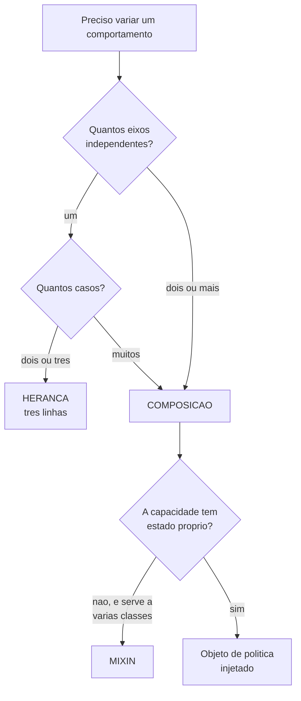

# 04.11 — Composição vs. herança

> **Módulo 04 — Python Avançado** · Nível: N2 · Tempo estimado: 2h30 · Código: `codigo/cap11/`

## 1. Objetivo

- **Justificar** a escolha entre compor e herdar com uma **contagem**, não com uma preferência.
- **Implementar** comportamento como objeto injetado (política/estratégia).
- **Reconhecer** o mixin como o uso legítimo de herança múltipla.
- **Avaliar** criticamente o conselho "prefira composição a herança".

Ao final, você decide entre as duas com um critério que cabe numa frase — e sabe defender a escolha contrária quando ela for melhor.

---

## 2. Pré-requisitos

- [04.10 — Herança](10-heranca.md) — **obrigatório**: o D1 de lá terminou identificando o ponto de ruptura; este capítulo parte dali.
- [04.02 — Funções como valores](02-funcoes-como-valores.md) — o despacho por dicionário já era composição de comportamento.
- [04.03 — Closures](03-closures-e-fabricas.md) — as fábricas de filtros do §9 são a mesma ideia sem classes.

**Autoteste:** (1) Qual foi o ponto de ruptura da hierarquia no 04.10/D1? (2) Quantas classes uma hierarquia precisa para 3 características binárias? (3) O que o despacho por dicionário do 04.02 tem a ver com isso?

---

## 3. Motivação

"Prefira composição a herança" é o conselho mais repetido de POO, e o 04.10 já disse que ele é útil e incompleto. Este capítulo completa.

O argumento decisivo não é filosófico — é aritmético:

```
1 característica: herança até  2 classes · composição 1 objeto
2 características: herança até  4 classes · composição 2 objetos
3 características: herança até  8 classes · composição 3 objetos
4 características: herança até 16 classes · composição 4 objetos
```

**Herança cresce multiplicativamente; composição cresce somando.** Com quatro características que se combinam livremente, são 16 classes contra 4 objetos.

E há um segundo argumento, pior e menos citado. Quando duas características viram herança múltipla, **o MRO decide por você**:

```
DigitalImportado.frete_centavos() -> 0

MRO: [DigitalImportado, Digital, Importado, Produto, object]
```

`Digital` veio primeiro e ganhou. O frete de importado — 5000 — **nunca é consultado**. Nenhum erro, nenhum aviso: trocar a ordem das bases muda o resultado do sistema, e nada na chamada indica isso.

---

## 4. Modelo mental

A distinção cabe em duas frases:

| | Herança | Composição |
|---|---|---|
| Relação | "**é um**" | "**tem um**" |
| Define | que **coisa** o objeto é | como ele **se comporta** |
| Decidido | na escrita da classe | na **criação** do objeto |
| Trocar em execução | impossível | uma atribuição |
| Cresce | multiplicando | somando |

**O teste que decide, e ele é contável:** quantos **eixos de variação independentes** existem?

- **Um eixo** (só o frete difere) → herança. Duas classes, três linhas.
- **Dois ou mais** (frete **e** devolução **e** prazo, combinando livremente) → composição.

E o sinal de que você errou o lado: uma classe cujo nome é a **junção** de duas características. `DigitalImportado`, `KitComAssinatura`. Foi o critério do 04.10/D1, e aqui ele ganha a contagem que o justifica.

---

## 5. Analogia

Um **carro**.

Herança: um carro **é um** veículo. Um caminhão **é um** veículo. A relação é de tipo, e ela não muda — nenhum carro vira caminhão em tempo de execução.

Composição: um carro **tem um** motor, **tem** pneus, **tem um** som. E aqui a diferença fica concreta: você **troca** o motor sem trocar o carro. O carro continua sendo o mesmo objeto, com outro comportamento.

A explosão combinatória, na mesma analogia: se motor (2 tipos), câmbio (2) e tração (2) fossem herança, seriam oito modelos de fábrica — `CarroFlexAutomaticoTracao4x4`. Como são peças, são três escolhas independentes na linha de montagem.

**E o caso do mixin:** o **ar-condicionado** não é um tipo de carro nem exatamente uma peça central — é uma capacidade que se acrescenta, faz sentido em vários veículos, e não existe sozinha. É isso que um mixin é.

---

## 6. Teoria

### 6.1 Composição em três linhas

```python
class FreteGratis:
    def calcular(self, produto):
        return 0


class Produto:
    def __init__(self, nome, preco_centavos, politica_frete=None):
        self._politica_frete = politica_frete or FreteFixo(2000)

    def frete_centavos(self):
        return self._politica_frete.calcular(self)
```

```
digital:   0
importado: 5000
por peso:  1500
```

Três comportamentos, **uma** classe `Produto`. A combinação é escolhida na criação:

```python
Produto("Ebook", 4990, FreteGratis())
Produto("Monitor", 89900, FretePorPeso(), peso_kg=3)
```

**O que mudou conceitualmente:** o comportamento deixou de ser uma propriedade do **tipo** e virou um **valor** que o objeto carrega. É a mesma transformação do 04.02 (funções viram valores) e do 04.03 (filtros viram objetos) — o terceiro contexto do mesmo movimento.

Esse padrão tem nome — **Strategy** —, e reconhecê-lo ajuda a ler código alheio. Mas o nome é menos importante que a mecânica: **comportamento injetado em vez de herdado.**

### 6.2 O que a composição permite e a herança não

**Trocar em tempo de execução:**

```python
produto._politica_frete = FreteGratis()     # promoção começou
```

Com herança, isso exigiria criar um objeto novo de outra classe — e perder a identidade do original.

**Testar isoladamente.** `FretePorPeso().calcular(produto_falso)` testa a política sem construir a hierarquia inteira.

**Combinar sem multiplicar.** Frete, devolução e prazo são três atributos independentes; a herança precisaria de até oito classes para as mesmas combinações.

### 6.3 Duck typing — a política nem precisa de classe

```
função como política -> barato: 1500 · caro: 0
```

Python não exige que as políticas compartilhem uma classe base. Qualquer objeto com o método certo serve — e uma **função** serve também, se o código aceitar.

**Isso é *duck typing***: "se anda como pato e grasna como pato, é um pato". O que importa é o **comportamento**, não a linhagem.

**E é aqui que Python difere de Java na prática.** Em linguagens com tipagem nominal, a política precisaria implementar uma interface declarada. Em Python, a interface é implícita — o que dá flexibilidade e cobra um preço: **nada avisa se você passar um objeto sem o método**, até a chamada acontecer.

A resposta a esse preço tem nome e é opcional: `abc.ABC` com `@abstractmethod` declara uma base que **recusa** subclasses incompletas. Vale quando a interface é pública e a mensagem de erro cedo importa.

⚠️ **Caixa-preta 1:** existe uma forma de declarar "qualquer coisa com um método `calcular`" que ferramentas de tipo conseguem verificar — `typing.Protocol`, que casa duck typing com verificação estática. É o [04.14](14-type-hints.md).

### 6.4 Mixins — o uso legítimo de herança múltipla

```python
class SerializavelJSON:
    def para_json(self):
        return json.dumps({c: v for c, v in self.__dict__.items()
                           if not c.startswith("_")})


class ProdutoComMixins(SerializavelJSON, Comparavel):
    def __init__(self, nome, preco_centavos):
        ...
```

```
para_json(): {"nome": "Mouse", "preco_centavos": 8990}
igualdade:  True
MRO: [ProdutoComMixins, SerializavelJSON, Comparavel, object]
```

Um **mixin** é uma classe que:

- acrescenta **uma** capacidade;
- **não tem `__init__`** nem estado próprio;
- **não faz sentido instanciada sozinha**;
- não representa um "é um" — `Produto` não *é um* `SerializavelJSON`.

**Por que isso é herança múltipla disciplinada:** não há diamante, não há competição pelo mesmo método, e o MRO é linear e previsível. Os problemas da §3 aparecem quando duas bases disputam o **mesmo** método — e mixins bem projetados não disputam.

**O sinal de que deixou de ser mixin:** ele ganhou `__init__`, ou passou a depender de atributos que só algumas classes hospedeiras têm. Aí é uma classe base disfarçada, com todos os problemas da herança múltipla.

### 6.5 O híbrido — o que se entrega na prática

```python
class ProdutoFisico(Produto):
    def __init__(self, nome, preco_centavos, peso_kg, politica_frete=None):
        super().__init__(nome, preco_centavos,
                         politica_frete or FretePorPeso())
        self.peso_kg = peso_kg
```

```
ProdutoFisico (herança: tem peso_kg): 1500
o mesmo, com política trocada:           0
```

**Herança para "que coisa é"; composição para "como se comporta".**

`ProdutoFisico` é uma subclasse legítima porque tem um **campo próprio** (`peso_kg`) que só ele tem — isso é especialização genuína. Mas o frete continua sendo uma política injetada, com um padrão sensato e a possibilidade de trocar.

**Este é o desenho que eu entregaria**, e a razão de a §9 do 04.10 chamar a conversão total de "trocar três linhas por um padrão de projeto". A escolha não é binária.

### 6.6 Quando herança é a resposta certa

Três casos em que compor seria pior:

**Um eixo, poucos casos.** Físico e digital, só o frete difere. Três linhas de herança contra uma arquitetura de políticas — **não troque três linhas por um padrão**.

**Frameworks.** `class Config(BaseSettings)`, `class Usuario(BaseModel)`, `class MinhaView(APIView)`. O framework define o esqueleto e você preenche as diferenças. É especialização legítima, e tentar compor ali significa lutar contra a ferramenta.

**Quando a relação é mesmo "é um" e estável.** `ValueError(Exception)`, `int(object)`. Hierarquias de tipos que não se combinam entre si.

⚠️ **Caixa-preta 2:** o híbrido da §6.5 tem quatro linhas de `self.x = x` no `__init__` e não imprime bem. Uma linha resolve as duas coisas — `@dataclass` —, e ela também gera `__eq__`, tornando o mixin `Comparavel` desnecessário. É o [04.13](13-dataclasses.md).

---

## 7. Funcionamento interno

Composição é acesso a atributo comum: `self._politica.calcular(self)` são duas buscas (a política, depois o método) e uma chamada. Não há mecanismo especial.

Herança usa o MRO (04.10 §7): a busca percorre a lista e para no primeiro achado. **É exatamente essa mecânica que produz o problema da §3** — em `DigitalImportado`, `Digital` vem antes de `Importado` no MRO, e a busca por `frete_centavos` para nela.

O custo dessa escolha silenciosa é o que o capítulo argumenta: a herança múltipla **resolve** o conflito, e resolver não é o mesmo que decidir. A composição obriga alguém a decidir explicitamente, na criação.

---

## 8. Visualização do fluxo



**Como ler:** a caixa `D` é a que costuma faltar nos fluxogramas sobre o tema — **um eixo com dois casos é herança**, e converter isso em composição é complexidade sem retorno. O ramo `B → E` direto é a explosão combinatória: a partir de dois eixos, não há contagem que favoreça herança.

---

## 9. Aplicação prática

**A dor da Aurora, continuada.** O 04.10/D1 chegou a oito classes com três características. Aqui, a conversão:

```python
class Produto:
    def __init__(self, nome, preco_centavos,
                 politica_frete=None, politica_devolucao=None):
        self._politica_frete = politica_frete or FreteFixo(2000)
        self._politica_devolucao = politica_devolucao or Devolucao30Dias()
```

Um kit misto com frete por peso e devolução estendida:

```python
Produto("Kit gamer", 250000,
        politica_frete=FretePorPeso(),
        politica_devolucao=Devolucao90Dias())
```

**Zero classes novas.** E acrescentar uma quarta característica — digamos, política de garantia — custa **um** parâmetro, não dobra a hierarquia.

**As três ressalvas honestas, que são o valor desta seção.**

**A composição custa indireção.** `produto.frete_centavos()` agora significa "chame a política, que chama de volta o produto". Ler o código exige seguir uma referência a mais, e depurar exige entrar em duas funções.

**A composição custa construção.** Criar um produto passou a exigir escolher (ou aceitar padrões para) três políticas. É mais verboso na chamada — e a saída, construtores nomeados (04.08), acrescenta código.

**A composição não elimina a decisão, ela a move.** Alguém ainda precisa saber que um kit misto usa `FretePorPeso`. Com herança, isso estava na classe; com composição, está em quem cria — o que costuma ser melhor (é explícito) e pode ficar espalhado se não houver um lugar centralizado.

**A regra que fecha:** composição a partir de dois eixos, e mesmo aí, mantenha herança onde houver campos próprios. O híbrido é a resposta usual.

---

## 10. Código comentado

`codigo/cap11/composicao.py` roda as seis cenas. Três valem comentário.

**A cena [2] é o argumento mais forte do capítulo**, e é curta: `DigitalImportado.frete_centavos()` devolve `0`, e o `5000` do importado nunca aparece. Imprimir o MRO ao lado mostra por quê — `Digital` vem primeiro. **Ninguém decidiu isso; a ordem das bases decidiu.**

**A cena [4] passa uma função onde o código espera um objeto** e funciona. É duck typing em três linhas, e prepara o `Protocol` do 04.14.

**A cena [6] cria o mesmo `ProdutoFisico` duas vezes**, uma com a política padrão e outra com `FreteGratis`. Ver 1500 e 0 no mesmo tipo é o que torna concreta a frase "herança para o que é, composição para como se comporta".

---

## 11. Erros comuns

**1. Converter tudo em composição.** Para um eixo com dois casos, herança é melhor.

**2. Herança múltipla para combinar características.** O MRO escolhe por você, em silêncio.

**3. Mixin com `__init__` ou estado.** Deixou de ser mixin; virou classe base disfarçada.

**4. Mixin que depende de atributos da hospedeira.** Acopla sem declarar.

**5. Política sem padrão sensato.** Obriga todo chamador a escolher, inclusive no caso comum.

**6. Achar que composição elimina a decisão.** Ela só a move para quem cria.

**7. Interface implícita numa API pública.** Sem `ABC` ou `Protocol`, o erro aparece tarde.

**8. Repetir "prefira composição" sem a contagem.** O conselho sem o critério vira dogma.

---

## 12. Boas práticas

- **Conte os eixos** antes de decidir. Um eixo com poucos casos, herança.
- **Herança para campos próprios; composição para comportamento que varia.**
- **Padrão sensato em toda política** — o caso comum não deve exigir escolha.
- **Mixin sem `__init__`, sem estado, uma capacidade.**
- **Nomeie a política pelo que ela faz** (`FretePorPeso`), não pelo tipo que a usa.
- **Use `Protocol` ou `ABC`** quando a interface for pública.
- **Centralize a montagem** — uma fábrica que sabe quais políticas cada tipo usa.
- **Não converta antes de precisar.** A refatoração de herança para composição é barata; a complexidade prematura, não.

---

## 13. Performance

Composição custa uma indireção a mais por chamada: buscar a política e depois o método, em vez de resolver pelo MRO. São dezenas de nanossegundos — irrelevante fora de laço quente.

Em memória, cada objeto carrega referências às políticas. Se as políticas são **sem estado** (como `FreteGratis`), vale compartilhar uma única instância entre todos os produtos, em vez de criar uma por objeto — é o que uma constante de módulo resolve.

**E o custo que importa não é de máquina.** Herança tem custo de **compreensão** (ler quatro classes para entender um método); composição tem custo de **rastreio** (seguir a referência para descobrir qual política está lá). Os dois são pagos por quem lê, e é por isso que a decisão se justifica pela contagem, não pelo benchmark.

---

## 14. Mercado

"Prefira composição a herança" vem de *Design Patterns* (1994) e virou senso comum — com razão: hierarquias profundas foram a principal fonte de arrependimento arquitetural dos anos 1990 e 2000.

Em Python, o conselho pega de forma peculiar, porque **duck typing torna composição mais barata** do que em linguagens de tipagem nominal: não é preciso declarar interface, e uma função serve como estratégia. Isso desloca o equilíbrio a favor de compor.

E há uma contracorrente que vale conhecer: frameworks Python modernos são fortemente baseados em herança — `BaseModel` (Pydantic), `BaseSettings`, `TestCase`, `APIView`. Quem repete "nunca use herança" tem dificuldade de explicar por que as bibliotecas que mais admira a usam. **A resposta é a da §6.6:** ali há um eixo só, e o framework define o esqueleto.

Em revisão de código, dois sinais chamam atenção em direções opostas: herança múltipla que não é mixin, e uma arquitetura de políticas para dois casos fixos. Os dois são a mesma falha — escolher sem contar.

---

## 15. Entrevistas

- **"Composição ou herança?"** A resposta forte não é uma preferência: é a **contagem de eixos**. Um eixo com poucos casos, herança; dois ou mais, composição. E cite o crescimento: 2ⁿ contra n.
- **"O que é um mixin?"** Classe que acrescenta uma capacidade, sem estado e sem sentido sozinha. Não é "é um".
- **"Qual o problema de herança múltipla?"** O MRO resolve conflitos **em silêncio**: `DigitalImportado` devolve o frete de `Digital`, e trocar a ordem das bases muda o sistema.
- **"O que é duck typing?"** O que importa é o comportamento, não a classe base. Uma função serve como estratégia. E o preço: nada avisa antes da chamada — daí `Protocol` e `ABC`.
- **"Quando herança é a resposta certa?"** Um eixo, poucos casos, relação "é um" estável — e **frameworks**, onde o esqueleto é do framework e você preenche.

---

## 16. Exercícios guiados

Em [`exercicios/cap11.md`](exercicios/cap11.md):

- **A1** `[~10 min · conte os eixos]` — 6 cenários, herança ou composição?
- **A2** `[~10 min · é mixin?]` — 6 classes para classificar.
- **A3** `[~10 min · prevê a saída]` — 5 casos de herança múltipla.
- **A4** `[~10 min · ache o erro]` — 6 desenhos defeituosos.
- **AP1** `[~20 min · a política]` — Converta uma hierarquia em estratégias.
- **AP2** `[~25 min · o mixin]` — Três mixins, e o teste de que são mixins.
- **AP3** `[~20 min · o híbrido]` — Onde manter herança, onde compor.
- **D1** `[~50 min · o relatório configurável]` — **Quatro eixos, e a conta.**

---

## 17. Desafios

**D1 — O relatório configurável.** Um relatório da Aurora varia em quatro eixos independentes: **formato** (texto, CSV, HTML), **filtro** (todos, ativos, por categoria), **ordenação** (nome, preço, categoria) e **destino** (tela, arquivo, e-mail).

- **(a)** conte quantas classes a herança exigiria para todas as combinações;
- **(b)** implemente com composição, e conte os objetos;
- **(c)** monte três relatórios diferentes sem escrever nenhuma classe nova;
- **(d)** acrescente um quinto eixo (idioma) e diga o que mudou nas duas abordagens;
- **(e)** identifique **um** dos quatro eixos que ficaria melhor como herança, e justifique.

**Fecho:** 5 linhas sobre o custo que a composição cobrou — em linhas de código, em indireção e em quem precisa saber montar.

---

## 18. Mini projeto

**O exportador da Aurora.** Construa um sistema de exportação de produtos com composição: `Exportador(fonte, transformacoes, formatador, destino)`.

Requisitos: `fonte` é o banco do módulo 03; `transformacoes` é uma **lista** de callables aplicados em sequência (o pipeline do 04.02/D1); `formatador` e `destino` são políticas injetadas; e nenhuma classe do sistema usa `isinstance`.

E a parte que ensina: escreva também a versão com herança (`ExportadorCSVParaArquivo`, `ExportadorJSONParaAPI`…), conte as classes, e responda — **em que ponto a versão com herança ficaria mais legível?** Encontre o caso; ele existe.

---

## 19. Revisão

**Resumo em 5 frases.** A escolha entre compor e herdar se decide por **contagem**, não por preferência: um eixo de variação com poucos casos pede herança; dois ou mais pedem composição, porque herança cresce como 2ⁿ e composição como n. Herança múltipla para combinar características tem um custo pior que o número de classes: **o MRO resolve o conflito em silêncio** — `DigitalImportado` devolve o frete de `Digital`, e o de `Importado` nunca é consultado. Composição transforma comportamento em **valor injetado**, o que permite trocar em execução, testar isolado e combinar sem multiplicar — e em Python é ainda mais barata, porque duck typing dispensa classe base e aceita até uma função. Um **mixin** é o uso legítimo de herança múltipla: uma capacidade, sem `__init__`, sem estado, e sem relação "é um". E a resposta usual não é escolher um lado: **herança para o que o objeto é (campos próprios), composição para como ele se comporta** — com a ressalva de que composição cobra indireção, verbosidade na construção, e move a decisão para quem cria em vez de eliminá-la.

**Flashcards** (também em [`revisao/flashcards.md`](revisao/flashcards.md)):

| ID | Frente | Verso |
|---|---|---|
| 04.11-F1 | Qual o critério para escolher entre composição e herança? | **A contagem de eixos de variação independentes.** Um eixo com poucos casos → herança (três linhas). Dois ou mais → composição. Herança cresce **2ⁿ**; composição, **n**. |
| 04.11-F2 | Explique com suas palavras o problema de combinar características com herança múltipla. | (Elaboração) O MRO **resolve o conflito em silêncio**. `DigitalImportado(Digital, Importado)` devolve o frete de `Digital` porque ela vem antes; o `5000` de `Importado` nunca é consultado. Trocar a ordem das bases muda o sistema, sem erro nem aviso. |
| 04.11-F3 | Preveja: uma função passada onde o código espera um objeto de política. Funciona? | (Previsão) **Sim**, se o código não exigir classe base — é *duck typing*: importa o comportamento, não a linhagem. O preço: **nada avisa** se o objeto não tiver o método, até a chamada. `Protocol` (04.14) e `ABC` resolvem. |
| 04.11-F4 | O que é um mixin, e quando deixa de ser? | Uma classe que dá **uma** capacidade, sem `__init__`, sem estado, sem sentido sozinha, e sem relação "é um". **Deixa de ser** quando ganha `__init__` ou passa a depender de atributos da hospedeira — aí é classe base disfarçada. |
| 04.11-F5 | Quando herança é a resposta certa? | (Decisão) Um eixo com dois ou três casos (não troque três linhas por um padrão); **frameworks**, onde o esqueleto é deles e você preenche (`BaseModel`, `APIView`); e relações "é um" estáveis que não se combinam. |

**Revisão espaçada:** D+1 refaça A1 e A3 · D+7 o AP1 (conversão para políticas) · D+30 explique a contagem 2ⁿ × n em voz alta.

---

## 20. Checklist

- [ ] Sei contar os eixos de variação de um problema.
- [ ] Vi o MRO decidir um conflito em silêncio.
- [ ] Converti uma hierarquia em políticas injetadas.
- [ ] Passei uma função como política e funcionou.
- [ ] Escrevi um mixin e sei o que o desqualificaria.
- [ ] Construí o híbrido: herança para campos, composição para comportamento.
- [ ] Sei enunciar as três ressalvas contra composição.
- [ ] Sei dizer três casos em que herança é a resposta certa.

---

## 21. Próximo capítulo

[04.12 — Métodos especiais (dunder)](12-metodos-especiais.md). O mixin `Comparavel` deste capítulo definiu `__eq__` — um método que **você não chama**, e que a linguagem chama por você quando alguém escreve `a == b`. O próximo capítulo abre essa família inteira: `__repr__`, `__len__`, `__getitem__` e os outros que fazem os seus objetos se comportarem como os embutidos.
