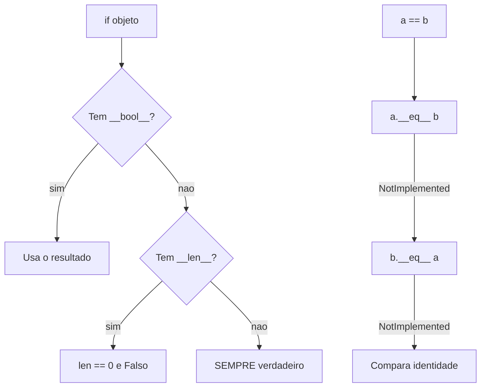

# 04.12 — Métodos especiais (dunder)

> **Módulo 04 — Python Avançado** · Nível: N2 · Tempo estimado: 2h30 · Código: `codigo/cap12/`

## 1. Objetivo

- **Explicar** o protocolo por trás de `print`, `==`, `len`, `in` e `+`.
- **Implementar** `__repr__`, `__str__`, `__eq__`, `__hash__`, `__len__` e `__getitem__`.
- **Prever** o efeito colateral de definir `__eq__` sem `__hash__`.
- **Decidir** quais dunder valem a pena numa classe, e quais são excesso.

Ao final, seus objetos se comportam como os embutidos — imprimem bem, comparam por valor, entram em `set` e funcionam em `for`.

---

## 2. Pré-requisitos

- [04.05 — Iteráveis](05-iteraveis-e-iteradores.md) — `__iter__` e `__next__` foram os primeiros dunder do módulo; aqui vem a família.
- [04.11 — Composição](11-composicao-vs-heranca.md) — o mixin `Comparavel` definiu `__eq__` sem explicar.
- [04.10 — Herança](10-heranca.md) — o A1.6 mostrou um `__repr__` herdado mentindo sobre a subclasse.

**Autoteste:** (1) O que o `for` chama por baixo? (2) Por que `[SoStr()]` não usa `__str__`? (3) O que acontece ao pôr um objeto num `set`?

---

## 3. Motivação

Você tem um `Produto` e escreve `print(produto)`. Sai isto:

```
<__main__.Produto object at 0x7f8b3c0d5e50>
```

Inútil. Depurar uma lista de trinta produtos assim é impossível.

Depois você compara dois produtos idênticos:

```python
Produto("Mouse", 8990) == Produto("Mouse", 8990)     # False
```

**`False`** — porque, por padrão, `==` compara **identidade**, não conteúdo. Dois objetos com os mesmos dados são diferentes para o Python.

E `len(catalogo)` dá `TypeError`, e `for p in catalogo` dá `TypeError`, e `catalogo[0]` dá `TypeError`.

Nada disso é limitação: é a linguagem **perguntando** se você quer esse comportamento. Métodos especiais são a resposta — os métodos que **você não chama**, e que a linguagem chama por você.

---

## 4. Modelo mental

Métodos com nome cercado de underscores duplos — **dunder**, de *double underscore* — são pontos de extensão: cada operação da linguagem procura um deles.

| Você escreve | Python chama |
|---|---|
| `print(x)` / `str(x)` | `x.__str__()` |
| `repr(x)` / no console | `x.__repr__()` |
| `x == y` | `x.__eq__(y)` |
| `len(x)` | `x.__len__()` |
| `x[0]` | `x.__getitem__(0)` |
| `for i in x` | `x.__iter__()` |
| `a in x` | `x.__contains__(a)` |
| `x + y` | `x.__add__(y)` |
| `if x:` | `x.__bool__()` ou `x.__len__()` |
| `hash(x)` / `set` | `x.__hash__()` |

**A frase que organiza tudo: você não chama dunder — você os implementa.** Escrever `produto.__eq__(outro)` funciona e é errado; escreve-se `produto == outro`.

E há um princípio de projeto por trás: **Python define comportamento por protocolo, não por herança**. Qualquer objeto com `__len__` funciona em `len()` — não é preciso herdar de nada. É o mesmo duck typing do 04.11, agora no nível da própria linguagem.

---

## 5. Analogia

Dunder são as **tomadas padronizadas** de um aparelho.

Você não liga para a fabricante pedindo energia. Você coloca o plugue na tomada, e funciona — porque o aparelho implementa um formato que a rede elétrica reconhece.

`len()` é a tomada. Qualquer objeto que exponha o pino `__len__` conecta. A linguagem não pergunta de que classe o objeto é; pergunta se ele tem o pino.

**E a analogia acerta no cuidado:** um aparelho com o plugue errado não avisa antes — ele apenas não entra. É o `TypeError: object of type 'X' has no len()`, e a mensagem diz exatamente qual pino falta.

---

## 6. Teoria

### 6.1 `__repr__` e `__str__` — dois públicos

```python
def __repr__(self):
    return "%s(nome=%r, preco_centavos=%d)" % (
        type(self).__name__, self.nome, self.preco_centavos)

def __str__(self):
    return "%s — R$ %.2f" % (self.nome, self.preco_centavos / 100)
```

```
str(p):     Mouse — R$ 89.90
repr(p):    Produto(nome='Mouse', preco_centavos=8990)
numa lista: [Produto(nome='Mouse', preco_centavos=8990)]
```

**A divisão de trabalho:**

- **`__repr__`** é para **quem depura**. Deve ser **inequívoco** — o ideal é que o texto seja código válido que recriaria o objeto.
- **`__str__`** é para **quem lê**. Deve ser legível, e pode omitir detalhes.

**Três coisas que a saída revela.**

`__repr__` **serve de reserva** para `__str__`; o contrário não. Uma classe com só `__str__` continua com o `repr` inútil de fábrica — e por isso, **se for implementar só um, implemente `__repr__`**.

**Coleções sempre usam `__repr__`.** `print([produto])` mostra a versão de depuração, mesmo que `__str__` exista. É por isso que o `repr` bom importa: você quase sempre olha objetos dentro de listas.

E note o `type(self).__name__` em vez de `"Produto"` fixo — é a correção do 04.10/A1.6, para que subclasses não mintam sobre si mesmas.

### 6.2 `__eq__` e o efeito colateral que pega todo mundo

```python
class ProdutoSemHash:
    def __eq__(self, outro):
        return isinstance(outro, ProdutoSemHash) and self.nome == outro.nome
```

```
igualdade funciona: True
mas em set -> TypeError: unhashable type: 'ProdutoSemHash'
```

**Definir `__eq__` apaga o `__hash__` herdado**, e o objeto deixa de entrar em `set` e de servir como chave de dicionário.

O motivo é uma regra que o Python **precisa** manter: **objetos iguais devem ter o mesmo hash.** O `__hash__` padrão é baseado na identidade; se você redefine igualdade por valor, o hash padrão passa a contradizer a igualdade — e um `set` acabaria com dois elementos "iguais". Em vez de permitir a inconsistência, o Python remove o `__hash__`.

**A correção é declarar os dois, sobre os mesmos campos:**

```python
def __hash__(self):
    return hash((self.nome, self.preco_centavos))
```

```
com __hash__ -> set com dois iguais tem 1 elemento
```

**E a consequência que quase ninguém considera:** um objeto hasheável **não deveria mudar** os campos que entram no hash. Se você alterar `produto.nome` depois de pô-lo num `set`, ele fica num balde errado e **desaparece** — `produto in conjunto` devolve `False` para um objeto que está lá dentro.

É por isso que a regra prática é: **implemente `__hash__` só em objetos que você trata como imutáveis** — e o 04.13 mostra como declarar isso com uma linha.

### 6.3 `NotImplemented` — o detalhe que melhora as mensagens

```python
def __eq__(self, outro):
    if not isinstance(outro, Produto):
        return NotImplemented
    ...
```

Devolver `NotImplemented` (não `False`, não `NotImplementedError`) diz ao Python: *não sei comparar com isso; tente o outro lado.* Ele então chama `outro.__eq__(self)` e, se também não souber, decide sozinho.

```
a + 100 -> TypeError: unsupported operand type(s) for +: 'Dinheiro' and 'int'
```

**Devolver `False` seria pior**, porque `Dinheiro(100) == "abc"` daria `False` em silêncio, quando a comparação nem faz sentido — e um bug de tipo passaria como resultado legítimo.

### 6.4 `__len__` decide a verdade booleana

```
bool(Catalogo()):        False        (len 0)
bool(Catalogo([1,2,3])): True
bool(objeto_sem_nada):   True         <- sempre
```

`if catalogo:` funciona sem escrever `__bool__`: o Python tenta `__bool__`, depois `__len__`, e se não houver nenhum, considera **verdadeiro**.

**A última linha é o comportamento padrão que surpreende:** qualquer objeto sem `__bool__` nem `__len__` é sempre verdadeiro. Um `Carrinho` vazio passa num `if carrinho:` — e o `if` que parecia checar "tem itens?" nunca é falso.

### 6.5 `__getitem__` dá quatro coisas de graça

```python
class Catalogo:
    def __getitem__(self, indice):
        return self._produtos[indice]
```

```
indexação:  Mouse · Monitor
fatia:      ['Mouse', 'Teclado']
iteração:   ['Mouse', 'Teclado', 'Monitor']    <- SEM __iter__
operador in: True
```

**Um método, quatro comportamentos.** A iteração vem do **protocolo antigo de sequência** que o 04.05 §7 mencionou: sem `__iter__`, o Python chama `obj[0]`, `obj[1]`… até `IndexError`. E `in` decorre da iteração.

Delegar para uma lista interna (`self._produtos[indice]`) dá fatias de graça, porque a lista já sabe tratá-las.

**Quando ainda vale escrever `__iter__`:** quando a iteração não é por índice — um dicionário, uma árvore, um arquivo. E quando você quer que ela seja preguiçosa (04.06).

### 6.6 Operadores

```python
def __add__(self, outro): ...
def __mul__(self, fator): ...
def __rmul__(self, fator): return self * fator      # 3 * dinheiro
def __lt__(self, outro): ...
```

```
a + b:  R$ 100.00
a * 3:  R$ 269.70
3 * a:  R$ 269.70      <- __rmul__
a > b:  True           <- gerado por @total_ordering
sorted: [Dinheiro(100), Dinheiro(300), Dinheiro(500)]
```

**As versões com `r`** (`__radd__`, `__rmul__`) são chamadas quando o objeto está à **direita** e o da esquerda não sabe lidar com ele. Sem `__rmul__`, `3 * dinheiro` falha enquanto `dinheiro * 3` funciona — uma assimetria que confunde quem usa.

**`@functools.total_ordering`** gera `<=`, `>` e `>=` a partir de `__eq__` e `__lt__`. Três métodos a menos, e a garantia de que são consistentes entre si.

E note que `sorted` e `max` funcionam de graça: eles usam `<`, e você o implementou.

⚠️ **Caixa-preta 1:** a classe `Dinheiro` acima tem `__init__`, `__repr__`, `__eq__` e `__hash__` — quatro métodos que só declaram os campos. Uma linha os gera: `@dataclass`. É o [04.13](13-dataclasses.md).

### 6.7 Quais implementar — e quais não

| Dunder | Quando |
|---|---|
| `__repr__` | **sempre** |
| `__eq__` + `__hash__` | quando igualdade por valor faz sentido |
| `__str__` | quando a saída para humanos difere da de depuração |
| `__len__` | quando "quantos" tem significado |
| `__iter__` / `__getitem__` | quando é uma coleção |
| operadores | quando a operação é **natural** no domínio |

**O critério para operadores é o que mais se erra.** `Dinheiro + Dinheiro` é natural — somar dinheiro é uma operação que existe no mundo. `Pedido + Pedido` não é: o que significaria? Sobrecarregar `+` para "adicionar item ao pedido" cria código que parece aritmética e não é.

**A regra:** implemente um operador quando alguém que conhece o **domínio** conseguir prever o resultado sem ler a implementação. Fora disso, um método com nome de verbo é mais honesto.

⚠️ **Caixa-preta 2:** existem dunder que controlam a **criação** e a **destruição** de objetos (`__new__`, `__del__`), o acesso a atributos inexistentes (`__getattr__`) e o comportamento em `with` (`__enter__`/`__exit__`). O último é o [04.20](20-context-managers.md).

---

## 7. Funcionamento interno

Operações da linguagem procuram o dunder **no tipo**, não na instância: `len(x)` executa `type(x).__len__(x)`. Isso significa que atribuir `x.__len__ = ...` numa instância **não funciona** — o Python ignora.

Para operadores binários, o interpretador tenta `esquerda.__add__(direita)`; se devolver `NotImplemented`, tenta `direita.__radd__(esquerda)`; se também falhar, levanta `TypeError` com a mensagem que cita os dois tipos.

`__hash__` é definido como `None` quando você declara `__eq__` sem `__hash__` — e é por isso que a mensagem é `unhashable type`, e não "atributo não encontrado".

---

## 8. Visualização do fluxo



**Como ler:** a caixa `F` é o padrão que surpreende — um objeto sem `__bool__` nem `__len__` **nunca** é falso, e um `if carrinho:` que parecia checar "tem itens?" sempre passa. E o ramo `H → I` mostra por que `NotImplemented` importa: ele dá ao outro operando a chance de responder, em vez de encerrar a comparação com `False`.

---

## 9. Aplicação prática

**A dor da Aurora.** O relatório precisa remover produtos duplicados e ordená-los por preço. O código atual:

```python
vistos = []
unicos = []
for p in produtos:
    chave = (p["nome"], p["preco_centavos"])
    if chave not in vistos:
        vistos.append(chave)
        unicos.append(p)
unicos.sort(key=lambda p: p["preco_centavos"])
```

Sete linhas, uma lista auxiliar, e a deduplicação é **O(n²)** — `chave not in vistos` percorre a lista inteira a cada produto.

**Com dunder:**

```python
unicos = sorted(set(produtos))
```

Uma linha, e a deduplicação passa a ser O(n), porque `set` usa hash. O que a tornou possível: `__eq__` e `__hash__` (para o `set`) e `__lt__` (para o `sorted`).

**E o ganho maior nem é a linha.** Com `__repr__` decente, depurar deixa de exigir `print(p["nome"], p["preco_centavos"])` a cada vez.

**As duas ressalvas honestas.**

**Dunder escondem custo.** `a + b` parece barato. Se `__add__` fizer uma consulta ao banco, a sintaxe mente — é o mesmo problema da property que faz I/O (04.09/A2.5) e do `__len__` que lê arquivo (04.05/D1). **Operador deve ser barato**, porque a notação promete isso.

**Objetos hasheáveis não devem mudar.** Se `produto.nome` mudar depois de o objeto entrar num `set`, ele some do conjunto — `produto in conjunto` devolve `False` para algo que está lá. **A regra que sai daí:** implemente `__hash__` só onde você tratar o objeto como imutável, e prefira `frozen=True` do 04.13 para garantir.

---

## 10. Código comentado

`codigo/cap12/dunder.py` roda as cinco cenas. Três valem comentário.

**A cena [2] é a razão de o capítulo existir.** `ProdutoSemHash` está errada de propósito: define `__eq__`, a igualdade funciona, e o `set` recusa. Ver os dois resultados juntos — `True` na comparação e `TypeError` no conjunto — fixa a regra melhor que a explicação.

**A cena [4] itera um objeto que não tem `__iter__`.** É o protocolo antigo de sequência do 04.05 §7, e vale rodar para ver que `for` funciona só com `__getitem__`.

**A cena [5] termina provocando `a + 100`** de propósito. A mensagem `unsupported operand type(s) for +: 'Dinheiro' and 'int'` é resultado do `NotImplemented` — e comparar com o que aconteceria se `__add__` devolvesse `False` é o argumento da §6.3.

---

## 11. Erros comuns

**1. `__eq__` sem `__hash__`.** O objeto sai de `set` e de chaves de dicionário.

**2. Implementar só `__str__`.** O `repr` continua inútil, e listas o usam.

**3. `__repr__` com o nome da classe fixo.** Mente em subclasses (04.10/A1.6).

**4. Devolver `False` em vez de `NotImplemented`.** Comparações sem sentido passam em silêncio.

**5. Esquecer `__rmul__`/`__radd__`.** `3 * x` falha enquanto `x * 3` funciona.

**6. Alterar campos que entram no hash.** O objeto some do `set`.

**7. Sobrecarregar operador que não é natural no domínio.** `pedido + item` parece aritmética.

**8. Dunder caro.** `a + b` promete ser barato.

**9. Chamar dunder diretamente.** `x.__len__()` funciona e é errado; use `len(x)`.

---

## 12. Boas práticas

- **`__repr__` sempre**, com `type(self).__name__` e os campos que identificam.
- **`__eq__` e `__hash__` juntos**, sobre os **mesmos** campos.
- **`NotImplemented` para tipos que você não conhece.**
- **`@functools.total_ordering`** em vez de escrever quatro comparações.
- **Pares reflexivos** (`__radd__`, `__rmul__`) quando a operação for comutativa.
- **Operador só quando for natural no domínio.** Na dúvida, método com verbo.
- **Dunder barato.** Custo alto pede nome de verbo.
- **Hash só em objetos que você trata como imutáveis.**

---

## 13. Performance

Dunder não custam mais que métodos comuns — a busca é a mesma do MRO. `len(x)` é ligeiramente mais rápido que `x.contar()` porque `len` tem um caminho otimizado no interpretador.

O ganho real está em usar as estruturas certas. O exemplo da §9 é a medida: a deduplicação passou de **O(n²)** (procurar numa lista) para **O(n)** (hash num `set`) — e isso só foi possível porque `__hash__` existe. Com 10 mil produtos, é a diferença entre 100 milhões de comparações e 10 mil.

**O custo a vigiar é o do próprio dunder.** Um `__eq__` que compara vinte campos roda a cada busca em `set` e a cada comparação de `sorted`. Comparar uma tupla dos campos, como no código do capítulo, é mais rápido que comparar campo a campo em Python — porque a comparação de tuplas roda em C.

---

## 14. Mercado

Dunder são o que faz Python parecer coerente: `len` funciona em tudo que tem tamanho, `for` percorre tudo que é percorrível, `+` soma tudo que se soma. É o **modelo de dados** da linguagem, e a documentação oficial dedica um capítulo inteiro a ele.

Em bibliotecas, dunder são a interface: `pandas.DataFrame` implementa `__getitem__` para `df["coluna"]`, NumPy sobrecarrega operadores aritméticos para arrays, `pathlib.Path` sobrecarrega `/` para juntar caminhos (`Path("a") / "b"`). Reconhecer o padrão explica sintaxes que de outro modo pareceriam mágicas.

Em revisão de código, dois sinais opostos chamam atenção: classes de dados **sem** `__repr__` (que tornam depuração penosa) e operadores sobrecarregados **sem** naturalidade no domínio (que tornam a leitura enganosa). O primeiro é preguiça; o segundo, entusiasmo.

---

## 15. Entrevistas

- **"Qual a diferença entre `__repr__` e `__str__`?"** Depuração × leitura. E os dois detalhes que separam: `__repr__` serve de reserva para `__str__` (não o contrário), e **coleções sempre usam `__repr__`**.
- **"O que acontece se eu definir `__eq__` sem `__hash__`?"** O objeto vira não-hasheável. E o **porquê**: objetos iguais devem ter o mesmo hash, e o Python prefere remover a permitir a inconsistência.
- **"Como um objeto funciona em `for` sem `__iter__`?"** Protocolo antigo de sequência: `__getitem__` com índices crescentes até `IndexError`.
- **"Por que devolver `NotImplemented` e não `False`?"** Para dar ao outro operando a chance de responder — e para que uma comparação sem sentido vire `TypeError` em vez de `False` silencioso.
- **"Quando NÃO sobrecarregar um operador?"** Quando ele não é natural no domínio. O teste: alguém que conhece o negócio consegue prever o resultado sem ler a implementação?

---

## 16. Exercícios guiados

Em [`exercicios/cap12.md`](exercicios/cap12.md):

- **A1** `[~10 min · qual dunder?]` — 8 operações, qual método é chamado.
- **A2** `[~10 min · prevê a saída]` — 6 classes com dunder parciais.
- **A3** `[~10 min · ache o erro]` — 6 implementações defeituosas.
- **A4** `[~10 min · vale a pena?]` — 6 dunder para decidir.
- **AP1** `[~20 min · o Produto completo]` — Seis dunder, e o teste de cada um.
- **AP2** `[~25 min · a coleção]` — `Catalogo` que se comporta como lista.
- **AP3** `[~20 min · o Dinheiro]` — Operadores, reflexão e `total_ordering`.
- **D1** `[~50 min · a Temperatura]` — **Um tipo de valor completo.**

---

## 17. Desafios

**D1 — A Temperatura.** Escreva uma classe `Temperatura` que guarde graus Celsius e se comporte como um número.

Requisitos: `__repr__` e `__str__` distintos; comparação e ordenação completas com `total_ordering`; `+` e `-` entre temperaturas **e** com números (`t + 5`), com as versões reflexivas; hasheável e imutável; `__bool__` que é falso a zero absoluto; e conversões `para_fahrenheit()` e `Temperatura.de_fahrenheit()` (04.08).

**Os três casos de borda que valem a nota:** (1) `t1 - t2` devolve uma temperatura ou uma **diferença**? Decida e justifique. (2) `t < 5` deve funcionar? (3) O que `Temperatura(-300)` deveria fazer?

---

## 18. Mini projeto

**O `Catalogo` da Aurora.** Construa uma coleção de produtos que se comporte como uma lista embutida: `len`, indexação, fatiamento, iteração, `in`, `+` (concatenar catálogos), `==` e `repr`.

Requisitos: fatiar devolve **outro `Catalogo`**, não uma lista; `in` funciona com um `Produto` **e** com um nome (string); `__repr__` mostra a contagem, não os 500 produtos; e nenhuma operação muta o catálogo original.

E a pergunta que fecha: `Catalogo` deveria herdar de `list`? Liste dois problemas dessa herança — e por que a biblioteca padrão oferece `collections.UserList` e `collections.abc.Sequence` como alternativas.

---

## 19. Revisão

**Resumo em 5 frases.** Métodos especiais são os que **a linguagem chama por você**: `print` chama `__str__`, `==` chama `__eq__`, `len` chama `__len__`, e implementá-los faz seus objetos se comportarem como os embutidos — sem herdar de nada, porque Python define comportamento por **protocolo**. `__repr__` é para quem depura e `__str__` para quem lê, e a assimetria importa: `__repr__` serve de reserva para `__str__`, coleções **sempre** usam `__repr__`, e por isso ele é o único que se implementa sempre. Definir `__eq__` **apaga o `__hash__` herdado** e o objeto sai de `set` e de chaves de dicionário — porque objetos iguais precisam ter o mesmo hash, e o Python prefere remover a permitir a contradição. `__getitem__` dá quatro coisas de graça (indexação, fatia, iteração e `in`), e um objeto sem `__bool__` nem `__len__` é **sempre verdadeiro** — o que faz um `if carrinho:` nunca ser falso. E o critério para operadores é a naturalidade no domínio: `Dinheiro + Dinheiro` é previsível; `Pedido + Item` parece aritmética e não é.

**Flashcards** (também em [`revisao/flashcards.md`](revisao/flashcards.md)):

| ID | Frente | Verso |
|---|---|---|
| 04.12-F1 | Qual a diferença entre `__repr__` e `__str__`? | `__repr__` é para **quem depura** (inequívoco, idealmente código válido); `__str__` para **quem lê**. `__repr__` serve de **reserva** para `__str__`, o contrário não — e **coleções sempre usam `__repr__`**. Se implementar só um, implemente `__repr__`. |
| 04.12-F2 | Explique com suas palavras por que definir `__eq__` torna o objeto não-hasheável. | (Elaboração) O Python exige que **objetos iguais tenham o mesmo hash**. O `__hash__` padrão usa identidade; redefinir igualdade por valor o tornaria contraditório (dois "iguais" em baldes diferentes). Em vez de permitir a inconsistência, o Python define `__hash__ = None`. |
| 04.12-F3 | Preveja: `if objeto:` numa classe sem `__bool__` nem `__len__`. | (Previsão) **Sempre verdadeiro.** Um `Carrinho` vazio passa no `if`, e o teste que parecia checar "tem itens?" nunca é falso. `__len__` resolve: 0 vira `False`. |
| 04.12-F4 | Quantas coisas `__getitem__` dá de graça? | **Quatro**: indexação, fatiamento (se delegar a uma lista), **iteração** (protocolo antigo de sequência — `for` sem `__iter__`) e o operador `in`. |
| 04.12-F5 | Quando **não** sobrecarregar um operador? | (Decisão) Quando ele não é natural no domínio. O teste: alguém que conhece o negócio prevê o resultado sem ler a implementação? `Dinheiro + Dinheiro` sim; `Pedido + Item` não — isso é método com verbo. E operador deve ser **barato**: a notação promete isso. |

**Revisão espaçada:** D+1 refaça A1 e A3 · D+7 o AP3 (o `Dinheiro` completo) · D+30 escreva `__eq__` e `__hash__` de memória, e explique por que vêm juntos.

---

## 20. Checklist

- [ ] Escrevi `__repr__` com `type(self).__name__`.
- [ ] Sei por que listas mostram `__repr__` e não `__str__`.
- [ ] Vi um objeto com `__eq__` ser recusado por um `set`.
- [ ] Declarei `__eq__` e `__hash__` sobre os mesmos campos.
- [ ] Sei por que `NotImplemented` é melhor que `False`.
- [ ] Iterei um objeto que só tem `__getitem__`.
- [ ] Sei que objeto sem `__len__` é sempre verdadeiro.
- [ ] Usei `@total_ordering` e implementei um par reflexivo.
- [ ] Tenho um critério para não sobrecarregar um operador.

---

## 21. Próximo capítulo

[04.13 — Dataclasses](13-dataclasses.md). A classe `Dinheiro` deste capítulo tem `__init__`, `__repr__`, `__eq__` e `__hash__` — quatro métodos que apenas declaram quais são os campos. Uma linha gera os quatro, e ainda oferece `frozen=True` para garantir a imutabilidade que a §6.2 disse ser necessária para hashear com segurança.
