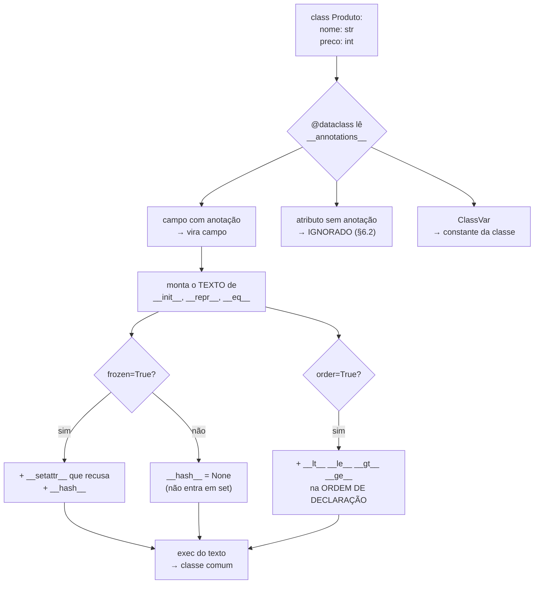

# 04.13 — Dataclasses

> **Módulo 04 — Python Avançado** · Nível: N2 · Tempo estimado: 2h30 · Código: `codigo/cap13/`

## 1. Objetivo

- **Refatorar** uma classe de dados escrita à mão para `@dataclass`.
- **Prever** o que o decorador gera — e o que ele deliberadamente não gera.
- **Escolher** entre `frozen`, `order`, `slots` e `field()` a partir do uso.
- **Reconhecer** os dois casos em que a anotação engana: quando ela mente sobre o tipo e quando ela está ausente.

Ao final, você escreve em quatro linhas o que o 04.12 pediu em vinte — e sabe onde a economia cobra o preço.

---

## 2. Pré-requisitos

- [04.12 — Métodos especiais](12-metodos-especiais.md) — `__init__`, `__repr__`, `__eq__` e `__hash__` são exatamente o que este capítulo gera.
- [04.09 — Encapsulamento](09-encapsulamento-e-properties.md) — `__slots__` e `@property` reaparecem como opções do decorador.
- [04.01 — Argumentos](01-args-kwargs-e-assinaturas.md) — o default mutável volta, agora barrado na definição da classe.

**Autoteste:** (1) Por que definir `__eq__` tira o objeto de um `set`? (2) O que acontece com uma lista usada como valor padrão de parâmetro? (3) O que `__slots__` recusa?

---

## 3. Motivação

Esta é a `ProdutoManual` do 04.12, com três campos:

```python
class ProdutoManual:
    def __init__(self, nome, preco_centavos, categoria):
        self.nome = nome
        self.preco_centavos = preco_centavos
        self.categoria = categoria

    def __repr__(self):
        return "%s(nome=%r, preco_centavos=%d, categoria=%r)" % (
            type(self).__name__, self.nome, self.preco_centavos, self.categoria)

    def __eq__(self, outro):
        if not isinstance(outro, ProdutoManual):
            return NotImplemented
        return ((self.nome, self.preco_centavos, self.categoria)
                == (outro.nome, outro.preco_centavos, outro.categoria))

    def __hash__(self):
        return hash((self.nome, self.preco_centavos, self.categoria))
```

Vinte linhas. E **o nome de cada campo aparece sete vezes**.

Acrescente um quarto campo, `estoque`. Você precisa lembrar de sete lugares. Esquecer um deles no `__eq__` produz o pior tipo de defeito: dois produtos com estoques diferentes passam a ser **iguais**, e o `set` de produtos silenciosamente perde um.

A versão que faz a mesma coisa:

```python
@dataclass
class Produto:
    nome: str
    preco_centavos: int
    categoria: str
```

O ganho não é digitar menos. É que **agora existe um único lugar onde os campos são declarados** — e acrescentar `estoque` é acrescentar uma linha.

---

## 4. Modelo mental

`@dataclass` é um **gerador de código que roda uma vez, no momento em que a classe é definida**.

Ele lê a lista de anotações da classe, monta o **texto** dos métodos que faltam, executa esse texto e enfia o resultado na classe. Depois disso o decorador some: o que sobra é uma classe comum, com métodos comuns.

```
definição da classe          →  @dataclass lê as anotações
                             →  escreve o texto de __init__, __repr__, __eq__
                             →  executa o texto e anexa os métodos
    (isto acontece UMA vez)

uso da classe                →  Produto("Mouse", 8990, "perifericos")
    (isto é uma classe normal, sem intermediário)
```

**A frase que organiza o capítulo: a anotação é a lista de campos.** Não é uma verificação, não é uma restrição, não é uma promessa — é a única forma que o decorador tem de saber **quais atributos existem**. Tudo o que ele gera decorre dessa lista, e por isso os dois erros mais caros do capítulo são erros de anotação.

E há uma consequência prática de o código ser gerado na definição: **criar objetos não custa nada a mais** (§13). O custo está no `import`, uma vez.

---

## 5. Analogia

`@dataclass` é o **cartório que redige as cláusulas de sempre**.

Você chega com os dados das partes e os valores. O cartório escreve, sem que você dite, as cláusulas que todo contrato tem: quem são as partes, como o documento se identifica, como se verifica se dois documentos tratam do mesmo negócio.

Você escreve o que é específico; ele escreve o que é padrão.

**E a analogia acerta no limite:** o cartório redige a cláusula "valor: R$ 8.990,00" exatamente como você declarou — e **não confere se o valor é verdadeiro**. Escrever `preco_centavos: int` e passar `"isto não é int"` produz um objeto perfeitamente formado, com uma string onde deveria haver um inteiro, e ninguém reclama.

---

## 6. Teoria

### 6.1 O que a linha gera

```python
@dataclass
class Produto:
    nome: str
    preco_centavos: int
    categoria: str
```

```
gerado: Produto(nome='Mouse', preco_centavos=8990, categoria='perifericos')
igualdade por valor: True
métodos gerados: ['__init__', '__repr__', '__eq__']
```

Três métodos, de graça:

- **`__init__`** com os campos na ordem de declaração, e os defaults se houver.
- **`__repr__`** no formato `Classe(campo=valor, …)` — inequívoco, como o 04.12 pediu.
- **`__eq__`** que compara a **tupla de todos os campos** — e só entre objetos da **mesma classe**.

Esse último detalhe merece nota: `A(1) == B(1)` é `False` mesmo com campos idênticos, e `A(1) == Filha(1)` também é `False`. O `__eq__` gerado testa `outro.__class__ is self.__class__`, que é mais estrito que o `isinstance` do 04.12.

**E o que ele não gera: `__hash__`.** Pelo motivo exato do 04.12 — definir `__eq__` por valor obriga a remover o hash de identidade:

```
Produto.__hash__: None
em set -> unhashable type: 'Produto'
```

O decorador não conserta isso por conta própria porque **não sabe se seu objeto é imutável**. Você diz que é, com `frozen=True` (§6.4).

### 6.2 A anotação é obrigatória e não é verificada

Duas afirmações que parecem contraditórias e não são.

**Obrigatória**, porque é ela que declara o campo. **Não verificada**, porque o Python não faz nada com anotações em tempo de execução:

```
Produto(123, 'isto não é int', None): Produto(nome=123, preco_centavos='isto não é int', categoria=None)
type(.nome): int <- ninguém reclamou
```

O objeto existe, o `repr` funciona, o `==` funciona. O erro vai aparecer três camadas adiante, quando alguém fizer `produto.nome.strip()`.

⚠️ **Caixa-preta 1:** o que é `nome: str`, exatamente? É uma **anotação de tipo**. O Python a guarda em `Produto.__annotations__` e não a usa para nada; quem a lê são ferramentas externas. Elas existem, são a base de tudo do módulo 06 em diante, e são o assunto do [04.14](14-type-hints.md).

**E agora o erro que custa caro.** Esqueça a anotação:

```python
@dataclass
class ProdutoSemAnotacao:
    nome: str
    preco_centavos = 0        # sem anotação
```

```
campos reconhecidos: ['nome']
repr: ProdutoSemAnotacao(nome='Mouse') <- preço ausente
preços 0 e 99999 são iguais? True <- o __eq__ nem olha
```

`preco_centavos = 0` é um **atributo de classe**, não um campo. Ele não entra no `__init__`, não aparece no `__repr__` e **não é comparado pelo `__eq__`**. Dois produtos com preços diferentes são iguais, e não há erro, aviso ou sintoma — exatamente o defeito que a §3 disse que o `@dataclass` evitaria, reintroduzido por dois-pontos ausentes.

**A regra que resolve:** `preco = 0` é atributo de classe; `preco: int = 0` é campo. Em caso de dúvida, `fields(Classe)` lista o que o decorador reconheceu.

### 6.3 Default mutável — a armadilha do 04.01, agora barrada

```
itens: list = [] -> mutable default <class 'list'> for field itens is not allowed: use default_factory
```

É o mesmo problema de `def f(itens=[])`: uma lista só, compartilhada por todos os objetos. A diferença é que aqui **o Python recusa a classe na definição**, com a mensagem dizendo a correção.

```python
@dataclass
class Pedido:
    cliente: str
    itens: list = field(default_factory=list)
```

```
ana:   Pedido(cliente='Ana', itens=['Mouse'])
bruno: Pedido(cliente='Bruno', itens=[]) <- listas separadas
```

`default_factory` recebe uma **função sem argumentos** que é chamada a cada criação. Vale `list`, `dict`, `set`, `lambda: {"origem": "web"}` ou qualquer função sua.

**Por que aqui dá erro e em `def f(itens=[])` não:** a função aceita porque o valor padrão é legítimo para tipos imutáveis e a linguagem não julga o seu; o `@dataclass`, por ser código novo com uma regra própria, pôde escolher recusar. É uma das poucas armadilhas clássicas do Python que ganhou uma barreira.

E note o limite da barreira: ela cobre `list`, `dict` e `set`, que são os casos comuns. Uma instância mutável de classe sua passa sem reclamação, porque o teste é por hasheabilidade — se o objeto tem `__hash__`, o decorador o aceita como default.

### 6.4 `frozen=True` — o `__hash__` de volta, e o congelamento raso

```python
@dataclass(frozen=True)
class Dinheiro:
    centavos: int
```

```
Dinheiro tem __hash__: True
em set: {Dinheiro(centavos=8990)} <- dois iguais, um elemento
atribuir -> FrozenInstanceError: cannot assign to field 'centavos'
```

`frozen=True` faz duas coisas: gera `__setattr__` e `__delattr__` que levantam `FrozenInstanceError`, e **volta a gerar `__hash__`**. É a declaração formal de "este objeto é imutável" que a §6.1 disse faltar — e resolve o dilema do 04.12/§6.2 numa palavra.

**Mas o congelamento é raso.** Ele protege a **ligação** entre o nome e o objeto, não o objeto:

```
frozen com lista dentro: PedidoCongelado(cliente='Ana', itens=['Mouse']) <- a lista MUDOU
hash(congelado) -> unhashable type: 'list'
```

`congelado.itens = []` é recusado. `congelado.itens.append("Mouse")` **funciona**. É a mesma distinção entre reatribuir e mutar que percorre o manual desde o 04.03.

A segunda linha é a consequência que salva: o `__hash__` gerado hasheia a tupla dos campos, e uma lista não é hasheável. Então o objeto congelado com lista dentro **não entra em `set`** — e o erro aparece na hora, em vez de o objeto sumir silenciosamente como no 04.12/§6.2. Para um `frozen` que se hasheia, use `tuple` no lugar de `list`.

### 6.5 `order=True` e a ordem de declaração

```python
@dataclass(order=True)
class ProdutoOrdenavel:
    nome: str
    preco_centavos: int
```

```
nome declarado 1º:   ['Cabo', 'Monitor', 'Mouse']
preço declarado 1º:  ['Cabo', 'Mouse', 'Monitor']
```

`order=True` gera `__lt__`, `__le__`, `__gt__` e `__ge__` comparando a **tupla dos campos, na ordem de declaração** — como `@total_ordering` no 04.12, mas sem escrever nada.

**E é exatamente isso que faz dele o parâmetro mais perigoso da lista.** As duas classes acima têm os mesmos campos e ordenam de forma diferente. Alguém que reorganize os campos por legibilidade — "vou pôr o preço primeiro, fica mais claro" — **muda a ordenação de todo o sistema**, sem erro, sem aviso, sem nada que apareça num diff que não seja lido com atenção.

Se o critério de ordenação importa, `sorted(produtos, key=lambda p: p.preco_centavos)` diz o que faz e não depende de onde a linha está.

### 6.6 `field()` — controlar campo a campo

`field()` ajusta o comportamento de um campo específico:

| Parâmetro | Efeito |
|---|---|
| `default_factory=list` | valor padrão calculado a cada criação (§6.3) |
| `repr=False` | fica fora do `__repr__` |
| `compare=False` | fica fora do `__eq__` e da ordenação |
| `init=False` | não entra no `__init__` (calculado no `__post_init__`) |
| `metadata={...}` | dicionário livre, ignorado pelo Python, lido por ferramentas |

```
repr: ProdutoAurora(nome='Mouse Gamer', preco_centavos=8990, categoria='perifericos', visualizacoes=12)
>>> nome sem espaços, codigo_fornecedor fora do repr
visualizações diferentes, produto igual? True
```

Os dois usos que aparecem de verdade: **`repr=False` para campos longos ou sensíveis** (um token no `repr` acaba no log) e **`compare=False` para campos acessórios** — duas visualizações não fazem de um produto outro produto.

**`__post_init__` roda logo depois do `__init__` gerado**, com todos os campos já atribuídos. É onde vai a validação e a normalização:

```python
def __post_init__(self):
    if self.quantidade <= 0:
        raise ValueError("quantidade deve ser positiva: %d" % self.quantidade)
```

```
quantidade 0 -> ValueError: quantidade deve ser positiva: 0
```

**Numa classe `frozen`, o `__post_init__` não pode atribuir** — `self.nome = self.nome.title()` levanta `FrozenInstanceError`, porque o `__setattr__` congelado vale também para dentro da classe. A saída é `object.__setattr__(self, "nome", self.nome.title())`, que passa por cima do bloqueio. É uma linha feia, e a feiura é apropriada: você está contornando uma garantia que pediu.

### 6.7 `slots=True`, `ClassVar` e herança

**`slots=True`** (Python 3.10+) declara `__slots__` com os campos, com o efeito do 04.09: recusa atributos não declarados e economiza memória — **47,4 MB → 29,1 MB** para 200 mil objetos, medido na §13.

**`ClassVar`** marca um atributo que é da classe, não do objeto:

```python
CATEGORIAS: ClassVar[tuple] = ("acessorios", "audio", "perifericos", "video")
```

```
campos: ['nome']
```

Sem `ClassVar`, o decorador o trataria como campo e o exigiria no `__init__`. É a forma correta de dar uma constante à classe — porque o jeito intuitivo (omitir a anotação) é o erro da §6.2.

**Herança** funciona, com uma restrição que aparece cedo:

```
campo sem default numa filha de classe com default -> non-default argument 'sku' follows default argument
```

Os campos da mãe vêm primeiro na assinatura gerada. Se a mãe tem um campo com default, **todos** os campos da filha precisam de default — porque a assinatura resultante teria um argumento obrigatório depois de um opcional, o que a linguagem não permite.

### 6.8 Quando não usar

`@dataclass` é para **classes cujo propósito é agrupar dados**. Três casos em que ele não é a ferramenta:

- **A classe é sobretudo comportamento.** Um `RepositorioDePedidos` com um campo (a conexão) e oito métodos não ganha nada com campos gerados. Escreva `__init__` e siga.
- **Você quer validação de verdade.** O `__post_init__` resolve casos simples; um `if` por campo em quinze campos é um formulário escrito à mão.
- **Os dados vêm de fora** — JSON de uma API, corpo de requisição, CSV. A anotação não verifica nada (§6.2), e é justamente em dado externo que o tipo errado chega.

⚠️ **Caixa-preta 2:** quem valida, então? Existe uma biblioteca que usa a **mesma sintaxe de anotação** e a transforma em validação real: um `preco: int` que recebe `"abc"` levanta erro na criação, com mensagem apontando o campo. É o Pydantic, do [04.15](15-pydantic.md), e é a base do FastAPI no módulo 06.

---

## 7. Funcionamento interno

O decorador **escreve texto e o executa**. Dá para ver:

```
__init__.__qualname__: Produto.__init__
co_filename: <string>
inspect.getsource -> OSError: could not get source code
assinatura: (self, nome: str, preco_centavos: int) -> None
```

O `co_filename` é `<string>`, não o seu arquivo: o método foi compilado a partir de uma string montada em tempo de definição. Por isso `inspect.getsource` falha — não existe arquivo com aquele código. Em compensação, a assinatura está lá, completa, e a lista de campos fica em `Produto.__dataclass_fields__`.

Duas consequências práticas: **um depurador que pare dentro do `__init__` gerado não tem código-fonte para mostrar**, e definir a classe custa mais do que definir uma classe comum — 417 ms contra 4,6 ms para mil classes (§13). Ambas as coisas acontecem uma vez, no `import`.

---

## 8. Visualização do fluxo



**Como ler:** o losango de cima é a decisão que governa tudo — *tem anotação?*. O ramo do meio à direita é o silêncio da §6.2: o atributo sem anotação não vira campo e ninguém avisa. Os dois losangos de baixo são as opções que você liga, e o retângulo final lembra que depois do `exec` sobrou uma classe comum: o decorador não está mais lá em tempo de execução.

---

## 9. Aplicação prática

O catálogo da Aurora, em três classes:

```python
@dataclass(frozen=True, slots=True)
class ItemPedido:
    sku: str
    quantidade: int
    preco_unitario_centavos: int

    def __post_init__(self):
        if self.quantidade <= 0:
            raise ValueError("quantidade deve ser positiva: %d" % self.quantidade)

    @property
    def total_centavos(self):
        return self.quantidade * self.preco_unitario_centavos
```

```python
@dataclass
class ProdutoAurora:
    nome: str
    preco_centavos: int
    categoria: str = "acessorios"
    codigo_fornecedor: str = field(default="", repr=False)
    visualizacoes: int = field(default=0, compare=False)
    CATEGORIAS: ClassVar[tuple] = ("acessorios", "audio", "perifericos", "video")
```

```
repr: ProdutoAurora(nome='Mouse Gamer', preco_centavos=8990, categoria='perifericos', visualizacoes=12)
visualizações diferentes, produto igual? True
categoria inválida -> categoria desconhecida: 'mobiliario'
```

**Quatro decisões visíveis no código.** O `ItemPedido` é `frozen` porque um item de pedido registrado **não deve mudar** — e `slots` porque um relatório carrega milhões deles. O `codigo_fornecedor` sai do `repr` para não vazar em log. As `visualizacoes` saem do `==` porque são acessórias. E `CATEGORIAS` é `ClassVar` — a lista das quatro categorias reais da Aurora, a mesma que rejeitou `mobiliario` no módulo 03.

Note também que `total_centavos` é `@property`, não campo: ele **deriva** dos outros e não deve entrar no `__init__` nem no `__eq__`. A regra é essa — o que se calcula não se armazena.

Para sair, `asdict` percorre a estrutura inteira:

```
asdict recursivo: {'cliente': 'Ana', 'itens': [{'sku': 'MOU-1', 'quantidade': 2, ...}]}
replace: ProdutoAurora(nome='Mouse Gamer', preco_centavos=7990, ...)
>>> replace devolve um NOVO objeto; o original fica intacto: 8990
```

`replace(objeto, campo=novo)` é o jeito de "alterar" um objeto congelado: cria outro com o campo trocado. **Cuidado com um detalhe:** `replace` não copia as coleções internas — a lista do novo objeto é **a mesma** do original.

---

## 10. Código comentado

Em [`codigo/cap13/dados.py`](codigo/cap13/dados.py), seis cenas:

1. A mesma classe duas vezes — 20 linhas contra 4.
2. A anotação obrigatória e não verificada, e o campo que some sem ela.
3. Default mutável: o `ValueError` na definição, e `default_factory`.
4. `frozen=True`: o `__hash__` de volta e o congelamento raso.
5. `order` na ordem de declaração, e `__post_init__` validando.
6. A Aurora: `field()`, `ClassVar`, `asdict`, `replace`.

```bash
python codigo/cap13/dados.py
```

**E repare no nome do arquivo.** Chamá-lo de `dataclasses.py` faria o `import dataclasses` encontrar o **seu** arquivo, e o erro seria `ImportError: cannot import name 'dataclass' from partially initialized module` — uma mensagem que não parece ter nada a ver com a causa. Vale para `random.py`, `json.py`, `sqlite3.py` e todos os outros.

---

## 11. Erros comuns

| Erro | Sintoma | Correção |
|---|---|---|
| Esquecer a anotação (`preco = 0`) | O campo some do `__init__`, do `repr` e do `__eq__` — **sem erro nenhum** | `preco: int = 0`. Confira com `fields(Classe)` |
| `itens: list = []` | `ValueError` na definição da classe | `field(default_factory=list)` |
| Esperar que `preco: int` valide | Uma string entra e o erro estoura três camadas adiante | `__post_init__` para casos simples; Pydantic (04.15) para dado externo |
| `frozen=True` e mutar a lista de dentro | O objeto "imutável" muda | Use `tuple`; e `hash()` reclama antes, o que ajuda |
| Reordenar campos numa classe `order=True` | A ordenação do sistema inteiro muda, em silêncio | `sorted(..., key=...)` quando o critério importa |
| Campo sem default numa filha de classe com default | `TypeError: non-default argument follows default argument` | Dê default a todos os campos da filha |
| Nomear o arquivo `dataclasses.py` | `ImportError ... partially initialized module` | Renomeie o arquivo |

---

## 12. Boas práticas

- **`frozen=True` por padrão**, e mutável só quando houver um motivo. Objeto imutável entra em `set`, serve de chave e não muda debaixo de quem o guardou.
- **`slots=True` quando houver muitos objetos.** 38% menos memória (§13), pelo preço de não poder acrescentar atributos — que raramente é o que você quer.
- **Nada de `order=True` por hábito.** Ligue-o quando a ordem natural for a dos campos declarados, e documente o critério.
- **O que deriva vira `@property`**, não campo. `total_centavos` não é dado; é conta.
- **`__post_init__` para invariantes**, não para regra de negócio. Se ele passa de dez linhas, a validação é de outra camada.
- **Dado externo não entra direto num `dataclass`.** Valide antes; o decorador não confere nada.

---

## 13. Performance

Um milhão de objetos, melhor de cinco execuções, Python 3.10:

| Operação | Tempo |
|---|---|
| Criação — classe manual | 355,7 ms |
| Criação — `@dataclass` | **353,5 ms** |
| Criação — `@dataclass(slots=True)` | 247,8 ms |
| Criação — `namedtuple` | 288,3 ms |
| Criação — `dict` literal | 110,9 ms |
| Leitura de atributo — manual × dataclass | 34,3 ms × 33,9 ms |

**A primeira conclusão é o alívio: `@dataclass` custa o mesmo que a classe escrita à mão** — 353,5 contra 355,7 ms, dentro do ruído. Faz sentido: o código gerado é o mesmo código que você escreveria (§4). A conveniência aqui é gratuita, o que quase nunca acontece.

`slots=True` é **30% mais rápido** na criação e usa menos memória — 200 mil objetos: **47,4 MB contra 29,1 MB**, 38% de economia.

O `dict` é 3× mais rápido que qualquer classe, e é a razão de código de altíssimo volume ainda usar dicionários. Você troca velocidade por campos com nome, `repr` legível e recusa de chave inexistente.

**E o custo que surpreende:**

| Operação | Tempo |
|---|---|
| `asdict(objeto)` — 100 mil vezes | 533,1 ms |
| Dicionário montado à mão | 16,7 ms |
| `vars(objeto)` | 9,3 ms |

`asdict` é **32× mais lento** que montar o dicionário à mão, porque faz **cópia profunda** de tudo — o que é uma garantia real (mexer na cópia não afeta o original) e um preço alto num laço de serialização. Para um objeto raso, `vars(objeto)` devolve o `__dict__` em 9,3 ms — sem cópia, e portanto sem a garantia.

**Definir** mil dataclasses custa **417 ms** contra 4,6 ms de mil classes comuns: 0,42 ms por classe, pago no `import`. Irrelevante em trinta classes; visível numa biblioteca com centenas.

---

## 14. Mercado

Dataclasses entraram na biblioteca padrão no Python 3.7 (2018) e viraram o jeito normal de escrever classe de dados. Antes disso o ecossistema usava `attrs`, que continua vivo e mais completo — a `@dataclass` é, por assumidamente, uma versão enxuta dela.

Onde aparecem no dia a dia: **configuração de aplicação**, **objetos de domínio** (`Pedido`, `Item`, `Cliente`), **retorno de funções** que devolveriam uma tupla com quatro elementos, e **estruturas intermediárias de pipeline de dados** — cada estágio recebe e devolve um tipo com nome, em vez de dicionários que ninguém sabe o formato.

Em entrevista, o assunto costuma vir como "quando você usaria `dataclass`, `NamedTuple` ou `dict`?". A resposta esperada distingue os três por mutabilidade e por custo, e reconhece que `dict` continua sendo a escolha certa em volume alto e formato instável.

Em serviço web você vai ver Pydantic (04.15) na borda — onde o dado chega de fora — e dataclasses no núcleo, onde o dado já foi validado. As duas coisas convivem, e a fronteira entre elas é uma decisão de arquitetura que o módulo 11 retoma.

---

## 15. Entrevistas

- **"O que `@dataclass` gera?"** `__init__`, `__repr__` e `__eq__` — e **não** `__hash__`, pelo motivo do 04.12. `frozen=True` o traz de volta; `order=True` acrescenta as quatro comparações.
- **"`dataclass`, `NamedTuple` ou `dict`?"** `NamedTuple` para imutável e leve com desempacotamento; `dataclass` para o caso geral, com mutabilidade opcional e `__post_init__`; `dict` quando o formato varia ou o volume é alto (3× mais rápido de criar).
- **"O tipo da anotação é verificado?"** Não, em tempo de execução nada acontece. Quem lê são verificadores estáticos (04.14) e o Pydantic (04.15).
- **"`frozen=True` torna o objeto imutável?"** Impede reatribuir campos. Uma lista dentro dele continua mutável — e por isso o `__hash__` gerado falha, o que é a proteção que sobra.
- **"Qual o custo de usar dataclass?"** Nenhum na criação de objetos (353,5 × 355,7 ms/milhão). O custo está na definição da classe, no `import`, e em `asdict`, que faz cópia profunda.

---

## 16. Exercícios guiados

Em [`exercicios/cap13.md`](exercicios/cap13.md):

- **A1** `[~10 min · o que foi gerado?]` — 8 declarações, quais métodos existem.
- **A2** `[~10 min · prevê a saída]` — 6 trechos com anotações, defaults e `frozen`.
- **A3** `[~12 min · ache o erro]` — 6 dataclasses defeituosas.
- **A4** `[~10 min · qual parâmetro?]` — 6 requisitos, qual opção do decorador atende.
- **AP1** `[~20 min · a refatoração]` — Converta três classes manuais.
- **AP2** `[~25 min · o field()]` — Um `Usuario` com campos fora do `repr` e do `==`.
- **AP3** `[~20 min · congelar de verdade]` — Um `frozen` que resiste ao teste do `set`.
- **D1** `[~50 min · o catálogo da Aurora]` — **Modelo completo, do banco à serialização.**

---

## 17. Desafios

**D1 — O catálogo da Aurora.** Modele `Produto`, `ItemPedido` e `Pedido` como dataclasses, e escreva as duas pontas: carregar do banco do módulo 03 e serializar para JSON.

Requisitos: `Produto` e `ItemPedido` congelados e hasheáveis (cuidado com coleções dentro); `Pedido` mutável, com `total_centavos` derivado; validação no `__post_init__`; `codigo_fornecedor` fora do `repr`; e um `carregar_produtos(conexao)` que devolva uma lista de `Produto` a partir de um `SELECT`.

**As três perguntas que valem a nota:** (1) `Pedido.itens` deve ser `list` ou `tuple`, e o que isso implica para `frozen`? (2) A serialização usa `asdict` ou um método próprio — e o que a §13 diz sobre isso num laço de 100 mil pedidos? (3) Onde você põe a validação de que o SKU existe no catálogo, e por que ela **não** cabe no `__post_init__`?

---

## 18. Mini projeto

**O leitor de configuração.** Escreva um `Config` como dataclass congelada, com campos para host, porta, nome do banco, nível de log e tempo limite, todos com default sensato.

Requisitos: um construtor alternativo `Config.do_ambiente()` (04.08) que leia as variáveis de ambiente correspondentes; `__post_init__` que recuse porta fora de 1–65535 e nível de log desconhecido; a senha fora do `__repr__`; e conversão explícita — variável de ambiente chega como string e `porta` precisa ser inteiro.

E a pergunta que fecha: a conversão de `"5432"` para `5432` foi escrita à mão, campo a campo. Quantas linhas ficaram? Guarde o número — o 04.15 faz isso com uma declaração, e a comparação é o argumento a favor do Pydantic.

---

## 19. Revisão

**Resumo em 5 frases.** `@dataclass` é um gerador de código que roda **uma vez, na definição da classe**: lê as anotações, escreve `__init__`, `__repr__` e `__eq__`, e sai de cena — por isso criar objetos custa o mesmo que numa classe escrita à mão (353,5 × 355,7 ms por milhão). A anotação é **a lista de campos**, e daí vêm os dois erros caros: ela não verifica tipo nenhum (`preco_centavos: int` aceita `"abc"`), e sem ela o atributo **não é campo** — some do `__init__`, do `repr` e do `__eq__`, fazendo dois objetos com preços diferentes serem iguais, em silêncio. `frozen=True` devolve o `__hash__` que o `__eq__` gerado havia apagado, mas congela só a superfície: uma lista dentro continua mutável, e o `hash()` falha por causa dela — o que aqui é a proteção que resta. `order=True` compara na **ordem de declaração**, e por isso reordenar campos por legibilidade muda a ordenação de todo o sistema sem erro algum. E o limite do decorador define o próximo passo: dado que vem de fora precisa de validação real, que a anotação não dá.

**Flashcards** (também em [`revisao/flashcards.md`](revisao/flashcards.md)):

| ID | Frente | Verso |
|---|---|---|
| 04.13-F1 | O que `@dataclass` gera — e o que não gera? | Gera `__init__`, `__repr__` e `__eq__` (que exige a **mesma classe**, mais estrito que `isinstance`). **Não gera `__hash__`**: definir `__eq__` o apaga (04.12), e o decorador não sabe se o objeto é imutável. `frozen=True` o traz de volta. |
| 04.13-F2 | Explique com suas palavras por que `preco = 0` sem anotação é um defeito grave. | (Elaboração) Sem anotação não é campo: vira **atributo de classe**. Não entra no `__init__`, no `repr` nem no `__eq__` — então dois objetos com preços diferentes ficam **iguais**, sem erro nem sintoma. Confira com `fields(Classe)`. |
| 04.13-F3 | Preveja: `frozen=True` com `itens: list`, e `objeto.itens.append("x")`. | (Previsão) **Funciona** — `frozen` impede *reatribuir* o campo, não mutar o objeto dentro dele. Mas `hash(objeto)` falha com `unhashable type: 'list'`, e é essa falha que evita o sumiço silencioso do 04.12/F3. Use `tuple`. |
| 04.13-F4 | Qual o custo de `@dataclass`? | (Decisão) **Zero na criação de objetos** (353,5 × 355,7 ms/milhão) — o código gerado é o que você escreveria. O custo está em **definir** a classe (0,42 ms cada, no `import`) e em `asdict`, **32× mais lento** que montar o dicionário à mão, porque faz cópia profunda. |
| 04.13-F5 | Por que `order=True` é o parâmetro mais perigoso? | Ele compara a tupla dos campos **na ordem de declaração**. Mover uma linha por legibilidade muda a ordenação de todo o sistema, sem erro e sem aviso. Quando o critério importa, `sorted(..., key=...)` diz o que faz. |

**Revisão espaçada:** D+1 refaça A2 e A3 · D+7 o AP3 (congelar de verdade) · D+30 escreva de memória uma dataclass congelada, hasheável e com validação, e explique por que `list` não pode estar nela.

---

## 20. Checklist

- [ ] Refatorei uma classe manual para `@dataclass` e conferi que o comportamento é o mesmo.
- [ ] Vi um campo sem anotação sumir do `__eq__`.
- [ ] Passei o tipo errado e vi que ninguém reclamou.
- [ ] Tomei o `ValueError` do default mutável e usei `default_factory`.
- [ ] Usei `frozen=True` e vi o objeto entrar num `set`.
- [ ] Mutei uma lista dentro de um objeto congelado.
- [ ] Reordenei campos numa classe `order=True` e vi a ordenação mudar.
- [ ] Usei `field(repr=False)` e `field(compare=False)` com um motivo.
- [ ] Validei no `__post_init__`.
- [ ] Sei quando **não** usar dataclass.

---

## 21. Próximo capítulo

[04.14 — Type hints](14-type-hints.md). Este capítulo pediu `nome: str` e admitiu, duas vezes, que ninguém verifica isso. O próximo apresenta quem verifica — a notação completa, o que ela expressa, e a ferramenta que lê o seu código e aponta o erro **antes** de rodar. Daqui em diante, todo código novo do manual é tipado.
