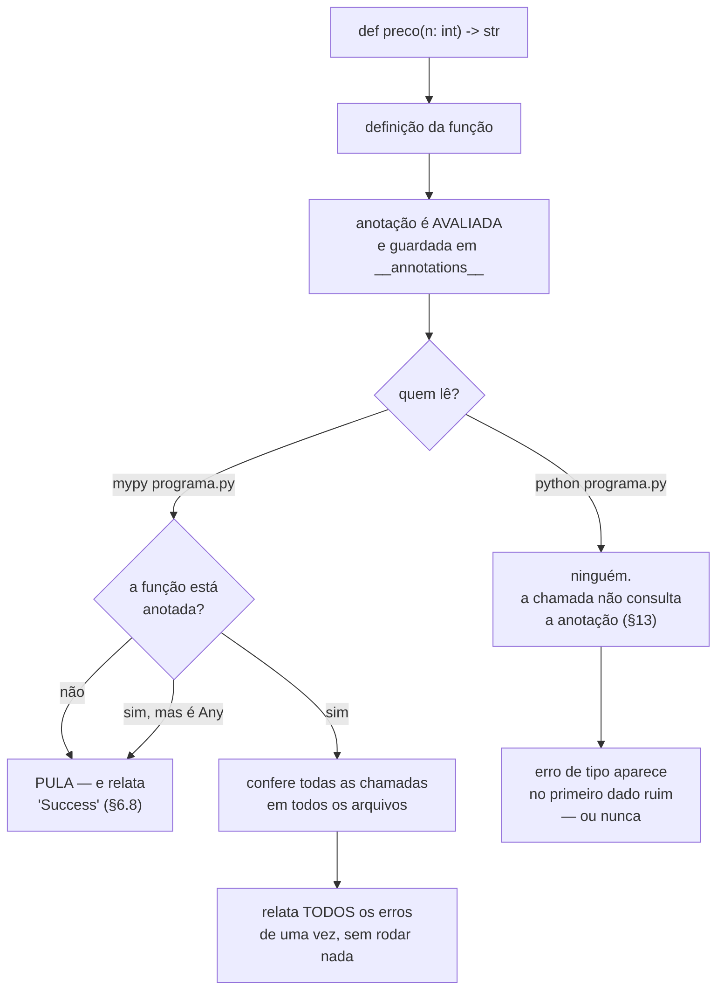

# 04.14 — Type hints

> **Módulo 04 — Python Avançado** · Nível: N2 · Tempo estimado: 3h · Código: `codigo/cap14/`

## 1. Objetivo

- **Ler** uma assinatura tipada e dizer o que ela promete.
- **Escrever** anotações para parâmetros, retornos, coleções e valores ausentes.
- **Rodar** um verificador de tipos e interpretar a saída — inclusive quando ela está errada.
- **Reconhecer** o que a anotação **não** faz, e por que "nenhum erro encontrado" não significa código verificado.

Ao final, você escreve assinaturas que documentam e são conferidas. **Daqui em diante, todo código novo do manual é tipado.**

---

## 2. Pré-requisitos

- [04.13 — Dataclasses](13-dataclasses.md) — a anotação já apareceu, declarada como "lista de campos"; aqui ela ganha significado.
- [04.11 — Composição](11-composicao-vs-heranca.md) — o duck typing volta como `Protocol`, agora verificável.
- [04.02 — Funções como valores](02-funcoes-como-valores.md) — `Callable` é a assinatura de uma função passada como argumento.

**Autoteste:** (1) O que acontece se você passar uma string onde a anotação diz `int`? (2) O que o `@dataclass` faz com um atributo sem anotação? (3) Por que uma política de frete não precisa herdar de nada?

---

## 3. Motivação

Esta função existe em algum projeto seu:

```python
def processar(dados, config, callback=None):
    ...
```

**Responda sem abrir o corpo dela:** `dados` é uma lista, um dicionário ou um caminho de arquivo? `config` é um objeto ou um dicionário? O que ela devolve? O que acontece quando `callback` é `None`?

Você não consegue. Ninguém consegue. E a saída habitual — abrir o corpo, ler as trinta linhas, seguir as três funções que ela chama — é o custo que se paga toda vez que alguém toca no código.

A mesma função, anotada:

```python
def processar(dados: list[dict[str, int]],
              config: Config,
              callback: Callable[[int], None] | None = None) -> Relatorio:
```

Agora a pergunta tem resposta na primeira linha. E há um segundo ganho, que é o assunto da §6.5: uma ferramenta consegue **ler essa promessa e conferir se o resto do código a respeita** — antes de rodar, em todos os arquivos ao mesmo tempo.

---

## 4. Modelo mental

Uma anotação de tipo (*type hint*) é **um comentário que uma ferramenta lê**.

*(Este capítulo paga duas promessas: a Caixa-preta 1 do [04.13](13-dataclasses.md), que perguntou o que era `nome: str`, e a Caixa-preta 1 do [04.11](11-composicao-vs-heranca.md), que prometeu uma forma verificável de dizer "qualquer coisa com um método `calcular`" — é a §6.7.)*

O Python guarda a anotação e não faz nada com ela. Nenhuma verificação, nenhuma conversão, nenhum custo na chamada:

```
dobrar(4)    = 8
dobrar('ab') = abab <- roda, sem reclamação
onde ela fica: {'n': <class 'int'>, 'return': <class 'int'>}
```

`'abab'` é lixo com aparência de resultado, e ele vai circular até alguém tentar somá-lo com um número, três camadas adiante.

**Existem duas execuções, e elas não se encontram:**

```
    python programa.py     →  o interpretador ignora as anotações
    mypy programa.py       →  o verificador lê SÓ as anotações
```

A segunda linha é opcional, roda antes da primeira e não altera nada — ela só relata. **A frase que organiza o capítulo: a anotação é uma promessa que o Python não cobra e a ferramenta cobra.** Quem escolhe se ela é cobrada é você, quando decide rodar o verificador.

---

## 5. Analogia

A anotação é a **etiqueta de um cabo**.

Nada na tomada impede você de ligar o cabo errado. A etiqueta que diz "monitor" não é um encaixe: é informação. Alguém apressado conecta o cabo errado, e o sistema liga assim mesmo, com a imagem estranha.

Mas se existir um **conferente** que passe pela sala lendo as etiquetas e comparando com o diagrama, ele encontra a ligação errada **antes de alguém apertar o botão** — e encontra todas de uma vez, não a primeira.

**E a analogia acerta no limite:** o conferente confia nas etiquetas. Um cabo **sem etiqueta** ele pula, sem reclamar — e é exatamente isso que faz o verificador dizer "nenhum problema encontrado" num arquivo cheio de problemas (§6.8).

---

## 6. Teoria

### 6.1 A sintaxe, e o que ela faz

```python
def preco_formatado(centavos: int) -> str:
    return "R$ %.2f" % (centavos / 100)

total: int = 0
```

Dois-pontos para parâmetros e variáveis, seta para o retorno. Tudo isso vira um dicionário comum:

```
dobrar.__annotations__ -> {'n': <class 'int'>, 'return': <class 'int'>}
```

Não há mágica: é um atributo que você pode ler, imprimir e alterar. E o `-> None` de uma função que não devolve nada **não é opcional para o verificador** — sem ele, a função inteira fica sem anotação, com a consequência da §6.8.

### 6.2 O vocabulário

**Escalares:** `int`, `float`, `str`, `bool`, `bytes`, `None`.

**Coleções, com o que há dentro:**

| Anotação | Significa |
|---|---|
| `list[int]` | lista de inteiros |
| `dict[str, int]` | dicionário de texto para inteiro |
| `tuple[int, str]` | tupla de **exatamente** dois itens, nesta ordem |
| `tuple[int, ...]` | tupla de tamanho variável, tudo `int` |
| `set[str]` | conjunto de textos |

O ponto que muda o valor da anotação: **`list` sozinho quase não diz nada**; `list[Produto]` diz. É a diferença entre "é uma lista" e "é uma lista de quê".

```
somar([8990, 32900]) -> 41890
agrupar -> {'A': ['Ana', 'Alice'], 'B': ['Bruno']}
```

**Nota histórica que aparece em código antigo:** até o Python 3.8 era preciso escrever `from typing import List` e usar `List[int]`, com maiúscula. Desde o 3.9, `list[int]` funciona direto. As versões antigas ainda funcionam e você vai encontrá-las; escreva as novas.

**Apelidos** dão nome a construções que se repetem:

```python
Centavos = int
TabelaDePrecos = dict[str, Centavos]
Formatador = Callable[[Centavos], str]
```

`Centavos` **não é um tipo novo** — é `int` com um nome que explica a unidade. O verificador não impede somar `Centavos` com um `int` qualquer. O ganho é de leitura, e é grande: `preco: Centavos` responde a uma pergunta que `preco: int` deixa em aberto.

### 6.3 `X | None` — a construção que mais paga

Uma função que às vezes não acha o que procura:

```python
def preco_de(nome: str) -> Centavos | None:
    return TABELA.get(nome)
```

```
preco_de('mouse')  -> 8990
preco_de('mesa')   -> None
```

A barra é união: "inteiro **ou** `None`". E o efeito prático é que o verificador passa a **exigir a guarda**:

```python
def preco_formatado(nome: str) -> str:
    preco = preco_de(nome)
    if preco is None:
        return "produto não encontrado"
    return formatar_reais(preco)
```

Sem o `if`, a resposta é imediata:

```
error: Item "None" of "int | None" has no attribute "..."  [union-attr]
```

**Esta é a categoria de defeito que mais aparece em produção**: uma busca que não achou, um campo que veio vazio, um `.get()` que devolveu `None`. O interpretador só reclama quando o dado ausente aparece — e o dado ausente costuma aparecer no cliente, não no teste.

Em código anterior ao Python 3.10 a mesma coisa se escreve `Optional[int]`, importado de `typing`. É idêntico, e você vai encontrar os dois.

### 6.4 `Any` — a saída de emergência

`Any` significa "não verifique nada aqui". E ele faz exatamente isso:

```python
def processar(dados: Any) -> Any:
    return dados.qualquer_coisa_inexistente()
```

O verificador aceita, em silêncio, inclusive no modo mais rigoroso. `Any` não é "qualquer tipo" — é **a ausência de verificação**, e ela se espalha: o retorno `Any` contamina quem o recebe.

Existem usos legítimos (dado ainda não validado na fronteira do sistema, código em migração), e o critério é o mesmo do `except` genérico: use quando não houver alternativa, e escreva por quê. Se você quer dizer "qualquer objeto, e vou tratar como objeto", o termo é `object`, que o verificador confere.

### 6.5 O verificador

```bash
pip install mypy
mypy codigo/cap14/defeitos.py
```

⚠️ **Caixa-preta 1:** `pip install` baixa e instala uma biblioteca que não vem com o Python. Por enquanto, rode a linha como está — ela põe o mypy à disposição no seu computador inteiro. O que o `pip` faz de verdade, por que instalar assim vira problema quando você tiver dois projetos com versões diferentes da mesma biblioteca, e como isolar cada projeto são o [04.16](16-ambientes-virtuais-e-pip.md).

O arquivo `defeitos.py` tem cinco erros plantados. O verificador encontra seis:

```
defeitos.py:20: error: Argument 1 to "dobrar" has incompatible type "str"; expected "int"  [arg-type]
defeitos.py:26: error: Missing return statement  [return]
defeitos.py:46: error: Item "None" of "str | None" has no attribute "upper"  [union-attr]
defeitos.py:54: error: Incompatible return value type (got "float", expected "int")  [return-value]
defeitos.py:61: error: Invalid index type "int" for "dict[str, int]"; expected type "str"  [index]
defeitos.py:61: error: Incompatible types in assignment (expression has type "str", target has type "int")  [assignment]
Found 6 errors in 1 file (checked 1 source file)
```

Rodando o mesmo arquivo:

```
Traceback (most recent call last):
  File "defeitos.py", line 46, in <module>
    print(nome.upper())
AttributeError: 'NoneType' object has no attribute 'upper'
```

**Um erro. E o programa parou.** Os outros cinco continuam lá, invisíveis — para vê-los, você conserta este, roda de novo, e repete cinco vezes. E dois deles (`dobrar("ab")` e o `sum(itens) / 100`) **nunca** apareceriam: rodam sem exceção, produzindo `'abab'` e um float onde o resto do sistema espera centavos.

Essa é a diferença que justifica a ferramenta: **seis de uma vez, contra um por execução — e dois que nenhuma execução mostraria.**

O código entre colchetes (`[arg-type]`, `[union-attr]`) é o identificador da regra. Ele serve para pesquisar e para silenciar um caso específico (§6.8).

### 6.6 Referência adiante

Um método que devolve a própria classe tem um problema de ordem:

```python
@dataclass(frozen=True)
class Produto:
    def com_desconto(self, porcento: int) -> "Produto":
        ...
```

As aspas são necessárias porque a anotação é avaliada **enquanto a classe ainda está sendo definida** — o nome `Produto` ainda não existe. Uma string adia a avaliação; o verificador a resolve depois.

A alternativa é a primeira linha do arquivo:

```python
from __future__ import annotations
```

Com ela, **todas** as anotações do arquivo viram strings automaticamente:

```
sem future: {'a': <class 'int'>, 'b': list[str], 'return': dict[str, int]}
com future: {'a': 'int', 'b': 'list[str]', 'return': 'dict[str, int]'}
```

Três consequências: as aspas deixam de ser necessárias, a definição fica mais barata (§13), e um nome inexistente na anotação **para de dar erro** — `def f(x: TipoQueNaoExiste)` define sem reclamar. O verificador continua pegando; o interpretador deixa de pegar.

### 6.7 `Callable` e `Protocol`

**`Callable`** anota uma função recebida como argumento (04.02):

```python
Formatador = Callable[[Centavos], str]      # recebe um int, devolve str
```

**`Protocol`** resolve o problema que o 04.11 deixou em aberto. Lá, uma política de frete era qualquer objeto com o método `calcular` — duck typing puro, sem classe base. Ótimo para acoplamento, invisível para o verificador.

```python
class PoliticaFrete(Protocol):
    def calcular(self, peso_kg: float) -> Centavos: ...


class FreteGratis:                      # não herda de nada
    def calcular(self, peso_kg: float) -> Centavos:
        return 0
```

```
FreteGratis:   0
FretePorPeso:  1500
nenhuma das duas herda de PoliticaFrete: object
```

O `Protocol` descreve **o que o objeto precisa ter**, não de quem precisa herdar. E a conferência é real — uma classe cujo `calcular` devolve `str` é recusada, com o diagnóstico completo:

```
error: Argument 1 to "cobrar" has incompatible type "FreteErrado"; expected "PoliticaFrete"
note: Following member(s) of "FreteErrado" have conflicts:
note:     Expected:
note:         def calcular(self, peso_kg: float) -> int
note:     Got:
note:         def calcular(self, peso_kg: float) -> str
```

É duck typing **com conferência**: mantém a liberdade do 04.11 e recupera a rede de segurança que ela custava.

### 6.8 O que "Success" não quer dizer

Este arquivo passa no verificador:

```python
def processar(dados: Any) -> Any:
    return dados.qualquer_coisa_inexistente()

def sem_anotacao(n):
    return n.metodo_que_nao_existe() + "texto" - 1
```

```
mypy t4.py  ->  Success: no issues found in 1 source file
```

Duas razões, e as duas importam:

- **`Any` desliga a verificação** (§6.4).
- **Uma função sem anotação não é verificada** — nem a chamada, nem o corpo. Para o verificador, ela não existe. E forçar a checagem do corpo com `--check-untyped-defs` **também não encontra nada**, porque um parâmetro sem anotação é `Any`: não há o que conferir.

**Daí a única conclusão prática que vale:** num projeto meio tipado, "nenhum problema encontrado" mede quanto do código está anotado, não quanto está correto. O modo `--strict` conserta isso — ele recusa a função sem anotação:

```
error: Function is missing a type annotation  [no-untyped-def]
```

**E quando o verificador está errado?** Acontece, e o caso mais comum é código que existe para demonstrar um erro. A saída é silenciar aquela linha, com o código da regra e o motivo:

```python
errado = dobrar("ab")  # type: ignore[arg-type]  # erro proposital: §1
```

O `type: ignore` **sem** o código entre colchetes silencia tudo naquela linha, inclusive erros futuros que você não previu. Sempre com colchetes, sempre com motivo.

---

## 7. Funcionamento interno

A anotação é **avaliada na definição** e guardada num dicionário:

```python
contador: int
```

```
'contador' existe? False
mas está em __annotations__: True
```

A linha acima **não cria a variável** — ela registra a anotação e nada mais. É por isso que anotar não custa nada na chamada: no momento em que a função roda, a anotação já virou um item de dicionário e ninguém a consulta.

Duas ferramentas para inspecionar: `funcao.__annotations__` mostra o que foi guardado, e `typing.get_type_hints(funcao)` resolve strings e referências adiante para os objetos de verdade.

E é por serem avaliadas na definição que anotações **quebram o programa** quando mencionam um nome inexistente — a menos que `from __future__ import annotations` esteja no topo, caso em que viram strings e o erro passa a ser problema exclusivo do verificador.

---

## 8. Visualização do fluxo



**Como ler:** os dois ramos do losango de cima são as duas execuções que não se encontram. O ramo da esquerda é o Python: a anotação foi avaliada e descartada. O da direita é o verificador — e note que **dois dos três caminhos dele levam ao mesmo lugar**: função sem anotação e função anotada com `Any` produzem o mesmo "Success" enganoso.

---

## 9. Aplicação prática

**Tipar o catálogo da Aurora** custa três linhas de anotação e responde às perguntas que o código não respondia:

```python
Centavos = int

@dataclass(frozen=True, slots=True)
class Produto:
    nome: str
    preco_centavos: Centavos
    categoria: str

def mais_caro(produtos: list[Produto]) -> Produto | None: ...
def total_por_categoria(produtos: list[Produto]) -> dict[str, Centavos]: ...
```

```
mais caro: Fone Bluetooth XZ-9
mais_caro([]) -> None
por categoria: {'perifericos': 41890, 'audio': 46990}
```

O `-> Produto | None` de `mais_caro` é o que muda o dia a dia: ele **obriga** quem chama a tratar o catálogo vazio, e o verificador recusa `mais_caro(catalogo).nome` sem a guarda.

**E o exercício que vale mais que tipar código novo: rode o verificador no seu código antigo.** No código do módulo 04 deste manual, ele encontra quatro coisas:

```
cap07/objetos.py:54: error: Need type annotation for "tags"  [var-annotated]
cap01/assinaturas.py:93: error: "sleep" does not return a value  [func-returns-value]
cap01/assinaturas.py:114: error: Unexpected keyword argument "dados" for "relatorio"  [call-arg]
cap01/assinaturas.py:115: error: Too many positional arguments for "relatorio"  [call-arg]
```

**As quatro estão certas, e as quatro são propositais.** As duas últimas são as chamadas que o 04.01 faz de propósito para mostrar `TypeError` acontecendo; a de `objetos.py` é a classe com `tags = []` que o 04.07 usa para demonstrar o atributo de classe compartilhado.

Isso é o resultado mais útil que uma primeira execução pode dar, e a lição não é sobre tipos: **a ferramenta relata, você julga.** Um verificador que aponta código deliberado não está com defeito — ele não tem como saber da sua intenção, e é por isso que existe o `type: ignore` com motivo escrito. Aceitar todo apontamento sem julgar é tão ruim quanto ignorar todos.

---

## 10. Código comentado

Dois arquivos, e eles se completam.

[`codigo/cap14/tipos.py`](codigo/cap14/tipos.py) roda e passa no verificador. Seis cenas: a anotação ignorada em execução; o vocabulário; `X | None` com a guarda; `Protocol`; a Aurora tipada; e a medição do custo.

[`codigo/cap14/defeitos.py`](codigo/cap14/defeitos.py) quebra de propósito. Rode as duas coisas e compare as saídas:

```bash
python codigo/cap14/tipos.py
mypy codigo/cap14/tipos.py

mypy codigo/cap14/defeitos.py      # seis erros de uma vez
python codigo/cap14/defeitos.py    # explode no primeiro e para
```

**A diferença entre as duas últimas saídas é o argumento inteiro do capítulo.**

---

## 11. Erros comuns

| Erro | Sintoma | Correção |
|---|---|---|
| Anotar e achar que valida | String entra onde a anotação diz `int` e nada acontece | O verificador é um programa separado; rode-o. Para validar dado externo, 04.15 |
| Esquecer `-> None` | A função inteira fica invisível para o verificador | Anote o retorno **sempre**, inclusive `None` |
| `list` sem o conteúdo | A anotação passa e não diz nada | `list[Produto]` |
| `Any` para se livrar de um aviso | O aviso some e a verificação também, contaminando quem recebe | Anote o tipo real; se for mesmo indeterminado, `object` |
| Usar `X | None` sem a guarda | `AttributeError: 'NoneType' object has no attribute…` em produção | `if valor is None:` antes do uso |
| Nome da própria classe na anotação | `NameError` na definição | Aspas, ou `from __future__ import annotations` |
| `# type: ignore` sem colchetes | Silencia erros futuros que você não previu naquela linha | `# type: ignore[codigo]` e o motivo ao lado |
| Confiar no "Success" | Arquivo com `Any` e funções sem anotação passa limpo | `--strict`, e leia o que ele recusa |

---

## 12. Boas práticas

- **Anote o que atravessa fronteiras** — parâmetros e retornos de funções públicas, campos de dataclass. O corpo se explica sozinho.
- **`-> None` também é anotação.** Sem ela, a função não é verificada.
- **`X | None` no lugar certo:** na função que pode não achar, não em toda variável. Cada `| None` obriga uma guarda, e obrigar guarda desnecessária cansa quem lê.
- **`--strict` desde o começo em projeto novo.** Em projeto existente, comece pelo padrão e aperte por pasta — `--strict` de saída produz centenas de erros e o time desliga a ferramenta.
- **Rode o verificador no automático**, não à mão. É o assunto do módulo 09; por enquanto, rode antes de cada commit.
- **`type: ignore` sempre com código e motivo.** Sem isso, ele vira um `except` genérico.
- **Nada de anotar o que já é evidente:** `contador: int = 0` diz menos que `contador = 0` e ocupa mais.

---

## 13. Performance

Duzentas mil definições de função, melhor de cinco, Python 3.10:

| Operação | Tempo |
|---|---|
| Definir sem anotação | 98,9 ms |
| Definir com anotação | 233,5 ms |
| Definir com `from __future__ import annotations` | 89,8 ms |

| Operação | Tempo |
|---|---|
| Chamar 1 milhão de vezes — sem anotação | 69,1 ms |
| Chamar 1 milhão de vezes — com anotação | **67,6 ms** |

**As duas tabelas dizem tudo.** Anotar mais que dobra o custo de **definir** a função, porque a anotação é uma expressão avaliada ali (§7) — e `list[int]` constrói um objeto. E anotar **não muda nada** na chamada: 67,6 contra 69,1 ms, dentro do ruído, porque no momento da chamada a anotação já é um item de dicionário que ninguém consulta.

O custo da definição é pago no `import`, uma vez. Em 0,0005 ms por função, mil funções custam meio milissegundo — e `from __future__ import annotations` o elimina, porque a anotação vira uma string e nem chega a ser avaliada.

**O custo que você vai sentir é outro:** o verificador leva alguns segundos num projeto pequeno e minutos num grande. Ele roda fora do programa, e é por isso que a decisão é sobre o seu fluxo de trabalho, não sobre desempenho em produção.

---

## 14. Mercado

Anotações entraram no Python 3.0 (2008) para funções e ganharam o vocabulário do módulo `typing` no 3.5 (2015). Hoje são padrão em biblioteca séria e em time de mais de uma pessoa.

Onde isso aparece de forma incontornável: **FastAPI** (módulo 06) lê a anotação para gerar validação e documentação; **Pydantic** (04.15) transforma a anotação em verificação de verdade; **SQLAlchemy 2.0** (módulo 05) usa anotações para mapear colunas. Nesses três, a anotação deixou de ser documentação e virou **parte do funcionamento** — a função muda de comportamento conforme o tipo declarado.

O verificador dominante é o **mypy**. **pyright** (que roda dentro do editor no Pylance) é mais rápido e mais rigoroso em alguns pontos; **ty**, da equipe do ruff, é recente e muito mais rápido. A escolha importa menos que a existência: qualquer um deles pega a classe de defeito da §6.3.

Em entrevista, a pergunta que separa é a da §6.8 — "o mypy diz que não há problemas; o código está correto?". A resposta esperada menciona `Any`, funções sem anotação, e a diferença entre verificação estática e validação de dado externo.

---

## 15. Entrevistas

- **"O Python verifica type hints em execução?"** Não. A anotação é avaliada na definição, guardada em `__annotations__` e ignorada na chamada — medido: 67,6 contra 69,1 ms por milhão de chamadas.
- **"O verificador não achou nada. O código está certo?"** Não necessariamente. `Any` desliga a verificação e função sem anotação nem é olhada; `--strict` mostra quanto do arquivo estava fora do escopo.
- **"Qual o tipo mais útil?"** `X | None`, porque força a guarda numa categoria de defeito que só aparece com o dado ausente — em produção.
- **"O que é `Protocol`?"** Tipagem estrutural: descreve o que o objeto precisa ter, não de quem herda. É o duck typing do 04.11 com conferência.
- **"Type hints substituem testes?"** Não. Eles pegam incompatibilidade de tipo; não pegam lógica errada com os tipos certos. `total = preco - desconto` escrito como `preco + desconto` passa em qualquer verificador.

---

## 16. Exercícios guiados

Em [`exercicios/cap14.md`](exercicios/cap14.md):

- **A1** `[~10 min · leia a assinatura]` — 8 assinaturas, diga o que cada uma promete.
- **A2** `[~10 min · escreva a anotação]` — 8 funções sem tipos.
- **A3** `[~12 min · o mypy aceita?]` — 6 trechos, diga se passa e por quê.
- **A4** `[~10 min · qual construção?]` — 6 situações.
- **AP1** `[~20 min · tipar o que existe]` — Anote um módulo do 04.06.
- **AP2** `[~25 min · a união com None]` — Uma busca honesta, com todas as guardas.
- **AP3** `[~20 min · Protocol]` — Tipe as políticas de frete do 04.11.
- **D1** `[~50 min · o verificador no seu código]` — **Rode, julgue, conserte ou silencie.**

---

## 17. Desafios

**D1 — O verificador no seu código.** Rode `mypy --strict` sobre a pasta `codigo/` de um módulo inteiro que você já escreveu. Anote o número de erros.

Depois, para **cada** apontamento, classifique em uma de três categorias: **defeito real** (conserte), **código proposital** (silencie com `type: ignore[codigo]` e o motivo escrito) ou **limitação da ferramenta** (registre qual, e por quê).

Requisitos: chegue a zero apontamento sem usar `Any` nenhuma vez; nenhum `type: ignore` sem colchetes; e um `RELATORIO.md` com a contagem por categoria.

**As três perguntas que valem a nota:** (1) Quantos dos apontamentos eram defeitos reais, e quantos eram intenção? (2) Algum apontamento revelou um defeito que você não sabia que existia — e ele teria aparecido em execução? (3) Quantas linhas você mudou para satisfazer a ferramenta sem melhorar o código? Essa terceira contagem é o custo honesto da tipagem.

---

## 18. Mini projeto

**A biblioteca tipada.** Escreva um módulo `catalogo.py` com uma API pública pequena e inteiramente tipada: carregar produtos de uma lista de dicionários, buscar por nome, filtrar por categoria, calcular totais e formatar valores.

Requisitos: `mypy --strict` limpo, sem `Any`; toda função que pode não achar devolve `X | None`; um `Protocol` para a política de preço (à vista, parcelado, promocional); apelidos de tipo para `Centavos` e para a tabela; e um `exemplos.py` que usa a biblioteca **errado** de seis maneiras, com o resultado do verificador copiado como comentário em cada linha.

E a pergunta que fecha: os dicionários de entrada vêm de um JSON externo. Qual anotação você deu a eles — e ela está sendo **conferida** em algum momento? Guarde a resposta; ela é o problema que o 04.15 resolve.

---

## 19. Revisão

**Resumo em 5 frases.** Uma anotação de tipo é **um comentário que uma ferramenta lê**: o Python a avalia na definição, guarda em `__annotations__` e nunca mais a consulta — passar `"ab"` onde a assinatura diz `int` roda e devolve `'abab'`, lixo com aparência de resultado. Existem duas execuções que não se encontram: `python programa.py` ignora as anotações, e `mypy programa.py` lê só elas, sem rodar nada, relatando **todos** os erros de uma vez — seis contra um, no arquivo de demonstração, e dois deles nunca apareceriam em execução alguma. A construção que mais paga é `X | None`, porque obriga a guarda numa categoria de defeito que só se manifesta quando o dado ausente chega, o que costuma acontecer em produção e não no teste. `Protocol` recupera para o verificador o duck typing do 04.11 — descreve o que o objeto precisa ter, não de quem herda — e `Any` faz o contrário: desliga a verificação e contamina quem recebe o retorno. E a armadilha final é o relatório limpo: função sem anotação **não é verificada**, então "Success" mede quanto do código está anotado, não quanto está correto — quem mostra a diferença é `--strict`.

**Flashcards** (também em [`revisao/flashcards.md`](revisao/flashcards.md)):

| ID | Frente | Verso |
|---|---|---|
| 04.14-F1 | O Python verifica anotações de tipo em execução? | **Não.** Ela é avaliada na definição, guardada em `__annotations__` e ignorada na chamada — medido: 67,6 × 69,1 ms por milhão de chamadas, dentro do ruído. `dobrar("ab")` devolve `'abab'` sem reclamação. |
| 04.14-F2 | Explique com suas palavras por que `X \| None` é a anotação que mais paga. | (Elaboração) Ela obriga o verificador a exigir uma guarda antes do uso. É a categoria de defeito que só aparece quando o dado **ausente** chega — busca que não achou, campo vazio, `.get()` que devolveu `None` — e esse dado costuma chegar em produção, não no teste. |
| 04.14-F3 | Preveja: o mypy diz "Success" num arquivo com `def f(n): return n.nao_existe()`. Por quê? | (Previsão) Porque **função sem anotação não é verificada** — nem a chamada, nem o corpo. Nem `--check-untyped-defs` acha nada, já que parâmetro sem anotação é `Any`. "Success" mede cobertura de anotação, não correção. `--strict` recusa. |
| 04.14-F4 | Qual a diferença entre `Any` e `object`? | (Decisão) `Any` **desliga** a verificação e contamina quem recebe o retorno; `object` é um tipo real e o verificador exige que você confirme o tipo antes de usar. Se a intenção é "qualquer coisa, e vou tratar com cuidado", é `object`. |
| 04.14-F5 | O que `Protocol` resolve? | Tipagem **estrutural**: descreve o que o objeto precisa ter, não de quem herda. É o duck typing do 04.11 com conferência — uma classe que não herda de nada é aceita, e uma cujo método devolve o tipo errado é recusada com o diagnóstico dos dois lados. |

**Revisão espaçada:** D+1 refaça A3 · D+7 o AP3 (as políticas de frete com `Protocol`) · D+30 rode `mypy --strict` num módulo antigo seu e classifique os apontamentos em defeito, intenção e limitação.

---

## 20. Checklist

- [ ] Passei o tipo errado e vi o programa rodar mesmo assim.
- [ ] Li `__annotations__` de uma função minha.
- [ ] Instalei o mypy e rodei nos dois arquivos do capítulo.
- [ ] Comparei as seis linhas do verificador com o único traceback.
- [ ] Anotei uma coleção com o conteúdo (`list[Produto]`, não `list`).
- [ ] Escrevi uma função `X | None` e a guarda que ela exige.
- [ ] Vi o "Success" enganoso num arquivo com `Any` e função sem anotação.
- [ ] Rodei `--strict` e li o que ele recusa.
- [ ] Usei `Protocol` numa classe que não herda de nada.
- [ ] Escrevi um `type: ignore[codigo]` com o motivo ao lado.

---

## 21. Próximo capítulo

[04.15 — Pydantic](15-pydantic.md). Este capítulo repetiu que a anotação não confere nada em execução, e o mini projeto termina com a pergunta que sobra: o JSON que chega de fora tem os tipos que a assinatura promete? O verificador não pode responder — ele lê o seu código, não o dado do cliente. O próximo capítulo apresenta a biblioteca que usa **a mesma anotação** para conferir em execução, na fronteira do sistema, e que é a base do FastAPI no módulo 06.
