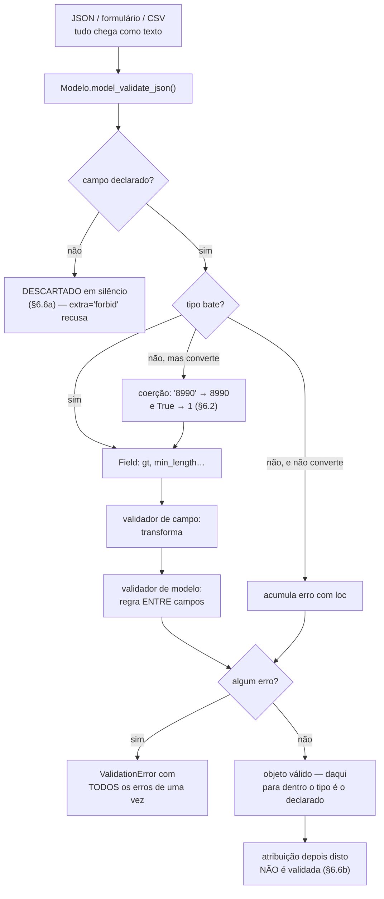

# 04.15 — Pydantic

> **Módulo 04 — Python Avançado** · Nível: N2 · Tempo estimado: 3h · Código: `codigo/cap15/`

## 1. Objetivo

- **Implementar** validação declarativa de dados que vêm de fora do programa.
- **Ler** um `ValidationError` e localizar o campo exato, inclusive dentro de listas aninhadas.
- **Escolher** entre restrição declarativa (`Field`), validador de campo e validador de modelo.
- **Reconhecer** os três padrões em que o Pydantic aceita o que você não queria — e configurar o contrário.

Ao final, você tem uma fronteira: dentro dela, os tipos são o que a assinatura diz.

---

## 2. Pré-requisitos

- [04.14 — Type hints](14-type-hints.md) — a sintaxe é a mesma; o que muda é quem a lê e quando.
- [04.13 — Dataclasses](13-dataclasses.md) — o mini projeto daquele capítulo pediu treze linhas de conversão à mão; aqui elas somem.
- [04.09 — Encapsulamento](09-encapsulamento-e-properties.md) — validar na entrada é a mesma ideia do setter, aplicada ao objeto inteiro.

**Autoteste:** (1) O que `mypy` faz com um JSON que chega em execução? (2) O que `dict[str, Any]` diz sobre a conferência daquele dado? (3) Por que `asdict` não incluiu o total do pedido?

---

## 3. Motivação

O mini projeto do 04.14 terminou numa pergunta, e ela tem duas respostas ruins.

Os registros vêm de um JSON externo. Anotados como `list[dict[str, Any]]`, o verificador aprova tudo:

```
mypy --strict -> Success: no issues found in 1 source file
python        -> [Produto(nome='Mouse', preco_centavos='8990', categoria='perifericos')]
```

Um `Produto` com o preço em **texto**, aprovado por uma ferramenta que existe para pegar exatamente isso. `Any` desligou a verificação (04.14/§6.4), e o defeito vai aparecer na primeira soma.

Trocar para `dict[str, object]` faz o verificador exigir conversão — um erro por campo — e a conversão à mão é isto:

```python
def carregar(registro: dict[str, object]) -> Produto:
    nome = registro.get("nome")
    if not isinstance(nome, str) or not 2 <= len(nome) <= 60:
        raise ValueError("nome inválido: %r" % nome)
    preco = registro.get("preco_centavos")
    if isinstance(preco, str):
        preco = int(preco)          # e se não for um número?
    if not isinstance(preco, int) or preco <= 0:
        raise ValueError("preço inválido: %r" % preco)
    ...
```

Três campos, doze linhas, e ela **para no primeiro erro** — quem enviou o formulário conserta o nome, reenvia, e descobre o problema do preço. Com quinze campos são sessenta linhas, e cada campo novo custa quatro.

**A pergunta que o capítulo responde:** por que escrever isso, se a informação já está na anotação?

---

## 4. Modelo mental

Pydantic é **a alfândega do seu programa**.

Ele fica num lugar só — a fronteira, onde o dado externo entra — e faz uma passagem única: confere tudo, converte o que dá para converter, e **recusa a remessa inteira** relatando cada problema encontrado.

```
    JSON / formulário / CSV / variável de ambiente
                  ↓
        ┌───────────────────────┐
        │  ALFÂNDEGA (Pydantic) │   confere todos os campos
        │  a anotação é a lei   │   converte o que dá
        └───────────────────────┘   relata TODOS os erros
                  ↓
        objetos cujos tipos são
        o que a assinatura diz
```

Dentro da fronteira, o `mypy` volta a ter razão: `produto.preco_centavos` **é** um `int`, porque alguém conferiu na entrada.

**A frase que organiza o capítulo: Pydantic valida a entrada, não a vida do objeto.** Ele roda quando o objeto é **criado**. Depois disso, o objeto é seu — e a §6.6 mostra o que acontece quando você esquece disso.

E note a divisão com o capítulo anterior: **o `mypy` confere o seu código; o Pydantic confere o dado dos outros.** Os dois usam a mesma anotação, em momentos diferentes, e nenhum substitui o outro.

---

## 5. Analogia

Já está na §4, e vale insistir num detalhe dela.

A alfândega **não acompanha a mercadoria depois da liberação**. Ela carimba na entrada. Se alguém abrir a caixa três quarteirões adiante e trocar o conteúdo, o carimbo continua lá, dizendo que estava tudo certo — e estava, no momento em que foi conferido.

**E a analogia acerta no que mais engana:** uma remessa com um item **a mais**, não declarado, passa sem comentário na configuração padrão. O item some — não entra no inventário e não gera aviso. É o comportamento da §6.6, e é a razão de `extra="forbid"` existir.

---

## 6. Teoria

### 6.1 O modelo

```python
from pydantic import BaseModel

class Produto(BaseModel):
    nome: str
    preco_centavos: int
    categoria: str
```

**É a declaração do 04.13, com outra classe base.** A mesma sintaxe de anotação, agora conferida quando o objeto nasce:

```
entrou como texto: '8990'
saiu como       : 8990 · tipo int
```

`BaseModel` dá, de saída, o que a `@dataclass` dava — `__init__`, `__repr__`, `__eq__` — mais a validação, a conversão, e a entrada e saída em JSON.

### 6.2 A coerção, e o que ela aceita

Por padrão, o Pydantic **converte** quando a conversão é inequívoca. Isso é deliberado: numa requisição HTTP, num formulário ou num CSV, **tudo chega como texto**, e recusar `"8990"` para um campo `int` tornaria a biblioteca inútil onde ela mais serve.

O que ele faz com cada entrada, num campo `int`:

```
'8990'       -> 8990
8990.0       -> 8990
8990.7       -> RECUSADO (int_from_float)
True         -> 1
'  8990  '   -> 8990
b'8990'      -> 8990
'8_990'      -> 8990
None         -> RECUSADO (int_type)
```

**Três linhas merecem atenção.**

`8990.0` passa e `8990.7` não: a conversão só acontece quando **nada se perde**. É a regra que separa conveniência de adivinhação.

`'8_990'` passa porque o Python aceita sublinhado em literais numéricos. Provavelmente ninguém vai digitar isso, e é bom saber que passa.

**E `True` vira `1`.** Um campo `preco_centavos` que receba `True` produz um produto de **um centavo**, sem erro. É herança do Python (`bool` é subclasse de `int`, como o 04.13/A2.3 mostrou na ordenação), e é o caso mais afiado da coerção.

Quem não quer nada disso liga o modo estrito:

```python
model_config = ConfigDict(strict=True)
```

```
'8990'  -> RECUSADO      8990  -> 8990
8990.0  -> RECUSADO      True  -> RECUSADO
```

**O critério:** modo estrito onde o dado já deveria estar tipado (mensagem de outro serviço seu, arquivo que você mesmo gerou); modo padrão na borda humana, onde tudo é texto.

Note também que aqui **o `mypy` e o Pydantic discordam** — passar `object` onde a anotação diz `int` é recusado pelo verificador e aceito pelo validador. Os dois estão certos: um confere a declaração, o outro confere o dado.

### 6.3 O erro, e por que ele é o melhor da biblioteca

```
nome               String should have at least 2 characters
preco_centavos     Input should be greater than 0
categoria          Input should be 'acessorios', 'audio', 'perifericos' or 'video'
estoque            Input should be greater than or equal to 0
```

**Quatro campos, quatro mensagens, uma passagem** — a mesma estrutura do `mypy` no 04.14, agora sobre dados. A validação à mão da §3 teria relatado o primeiro e parado.

E o `ValidationError` não é só texto. `erro.errors()` devolve uma lista de dicionários com `type`, `loc`, `msg` e `input` — pronta para virar resposta de API, que é exatamente o que o FastAPI faz com ela no módulo 06.

**O `loc` é o que resolve o problema de verdade:**

```
loc=('data',)                    Input should be a valid date or datetime
loc=('itens', 0, 'quantidade')   Input should be greater than 0
```

`('itens', 0, 'quantidade')` é o caminho até o campo: **o item de índice 0 da lista de itens**. Num pedido com quarenta itens, essa tupla é a diferença entre consertar em trinta segundos e caçar por meia hora.

E repare no primeiro: `"15/07/2026"` foi **recusado**. O Pydantic espera datas em ISO 8601 (`2026-07-15`), e a data brasileira não passa — o que é a resposta certa, porque `03/04/2026` é ambíguo entre dois continentes. Converter formatos locais é trabalho de quem recebe o formulário, e o assunto é o 04.18.

### 6.4 `Field` — a restrição que cabe na declaração

```python
class Produto(BaseModel):
    nome: str = Field(min_length=2, max_length=60)
    preco_centavos: int = Field(gt=0, le=10_000_00)
    categoria: Literal["acessorios", "audio", "perifericos", "video"]
    codigo_fornecedor: str = Field(default="", repr=False)
    estoque: int = Field(default=0, ge=0)
```

| Restrição | Serve para |
|---|---|
| `gt`, `ge`, `lt`, `le` | faixas numéricas |
| `min_length`, `max_length` | texto e coleções |
| `pattern` | expressão regular |
| `default`, `default_factory` | valor padrão (como no 04.13) |
| `repr=False` | fora do `repr` (como no 04.13) |
| `alias` | o nome no JSON é diferente do nome no Python |

**`Literal` substitui a lista de categorias** que o 04.13 guardava num `ClassVar` e conferia num `if` — e a mensagem de erro sai pronta, listando as opções válidas.

### 6.5 Validadores — o que não cabe numa restrição

```python
@field_validator("sku")
@classmethod
def sku_maiusculo(cls, valor: str) -> str:
    return valor.strip().upper()
```

**Validador de campo** roda por campo e pode **transformar** — devolver o valor limpo, normalizado, convertido. É onde vai o `strip()`, o `upper()`, o CEP sem hífen.

```python
@model_validator(mode="after")
def desconto_cabe_no_total(self) -> "Item":
    bruto = self.quantidade * self.preco_unitario_centavos
    if self.desconto_centavos > bruto:
        raise ValueError("desconto %d maior que o total %d"
                         % (self.desconto_centavos, bruto))
    return self
```

```
normalizado: sku='MOU-1' quantidade=2 …
regra entre campos -> Value error, desconto 500 maior que o total 100
```

**Validador de modelo** roda com todos os campos prontos, e é o único lugar onde cabe uma regra **entre** campos. `mode="after"` significa "depois da conversão de tipos" — o que você quer em 95% dos casos.

Os dois devolvem: o de campo, o valor; o de modelo, `self`. Esquecer o `return` faz o campo virar `None`, em silêncio.

### 6.6 Os três padrões que enganam

**(a) Campo a mais é ignorado.** O padrão do Pydantic é descartar o que não conhece:

```
certo: cliente='Ana' desconto_centavos=5000
typo:  cliente='Ana' desconto_centavos=0
```

A segunda linha recebeu `descconto_centavos=5000` — com um `c` a mais. O campo desconhecido foi jogado fora, o campo real ficou no default, e **um desconto de R$ 50,00 desapareceu sem erro, aviso ou log**. Num campo obrigatório o erro apareceria como "Field required"; num campo com default, não aparece nada.

```python
model_config = ConfigDict(extra="forbid")
```

```
-> Extra inputs are not permitted ('descconto_centavos',)
```

**Ligue isto em todo modelo que recebe dado externo.** É uma linha, e é a diferença entre um defeito silencioso e uma mensagem que nomeia o campo errado.

**(b) Atribuição não é validada.** A validação acontece na criação:

```
p = Produto(preco_centavos=8990)     # conferido
p.preco_centavos = -999              # passou!
```

É coerente com o modelo mental (a alfândega carimba na entrada), e pega quem espera que o objeto se defenda a vida toda. `ConfigDict(validate_assignment=True)` liga a conferência nas atribuições, ao custo de rodar o validador a cada uma.

**(c) `int | None` sem default é obrigatório.**

```
ComOpcional() -> Field required
```

Isso contraria a leitura natural de "opcional". `| None` fala do **tipo** — o campo aceita `None` como valor; não fala da **obrigatoriedade**. Para tornar o campo opcional, dê um default: `talvez: int | None = None`.

### 6.7 Entrada e saída

```python
Pedido.model_validate_json(texto)    # do JSON cru, direto
Pedido.model_validate(dicionario)    # de um dicionário
pedido.model_dump()                  # para dicionário
pedido.model_dump_json()             # para JSON
```

`model_validate_json` lê o JSON **e** valida numa passagem só, sem `json.loads` — e é mais rápido que as duas etapas separadas (§13).

E há um detalhe que resolve uma dívida do 04.13. Lá, `asdict` ignorava o `@property` e entregava um pedido **sem o total**. Aqui:

```python
@computed_field
@property
def total_centavos(self) -> int:
    return sum(item.total_centavos for item in self.itens)
```

```
{"cliente":"Ana","data":"2026-07-15","itens":[…],"total_centavos":50880}
```

`@computed_field` põe o valor calculado na saída sem torná-lo campo de entrada.

### 6.8 Pydantic ou dataclass?

As duas declaram campos com anotação. A diferença é **quem produz o dado**.

| | `@dataclass` | `BaseModel` |
|---|---|---|
| Valida na criação | não | **sim** |
| Converte tipos | não | sim (§6.2) |
| Entrada/saída JSON | à mão | pronta |
| Custo de criar | 92,9 ms | 234,9 ms (§13) |
| Depende de biblioteca | não (padrão) | sim |

**A regra:** `BaseModel` na **borda** — o que chega de HTTP, formulário, arquivo, fila, variável de ambiente. `@dataclass` no **núcleo**, onde o dado já foi conferido e cada validação repetida é custo sem ganho.

Validar de novo em cada camada interna é o erro que transforma "validação" em ritual. Valide uma vez, na entrada, e confie no tipo depois disso — que é justamente o que o `mypy` passa a poder verificar.

---

## 7. Funcionamento interno

Na versão 2, o Pydantic compila cada modelo em um **validador escrito em Rust**, gerado uma vez quando a classe é definida.

Isso explica três coisas medidas na §13. Primeira: a validação é rápida o bastante para não ser o gargalo. Segunda: `model_validate_json` supera `json.loads` seguido de construção, porque analisa o JSON dentro do Rust, sem construir os dicionários intermediários do Python. Terceira: ler um atributo é ~48% mais lento que numa dataclass, porque o modelo mantém estrutura extra por objeto.

O custo aparece também onde não se espera: **definir** um modelo é mais caro que definir uma dataclass, porque o validador é construído ali. Como no 04.13 e no 04.14, isso é pago no `import`, uma vez.

---

## 8. Visualização do fluxo



**Como ler:** o caminho desce uma vez, na criação. O ramo à esquerda do primeiro losango é o silêncio da §6.6a — o único ponto do diagrama em que algo é perdido sem relato. E a última caixa é o limite do modelo mental: a alfândega carimbou e foi embora.

---

## 9. Aplicação prática

O pedido da Aurora, do JSON cru ao JSON de saída:

```python
class Item(BaseModel):
    model_config = ConfigDict(extra="forbid")
    sku: str = Field(min_length=3)
    quantidade: int = Field(gt=0)
    preco_unitario_centavos: int = Field(ge=0)
    desconto_centavos: int = Field(default=0, ge=0)

    @model_validator(mode="after")
    def desconto_cabe_no_total(self) -> "Item": ...

class Pedido(BaseModel):
    model_config = ConfigDict(extra="forbid")
    cliente: str = Field(min_length=2)
    data: date
    itens: list[Item] = Field(min_length=1)
```

```
cliente: Ana · data: 2026-07-15 (date)
sku normalizado: MOU-1 · quantidade '2' -> 2
total: 50880
saída: {"cliente":"Ana",…,"total_centavos":50880}
```

**Quatro coisas aconteceram sem uma linha de código imperativo:** a data virou objeto `date`, a quantidade `"2"` virou `int`, o SKU minúsculo virou maiúsculo, e `itens` vazio seria recusado por `min_length=1`.

**E o pagamento da dívida do 04.13.** O mini projeto daquele capítulo mediu **treze linhas** de conversão e validação para sete campos de configuração. A mesma configuração, aqui:

```python
class Config(BaseSettings):
    model_config = SettingsConfigDict(env_prefix="AURORA_", extra="forbid")

    host: str = "localhost"
    porta: int = Field(default=5432, ge=1, le=65535)
    banco: str = "aurora"
    usuario: str = "aurora"
    senha: str = Field(default="", repr=False)
    nivel_log: Literal["DEBUG", "INFO", "WARNING", "ERROR"] = "INFO"
    timeout_s: float = Field(default=5.0, gt=0)
```

```
porta virou: int 5433
senha no repr? False
porta        Input should be less than or equal to 65535
nivel_log    Input should be 'DEBUG', 'INFO', 'WARNING' or 'ERROR'
```

Sete declarações no lugar de treze linhas de `int(...)` e `if`, lendo as variáveis de ambiente sozinha por causa do `env_prefix`, com a senha fora do `repr` e as mensagens nomeando o campo. `BaseSettings` mora no pacote `pydantic-settings`, instalado à parte.

---

## 10. Código comentado

Em [`codigo/cap15/validacao.py`](codigo/cap15/validacao.py), seis cenas: a fronteira; o que a coerção aceita; os erros todos de uma vez com o caminho aninhado; `Field` e os dois tipos de validador; os três padrões que enganam; e a Aurora do JSON cru ao JSON de saída.

```bash
pip install pydantic pydantic-settings
python codigo/cap15/validacao.py
mypy --strict codigo/cap15/validacao.py
```

**É o primeiro código do manual escrito sob a política do 04.14:** inteiramente tipado, e passa em `mypy --strict`. Vale ler os dois `# type: ignore` que sobraram — um é a discordância legítima da §6.2, o outro é uma limitação conhecida do verificador com `@computed_field`. Os dois trazem o código da regra e o motivo, como o 04.14/§6.8 pediu.

---

## 11. Erros comuns

| Erro | Sintoma | Correção |
|---|---|---|
| Não configurar `extra` | Campo com erro de digitação some, e o default fica | `ConfigDict(extra="forbid")` em todo modelo de borda |
| Esperar validação na atribuição | `objeto.campo = -999` passa | `ConfigDict(validate_assignment=True)` |
| `int \| None` sem default | "Field required" num campo que você achava opcional | `int \| None = None` |
| Validador sem `return` | O campo vira `None`, em silêncio | Devolva o valor (campo) ou `self` (modelo) |
| Regra entre campos num `field_validator` | Os outros campos ainda não existem | `@model_validator(mode="after")` |
| Validar de novo em cada camada | Custo repetido e regras que divergem entre si | Valide na borda; dataclass no núcleo |
| Usar `BaseModel` para tudo | 2,5× mais caro para criar, sem ganho | `@dataclass` onde o dado já foi conferido |
| Esperar `"15/07/2026"` virar data | `Input should be a valid date` | ISO 8601, ou um validador que converta (04.18) |

---

## 12. Boas práticas

- **`extra="forbid"` por padrão** em qualquer modelo que receba dado de fora. Uma linha contra um defeito silencioso.
- **Um módulo `esquemas.py`** com os modelos de borda, separado do domínio. A fronteira fica visível no layout do projeto (04.17).
- **`Field` para o que é restrição; validador para o que é regra.** Se a regra cabe em `gt=0`, ela não precisa de função.
- **Mensagens de erro em linguagem de domínio.** `"desconto maior que o total"` é útil; `"valor inválido"` não.
- **Modo estrito entre serviços seus**, modo padrão na borda humana.
- **Nunca `Any` num modelo de borda.** Se um campo é mesmo variável, `dict[str, str]` ou um modelo por variante dizem mais.
- **Não valide o mesmo dado duas vezes.** A segunda validação não protege nada e é a que vai divergir da primeira.

---

## 13. Performance

Duzentos mil objetos, melhor de cinco, Python 3.10 com Pydantic 2.13:

| Criação a partir de dicionário | Tempo |
|---|---|
| `@dataclass` (sem validar) | 92,9 ms |
| `@dataclass(frozen=True)` | 138,1 ms |
| Validação escrita à mão | 130,5 ms |
| **`BaseModel`** | **234,9 ms** |

Criar um modelo custa **2,5×** a dataclass simples — e **1,8×** a validação escrita à mão, que faz menos (não converte, não acumula erros, não gera mensagem). É o preço, e ele é conhecido.

**Mas a comparação muda de sinal onde o Pydantic é de fato usado:**

| Do JSON | Tempo |
|---|---|
| `json.loads` + `dataclass(**dados)` | 518,5 ms |
| **`Modelo.model_validate_json`** | **278,8 ms** |

| Para a saída | Tempo |
|---|---|
| `asdict(objeto)` | 1097,4 ms |
| **`objeto.model_dump()`** | **297,3 ms** |
| `json.dumps(asdict(objeto))` | 1848,1 ms |
| **`objeto.model_dump_json()`** | **505,6 ms** |

**Na fronteira, o Pydantic é 1,9× mais rápido para entrar e 3,7× mais rápido para sair** — e ainda valida. O motivo é o §7: o JSON é analisado e gerado em Rust, sem passar pelos dicionários intermediários do Python.

O que ele cobra é o acesso: ler um atributo leva 48,1 ms por milhão contra 32,4 ms da dataclass, cerca de 48% a mais. Numa borda que valida uma vez e num núcleo que lê milhões de vezes, essa assimetria é exatamente o argumento da §6.8 — **modelo na entrada, dataclass no meio**.

---

## 14. Mercado

Pydantic é hoje a biblioteca de validação padrão do ecossistema Python, com centenas de milhões de downloads por mês. A versão 2 (2023) reescreveu o núcleo em Rust e mudou a conversa: antes o argumento contra era desempenho, e ele deixou de valer na fronteira.

Onde ela aparece: **FastAPI** (módulo 06) usa modelos Pydantic como corpo de requisição e de resposta, e gera a documentação OpenAPI a partir deles — o `ValidationError` vira automaticamente uma resposta `422` com o `loc` de cada campo. **pydantic-settings** é o padrão para configuração. Em engenharia de dados (módulo 10), modelos validam registros na entrada do pipeline, onde um CSV com uma coluna a menos custa caro.

Em entrevista, as duas perguntas frequentes são "Pydantic ou dataclass?" — que testa se você entende borda e núcleo — e "o que acontece com um campo a mais no JSON?", que testa se você já foi mordido pelo padrão `extra="ignore"`.

A alternativa histórica é `marshmallow`, anterior aos type hints e baseada em declarar campos como objetos. Ainda existe; a diferença é que o Pydantic reaproveita a anotação que você já ia escrever.

---

## 15. Entrevistas

- **"Pydantic ou dataclass?"** Modelo na **borda**, dataclass no **núcleo**. Criar um modelo custa 2,5× a dataclass, mas entrar e sair de JSON é 1,9× e 3,7× mais rápido — validar onde o dado chega é onde ele paga.
- **"O que acontece com um campo a mais no JSON?"** Por padrão, é **descartado em silêncio** — e um erro de digitação num campo com default vira o default, sem aviso. `extra="forbid"`.
- **"Pydantic valida quando eu atribuo um campo?"** Não, só na criação. `validate_assignment=True` muda isso.
- **"Por que `"8990"` vira `8990`?"** Porque na borda tudo chega como texto. A conversão só acontece quando nada se perde — `8990.7` é recusado. Modo estrito desliga.
- **"Como você trata um erro de validação numa API?"** `erro.errors()` já é uma lista estruturada com `loc`, `msg` e `type`; o `loc` dá o caminho até o campo aninhado. É o que o FastAPI devolve como `422`.

---

## 16. Exercícios guiados

Em [`exercicios/cap15.md`](exercicios/cap15.md):

- **A1** `[~10 min · passa ou não?]` — 8 valores contra campos declarados.
- **A2** `[~12 min · prevê a saída]` — 6 modelos com configurações diferentes.
- **A3** `[~12 min · ache o erro]` — 6 modelos defeituosos.
- **A4** `[~10 min · Field, validador ou config?]` — 6 requisitos.
- **AP1** `[~20 min · a refatoração]` — Troque a validação à mão do 04.14 por um modelo.
- **AP2** `[~25 min · a fronteira aninhada]` — Pedido com itens e endereço.
- **AP3** `[~20 min · a config]` — Termine o mini projeto do 04.13 com `BaseSettings`.
- **D1** `[~50 min · a alfândega da Aurora]` — **Borda validada, núcleo em dataclass.**

---

## 17. Desafios

**D1 — A alfândega da Aurora.** Construa a fronteira completa de um endpoint de criação de pedido, com **duas camadas**: modelos Pydantic para o que chega, dataclasses para o que circula por dentro.

Requisitos: `PedidoEntrada`, `ItemEntrada` e `EnderecoEntrada` como modelos com `extra="forbid"`; validação de quantidade, preço, CEP (oito dígitos, com ou sem hífen) e no mínimo um item; conversão explícita para `Pedido`, `ItemPedido` e `Endereco` como dataclasses congeladas; e uma função `processar(json_cru: str) -> Pedido | list[dict]` que devolva o pedido ou a lista de erros.

**As três perguntas que valem a nota:** (1) Onde ficou a fronteira — e o que aconteceria se o `Pedido` de dentro fosse o próprio modelo Pydantic? (2) Você validou alguma coisa **duas** vezes? Qual, e por quê? (3) A quantidade máxima por item é regra de validação ou regra de negócio? Justifique pela pergunta "essa regra pode mudar sem que o formato do dado mude?".

---

## 18. Mini projeto

**O importador de CSV.** Um script que leia um CSV de produtos com defeitos plantados e produza dois arquivos: `validos.json` e `rejeitados.json`.

Requisitos: um modelo com `extra="forbid"` e restrições em todos os campos; cada linha rejeitada aparece no relatório com **o número da linha, o campo e a mensagem**; conversão de preço em reais com vírgula (`"89,90"`) para centavos, num validador de campo; e um resumo ao final com a contagem por tipo de erro.

O CSV de entrada deve ter, de propósito: uma linha com preço vazio, uma com categoria inexistente, uma com coluna a mais, uma com quantidade negativa e uma perfeitamente válida.

E a pergunta que fecha: sua contagem por tipo de erro usou o campo `type` do `errors()` ou a mensagem em texto? Um deles é estável entre versões da biblioteca e o outro não — descubra qual antes de escolher.

---

## 19. Revisão

**Resumo em 5 frases.** Pydantic é **a alfândega do programa**: um lugar só, na fronteira, onde o dado externo é conferido, convertido e recusado com **todos os erros de uma vez** — a mesma anotação do 04.14, agora lida em execução, sobre o dado dos outros em vez do seu código. A coerção converte quando nada se perde (`"8990"` vira `8990`, `8990.7` é recusado) porque na borda tudo chega como texto, e o caso afiado é `True` virando `1`, um preço de um centavo sem erro nenhum. O `ValidationError` é a melhor parte da biblioteca: `errors()` devolve uma lista estruturada, e o `loc` dá o **caminho** até o campo — `('itens', 0, 'quantidade')` aponta o item exato num pedido com quarenta. Três padrões enganam e todos se corrigem com uma linha de configuração: campo a mais é **descartado em silêncio** (`extra="forbid"`), atribuição depois da criação **não é validada** (`validate_assignment=True`), e `int | None` sem default é **obrigatório** (`= None`). E a divisão que organiza o projeto é medida, não estética: modelo na borda, onde entrar e sair de JSON é 1,9× e 3,7× mais rápido que a dataclass, e dataclass no núcleo, onde criar custa 2,5× menos e ler atributo 48%.

**Flashcards** (também em [`revisao/flashcards.md`](revisao/flashcards.md)):

| ID | Frente | Verso |
|---|---|---|
| 04.15-F1 | Qual a diferença entre o que o `mypy` faz e o que o Pydantic faz? | O `mypy` confere **o seu código**, antes de rodar; o Pydantic confere **o dado dos outros**, em execução, na criação do objeto. Mesma anotação, momentos diferentes, e nenhum substitui o outro — o verificador não pode saber o que vem no JSON. |
| 04.15-F2 | Explique com suas palavras por que `extra="forbid"` importa tanto. | (Elaboração) O padrão **descarta** campo desconhecido em silêncio. Num campo obrigatório o erro aparece como "Field required"; num campo **com default**, `descconto_centavos=5000` vira `desconto_centavos=0` — R$ 50,00 somem sem erro, aviso ou log. Uma linha de config transforma isso numa mensagem que nomeia o campo. |
| 04.15-F3 | Preveja: `p = Modelo(preco=8990)` e depois `p.preco = -999`, com `Field(gt=0)`. | (Previsão) **Passa.** A validação acontece na **criação**, não na vida do objeto — a alfândega carimba na entrada. `ConfigDict(validate_assignment=True)` liga a conferência nas atribuições, ao custo de rodar o validador a cada uma. |
| 04.15-F4 | Quando usar `BaseModel` e quando usar `@dataclass`? | (Decisão) Modelo na **borda** (HTTP, formulário, CSV, ambiente); dataclass no **núcleo**. Medido: criar modelo custa 2,5× a dataclass, mas `model_validate_json` é 1,9× mais rápido que `json.loads` + construção, e `model_dump_json` 3,7× mais rápido que `json.dumps(asdict(...))`. |
| 04.15-F5 | `int \| None` num modelo torna o campo opcional? | **Não.** `\| None` fala do **tipo** (aceita `None` como valor), não da obrigatoriedade: sem default, o campo é exigido e omiti-lo dá "Field required". Opcional é `int \| None = None`. |

**Revisão espaçada:** D+1 refaça A2 e A3 · D+7 o AP2 (a fronteira aninhada, com o `loc` de cada erro) · D+30 escreva de memória um modelo de borda com as três configurações que a §6.6 corrige, e explique cada uma.

---

## 20. Checklist

- [ ] Escrevi um modelo e vi `"8990"` virar `8990`.
- [ ] Vi `True` virar `1` num campo de preço.
- [ ] Li um `ValidationError` com quatro campos de uma vez.
- [ ] Usei `errors()` e localizei um campo por `loc` dentro de uma lista.
- [ ] Perdi um valor por erro de digitação e liguei `extra="forbid"`.
- [ ] Atribuí um valor inválido depois da criação e vi passar.
- [ ] Escrevi um `field_validator` que transforma e um `model_validator` que compara campos.
- [ ] Usei `@computed_field` e vi o valor derivado entrar no `model_dump`.
- [ ] Comparei os tempos da §13 e decidi onde fica a fronteira do meu projeto.
- [ ] Rodei `mypy --strict` no código do capítulo.

---

## 21. Próximo capítulo

[04.16 — Ambientes virtuais e pip](16-ambientes-virtuais-e-pip.md). Este capítulo e o anterior pediram três `pip install` — mypy, pydantic, pydantic-settings — e todos foram instalados no seu computador inteiro, como a Caixa-preta do 04.14 avisou. O próximo abre a caixa: o que o `pip` faz, por que instalar assim vira problema no dia em que dois projetos precisarem de versões diferentes da mesma biblioteca, e como dar a cada projeto o seu próprio conjunto de dependências. Daqui em diante, todo projeto do manual tem ambiente isolado.
