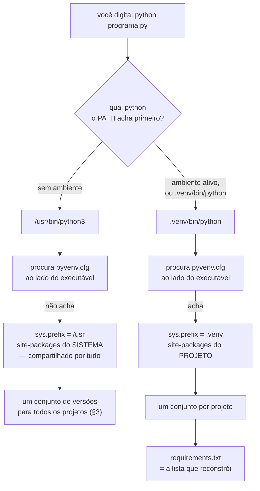

# 04.16 — Ambientes virtuais e pip

> **Módulo 04 — Python Avançado** · Nível: N2 · Tempo estimado: 2h30 · Código: `codigo/cap16/`

## 1. Objetivo

- **Explicar** por que dois projetos não cabem num interpretador só.
- **Configurar** um ambiente virtual e instalar dependências dentro dele.
- **Escrever** um `requirements.txt` que produza o mesmo ambiente daqui a seis meses.
- **Reconhecer** o que a fixação de versões garante — e o que ela não garante.

Ao final, cada projeto seu tem o seu próprio conjunto de bibliotecas. **Daqui em diante, todo projeto do manual começa criando um ambiente.**

---

## 2. Pré-requisitos

- [04.14 — Type hints](14-type-hints.md) e [04.15 — Pydantic](15-pydantic.md) — os três `pip install` que este capítulo vem explicar.
- [02.06 — Variáveis de ambiente e PATH](../02-Git-Linux/06-variaveis-de-ambiente-e-path.md) — "ativar" um ambiente é uma alteração no `PATH`, e nada mais.
- [02.09 — Fluxo essencial do Git](../02-Git-Linux/09-fluxo-essencial-do-git.md) — a pasta do ambiente é o caso mais claro de arquivo que não vai para o repositório.

**Autoteste:** (1) O que o shell faz quando você digita `python`? (2) O que acontece se dois arquivos com o mesmo nome estiverem em pastas diferentes do `PATH`? (3) Por que arquivos gerados não entram no repositório?

---

## 3. Motivação

Este arquivo é correto:

```python
class Produto(BaseModel):
    nome: str
    preco_centavos: int

produto = Produto(nome="Mouse", preco_centavos="8990")
print("saída:", produto.model_dump_json())
```

Rodando em dois ambientes do **mesmo computador**:

```
projeto-novo:
  pydantic 2.13.4
  saída: {"nome":"Mouse","preco_centavos":8990}

projeto-antigo:
      print("saída:", produto.model_dump_json())
  AttributeError: 'Produto' object has no attribute 'model_dump_json'
```

**Mesmo código, mesma máquina, resultados diferentes.** Nada no arquivo diz de qual versão do Pydantic ele precisa, e nada no computador impede que a versão errada esteja instalada.

Agora o caso que dói de verdade. Você tem dois projetos: um antigo, em produção, com Pydantic 1; um novo, com Pydantic 2. Instalando os dois no mesmo lugar:

```
instalando a versão 1 por cima da 2...
pydantic==1.10.13
pydantic_core==2.46.4          <- órfão, sobrou da versão 2
```

O `pip` **rebaixou a versão sem erro nenhum**. O projeto novo parou de funcionar no instante em que você instalou a dependência do projeto antigo, e a única pista é uma `AttributeError` que aparece na próxima execução.

**Um interpretador tem um conjunto de bibliotecas.** Enquanto todos os seus projetos couberem nesse conjunto, tudo bem. O primeiro que não couber quebra o anterior.

---

## 4. Modelo mental

**Um ambiente virtual é uma pasta com um Python dentro.**

Não é uma máquina virtual, não é um container, não há isolamento de sistema operacional. É uma pasta com esta estrutura:

```
.venv/
├── bin/               (Scripts/ no Windows)
│   ├── python         → aponta para o Python do sistema
│   ├── pip
│   └── activate
├── lib/python3.10/site-packages/     ← as bibliotecas DESTE projeto
└── pyvenv.cfg
```

O truque inteiro está numa linha: **o Python descobre onde procurar bibliotecas a partir do caminho do próprio executável**. Rodando `/usr/bin/python3`, ele procura no `site-packages` do sistema. Rodando `.venv/bin/python`, procura no `site-packages` da pasta `.venv`.

```
fora   -> prefix: /usr        · base_prefix: /usr   · iguais? True
dentro -> prefix: …/.venv     · base_prefix: /usr   · iguais? False
```

**A frase que organiza o capítulo: quem decide tudo é qual `python` você chamou.** "Ativar" o ambiente não liga nada — apenas põe `.venv/bin` na frente do `PATH`, para que digitar `python` chame aquele e não o outro. Chamar `.venv/bin/python` direto tem exatamente o mesmo efeito, sem ativar coisa nenhuma.

---

## 5. Analogia

Uma oficina com **uma bancada só**.

Dois carros na fila, e cada um pede uma versão diferente da mesma peça. A bancada comporta uma. Montar a peça do segundo carro significa tirar a do primeiro — e ninguém avisa o dono do primeiro carro, que só descobre quando vai buscá-lo.

O ambiente virtual é **uma maleta de ferramentas por carro**. Ocupa mais espaço, e em troca cada trabalho tem exatamente as peças de que precisa.

**E a analogia acerta em dois limites.** A maleta guarda ferramentas, não a oficina: o Python continua sendo o do sistema, e um projeto que precise de outra **versão do Python** não se resolve assim (§14). E a maleta **não é transportável** — copiá-la para outro computador não funciona, pelo motivo da §6.7. O que se transporta é a **lista** do que há dentro.

---

## 6. Teoria

### 6.1 Onde o `pip` instala quando não há ambiente

```
Location: /home/voce/.local/lib/python3.10/site-packages
```

Sem ambiente, o `pip` instala num lugar compartilhado por **tudo** o que roda naquele Python: seus dez projetos, os scripts do sistema, o que você experimentou uma vez em 2024.

Em distribuições Linux recentes e no macOS com Homebrew, tentar instalar no Python do sistema produz um erro:

```
error: externally-managed-environment
```

**É uma proteção, não um defeito.** O sistema operacional usa aquele Python, e um `pip install` errado pode quebrar ferramentas do próprio sistema. A mensagem sugere `--break-system-packages`, e o nome da opção é o aviso. A resposta certa é criar um ambiente.

### 6.2 O conflito, demonstrado

Já está na §3, e vale registrar o detalhe que passa despercebido. Depois do rebaixamento:

```
pydantic==1.10.13
pydantic_core==2.46.4          <- órfão
```

`pydantic_core` era dependência da versão 2. A versão 1 não o usa, e ele ficou. O ambiente está agora num estado que **nenhum `requirements.txt` descreve** — nem o do projeto antigo, nem o do novo.

### 6.3 Criar, usar, sair

```bash
python -m venv .venv
```

Uma pasta, quatro segundos, 19 MB (§13). A partir daí, duas formas de usar — e a segunda é mais confiável:

```bash
# Ativando (Linux/macOS)
source .venv/bin/activate
python codigo/programa.py
pip install pydantic
deactivate

# Sem ativar — mesmo efeito, sem estado escondido
.venv/bin/python codigo/programa.py
.venv/bin/pip install pydantic
```

**No Windows** a pasta se chama `Scripts` e o comando é `.venv\Scripts\activate` no PowerShell (pode ser preciso `Set-ExecutionPolicy -Scope CurrentUser RemoteSigned` uma vez) ou `.venv\Scripts\activate.bat` no `cmd`. Sem ativar: `.venv\Scripts\python.exe`.

**O que `activate` faz é isto, e só isto:**

```bash
VIRTUAL_ENV=/caminho/do/projeto/.venv
PATH="$VIRTUAL_ENV/bin:$PATH"
```

Põe a pasta na frente do `PATH` (02.06) e guarda o `PATH` antigo para o `deactivate` restaurar. Nenhum processo em segundo plano, nenhuma configuração global, nada que sobreviva a fechar o terminal.

**A consequência prática que resolve metade dos problemas:** quando algo não funciona, pergunte *qual python está rodando*, não *o ambiente está ativo*:

```bash
which python        # Linux/macOS
where python        # Windows
python -c "import sys; print(sys.prefix)"
```

Use `python -m pip install` em vez de `pip install`. Assim o `pip` que roda é sempre o do interpretador que você invocou, e não sobra espaço para instalar num ambiente e importar de outro.

### 6.4 O que você pediu e o que veio

```bash
python -m pip install pydantic==2.13.4
python -m pip list        # tudo o que está instalado
python -m pip freeze      # o mesmo, no formato de requirements.txt
```

```
annotated-types==0.8.0
pydantic==2.13.4
pydantic_core==2.46.4
typing-inspection==0.4.2
typing_extensions==4.16.0
```

**Você pediu um pacote e vieram cinco.** Os outros quatro são as dependências do Pydantic, e as dependências delas. É normal, é assim que funciona, e é a razão de uma pasta de ambiente com dois pacotes ter 90 MB (§13).

Essa lista importa para a §6.5: `freeze` não distingue **o que você escolheu** do **que veio junto**.

### 6.5 `requirements.txt`

Um arquivo de texto, um pacote por linha, lido com `-r`:

```bash
python -m pip install -r requirements.txt
```

Os especificadores, testados contra as versões `1.10.13`, `2.0.0`, `2.13.4`, `2.14.0` e `3.0.0`:

| Escrito | Aceita |
|---|---|
| `==2.13.4` | apenas `2.13.4` |
| `>=2.0` | `2.0.0`, `2.13.4`, `2.14.0`, **`3.0.0`** |
| `>=2.0,<3.0` | `2.0.0`, `2.13.4`, `2.14.0` |
| `~=2.13` | `2.13.4`, `2.14.0` — igual a `>=2.13,<3.0` |
| `~=2.13.0` | apenas `2.13.4` — igual a `>=2.13.0,<2.14` |

**A linha do `>=2.0` é o problema em uma linha.** Ela aceita a versão 3.0.0, que por convenção é justamente a que quebra compatibilidade. Um projeto que instalou com `pydantic>=2.0` em janeiro e reinstalou em agosto pode ter recebido uma versão maior no caminho — e o defeito aparece longe da causa.

**Separe execução de desenvolvimento:**

```
# requirements.txt          # requirements-dev.txt
pydantic==2.13.4            -r requirements.txt
pydantic-settings==2.7.0    mypy==2.3.0
                            pytest==8.3.4
```

O `-r requirements.txt` na primeira linha do segundo arquivo inclui o primeiro. O servidor instala só o de execução; sua máquina instala o de desenvolvimento.

### 6.6 O que `==` garante, e o que não garante

Fixar com `==` garante que **o pacote que você nomeou** venha na versão que você escreveu. Não garante o resto.

O Pydantic 2.13.4 declara isto:

```
pydantic-core==2.46.4
typing-extensions>=4.14.1
annotated-types>=0.6.0
```

`pydantic-core` está fixo — o próprio Pydantic o fixou. Mas `typing-extensions>=4.14.1` está aberto: uma instalação hoje e outra em novembro podem trazer versões diferentes dele, com o seu `requirements.txt` idêntico.

**Três níveis de reprodutibilidade, do mais frouxo ao mais firme:**

1. **`pydantic` sem versão.** Cada instalação é uma aposta.
2. **`pydantic==2.13.4`.** O que você escolheu está fixo; o que veio junto, não. É o que o manual usa, e é suficiente para estudo e para a maioria dos projetos.
3. **`pip freeze > requirements.txt`.** Fixa tudo, inclusive o que você não escolheu. Reproduz melhor e custa clareza: seis meses depois, ninguém sabe quais das trinta linhas você quis e quais foram arrastadas — e atualizar uma delas vira arqueologia.

O nível 3 tem uma versão organizada, com dois arquivos: um com o que você escolheu (`requirements.in`) e um gerado a partir dele com tudo fixo (`requirements.txt`). Ferramentas como `pip-tools` e `uv` fazem essa geração, e é o padrão em projeto de produção (§14).

### 6.7 O ambiente não é portátil, e não vai para o Git

```
a primeira linha do executável do pip:
  #!/caminho/absoluto/do/projeto/.venv/bin/python3

depois de renomear a pasta:
  bad interpreter: No such file or directory
```

Os executáveis de `bin/` têm o caminho **absoluto** gravado na primeira linha. Renomear ou mover a pasta os quebra.

Curiosamente, o interpretador continua funcionando:

```
mas o interpretador continua achando os pacotes:
  import ok: 2.13.4
```

Porque ele descobre o prefixo pelo **próprio** caminho (§4), enquanto os scripts têm o caminho antigo escrito dentro. É a diferença entre descobrir e ter gravado.

Some-se a isso que pacotes compilados são específicos de sistema operacional e arquitetura, e a conclusão é uma linha no `.gitignore` (02.09):

```
.venv/
```

**O que vai para o Git é o `requirements.txt`.** Ele tem duas linhas e reconstrói as 3.524 (§13).

### 6.8 O que o `pip check` não pega

Depois do rebaixamento que quebrou o projeto:

```
pip check -> No broken requirements found.
```

**Nenhum problema encontrado**, num ambiente com `pydantic_core` órfão e um projeto que parou de funcionar. O `pip check` confere se as **declarações** batem — se cada pacote instalado tem as dependências que declarou, nas versões que pediu. Ele não sabe qual versão o **seu** código esperava.

É o mesmo formato do "Success" enganoso do 04.14/§6.8, e a lição se repete: uma ferramenta responde exatamente à pergunta que ela faz, e você precisa saber qual é.

---

## 7. Funcionamento interno

A pasta do ambiente tem um arquivo de três linhas:

```
home = /usr/bin
include-system-site-packages = false
version = 3.10.12
```

**É esse arquivo que faz tudo.** Quando o interpretador inicia, ele procura um `pyvenv.cfg` ao lado ou um nível acima do executável. Achando, define `sys.prefix` como a pasta do ambiente e `sys.base_prefix` como o `home` — e o `site-packages` passa a ser procurado a partir do primeiro.

`include-system-site-packages = false` é o que impede o ambiente de enxergar as bibliotecas de fora. Criando com `python -m venv --system-site-packages .venv`, essa linha vira `true` e o ambiente passa a ver o que estiver instalado no sistema, além do que tiver dentro. É útil quando algo pesado já está instalado globalmente, e é uma porta aberta para o problema da §3 voltar.

O `.venv/bin/python` costuma ser um link simbólico para o Python do sistema — a pasta não contém uma cópia do interpretador. É por isso que um ambiente vazio tem 19 MB e não 100: quase tudo ali são o `pip` e o `setuptools`.

---

## 8. Visualização do fluxo



**Como ler:** o losango de cima é a única decisão que existe, e ela é resolvida pelo `PATH` — por isso `activate` só mexe no `PATH`. Os dois caminhos fazem **a mesma coisa** no passo seguinte: procurar o `pyvenv.cfg`. A diferença inteira entre ter e não ter isolamento é achar ou não achar esse arquivo de três linhas.

---

## 9. Aplicação prática

O começo de qualquer projeto do manual, daqui em diante:

```bash
mkdir aurora && cd aurora
python -m venv .venv
source .venv/bin/activate            # .venv\Scripts\activate no Windows

python -m pip install pydantic==2.13.4 pydantic-settings==2.7.0
python -m pip install mypy==2.3.0 pytest==8.3.4
```

Os dois arquivos, escritos à mão e não com `freeze`:

```
# requirements.txt              # requirements-dev.txt
pydantic==2.13.4                -r requirements.txt
pydantic-settings==2.7.0        mypy==2.3.0
                                pytest==8.3.4
```

E a linha no `.gitignore`:

```
.venv/
```

**Quem clonar o repositório reconstrói tudo com dois comandos:**

```bash
python -m venv .venv && source .venv/bin/activate
python -m pip install -r requirements-dev.txt
```

**Três decisões estão embutidas aí, e vale saber que são decisões.** O nome `.venv` é convenção — o ponto o esconde na listagem, e editores o encontram sozinhos. O ambiente fica **dentro** da pasta do projeto, o que torna "apagar o projeto" uma operação completa. E os arquivos são escritos à mão, com o que você escolheu, e não gerados por `freeze` — pelo motivo da §6.6.

⚠️ **Caixa-preta 1:** projetos maiores substituem esses dois arquivos por um só, o `pyproject.toml`, que declara dependências **e** descreve o projeto como pacote instalável. Por enquanto, `requirements.txt` faz o trabalho. O `pyproject.toml`, o layout `src/` e o `pip install -e .` são o [04.17](17-organizacao-de-projetos.md).

---

## 10. Código comentado

[`codigo/cap16/conflito.sh`](codigo/cap16/conflito.sh) é o laboratório do capítulo: cria dois ambientes, instala versões incompatíveis do Pydantic e roda [`codigo/cap16/modelo.py`](codigo/cap16/modelo.py) nos dois.

```bash
bash codigo/cap16/conflito.sh
```

Seis cenas: onde o Python procura pacotes sem ambiente; a criação dos dois ambientes com o `sys.prefix` de cada um; a instalação das versões incompatíveis; o mesmo arquivo rodando e quebrando; o rebaixamento silencioso quando os dois vão para o mesmo lugar; e o ambiente renomeado, em que o `pip` quebra e o `python` continua funcionando.

O script baixa dois pacotes e usa cerca de 60 MB. Ele apaga e recria o laboratório a cada execução, e diz no fim onde a pasta ficou.

---

## 11. Erros comuns

| Erro | Sintoma | Correção |
|---|---|---|
| Instalar sem ambiente | `externally-managed-environment`, ou pior: instala e quebra outro projeto | `python -m venv .venv` |
| Instalar com o ambiente inativo | `ModuleNotFoundError` para algo que "está instalado" | `python -c "import sys; print(sys.prefix)"` |
| `pip install` em vez de `python -m pip install` | Instala num ambiente e importa de outro | Sempre `python -m pip` |
| Versionar `.venv/` | Repositório com milhares de arquivos, e que não funciona em outro sistema | `.venv/` no `.gitignore` |
| Copiar `.venv` para outra máquina | `bad interpreter`, ou pacotes compilados para outro sistema | Recriar a partir do `requirements.txt` |
| `pydantic>=2.0` | Um dia chega a 3.0 e o projeto quebra sem que nada tenha mudado | `>=2.0,<3.0`, ou `==` |
| `pip freeze > requirements.txt` sem pensar | Trinta linhas em que ninguém distingue escolha de arrasto | Escreva à mão o que você escolheu (§6.6) |
| Confiar no `pip check` | "Nenhum problema" num ambiente quebrado | Ele confere declarações, não o seu uso |
| Um ambiente para vários projetos | O terceiro projeto quebra o primeiro | Um ambiente por projeto, dentro da pasta |

---

## 12. Boas práticas

- **Um ambiente por projeto, dentro da pasta do projeto, chamado `.venv`.**
- **Crie o ambiente antes de escrever a primeira linha.** Instalar por engano no Python do sistema acontece em dois segundos e leva meia hora para desfazer.
- **`python -m pip`, sempre.** Elimina a classe inteira de erros de "instalei aqui e importei dali".
- **Fixe com `==` o que você escolheu.** Se não puder fixar, use `>=x,<x+1` — nunca `>=` sozinho.
- **Escreva o `requirements.txt` à mão.** Ele é a lista das suas decisões, não o inventário da pasta.
- **Separe `requirements.txt` de `requirements-dev.txt`.** O servidor não precisa do `pytest`.
- **`.venv/` no `.gitignore`, sempre.**
- **Ao trocar de projeto, confira o `sys.prefix` antes de instalar qualquer coisa.**

---

## 13. Performance

Medido no laboratório do capítulo, Python 3.10 em Linux:

| Operação | Tempo | Tamanho |
|---|---|---|
| `python -m venv .venv` | 4,2 s | 19 MB · 1.339 arquivos |
| `pip install pydantic==2.13.4` | 7,6 s | +10 MB (5 pacotes) |
| `pip install pydantic==1.10.13` | 3,1 s | +10 MB (2 pacotes) |
| Ambiente com Pydantic + mypy | — | 90 MB · 3.524 arquivos |

**Os 19 MB de um ambiente vazio surpreendem, e são explicáveis:** quase tudo ali é o `pip` e o `setuptools`. O interpretador não é copiado — é um link para o do sistema (§7). Quem quiser um ambiente mínimo pode usar `python -m venv --without-pip .venv`, e aí instalar pacotes exige outro caminho.

**Dez projetos ocupam 900 MB de dependências repetidas.** É o custo real do isolamento, e é a razão de existirem ferramentas com cache compartilhado (§14). Em disco de 500 GB, é ruído; em imagem de container, importa, e o módulo 08 volta ao assunto.

O tempo de criação é quase todo do `pip` e do `setuptools` sendo instalados dentro. Já o tempo de instalação de pacotes depende sobretudo da rede e de haver ou não versão pré-compilada para o seu sistema — os 7,6 s do Pydantic 2 são majoritariamente download.

---

## 14. Mercado

`venv` vem com o Python desde a versão 3.3 e é o denominador comum: está em toda máquina, não exige instalar nada, e é o que qualquer pessoa entende. É o que este manual usa.

O ecossistema tem alternativas, e vale saber para que serve cada uma:

- **uv** (2024, escrito em Rust) faz o mesmo trabalho **uma ordem de grandeza mais rápido**, com cache compartilhado entre projetos — o que ataca diretamente os 900 MB da §13. Vem ganhando adoção rápida.
- **Poetry** e **PDM** gerenciam dependências e empacotamento juntos, com arquivo de trava (*lockfile*) próprio, resolvendo o problema da §6.6 de forma completa.
- **conda** resolve um problema diferente: instalar bibliotecas **não-Python** (compiladores, CUDA, bibliotecas científicas em C). É o padrão em ciência de dados por isso, não por causa de Python.
- **pyenv** resolve o que o `venv` não resolve: instalar **várias versões do Python** na mesma máquina. Os dois são complementares, e a confusão entre eles é frequente.
- **Docker** (módulo 08) leva o isolamento ao sistema inteiro, e num container o ambiente virtual vira opcional — assunto para lá.

Em entrevista, as perguntas frequentes são "por que ambiente virtual?" — que espera o cenário da §3, não a definição — e "o que você põe no `requirements.txt`?", em que a resposta madura fala de fixar versões e da diferença entre o que você escolheu e o que veio junto.

---

## 15. Entrevistas

- **"Por que ambiente virtual?"** Porque um interpretador tem **um** conjunto de versões. Dois projetos que precisem de versões diferentes da mesma biblioteca não cabem, e o `pip` rebaixa **sem erro** — o primeiro projeto quebra quando você instala a dependência do segundo.
- **"O que `activate` faz?"** Põe `.venv/bin` na frente do `PATH` e guarda o `PATH` antigo. Só isso. Chamar `.venv/bin/python` direto é equivalente.
- **"`==` ou `>=` no requirements?"** `==` para o que você escolheu. `>=` sozinho aceita a próxima versão maior, que por convenção é a que quebra compatibilidade.
- **"`pip freeze > requirements.txt` é boa prática?"** Reproduz melhor e documenta pior: fixa tudo, inclusive o que veio arrastado, e ninguém distingue escolha de consequência. A saída organizada é um arquivo de entrada e um gerado (`pip-tools`, `uv`).
- **"Dá para copiar um `.venv` para outra máquina?"** Não. Os scripts têm o caminho absoluto na primeira linha, e pacotes compilados são específicos de sistema e arquitetura. O que se transporta é o `requirements.txt`.

---

## 16. Exercícios guiados

Em [`exercicios/cap16.md`](exercicios/cap16.md):

- **A1** `[~10 min · qual python roda?]` — 8 situações.
- **A2** `[~10 min · prevê o resultado]` — 6 sequências de comandos.
- **A3** `[~12 min · ache o erro]` — 6 fluxos de trabalho defeituosos.
- **A4** `[~10 min · qual especificador?]` — 6 situações de versionamento.
- **AP1** `[~20 min · o ambiente do zero]` — Projeto novo, do `venv` ao `.gitignore`.
- **AP2** `[~25 min · reproduzir]` — Recrie um ambiente a partir de um `requirements.txt` só.
- **AP3** `[~20 min · o conflito na sua máquina]` — Rode o laboratório e explique cada saída.
- **D1** `[~50 min · o projeto reproduzível]` — **Do zero à instrução que outra pessoa segue.**

---

## 17. Desafios

**D1 — O projeto reproduzível.** Monte um projeto Aurora do zero, com ambiente, dependências fixadas e um `LEIAME.md` que outra pessoa consiga seguir sem perguntar nada.

Requisitos: `.venv/` no `.gitignore`; `requirements.txt` e `requirements-dev.txt` escritos à mão; um `verificar.sh` que confirme que está rodando dentro do ambiente e falhe com mensagem clara se não estiver; e o `LEIAME.md` com as instruções para Linux/macOS **e** Windows.

Depois, **teste de verdade**: apague a pasta `.venv`, siga as suas próprias instruções e veja se o projeto volta a funcionar.

**As três perguntas que valem a nota:** (1) Seu `verificar.sh` detecta o ambiente comparando o quê — e por que `$VIRTUAL_ENV` não é a melhor resposta? (2) Você fixou as versões das dependências **das** dependências? Justifique a escolha. (3) Se alguém rodar suas instruções daqui a um ano, o que pode ter mudado — e o que no seu projeto o protege disso?

---

## 18. Mini projeto

**O diagnóstico de ambiente.** Um script `ambiente.py` que responda, em uma tela, a todas as perguntas que alguém faz quando "não está funcionando".

Requisitos: dizer qual interpretador está rodando (caminho completo), se está ou não dentro de um ambiente e qual, a versão do Python, quantos pacotes estão instalados, e se as bibliotecas do `requirements.txt` estão presentes **e nas versões pedidas**.

O script deve funcionar **fora** de qualquer ambiente e sem nenhuma dependência instalada — ele é a ferramenta de quem está com problema, e não pode exigir que o problema esteja resolvido.

E a pergunta que fecha: qual sinal você usou para responder "está dentro de um ambiente?" — e o que acontece com esse sinal se a pessoa chamou `.venv/bin/python` sem ativar? Teste as duas formas antes de responder.

---

## 19. Revisão

**Resumo em 5 frases.** Um interpretador tem **um** conjunto de bibliotecas, e o problema aparece no dia em que dois projetos precisam de versões diferentes da mesma: o `pip` rebaixa **sem erro nenhum**, o primeiro projeto quebra na próxima execução, e a única pista é um `AttributeError` longe da causa. Um ambiente virtual é **uma pasta com um Python dentro** — não é máquina virtual nem container —, e o truque inteiro é que o interpretador descobre onde procurar bibliotecas a partir do caminho do próprio executável, achando ou não um `pyvenv.cfg` de três linhas. Por isso `activate` **só mexe no `PATH`**, e chamar `.venv/bin/python` direto tem exatamente o mesmo efeito: quando algo não funciona, a pergunta certa é *qual python está rodando*, respondida por `sys.prefix`. O `requirements.txt` é a lista que reconstrói as 3.524 do ambiente, e ele deve conter **o que você escolheu**, fixado com `==` — `>=2.0` sozinho aceita a versão 3.0, que por convenção é a que quebra, e `pip freeze` fixa tudo, inclusive o que veio arrastado, tornando impossível distinguir decisão de consequência. E o ambiente não é portátil nem versionável: os scripts têm o caminho absoluto gravado na primeira linha, então `.venv/` vai para o `.gitignore` e o que viaja é a lista.

**Flashcards** (também em [`revisao/flashcards.md`](revisao/flashcards.md)):

| ID | Frente | Verso |
|---|---|---|
| 04.16-F1 | O que é um ambiente virtual, tecnicamente? | Uma **pasta com um Python dentro** — não é VM nem container. O interpretador descobre `sys.prefix` pelo caminho do próprio executável, procurando um `pyvenv.cfg` ao lado; achando, o `site-packages` passa a ser o da pasta. Toda a diferença entre ter e não ter isolamento é achar esse arquivo de três linhas. |
| 04.16-F2 | Explique com suas palavras por que dois projetos não cabem num interpretador. | (Elaboração) Porque há **um** `site-packages` e uma versão instalada por pacote. Instalar `pydantic==1.10` sobre `pydantic==2.13` **rebaixa sem erro**, deixa `pydantic_core` órfão e quebra o projeto novo — que só descobre na próxima execução, com um `AttributeError` sem relação aparente com o que você fez. |
| 04.16-F3 | Preveja: `source .venv/bin/activate` — o que muda no sistema? | (Previsão) **Só o `PATH`** (e `VIRTUAL_ENV`, para o `deactivate` restaurar). Nenhum processo, nada global, nada que sobreviva a fechar o terminal. `.venv/bin/python` chamado direto tem o mesmo efeito **sem ativar nada**. |
| 04.16-F4 | `==`, `>=` ou `pip freeze`? | (Decisão) `==` no que **você escolheu**. `>=2.0` sozinho aceita a 3.0.0, que por convenção quebra compatibilidade — se precisar de faixa, `>=2.0,<3.0`. `pip freeze` reproduz melhor e documenta pior: fixa o que veio arrastado, e ninguém mais distingue escolha de consequência. |
| 04.16-F5 | Por que `.venv/` não vai para o Git? | Os executáveis de `bin/` têm o **caminho absoluto** na primeira linha — renomear a pasta já quebra o `pip` (o `python` sobrevive, porque descobre o prefixo em vez de tê-lo gravado). Além disso são milhares de arquivos e pacotes compilados para um sistema só. O que se versiona é o `requirements.txt`: duas linhas que reconstroem 3.524 arquivos. |

**Revisão espaçada:** D+1 refaça A1 e A3 · D+7 o AP2 (reproduzir a partir do `requirements.txt`) · D+30 crie um projeto do zero de memória, do `venv` ao `.gitignore`, e explique cada arquivo.

---

## 20. Checklist

- [ ] Rodei o laboratório e vi o mesmo arquivo funcionar e quebrar.
- [ ] Vi o `pip` rebaixar uma versão sem erro nenhum.
- [ ] Criei um ambiente e comparei `sys.prefix` com `sys.base_prefix`.
- [ ] Abri o `pyvenv.cfg` e li as três linhas.
- [ ] Instalei um pacote e vi cinco aparecerem no `freeze`.
- [ ] Escrevi um `requirements.txt` à mão e um `requirements-dev.txt` com `-r`.
- [ ] Pus `.venv/` no `.gitignore`.
- [ ] Apaguei o ambiente e o reconstruí a partir do arquivo.
- [ ] Sei responder "qual python está rodando?" sem depender do prompt.
- [ ] Sei o que o `pip check` não confere.

---

## 21. Próximo capítulo

[04.17 — Organização de projetos](17-organizacao-de-projetos.md). Agora que cada projeto tem o seu ambiente, falta o que fica **dentro** da pasta. Os arquivos deste módulo estão soltos, um por capítulo, e isso funciona para estudo; um projeto de verdade precisa de pacotes, de `__init__.py`, do layout `src/` e do `pyproject.toml` que a Caixa-preta deste capítulo prometeu — o arquivo que substitui os dois `requirements.txt` e transforma o seu código em algo que o próprio `pip` instala.
