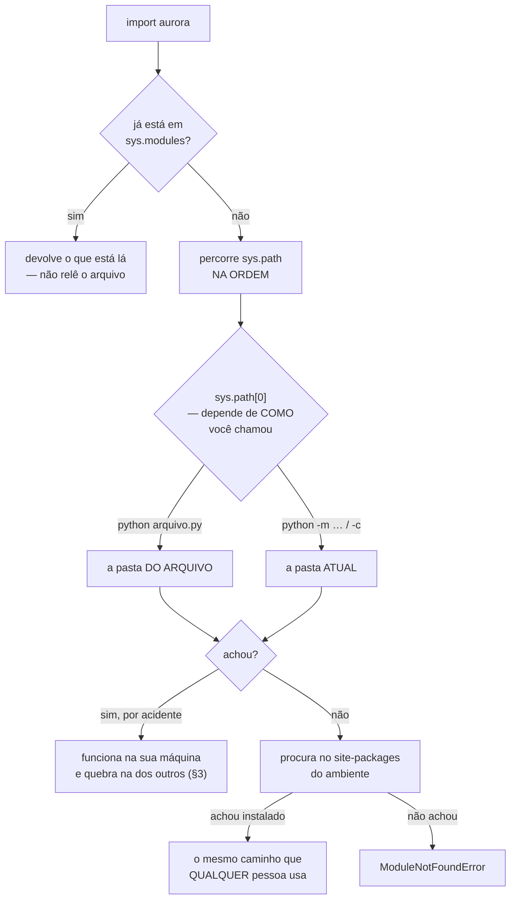

# 04.17 — Organização de projetos

> **Módulo 04 — Python Avançado** · Nível: N2 · Tempo estimado: 3h · Código: `codigo/cap17/`

## 1. Objetivo

- **Explicar** como o Python encontra o que você importa, e por que a mesma linha funciona num lugar e falha em outro.
- **Estruturar** um projeto com pacotes, `__init__.py` e layout `src/`.
- **Escrever** um `pyproject.toml` que descreva o projeto e o torne instalável.
- **Reconhecer** o que o layout `src/` garante — e o que ele não garante.

Ao final, seu projeto é instalável, testável e importável do mesmo jeito por você e por quem o receber.

---

## 2. Pré-requisitos

- [04.16 — Ambientes virtuais e pip](16-ambientes-virtuais-e-pip.md) — este capítulo instala **o seu próprio projeto** dentro do ambiente.
- [01.20 — Módulos e imports](../01-Python/20-modulos-e-imports.md) — `import` e `from … import` já foram usados; aqui vem o mecanismo.
- [02.06 — Variáveis de ambiente e PATH](../02-Git-Linux/06-variaveis-de-ambiente-e-path.md) — `sys.path` é o `PATH` do Python, com a mesma regra de "o primeiro que achar ganha".

**Autoteste:** (1) O que `import x` faz, em termos de arquivos? (2) O que o `.venv/` contém, e por que ele não vai para o Git? (3) O que acontece se dois programas com o mesmo nome estiverem no `PATH`?

---

## 3. Motivação

Este projeto funciona:

```
plano/
├── aurora/
│   ├── __init__.py
│   └── modelo.py      ← faz `from utilitarios import normalizar`
├── utilitarios.py     ← FORA do pacote
└── pyproject.toml
```

```
na máquina de quem escreveu:
  Produto(nome='Mouse Gamer', preco_centavos=8990)
```

Você empacota, publica, e alguém instala:

```
na máquina de quem instala:
      from utilitarios import normalizar
  ModuleNotFoundError: No module named 'utilitarios'
```

O pacote instalado contém isto, e só isto:

```
aurora/__init__.py
aurora/modelo.py
```

**`utilitarios.py` nunca fez parte do pacote.** Ele funcionava na sua máquina porque a pasta do projeto estava no caminho de busca — e não porque alguém tivesse decidido que ele pertencia ao pacote.

Este é o "funciona na minha máquina" na sua forma mais pura: nada estava errado no código, nada estava errado na instalação, e o defeito estava na **organização** — numa dependência que existia de fato e nunca foi declarada.

---

## 4. Modelo mental

`import aurora` é uma **busca em lista**.

O Python percorre `sys.path` na ordem, e para no primeiro lugar onde encontra `aurora`. É a mesma mecânica do `PATH` do shell (02.06), com a mesma consequência: **quem está antes na lista ganha**, e um nome repetido em dois lugares é resolvido em silêncio.

O que entra nessa lista, e onde:

| Situação | `sys.path[0]` |
|---|---|
| `python arquivo.py` | a pasta **do arquivo** |
| `python -m pacote.modulo` | a pasta **atual** |
| `python -c "…"` | a pasta atual (aparece como `''`) |
| pacote instalado | não é `[0]`: entra pelo `site-packages` do ambiente |

```
python sub/mostrar.py  (chamado da pasta de cima):
    cwd:         /tmp/cap17
    sys.path[0]: '/tmp/cap17/sub'
python -c '…'          (mesma pasta):
    cwd:         /tmp/cap17
    sys.path[0]: ''
```

**A frase que organiza o capítulo: o seu projeto é encontrado por acidente ou por instalação, e a diferença aparece só na máquina dos outros.** Por acidente, quando a pasta certa por acaso está na lista. Por instalação, quando ele está no `site-packages` do ambiente — que é o caminho que **todo mundo** vai usar.

O layout `src/` existe para tornar o acidente impossível.

---

## 5. Analogia

Duas maneiras de guardar uma receita.

Na primeira, os ingredientes estão espalhados pela sua cozinha: alguns no armário, um no balcão, dois na mesa. Você faz o prato todo dia e ele sai perfeito — porque **a sua cozinha** tem tudo. Copiando a receita para um amigo, ele descobre que faltam três coisas que você nunca listou, porque elas estavam à mão e você não reparou nelas.

Na segunda, você monta uma **caixa** com tudo o que a receita usa e cozinha só com o que está dentro dela. Dá mais trabalho. Em troca, o dia em que faltar alguma coisa é **hoje**, na sua cozinha, e não daqui a um mês na de outra pessoa.

**E a analogia acerta no limite que a §6.3 mede:** a caixa garante os ingredientes, e você ainda está na sua cozinha. Se estender a mão para pegar sal do balcão sem perceber, o problema volta. A caixa reduz a superfície do acidente; não a elimina.

---

## 6. Teoria

### 6.1 Módulo, pacote e o que o `__init__.py` faz hoje

Um **módulo** é um arquivo `.py`. Um **pacote** é uma pasta com módulos dentro.

Desde o Python 3.3, uma pasta **sem** `__init__.py` também funciona como pacote — é o *pacote de espaço de nomes* (PEP 420). Então para que serve o arquivo?

```
sem __init__.py (duas pastas chamadas `pacote`, em lugares diferentes):
    __path__: ['a/pacote', 'b/pacote']
    achou mod_b, que está na OUTRA pasta

com __init__.py na primeira:
    __path__: ['a/pacote']
    mod_b -> No module named 'pacote.mod_b'
```

**Sem `__init__.py`, duas pastas de mesmo nome em lugares diferentes se fundem num pacote só.** É um recurso, criado para bibliotecas distribuídas em partes — e é uma armadilha em projeto de aplicação, onde uma pasta esquecida no caminho de busca passa a contribuir módulos para o seu pacote.

`__init__.py` diz "este pacote é este, e acaba aqui". Além disso, ele é o lugar da **API pública**:

```python
from aurora.formato import formatar_reais
from aurora.modelo import Produto

__all__ = ["Produto", "formatar_reais"]
__version__ = "0.1.0"
```

Agora `from aurora import Produto` funciona, e quem lê o arquivo sabe em trinta segundos o que o pacote oferece. O resto continua acessível por caminho completo — a diferença entre "oferecido" e "alcançável".

### 6.2 `python arquivo.py` × `python -m pacote.modulo`

```
python loja/relatorio.py:
    ModuleNotFoundError: No module named 'loja'
python -m loja.relatorio:
    TAXA = 0.15 · __name__ = __main__
```

**O mesmo arquivo, e um dos dois não acha o próprio pacote.** Rodando o arquivo direto, `sys.path[0]` vira `loja/` — e de dentro da pasta do pacote, o pacote `loja` não é encontrável, porque procurá-lo exigiria estar um nível acima.

Com `-m`, o Python põe a pasta **atual** na lista, importa o pacote normalmente e executa o módulo. É por isso que a regra prática é: **arquivo solto se roda com `python arquivo.py`; módulo dentro de pacote se roda com `python -m`.**

E note o `__name__ = __main__` na segunda linha: o módulo executado por `-m` continua sendo `__main__`, o que mantém o `if __name__ == "__main__":` funcionando.

### 6.3 Layout plano × layout `src/`

```
plano/                          projeto/
├── aurora/                     ├── src/
│   └── modelo.py               │   └── aurora/
├── tests/                      │       └── modelo.py
└── pyproject.toml              ├── tests/
                                └── pyproject.toml
```

A diferença é uma pasta, e o efeito é este:

```
com src/, antes de instalar:
    ModuleNotFoundError: No module named 'aurora'
```

**`import aurora` não funciona nem de dentro da pasta do projeto.** Isso parece um estorvo e é a característica inteira: você é **obrigado** a instalar, e a partir daí o pacote é alcançado pelo `site-packages` — o mesmo caminho que quem o instalar vai usar. O acidente da §3 deixa de ser possível **para o pacote**.

**E agora o limite, que quase nenhum texto sobre `src/` menciona.** Depois de `pip install -e .`, com o mesmo defeito da §3 plantado:

```
rodando DA pasta do projeto:
    passou — a pasta atual ainda está no path
rodando de QUALQUER OUTRA pasta:
    ModuleNotFoundError: No module named 'utilitarios'
```

**A pasta atual continua no `sys.path`** em `-c`, em `-m` e sob o `pytest` — então um módulo solto na raiz do projeto ainda pode vazar. O `src/` garante que **o pacote** venha da instalação; não garante que nada mais vaze.

O que fecha a lacuna é rodar de fora da pasta, ou instalar num ambiente limpo — que é o que a §3 fez. Vale saber disso porque `pytest` rodando na raiz **passa** nos dois layouts com o defeito presente, e um teste verde é uma garantia enganosa quando não se sabe o que ele cobre.

### 6.4 Testes fora do pacote

```
tests/test_catalogo.py:
    from aurora import Produto, formatar_reais
    from aurora.catalogo import buscar
```

Os testes ficam numa pasta irmã, **fora** de `src/`, e importam o pacote pelo nome — do mesmo jeito que qualquer pessoa de fora. Duas consequências: eles exercitam o pacote instalado, e não são distribuídos junto com ele.

O contrário — testes dentro do pacote — os empacota e os envia ao cliente, e faz os imports passarem a ser relativos, que é justamente o modo que não reproduz o uso real.

### 6.5 `pyproject.toml`

Um arquivo no lugar dos dois `requirements.txt`, e que descreve o projeto:

```toml
[project]
name = "aurora"
version = "0.1.0"
requires-python = ">=3.10"
dependencies = ["pydantic==2.13.4"]

[project.optional-dependencies]
dev = ["mypy==2.3.0", "pytest==8.3.4"]

[project.scripts]
aurora = "aurora.cli:main"

[build-system]
requires = ["setuptools>=61"]
build-backend = "setuptools.build_meta"

[tool.setuptools.packages.find]
where = ["src"]
```

**Quatro coisas que o `requirements.txt` não fazia.**

`requires-python` declara a versão mínima — a lacuna que o D1 do 04.16 identificou.

`[project.optional-dependencies]` substitui o `requirements-dev.txt`: `pip install -e ".[dev]"` traz os dois grupos.

`[project.scripts]` cria um **comando de terminal**. Depois da instalação, digitar `aurora` no ambiente chama a função `main` do módulo `aurora.cli`:

```
$ aurora
Mouse Sem Fio            R$ 89.90
Teclado Mecanico K2      R$ 329.00
Fone Bluetooth XZ-9      R$ 469.90
TOTAL                    R$ 888.80
```

E `[tool.*]` concentra a configuração das ferramentas — `[tool.mypy]`, `[tool.pytest.ini_options]`, `[tool.ruff]`. Um arquivo em vez de quatro.

### 6.6 `pip install -e .`

```bash
pip install -e ".[dev]"
```

O `-e` é *editável*: em vez de copiar os arquivos para o `site-packages`, o pip registra um **ponteiro** para o seu `src/`. Editar o código tem efeito imediato, sem reinstalar.

É o modo de desenvolvimento. O modo do cliente é `pip install .`, que copia — e foi ele que revelou o defeito da §3, porque copiar mostra exatamente o que entra no pacote e o que fica de fora.

**Um cuidado que economiza uma tarde:** acrescentar um módulo novo funciona sem reinstalar; acrescentar uma **dependência** no `pyproject.toml`, não. Dependência é lida na instalação.

### 6.7 Import relativo e import circular

```
python loja/resumo.py:
    ImportError: attempted relative import with no known parent package
python -m loja.resumo:
    relativo funcionou · TAXA = 0.15
```

O ponto em `from .precos import TAXA` significa "o pacote **deste** módulo". Rodando o arquivo direto, não há pacote — daí a mensagem, que é literal e costuma ser lida como misteriosa.

**Absoluto ou relativo?** Absoluto (`from aurora.precos import TAXA`) diz de onde vem sem exigir saber onde você está, e é o padrão deste manual. Relativo é mais curto e sobrevive a renomear o pacote. Escolha um por projeto.

**Import circular** tem uma mensagem que já explica o problema:

```
ImportError: cannot import name 'alfa' from partially initialized module 'ciclo.a'
```

*Parcialmente inicializado*: quando `b` pediu `alfa`, o módulo `a` estava na linha 1 e ainda não tinha definido nada. A correção real não é técnica — é de desenho. Dois módulos que precisam um do outro em tempo de importação costumam ser um módulo só, ou ter um terceiro faltando.

### 6.8 O layout completo

```
projeto/
├── .venv/                  (04.16 — não vai para o Git)
├── .gitignore
├── LEIAME.md
├── pyproject.toml
├── src/
│   └── aurora/
│       ├── __init__.py     ← API pública
│       ├── modelo.py       ← domínio (dataclasses)
│       ├── esquemas.py     ← borda (Pydantic, D-024)
│       ├── catalogo.py
│       └── cli.py          ← ponto de entrada
└── tests/
    └── test_catalogo.py
```

**A divisão que vale mais que a estrutura:** `modelo.py` e `esquemas.py` são pastas diferentes do mesmo problema — o domínio e a borda do D-024, agora visíveis no próprio layout. Alguém que abra a pasta pela primeira vez descobre a arquitetura sem ler uma linha.

---

## 7. Funcionamento interno

`sys.path` é uma lista comum, e você pode alterá-la em execução. Isso significa que a resposta para "por que este import funciona?" é sempre inspecionável:

```python
import sys
print(sys.path)
import aurora
print(aurora.__file__)       # de ONDE veio
print(aurora.__path__)       # onde ele procura submódulos
```

`aurora.__file__` é a pergunta que resolve a maioria dos casos: o import funcionou, mas veio da cópia certa? Num pacote de espaço de nomes, `__file__` é `None` — o sinal de que não há `__init__.py`.

Uma instalação editável funciona acrescentando um caminho ao ambiente, por meio de um arquivo `.pth` no `site-packages` ou de um localizador registrado pelo sistema de construção. Não há mágica: é uma entrada a mais na mesma lista.

E os módulos já importados ficam num dicionário, `sys.modules`. Um `import` de algo que já está lá não relê o arquivo — é o que torna imports baratos depois do primeiro, e o que explica por que editar um arquivo não afeta um programa que já está rodando.

---

## 8. Visualização do fluxo



**Como ler:** o losango do meio é a origem de quase toda confusão com imports — `sys.path[0]` muda conforme o comando, e ninguém pensa nisso ao trocar `python -m` por `python arquivo.py`. Os dois desfechos de baixo são a escolha de layout: à esquerda o acidente que o layout plano permite, à direita a instalação que o `src/` obriga.

---

## 9. Aplicação prática

O projeto de referência está em [`codigo/cap17/projeto-aurora/`](codigo/cap17/projeto-aurora/), pronto para rodar:

```bash
cd codigo/cap17/projeto-aurora
python -m venv .venv && source .venv/bin/activate
pip install -e ".[dev]"

aurora                    # o comando do [project.scripts]
aurora "Mouse Sem Fio"
pytest
mypy src
```

```
6 passed in 0.02s
Success: no issues found in 5 source files
```

**Quatro decisões visíveis no código.** `__init__.py` reexporta `Produto` e `formatar_reais` e declara `__all__` — a API pública em quatro linhas. `formato.py` não importa nada do projeto, de propósito: é o módulo mais importado, e uma dependência ali se espalharia por tudo. `cli.py` devolve um **código de saída** (`0` ou `1`), o que o torna utilizável em script de shell (02.07). E `tests/` importa `from aurora import …`, exercitando o pacote instalado.

Vale rodar o comando que falha:

```
$ aurora "Mesa"
produto não encontrado: Mesa
$ echo $?
1
```

---

## 10. Código comentado

Três artefatos, com papéis distintos.

[`codigo/cap17/imports.py`](codigo/cap17/imports.py) roda cinco experimentos em pastas temporárias que ele mesmo cria e apaga: `sys.path` conforme o comando; `python arquivo.py` contra `python -m`; import relativo quebrando; `__init__.py` impedindo a fusão de pacotes; e o import circular.

[`codigo/cap17/vazamento.sh`](codigo/cap17/vazamento.sh) monta o projeto da §3, empacota, instala num ambiente limpo e mostra a quebra — e depois repete com layout `src/`, incluindo a cena 6, que mede o **limite** do `src/`.

[`codigo/cap17/projeto-aurora/`](codigo/cap17/projeto-aurora/) é o layout completo, com `pyproject.toml`, testes e comando de terminal.

```bash
python codigo/cap17/imports.py
bash codigo/cap17/vazamento.sh
```

---

## 11. Erros comuns

| Erro | Sintoma | Correção |
|---|---|---|
| Módulo solto fora do pacote | Funciona na sua máquina, `ModuleNotFoundError` na de quem instala | Tudo o que o pacote usa mora dentro dele |
| `python pacote/modulo.py` | `ModuleNotFoundError` para o próprio pacote | `python -m pacote.modulo` |
| Import relativo em arquivo executado direto | `attempted relative import with no known parent package` | `-m`, ou import absoluto |
| Testes dentro do pacote | Vão para o cliente, e os imports deixam de reproduzir o uso real | `tests/` irmão de `src/` |
| Esquecer `__init__.py` | Pastas de mesmo nome se fundem, em silêncio | Crie o arquivo, mesmo vazio |
| Confiar no `pytest` verde | Passa nos dois layouts com o defeito da §3 presente | Rode de fora da pasta, ou instale num ambiente limpo |
| Import circular | `partially initialized module` | Um módulo a mais, ou um a menos |
| Acrescentar dependência sem reinstalar | `ModuleNotFoundError` para algo que está no `pyproject.toml` | `pip install -e .` de novo |
| `sys.path.append` para resolver import | Funciona e esconde o problema de organização | Instale o pacote |

---

## 12. Boas práticas

- **Layout `src/` em qualquer projeto que vá ser instalado**, mesmo que só por você em outra máquina.
- **`__init__.py` sempre**, mesmo vazio. O ganho é impedir a fusão silenciosa.
- **A API pública no `__init__.py`, com `__all__`.** Quem abre o arquivo entende o pacote em trinta segundos.
- **Imports absolutos.** Dizem de onde vem sem exigir saber onde você está.
- **`tests/` fora de `src/`**, importando pelo nome do pacote.
- **Um `pyproject.toml`** com dependências, versão mínima do Python, comandos e configuração das ferramentas.
- **Um módulo sem dependências internas** (o `formato.py`) é sinal de bom desenho — e um módulo que importa todos os outros é sinal do contrário.
- **`sys.path.append` nunca.** Ele resolve o sintoma e mantém o projeto dependendo de onde você está.

---

## 13. Performance

Este capítulo quase não tem números, e vale dizer por quê: **a organização não afeta o desempenho em execução.** Um pacote em `src/` e um plano importam no mesmo tempo, porque depois da primeira importação tudo está em `sys.modules` (§7).

O que dá para medir é o **tempo de importação**, e o projeto de referência dá um número que muda a decisão de projeto:

```bash
python -X importtime -c "import aurora" 2>&1 | tail -1
```

| O que se importa | Custo acumulado |
|---|---|
| `import aurora` | 21,3 ms |
| `import aurora.formato` | **20,2 ms** |
| o mesmo `formato.py`, fora do pacote | 1,6 ms |
| `import dataclasses` (sozinho) | 18,7 ms |

**A segunda linha é a que surpreende.** `aurora.formato` não importa nada — são cinco linhas e uma função — e custa praticamente o mesmo que o pacote inteiro. O motivo é que **importar qualquer submódulo executa o `__init__.py` do pacote primeiro**, e o nosso reexporta `Produto`, que traz `dataclasses`, que traz `inspect`, que traz `tokenize`: 18,7 dos 20,2 ms.

Não dá para escapar escolhendo o submódulo. Quem precisa só de `formatar_reais` paga o `dataclasses` do mesmo jeito.

**A decisão que sai daí:** reexportar no `__init__.py` é excelente para legibilidade e cobra a importação de tudo o que foi reexportado, para todo mundo. Em pacote pequeno, como este, 20 ms uma vez não importa. Em biblioteca grande — a diferença entre `import pandas` levando meio segundo e um módulo isolado levando milissegundos — a saída é reexportar pouco e documentar os caminhos completos.

E vale para o seu programa também: quando alguém pergunta "por que isto demora um segundo para começar?", a coluna `cumulative` do `-X importtime` costuma responder em trinta segundos.

---

## 14. Mercado

O layout `src/` era controverso até 2020 e hoje é a recomendação do guia oficial de empacotamento. O argumento que venceu é o da §3: não é sobre estética, é sobre o pacote ser alcançado do mesmo jeito por você e por quem o instala.

O `pyproject.toml` (PEP 518 e PEP 621) substituiu `setup.py` e `setup.cfg`, e unificou o que antes eram três arquivos e um ecossistema de convenções. `setup.py` ainda aparece em projeto antigo; escrever um novo hoje é retrabalho.

O sistema de construção é intercambiável: **setuptools** é o padrão e o que este manual usa; **hatchling** e **flit** são mais simples para bibliotecas puras; **poetry-core** vem com o Poetry. Trocar significa mudar a seção `[build-system]`, e o resto do arquivo continua igual — que é o ponto do padrão.

Em entrevista, "por que `src/`?" é a pergunta que separa quem leu de quem foi mordido, e a resposta boa conta a história da §3. Vale saber também que a estrutura de pastas é a primeira coisa que alguém vê ao abrir o seu repositório, e que ela comunica arquitetura antes de qualquer linha de código.

---

## 15. Entrevistas

- **"Por que layout `src/`?"** Porque sem ele o pacote é encontrado por acidente — a pasta do projeto está no caminho de busca — e um módulo que nunca entrou no pacote funciona na sua máquina e falha na de quem instala.
- **"O `__init__.py` ainda é necessário?"** Não para a pasta ser pacote (PEP 420, desde o 3.3). É necessário para **impedir a fusão** de pastas de mesmo nome e para declarar a API pública.
- **"Qual a diferença entre `python arquivo.py` e `python -m pacote.modulo`?"** O `sys.path[0]`: a pasta do arquivo contra a pasta atual. Por isso o primeiro não acha o próprio pacote.
- **"O que `pip install -e .` faz?"** Registra um ponteiro para o seu `src/` em vez de copiar. Módulo novo funciona sem reinstalar; **dependência nova, não**.
- **"Como você resolveria um import circular?"** Não com `import` dentro de função. A mensagem "partially initialized" diz que dois módulos se precisam em tempo de importação, e isso costuma significar que são um só ou que falta um terceiro.

---

## 16. Exercícios guiados

Em [`exercicios/cap17.md`](exercicios/cap17.md):

- **A1** `[~10 min · o import funciona?]` — 8 situações.
- **A2** `[~12 min · prevê a saída]` — 6 estruturas e comandos.
- **A3** `[~12 min · ache o erro]` — 6 organizações defeituosas.
- **A4** `[~10 min · onde mora?]` — 6 arquivos a colocar no layout.
- **AP1** `[~20 min · plano para src]` — Converta um projeto.
- **AP2** `[~25 min · o pyproject]` — Escreva um do zero, com comando de terminal.
- **AP3** `[~20 min · o vazamento]` — Rode o laboratório e explique as seis cenas.
- **D1** `[~50 min · o pacote publicável]` — **Instalável, testável e sem vazamentos.**

---

## 17. Desafios

**D1 — O pacote publicável.** Transforme o código do módulo 04 que você quiser num pacote instalável de verdade, com layout `src/`.

Requisitos: `pyproject.toml` completo (versão mínima do Python, dependências, grupo `dev`, ao menos um `[project.scripts]`, configuração do mypy e do pytest); `__init__.py` com API pública e `__all__`; `tests/` fora de `src/`; `mypy --strict` e `pytest` limpos.

**E a prova que vale metade da nota:** instale o pacote com `pip install .` (sem o `-e`) num **ambiente novo**, saia da pasta do projeto e importe. Ele precisa funcionar.

**As três perguntas que valem a outra metade:** (1) Algum módulo do seu pacote importa algo que não está dentro dele? Como você descobriu? (2) O seu `__init__.py` reexporta quanto — e quanto custa importar o **submódulo mais barato** do seu pacote? Meça com `-X importtime` antes de responder. (3) Se você apagasse todos os `__init__.py`, o que pararia de funcionar, e o que continuaria?

---

## 18. Mini projeto

**A auditoria de estrutura.** Um script `auditar.py` que receba a pasta de um projeto e aponte problemas de organização.

Requisitos: detectar pacotes sem `__init__.py`; encontrar imports de módulos que estão **fora** do pacote; listar imports circulares; apontar testes dentro de `src/`; e dizer se o `pyproject.toml` declara `requires-python` e um sistema de construção.

O script deve usar apenas a biblioteca padrão — `ast` para ler os imports sem executar o código, e `pathlib` para caminhar na árvore.

**E a pergunta que fecha:** por que ler os imports com `ast` e não com `import` ou com expressão regular? A resposta tem uma parte de segurança e uma de correção, e a de correção você descobre tentando casar `from a.b import (c,\n d)` com uma expressão regular.

---

## 19. Revisão

**Resumo em 5 frases.** `import aurora` é uma **busca em lista** — o Python percorre `sys.path` e para no primeiro que achar —, e `sys.path[0]` muda conforme o comando: a pasta **do arquivo** em `python arquivo.py`, a pasta **atual** em `python -m` e em `python -c`, o que faz o mesmo módulo achar e não achar o próprio pacote conforme como você o chamou. Daí o defeito que organiza o capítulo: no layout plano, um módulo solto na raiz é importado com sucesso porque a pasta do projeto está na lista, e ele **nunca entrou no pacote** — o programa funciona na sua máquina e falha com `ModuleNotFoundError` na de quem instala. O layout `src/` torna esse acidente impossível **para o pacote**, porque `import aurora` não funciona antes da instalação e você passa a alcançá-lo pelo mesmo caminho que qualquer outra pessoa; o limite honesto é que a pasta atual continua no `sys.path`, então um módulo solto ainda vaza quando se roda da raiz — e o `pytest` verde não prova nada, porque ele passa nos dois layouts com o defeito presente. `__init__.py` não é mais necessário para a pasta ser pacote (PEP 420), e continua necessário por dois motivos: impedir que pastas de mesmo nome em lugares diferentes se **fundam** em silêncio, e declarar a API pública com `__all__`. E o `pyproject.toml` faz o que nenhum `requirements.txt` fazia: declara a versão mínima do Python, separa o grupo `dev`, cria comandos de terminal com `[project.scripts]` e concentra a configuração das ferramentas num arquivo só.

**Flashcards** (também em [`revisao/flashcards.md`](revisao/flashcards.md)):

| ID | Frente | Verso |
|---|---|---|
| 04.17-F1 | O que muda entre `python arquivo.py` e `python -m pacote.modulo`? | O `sys.path[0]`: a pasta **do arquivo** contra a pasta **atual**. Por isso o primeiro dá `ModuleNotFoundError` para o próprio pacote — de dentro de `loja/`, o pacote `loja` não é encontrável. Módulo dentro de pacote se roda com `-m`. |
| 04.17-F2 | Explique com suas palavras por que o layout `src/` existe. | (Elaboração) No layout plano a pasta do projeto está no `sys.path`, então um módulo **fora** do pacote é importado com sucesso e nunca é empacotado — funciona na sua máquina e dá `ModuleNotFoundError` na de quem instala. Com `src/`, `import aurora` só funciona **depois** de instalar, pelo mesmo caminho que todo mundo usa. |
| 04.17-F3 | Preveja: duas pastas chamadas `pacote`, em lugares diferentes do `sys.path`, sem `__init__.py`. | (Previsão) Elas **se fundem** num pacote só — `__path__` traz as duas, e um módulo da segunda é importável como se fosse da primeira (PEP 420). Com `__init__.py` na primeira, a segunda é ignorada. É a razão de manter o arquivo, mesmo vazio. |
| 04.17-F4 | O que o layout `src/` **não** garante? | (Decisão) Que nada mais vaze. A pasta atual continua no `sys.path` em `-c`, `-m` e sob o `pytest`, então um módulo solto na raiz ainda é encontrado quando se roda **da pasta do projeto**. O teste que pega é rodar de fora, ou instalar num ambiente limpo. |
| 04.17-F5 | O que o `pyproject.toml` faz que o `requirements.txt` não fazia? | Declara `requires-python`; separa grupos com `[project.optional-dependencies]` (`pip install -e ".[dev]"`); cria **comandos de terminal** com `[project.scripts]`; e concentra a configuração das ferramentas em `[tool.*]`. Um arquivo em vez de quatro. |

**Revisão espaçada:** D+1 refaça A1 e A2 · D+7 o AP1 (converter plano para `src/`) · D+30 monte um pacote instalável de memória e prove com `pip install .` num ambiente novo.

---

## 20. Checklist

- [ ] Rodei o `imports.py` e vi `sys.path[0]` mudar conforme o comando.
- [ ] Vi o mesmo módulo achar e não achar o próprio pacote.
- [ ] Rodei o `vazamento.sh` e vi o pacote quebrar na instalação limpa.
- [ ] Entendi o que a cena 6 mostra sobre o limite do `src/`.
- [ ] Vi duas pastas de mesmo nome se fundirem sem `__init__.py`.
- [ ] Escrevi um `__init__.py` com `__all__`.
- [ ] Escrevi um `pyproject.toml` com `[project.scripts]`.
- [ ] Instalei meu próprio projeto com `pip install -e ".[dev]"`.
- [ ] Rodei os testes importando o pacote pelo nome.
- [ ] Instalei sem `-e` num ambiente novo e importei de outra pasta.

---

## 21. Próximo capítulo

[04.18 — Datas, horas e fusos](18-datas-horas-e-fusos.md). O projeto está organizado; falta o dado que mais gera defeito silencioso. O 04.15 já mostrou o Pydantic recusando `"15/07/2026"` e aceitando `"2026-07-15"`, e disse que converter formato local era assunto de outro capítulo. É este — junto com o problema maior, que é gravar uma hora sem dizer de qual fuso ela é, e descobrir três meses depois que os relatórios de março estão uma hora deslocados.
