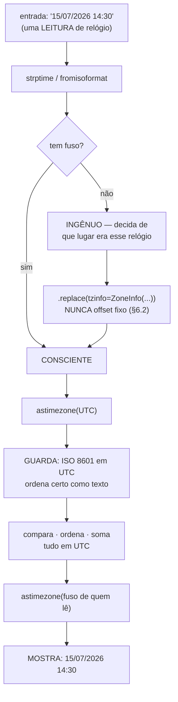

# 04.18 — Datas, horas e fusos

> **Módulo 04 — Python Avançado** · Nível: N2 · Tempo estimado: 3h · Código: `codigo/cap18/`

## 1. Objetivo

- **Distinguir** um `datetime` ingênuo de um consciente, e dizer por que isso decide tudo.
- **Aplicar** `zoneinfo` para converter entre fusos sem escrever offsets à mão.
- **Prever** o que acontece nas duas transições de horário de verão — a hora repetida e a que não existiu.
- **Decidir** o que guardar, em que formato, e qual relógio usar para medir duração.

Ao final, você grava instantes que continuam corretos daqui a dez anos, em qualquer fuso.

---

## 2. Pré-requisitos

- [04.15 — Pydantic](15-pydantic.md) — ele recusou `"15/07/2026"` e aceitou `"2026-07-15"`; aqui está o motivo, e o que fazer com o formato brasileiro.
- [03.12 — DDL e tipos de dados](../03-SQL/12-ddl-e-tipos-de-dados.md) — o SQLite não tem tipo de data; guardar hora é guardar texto, e o formato importa.
- [01.21 — Exceções](../01-Python/21-excecoes.md) — vários erros deste capítulo são silenciosos, e vale reconhecer quais falham e quais não.

**Autoteste:** (1) Por que o Pydantic recusa `"15/07/2026"`? (2) Como o SQLite guarda uma data? (3) Um erro que não levanta exceção é melhor ou pior que um que levanta?

---

## 3. Motivação

Um relatório de vendas por dia, escrito do jeito natural:

```python
inicio = datetime(2018, 11, 3, 12, 0)
fim = inicio + timedelta(days=1)
```

Está errado, e o erro tem uma hora de tamanho:

```
ponto de partida:       2018-11-03T12:00:00-03:00
+ timedelta(days=1):    2018-11-04T12:00:00-02:00
horas REAIS decorridas: 23:00:00
```

**Vinte e três horas.** Naquele domingo começou o horário de verão, o relógio pulou de meia-noite para uma da manhã, e o dia teve 23 horas. O código somou um dia de calendário e recebeu 23 horas de tempo real — e o relatório daquele dia ficou com uma hora de vendas a menos, sem erro, sem aviso, sem nada.

E o Brasil deixa isso pior. O horário de verão acabou em 2019, mas os **dados antigos continuam lá**:

```
15 de janeiro ao meio-dia, em São Paulo:
   2017 -> 2017-01-15T12:00:00-02:00
   2019 -> 2019-01-15T12:00:00-02:00
   2020 -> 2020-01-15T12:00:00-03:00
```

Quem escreveu `-03:00` fixo no código — e é o que quase todo mundo faz — acerta os dados de hoje e erra em uma hora **todo dado de verão anterior a 2020**.

Este capítulo é sobre uma classe de defeito que não levanta exceção, não aparece em teste e é descoberta por alguém do financeiro perguntando por que o número de março não fecha.

---

## 4. Modelo mental

Há **duas coisas diferentes** com o mesmo nome, e confundi-las é a origem de tudo.

**Um instante** é um ponto na história do universo. Ele é o mesmo para todo mundo: quando o pedido foi feito, houve um instante, e ele não muda conforme quem olha.

**Uma leitura de relógio** é o que um mostrador exibe num lugar. "15/07/2026 14:30" não é um instante — é um instante **mais** a informação de onde o relógio estava.

```
    instante                  leituras do mesmo instante
    ────────                  ──────────────────────────
                              São Paulo:  2026-07-15 14:30
    ●───────────────────→     UTC:        2026-07-15 17:30
                              Tóquio:     2026-07-16 02:30
```

No Python, a diferença tem nome:

- **ingênuo** (*naive*) — `tzinfo` é `None`. É uma leitura de relógio sem dizer de onde.
- **consciente** (*aware*) — tem `tzinfo`. É um instante.

```
datetime.now()        2026-08-05 10:56:07 · tzinfo: None
datetime.utcnow()     2026-08-05 13:56:07 · tzinfo: None
datetime.now(utc)     2026-08-05 13:56:07+00:00 · tzinfo: UTC
```

**A frase que organiza o capítulo: guarde instantes, mostre leituras.** Tudo o que o programa persiste, compara, ordena ou soma é instante — em UTC, consciente. A conversão para o fuso de quem lê acontece **na última linha antes do `print`**, e em nenhum outro lugar.

---

## 5. Analogia

Um voo com duas etiquetas na bagagem.

A primeira diz **"14:30"**. Ela é inútil sozinha: 14:30 de onde? A bagagem saiu às 14:30 de São Paulo e chegou às 02:30 de Tóquio, e as duas etiquetas descrevem a mesma bagagem.

A segunda diz **"14:30 GMT-3"**. Essa você consegue converter para qualquer aeroporto do mundo, porque ela não é uma leitura — é um instante com endereço.

**E a analogia acerta em dois limites que a §6 mede.** Primeiro: colar a etiqueta "GMT-3" numa bagagem que saiu em janeiro de 2018 está **errado**, porque naquele janeiro São Paulo estava em GMT-2 — o endereço muda com o tempo, e é por isso que se escreve `America/Sao_Paulo` e não `-03:00`. Segundo: existe uma hora do ano em que duas bagagens diferentes recebem etiquetas idênticas, e nenhuma delas está errada.

---

## 6. Teoria

### 6.1 Ingênuo e consciente

```python
datetime.now()                  # ingênuo — hora local, sem dizer de onde
datetime.utcnow()               # ingênuo — hora de UTC, sem dizer que é UTC
datetime.now(timezone.utc)      # consciente — o único que este manual usa
```

**`utcnow()` é a armadilha mais antiga da biblioteca.** Ele devolve a hora certa de UTC e **não a marca como UTC** — o `tzinfo` é `None`. O resultado parece um instante, comporta-se como leitura de relógio, e mistura os dois papéis em silêncio. Ele está obsoleto desde o Python 3.12, e o substituto é `datetime.now(timezone.utc)`.

A boa notícia é que misturar os dois tipos falha:

```
comparar os dois -> can't compare offset-naive and offset-aware datetimes
```

**E é sorte que falhe.** Comparar um ingênuo com um consciente levanta `TypeError` na hora; marcar um ingênuo com o fuso errado, com `.replace(tzinfo=...)`, **não levanta nada** — e produz um instante deslocado que segue adiante.

### 6.2 `zoneinfo`, e por que não se escreve o offset

```python
from zoneinfo import ZoneInfo
SP = ZoneInfo("America/Sao_Paulo")
```

`ZoneInfo` consulta a base de dados de fusos do sistema (a *tz database*), que registra a história completa: quando cada país adotou e abandonou o horário de verão, quando mudou de fuso, quando criou uma exceção regional.

Por isso o mesmo fuso dá offsets diferentes conforme a data:

```
15 de janeiro ao meio-dia, em São Paulo:
   2017 -> -02:00     2019 -> -02:00
   2018 -> -02:00     2020 -> -03:00
```

**`timezone(timedelta(hours=-3))` é um offset fixo e mente sobre o passado.** `ZoneInfo("America/Sao_Paulo")` é um lugar, e lugares têm história. Use o nome do lugar sempre; o offset fixo só faz sentido para UTC, que por definição não muda.

Em Windows, a base de fusos pode não estar presente; nesse caso, `pip install tzdata` resolve.

### 6.3 A hora que aconteceu duas vezes

Em 17 de fevereiro de 2018, à meia-noite, o relógio de São Paulo **voltou** para 23:00. As 23:30 daquele dia aconteceram duas vezes.

```
fold=0 -> 2018-02-17T23:30:00-02:00 · UTC 2018-02-18 01:30:00
fold=1 -> 2018-02-17T23:30:00-03:00 · UTC 2018-02-18 02:30:00
primeira == segunda? True · diferença real: 3600.0 s
num set: 1 elemento — um sumiu
```

O atributo `fold` distingue as duas ocorrências — `0` é a primeira, `1` é a segunda. E a linha que importa é a terceira: **o Python considera os dois iguais**, embora estejam a uma hora de distância. Eles têm o mesmo hash, e num `set` um dos dois desaparece — exatamente como o objeto do 04.12 que sumia ao ter o campo do hash alterado.

O motivo é coerente: a comparação entre dois `datetime` do **mesmo fuso** compara a leitura do relógio, e as leituras são idênticas. A saída é comparar em UTC, onde eles são distintos.

**E a hora que nunca existiu:**

```
04/11/2018 00:30 -> 2018-11-04T00:30:00-03:00
em UTC: 2018-11-04T03:30:00+00:00
```

Naquele domingo o relógio pulou de 00:00 para 01:00; 00:30 não aconteceu. O Python **aceita sem reclamar** e escolhe um instante. Se o seu sistema aceita um horário digitado por alguém, esse é um valor que ele pode receber — e que não corresponde a nenhum momento real.

### 6.4 Somar um dia não é somar 24 horas

```
ponto de partida:       2018-11-03T12:00:00-03:00
+ timedelta(days=1):    2018-11-04T12:00:00-02:00
horas REAIS decorridas: 23:00:00
24 horas de verdade:    2018-11-04T13:00:00-02:00
```

Somar um `timedelta` a um datetime consciente opera sobre **a leitura do relógio**. "Meio-dia de amanhã" continua sendo meio-dia, mesmo que o dia tenha tido 23 horas.

As duas operações são legítimas e respondem a perguntas diferentes:

| Pergunta | Como fazer |
|---|---|
| "mesma hora amanhã" (lembrete, agenda) | somar no fuso local |
| "daqui a 24 horas" (expiração, tempo limite) | converter para UTC, somar, voltar |

**Escolher errado é o defeito da §3.** Um relatório "por dia" quer o primeiro; um token que expira "em 24 horas" quer o segundo. Quem soma no fuso local uma expiração dá aos usuários uma hora a mais duas vezes por ano.

### 6.5 Guardar

**Guarde em UTC, consciente, em ISO 8601.** Três decisões, e cada uma resolve um problema.

```
1: 2026-07-15T17:30:00+00:00      -> em SP: 15/07/2026 14:30
2: 2026-07-15T14:30:00-03:00      -> em SP: 15/07/2026 14:30
os dois são o MESMO instante; ordenados como texto: [2, 1]
```

As duas linhas guardam **o mesmo instante**, com offsets diferentes. Lidas de volta, as duas dão o mesmo horário em São Paulo — e **ordenadas como texto saem trocadas**, porque `"2026-07-15T14:30"` vem antes de `"2026-07-15T17:30"` no alfabeto.

Num banco que guarda datas como texto (o SQLite do módulo 03, um CSV, um JSON), **ISO 8601 sempre em UTC ordena corretamente como texto**. Um único registro com offset diferente já faz a ordenação mentir — e essa é a classe de defeito que aparece em relatório, não em teste.

O SQLite não tem tipo de data (03.12): o que existe é `TEXT` em ISO 8601, `REAL` em dia juliano ou `INTEGER` em segundos desde 1970. **Texto ISO em UTC** é a escolha que se lê a olho nu, ordena certo e não perde precisão.

### 6.6 Ler

```python
datetime.fromisoformat(texto)          # o inverso de .isoformat()
datetime.strptime(texto, "%d/%m/%Y")   # formatos livres
```

**Uma armadilha específica do Python 3.10 e anteriores:**

```
'2026-07-15T17:30:00+00:00'  -> 2026-07-15 17:30:00+00:00
'2026-07-15T17:30:00Z'       -> ValueError: Invalid isoformat string
```

O `Z` (de *Zulu*, o nome militar de UTC) é a forma mais comum de escrever UTC, e é o que praticamente toda API devolve — e `fromisoformat` **o recusa** até o Python 3.10. A partir do 3.11 ele aceita. Enquanto isso: `texto.replace("Z", "+00:00")`.

**`strptime` devolve sempre um datetime ingênuo**, seja qual for o formato. Converter `"15/07/2026 14:30"` exige dois passos, e o segundo é uma decisão:

```python
ingenuo = datetime.strptime(texto, "%d/%m/%Y %H:%M")
consciente = ingenuo.replace(tzinfo=SP)
```

A decisão é: **de que fuso era aquele relógio?** Um formulário preenchido no Brasil, provavelmente São Paulo. Um arquivo de outro sistema, o que a documentação dele disser. Não existe resposta automática, e é por isso que o passo é explícito.

### 6.7 `date` não é `datetime`

Um aniversário é uma **data**: não tem hora, não tem fuso, e é o mesmo dia em qualquer lugar do mundo.

```python
nascimento = date(1990, 7, 15)
```

Guardar aniversário como `datetime` cria um problema que não existia:

```
1990-07-15 00:00 em São Paulo, visto de:
  Asia/Tokyo           -> 1990-07-15 12:00
  America/Los_Angeles  -> 1990-07-14 20:00
```

**Para quem está a oeste, o aniversário é no dia 14.** A pessoa perde a data por causa de uma conversão que nunca deveria ter acontecido — e o defeito só aparece para uma parte dos usuários, o que o torna difícil de reproduzir.

A regra: **se o conceito não tem hora, use `date`.** Aniversário, vencimento de contrato, feriado. Se tem hora e aconteceu, use `datetime` consciente.

### 6.8 Medir duração pede outro relógio

```
com datetime.now(utc): 50.1 ms
com perf_counter():    50.2 ms
time.time() é sempre crescente?      False
time.monotonic() é sempre crescente? True
```

Os dois deram o mesmo resultado — desta vez. A diferença está na última linha: **o relógio de parede pode andar para trás.** Um ajuste de NTP, uma troca de fuso, alguém corrigindo o relógio do servidor. Uma duração medida com ele pode dar **negativa**.

Para medir tempo decorrido, use `time.perf_counter()` ou `time.monotonic()`, que só andam para a frente e não têm relação com data nenhuma. Para registrar **quando** algo aconteceu, `datetime.now(timezone.utc)`. São ferramentas diferentes para perguntas diferentes.

---

## 7. Funcionamento interno

Um `datetime` consciente guarda dois pedaços: os campos do relógio (ano, mês, dia, hora…) e um objeto `tzinfo`. **O instante não é armazenado** — ele é calculado quando alguém pergunta, com `.timestamp()` ou `.astimezone()`.

Isso explica o resultado da §6.3. `==` entre dois datetimes do mesmo fuso compara os campos do relógio, e `fold` **não entra na comparação nem no hash** — foi uma decisão deliberada da PEP 495, para não quebrar código existente. O preço é que dois objetos a uma hora de distância são "iguais".

`ZoneInfo` lê a base de fusos do sistema (`/usr/share/zoneinfo` no Linux e no macOS; o pacote `tzdata` no Windows), que é atualizada por atualizações do sistema operacional. Isso tem uma consequência prática: **duas máquinas com bases de fuso de idades diferentes podem discordar sobre datas futuras** — e discordam sempre que um país anuncia mudança de horário de verão com pouca antecedência. Mais uma razão para guardar em UTC: o instante gravado não depende da base.

---

## 8. Visualização do fluxo



**Como ler:** o caminho sobe de leitura para instante e desce de volta, e as duas pontas são as únicas em que aparece formato local. O losango do topo é onde mora a decisão do capítulo — um dado sem fuso obriga alguém a **escolher** de onde ele era, e não escolher significa escolher errado em silêncio. Tudo entre `astimezone(UTC)` e a última seta acontece em UTC, sem exceção.

---

## 9. Aplicação prática

**A regra da Aurora, em três funções**, e nenhuma outra forma de pegar a hora no projeto:

```python
def agora() -> datetime:
    return datetime.now(UTC)

def para_exibir(momento: datetime, fuso: ZoneInfo = SP) -> str:
    return momento.astimezone(fuso).strftime("%d/%m/%Y %H:%M")

def de_texto_brasileiro(texto: str, fuso: ZoneInfo = SP) -> datetime:
    ingenuo = datetime.strptime(texto, "%d/%m/%Y %H:%M")
    return ingenuo.replace(tzinfo=fuso)
```

Três linhas de política: **`datetime.now()` sem argumento não aparece no projeto**, o fuso de exibição é parâmetro (com um padrão) e não valor fixo, e a conversão de formato local é uma função com nome — não um `strptime` espalhado por dez arquivos.

**Na borda, o Pydantic ajuda e engana ao mesmo tempo** (04.15). Um campo `datetime` aceita ingênuo sem reclamar:

```
'2026-07-15T14:30:00'      -> 2026-07-15 14:30:00 · tz=None
'2026-07-15T14:30:00Z'     -> 2026-07-15 14:30:00+00:00 · tz=UTC
1784301000                 -> 2026-07-17 15:10:00+00:00 · tz=UTC
```

Três coisas nessas linhas. O ingênuo **passa**, e entra no sistema sem fuso. O `Z` **é aceito** — o Pydantic tem o próprio analisador e não sofre a limitação do 3.10. E um **inteiro** vira data, interpretado como segundos desde 1970, o que é conveniente e surpreendente.

A correção é uma anotação:

```python
from pydantic import AwareDatetime

class EventoEntrada(BaseModel):
    quando: AwareDatetime
```

```
'2026-07-15T14:30:00'   -> RECUSADO: Input should have timezone info
```

E o formato brasileiro entra por um validador `mode="before"`, como o preço com vírgula do 04.15:

```
'15/07/2026 14:30'  ->  2026-07-15T14:30:00-03:00
```

---

## 10. Código comentado

Em [`codigo/cap18/tempo.py`](codigo/cap18/tempo.py), seis cenas: ingênuo × consciente; o fuso do Brasil ano a ano; a hora repetida e a que não existiu; a aritmética de 23 horas; o armazenamento com a ordenação que mente; e os dois relógios.

```bash
python codigo/cap18/tempo.py
mypy --strict codigo/cap18/tempo.py
```

O arquivo se chama `tempo.py` e não `datetime.py`, pelo motivo do D-021 — o segundo nome sombrearia a biblioteca padrão e produziria um erro de importação sem relação aparente com a causa.

---

## 11. Erros comuns

| Erro | Sintoma | Correção |
|---|---|---|
| `datetime.now()` sem fuso | Instante sem endereço circulando pelo sistema | `datetime.now(timezone.utc)` |
| `datetime.utcnow()` | Hora de UTC marcada como ingênua; obsoleto no 3.12 | `datetime.now(timezone.utc)` |
| `timezone(timedelta(hours=-3))` | Erra uma hora em todo dado anterior a 2020 | `ZoneInfo("America/Sao_Paulo")` |
| `+ timedelta(days=1)` para expiração | 23 ou 25 horas, duas vezes por ano | Some em UTC |
| Guardar hora local no banco | Ordenação por texto sai trocada | ISO 8601 em UTC |
| `fromisoformat` com `"Z"` | `ValueError` até o Python 3.10 | `.replace("Z", "+00:00")`, ou 3.11+ |
| Confiar em `==` perto da transição | Dois instantes a 1h de distância são "iguais" | Compare em UTC |
| `strptime` e esquecer o fuso | Ingênuo circulando sem que ninguém note | `.replace(tzinfo=…)` logo depois |
| Aniversário como `datetime` | Vira o dia anterior em outro fuso | `date` |
| Medir duração com `now()` | Duração negativa quando o relógio é ajustado | `time.perf_counter()` |
| Campo `datetime` no Pydantic | Aceita ingênuo em silêncio | `AwareDatetime` |

---

## 12. Boas práticas

- **Uma função `agora()` no projeto**, e `datetime.now()` sem argumento em nenhum outro lugar. Uma busca de texto audita a política inteira.
- **UTC em tudo o que é guardado, comparado, ordenado ou somado.** Fuso local só na última linha antes de mostrar.
- **`ZoneInfo("Regiao/Cidade")`, nunca offset fixo** — exceto UTC.
- **`AwareDatetime` na borda** (04.15). Um ingênuo que entra no sistema é indistinguível de um consciente correto.
- **`date` para o que não tem hora.** Aniversário, vencimento, feriado.
- **`perf_counter` para duração, `now(utc)` para registro.** Perguntas diferentes.
- **Teste com uma data de transição de horário de verão.** `2018-11-04` e `2018-02-17` são os dois casos brasileiros, e cabem num teste.
- **Nunca escreva o offset à mão em texto.** `isoformat()` já faz isso, e faz certo.

---

## 13. Performance

O custo de trabalhar com tempo é pequeno, e a informação útil é onde ele **não** é.

Criar e converter datetimes é barato: são objetos pequenos com aritmética de inteiros. `ZoneInfo` faz cache das bases já carregadas, então `ZoneInfo("America/Sao_Paulo")` chamado mil vezes lê o arquivo uma vez.

O que custa, e vale saber:

- **`astimezone` entre fusos com histórico** consulta a tabela de transições. É barato por chamada e visível num laço de milhões — a saída é converter uma vez, não a cada iteração.
- **`strptime` é notoriamente lento** comparado a `fromisoformat`, porque interpreta o formato a cada chamada. Ao ler um CSV de um milhão de linhas com datas ISO, `fromisoformat` é a escolha; `strptime` fica para formatos que ele não entende.
- **Guardar como texto ISO custa espaço** — 25 bytes contra 8 de um inteiro de segundos. Em tabela de bilhões de linhas isso conta; abaixo disso, a legibilidade vale mais.

E a medição que já está no capítulo: `perf_counter` e `datetime.now()` mediram 50,2 e 50,1 ms para o mesmo `sleep`. **A diferença entre eles não é de precisão, é de garantia** — só um dos dois promete andar sempre para a frente.

---

## 14. Mercado

`zoneinfo` entrou na biblioteca padrão no Python 3.9 (PEP 615). Antes disso o padrão de fato era a biblioteca `pytz`, que tem uma API diferente e conhecida por ser traiçoeira — nela, `datetime(...,  tzinfo=timezone_pytz)` produz um offset **errado** (o de 1890, quando os fusos eram definidos por longitude), e o uso correto exigia `timezone.localize(...)`. Você vai encontrar `pytz` em código existente; em código novo, `zoneinfo`.

A biblioteca `dateutil` continua útil por dois motivos: `dateutil.parser.parse` interpreta formatos livres, e `dateutil.rrule` gera séries de repetição ("toda terça", "último dia útil do mês"), que a biblioteca padrão não faz. `pendulum` e `arrow` oferecem APIs mais amigáveis, com o custo de mais uma dependência.

O erro do horário de verão é a categoria de defeito mais cara desta lista em produção, e o motivo é o da §3: ele não levanta exceção. Sistemas de agendamento, cobrança recorrente e relatório financeiro são os que mais sofrem — e o Brasil, tendo abolido o horário de verão em 2019, tem uma fronteira permanente no meio da própria base de dados histórica.

Em entrevista, "como você guardaria a data de um pedido?" é a pergunta padrão, e ela testa se você diz "UTC" **e** explica por quê. A pergunta de acompanhamento costuma ser sobre horário de verão.

---

## 15. Entrevistas

- **"Como você guarda a data de um pedido?"** `datetime` consciente em UTC, gravado em ISO 8601. Em UTC porque instante não tem fuso; em ISO porque ordena corretamente como texto — o que deixa de valer se um registro tiver offset diferente.
- **"Qual a diferença entre `utcnow()` e `now(timezone.utc)`?"** O primeiro devolve a hora de UTC **sem marcá-la** como UTC: um ingênuo com cara de instante. Está obsoleto desde o 3.12.
- **"Por que não escrever `-03:00`?"** Porque o fuso é um lugar com história. São Paulo esteve em `-02:00` todo verão até 2019, e o offset fixo erra uma hora em todo dado antigo.
- **"O que acontece na volta do horário de verão?"** Uma hora se repete. Os dois `datetime` têm a mesma leitura de relógio, `fold` os distingue, e **eles se comparam como iguais** — a uma hora de distância. Compare em UTC.
- **"Como você mede quanto tempo uma operação levou?"** `time.perf_counter()`, não `datetime.now()`. O relógio de parede pode andar para trás e a duração pode sair negativa.

---

## 16. Exercícios guiados

Em [`exercicios/cap18.md`](exercicios/cap18.md):

- **A1** `[~10 min · ingênuo ou consciente?]` — 8 expressões.
- **A2** `[~12 min · prevê a saída]` — 6 trechos com fusos e transições.
- **A3** `[~12 min · ache o erro]` — 6 trechos defeituosos.
- **A4** `[~10 min · o que usar?]` — 6 situações.
- **AP1** `[~20 min · a política do projeto]` — As três funções, e a auditoria.
- **AP2** `[~25 min · o relatório por dia]` — Agregação que atravessa a transição.
- **AP3** `[~20 min · a borda]` — Modelo Pydantic que só aceita instante.
- **D1** `[~50 min · a agenda da Aurora]` — **Lembretes, expirações e fusos de clientes.**

---

## 17. Desafios

**D1 — A agenda da Aurora.** A loja envia lembretes de carrinho abandonado e cupons que expiram. Os clientes estão em fusos diferentes.

Requisitos: guardar tudo em UTC; um lembrete "amanhã às 9h no fuso do cliente" e um cupom que expira "em 24 horas" — implementados de formas **diferentes**, pelo motivo da §6.4; exibição no fuso do cliente; entrada aceitando ISO com `Z` e o formato brasileiro; e testes que incluam `2018-11-04` e `2018-02-17`.

**As três perguntas que valem a nota:** (1) Um cliente em Lisboa e outro em São Paulo pedem o lembrete "amanhã às 9h". Quantos instantes distintos o sistema agenda, e por quê? (2) O cupom foi criado às 23:45 de 03/11/2018 em São Paulo. Quando ele expira, e o cliente ganha ou perde tempo? (3) Se a base de fusos do servidor estiver desatualizada, o que quebra — e o que continua correto?

---

## 18. Mini projeto

**O detector de datas suspeitas.** Um script que leia uma tabela (CSV ou SQLite) com uma coluna de data em texto e relate tudo o que houver de errado.

Requisitos: detectar valores **ingênuos** (sem offset); valores com offsets **diferentes** na mesma coluna; valores que caem numa hora **inexistente** ou **ambígua** de algum fuso; datas no futuro distante ou antes de 1970; e formatos que não são ISO 8601.

O relatório deve dizer, por linha problemática: o número da linha, o valor, o problema e a correção sugerida.

**E a pergunta que fecha:** como você detecta que um horário caiu numa hora inexistente, se o Python **aceita** essa data sem reclamar? A resposta é uma ida e volta, e cabe em duas linhas — descubra qual comparação a revela.

---

## 19. Revisão

**Resumo em 5 frases.** Existem duas coisas diferentes com o mesmo nome: um **instante** (um ponto na história, igual para todo mundo) e uma **leitura de relógio** (um instante mais o lugar onde o mostrador estava) — no Python, o consciente e o ingênuo, e a regra é **guardar instantes e mostrar leituras**. `datetime.utcnow()` é a armadilha mais antiga da biblioteca porque devolve a hora de UTC **sem marcá-la** como UTC, e escrever `-03:00` fixo é a mais cara no Brasil, porque São Paulo esteve em `-02:00` todo verão até 2019 e o offset fixo erra uma hora em todo dado histórico. Nas transições acontecem duas coisas que não levantam exceção: uma hora se **repete** — e os dois `datetime` se comparam como **iguais** estando a uma hora de distância, com o mesmo hash, de modo que um deles some de um `set` — e outra hora **não existe**, e o Python a aceita escolhendo um instante qualquer. Somar `timedelta(days=1)` opera sobre a **leitura do relógio**, não sobre o tempo: no 3 de novembro de 2018, um dia teve 23 horas — então "mesma hora amanhã" se soma no fuso local e "daqui a 24 horas" se soma em UTC, e trocar os dois dá aos usuários uma hora a mais duas vezes por ano. E para medir duração o relógio é outro: `perf_counter` só anda para a frente, enquanto `datetime.now()` pode retroceder num ajuste de NTP e produzir uma duração negativa.

**Flashcards** (também em [`revisao/flashcards.md`](revisao/flashcards.md)):

| ID | Frente | Verso |
|---|---|---|
| 04.18-F1 | Qual a diferença entre `utcnow()` e `now(timezone.utc)`? | `utcnow()` devolve a hora certa de UTC e **não a marca** como UTC — `tzinfo` é `None`. É um ingênuo com cara de instante, e está obsoleto desde o 3.12. `now(timezone.utc)` devolve um consciente, e é o único que este manual usa. |
| 04.18-F2 | Explique com suas palavras por que não se escreve `-03:00` no código. | (Elaboração) Porque fuso é um **lugar com história**, e offset é um número. São Paulo esteve em `-02:00` todo verão até 2019; um `-03:00` fixo acerta os dados de hoje e erra uma hora em **todo dado de verão anterior a 2020**. `ZoneInfo("America/Sao_Paulo")` consulta a base de fusos e sabe a data. |
| 04.18-F3 | Preveja: os dois `datetime` das 23:30 de 17/02/2018 em SP (a hora repetida) são iguais? | (Previsão) **`True`** — mesma leitura de relógio, mesmo hash, e num `set` um dos dois **desaparece**. Estão a 3600 s de distância. `fold` os distingue e **não entra** na comparação (PEP 495). A saída é comparar em UTC. |
| 04.18-F4 | "Mesma hora amanhã" ou "daqui a 24 horas"? | (Decisão) São operações diferentes. `+ timedelta(days=1)` no fuso local dá "mesma hora amanhã" — e em 03/11/2018 avançou só **23 horas reais**. Para "daqui a 24 horas", converta para UTC, some e volte. Lembrete quer o primeiro; expiração de token quer o segundo. |
| 04.18-F5 | Qual relógio usar para medir quanto tempo algo levou? | `time.perf_counter()` ou `time.monotonic()` — eles só andam para a frente. `datetime.now()` é o relógio de parede e **pode retroceder** (ajuste de NTP, troca de fuso), o que faz a duração sair negativa. Para registrar *quando* algo aconteceu, aí sim `now(timezone.utc)`. |

**Revisão espaçada:** D+1 refaça A2 e A3 · D+7 o AP2 (o relatório que atravessa a transição) · D+30 escreva de memória as três funções de política do projeto e explique por que `datetime.now()` sem argumento não aparece em lugar nenhum.

---

## 20. Checklist

- [ ] Vi `utcnow()` devolver hora de UTC com `tzinfo = None`.
- [ ] Tomei o `TypeError` de comparar ingênuo com consciente.
- [ ] Vi o mesmo horário de janeiro dar offsets diferentes em 2019 e 2020.
- [ ] Vi dois instantes a uma hora de distância se compararem como iguais.
- [ ] Criei um horário que nunca existiu e vi o Python aceitá-lo.
- [ ] Somei um dia e recebi 23 horas.
- [ ] Vi a ordenação por texto sair trocada com offsets diferentes.
- [ ] Tomei o `ValueError` do `"Z"` no `fromisoformat`.
- [ ] Escrevi as três funções de política do projeto.
- [ ] Usei `AwareDatetime` num modelo de borda.
- [ ] Sei por que `perf_counter` existe.

---

## 21. Próximo capítulo

[04.19 — Logging](19-logging.md). Todo defeito deste capítulo é silencioso: nada levanta exceção, e a descoberta vem de alguém perguntando por que o número não fecha. A investigação depende de haver registro do que o sistema fez — e `print` não serve, porque não tem nível, não tem destino, não tem contexto e some quando o programa roda como serviço. O próximo capítulo troca o `print` por registro estruturado, com **carimbo de tempo em UTC**, que é a primeira aplicação do que você acabou de aprender.
