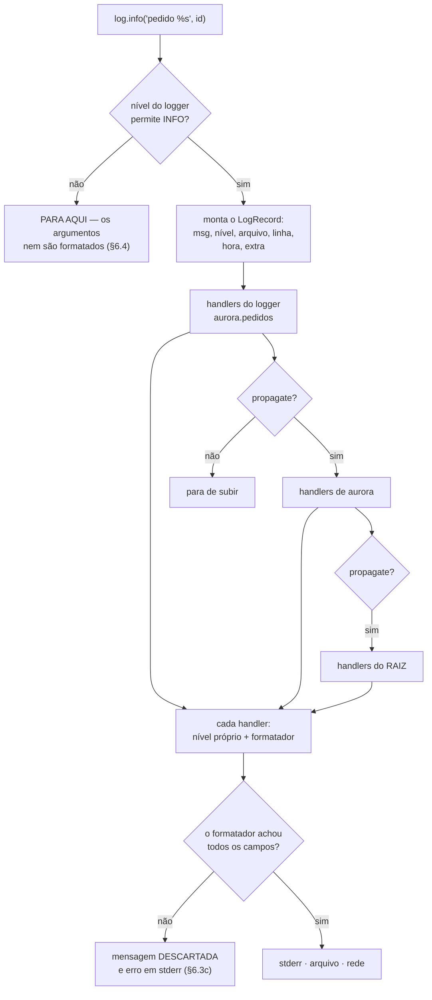

# 04.19 — Logging

> **Módulo 04 — Python Avançado** · Nível: N2 · Tempo estimado: 2h30 · Código: `codigo/cap19/`

## 1. Objetivo

- **Substituir** `print` por registro com nível, destino e contexto.
- **Configurar** o log num lugar só, e usá-lo de qualquer módulo.
- **Escolher** o nível certo para cada mensagem, e explicar o critério.
- **Reconhecer** as três armadilhas silenciosas: o nível padrão, o `basicConfig` que só funciona uma vez, e o formatador que come a mensagem.

Ao final, seu programa deixa um rastro que serve para investigar. **Daqui em diante, `print` não aparece em projeto do manual.**

---

## 2. Pré-requisitos

- [04.18 — Datas, horas e fusos](18-datas-horas-e-fusos.md) — todo registro tem carimbo de tempo, e ele vai em UTC.
- [04.17 — Organização de projetos](17-organizacao-de-projetos.md) — a configuração mora num módulo só, e `__name__` vira o nome do logger.
- [01.21 — Exceções](../01-Python/21-excecoes.md) — metade do valor do log está no que você registra dentro de um `except`.

**Autoteste:** (1) Por que gravar tudo em UTC? (2) O que `__name__` vale dentro de um módulo importado? (3) O que se perde ao capturar uma exceção e não relançá-la?

---

## 3. Motivação

O sistema da Aurora processou 40 mil pedidos ontem. Hoje três clientes reclamam de cobrança duplicada. Você abre o código e encontra isto:

```python
print("processando pedido")
print("erro:", erro)
```

**As perguntas que você precisa responder, e que esse código não responde:**

*Que horas foi?* Não há carimbo. *Qual pedido?* "processando pedido" é igual para os 40 mil. *De qual módulo veio?* Não dá para saber sem procurar o texto no repositório inteiro. *Onde está o rastro?* O programa roda como serviço, e `print` foi para um `stdout` que ninguém guardou. *Dá para ver só os erros?* Não — as mensagens têm todas o mesmo peso.

E há uma diferença que passa despercebida: `print` escreve na **saída** do programa, e log escreve no **diário** dele.

```
stdout: 'mensagem de print\n'
stderr: 'INFO mensagem de log\n'
```

Um script cuja saída é redirecionada para um arquivo (`programa.py > resultado.csv`) recebe as mensagens de depuração **dentro do CSV** se elas forem `print`. É por isso que o log vai para `stderr` por padrão: ele não contamina o resultado.

---

## 4. Modelo mental

O log tem **três decisões independentes**, e confundi-las é o que faz as configurações parecerem misteriosas.

```
    quem escreve          quem decide          para onde vai
    ────────────          ───────────          ─────────────
    logger                  nível              handler → formatter
    (por módulo)         (por logger)         (por destino)

    log.info(...)   →   passa se INFO   →   terminal · arquivo · rede
                        estiver ligado
```

- **Logger** — quem escreve. Um por módulo, com o nome do módulo. Nunca se configura.
- **Nível** — quem filtra. Uma mensagem passa se o nível dela for maior ou igual ao do logger.
- **Handler** — para onde vai. Terminal, arquivo, serviço externo. É onde vive o **formatador**.

**A frase que organiza o capítulo: quem escreve não decide para onde vai.** Um módulo pede `logging.getLogger(__name__)` e usa; ele não sabe nem se importa se aquilo vai para o terminal, para um arquivo ou para lugar nenhum. Quem decide é o **ponto de entrada do programa**, uma vez só.

É a mesma separação do 04.11 entre o que faz e o que decide — e é ela que permite ligar o `DEBUG` de um módulo específico em produção sem tocar em nenhuma linha dele.

---

## 5. Analogia

`print` é **gritar na sala**. Quem estiver por perto ouve; quem chegar depois, não; e não há como gritar mais baixo.

O log é o **diário de bordo de um navio**. Cada entrada tem hora, autor e gravidade, e há uma decisão separada — tomada pelo comandante, não por quem escreve — sobre o que é arquivado, o que é transmitido por rádio e o que fica só no caderno.

**E a analogia acerta em três limites que a §6 mede.** O diário só serve se **alguém tiver decidido guardá-lo**: por padrão, o Python descarta tudo abaixo de `WARNING`, e a maior parte do que você escreveu não aparece em lugar nenhum. A decisão de arquivamento é tomada **uma vez, no início da viagem** — mudar de ideia no meio não tem efeito. E uma entrada com um campo obrigatório em branco não é arquivada com um espaço vazio: ela é **descartada inteira**.

---

## 6. Teoria

### 6.1 O logger por módulo

```python
import logging

log = logging.getLogger(__name__)     # no topo de cada módulo


def criar_pedido(cliente: str) -> None:
    log.info("pedido criado para %s", cliente)
```

`__name__` vale `"aurora.pedidos"` dentro de `aurora/pedidos.py` (04.17). Isso dá três coisas de graça: cada mensagem diz de onde veio; os loggers formam uma **hierarquia por ponto**; e você pode ajustar um ramo inteiro.

```python
logging.getLogger("aurora").setLevel(logging.WARNING)
```

```
nível do filho (não definido): 0 · efetivo: WARNING
```

`aurora.pagamentos` não tem nível próprio, então herda o de `aurora`. É assim que se cala uma biblioteca barulhenta sem tocar nela — e é a razão de nunca usar `logging.info(...)` direto, que escreve no logger raiz e não pode ser ajustado por origem.

### 6.2 Os cinco níveis, e o critério

| Nível | Quando usar | Quem lê |
|---|---|---|
| `DEBUG` | valores intermediários, decisões internas | você, investigando |
| `INFO` | o que o sistema fez: pedido criado, arquivo processado | você, conferindo o fluxo |
| `WARNING` | algo inesperado, mas o programa seguiu | você, na revisão semanal |
| `ERROR` | uma operação falhou | alguém, hoje |
| `CRITICAL` | o programa não consegue continuar | alguém, agora |

**O critério que resolve a dúvida: pergunte quem lê e quando.** `DEBUG` é para você, na investigação; `ERROR` é para alguém que precisa agir. Uma mensagem `ERROR` que ninguém precisa ver treina o time a ignorar erros — que é o pior resultado possível de um sistema de log.

Duas confusões frequentes: uma exceção **tratada** e prevista (o cliente digitou um CEP inválido) é `INFO` ou `WARNING`, não `ERROR`; e uma exceção que você relança **não** deve ser registrada onde foi capturada, ou o mesmo problema aparece três vezes no arquivo.

### 6.3 As três armadilhas silenciosas

**(a) O nível padrão é `WARNING`.**

```
log.debug("chamada de debug")     ← não apareceu
log.info("pedido criado")         ← não apareceu
log.warning("estoque baixo")      ← apareceu
nível efetivo: WARNING
handlers do root: []
```

Sem configuração, `DEBUG` e `INFO` **somem**. É a queixa mais comum de quem começa — "meu log não funciona" — e a resposta é que ele está funcionando exatamente como configurado.

E note o `handlers do root: []`: as duas linhas que apareceram saíram pelo *handler de último recurso*, que escreve em `stderr` no formato `NÍVEL:origem:mensagem`, sem carimbo de tempo.

**E há um segundo filtro que quase ninguém conhece**, e que produz a mesma queixa depois de a pessoa já ter "resolvido" o problema:

```python
logging.getLogger("aurora").setLevel(logging.INFO)
logging.getLogger("aurora.pedidos").info("pedido criado")     # não aparece
```

```
nível efetivo de aurora.pedidos: INFO
passou pelo filtro do logger? True
lastResort: <_StderrHandler <stderr> (WARNING)>
```

**A mensagem passou pelo logger e morreu no handler.** O handler de último recurso tem nível fixo em `WARNING`, e ajustar o nível do *logger* não o alcança. São **dois** filtros em série (§7), e baixar só o primeiro não adianta: é preciso configurar um handler.

**(b) `basicConfig` só funciona uma vez.**

```python
logging.basicConfig(level=logging.DEBUG, format="[1] …")
logging.basicConfig(level=logging.ERROR, format="[2] …")
```

```
[1] DEBUG mensagem de debug
[1] ERROR mensagem de erro
```

**A segunda chamada não fez nada, e não avisou.** `basicConfig` verifica se o logger raiz já tem handlers e desiste se tiver. Isso costuma acontecer sem que ninguém perceba: uma biblioteca importada configura o log antes de você.

A saída é `force=True`, que remove os handlers existentes — e a prática é chamar `basicConfig` **uma vez só**, no ponto de entrada.

**(c) O formatador come a mensagem.**

```python
formato = "%(levelname)-8s pedido=%(pedido)s %(message)s"
log.info("pedido criado", extra={"pedido": "P-123"})   # aparece
log.info("esta mensagem some")                          # NÃO aparece
```

```
INFO     pedido=P-123 pedido criado
--- Logging error ---
ValueError: Formatting field not found in record: 'pedido'
```

O formatador exigia `pedido`, não achou, e a mensagem foi **descartada**. O erro sai em `stderr` num despejo enorme que ninguém lê, e a linha que você queria registrar não existe.

**É a pior falha possível num sistema de log**, porque ela apaga exatamente o que você usaria para investigar. Um formatador com campo obrigatório precisa que **todas** as chamadas o forneçam — ou o campo precisa de um padrão, via `logging.Filter` ou `LoggerAdapter`.

### 6.4 Formatação preguiçosa

```python
log.debug("pedido %s", pedido)      # preguiçoso
log.debug(f"pedido {pedido}")       # formata sempre
```

Duzentas mil chamadas com `DEBUG` **desligado** — nenhuma produz saída:

| Chamada | Tempo |
|---|---|
| valor barato · `"%s", valor` | 60,4 ms |
| valor barato · f-string | 78,0 ms |
| valor caro · `"%s", valor` | **54,8 ms** |
| valor caro · f-string | **139,4 ms** |

**A linha que decide é a terceira contra a quarta.** O custo da versão preguiçosa **não muda com o valor** — 54,8 contra 60,4 ms, ruído — porque ela nunca formata: o `%s` só é aplicado se a mensagem passar pelo filtro de nível. A f-string formata **antes** de chamar, então o custo cresce com o quanto o valor custa para virar texto.

Com um valor barato a diferença é de 30%, e ninguém morre. Com um objeto cujo `__str__` é caro — uma consulta, uma serialização, uma lista grande —, ela é de 2,5×, paga em produção com o `DEBUG` desligado, para produzir nada.

**A regra:** vírgula, não f-string. E quando o próprio argumento é caro de **calcular** (não só de formatar), a guarda explícita:

```python
if log.isEnabledFor(logging.DEBUG):
    log.debug("estado: %s", montar_diagnostico_caro())
```

### 6.5 Registrar exceções

```python
try:
    total = 100 / 0
except ZeroDivisionError as erro:
    log.error("falha ao calcular o total: %s", erro)     # só a frase
```

```
ERROR    falha ao calcular o total: division by zero
```

```python
except ZeroDivisionError:
    log.exception("falha ao calcular o total")           # a frase E o rastro
```

```
ERROR    falha ao calcular o total
Traceback (most recent call last):
  File "<string>", line 11, in <module>
ZeroDivisionError: division by zero
```

**A primeira versão registra que houve um problema; a segunda registra onde.** `log.exception(...)` equivale a `log.error(..., exc_info=True)`, só funciona dentro de um `except`, e é o que se usa **sempre** ali dentro.

O `str(erro)` sozinho é a armadilha: `division by zero` não diz qual arquivo, qual linha, qual caminho de chamadas. Numa investigação de madrugada, é a diferença entre trinta segundos e duas horas.

### 6.6 Contexto com `extra=`

```python
log.info("pedido criado", extra={"pedido": "P-123", "cliente_id": 7})
```

O `extra` acrescenta campos ao registro. Num formatador de texto eles precisam ser citados no formato (§6.3c); num formatador JSON, entram sozinhos:

```json
{"quando": "2026-08-05T14:09:32Z", "nivel": "INFO", "origem": "aurora.pedidos",
 "mensagem": "pedido criado", "pedido": "P-123", "cliente_id": 7}
```

**A diferença prática é enorme.** `"pedido criado"` num arquivo de texto exige `grep` e esperança. `{"pedido": "P-123"}` num arquivo JSON é uma consulta: *todos os registros do pedido P-123, em ordem*.

Dois cuidados. Nomes reservados são recusados — `extra={"message": ...}` levanta `KeyError: "Attempt to overwrite 'message' in LogRecord"`. E **nunca ponha segredo nem dado pessoal ali**: senha, token, cartão, CPF. Log é copiado, enviado a serviços externos e lido por gente que não deveria ver aquilo — e uma vez gravado, ele fica.

### 6.7 Onde configurar

```python
def configurar(nivel: str = "INFO",
               formato: Literal["texto", "json"] = "texto") -> None:
    manipulador = logging.StreamHandler(sys.stderr)
    manipulador.setFormatter(FormatadorJSON() if formato == "json"
                             else logging.Formatter(FORMATO_TEXTO))
    logging.basicConfig(level=nivel, handlers=[manipulador], force=True)

    for barulhenta in ("urllib3", "asyncio", "botocore"):
        logging.getLogger(barulhenta).setLevel(logging.WARNING)
```

**Uma função, chamada uma vez, no ponto de entrada.** Nenhum outro módulo do projeto chama `basicConfig`, `addHandler` ou `setLevel`.

E a regra que separa aplicação de biblioteca: **biblioteca não configura log.** Se o seu pacote vai ser importado por outros, ele só chama `getLogger(__name__)` e deixa a decisão para quem o usa. O máximo que ele faz é `logging.getLogger("aurora").addHandler(logging.NullHandler())`, que evita a mensagem "no handlers could be found" sem impor destino nenhum.

### 6.8 Carimbo em UTC

```python
class FormatadorJSON(logging.Formatter):
    converter = staticmethod(time.gmtime)
```

Por padrão, o `logging` carimba na **hora local da máquina** — o que produz o problema do 04.18 em toda a sua forma: registros de servidores em fusos diferentes não ordenam, e a base de investigação fica inutilizável exatamente quando é mais necessária.

`converter = time.gmtime` põe tudo em UTC. E o `staticmethod` não é decoração: sem ele, o verificador (04.14) trata `converter` como método e reclama da assinatura.

---

## 7. Funcionamento interno

Uma chamada de log percorre este caminho:

1. `log.info(...)` compara o nível com o do logger. **Não passou, acabou** — e é aqui que a formatação preguiçosa da §6.4 economiza.
2. Passou, o Python monta um `LogRecord`: mensagem, argumentos, nível, nome, arquivo, linha, hora, identificador da thread, e o que veio no `extra`.
3. O registro sobe a hierarquia. `aurora.pedidos` entrega aos handlers de `aurora.pedidos`, depois aos de `aurora`, depois aos do raiz — a menos que algum tenha `propagate = False`.
4. Cada handler aplica o próprio nível e o próprio formatador.

**O passo 3 explica a mensagem duplicada**, que é a queixa mais comum depois de "não aparece nada":

```
esta mensagem aparece duas vezes
2026-08-05 14:08:10 INFO aurora.dup esta mensagem aparece duas vezes
```

Uma saída pelo handler que você acrescentou ao logger, outra pelo handler do raiz, com formato diferente. A correção é escolher: ou o handler fica só no raiz, ou o logger específico recebe `propagate = False`.

E note que o `LogRecord` guarda arquivo, linha e função — `%(filename)s:%(lineno)d` no formato dá isso de graça, sem custo de escrita.

---

## 8. Visualização do fluxo



**Como ler:** o primeiro losango é o filtro que torna o log barato quando desligado. O ramo do meio — `propagate` — é a origem das mensagens duplicadas: um registro passa por **todos** os níveis da hierarquia, não só pelo seu. E o losango de baixo é a armadilha da §6.3c, o único ponto do diagrama em que uma mensagem é perdida em silêncio.

---

## 9. Aplicação prática

O módulo `registro.py` do projeto tem duas coisas e nada mais: a função `configurar` e o `FormatadorJSON`. Todo o resto do código faz apenas isto:

```python
log = logging.getLogger(__name__)
```

Os dois formatos, a mesma mensagem:

```
2026-08-05 14:09:32,068 INFO     aurora.pedidos: pedido criado

{"quando":"2026-08-05T14:09:32Z","nivel":"INFO","origem":"aurora.pedidos",
 "mensagem":"pedido criado","pedido":"P-123","cliente_id":7}
```

**Texto para quem está olhando o terminal; JSON para quem vai consultar depois.** A escolha é do ponto de entrada — a mesma linha de código produz as duas, e o desenvolvimento usa uma enquanto o servidor usa a outra.

E o registro de erro, em JSON, com o rastro dentro:

```json
{"quando":"2026-08-05T14:09:32Z","nivel":"ERROR","origem":"aurora.pedidos",
 "mensagem":"falha ao cobrar","pedido":"P-123",
 "excecao":"Traceback (most recent call last):\n …ZeroDivisionError: division by zero"}
```

**Agora volte à §3.** *Que horas foi?* `quando`, em UTC. *Qual pedido?* `pedido`. *De qual módulo?* `origem`. *Onde está?* No destino que o ponto de entrada escolheu. *Só os erros?* `nivel`. As cinco perguntas que o `print` não respondia estão respondidas por uma linha de log e uma configuração escrita uma vez.

---

## 10. Código comentado

[`codigo/cap19/registro.py`](codigo/cap19/registro.py) é o módulo de configuração — o único do projeto que sabe da existência de handlers.

[`codigo/cap19/demonstracao.py`](codigo/cap19/demonstracao.py) roda seis cenas, **cada uma num processo separado**. O motivo é conteúdo, e não detalhe de implementação: a configuração de log é **global ao processo**, e uma cena que chame `basicConfig` estraga todas as seguintes (§6.3b). Isolar em processos é a única forma honesta de mostrar configurações diferentes no mesmo arquivo.

```bash
python codigo/cap19/demonstracao.py
mypy --strict codigo/cap19/
```

O arquivo se chama `registro.py` e não `logging.py`, pelo motivo do D-021.

---

## 11. Erros comuns

| Erro | Sintoma | Correção |
|---|---|---|
| `print` em projeto | Sem hora, sem nível, sem origem; contamina `stdout` | `logging.getLogger(__name__)` |
| Esperar ver `INFO` sem configurar | "Meu log não funciona" | O padrão é `WARNING`; configure |
| `basicConfig` em vários lugares | A segunda chamada não faz nada, e não avisa | Uma vez, no ponto de entrada; `force=True` se precisar |
| `logging.info(...)` direto | Escreve no raiz; não dá para ajustar por origem | `log = logging.getLogger(__name__)` |
| f-string na mensagem | Formata mesmo com o nível desligado — 2,5× num valor caro | `log.debug("x %s", valor)` |
| `log.error(str(erro))` no `except` | Perde arquivo, linha e caminho de chamadas | `log.exception(...)` |
| Campo obrigatório no formato | **A mensagem some** e o erro vai para `stderr` | Todas as chamadas fornecem o campo, ou use `Filter` |
| Handler no logger e no raiz | Cada mensagem sai duas vezes | Escolha um; `propagate = False` |
| Biblioteca que configura log | Impõe destino a quem a importa | Só `getLogger`; no máximo `NullHandler` |
| Segredo no log | Senha e token gravados, copiados e enviados | Nunca; e revise o que vai no `extra` |
| Carimbo em hora local | Registros de servidores diferentes não ordenam | `converter = time.gmtime` |

---

## 12. Boas práticas

- **`log = logging.getLogger(__name__)` no topo de cada módulo.** Sempre igual, sem exceção.
- **Configuração num módulo só, chamada uma vez, no ponto de entrada.**
- **Vírgula, não f-string.** E `isEnabledFor` quando o argumento é caro de calcular.
- **`log.exception` dentro de todo `except` que não relança.**
- **Contexto no `extra`, não concatenado na frase.** `extra={"pedido": id}` é consultável; `f"pedido {id}"` é texto.
- **JSON em produção, texto no desenvolvimento.** A mesma linha de código, destinos diferentes.
- **Carimbo em UTC** (04.18).
- **Nada de segredo, senha, token ou dado pessoal.**
- **Uma mensagem `ERROR` deve exigir ação.** Se ninguém precisa agir, é `WARNING` ou `INFO`.
- **Biblioteca não configura log.**

---

## 13. Performance

A tabela da §6.4 é a medição que importa, e vale repetir a leitura: com o nível **desligado**, uma chamada de log custa 55 a 60 ms por 200 mil — cerca de **0,3 microssegundo** cada — e esse custo **não depende do valor**. A mesma chamada escrita com f-string custa 139,4 ms quando o valor é caro de formatar, e a diferença inteira é trabalho jogado fora.

Comparando com o custo de não fazer nada (2,5 ms por 200 mil), a chamada desligada é cerca de **24× mais cara que uma linha vazia** — e isso é aceitável para tudo, menos para um laço muito quente, onde a guarda `isEnabledFor` corta o custo pela metade.

**Com o nível ligado**, o custo passa a ser o do destino, e a diferença entre destinos é grande: escrever em `stderr` é barato; escrever num arquivo é barato com buffer; enviar pela rede a cada mensagem é caro o suficiente para mudar o desempenho do sistema — e é por isso que existem handlers com fila (`QueueHandler`), que entregam a escrita a outra thread.

A regra prática que sai daí: **`DEBUG` à vontade no código, desligado em produção.** O custo de tê-lo escrito é quase zero; o de ligá-lo é uma decisão de operação, tomada quando você precisa investigar — sem alterar nem reimplantar nada.

---

## 14. Mercado

O módulo `logging` está na biblioteca padrão desde o Python 2.3 e tem a idade à mostra: a API é verbosa, a configuração por `dictConfig` é um dicionário aninhado grande, e o comportamento padrão (`WARNING`, sem handler) surpreende todo mundo uma vez. Ainda assim é o denominador comum — toda biblioteca escreve nele, e é por meio dele que você silencia a que estiver barulhenta.

**`structlog`** e **`loguru`** são as alternativas populares. `loguru` troca a configuração inteira por uma linha e é excelente em script e projeto pequeno; `structlog` leva o registro estruturado a sério e é a escolha comum em serviço grande. As duas se integram com o `logging` padrão, porque precisam receber o que as bibliotecas escrevem nele.

Em produção, o formato JSON deixou de ser opcional. Serviços de agregação — Datadog, Grafana Loki, CloudWatch, Elastic — consultam campos, não texto, e um registro com `pedido` e `cliente_id` como campos vale muito mais que a mesma informação dentro da frase. É a diferença entre `grep` e consulta.

Em entrevista, a pergunta comum é "print ou logging?", e a resposta boa não é "logging é melhor": é a separação da §4 — quem escreve não decide para onde vai — mais um exemplo concreto de investigação que o `print` não permitiria.

---

## 15. Entrevistas

- **"Por que não usar `print`?"** Porque falta nível, hora, origem e destino configurável — e porque `print` escreve na **saída** do programa, contaminando um resultado redirecionado. Log vai para `stderr`.
- **"Por que `logger.info` não aparece?"** O nível padrão é `WARNING`. Sem configuração, `DEBUG` e `INFO` são descartados e o resto sai pelo handler de último recurso, sem carimbo de tempo.
- **"`log.debug(f'x {v}')` ou `log.debug('x %s', v)`?"** A segunda. A f-string formata **antes** da chamada, mesmo com o nível desligado — 139,4 contra 54,8 ms por 200 mil chamadas quando o valor é caro.
- **"Como registrar uma exceção?"** `log.exception(...)` dentro do `except`. `log.error(str(erro))` perde arquivo, linha e caminho de chamadas.
- **"Por que a mesma mensagem aparece duas vezes?"** Porque o registro **sobe a hierarquia**: sai pelo handler do seu logger e de novo pelo do raiz. Escolha um, ou `propagate = False`.

---

## 16. Exercícios guiados

Em [`exercicios/cap19.md`](exercicios/cap19.md):

- **A1** `[~10 min · qual nível?]` — 8 mensagens.
- **A2** `[~12 min · prevê a saída]` — 6 trechos de configuração.
- **A3** `[~12 min · ache o erro]` — 6 usos defeituosos.
- **A4** `[~10 min · onde vai?]` — 6 decisões de configuração.
- **AP1** `[~20 min · trocar os prints]` — Converta um módulo seu.
- **AP2** `[~25 min · o formatador JSON]` — Escreva o seu, com `extra`.
- **AP3** `[~20 min · a investigação]` — Encontre um defeito só pelo log.
- **D1** `[~50 min · o rastro da Aurora]` — **Do `print` ao registro consultável.**

---

## 17. Desafios

**D1 — O rastro da Aurora.** Pegue um programa seu que use `print` e transforme-o num que deixe rastro utilizável.

Requisitos: um módulo `registro.py` com `configurar(nivel, formato)`; `getLogger(__name__)` em todos os módulos; nenhum `print` fora da saída legítima do programa; `log.exception` em todo `except` que não relança; contexto no `extra`; carimbo em UTC; e uma variável de ambiente que escolha o nível (04.15).

**Depois, a prova:** rode o programa com `nivel="INFO"` e com `nivel="DEBUG"` e compare o número de linhas. Se for igual, você não escreveu nenhum `DEBUG` — e provavelmente vai precisar dele um dia.

**As três perguntas que valem a nota:** (1) Que informação você pôs no `extra` que permite reconstruir a história de **um** pedido entre milhares? (2) Alguma mensagem sua é `ERROR` sem que ninguém precise agir? Corrija e diga quantas eram. (3) Se este programa rodasse em três servidores ao mesmo tempo, o que faltaria no seu registro para juntar os três arquivos e ler em ordem?

---

## 18. Mini projeto

**O auditor de log.** Um script que leia um arquivo de log em JSON (uma linha por registro) e produza um relatório.

Requisitos: contagem por nível e por origem; as cinco mensagens de erro mais frequentes; a linha do tempo de um identificador específico (`--pedido P-123`), em ordem cronológica; e uma checagem de **higiene**, que aponte registros suspeitos de conter segredo — chaves com nome como `senha`, `token`, `cpf`, `cartao`, ou valores que pareçam um deles.

O script usa só a biblioteca padrão, e precisa sobreviver a linhas malformadas: um arquivo de log real tem linha truncada, linha de outro formato e linha vazia.

**E a pergunta que fecha:** você ordenou a linha do tempo pelo campo de hora **como texto** ou convertendo para `datetime`? As duas funcionam — e uma delas só funciona porque o capítulo anterior tomou uma decisão específica. Diga qual, e o que aconteceria se essa decisão tivesse sido outra.

---

## 19. Revisão

**Resumo em 5 frases.** O log tem **três decisões independentes** — quem escreve (um `logger` por módulo, com `__name__`), quem filtra (o **nível**) e para onde vai (o **handler** com seu formatador) —, e a frase que organiza tudo é que **quem escreve não decide para onde vai**: o módulo pede `getLogger(__name__)` e usa, enquanto o ponto de entrada configura uma vez. Três armadilhas são silenciosas e custam horas: o nível padrão é `WARNING`, então `DEBUG` e `INFO` **somem** sem configuração; `basicConfig` chamado uma segunda vez **não faz nada** e não avisa; e um formatador que exija um campo ausente **descarta a mensagem inteira**, jogando um despejo em `stderr` no lugar exato do registro que você usaria para investigar. Use vírgula e não f-string, porque a versão preguiçosa **não formata** quando o nível está desligado — 54,8 ms contra 139,4 por 200 mil chamadas com um valor caro, e o custo dela não muda com o valor. Dentro de `except`, `log.exception` em vez de `log.error(str(erro))`, porque o segundo registra que houve um problema e o primeiro registra **onde**. E o contexto vai no `extra`, não concatenado na frase: `{"pedido": "P-123"}` num registro JSON é consultável, e é a diferença entre reconstruir a história de um pedido entre quarenta mil e procurar texto com esperança.

**Flashcards** (também em [`revisao/flashcards.md`](revisao/flashcards.md)):

| ID | Frente | Verso |
|---|---|---|
| 04.19-F1 | Por que `logger.info(...)` não aparece? | O nível padrão é **`WARNING`**: sem configuração, `DEBUG` e `INFO` são descartados. E o que aparece sai pelo *handler de último recurso*, em `stderr`, no formato `NÍVEL:origem:mensagem` — sem carimbo de tempo. Não é defeito: é o padrão. |
| 04.19-F2 | Explique com suas palavras por que `log.debug("x %s", v)` é melhor que a f-string. | (Elaboração) A vírgula é **preguiçosa**: o `%s` só é aplicado se a mensagem passar pelo filtro de nível. A f-string formata **antes** da chamada, sempre. Medido com `DEBUG` desligado: 54,8 ms contra 139,4 por 200 mil, com um valor caro de formatar — e o custo da preguiçosa **não muda** com o valor. |
| 04.19-F3 | Preveja: `basicConfig` chamado duas vezes com formatos diferentes. | (Previsão) **A segunda não faz nada**, e não avisa — ela desiste se o logger raiz já tiver handlers. As duas mensagens saem no formato da primeira. `force=True` remove os handlers anteriores. A prática é chamar uma vez, no ponto de entrada. |
| 04.19-F4 | Quando usar `ERROR` e quando não? | (Decisão) `ERROR` quando **alguém precisa agir hoje**. Uma exceção tratada e prevista (CEP inválido digitado) é `INFO` ou `WARNING`. `ERROR` que ninguém precisa ver treina o time a ignorar erros, que é o pior resultado possível de um sistema de log. |
| 04.19-F5 | O que acontece se o formatador exigir um campo que a chamada não forneceu? | **A mensagem é descartada** e um despejo de erro vai para `stderr` (`Formatting field not found in record`). É a pior falha possível num log: ela apaga exatamente o registro que você usaria para investigar. Ou todas as chamadas fornecem o campo, ou ele ganha um padrão via `Filter`. |

**Revisão espaçada:** D+1 refaça A2 e A3 · D+7 o AP2 (o formatador JSON com `extra`) · D+30 configure log do zero num projeto novo e explique cada linha da função `configurar`.

---

## 20. Checklist

- [ ] Vi `logger.info` não aparecer sem configuração.
- [ ] Chamei `basicConfig` duas vezes e vi a segunda ser ignorada.
- [ ] Medi a diferença entre a vírgula e a f-string com o nível desligado.
- [ ] Comparei `log.error(str(erro))` com `log.exception(...)`.
- [ ] Perdi uma mensagem por causa de um campo faltando no `extra`.
- [ ] Vi a mesma mensagem sair duas vezes por causa do `propagate`.
- [ ] Escrevi um formatador JSON que inclui os campos do `extra`.
- [ ] Pus o carimbo em UTC.
- [ ] Troquei todos os `print` de um módulo meu.
- [ ] Consultei o registro por um identificador e reconstruí uma história.

---

## 21. Próximo capítulo

[04.20 — Context managers](20-context-managers.md). Este capítulo pediu `log.exception` dentro de todo `except`, e o anterior pediu que arquivos e conexões fossem sempre fechados. As duas coisas são a mesma pergunta — **o que precisa acontecer mesmo quando dá errado** —, e o `with` é a resposta que o Python dá para ela. O próximo capítulo abre a Caixa-preta 2 do [04.12](12-metodos-especiais.md): `__enter__` e `__exit__`, os dois dunder que faltavam.
