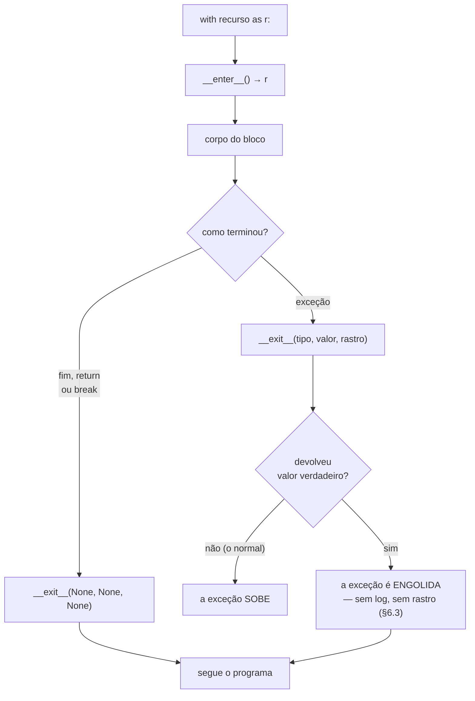

# 04.20 — Context managers

> **Módulo 04 — Python Avançado** · Nível: N2 · Tempo estimado: 2h30 · Código: `codigo/cap20/`

## 1. Objetivo

- **Explicar** o protocolo por trás do `with` — `__enter__` e `__exit__`.
- **Construir** gerenciadores próprios, como classe e com `@contextmanager`.
- **Prever** o efeito de `__exit__` devolver `True`, e por que ele quase nunca é o que você quer.
- **Escolher** entre classe, gerador e as ferramentas do `contextlib`, com o custo de cada um.

Ao final, você garante que a limpeza aconteça — inclusive quando o meio do bloco explode.

---

## 2. Pré-requisitos

- [04.12 — Métodos especiais](12-metodos-especiais.md) — a Caixa-preta 2 daquele capítulo prometeu `__enter__` e `__exit__`. **Este capítulo a paga.**
- [04.06 — Geradores](06-geradores-e-yield.md) — `@contextmanager` transforma um gerador de um `yield` só em gerenciador.
- [01.21 — Exceções](../01-Python/21-excecoes.md) — `try/finally` é o que o `with` substitui, e entender um explica o outro.

**Autoteste:** (1) O que o `finally` garante que o `except` não garante? (2) O que acontece com o código depois do `yield` quando ninguém consome o gerador? (3) O que `__eq__` sem `__hash__` provoca?

---

## 3. Motivação

Este código está correto e ninguém escreve assim:

```python
arquivo = open(caminho, "w", encoding="utf-8")
try:
    arquivo.write("mouse;8990\n")
finally:
    arquivo.close()
```

Três linhas de cerimônia para uma de trabalho. E o problema não é a digitação — é que a cerimônia **é opcional**, e a versão sem ela funciona:

```python
arquivo = open(caminho, "w", encoding="utf-8")
arquivo.write("mouse;8990\n")
```

```
ResourceWarning: unclosed file <_io.TextIOWrapper name='/tmp/a.txt' mode='w'>
```

Um aviso que ninguém vê, porque `ResourceWarning` é silencioso por padrão. No CPython o arquivo acaba fechado quando o objeto é coletado — em outra implementação, ou com uma referência presa em algum lugar, não é.

**E o caso que dói de verdade não é arquivo.** É a conexão de banco que fica aberta, o bloqueio que não é liberado, a transação que fica pendurada — porque uma exceção no meio do bloco pulou a linha de limpeza. O `finally` resolve isso, e ele precisa ser **lembrado, escrito e repetido** em todo lugar.

A pergunta do capítulo: e se a garantia viesse com o recurso, em vez de depender de quem o usa?

---

## 4. Modelo mental

`with` é **`try/finally` com um nome**.

```python
with recurso as r:      #  r = recurso.__enter__()
    corpo               #  try: corpo
                        #  finally: recurso.__exit__(tipo, valor, rastro)
```

O objeto responde a dois métodos. `__enter__` prepara e devolve o que vai para o `as`. `__exit__` limpa, e **roda sempre** — no fim normal, no `return`, no `break`, e na exceção.

**A frase que organiza o capítulo: a garantia mora no recurso, não em quem o usa.** Quem escreve `open` decide que ele fecha; quem escreve `with open(...)` não precisa lembrar de nada. É a mesma inversão do 04.04 com decoradores — o comportamento em volta é do objeto, não do chamador.

E há um detalhe do `__exit__` que decide o capítulo: ele recebe a exceção que estourou. Não para **tratá-la** — para saber se o bloco terminou bem ou mal, e limpar de acordo. Uma transação que sabe disso vira `COMMIT` ou `ROLLBACK` sozinha.

---

## 5. Analogia

Um laboratório com **protocolo de saída**.

Você entra, faz o experimento, sai. Na porta há um procedimento que **sempre** acontece: descartar o material, lavar as mãos, desligar a capela. Não importa se o experimento deu certo, se você desistiu no meio ou se algo explodiu — a saída é a mesma, e é responsabilidade da **porta**, não da sua memória.

**E a analogia acerta em dois limites que a §6 mede.** O protocolo de saída **sabe** se houve acidente — e é isso que permite reagir diferente: guardar a amostra se deu certo, descartar se deu errado. E existe um botão na porta que **apaga o registro do acidente**: quem sai por ele sai como se nada tivesse acontecido, e o incidente some do relatório. Esse botão existe, tem um uso legítimo raro, e é apertado por engano o tempo todo (§6.3).

---

## 6. Teoria

### 6.1 O protocolo

```python
class Cronometro:
    def __enter__(self) -> "Cronometro":
        self._inicio = timeit.default_timer()
        return self                      # <- vai para o `as`

    def __exit__(self, tipo, valor, rastro) -> None:
        self.ms = (timeit.default_timer() - self._inicio) * 1000
        estado = "falhou (%s)" % tipo.__name__ if tipo else "ok"
        print("%s %.2f ms · %s" % (self.rotulo, self.ms, estado))
```

```
soma             3.24 ms · ok
com erro         0.01 ms · falhou (ValueError)
```

**Duas coisas nessas duas linhas.** O `__exit__` rodou **antes** de a exceção subir — o bloco falhou, e a medição saiu do mesmo jeito. E ele soube **qual** exceção foi, porque a recebe nos argumentos: `tipo`, `valor` e `rastro`, ou três `None` quando tudo correu bem.

`__enter__` pode devolver qualquer coisa. Devolver `self` é o comum; `open` devolve o arquivo; um gerenciador de transação pode devolver o cursor. E quando o `as` é omitido, o valor é descartado — o que é legítimo para um gerenciador que só serve para garantir a saída.

### 6.2 O `with` compõe

```python
with Registra("externo"), Registra("interno"):
    ...
```

```
entrou externo
entrou interno
    corpo
saiu interno
saiu externo
```

Vários gerenciadores na mesma linha entram na ordem escrita e saem **na ordem inversa** — como pilha. É exatamente o que se quer: o recurso aberto por último é fechado primeiro.

E o `__exit__` roda também quando o bloco termina por `return` ou `break`:

```python
def com_return():
    with Registra("A"):
        return "resultado"
```

```
entrou A
saiu A
resultado
```

### 6.3 `__exit__` devolvendo `True` engole a exceção

```python
class Engole:
    def __exit__(self, tipo, valor, rastro) -> bool:
        return True
```

```python
with Engole():
    raise ValueError("erro grave")
print("o programa CONTINUOU")     # e continua mesmo
```

**Um valor verdadeiro devolvido pelo `__exit__` suprime a exceção.** Ela não sobe, não aparece em log, não deixa rastro — o programa segue como se o bloco tivesse terminado bem.

Isso existe de propósito e tem um uso legítimo: é assim que `contextlib.suppress` funciona. Mas ele é apertado por engano com frequência, e por um motivo bobo: **`return True` no fim de um `__exit__` que só queria dizer "terminei"**.

**A regra:** `__exit__` devolve `None` — ou seja, não devolve nada. Se você quer suprimir, escreva-o de forma explícita e comente por quê.

E note a assimetria com o `except`: um `except` que engole aparece no código de quem o escreveu. Um `__exit__` que engole está **na classe do recurso**, longe do `with` — e quem usa não tem como saber sem ler a implementação.

### 6.4 `@contextmanager`

```python
@contextlib.contextmanager
def transacao(nome: str) -> Iterator[str]:
    print("BEGIN", nome)
    try:
        yield nome
    except Exception:
        print("ROLLBACK", nome)
        raise
    else:
        print("COMMIT", nome)
    finally:
        print("fim", nome)
```

```
BEGIN t1 · usando t1 · COMMIT t1 · fim t1
BEGIN t2 · ROLLBACK t2 · fim t2
```

O decorador transforma um gerador de **um único `yield`** em gerenciador: o que vem antes é o `__enter__`, o valor do `yield` vai para o `as`, e o que vem depois é o `__exit__`.

**E o `try` de dentro não é enfeite.** Sem ele:

```python
@contextlib.contextmanager
def frouxo():
    print("abriu")
    yield
    print("fechou")           # NÃO roda se o corpo levantar
```

```
abriu
>>> 'fechou' NÃO apareceu: o recurso vazou
```

Uma exceção no corpo é **relançada dentro do gerador**, no ponto do `yield` — e mata o resto da função. O `finally` é o que garante a limpeza, e é exatamente o mesmo raciocínio da §3, agora um nível abaixo.

**Um limite que surpreende:** um gerenciador feito de gerador **não pode ser reutilizado**.

```
segunda vez -> AttributeError: args
```

O gerador já foi consumido, e a mensagem não explica nada. Se o mesmo objeto precisar entrar em vários `with`, escreva uma classe.

### 6.5 O `with` do `sqlite3` não fecha a conexão

```python
with conexao:
    conexao.execute("INSERT INTO t VALUES (1)")

conexao.execute("SELECT 1")        # ainda funciona!
```

```
depois do `with`, a conexão continua aberta
linhas após o rollback automático: 1 (o 2 não entrou)
```

**O `with` de uma conexão SQLite gerencia a transação, não a conexão** — `COMMIT` no fim normal, `ROLLBACK` na exceção (03.15). A conexão continua aberta, e fechá-la é outra chamada.

É o exemplo mais claro de que **`with` não significa "fecha"**: significa "o objeto tem um protocolo de entrada e saída", e o que ele faz na saída é decisão dele. Para fechar de verdade:

```python
with contextlib.closing(sqlite3.connect(caminho)) as conexao:
    with conexao:                       # transação
        conexao.execute(...)
```

Dois `with` aninhados que fazem coisas diferentes, e é isso mesmo. A confusão entre eles produz uma classe de defeito real: aplicação que abre conexões dentro de um laço, cada uma "protegida" por um `with`, e esgota o limite do banco.

### 6.6 As ferramentas do `contextlib`

| Ferramenta | Para quê |
|---|---|
| `@contextmanager` | escrever um gerenciador com um gerador |
| `closing(objeto)` | transformar qualquer objeto com `.close()` em gerenciador |
| `suppress(Erro)` | ignorar uma exceção específica — o `return True` legítimo |
| `ExitStack()` | um número de recursos que só se sabe em execução |
| `nullcontext()` | um gerenciador que não faz nada, para simplificar um `if` |

```python
with contextlib.ExitStack() as pilha:
    arquivos = [pilha.enter_context(open(p)) for p in caminhos]
```

```
dentro do with, fechados? [False, False, False]
depois,         fechados? [True, True, True]
```

`ExitStack` resolve o caso que `with a, b, c` não resolve: **quantos recursos, você só sabe rodando**. Todos são fechados na ordem inversa, e uma exceção em qualquer um não impede o fechamento dos outros.

E `suppress` merece uma nota, porque é o `return True` da §6.3 com nome:

```python
with contextlib.suppress(FileNotFoundError):
    caminho.unlink()
```

Ele é honesto onde o `__exit__` da §6.3 é traiçoeiro: **o nome da exceção suprimida está visível no `with`**, na linha que alguém lê.

### 6.7 Quando escrever um

Três sinais de que um trecho quer virar gerenciador:

- **Um par abre/fecha, adquire/libera, começa/termina.** Conexão, arquivo, bloqueio, transação, diretório temporário, sessão.
- **Um `try/finally` repetido** em mais de dois lugares.
- **Um estado global que precisa voltar ao que era.** Diretório de trabalho, nível de log, variável de ambiente, decimal com outra precisão.

E o sinal de que **não** é: quando não há nada a desfazer. Um gerenciador que só faz coisa no `__enter__` é uma função com sintaxe estranha.

---

## 7. Funcionamento interno

O `with` é reescrito pelo interpretador em algo próximo disto:

```python
gerenciador = recurso
valor = type(gerenciador).__enter__(gerenciador)
try:
    ...                                  # o corpo
except BaseException:
    if not type(gerenciador).__exit__(gerenciador, *sys.exc_info()):
        raise
else:
    type(gerenciador).__exit__(gerenciador, None, None, None)
```

**Dois detalhes que explicam comportamentos.** Os métodos são buscados no **tipo**, não na instância — pôr `__enter__` num atributo do objeto não funciona, pelo mesmo motivo dos outros dunder (04.12). E o `if not ... : raise` é literalmente a §6.3: o valor devolvido decide se a exceção continua.

O `@contextmanager` é uma classe que guarda o gerador. `__enter__` chama `next()` nele; `__exit__` chama `gen.throw(exceção)` quando houve erro — o que faz a exceção reaparecer **dentro** do gerador, no `yield` — ou `next()` de novo, esperando `StopIteration`. É por isso que o gerador precisa do `try/finally` (§6.4) e por que ele não se reutiliza.

---

## 8. Visualização do fluxo



**Como ler:** os dois ramos do losango de cima mostram que `__exit__` roda **sempre** — a diferença é só o que ele recebe. E o losango de baixo é a decisão que mora dentro da classe do recurso, longe de quem escreveu o `with`: quem usa o gerenciador não vê essa linha, e é por isso que `return True` acidental é tão caro.

---

## 9. Aplicação prática

**O `Cronometro` da §6.1** já é um gerenciador útil, e ele mostra o padrão que mais aparece: medir, registrar, contar — coisas que precisam acontecer **mesmo quando o bloco falha**.

Um caso da Aurora, juntando o capítulo anterior:

```python
@contextlib.contextmanager
def operacao(nome: str, **contexto: object) -> Iterator[None]:
    log = logging.getLogger(__name__)
    inicio = time.perf_counter()
    log.info("%s iniciada", nome, extra=contexto)
    try:
        yield
    except Exception:
        log.exception("%s falhou", nome, extra=contexto)
        raise
    else:
        ms = (time.perf_counter() - inicio) * 1000
        log.info("%s concluída em %.1f ms", nome, ms, extra=contexto)
```

```python
with operacao("processar_pedido", pedido="P-123"):
    validar(pedido)
    cobrar(pedido)
    despachar(pedido)
```

**Isto resolve de uma vez as quatro lacunas que o AP3 do 04.19 revelou:** há um `INFO` de início e outro de fim (o que permite achar o que começou e não terminou), o `log.exception` está garantido, o contexto vai no `extra` em todas as mensagens, e a duração é medida com `perf_counter` (04.18).

E resolve por construção: quem escreve `with operacao(...)` não pode esquecer o `except`, porque ele não está no código de quem chama.

**O caso do SQLite, escrito certo:**

```python
with contextlib.closing(sqlite3.connect(caminho)) as conexao:
    conexao.execute("PRAGMA foreign_keys = ON")
    with conexao:
        conexao.execute("INSERT INTO pedidos …")
```

O de fora fecha a conexão; o de dentro decide entre `COMMIT` e `ROLLBACK`. Dois `with` porque são duas garantias diferentes (§6.5).

---

## 10. Código comentado

Em [`codigo/cap20/gerenciadores.py`](codigo/cap20/gerenciadores.py), seis cenas: o `try/finally` que o `with` substitui; o protocolo escrito à mão; o `__exit__` que engole; o `@contextmanager` com e sem o `try` de dentro; o `with` do SQLite que não fecha a conexão; e o `ExitStack` com a medição de custo.

```bash
python codigo/cap20/gerenciadores.py
mypy --strict codigo/cap20/gerenciadores.py
```

Vale reparar numa linha do arquivo: `def __enter__(self) -> "Cronometro":`, com aspas — a classe ainda não terminou de existir quando a anotação é avaliada (04.14/§6.6). No Python 3.11 e seguintes existe `typing.Self`, que diz o mesmo sem repetir o nome.

---

## 11. Erros comuns

| Erro | Sintoma | Correção |
|---|---|---|
| `return True` no `__exit__` | Exceções somem em silêncio | Não devolva nada; `suppress` quando for de propósito |
| `@contextmanager` sem `try/finally` | A limpeza não roda quando o corpo falha | `try: yield` … `finally:` |
| Reutilizar um gerenciador de gerador | `AttributeError: args`, sem explicação | Uma classe, ou chame a função de novo |
| Achar que `with conexao:` fecha | Conexões acumulam até esgotar o limite | `closing(...)` por fora, `with conexao:` por dentro |
| Abrir o recurso antes do `with` | Se `__enter__` falhar, o recurso vaza | Abra **dentro** do `with` |
| `with` para o que não tem saída | Sintaxe estranha para o que é uma função | Só quando há algo a desfazer |
| `__enter__` na instância | Não é chamado | Os dunder são buscados no **tipo** (04.12) |
| `ExitStack` esquecido | `with a, b, c` não cobre quantidade variável | `ExitStack` quando o número só se sabe rodando |

---

## 12. Boas práticas

- **`__exit__` não devolve nada.** Suprimir é decisão explícita, com nome e comentário.
- **`try/finally` dentro de todo `@contextmanager`.** Sem exceção.
- **Classe quando o gerenciador for reutilizado ou guardar estado;** gerador quando for de uso único e simples.
- **Um `with` por garantia.** Fechar a conexão e controlar a transação são duas coisas.
- **Abra o recurso dentro do `with`**, não antes.
- **`ExitStack` para quantidade variável**, e não um laço com `try/finally` aninhado.
- **`suppress` no lugar de `try/except: pass`** — ele diz o que ignora, na linha que se lê.
- **Gerenciadores são ótimos para instrumentação:** medir, registrar, contar. O que precisa acontecer mesmo em erro cabe num `__exit__`.

---

## 13. Performance

Um milhão de entradas e saídas, melhor de três:

| Forma | Tempo |
|---|---|
| nada (linha vazia) | 11,7 ms |
| `with` de uma **classe** | 240,1 ms |
| `with` de um **`@contextmanager`** | **1511,1 ms** |

**A diferença entre as duas últimas é a informação acionável: o gerenciador feito de gerador é cerca de 6× mais caro para entrar e sair.** O motivo está na §7 — ele cria um objeto gerador, chama `next()`, e na saída chama `throw()` ou `next()` de novo, com o tratamento de `StopIteration` em volta.

**Em números absolutos, os dois são baratos:** 0,24 e 1,5 microssegundo. Para um arquivo, uma conexão ou uma transação — coisas que custam milissegundos —, a diferença é invisível e a conveniência do decorador vence.

Ela deixa de ser invisível num laço quente: um `with` por item, num laço de dez milhões, é 15 segundos contra 2,4. Aí vale escrever a classe, ou tirar o `with` do laço.

**E o custo que não aparece na tabela é o que importa mais:** um recurso que vaza não tem custo em microssegundos — ele tem custo em conexões esgotadas e processos reiniciados. O `with` é barato em qualquer forma comparado a isso.

---

## 14. Mercado

O `with` entrou no Python 2.5 (PEP 343) e é hoje uma das construções mais reconhecíveis da linguagem. `open` sem `with` é lido como erro em revisão de código, e ferramentas de análise estática o apontam.

Onde ele aparece de forma incontornável: **arquivos**, **conexões e transações** de banco (módulo 05), **bloqueios** em concorrência (04.21), **sessões** de cliente HTTP, **diretórios temporários**, e **testes** — `pytest.raises` é um gerenciador, e o `mock.patch` também, o que permite substituir uma função só dentro de um bloco.

A versão assíncrona, `async with`, usa `__aenter__` e `__aexit__` e é o padrão em bibliotecas de rede modernas — é o assunto do 04.22, e o protocolo é o mesmo com outro nome.

Em entrevista, "para que serve o `with`?" é uma pergunta de aquecimento, e a resposta que separa menciona **duas** coisas além de "fecha o arquivo": que `__exit__` recebe a exceção (e por isso pode reagir a ela) e que devolver `True` a suprime.

---

## 15. Entrevistas

- **"Para que serve o `with`?"** Para garantir que a saída aconteça — no fim normal, no `return`, no `break` e na exceção. É `try/finally` com a garantia morando no recurso, não em quem o usa.
- **"O que o `__exit__` recebe?"** Tipo, valor e rastro da exceção — ou três `None`. É isso que permite a uma transação decidir entre `COMMIT` e `ROLLBACK` sozinha.
- **"O que acontece se `__exit__` devolver `True`?"** A exceção é **suprimida**, sem log e sem rastro. É como o `contextlib.suppress` funciona, e é o erro acidental mais caro do assunto.
- **"`with conexao:` fecha a conexão?"** No `sqlite3`, **não** — ele controla a transação. Fechar é `contextlib.closing`, e os dois se aninham.
- **"Classe ou `@contextmanager`?"** Gerador para uso único e simples; classe quando precisar ser reutilizado, guardar estado ou entrar em laço quente (6× mais barato).

---

## 16. Exercícios guiados

Em [`exercicios/cap20.md`](exercicios/cap20.md):

- **A1** `[~10 min · a saída roda?]` — 8 formas de sair de um bloco.
- **A2** `[~12 min · prevê a saída]` — 6 gerenciadores.
- **A3** `[~12 min · ache o erro]` — 6 implementações defeituosas.
- **A4** `[~10 min · classe ou gerador?]` — 6 situações.
- **AP1** `[~20 min · o cronômetro]` — Escreva o da §6.1, com testes.
- **AP2** `[~25 min · o estado restaurado]` — Um que desfaça uma mudança global.
- **AP3** `[~20 min · a conexão certa]` — Os dois `with` do SQLite.
- **D1** `[~50 min · a operação instrumentada]` — **Log, tempo e transação num só.**

---

## 17. Desafios

**D1 — A operação instrumentada.** Construa o gerenciador `operacao(nome, **contexto)` da §9 e use-o para instrumentar um processamento em lote.

Requisitos: `INFO` na entrada e na saída, com duração medida por `perf_counter`; `log.exception` e relançamento em caso de erro; contexto no `extra` em **todas** as mensagens; aninhamento (uma `operacao` dentro de outra) produzindo registros coerentes; e `mypy --strict` limpo.

**Depois, o teste que prova:** processe 5 itens, dos quais o terceiro falha, e confira no log que os 5 têm entrada, que 4 têm saída, e que o terceiro tem o rastro.

**As três perguntas que valem a nota:** (1) Seu gerenciador é reutilizável? Teste usando o **mesmo objeto** em dois `with` e explique o resultado. (2) Se uma `operacao` interna falhar, quantas mensagens de erro aparecem no log — e quantas deveriam? (3) O que o seu `__exit__` devolve, e o que aconteceria se devolvesse `True`?

---

## 18. Mini projeto

**A caixa de ferramentas.** Um módulo `contextos.py` com cinco gerenciadores úteis de verdade, tipados e testados.

Requisitos:

- `cronometro(rotulo)` — mede e registra, mesmo em erro.
- `pasta_temporaria()` — cria e apaga, inclusive o conteúdo.
- `variavel_de_ambiente(nome, valor)` — define e **restaura o valor anterior**, inclusive quando ele não existia.
- `nivel_de_log(logger, nivel)` — muda e restaura.
- `banco(caminho)` — abre, garante `PRAGMA foreign_keys = ON`, e fecha.

Cada um com teste que verifique o estado **depois** do bloco, tanto no caminho feliz quanto com exceção.

**E a pergunta que fecha:** três dos cinco precisam guardar o estado anterior para restaurá-lo. Um deles tem um caso de borda que os outros não têm — a diferença entre "o valor era outro" e "o valor **não existia**". Qual é, e como o seu código distingue os dois? Testar isso exige um caso específico; escreva-o.

---

## 19. Revisão

**Resumo em 5 frases.** `with` é **`try/finally` com um nome**, e o que ele muda é onde mora a garantia: quem escreve o recurso decide o que acontece na saída, e quem o usa não precisa lembrar de nada — `__enter__` prepara e devolve o valor do `as`, `__exit__` limpa e roda **sempre**, no fim normal, no `return`, no `break` e na exceção. O `__exit__` **recebe a exceção** (tipo, valor e rastro, ou três `None`), e é isso que permite a uma transação decidir sozinha entre `COMMIT` e `ROLLBACK` — mas devolver um valor **verdadeiro** dali **suprime** a exceção, sem log e sem rastro, numa linha que mora na classe do recurso e que quem escreveu o `with` nunca vê. `@contextmanager` transforma um gerador de um `yield` só em gerenciador, e o `try/finally` dentro dele não é enfeite: uma exceção no corpo é relançada **no ponto do `yield`** e mata o resto da função, de modo que sem o `finally` a limpeza não acontece — e o gerador resultante **não pode ser reutilizado**, falhando com um `AttributeError: args` que não explica nada. `with conexao:` no `sqlite3` **não fecha a conexão**: ele controla a transação, e fechar exige `contextlib.closing` por fora — dois `with` aninhados, porque são duas garantias diferentes. E a escolha entre classe e gerador tem número: entrar e sair custa 240 ms por milhão na classe contra 1511 ms no `@contextmanager`, cerca de 6× — invisível para um arquivo, visível num laço quente.

**Flashcards** (também em [`revisao/flashcards.md`](revisao/flashcards.md)):

| ID | Frente | Verso |
|---|---|---|
| 04.20-F1 | O que o `__exit__` recebe, e por que isso importa? | **Tipo, valor e rastro** da exceção — ou três `None` quando o bloco terminou bem. É o que permite reagir ao resultado: uma transação vira `COMMIT` ou `ROLLBACK` sozinha, e um cronômetro registra "falhou (ValueError)" em vez de "ok". |
| 04.20-F2 | Explique com suas palavras por que o `try/finally` dentro de um `@contextmanager` é obrigatório. | (Elaboração) Uma exceção no corpo do `with` é **relançada dentro do gerador**, no ponto do `yield` — e mata o resto da função. Sem `finally`, o código depois do `yield` não roda e o recurso vaza. O decorador não acrescenta nenhuma garantia: ela tem de estar no gerador. |
| 04.20-F3 | Preveja: `__exit__` devolve `True` e o bloco levanta `ValueError`. | (Previsão) **A exceção é engolida** — não sobe, não aparece em log, não deixa rastro, e o programa continua. É como `contextlib.suppress` funciona. O erro acidental vem de um `return True` que só queria dizer "terminei"; o certo é não devolver nada. |
| 04.20-F4 | `with conexao:` fecha a conexão do SQLite? | **Não.** Ele controla a **transação** — `COMMIT` no fim normal, `ROLLBACK` na exceção (03.15) — e a conexão continua aberta. Fechar é `contextlib.closing(sqlite3.connect(...))`, e os dois se aninham porque são duas garantias diferentes. |
| 04.20-F5 | Classe ou `@contextmanager`? | (Decisão) Gerador para uso único e simples; **classe** quando precisar ser reutilizado (o gerador falha com `AttributeError: args` na segunda vez), guardar estado, ou entrar num laço quente — medido: 240 ms contra 1511 ms por milhão de entradas e saídas. |

**Revisão espaçada:** D+1 refaça A2 e A3 · D+7 o AP2 (o estado restaurado, com o caso da variável inexistente) · D+30 escreva de memória um gerenciador de classe e um de gerador para o mesmo recurso, e diga qual você usaria.

---

## 20. Checklist

- [ ] Escrevi um gerenciador como classe, com `__enter__` e `__exit__`.
- [ ] Vi o `__exit__` rodar depois de uma exceção, e li o tipo dela.
- [ ] Vi uma exceção ser engolida por um `return True`.
- [ ] Escrevi um `@contextmanager` com `try/finally`.
- [ ] Tirei o `try` e vi a limpeza não acontecer.
- [ ] Tentei reutilizar um gerenciador de gerador.
- [ ] Confirmei que `with conexao:` não fecha a conexão.
- [ ] Usei `ExitStack` para uma quantidade variável de recursos.
- [ ] Usei `suppress` no lugar de um `except: pass`.
- [ ] Medi a diferença entre a classe e o decorador.

---

## 21. Próximo capítulo

[04.21 — Concorrência: threads, processos e GIL](21-concorrencia-threads-processos-gil.md). Este capítulo garantiu que a limpeza aconteça mesmo quando o bloco falha; o próximo mostra um caso em que ela precisa acontecer **enquanto outro código roda ao mesmo tempo** — o bloqueio (*lock*), que é um gerenciador de contexto e o exemplo mais claro de por que `with` existe. E responde à pergunta que todo mundo faz sobre Python mais cedo ou mais tarde: por que quatro threads não deixam o programa quatro vezes mais rápido.
