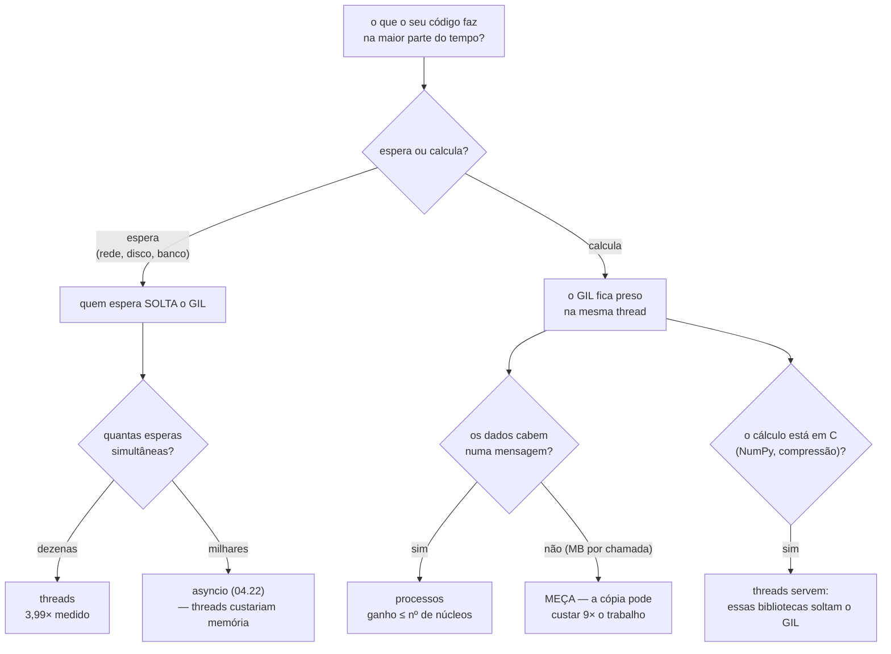

# 04.21 — Concorrência: threads, processos e GIL

> **Módulo 04 — Python Avançado** · Nível: N2 · Tempo estimado: 3h · Código: `codigo/cap21/`

## 1. Objetivo

- **Explicar** o que o GIL é, o que ele impede e o que ele não impede.
- **Diferenciar** trabalho de **espera** (I/O-bound) de trabalho de **conta** (CPU-bound), e escolher a ferramenta a partir disso.
- **Reconhecer** uma condição de corrida — e por que ela não aparece quando você testa.
- **Medir** o custo de processos antes de usá-los, porque ele pode superar o ganho.

Ao final, você sabe quando quatro threads ajudam, quando quatro processos ajudam e quando nenhum dos dois.

---

## 2. Pré-requisitos

- [04.20 — Context managers](20-context-managers.md) — a trava (*lock*) é um gerenciador de contexto, e o `with` garante que ela seja liberada mesmo em erro.
- [04.18 — Datas e horas](18-datas-horas-e-fusos.md) — medir duração é `perf_counter`, e todo número deste capítulo veio dele.
- [04.06 — Geradores](06-geradores-e-yield.md) — `map` de um executor devolve um iterável preguiçoso, e materializá-lo com `list()` é o que espera o resultado.

**Autoteste:** (1) O que o `with` garante que um `try` esquecido não garante? (2) Por que `perf_counter` e não `datetime.now()`? (3) O que acontece se você não consumir um gerador?

---

## 3. Motivação

Quatro tarefas de cálculo, uma máquina com dois núcleos, e a solução que todo mundo escreve primeiro:

```python
with ThreadPoolExecutor(4) as fios:
    resultados = list(fios.map(tarefa_cpu, [TAMANHO] * 4))
```

```
sequencial                           1210,5 ms
ThreadPoolExecutor(4)                1291,8 ms
```

**Quatro threads deixaram o programa mais lento.** Não um pouco mais rápido, não igual: **mais lento**, porque trocar de thread custa e não há ganho nenhum para compensar.

Agora as mesmas quatro tarefas, trocando uma palavra:

```
ProcessPoolExecutor(4)                791,6 ms
```

E agora quatro tarefas que **esperam** meio segundo cada:

```
sequencial                           2002,6 ms
ThreadPoolExecutor(4)                 502,0 ms      ← 3,99×
```

**As mesmas quatro threads que não deram nada agora dão quatro vezes.** A diferença não está na ferramenta — está no **tipo de trabalho**. Este capítulo é sobre a pergunta que decide: o seu programa está **fazendo conta** ou **esperando**?

---

## 4. Modelo mental

**O GIL é um microfone único numa sala.**

Podem existir quatro threads na sala. Só uma **fala** por vez — só uma executa código Python num dado instante, porque para mexer nos objetos do interpretador é preciso segurar o microfone.

```
    CPU-bound (falar)              I/O-bound (consultar um documento)
    ────────────────               ─────────────────────────────────
    T1 ████░░░░░░░░                T1 ██░░░░░░░░  (esperando)
    T2 ░░░░████░░░░                T2 ░░██░░░░░░  (esperando)
    T3 ░░░░░░░░████                T3 ░░░░██░░░░  (esperando)
       ↑ revezam, total igual         ↑ esperam JUNTAS
```

**A frase que organiza o capítulo: quem espera solta o microfone.** Uma thread que chama `time.sleep`, lê um arquivo, faz uma consulta ao banco ou uma requisição de rede **libera o GIL** enquanto espera — e as outras trabalham. Uma thread que só faz conta o segura do começo ao fim.

Daí a regra inteira:

- **Espera** → threads. Elas esperam em paralelo, e esperar não precisa de microfone.
- **Conta** → processos. Cada processo tem o **próprio** interpretador e o próprio microfone.

E o preço dos processos aparece na mesma imagem: quatro salas separadas não se ouvem. Trocar informação entre elas exige **copiar**, e a §6.6 mede quanto isso custa.

---

## 5. Analogia

Já está na §4, e vale insistir num ponto dela.

O microfone não existe para atrapalhar. Ele existe porque **os objetos da sala são compartilhados** — o contador de referências de cada objeto Python, as estruturas internas do interpretador — e duas pessoas mexendo neles ao mesmo tempo corrompem a memória. O microfone é o que torna a linguagem simples e segura sem exigir que você pense nisso.

**E a analogia acerta no limite que a §6.4 mede.** O microfone garante que **uma instrução do interpretador** não seja interrompida no meio. Ele **não** garante que a sua operação não seja: `saldo = saldo + 1` são três instruções, e o microfone pode trocar de mão entre elas. O GIL protege o interpretador, não o seu código.

---

## 6. Teoria

### 6.1 O que o GIL é

**GIL** é *Global Interpreter Lock* — uma trava global do interpretador. Uma thread precisa segurá-la para executar bytecode Python, e o CPython a passa adiante a cada 5 milissegundos por padrão (`sys.getswitchinterval()`), ou quando a thread entra numa operação de espera.

**O que ele impede:** duas threads executarem código Python **ao mesmo tempo**. Não há paralelismo de CPU dentro de um processo Python.

**O que ele não impede**, e cada item tem consequência:

- **Concorrência.** As threads se revezam, e isso é suficiente para esperar em paralelo.
- **Paralelismo em código C.** Uma biblioteca que libera o GIL enquanto trabalha — NumPy, compressão, criptografia, boa parte do que é escrito em C — roda de fato em paralelo.
- **Condições de corrida no seu código.** É o assunto da §6.4, e é o mal-entendido mais caro do capítulo.

E ele é uma decisão do **CPython**, não da linguagem. Jython e IronPython não têm GIL; PyPy tem.

### 6.2 CPU-bound: a medição

Quatro tarefas de cálculo puro, máquina de dois núcleos:

| Forma | Tempo | Ganho |
|---|---|---|
| sequencial | 1210,5 ms | — |
| `ThreadPoolExecutor(4)` | 1291,8 ms | **0,94×** |
| `ProcessPoolExecutor(4)` | 791,6 ms | 1,53× |

**A linha do meio é o capítulo inteiro em um número.** Quatro threads não deram ganho nenhum — deram uma perda de 6%, que é o custo de trocar de thread sem ter o que ganhar.

E o ganho dos processos é **1,53×** numa máquina de **dois** núcleos, não 4×. Paralelismo de verdade é limitado pelo número de núcleos, e o resto é custo de partida e de coordenação. Numa máquina de oito núcleos o número sobe; ele nunca passa da contagem de núcleos.

### 6.3 I/O-bound: a inversão

As mesmas ferramentas, com trabalho que **espera**:

| Forma | Tempo | Ganho |
|---|---|---|
| sequencial | 2002,6 ms | — |
| `ThreadPoolExecutor(4)` | 502,0 ms | **3,99×** |
| `ProcessPoolExecutor(4)` | 519,2 ms | 3,86× |

**Quatro esperas de meio segundo levaram meio segundo.** O ganho é praticamente igual ao número de threads, e não ao número de núcleos — porque esperar não usa núcleo nenhum.

Note que **processos também funcionam** aqui, e um pouco pior: eles resolvem o problema e cobram o custo de partida sem necessidade. Para espera, threads são a resposta.

**Como saber em qual caso você está:** meça o tempo total e some o tempo gasto em chamadas que esperam (rede, disco, banco). Se a espera domina, é I/O-bound. Na dúvida, o teste da §3 responde em dois minutos — troque `ThreadPoolExecutor` por `ProcessPoolExecutor` e compare.

### 6.4 A corrida que não aparece no teste

Este código tem um defeito:

```python
atual = saldo          # LÊ
saldo = atual + 1      # ESCREVE
```

Quatro threads, mil incrementos cada, três execuções:

```
 4000 de  4000 · perdeu 0
 4000 de  4000 · perdeu 0
 4000 de  4000 · perdeu 0
```

**Zero perdas.** Três execuções, nenhum erro, e o defeito continua lá. Agora a **mesma** operação, com uma troca de thread forçada entre a leitura e a escrita:

```
 1017 de  4000 · perdeu 2983 (75%)
 1007 de  4000 · perdeu 2993 (75%)
 1000 de  4000 · perdeu 3000 (75%)
```

**Setenta e cinco por cento dos incrementos desaparecem.** O mecanismo: a thread A lê `saldo` (100), perde a vez, a thread B lê `saldo` (100), soma e escreve (101), A volta e escreve (101). Dois incrementos, um resultado.

**E a leitura que vale mais que o número é a comparação entre os dois blocos.** O defeito é o mesmo nos dois; o que mudou foi a sorte. Você **não consegue testar** essa classe de defeito para ter confiança: ela aparece com carga, com outra máquina, com um núcleo a mais, ou depois de alguém acrescentar uma linha que muda o ritmo.

Por isso a regra não é "teste bem". É: **estado compartilhado e mutável entre threads exige trava, por construção.**

### 6.5 A trava, e o `with`

```python
trava = threading.Lock()

with trava:                  # 04.20
    atual = saldo
    saldo = atual + 1
```

```
 4000 de  4000 · perdeu 0
 4000 de  4000 · perdeu 0
 4000 de  4000 · perdeu 0
```

Com a troca forçada exatamente do mesmo jeito, o resultado é exato. A trava garante que ninguém entre no bloco enquanto outra thread estiver lá.

**E o `with` não é estilo.** Uma exceção no meio do bloco, com `acquire()`/`release()` escritos à mão, deixa a trava **presa para sempre** — e o próximo que tentar adquiri-la espera indefinidamente, sem erro nenhum. É o A3.2 do capítulo anterior, e é o exemplo mais claro de por que `with` existe.

**Três cuidados com travas:**

- **Segure pelo menor tempo possível.** Uma trava em volta de uma chamada de rede serializa o programa inteiro.
- **Duas travas adquiridas em ordens diferentes por duas threads travam tudo** (*deadlock*). Adote uma ordem única e documente-a.
- **`queue.Queue` costuma ser melhor que uma trava.** Ela já é segura entre threads, e o desenho "produtor e consumidor trocando mensagens" evita o estado compartilhado em vez de protegê-lo.

### 6.6 O custo dos processos

Processos não compartilham memória. Toda entrada e todo resultado são **serializados**, enviados e desserializados — e isso pode custar mais que o trabalho.

| Operação | Tempo |
|---|---|
| 4 tarefas vazias em **threads** | 0,8 ms |
| 4 tarefas vazias em **processos** | 8,2 ms |

| Somar uma lista de 1 milhão, 4 vezes | Tempo |
|---|---|
| sequencial | **33,6 ms** |
| threads(2) | 53,8 ms |
| processos(2) | **304,8 ms** |
| (serializar a lista uma vez) | 19,5 ms · 4,6 MB |

**Os processos ficaram 9,1× mais lentos que não paralelizar nada.** Cada chamada copiou 4,6 MB para o outro processo, e a cópia custa mais que a soma.

**A regra prática:** processos ganham quando a **conta é grande e os dados são pequenos**. Um cálculo de dez segundos sobre um parâmetro numérico é o caso ideal; uma operação de 8 ms sobre uma lista de milhões é o caso em que paralelizar piora.

E há um detalhe de portabilidade que causa um erro comum:

```python
if __name__ == "__main__":
    main()
```

**Com processos, essa guarda não é opcional.** Em Windows e macOS, o Python cria o filho **reimportando o arquivo** — e sem a guarda cada filho criaria outros filhos, indefinidamente.

### 6.7 A tabela de decisão

| Seu trabalho | Ferramenta | Por quê |
|---|---|---|
| Espera rede, disco, banco | **threads** | quem espera solta o GIL; 3,99× medido |
| Conta pura, dados pequenos | **processos** | interpretadores separados; limitado pelos núcleos |
| Conta pura, dados grandes | **meça** | a cópia pode custar mais que o ganho (9,1× pior) |
| Milhares de esperas simultâneas | **asyncio** (04.22) | mil threads custam memória; mil corrotinas, não |
| Conta em NumPy, imagem, compressão | **threads podem servir** | essas bibliotecas soltam o GIL em código C |

**A pergunta que resolve 90% dos casos: o seu programa está esperando ou calculando?** Em aplicação web, engenharia de dados e automação, a resposta é quase sempre "esperando" — e por isso threads e asyncio importam mais que processos no dia a dia.

### 6.8 O GIL está saindo

O Python 3.13 (2024) trouxe uma versão **experimental sem GIL** (PEP 703), ativável na compilação, e o 3.14 a tornou oficialmente suportada — ainda opcional. Nela, threads executam código Python em paralelo de verdade.

O que isso muda para você, hoje: **nada na escolha da §6.7**, porque o interpretador padrão ainda tem GIL e as bibliotecas levam anos para se adaptar. E o que muda no futuro é menos do que parece — **as condições de corrida da §6.4 ficam mais prováveis, não menos**. O GIL nunca protegeu o seu código; ele apenas tornava as janelas mais estreitas.

Escrever código com travas e com filas continua correto nos dois mundos.

---

## 7. Funcionamento interno

O CPython troca de thread por dois motivos.

**Por tempo.** A cada `sys.getswitchinterval()` segundos — 5 ms por padrão — o interpretador sinaliza que a thread ativa deve soltar o GIL na próxima oportunidade. "Próxima oportunidade" é entre duas instruções de bytecode, e **nunca no meio de uma**.

**Por espera.** Toda função da biblioteca padrão que espera solta o GIL antes de bloquear e o pede de volta ao acordar: `time.sleep`, leitura e escrita de arquivo, operações de rede, `subprocess`, e os métodos de `threading` que aguardam.

Isso explica a §6.4 com precisão. `saldo = saldo + 1` compila em algo como:

```
LOAD_FAST   saldo        ← lê
LOAD_CONST  1
BINARY_ADD               ← soma
STORE_FAST  saldo        ← escreve
```

São **quatro** instruções. O GIL garante que cada uma seja atômica; ele não garante nada sobre o conjunto. A troca entre a primeira e a última é exatamente o que a cena forçada da §6.4 provoca de propósito.

E é por isso que `sys.setswitchinterval(1e-6)` **não** foi suficiente para reproduzir a perda: baixar o intervalo aumenta a frequência das trocas, e ainda assim elas precisam cair no ponto certo. O `time.sleep(0)` funciona porque **entrega a vez explicitamente**, ali.

---

## 8. Visualização do fluxo



**Como ler:** o losango do topo é a única pergunta que importa, e todo o resto decorre dela. O ramo da direita tem duas saídas que costumam ser esquecidas: a caixa `MEÇA`, porque paralelizar pode piorar; e o ramo do NumPy, que é a exceção que faz threads funcionarem para cálculo.

---

## 9. Aplicação prática

**O coletor da Aurora**, que busca o preço de trezentos produtos em uma API externa. Cada requisição leva cerca de 200 ms de **espera**.

```python
def buscar_preco(sku: str) -> int: ...       # ~200 ms de rede

# sequencial: 300 × 0,2 s = 60 segundos
precos = [buscar_preco(sku) for sku in skus]

# com threads: 300 esperas simultâneas em lotes de 20
with ThreadPoolExecutor(max_workers=20) as fios:
    precos = list(fios.map(buscar_preco, skus))
```

**Cerca de 3 segundos em vez de 60**, e a única mudança é onde as esperas acontecem. Nenhuma linha de `buscar_preco` mudou.

**A escolha do número de workers é a decisão real**, e ela não é "quantos núcleos". Para espera, o limite é o que o **outro lado** aguenta: a API tem limite de requisições, o banco tem limite de conexões, e vinte threads batendo num serviço que suporta cinco produzem erros em vez de velocidade. Comece baixo, meça, suba.

E o processamento dos resultados, se for pesado, é outro caso:

```python
with ThreadPoolExecutor(20) as fios:
    brutos = list(fios.map(buscar_preco, skus))       # espera → threads

with ProcessPoolExecutor() as processos:
    analisados = list(processos.map(analisar, brutos))  # conta → processos
```

**Duas ferramentas no mesmo programa**, cada uma no trecho em que ganha. É o desenho comum em coleta de dados, e o módulo 10 volta a ele.

---

## 10. Código comentado

Em [`codigo/cap21/concorrencia.py`](codigo/cap21/concorrencia.py), seis cenas que medem no **seu** computador: CPU-bound nas três formas; I/O-bound nas três formas; a corrida que não aparece e a mesma corrida forçada; a trava; o custo de partida e de cópia; e a tabela de decisão com os seus números.

```bash
python codigo/cap21/concorrencia.py
mypy --strict codigo/cap21/concorrencia.py
```

Os números deste capítulo vieram de uma máquina de **dois núcleos**. Rodando o arquivo você verá outros — e a **forma** das tabelas deve ser a mesma: threads sem ganho para conta, threads com ganho para espera, e processos limitados pelo número de núcleos.

Repare também na última linha do arquivo: a guarda `if __name__ == "__main__":` está comentada como obrigatória, e é (§6.6).

---

## 11. Erros comuns

| Erro | Sintoma | Correção |
|---|---|---|
| Threads para cálculo | Nenhum ganho, ou perda (0,94× medido) | Processos, ou reveja se é mesmo CPU-bound |
| Processos para tudo | Mais lento que sequencial com dados grandes | Meça: a cópia custou 9,1× o trabalho |
| Sem `if __name__ == "__main__"` | Processos criando processos, sem parar (Windows/macOS) | A guarda, sempre |
| Estado compartilhado sem trava | Passa em três execuções e falha em produção | Trava, ou `queue.Queue`, por construção |
| `acquire()`/`release()` à mão | Uma exceção deixa a trava presa para sempre | `with trava:` |
| Trava em volta de I/O | Serializa o programa inteiro | Segure pelo menor tempo possível |
| Duas travas em ordens diferentes | Programa parado, sem erro (*deadlock*) | Ordem única, documentada |
| `max_workers` alto demais | Erros do outro lado, não velocidade | O limite é o que o serviço aguenta |
| Achar que o GIL protege seu código | Corrida "impossível" acontecendo | Ele protege o interpretador, não a sua operação |

---

## 12. Boas práticas

- **Responda primeiro: espera ou conta?** Toda a decisão vem daí.
- **`ThreadPoolExecutor` e `ProcessPoolExecutor` no lugar de `Thread` e `Process` à mão.** Eles gerenciam a vida dos trabalhadores e propagam exceções.
- **Meça antes de paralelizar, e meça de novo depois.** Este capítulo tem dois casos em que paralelizar piorou.
- **Prefira não compartilhar estado.** `queue.Queue` e "cada tarefa devolve o resultado" evitam o problema em vez de protegê-lo.
- **Toda trava dentro de um `with`.**
- **`max_workers` explícito**, escolhido pelo limite do outro lado, não pelo número de núcleos.
- **Exceções em threads somem** se você não consumir o resultado — `list(executor.map(...))` as relança.
- **Escreva código como se não houvesse GIL.** Ele nunca protegeu o seu código, e vai sair.

---

## 13. Performance

Todas as medições, numa máquina de **dois núcleos**, Python 3.10:

| CPU-bound (4 tarefas) | Tempo | Ganho |
|---|---|---|
| sequencial | 1210,5 ms | — |
| threads(4) | 1291,8 ms | **0,94×** |
| processos(4) | 791,6 ms | 1,53× |

| I/O-bound (4 × 0,5 s) | Tempo | Ganho |
|---|---|---|
| sequencial | 2002,6 ms | — |
| threads(4) | 502,0 ms | **3,99×** |
| processos(4) | 519,2 ms | 3,86× |

| Custo fixo | Tempo |
|---|---|
| 4 tarefas vazias em threads | 0,8 ms |
| 4 tarefas vazias em processos | 8,2 ms |
| somar lista de 1 M, 4× — sequencial | 33,6 ms |
| o mesmo em processos(2) | **304,8 ms** |

**Três leituras.**

O ganho de threads em I/O (3,99×) é **maior** que o de processos em CPU (1,53×) — e isso não é coincidência: esperar não consome núcleo, então o limite é quantas esperas você dispara, e não quantos processadores existem.

Processos custam **10× mais para começar** e podem custar **9× o trabalho** para transportar dados. É o número que impede a conclusão apressada de "processos são a versão séria de threads".

E as duas linhas em negrito são o resumo do capítulo: a ferramenta certa dá 4×, a errada dá 0,94×. **A escolha vale mais que a otimização.**

---

## 14. Mercado

O GIL é o assunto de Python mais discutido fora do Python, e a maior parte da discussão é imprecisa. As duas correções que valem: ele **não** impede concorrência (só paralelismo de CPU), e ele **não** protege o seu código de condições de corrida.

Na prática do mercado, a maioria dos sistemas em Python é **I/O-bound** — aplicações web esperam banco e serviços, pipelines de dados esperam disco e rede, automações esperam APIs. Para esses, o GIL quase nunca é o gargalo, e a resposta é threads ou asyncio.

Quem é CPU-bound de verdade costuma resolver de outra forma antes de chegar a `multiprocessing`: **NumPy, Polars e Pandas** fazem o cálculo em C liberando o GIL; **Cython e Rust** (via PyO3) movem o trecho quente para fora; e serviços de processamento distribuído (Celery, Dask, Spark) resolvem o problema em outra escala. `ProcessPoolExecutor` continua sendo a resposta certa para o caso do meio — conta pesada, dados pequenos, numa máquina só.

Em entrevista, "o que é o GIL?" é quase certa em vaga sênior, e a resposta que separa não é a definição: é dizer **quando ele importa e quando não**, com o par CPU-bound / I/O-bound. A pergunta de acompanhamento costuma ser "então threads são inúteis em Python?", cuja resposta é o 3,99× da §6.3.

---

## 15. Entrevistas

- **"O que é o GIL?"** Uma trava que permite só uma thread executar bytecode Python por vez. Ela impede **paralelismo de CPU**, não concorrência — e quem **espera** a solta, o que faz threads valerem 3,99× em I/O e 0,94× em cálculo.
- **"Então threads são inúteis em Python?"** Não: são a ferramenta certa para espera, que é o que a maioria dos sistemas faz. Inúteis para cálculo puro.
- **"O GIL me protege de condição de corrida?"** **Não.** Ele torna atômica cada instrução do interpretador; `saldo = saldo + 1` são quatro. Medido: com a troca forçada no ponto certo, 75% dos incrementos somem.
- **"Quando processos são piores que sequencial?"** Quando a cópia domina. Medido: somar uma lista de 1 milhão quatro vezes levou 33,6 ms sequencial e 304,8 ms com processos, porque cada chamada copiou 4,6 MB.
- **"O que muda com o Python sem GIL?"** Cálculo em threads passa a escalar. E as condições de corrida ficam **mais** prováveis — o GIL nunca protegeu o seu código, só estreitava as janelas.

---

## 16. Exercícios guiados

Em [`exercicios/cap21.md`](exercicios/cap21.md):

- **A1** `[~10 min · espera ou conta?]` — 8 tarefas para classificar.
- **A2** `[~12 min · prevê o resultado]` — 6 combinações de tarefa e ferramenta.
- **A3** `[~12 min · ache o erro]` — 6 usos defeituosos.
- **A4** `[~10 min · qual ferramenta?]` — 6 situações.
- **AP1** `[~20 min · meça o seu]` — Rode o laboratório e interprete.
- **AP2** `[~25 min · o coletor]` — 300 esperas, com limite do outro lado.
- **AP3** `[~20 min · a corrida]` — Reproduza, conserte, prove.
- **D1** `[~50 min · o pipeline híbrido]` — **Threads para buscar, processos para calcular.**

---

## 17. Desafios

**D1 — O pipeline híbrido.** Construa um processamento em duas etapas: buscar dados de uma fonte lenta (simulada com `sleep`) e depois calcular sobre o que veio — usando a ferramenta certa em cada etapa.

Requisitos: 200 itens; busca com `ThreadPoolExecutor` e `max_workers` configurável; cálculo com `ProcessPoolExecutor`; medição de cada etapa com `perf_counter`; log estruturado (04.19) com a duração de cada uma; e tratamento das exceções que vierem de dentro dos trabalhadores.

**A prova:** rode com `max_workers` valendo 1, 5, 20 e 100, e faça a tabela. O tempo **para de cair** em algum ponto.

**As três perguntas que valem a nota:** (1) Onde o tempo parou de cair, e por quê? (2) Trocando as duas ferramentas de lugar (processos para buscar, threads para calcular), quanto piora — e as duas pioram igual? (3) Uma exceção dentro de uma tarefa: onde ela aparece, e o que acontece se você não consumir o resultado do `map`?

---

## 18. Mini projeto

**O medidor de concorrência.** Um script que receba uma função e descubra sozinho qual é a melhor forma de executá-la N vezes.

Requisitos: mede sequencial, com threads e com processos, em vários tamanhos de pool; detecta se a tarefa é I/O-bound ou CPU-bound **pelos resultados**, e não por declaração; relata a recomendação com os números que a sustentam; e avisa quando paralelizar **piora**.

O relatório deve incluir o número de núcleos da máquina e o tempo de partida de cada forma, porque as duas coisas explicam os resultados.

**E a pergunta que fecha:** o seu medidor precisa que a função seja **serializável** para testar processos — e uma `lambda` não é. Como o seu script lida com isso: recusa, avisa, ou testa só as formas possíveis? Descubra a mensagem de erro exata antes de decidir, porque ela é ruim o bastante para valer um tratamento próprio.

---

## 19. Revisão

**Resumo em 5 frases.** O **GIL** é um microfone único: só uma thread executa bytecode Python por vez, o que impede **paralelismo de CPU** e não impede **concorrência** — e a frase que decide tudo é que **quem espera solta o microfone**, porque `sleep`, rede, disco e banco liberam o GIL enquanto bloqueiam. Daí a medição que organiza o capítulo: quatro threads em trabalho de cálculo deram **0,94×** (mais lento que sequencial, pelo custo de trocar), e as **mesmas** quatro threads em quatro esperas de meio segundo deram **3,99×** — a diferença não está na ferramenta, está no tipo de trabalho. Processos dão paralelismo de verdade, limitado pelo número de núcleos (1,53× em dois), e cobram por isso: 10× mais caro para começar, e num caso medido **9,1× mais lento que não paralelizar nada**, porque cada chamada copiou 4,6 MB para o outro processo. O GIL **não protege o seu código**: `saldo = saldo + 1` são quatro instruções, e com a troca forçada entre a leitura e a escrita **75% dos incrementos somem** — enquanto a mesma operação, testada três vezes sem forçar nada, não perdeu nenhum, que é exatamente o que torna essa classe de defeito impossível de descobrir testando. E a conclusão prática é que **estado compartilhado entre threads exige trava por construção**, sempre dentro de um `with`, ou — melhor — um desenho com `queue.Queue` em que não há estado compartilhado para proteger.

**Flashcards** (também em [`revisao/flashcards.md`](revisao/flashcards.md)):

| ID | Frente | Verso |
|---|---|---|
| 04.21-F1 | O que o GIL impede, e o que não impede? | **Impede** duas threads executarem bytecode Python ao mesmo tempo — não há paralelismo de CPU num processo. **Não impede** concorrência (elas se revezam), paralelismo em código C (NumPy, compressão soltam o GIL), nem condições de corrida no seu código. |
| 04.21-F2 | Explique com suas palavras por que threads dão 4× em I/O e nada em CPU. | (Elaboração) Quem **espera** solta o GIL: `sleep`, rede, disco e banco o liberam antes de bloquear, então as esperas acontecem em paralelo — 3,99× medido. Quem **calcula** o segura do começo ao fim, e as threads apenas se revezam: 0,94×, mais lento que sequencial pelo custo da troca. |
| 04.21-F3 | Preveja: `saldo = saldo + 1` em 4 threads, 1000 vezes cada. | (Previsão) **Testando, provavelmente 4000 — sem perda nenhuma.** E o defeito está lá: forçando a troca entre a leitura e a escrita, somem **75%**. São quatro instruções de bytecode, e o GIL só torna atômica cada uma. É por isso que essa classe de defeito não se descobre testando. |
| 04.21-F4 | Quando processos são **piores** que sequencial? | (Decisão) Quando a **cópia domina**. Medido: somar uma lista de 1 milhão quatro vezes levou 33,6 ms sequencial e **304,8 ms** em processos, porque cada chamada serializou 4,6 MB. Processos ganham com **conta grande e dados pequenos**; no resto, meça. |
| 04.21-F5 | O que muda no Python sem GIL (3.13+)? | Cálculo em threads passa a escalar de verdade. E as **condições de corrida ficam mais prováveis**, não menos — o GIL nunca protegeu o seu código, apenas estreitava as janelas. Código escrito com travas e filas continua correto nos dois mundos. |

**Revisão espaçada:** D+1 refaça A1 e A2 · D+7 o AP3 (reproduzir a corrida e provar a correção) · D+30 rode o laboratório numa máquina diferente e explique por que os números mudaram.

---

## 20. Checklist

- [ ] Rodei o laboratório e vi threads não ajudarem em cálculo.
- [ ] Vi as mesmas threads darem quase 4× em espera.
- [ ] Comparei o ganho dos processos com o número de núcleos da minha máquina.
- [ ] Vi uma condição de corrida **não** aparecer em três execuções.
- [ ] Vi a mesma corrida perder 75% com a troca forçada.
- [ ] Consertei com `with trava:`.
- [ ] Medi o custo de partida de um processo contra o de uma thread.
- [ ] Vi processos ficarem mais lentos que sequencial por causa da cópia.
- [ ] Sei por que `if __name__ == "__main__"` é obrigatório com processos.
- [ ] Sei escolher `max_workers` pelo limite do outro lado.

---

## 21. Próximo capítulo

[04.22 — Asyncio: fundamentos](22-asyncio-fundamentos.md). Threads resolvem espera, e têm um limite: cada uma custa memória e uma troca de contexto do sistema operacional, então mil esperas simultâneas ficam caras. O próximo capítulo apresenta a outra forma de esperar em paralelo — uma thread só, um laço de eventos, e corrotinas que devolvem o controle quando não têm o que fazer. É a mesma ideia do `yield` do 04.06, aplicada à espera.
