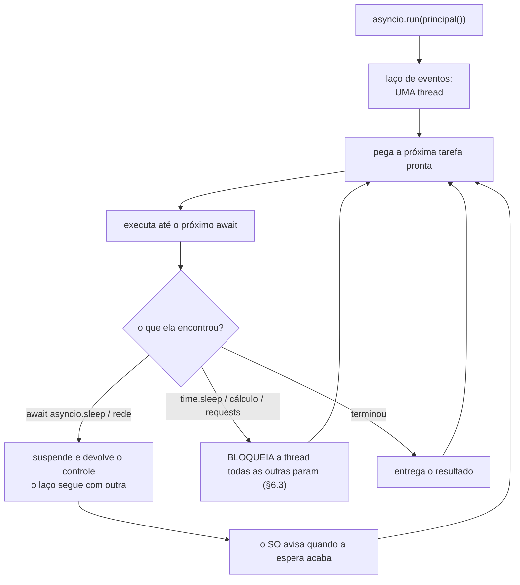

# 04.22 — Asyncio: fundamentos

> **Módulo 04 — Python Avançado** · Nível: N2 · Tempo estimado: 3h · Código: `codigo/cap22/`

## 1. Objetivo

- **Explicar** o que o laço de eventos faz, e por que uma thread só atende milhares de esperas.
- **Implementar** corrotinas com `async` e `await`, e disparar várias com `gather`.
- **Prever** o efeito de uma chamada bloqueante dentro de uma corrotina.
- **Decidir** entre asyncio e threads a partir do custo por espera, e não por preferência.

Ao final, você escreve código que espera dez mil coisas ao mesmo tempo, numa thread só.

---

## 2. Pré-requisitos

- [04.21 — Concorrência](21-concorrencia-threads-processos-gil.md) — a distinção espera × conta continua valendo, e asyncio só serve para o primeiro.
- [04.06 — Geradores](06-geradores-e-yield.md) — `await` é parente do `yield`: os dois devolvem o controle e voltam de onde pararam.
- [04.20 — Context managers](20-context-managers.md) — `async with` usa `__aenter__` e `__aexit__`, o mesmo protocolo com outro nome.

**Autoteste:** (1) Por que threads não ajudam em cálculo? (2) O que acontece com o código depois do `yield` quando ninguém consome o gerador? (3) O que o `__exit__` recebe?

---

## 3. Motivação

Threads resolvem espera, e o 04.21 mediu: 3,99× em quatro esperas. O problema aparece na escala.

Dez mil esperas de meio segundo, com dez mil threads:

```
threads:      3410 ms · +43,2 MB
```

**Funciona.** E custa 3,4 segundos para esperar meio segundo, mais 43 MB — porque cada thread é uma thread do sistema operacional, com pilha própria, criação, agendamento e destruição.

As mesmas dez mil esperas, com corrotinas:

```
corrotinas:    747 ms · +16,9 MB
```

**4,6× mais rápido e 2,5× menos memória** — e o custo continua caindo à medida que a escala sobe, porque não há thread nenhuma sendo criada.

Mas o motivo de aprender asyncio não é a memória. É este:

```python
resultados = [await buscar(url) for url in urls]          # 902 ms
resultados = await asyncio.gather(*[buscar(u) for u in urls])   # 301 ms
```

**As duas linhas usam `await`, devolvem a mesma coisa, e uma é três vezes mais lenta.** Este capítulo é sobre entender por quê — porque escrever a primeira achando que se está escrevendo a segunda é o erro mais comum de quem começa com asyncio.

---

## 4. Modelo mental

**Um garçom só, atendendo dez mesas.**

Ele anota o pedido da mesa 1 e vai para a 2 — não fica parado esperando a cozinha. Quando um prato fica pronto, ele o entrega e continua. Uma pessoa atende dez mesas porque **quase todo o tempo é espera**, e espera não ocupa ninguém.

```
    threads                      asyncio
    ───────                      ───────
    um garçom por mesa           UM garçom, dez mesas
    o sistema decide as trocas   VOCÊ decide, no `await`
    ~11 KB por espera            ~1,7 KB por espera
```

- **Corrotina** — uma função que pode **pausar**. `async def` a declara.
- **`await`** — o ponto onde ela pausa e devolve o controle. É o garçom saindo da mesa.
- **Laço de eventos** — quem decide qual corrotina continua. Uma thread, uma fila.

**A frase que organiza o capítulo: o controle só troca no `await`.** Entre dois `await`, a sua corrotina roda sozinha, sem interrupção — o que elimina as condições de corrida do 04.21 e cria um problema novo: **uma corrotina que não faz `await` nunca solta o garçom**, e trava as outras dez.

Por isso o `await` é obrigatório e visível: ele marca, no código, exatamente onde a troca pode acontecer.

---

## 5. Analogia

Já está na §4, e vale insistir no que ela explica de melhor.

O garçom não é mais rápido que os outros. Ele atende dez mesas porque **descobriu que ficar parado esperando a cozinha era desperdício** — a mesma quantidade de trabalho, redistribuída no tempo.

**E a analogia acerta em dois limites que a §6 mede.** Se o garçom decidir **lavar a louça** no meio do salão (uma conta pesada, ou uma chamada bloqueante), as dez mesas esperam — não há outro garçom para cobrir. E se a cozinha só dá conta de três pratos por vez, atender trinta mesas não adianta: o gargalo mudou de lugar, e é o mesmo limite do `max_workers` do 04.21.

---

## 6. Teoria

### 6.1 Chamar uma corrotina não a executa

```python
async def saudacao() -> int:
    print("(o corpo rodou)")
    return 42

objeto = saudacao()
```

```
saudacao() devolveu: coroutine
o corpo NÃO rodou — nada foi impresso acima
ao descartá-la: RuntimeWarning - coroutine 'saudacao' was never awaited
```

**`async def` devolve um plano, não um resultado.** Chamar a função cria um objeto corrotina e não executa uma linha do corpo — exatamente como chamar uma função geradora do 04.06 devolve um gerador sem rodar nada.

Quem executa é o laço de eventos, e ele entra em cena por `asyncio.run`:

```python
asyncio.run(saudacao())      # 42
```

**O `RuntimeWarning` é o seu amigo.** Ele aparece quando uma corrotina é descartada sem nunca ter sido aguardada — e é o sintoma de um `await` esquecido, que de outro modo produziria um programa que "não faz nada" sem erro nenhum.

### 6.2 `await` em sequência não é concorrência

```python
[await esperar("a", 0.3), await esperar("b", 0.3), await esperar("c", 0.3)]
await asyncio.gather(esperar("a", 0.3), esperar("b", 0.3), esperar("c", 0.3))
```

```
await um após o outro: ['a', 'b', 'c'] ·  902 ms
asyncio.gather:        ['a', 'b', 'c'] ·  301 ms
```

**Mesmos resultados, três vezes de diferença.** E a causa está no significado da palavra: **`await` quer dizer "espere aqui"**. Ele devolve o controle ao laço, sim — mas a linha seguinte só roda quando *aquela* espera terminar.

`gather` é o que dispara tudo junto e espera o conjunto. A regra que evita o erro:

- Um `await` por vez → você quer **o resultado antes de continuar**.
- `gather` → você quer **todas ao mesmo tempo**.

Escrever `[await f(x) for x in itens]` é sequencial e parece concorrente. É o defeito de desempenho mais comum em código asyncio, e ele não gera erro nenhum.

### 6.3 Uma chamada bloqueante trava tudo

```python
async def errada(segundos):
    time.sleep(segundos)          # BLOQUEANTE
```

```
3 × asyncio.sleep(0.3):           301 ms
3 × time.sleep(0.3):              902 ms  <- SOMOU
3 × asyncio.to_thread(sleep):     318 ms
```

**Há uma thread.** `time.sleep` a bloqueia, e o laço de eventos não roda — as outras corrotinas ficam paradas, mesmo estando prontas. O `gather` continua ali, e não tem o que fazer.

**Vale para tudo o que bloqueia**, não só para o `sleep`: `requests.get`, `open().read()`, uma consulta de banco com driver comum, um cálculo pesado. Toda biblioteca síncrona é um `time.sleep` disfarçado.

Duas saídas:

- **Uma biblioteca assíncrona.** `httpx` ou `aiohttp` no lugar de `requests`, `asyncpg` no lugar de `psycopg2` síncrono.
- **`asyncio.to_thread`**, que joga a chamada bloqueante para uma thread e a aguarda sem travar o laço — 318 ms na tabela, quase igual à versão nativa.

**A regra de bolso:** se você importou uma biblioteca e não escreveu `await` na chamada dela, ela provavelmente bloqueia.

### 6.4 `create_task` agenda; o laço executa

```python
primeira = asyncio.create_task(anunciar("A", 0.2))
segunda = asyncio.create_task(anunciar("B", 0.1))
print("tasks criadas — nada rodou ainda")
await asyncio.sleep(0)
```

```
criando as tasks…
tasks criadas — repare que nada rodou ainda
   A começou
   B começou
…e o primeiro `await` deu a vez ao laço
   B terminou
   A terminou
```

**As tarefas só começaram quando a corrotina atual fez `await`.** `create_task` põe na fila; o laço só ganha a vez quando você a entrega — e `await asyncio.sleep(0)` é justamente a forma de entregar sem esperar nada.

Isso torna o comportamento **previsível**, e é a diferença central para threads: no 04.21, a troca podia acontecer entre duas instruções quaisquer; aqui, só nos pontos que você escreveu.

**E há um perigo do outro lado:** uma tarefa criada e nunca aguardada é uma tarefa que pode ser **destruída no meio**, quando o laço termina. Guarde a referência e aguarde-a — ou, melhor, use `gather`, que aguarda por construção.

### 6.5 Exceções no `gather`

```
padrão:                 levantou: item 2 ruim
return_exceptions=True: ['1', ValueError('item 2 ruim'), '3']
```

**No comportamento padrão, a primeira exceção aborta o `gather`** — e os resultados das outras corrotinas **somem**, inclusive os que deram certo. Você recebe a exceção e perde os dois valores válidos.

`return_exceptions=True` muda isso: cada posição traz o resultado **ou** a exceção, e você decide o que fazer com cada uma.

**O critério:** processamento em lote, em que um item ruim não deve derrubar os outros, quer `return_exceptions=True` e um laço que separa sucessos de falhas. Uma sequência em que qualquer falha invalida o conjunto quer o padrão.

E note que, no padrão, as outras corrotinas **não são canceladas** automaticamente — elas continuam rodando em segundo plano até o laço terminar, o que é uma fonte comum de surpresas.

### 6.6 O que asyncio **não** resolve

**Cálculo.** O laço é uma thread; uma conta pesada dentro de uma corrotina trava tudo, exatamente como o `time.sleep` da §6.3. Para conta, a resposta continua sendo processos (04.21) — ou `asyncio.to_thread`, que só ajuda se a biblioteca soltar o GIL.

**Bibliotecas síncronas.** Não há como "tornar assíncrono" um `requests.get`; ou você troca a biblioteca, ou o joga numa thread.

**O limite do outro lado.** Dez mil requisições simultâneas contra uma API que aceita cinco por segundo produzem dez mil erros mais rápido. O `asyncio.Semaphore` é o equivalente ao `max_workers` do 04.21, e é o assunto do próximo capítulo.

**E asyncio contamina.** Uma função `async` só pode ser aguardada por outra função `async`, e a raiz da árvore precisa ser `asyncio.run`. Chamar código assíncrono de dentro de código síncrono comum não funciona — o que faz a decisão de adotar asyncio ser arquitetural, e não local.

### 6.7 Asyncio ou threads?

| | threads | asyncio |
|---|---|---|
| Custo por espera | ~11 KB (04.21) | **~1,7 KB** |
| 10 mil esperas de 0,5 s | 3410 ms | **747 ms** |
| Onde o controle troca | em qualquer lugar | **só no `await`** |
| Condições de corrida | sim (04.21) | quase não |
| Biblioteca síncrona | funciona | **trava tudo** |
| Adoção | local | contamina a árvore de chamadas |

**A regra prática:** dezenas de esperas, com bibliotecas que você já usa → **threads**. Milhares de esperas, ou um projeto que já é assíncrono (FastAPI, do módulo 06) → **asyncio**.

E a linha das corridas merece atenção: como o controle só troca no `await`, um trecho **sem** `await` é atômico — o problema do 04.21 quase desaparece. "Quase", porque um trecho **com** `await` no meio volta a ter o mesmo risco, e a `asyncio.Lock` existe para isso.

---

## 7. Funcionamento interno

O laço de eventos é um laço `while` com uma fila de tarefas prontas e uma lista de coisas sendo aguardadas do sistema operacional.

1. Pega a próxima tarefa pronta e a executa **até o próximo `await`**.
2. No `await`, a corrotina devolve o controle, dizendo o que está esperando.
3. O laço pergunta ao sistema operacional quais esperas terminaram (`select`, `epoll`, `kqueue`) e marca as tarefas correspondentes como prontas.
4. Volta ao passo 1.

**É cooperativo:** o laço não pode interromper uma corrotina; ele espera que ela devolva o controle. Daí toda a §6.3.

E a conexão com o 04.06 é literal — corrotinas são construídas sobre a mesma maquinaria dos geradores. `await` compila para algo muito próximo de `yield from`: suspender, guardar o estado, devolver o controle, retomar do mesmo ponto. A diferença é quem retoma: no gerador, quem chama `next()`; na corrotina, o laço de eventos.

Isso também explica o custo de 1,7 KB por espera: uma corrotina suspensa é um objeto Python com o estado do quadro, e não uma pilha de sistema operacional.

---

## 8. Visualização do fluxo



**Como ler:** o losango do meio é a única decisão que importa, e os dois primeiros ramos são a diferença entre o programa funcionar e o programa parecer funcionar. O ramo do meio — o bloqueio — **não gera erro**: as tarefas continuam corretas e o tempo total vira a soma, como a tabela da §6.3 mostrou.

---

## 9. Aplicação prática

**O coletor da Aurora**, agora assíncrono. Trezentos produtos, ~200 ms de espera cada:

```python
async def buscar_preco(cliente: httpx.AsyncClient, sku: str) -> int:
    resposta = await cliente.get(f"/precos/{sku}")
    return resposta.json()["preco_centavos"]


async def coletar(skus: list[str]) -> list[int]:
    async with httpx.AsyncClient(base_url=BASE) as cliente:
        return list(await asyncio.gather(
            *[buscar_preco(cliente, sku) for sku in skus]))
```

**Três detalhes decidem se isso funciona.**

O `async with` é o gerenciador do 04.20 na versão assíncrona (`__aenter__`/`__aexit__`), e o cliente é criado **uma vez** e reaproveitado — criar um por requisição refaz a conexão trezentas vezes.

O `gather` recebe as trezentas corrotinas de uma vez. Trocá-lo por um laço com `await` dentro seria o erro da §6.2, e o tempo passaria de 200 ms para um minuto.

E `httpx.AsyncClient` no lugar de `requests` não é preferência: `requests` bloquearia o laço, e o resultado seria o mesmo minuto (§6.3).

**Comparando com a versão de threads do 04.21:** as duas resolvem trezentas requisições em poucos segundos. A de threads reaproveita `buscar_preco` como função comum e cabe em três linhas de mudança; a assíncrona exige trocar a biblioteca HTTP e marcar a árvore inteira com `async`.

**Para trezentos itens, threads são a escolha pragmática.** Para trinta mil, ou dentro de um serviço que já é assíncrono, a conta inverte — e é aí que o próximo capítulo continua.

---

## 10. Código comentado

Em [`codigo/cap22/corrotinas.py`](codigo/cap22/corrotinas.py), seis cenas: a corrotina que não executa; `await` em sequência contra `gather`; o `time.sleep` que trava o laço, com `to_thread` ao lado; `create_task` e o momento em que a tarefa começa; exceções no `gather`; e as dez mil esperas medidas nas duas formas.

```bash
python codigo/cap22/corrotinas.py
mypy --strict codigo/cap22/corrotinas.py
```

A cena 6 leva alguns segundos e cria dez mil threads de verdade — é a comparação da §3, e vale ver os números da sua máquina.

---

## 11. Erros comuns

| Erro | Sintoma | Correção |
|---|---|---|
| Chamar sem `await` | `RuntimeWarning: never awaited`, e o corpo não roda | `await`, ou `asyncio.run` na raiz |
| `[await f(x) for x in itens]` | Sequencial, e parece concorrente — 3× mais lento | `await asyncio.gather(*[f(x) for x in itens])` |
| `time.sleep` numa corrotina | Os tempos **somam** e nada dá erro | `await asyncio.sleep`, ou `asyncio.to_thread` |
| `requests` dentro de `async def` | O mesmo, e mais difícil de notar | `httpx.AsyncClient`, ou `to_thread` |
| Cálculo pesado numa corrotina | Trava o laço inteiro | Processos (04.21) |
| `create_task` sem guardar a referência | A tarefa pode ser destruída no meio | Guarde e aguarde, ou use `gather` |
| `gather` sem `return_exceptions` num lote | Um item ruim apaga os resultados bons | `return_exceptions=True` e separe |
| Milhares de requisições sem limite | Erros do outro lado, não velocidade | `asyncio.Semaphore` (04.23) |
| Chamar `async` de código síncrono | `RuntimeWarning`, ou nada acontece | A árvore inteira é `async`, com `asyncio.run` na raiz |

---

## 12. Boas práticas

- **`gather` para disparar junto; `await` só quando precisar do resultado agora.**
- **Nada bloqueante dentro de corrotina.** Na dúvida, `asyncio.to_thread`.
- **Um cliente HTTP para todas as requisições**, criado com `async with`.
- **`return_exceptions=True` em lote**, com separação explícita de sucessos e falhas.
- **Guarde a referência das tarefas** que criar com `create_task`.
- **Limite a concorrência** com `Semaphore` — o teto é o do outro lado (04.23).
- **`asyncio.run` uma vez, na raiz.** Nada de criar laços à mão.
- **Não misture asyncio e threads sem necessidade.** Quando precisar, `to_thread` e `run_coroutine_threadsafe` são as pontes.

---

## 13. Performance

Todas as medições numa máquina de dois núcleos, Python 3.10:

| 3 esperas de 0,3 s | Tempo |
|---|---|
| `await` um após o outro | 902 ms |
| `asyncio.gather` | **301 ms** |
| `gather` com `time.sleep` dentro | 902 ms |
| `gather` com `asyncio.to_thread` | 318 ms |

| 10 mil esperas de 0,5 s | Tempo | Memória |
|---|---|---|
| corrotinas | **747 ms** | +16,9 MB |
| threads | 3410 ms | +43,2 MB |

**Três leituras.**

A primeira tabela tem **duas** linhas de 902 ms, por motivos diferentes: uma porque o código pediu para esperar em sequência, outra porque uma chamada bloqueante travou o laço. Do lado de fora são indistinguíveis — o programa está correto e lento nos dois casos, sem nenhum erro.

Os 10 mil em 747 ms significam ~1,7 KB e ~0,07 ms por espera. Contra ~11 KB e ~0,34 ms por thread (04.21), a diferença é de **6×** em memória e **4,6×** em tempo — e ela cresce com a escala, porque criar threads fica mais caro à medida que o sistema operacional se aproxima dos próprios limites.

**E a leitura que evita a conclusão errada:** as dez mil threads **funcionaram**. Asyncio não é a diferença entre possível e impossível; é a diferença entre caro e barato. Em dezenas ou centenas de esperas, threads continuam sendo a resposta simples.

---

## 14. Mercado

`asyncio` entrou na biblioteca padrão no Python 3.4, e `async`/`await` como sintaxe no 3.5 (2015). Antes disso o ecossistema usava Twisted e gevent, que resolviam o mesmo problema com outras abordagens.

Onde ele domina hoje: **frameworks web** (FastAPI, Starlette, aiohttp — o módulo 06 usa o primeiro), **clientes HTTP** de alta concorrência (httpx, aiohttp), **filas e mensageria**, **bots** e qualquer coisa que mantenha muitas conexões abertas ao mesmo tempo — WebSockets é o caso claro, em que cada usuário conectado é uma espera permanente.

O custo de adoção é real e vale saber antes: **asyncio contamina a árvore de chamadas**, e um projeto síncrono não vira assíncrono por partes. Além disso, cada biblioteca precisa de uma versão assíncrona — e algumas não têm.

A alternativa moderna é **AnyIO** (usada pelo Starlette), que oferece uma API mais segura sobre asyncio e sobre o Trio, com o conceito de *grupos de tarefas* que resolve o problema das tarefas órfãs da §6.4. O Python 3.11 trouxe `asyncio.TaskGroup` com a mesma ideia.

Em entrevista, a pergunta que separa é "asyncio ou threads?", e a boa resposta usa a distinção do 04.21 (espera × conta) mais o custo por espera — e menciona que asyncio não ajuda em nada com cálculo.

---

## 15. Entrevistas

- **"O que `async def` devolve?"** Uma **corrotina**, não um resultado — o corpo não roda. Quem executa é o laço, via `asyncio.run` ou `await`. Descartá-la sem aguardar gera `RuntimeWarning: never awaited`.
- **"Qual a diferença entre `await` em sequência e `gather`?"** `await` significa "espere aqui": a linha seguinte só roda quando aquela espera acabar. `gather` dispara tudo junto. Medido: 902 ms contra 301 ms, com resultados idênticos.
- **"O que acontece com um `time.sleep` dentro de uma corrotina?"** Ele **bloqueia a thread**, e o laço inteiro para — as outras corrotinas ficam paradas mesmo estando prontas. Vale para toda biblioteca síncrona. Saídas: versão assíncrona da biblioteca, ou `asyncio.to_thread`.
- **"Asyncio ou threads?"** Custo por espera. Medido: 10 mil esperas em 747 ms e 16,9 MB com corrotinas, contra 3410 ms e 43,2 MB com threads. Para dezenas, threads; para milhares, ou num projeto já assíncrono, asyncio.
- **"Asyncio ajuda em cálculo?"** Não. É uma thread só — uma conta pesada trava tudo, como qualquer bloqueio. Para cálculo, processos.

---

## 16. Exercícios guiados

Em [`exercicios/cap22.md`](exercicios/cap22.md):

- **A1** `[~10 min · roda ou não?]` — 8 trechos.
- **A2** `[~12 min · prevê o tempo]` — 6 combinações.
- **A3** `[~12 min · ache o erro]` — 6 corrotinas defeituosas.
- **A4** `[~10 min · asyncio, threads ou processos?]` — 6 situações.
- **AP1** `[~20 min · o gather]` — Converta um laço sequencial.
- **AP2** `[~25 min · o bloqueio]` — Encontre e conserte a chamada que trava.
- **AP3** `[~20 min · exceções em lote]` — Separe sucessos de falhas.
- **D1** `[~50 min · o coletor assíncrono]` — **300 esperas, com limite e relatório.**

---

## 17. Desafios

**D1 — O coletor assíncrono.** Reescreva o coletor do 04.21 em asyncio, com controle de concorrência.

Requisitos: 300 itens com espera simulada de ~200 ms; `asyncio.Semaphore` limitando a concorrência a um valor configurável; `return_exceptions=True` com separação de sucessos e falhas; log estruturado (04.19) por item e um resumo no fim; tempo medido por etapa; e `mypy --strict` limpo.

**A prova:** rode com o semáforo valendo 1, 10, 50 e 300, e faça a tabela.

**As três perguntas que valem a nota:** (1) Compare a sua tabela com a do 04.21/AP2, feita com threads. Os tetos são iguais? (2) Introduza um `time.sleep(0.1)` em uma das corrotinas e meça de novo — o que acontece com as **outras** 299? (3) Se uma das corrotinas levantar exceção com `return_exceptions=False`, o que acontece com as que ainda estavam rodando?

---

## 18. Mini projeto

**O detector de bloqueio.** Uma ferramenta que descubra se o laço de eventos está sendo travado — e por quem.

Requisitos: uma corrotina "vigia" que acorde a cada 50 ms e meça o **atraso** em relação ao esperado; registro de todo atraso acima de um limite, com a duração; um relatório final com o pior atraso e quantas vezes o limite foi ultrapassado; e uma demonstração com três casos — código sem bloqueio, com `time.sleep(0.5)` e com um cálculo pesado.

O vigia usa só a biblioteca padrão, e o cálculo do atraso é a parte que ensina: ele compara o tempo que **deveria** ter passado com o que passou de fato.

**E a pergunta que fecha:** o seu vigia detecta o bloqueio **depois** que ele termina, nunca durante. Por quê — e o que isso diz sobre a possibilidade de um programa asyncio se defender sozinho de uma corrotina mal-comportada?

---

## 19. Revisão

**Resumo em 5 frases.** Asyncio é **um garçom só atendendo dez mesas**: uma thread, um laço de eventos, e corrotinas que devolvem o controle quando não têm o que fazer — e a frase que organiza tudo é que **o controle só troca no `await`**, o que elimina quase todas as corridas do 04.21 e cria um problema novo. `async def` devolve **um plano, não um resultado**: chamar a função não roda nada, e descartá-la sem aguardar produz `RuntimeWarning: never awaited` — o sintoma de um `await` esquecido, que de outro modo faria o programa não fazer nada, sem erro. O erro mais comum de quem começa é confundir `await` com concorrência: `[await f(x) for x in itens]` é **sequencial** e parece concorrente — 902 ms contra 301 ms do `gather`, com resultados idênticos e nenhum aviso. E o segundo erro mais comum tem exatamente o mesmo sintoma por outro motivo: uma chamada **bloqueante** dentro de uma corrotina (`time.sleep`, `requests`, cálculo pesado) trava o laço inteiro, e as outras corrotinas param mesmo estando prontas — 902 ms de novo, indistinguível do primeiro caso do lado de fora. A escolha entre asyncio e threads é de **custo por espera**, não de gosto: 10 mil esperas custaram 747 ms e 16,9 MB em corrotinas contra 3410 ms e 43,2 MB em threads — e as threads **funcionaram**, porque a diferença é entre caro e barato, e não entre possível e impossível.

**Flashcards** (também em [`revisao/flashcards.md`](revisao/flashcards.md)):

| ID | Frente | Verso |
|---|---|---|
| 04.22-F1 | O que `async def` devolve quando você o chama? | Uma **corrotina** — um plano, não um resultado. O corpo **não roda**. Quem executa é o laço de eventos, via `asyncio.run` na raiz ou `await` dentro de outra corrotina. Descartá-la sem aguardar dá `RuntimeWarning: coroutine was never awaited`. |
| 04.22-F2 | Explique com suas palavras por que `[await f(x) for x in itens]` é sequencial. | (Elaboração) Porque **`await` significa "espere aqui"**: ele devolve o controle ao laço, e a linha seguinte só roda quando aquela espera terminar. `gather` é o que dispara tudo junto. Medido: 902 ms contra 301 ms, resultados idênticos e nenhum aviso. |
| 04.22-F3 | Preveja: `time.sleep(0.3)` em três corrotinas dentro de um `gather`. | (Previsão) **902 ms — os tempos somam.** Há uma thread só, e `time.sleep` não devolve o controle: o laço para, e as outras corrotinas ficam paradas mesmo prontas. Vale para toda biblioteca síncrona. `asyncio.to_thread` resolve (318 ms). |
| 04.22-F4 | Asyncio ou threads? | (Decisão) **Custo por espera.** 10 mil esperas de 0,5 s: **747 ms e +16,9 MB** em corrotinas contra **3410 ms e +43,2 MB** em threads. Dezenas de esperas com bibliotecas que você já usa → threads. Milhares, ou projeto já assíncrono → asyncio. E as threads funcionaram: é caro × barato, não possível × impossível. |
| 04.22-F5 | O que acontece com um `gather` quando uma corrotina falha? | No padrão, a **primeira exceção aborta** e os resultados das outras **somem** — inclusive os que deram certo; e elas não são canceladas, continuam rodando. `return_exceptions=True` devolve resultado **ou** exceção em cada posição, que é o que se quer em processamento de lote. |

**Revisão espaçada:** D+1 refaça A2 e A3 · D+7 o AP2 (achar a chamada que bloqueia) · D+30 escreva de memória um coletor com `gather` e `Semaphore`, e explique cada `await`.

---

## 20. Checklist

- [ ] Chamei uma corrotina sem `await` e vi o `RuntimeWarning`.
- [ ] Comparei `await` em sequência com `gather` e vi os 3×.
- [ ] Pus um `time.sleep` numa corrotina e vi os tempos somarem.
- [ ] Consertei com `asyncio.to_thread`.
- [ ] Vi que `create_task` não roda nada até o próximo `await`.
- [ ] Perdi resultados bons num `gather` que falhou.
- [ ] Usei `return_exceptions=True` e separei sucessos de falhas.
- [ ] Medi 10 mil esperas nas duas formas.
- [ ] Sei por que asyncio não ajuda em cálculo.
- [ ] Sei o que significa "asyncio contamina a árvore de chamadas".

---

## 21. Próximo capítulo

[04.23 — Asyncio na prática e mini projeto](23-asyncio-na-pratica-e-projeto.md). Os fundamentos estão de pé, e faltam as peças que todo coletor real precisa: **limitar** a concorrência com `Semaphore` (porque o teto é do outro lado), **cancelar** o que passou do tempo, **repetir** o que falhou por motivo temporário, e **agrupar** tarefas de forma que nenhuma fique órfã. O capítulo fecha o módulo 04 com o coletor completo da Aurora — e com a refatoração do Atlas para POO, juntando o que os vinte e dois capítulos anteriores construíram.
