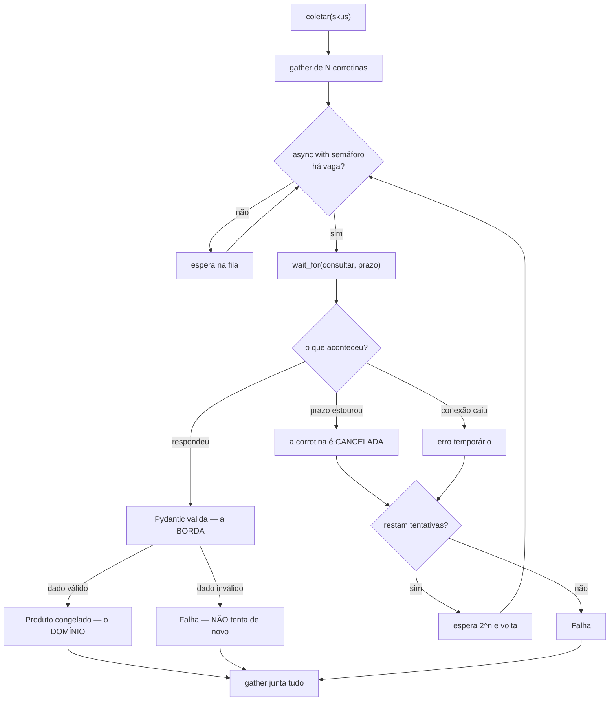

# 04.23 — Asyncio na prática e projeto integrador

> **Módulo 04 — Python Avançado** · Nível: N3 · Tempo estimado: 4h · Código: `codigo/cap23/`

## 1. Objetivo

- **Limitar** a concorrência com `Semaphore`, e explicar por que o teto não é seu.
- **Impor prazo** e **repetir** o que falhou, distinguindo erro temporário de permanente.
- **Reconhecer** por que `CancelledError` não é `Exception`, e o que acontece ao engoli-la.
- **Construir** o coletor completo da Aurora, juntando os vinte e dois capítulos anteriores.

Ao final, você tem um programa concorrente que sobrevive a uma fonte lenta, instável e com limite.

---

## 2. Pré-requisitos

- [04.22 — Asyncio: fundamentos](22-asyncio-fundamentos.md) — `gather`, o laço, e o que trava o laço.
- [04.21 — Concorrência](21-concorrencia-threads-processos-gil.md) — o teto do ganho em espera é o número de tarefas, e o teto real é o do outro lado.
- [04.15 — Pydantic](15-pydantic.md) e [04.13 — Dataclasses](13-dataclasses.md) — a fronteira do D-024, que aqui vira duas pastas de arquivos.

**Autoteste:** (1) Por que `[await f(x) for x in itens]` é sequencial? (2) O que acontece com as outras corrotinas quando uma bloqueia? (3) Onde termina a borda e começa o domínio?

---

## 3. Motivação

O coletor do 04.22 funciona no laboratório e falha no primeiro dia de uso real, por três motivos que o `gather` sozinho não resolve.

**A fonte tem limite.** Trezentas requisições simultâneas contra uma API que aceita dez produzem `429 Too Many Requests` — e a coleta fica mais lenta do que se você tivesse enviado dez por vez, além de arriscar o bloqueio do seu endereço.

**A fonte às vezes não responde.** Uma requisição que fica pendurada trava aquela corrotina para sempre, e o `gather` espera por ela indefinidamente. O programa não trava nem dá erro: ele **nunca termina**.

**A fonte às vezes falha por engano.** Uma falha de rede momentânea derruba um item que teria funcionado na segunda tentativa — e num lote de trezentos, isso significa perder dezenas de itens bons por nada.

As três têm resposta, e as três estão numa linha do projeto deste capítulo:

```
limite=1    8179 ms
limite=5    1741 ms
limite=20    519 ms
limite=40    297 ms
```

Este capítulo é sobre transformar o `gather` do capítulo anterior num coletor que aguenta a vida real — e sobre montar, com ele, o projeto que fecha o módulo.

---

## 4. Modelo mental

Um coletor de verdade tem **quatro perguntas**, e cada uma tem uma ferramenta.

```
    quantas ao mesmo tempo?   →  Semaphore      (o teto é do OUTRO lado)
    até quando esperar?       →  wait_for       (e ele CANCELA)
    e quando falhar?          →  nova tentativa (se o erro for temporário)
    como juntar o resultado?  →  gather         (sem perder os bons)
```

**A frase que organiza o capítulo: você não controla a fonte.** Ela é lenta, tem limite, cai às vezes e às vezes mente. Todo o desenho decorre disso — e é a diferença entre um script que funciona na sua máquina e um programa que roda todo dia.

E há uma quinta pergunta, que só aparece quando algo dá errado: **quem cancela quem?** Uma tarefa cancelada precisa poder ser cancelada — e o §6.4 mostra o código, muito comum, que impede isso sem querer.

---

## 5. Analogia

Uma **fila de atendimento com senha**.

O `Semaphore` é o número de guichês: só entram tantos quantos couberem, e os outros esperam a vez. O prazo é o tempo máximo que alguém fica no guichê antes de ser dispensado — sem ele, uma pessoa complicada trava o guichê o dia inteiro. A nova tentativa é mandar de volta para o fim da fila quem foi dispensado por um problema do sistema, e não por trazer o documento errado.

**E a analogia acerta no que decide o número de guichês:** ele não depende de quantas pessoas há na fila. Depende de quantos atendentes o **outro lado** tem. Abrir cinquenta guichês para um serviço que atende cinco é criar cinquenta filas paradas.

---

## 6. Teoria

### 6.1 `Semaphore` — o teto é do outro lado

```python
self._semaforo = asyncio.Semaphore(limite)

async def coletar_um(self, sku: str) -> Produto | Falha:
    async with self._semaforo:
        ...
```

O semáforo é um contador: `async with` decrementa, e a corrotina espera se o contador chegou a zero. Cem tarefas com limite de vinte fazem no máximo vinte consultas ao mesmo tempo — o que se confirma medindo o pico real:

```
limite=1    pico real=1     5036 ms
limite=5    pico real=5     1009 ms
limite=20   pico real=20     253 ms
limite=100  pico real=100     53 ms
```

**O pico bate exatamente com o limite**, e é isso que o torna uma garantia e não uma sugestão.

**Como escolher o número.** Não pelo tamanho do lote nem pelo número de núcleos (04.21). O critério é o **limite do serviço**: o que a documentação da API diz, o número de conexões do banco, a fila do disco. Na ausência de informação, comece em 5 ou 10 e suba medindo — e trate um aumento de erros como sinal de que passou do ponto.

E note que ele é um objeto do **laço**, não da classe: criar o semáforo fora de uma corrotina, em versões antigas, o prendia ao laço errado. Criá-lo no `__init__` de um objeto que só será usado dentro de `asyncio.run` é seguro.

### 6.2 Prazo — e ele cancela

```python
bruto = await asyncio.wait_for(self.fonte.consultar(sku), timeout=self.prazo_s)
```

```
tarefa de 0,1 s, limite 0,3 s -> pronto     100 ms
tarefa de 0,5 s, limite 0,2 s -> TIMEOUT    201 ms
```

`wait_for` levanta `asyncio.TimeoutError` quando o prazo estoura — e faz mais do que isso: **cancela a corrotina interna**. A prova é observar se ela chega ao fim:

```
terminou depois do timeout? []      <- lista vazia: foi cancelada
```

**Isso é o que se quer**, e é o oposto do que acontece num `gather` que falha (04.22/§6.5), em que as irmãs continuam rodando. Aqui, o prazo estourado encerra o trabalho em vez de deixá-lo pendurado.

**Todo `await` externo precisa de prazo.** Uma requisição sem tempo limite é a forma mais comum de um programa "travar" sem erro nenhum — e o mais difícil de diagnosticar, porque não há exceção, não há log, não há nada.

No Python 3.11 e seguintes há uma forma mais limpa, `async with asyncio.timeout(1.0):`, que cobre um bloco inteiro em vez de uma chamada.

### 6.3 Nova tentativa — e quais erros a merecem

```python
for numero in range(1, self.tentativas + 1):
    try:
        return await self._uma_tentativa(sku)
    except TEMPORARIOS:
        if numero < self.tentativas:
            await asyncio.sleep(self.espera_base_s * 2 ** (numero - 1))
```

```
0 falhas -> ok na tentativa 1 ·   10 ms
2 falhas -> ok na tentativa 3 ·  182 ms
5 falhas -> desistiu após 4 tentativas · 392 ms
```

**A espera dobra a cada tentativa** — 50 ms, 100 ms, 200 ms. O motivo não é técnico, é social: quando um serviço está sobrecarregado, repetir imediatamente piora a sobrecarga. A espera crescente dá a ele tempo de se recuperar, e é a diferença entre ajudar e atrapalhar.

**E a decisão que mais importa é qual erro merece nova tentativa:**

```python
TEMPORARIOS = (ConnectionError, TimeoutError, asyncio.TimeoutError)
```

Erro de **conexão** e de **prazo** são temporários por natureza: a próxima tentativa pode dar certo. Um `ValidationError` (04.15) **não** é: o dado veio errado e virá errado de novo, e repetir é desperdiçar três vezes o tempo para chegar ao mesmo lugar.

```python
except ValidationError as erro:
    return Falha(sku=sku, motivo="dado inválido: …", tentativas=numero)
```

**A regra: repita o que é do canal, não o que é do conteúdo.**

Em produção, três refinamentos aparecem: um **desvio aleatório** na espera (para mil clientes não voltarem todos no mesmo instante), um **teto** para a espera, e o **disjuntor** (*circuit breaker*) — parar de tentar quando a taxa de falha indica que o serviço caiu de vez.

### 6.4 Cancelamento — e o `except` que o quebra

```python
print(asyncio.CancelledError.__mro__[1].__name__)     # BaseException
print(issubclass(asyncio.CancelledError, Exception))  # False
```

**`CancelledError` não é `Exception`.** Desde o Python 3.8 ela herda de `BaseException`, e a consequência é uma proteção que salva quase todo mundo:

```python
try:
    await asyncio.sleep(10)
except Exception:
    print("peguei")          # NÃO é executado num cancelamento
finally:
    print("finally rodou")   # é
```

Um `except Exception` comum **não captura** o cancelamento, então o `try/except` que você escreveu para tratar erros de rede não impede que a sua tarefa seja cancelada. O `finally` continua rodando, que é o que garante a limpeza.

**Mas quem captura `BaseException` — ou a própria `CancelledError` — sem relançar quebra o cancelamento:**

```
capturou CancelledError - e não relançou
resultado: terminei apesar do cancelamento
```

A tarefa foi cancelada e **devolveu um valor**. Quem pediu o cancelamento acha que ele aconteceu; a tarefa acha que terminou bem. Num `wait_for`, isso significa que o prazo não é respeitado.

**A regra:** se você capturar `CancelledError` — para registrar, para limpar —, **relance**:

```python
except asyncio.CancelledError:
    log.info("cancelada", extra={"sku": sku})
    raise
```

### 6.5 `gather` ou `as_completed`?

```
gather:        ['lento', 'rapido', 'medio']     ← ordem dos ARGUMENTOS
as_completed:  ['rapido', 'medio', 'lento']     ← ordem de CONCLUSÃO
```

`gather` devolve tudo junto, na ordem em que você passou — o que permite `zip(skus, resultados)` sem que cada corrotina precise devolver o próprio identificador.

`as_completed` entrega cada resultado assim que fica pronto. Serve quando **processar cedo importa**: gravar no banco à medida que chega, mostrar progresso, ou parar assim que encontrar o que procurava.

**O critério:** se você precisa de todos antes de continuar, `gather`. Se cada resultado tem valor sozinho, `as_completed`.

### 6.6 O projeto, em camadas

```
src/aurora_coletor/
├── fonte.py       ← o mundo lá fora (lento, instável)
├── esquemas.py    ← a BORDA: Pydantic valida o que chegou     (04.15)
├── modelo.py      ← o DOMÍNIO: dataclasses congeladas         (04.13)
├── coletor.py     ← a concorrência: semáforo, prazo, tentativas
├── tempo.py       ← UTC em tudo                                (04.18)
├── registro.py    ← log estruturado                            (04.19)
└── cli.py         ← o ponto de entrada: configura e sai
```

**A fronteira do D-024 virou duas pastas de arquivos**, e a linha exata em que ela acontece é esta:

```python
validado = ProdutoBruto.model_validate(bruto)      # borda
return Produto(sku=validado.sku, …)                # domínio
```

Antes dessa linha, o dado é `dict[str, Any]` e nada é confiável. Depois dela, é um `Produto` congelado, com tipos garantidos — e o `mypy` volta a ter razão sobre tudo.

**Três decisões visíveis no código.** `Produto` e `Falha` são congelados porque um resultado de coleta não deve mudar depois de colhido. `coletar_um` **nunca levanta** — devolve `Produto` ou `Falha` —, o que faz o `gather` não precisar de `return_exceptions`. E `cli.py` é o único módulo que chama `configurar` e `asyncio.run`.

O resultado, medido:

```
itens:        40
coletados:    40 (100%)
falhas:       0
consultas:    50 (inclui as repetidas)
duração:      1219 ms
```

**As 50 consultas para 40 itens são a nova tentativa funcionando:** dez requisições falharam por motivo temporário e foram refeitas, e nenhum item se perdeu.

### 6.7 Concorrência estruturada

O `gather` tem um problema que o 04.22/§6.5 mediu: quando uma corrotina falha, as outras **continuam rodando** em segundo plano.

O Python 3.11 trouxe a resposta:

```python
async with asyncio.TaskGroup() as grupo:
    for sku in skus:
        grupo.create_task(coletar_um(sku))
```

O bloco **não termina** enquanto houver tarefa viva, e se uma falhar, as irmãs são **canceladas**. Nenhuma tarefa órfã, nenhum trabalho continuando depois de o programa ter desistido.

É a mesma ideia do `with` do 04.20 aplicada a tarefas: **a garantia mora na estrutura**. Em Python 3.10, a biblioteca `anyio` oferece o mesmo conceito, e o projeto deste capítulo o dispensa porque `coletar_um` nunca levanta — cada tarefa trata os próprios erros.

### 6.8 O que fica para depois

O coletor está completo para o que se propõe, e três coisas ficam de fora de propósito:

**Cliente HTTP de verdade.** A fonte é simulada para o projeto rodar sem rede. Trocar `FonteSimulada` por `httpx.AsyncClient` muda um arquivo — e é o exercício natural depois do módulo 06.

**Persistência.** Os resultados são impressos. Gravá-los em banco é o módulo 05, e a estrutura já está pronta: `Produto` é uma dataclass com campos tipados.

**Disjuntor e limite de taxa por janela.** O semáforo limita a **simultaneidade**; ele não limita "dez por segundo". Serviços com limite por janela de tempo exigem outro mecanismo, e o assunto reaparece no módulo 07.

---

## 7. Funcionamento interno

`asyncio.Semaphore` é um contador com uma fila de esperas. `acquire` decrementa se houver espaço, e cria um `Future` na fila se não houver; `release` incrementa e acorda o primeiro da fila. **A ordem é de chegada**, o que garante que ninguém fique esperando para sempre enquanto outros passam na frente.

`wait_for` cria uma tarefa para a corrotina, agenda um alarme no laço e espera os dois. Se o alarme vier primeiro, ele chama `task.cancel()` — e é por isso que a corrotina interna **é** cancelada, e não apenas abandonada. Ele então espera o cancelamento se completar antes de levantar `TimeoutError`, o que dá à tarefa a chance de rodar os `finally`.

O cancelamento em si é uma **exceção injetada**: o laço faz a corrotina, no ponto do `await` em que ela está suspensa, receber uma `CancelledError`. Daí as duas consequências da §6.4 — o `finally` roda normalmente, e capturar sem relançar transforma o cancelamento numa conclusão comum.

---

## 8. Visualização do fluxo



**Como ler:** os dois ramos que saem do losango de validação são a decisão da §6.3 — dado inválido **não** volta para a fila, porque tentar de novo traria o mesmo dado. E note que o caminho de repetição volta ao semáforo: uma nova tentativa disputa vaga como qualquer outra, e não fura a fila.

---

## 9. Aplicação prática

O projeto inteiro está em [`codigo/cap23/coletor/`](codigo/cap23/coletor/), no layout do 04.17:

```bash
cd codigo/cap23/coletor
python -m venv .venv && source .venv/bin/activate
pip install -e ".[dev]"

aurora-coletar --itens 40 --limite 10
pytest
mypy src
```

```
9 passed in 1.72s
Success: no issues found in 8 source files
```

**O experimento que vale fazer é o do `--limite`:**

| `--limite` | Duração |
|---|---|
| 1 | 8179 ms |
| 5 | 1741 ms |
| 20 | 519 ms |
| 40 | 297 ms |

O tempo cai até o número de itens — o teto do 04.21/§6.3, agora no seu próprio programa.

**E os nove testes valem tanto quanto o código**, porque cada um verifica uma decisão de um capítulo diferente: o SKU normalizado pelo validador do 04.15, o `Produto` congelado do 04.13, o carimbo consciente em UTC do 04.18, o pico de concorrência do semáforo, o prazo virando falha, e uma falha não derrubando as outras.

O teste mais interessante é o último, e ele é uma **afirmação sobre desempenho**:

```python
assert relatorio_rapido.duracao_ms < relatorio_lento.duracao_ms / 3
```

Com limite 1 e limite 20 sobre os mesmos vinte itens, a versão concorrente precisa ser pelo menos três vezes mais rápida. **É um teste que falharia se alguém introduzisse uma chamada bloqueante** (04.22/§6.3) — a classe de defeito mais difícil de detectar em asyncio, aqui capturada por uma linha.

---

## 10. Código comentado

[`codigo/cap23/coletor/`](codigo/cap23/coletor/) é o projeto completo: sete módulos, nove testes, `pyproject.toml`, comando de terminal e `LEIAME.md`.

O arquivo a ler primeiro é [`src/aurora_coletor/coletor.py`](codigo/cap23/coletor/src/aurora_coletor/coletor.py), onde as quatro perguntas da §4 aparecem em ordem: o `async with self._semaforo`, o `wait_for`, o laço de tentativas com a espera dobrada, e o `gather` do final.

O segundo é [`src/aurora_coletor/esquemas.py`](codigo/cap23/coletor/src/aurora_coletor/esquemas.py), com quatro linhas de `Field` e três validadores fazendo o trabalho que, sem Pydantic, seriam trinta linhas de `if`.

---

## 11. Erros comuns

| Erro | Sintoma | Correção |
|---|---|---|
| `gather` sem limite | `429`, bloqueio de IP, ou o banco recusando conexões | `Semaphore` com o teto do serviço |
| `await` externo sem prazo | O programa **nunca termina**, sem erro nenhum | `wait_for`, ou `asyncio.timeout` (3.11+) |
| Repetir erro de validação | Três vezes o tempo para o mesmo resultado | Repita só o que é do canal |
| Repetir sem espera crescente | Piora a sobrecarga do serviço que já está mal | `sleep(base * 2 ** n)` |
| `except Exception` esperando pegar cancelamento | Não pega — e ainda bem | `CancelledError` é `BaseException` |
| Capturar `CancelledError` sem relançar | O cancelamento **não acontece**; o prazo é ignorado | `raise` depois de registrar |
| `create_task` sem grupo nem `gather` | Tarefa órfã, cancelada no fim do `run` | `gather`, ou `TaskGroup` (3.11+) |
| Semáforo criado fora do laço | Em versões antigas, prende-se ao laço errado | Crie dentro do objeto usado sob `asyncio.run` |
| Achar que `Semaphore` limita taxa | Ele limita **simultaneidade**, não "por segundo" | Outro mecanismo para limite por janela |

---

## 12. Boas práticas

- **Todo `await` externo com prazo.** Sem exceção.
- **`Semaphore` sempre, com o teto do serviço** — e documente de onde veio o número.
- **Espera crescente entre tentativas**, com teto e desvio aleatório em produção.
- **Repita o que é do canal, não o que é do conteúdo.**
- **`CancelledError` sempre relançada.**
- **A tarefa nunca levanta:** devolva `Resultado | Falha` e deixe o `gather` limpo.
- **Log estruturado com o identificador do item** em toda mensagem (04.19).
- **Um teste que afirma desempenho**, porque ele pega a chamada bloqueante que nenhum outro pega.
- **A fronteira borda/domínio numa linha só**, e visível no layout.

---

## 13. Performance

Projeto rodando, 40 itens, fonte com latência de ~200 ms:

| `--limite` | Duração | Ganho |
|---|---|---|
| 1 | 8179 ms | — |
| 5 | 1741 ms | 4,7× |
| 20 | 519 ms | 15,8× |
| 40 | 297 ms | **27,5×** |

E o semáforo isolado, com 100 tarefas de 50 ms:

| Limite | Pico real | Duração |
|---|---|---|
| 1 | 1 | 5036 ms |
| 5 | 5 | 1009 ms |
| 20 | 20 | 253 ms |
| 100 | 100 | 53 ms |

**Duas leituras.**

O pico medido bate **exatamente** com o limite configurado, em todos os casos. É o que transforma o `Semaphore` numa garantia — e é o que permite prometer a um serviço externo que você não vai passar de dez requisições simultâneas.

E o ganho de 27,5× é o maior deste módulo, porque a tarefa é **espera pura**. Compare com os 1,53× dos processos em cálculo (04.21): quando o trabalho é esperar, a concorrência tem um teto muito mais alto — e é por isso que a distinção do 04.21 é a decisão mais importante das duas.

**O número que não está nas tabelas** é o das 50 consultas para 40 itens (§6.6). Ele é o custo das novas tentativas — 25% de trabalho extra — e é o preço de não perder dez itens bons por falhas momentâneas. Vale sempre; e vale medir, porque uma taxa de repetição muito acima disso indica que o problema é outro.

---

## 14. Mercado

Todo coletor, integrador ou consumidor de API em produção tem estas quatro peças, com estes nomes ou outros. Bibliotecas maduras as trazem prontas: **tenacity** para tentativas com política configurável, **aiolimiter** para limite por janela de tempo, **httpx** com prazos por padrão, e frameworks de tarefas (Celery, Temporal) com tentativas e disjuntor no nível da infraestrutura.

Escrever à mão como neste capítulo tem um objetivo: **saber o que a biblioteca faz por você**, e reconhecer quando ela não faz. `tenacity` não distingue erro do canal de erro do conteúdo — quem decide é você, e a decisão da §6.3 continua sendo sua.

Em engenharia de dados, este desenho é a ingestão típica: puxar de N fontes lentas, validar na borda, normalizar para o domínio, gravar. O módulo 10 volta a ele com volume e agendamento.

Em entrevista, "como você coletaria dados de mil endpoints?" é uma pergunta de sistema, e a boa resposta cita as quatro peças da §4 e — o que separa — diz **de onde vem o número do limite**. Quem responde "cem, porque tenho oito núcleos" errou a pergunta; o teto é do outro lado.

---

## 15. Entrevistas

- **"Como você coletaria dados de mil endpoints?"** `gather` com `Semaphore` no limite **do serviço**, prazo em cada requisição, tentativas com espera crescente para erros de canal, e cada tarefa devolvendo resultado ou falha em vez de levantar.
- **"Como escolhe o limite de concorrência?"** Pelo que o outro lado aguenta — documentação da API, conexões do banco. Nunca pelo número de núcleos: isto é espera, não conta.
- **"Quais erros merecem nova tentativa?"** Os do **canal** (conexão, prazo). Não os do **conteúdo** — um dado inválido virá inválido de novo, e repetir custa três vezes o tempo para chegar ao mesmo lugar.
- **"Por que `CancelledError` não herda de `Exception`?"** Para que um `except Exception` comum não impeça o cancelamento. E o corolário: quem a captura precisa **relançar**, ou o cancelamento não acontece e o prazo deixa de valer.
- **"`gather` ou `as_completed`?"** `gather` devolve na ordem dos argumentos e serve quando você precisa de tudo; `as_completed` entrega conforme fica pronto e serve quando processar cedo importa.

---

## 16. Exercícios guiados

Em [`exercicios/cap23.md`](exercicios/cap23.md):

- **A1** `[~10 min · qual peça resolve?]` — 8 problemas.
- **A2** `[~12 min · prevê o resultado]` — 6 trechos.
- **A3** `[~12 min · ache o erro]` — 6 coletores defeituosos.
- **A4** `[~10 min · repete ou não?]` — 6 erros para classificar.
- **AP1** `[~20 min · o semáforo]` — Meça o pico real.
- **AP2** `[~25 min · o prazo]` — Prove que ele cancela.
- **AP3** `[~20 min · as tentativas]` — Espera crescente, com contagem.
- **D1** `[~90 min · o coletor completo]` — **O projeto integrador do módulo.**

---

## 17. Desafios

**D1 — O coletor completo.** Construa o projeto deste capítulo do zero, sem copiar — usando o daqui apenas como referência quando travar.

Requisitos: layout `src/` com `pyproject.toml` e comando de terminal; camadas separadas (borda, domínio, coletor, tempo, registro, entrada); `Semaphore`, prazo e tentativas com espera crescente; `coletar_um` que nunca levanta; log estruturado em JSON com o identificador em toda mensagem; `mypy --strict` limpo; e ao menos oito testes, **incluindo um que afirme desempenho**.

**A prova:** rode com `--limite` valendo 1, 5, 20 e o total, e monte a tabela. Depois rode com taxa de falha em 0,5 e compare o número de **consultas** com o de itens.

**As três perguntas que valem a nota:** (1) Introduza um `time.sleep(0.05)` dentro de `coletar_um` — qual dos seus testes falha, e por quê? (2) O que acontece se você trocar `Semaphore(10)` por `Semaphore(1000)` numa fonte que aceita dez? (3) Seu `coletar_um` devolve `Produto | Falha`. Qual seria o custo de ele levantar exceções, e o que mudaria no `gather`?

---

## 18. Mini projeto

**O painel de coleta.** Estenda o coletor com observabilidade em tempo real.

Requisitos: uma corrotina de progresso que imprima, a cada 500 ms, quantos itens já terminaram, quantos estão em andamento e a taxa de sucesso parcial; métricas ao final — tempo médio por item, p50 e p95, número de tentativas por item, e a distribuição de motivos de falha; e uma opção `--exportar` que grave o relatório em JSON (com `model_dump_json`, se você usar Pydantic no relatório).

A corrotina de progresso é o exercício de verdade: ela precisa **não atrapalhar** o coletor, e o vigia do 04.22 explica por quê.

**E a pergunta que fecha:** o p95 do seu coletor é muito maior que o p50. Qual das quatro peças da §4 é a responsável — e o que aconteceria com o p95 se você aumentasse o número de tentativas?

---

## 19. Revisão

**Resumo em 5 frases.** Um coletor real responde a **quatro perguntas**, e cada uma tem uma ferramenta: quantas ao mesmo tempo (`Semaphore`), até quando esperar (`wait_for`), o que fazer quando falha (nova tentativa) e como juntar sem perder os bons (`gather`) — e a frase que organiza tudo é que **você não controla a fonte**. O `Semaphore` é uma garantia e não uma sugestão: o pico medido bate **exatamente** com o limite configurado, e o número certo vem do **limite do serviço**, nunca do número de núcleos ou do tamanho do lote. O `wait_for` faz mais do que levantar `TimeoutError` — ele **cancela** a corrotina interna, o que é o oposto do `gather` que falha e deixa as irmãs rodando; e todo `await` externo precisa de prazo, porque uma requisição pendurada faz o programa **nunca terminar**, sem erro, sem log e sem nada para investigar. A nova tentativa vale para erro **do canal** (conexão, prazo) e não para erro **do conteúdo**, porque um dado inválido virá inválido de novo — e a espera dobra a cada rodada por um motivo social: repetir imediatamente contra um serviço sobrecarregado piora a sobrecarga. E o cancelamento tem uma armadilha própria: `CancelledError` herda de `BaseException` para que um `except Exception` comum não a capture, mas quem a captura e **não relança** transforma o cancelamento numa conclusão normal — a tarefa devolve um valor, quem cancelou acha que cancelou, e o prazo deixa de valer.

**Flashcards** (também em [`revisao/flashcards.md`](revisao/flashcards.md)):

| ID | Frente | Verso |
|---|---|---|
| 04.23-F1 | Como escolher o limite do `Semaphore`? | **Pelo limite do outro lado** — documentação da API, conexões do banco, fila do disco. Nunca pelo número de núcleos (isto é espera, não conta) nem pelo tamanho do lote. O pico medido bate exatamente com o valor configurado, o que o torna uma garantia que se pode prometer a um serviço externo. |
| 04.23-F2 | Explique com suas palavras quais erros merecem nova tentativa. | (Elaboração) Os do **canal** — conexão caiu, prazo estourou —, porque são temporários por natureza. Os do **conteúdo** não: um `ValidationError` significa que o dado veio errado, e ele virá errado de novo. Repetir custa três vezes o tempo para chegar ao mesmo lugar. |
| 04.23-F3 | Preveja: `except Exception` numa corrotina que é cancelada. | (Previsão) **Não captura** — `CancelledError` herda de `BaseException` desde o 3.8, justamente para isso. O `finally` roda normalmente. Mas quem captura `BaseException` (ou a própria `CancelledError`) e **não relança** quebra o cancelamento: a tarefa devolve um valor e o prazo deixa de valer. |
| 04.23-F4 | O que `wait_for` faz além de levantar `TimeoutError`? | **Cancela a corrotina interna** — verificado: ela não chega ao fim. É o oposto do `gather` que falha, em que as irmãs continuam rodando em segundo plano. Todo `await` externo precisa de prazo: sem ele, uma requisição pendurada faz o programa **nunca terminar**, sem erro nenhum. |
| 04.23-F5 | `gather` ou `as_completed`? | (Decisão) `gather` devolve na ordem dos **argumentos** (permite `zip(skus, resultados)`) e serve quando você precisa de todos antes de continuar. `as_completed` entrega na ordem de **conclusão** e serve quando processar cedo importa — gravar à medida que chega, mostrar progresso, parar ao achar. |

**Revisão espaçada:** D+1 refaça A3 e A4 · D+7 o AP2 (provar que o prazo cancela) · D+30 monte o coletor do zero, de memória, com as quatro peças.

---

## 20. Checklist

- [ ] Medi o pico real de concorrência e confirmei que bate com o limite.
- [ ] Provei que `wait_for` cancela a corrotina interna.
- [ ] Escrevi tentativas com espera crescente e contei as tentativas.
- [ ] Distingui erro de canal de erro de conteúdo no meu tratamento.
- [ ] Vi `except Exception` **não** capturar um cancelamento.
- [ ] Vi um `except` sem `raise` quebrar o cancelamento.
- [ ] Comparei `gather` com `as_completed` na ordem dos resultados.
- [ ] Montei o projeto com as camadas separadas.
- [ ] Escrevi um teste que afirma desempenho.
- [ ] Rodei `--limite` em quatro valores e montei a tabela.

---

## 21. Próximo capítulo

O módulo 04 termina aqui. O que vem a seguir está no [pacote de fechamento](revisao/README.md): a revisão consolidada, os simulados A e B, o cheatsheet e os desafios de entrevista.

Depois deles, o **módulo 05 — Bancos de dados com Python** começa exatamente onde este coletor parou: os `Produto` que ele devolve precisam ser gravados, e o `sqlite3` do módulo 03 dá lugar a um ORM que conhece as dataclasses, os tipos e o `with` que você acabou de aprender.
