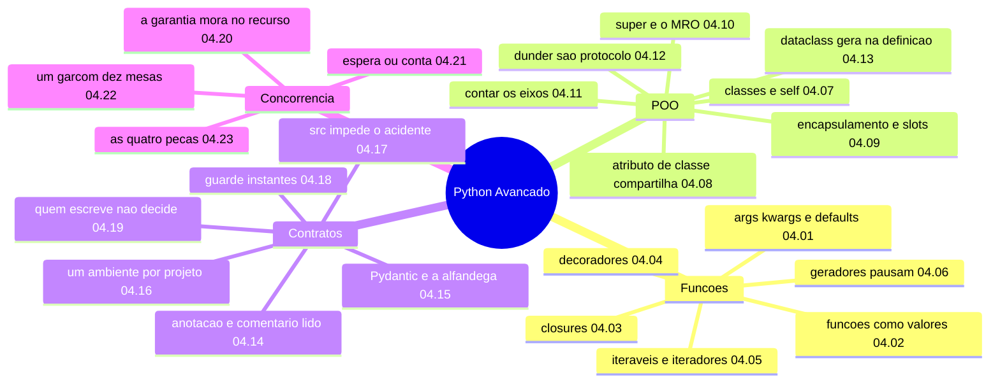

# Mapa mental — Módulo 04: Python Avançado

Como usar: cubra o lado direito e reconstrua cada ramo em voz alta. Se travar num nó,
volte ao capítulo indicado.

## Os cinco fios que atravessam o módulo

**1. O silêncio é o inimigo.** Quase todo defeito grave deste módulo **não levanta exceção**: o default mutável que acumula, o campo sem anotação que some do `__eq__`, o `-03:00` que erra uma hora, o campo do Pydantic descartado, a mensagem de log que o formatador come, o `__exit__` que engole a exceção, a corrida que não aparece em cinco execuções, o `[await f(x)]` que é sequencial. **Procure sempre o que funciona e está errado.**

**2. A garantia vem da construção, não da verificação.** Teste não prova ausência de corrida (04.21); `mypy` limpo não prova correção (04.14); `pytest` verde passa nos dois layouts com o defeito presente (04.17). O que funciona é estrutura: `with` que libera, trava que protege, tipo que obriga a guarda, fronteira que valida.

**3. A fronteira borda/domínio.** Pydantic onde o dado chega, dataclass onde ele já foi conferido (D-024) — e a linha exata em que a conversão acontece é visível no código do 04.23.

**4. Meça antes de decidir.** Threads que pioram (0,94×), processos 9,1× mais lentos que sequencial, `asdict` 32× mais caro, `@contextmanager` 6× mais caro, f-string 2,5× mais cara com o log desligado. **Nenhum desses números é adivinhável.**

**5. O custo mora onde você não olha.** Definir a classe, não criar o objeto (04.13). Importar o pacote, não chamar a função (04.17). Copiar os dados, não calcular (04.21). Formatar a mensagem que não será registrada (04.19).
