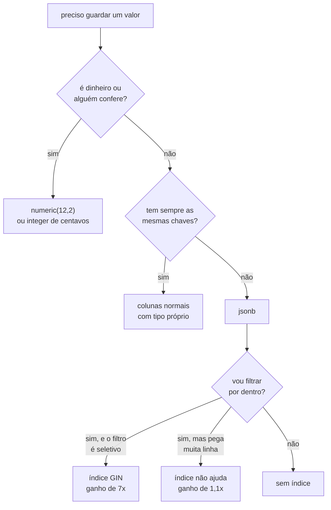

# 05.03 — Tipos avançados do Postgres

> **Módulo 05 — PostgreSQL e MongoDB** · Nível: N2 · Tempo estimado: 3h · Código: `codigo/cap03/`

## 1. Objetivo

- **Escolher** o tipo numérico certo para dinheiro, e justificar a escolha com um número.
- **Aplicar** `JSONB` para dados que não têm o mesmo formato em todas as linhas.
- **Medir** o efeito de um índice GIN — e reconhecer quando ele não ajuda.
- **Distinguir** `timestamptz` de `timestamp`, e dizer o que cada um guarda.

Ao final, você declara o tipo de uma coluna por decisão, e não por hábito.

---

## 2. Pré-requisitos

- [05.01 — PostgreSQL: instalação e arquitetura](01-postgresql-instalacao-e-arquitetura.md) e [05.02 — `psql`](02-psql-e-ferramentas-graficas.md) — o `\d` do 05.02 é como você confere o que declarou.
- [03.12 — DDL e tipos de dados](../03-SQL/12-ddl-e-tipos-de-dados.md) — a afinidade de tipos do SQLite é o contraste do capítulo inteiro.
- [04.18 — Datas, horas e fusos](../04-Python-Avancado/18-datas-horas-e-fusos.md) — a §6.8 é a mesma discussão, do lado do banco.

**Autoteste:** (1) O que o SQLite fazia ao receber texto numa coluna `INTEGER`? (2) Qual a diferença entre `datetime` ingênuo e ciente em Python? (3) Por que `0.1 + 0.2 != 0.3`?

---

## 3. Motivação

Uma linha de código que parece inofensiva:

```sql
CREATE TABLE vendas (total double precision);
```

E a conta que ela produz, somando um centavo dez mil vezes:

```
soma de 0.01 dez mil vezes (float8):   100.00000000001425
a mesma soma em numeric:               100.00
```

**Um centavo e quatro casas de erro em dez mil operações.** Numa fintech isso é um relatório que não fecha; num e-commerce é um cliente que reclama de um real a mais. E o defeito não aparece no teste, porque com três linhas o erro está na décima quinta casa decimal.

Este capítulo é sobre as colunas que você declara sem pensar. O SQLite tolerava quase tudo — o tipo era uma sugestão. O Postgres cumpre o que a coluna promete, e por isso a promessa importa.

---

## 4. Modelo mental

**O tipo é uma promessa que o banco cobra de quem escreve, e cumpre para quem lê.**

No SQLite, `INTEGER` era uma preferência: texto entrava, e você descobria meses depois. No Postgres, a coluna recusa:

```
texto numa coluna integer     invalid input syntax for type integer: "abacaxi"
data inexistente              date/time field value out of range: "2026-02-30"
integer estourado             integer out of range
```

Três erros, três escritas que não aconteceram. **Cada uma dessas mensagens é um defeito que não chegou ao relatório.**

E a promessa tem duas faces:

```
    o que a coluna EXIGE de quem escreve      o que ela GARANTE a quem lê
    ────────────────────────────────────      ───────────────────────────
    integer   um inteiro que cabe             sempre cabe
    numeric   um número decimal               a soma fecha
    date      uma data que existe             30 de fevereiro nunca aparece
    uuid      36 caracteres no formato        comparação por 16 bytes
    jsonb     JSON válido                     operadores e índice
```

**A frase que organiza o capítulo: você escolhe entre pagar na escrita ou pagar na leitura.** O tipo rígido cobra agora, uma vez, de quem inseriu. O tipo frouxo cobra depois, sempre, de quem consulta.

---

## 5. Analogia

`JSONB` é a **gaveta de miscelânea** da cozinha.

Toda casa tem uma. Ela existe porque nem tudo merece um lugar próprio: o abridor de vinho, as pilhas, o manual da geladeira. Seria absurdo construir uma gaveta específica para cada um.

**E a analogia acerta no limite que a §12 discute:** quando a gaveta de miscelânea vira o lugar onde você guarda os talheres, a cozinha parou de ter organização. `JSONB` para atributos que variam por categoria é bom projeto; `JSONB` para o preço do produto é a gaveta engolindo a cozinha.

---

## 6. Teoria

### 6.1 Números: onde o dinheiro mora

```
0.1 + 0.2 em double precision:         0.30000000000000004
0.1 + 0.2 em numeric:                  0.3
são iguais a 0.3? (float8)             False
são iguais a 0.3? (numeric)            True
```

`double precision` é ponto flutuante binário — o mesmo do `float` de Python, com os mesmos problemas. `numeric` é decimal exato, com precisão arbitrária.

| Tipo | Bytes | Use para |
|---|---|---|
| `smallint` | 2 | quantidades pequenas, códigos |
| `integer` | 4 | contadores, chaves até 2 bilhões |
| `bigint` | 8 | chaves de tabelas grandes, centavos |
| `numeric(p,s)` | variável | dinheiro, medidas exatas |
| `real` / `double precision` | 4 / 8 | ciência, coordenadas, médias |

**A regra: `numeric` para o que alguém confere numa planilha; ponto flutuante para o que se mede.**

A Aurora usa uma terceira via desde o módulo 03: **inteiro de centavos**. `preco_centavos integer` é exato como `numeric`, ocupa 4 bytes em vez dos 8 a 12 do `numeric`, e soma mais rápido. O preço é que toda apresentação divide por 100 — e todo esquecimento de dividir vira um bug visível, que é melhor do que um bug invisível.

### 6.2 `json` e `jsonb`

São dois tipos diferentes com nomes parecidos. Dada a mesma entrada, com espaços extras e uma chave repetida:

```
entrada:                {"b": 1,   "a": 2, "b": 3}
guardado como json:     {"b": 3, "a": 2}
guardado como jsonb:    {"a": 2, "b": 3}
```

`json` guarda **o texto**, quase como veio. `jsonb` guarda **a estrutura**: reordena as chaves, descarta os espaços e fica com a última ocorrência de uma chave repetida.

A consequência prática aparece na comparação:

```
json = json:      operator does not exist: json = json
jsonb = jsonb:    True
```

**O tipo `json` não tem nem operador de igualdade** — porque comparar dois textos que representam o mesmo objeto daria falso. `jsonb` tem igualdade, tem os operadores da §6.3 e aceita índice.

E um número que contraria a intuição:

```
tamanho em bytes (json):     30
tamanho em bytes (jsonb):    44
```

**O `jsonb` ocupou mais.** A estrutura decomposta tem cabeçalho por chave, e num objeto pequeno esse cabeçalho pesa mais do que os espaços que ele economizou. A vantagem do `jsonb` é a consulta, não o tamanho.

**Use `jsonb`.** O `json` só ganha quando você precisa devolver o texto exatamente como recebeu — auditoria de payload, por exemplo.

### 6.3 Consultar dentro do JSONB

```
-> devolve jsonb:               preto
->> devolve text:               preto
chave que não existe:           None
@> (contém):                    2
? (tem a chave):                1
dentro de um array:             1
comparar número exige cast:     Fone Bluetooth XZ-9
as chaves do produto 2:         ['cor', 'tags', 'polegadas']
```

| Operador | Faz | Devolve |
|---|---|---|
| `->` | pega a chave | `jsonb` |
| `->>` | pega a chave | `text` |
| `#>` / `#>>` | caminho fundo | `jsonb` / `text` |
| `@>` | contém este objeto | `boolean` |
| `?` | tem esta chave | `boolean` |
| `?\|` / `?&` | tem alguma / todas | `boolean` |

**A confusão que todo mundo comete uma vez:** `->` e `->>` imprimem igual e comparam diferente. `attrs -> 'cor' = 'preto'` falha, porque compara `jsonb` com texto; `attrs ->> 'cor' = 'preto'` funciona. **Regra: a seta dupla é a última do caminho.**

Números dentro de `JSONB` saem como texto e precisam de conversão explícita:

```sql
WHERE (attrs ->> 'bateria_h')::int > 20
```

E chave ausente devolve `NULL`, não erro — o que significa que uma consulta com nome de chave errado devolve zero linhas em silêncio.

### 6.4 O índice GIN, e quando ele não serve

Duzentas mil linhas de eventos. Duas consultas com a mesma forma, mudando só o quanto elas selecionam:

```
consulta SELETIVA casa:     40 linhas
  sem índice:               33.5 ms — Finalize Aggregate / Gather / Workers Planned: 1
consulta AMPLA casa:        16667 linhas
  sem índice:               34.8 ms — Finalize Aggregate / Gather / Workers Planned: 1

criar o índice GIN:         752 ms
SELETIVA com índice:        4.8 ms — Aggregate / Bitmap Heap Scan on eventos
  ganho:                    7x
AMPLA com índice:           32.7 ms — Aggregate / Bitmap Heap Scan on eventos
  ganho:                    1.1x
```

**O mesmo índice deu 7× numa consulta e 1,1× na outra.** Ele foi usado nas duas — os dois planos dizem `Bitmap Heap Scan`. A diferença é quantas linhas cada uma precisa buscar depois: quarenta linhas espalhadas o índice acha rápido; dezesseis mil e seiscentas exigem visitar 8% da tabela, e a essa altura ler tudo em sequência custa quase o mesmo.

**Este é o fato mais importante do capítulo sobre índices, e ele volta no 05.11:** índice acelera consulta **seletiva**. Quando o filtro devolve uma fração grande da tabela, o ganho desaparece — e o custo de manter o índice na escrita fica.

O custo, medido:

```
tamanho da tabela:          20 MB
tamanho do índice GIN:      2560 kB
```

Cerca de 12% do tamanho da tabela, mais o tempo de atualização a cada escrita.

### 6.5 Arrays

```
literal:                     ['anc', 'usb-c', 'bluetooth']
primeiro elemento (base 1!): a
índice 0 devolve:            None
contém:                      True
qualquer um:                 True
unnest vira linhas:          ['anc', 'usb-c']
array_agg junta linhas:      ['acessorios', 'audio', 'perifericos', 'video']
```

**Arrays em SQL começam em 1**, ao contrário de Python — e o índice 0 devolve `NULL` em vez de erro, o que transforma um engano em resultado vazio.

`unnest` e `array_agg` são inversos: um transforma array em linhas, o outro linhas em array. A dupla resolve boa parte do que exigiria uma tabela auxiliar.

**Quando usar array:** etiquetas, listas curtas e fechadas, valores que você consulta com `@>` ou `ANY`. **Quando não usar:** quando os elementos precisam de chave estrangeira, ou quando você vai fazer `JOIN` por eles. Um `text[]` não garante que `'anc'` existe em lugar nenhum.

### 6.6 UUID

```
gerar:                             6b4a1095-b0f6-4a2f-897d-4e21f69d8a30
tamanho de um uuid:                16
tamanho de um bigint:              8
tamanho do mesmo uuid como text:   40
uuid inválido:                     invalid input syntax for type uuid: "nao-e-uuid"
```

`gen_random_uuid()` está embutido desde o PostgreSQL 13, sem extensão.

**Os 40 bytes são o erro clássico:** guardar o UUID numa coluna `text`. Você paga 2,5× o espaço, perde a validação e faz cada comparação percorrer 36 caracteres em vez de comparar 16 bytes. Numa tabela com dez milhões de linhas e um índice, a diferença aparece na conta do servidor.

**Quando UUID compensa:** quando o identificador é gerado fora do banco (aplicação, app offline, outro serviço), ou quando expor `id=1348` na URL entrega quantos pedidos a empresa tem. **Quando ele custa:** UUID v4 é aleatório, e chave aleatória espalha as escritas pelo índice inteiro, em vez de concentrá-las no fim como faz uma sequência.

### 6.7 Texto

`text`, `varchar(n)` e `char(n)` têm o mesmo desempenho no Postgres — não há ganho em limitar o tamanho, ao contrário do que a intuição de outros bancos sugere.

**Use `text`**, e valide o tamanho com `CHECK (length(nome) <= 200)` quando o limite for uma regra de negócio. A diferença é que a restrição fica explícita e você pode alterá-la sem reescrever a tabela.

`char(n)` preenche com espaços até o tamanho e quase nunca é o que alguém quis.

### 6.8 Datas, horas, e o que `timestamptz` não guarda

O mesmo instante, gravado nas duas colunas, lido em dois fusos:

```
fuso da sessão:                  America/Sao_Paulo
timestamptz lido em São Paulo:   2026-08-06 15:00:00-03:00
timestamp  lido em São Paulo:    2026-08-06 15:00:00

fuso da sessão:                  Asia/Tokyo
timestamptz lido em Tóquio:      2026-08-07 03:00:00+09:00
timestamp  lido em Tóquio:       2026-08-06 15:00:00
```

**O nome `timestamptz` engana, e este é o ponto do capítulo.** Ele não guarda o fuso: guarda o **instante**, normalizado em UTC, e converte na saída para o fuso de quem está lendo. O fuso do momento da escrita é descartado.

`timestamp` sem fuso guarda um número de calendário e relógio, sem instante associado — "15:00 do dia 6" e nada mais. Lido em Tóquio, continua 15:00, porque não há nada a converter.

**A regra prática:** `timestamptz` para tudo que aconteceu (um pedido, um login, um pagamento). `timestamp` sem fuso só para o que é local por definição — o horário de abertura de uma loja, que é 09:00 na cidade dela independentemente de onde você consulta.

É a mesma distinção do 04.18 entre `datetime` ciente e ingênuo, e os dois lados precisam concordar.

### 6.9 Aritmética de datas, e duas surpresas

```
date - date (dias corridos):     65
age(), como o banco escreve:     2 mons 4 days
age(), como o psycopg entrega:   64 days, 0:00:00
31 de janeiro + 1 mês:           2026-02-28 00:00:00
```

**Primeira surpresa: 65 e 64 são a mesma diferença.** `date - date` conta dias corridos e devolve 65. `age()` devolve um intervalo **simbólico** — dois meses e quatro dias. Quando o `psycopg` converte esse intervalo para o `timedelta` de Python, que não tem o conceito de mês, ele usa 30 dias por mês: 2 × 30 + 4 = 64.

Nenhum dos dois está errado. Eles respondem perguntas diferentes, e misturá-los produz relatórios que discordam por um dia.

**Segunda surpresa: 31 de janeiro mais um mês é 28 de fevereiro.** Não existe 31 de fevereiro, e o Postgres trunca para o último dia do mês. A operação **não é reversível** — voltar um mês a partir de 28 de fevereiro devolve 28 de janeiro, e não o 31 de onde você saiu.

**A defesa é somar dias quando você quer dias**, e reservar `interval '1 month'` para o caso em que "mesmo dia do mês seguinte" é de fato a regra de negócio — vencimento de fatura, por exemplo, onde o truncamento é o comportamento correto.

`date_trunc` é o agrupamento por período, e substitui o `strftime` que o módulo 03 precisou usar:

```
pedidos em 2026-06-01:    8
pedidos em 2026-07-01:    12
```

A diferença em relação ao SQLite é que aqui o resultado continua sendo uma data — ordenável, comparável e subtraível — em vez de uma string que parece uma data.

---

## 7. Funcionamento interno

**Por que o `jsonb` aceita índice e o `json` não.** Um índice precisa de uma chave comparável e estável. O `json` é texto: dois textos diferentes podem representar o mesmo objeto, e o mesmo objeto pode ter várias representações. Não há chave estável.

O `jsonb` decompõe o documento numa árvore normalizada — chaves ordenadas, espaços descartados, duplicatas resolvidas. Com isso, dois documentos iguais têm exatamente a mesma representação binária, e comparação passa a fazer sentido.

**O que o GIN indexa.** Um índice B-tree comum guarda um valor por linha. O GIN (*generalized inverted index*) guarda **muitas chaves por linha**: para cada par chave-valor dentro do documento, uma entrada apontando para as linhas que o contêm. É a estrutura de um índice de livro remissivo, e por isso ele responde bem a "quais linhas contêm isto" e mal a "ordene por isto".

Daí os dois números da §6.4: o GIN encontra rápido a lista de linhas candidatas, e depois alguém precisa visitar cada uma no disco. Quando a lista é curta, o índice ganha. Quando é 8% da tabela, a visita domina.

---

## 8. Visualização do fluxo



**Como ler:** as duas primeiras bifurcações são de modelagem e você responde antes de escrever o `CREATE TABLE`. A terceira é de desempenho e você responde depois, medindo — os dois ramos de baixo são o mesmo índice, na mesma tabela, com resultados diferentes conforme a consulta.

---

## 9. Aplicação prática

**Aurora, situação real.** O catálogo tem produtos de categorias que não se parecem. Um fone tem autonomia de bateria e cancelamento de ruído; um monitor tem polegadas e taxa de atualização; um mousepad tem tamanho e material.

A modelagem ingênua cria uma coluna por atributo, e a tabela chega a quarenta colunas em que trinta e cinco são `NULL` em cada linha. A modelagem com `JSONB` separa o que é comum do que varia:

```sql
CREATE TABLE produtos (
    id              integer PRIMARY KEY,
    nome            text    NOT NULL,
    categoria       text    NOT NULL,
    preco_centavos  integer NOT NULL CHECK (preco_centavos >= 0),
    ativo           boolean NOT NULL DEFAULT true,
    criado_em       timestamptz NOT NULL DEFAULT now(),
    atributos       jsonb   NOT NULL DEFAULT '{}'
);
CREATE INDEX produtos_atributos_gin ON produtos USING gin (atributos);
```

**O critério que decidiu cada coluna:** `preco_centavos` fica fora do `JSONB` porque tem regra (`CHECK`), tem agregação (`sum`) e tem tipo. `categoria` fica fora porque é o que todo relatório agrupa. `atributos` recebe o que é específico da categoria — o que ninguém agrega e o que muda quando o time de produto inventa um campo novo.

**E o que isso conversa com o 05.12.** Essa tabela é meio caminho para o MongoDB: um documento por linha, com parte estruturada e parte livre. A pergunta "por que não usar Mongo direto, então?" é o assunto do 05.12, e a resposta tem a ver com as três colunas que ficaram de fora.

---

## 10. Código comentado

Do arquivo `codigo/cap03/tipos.py`, a cena 2 — e o comentário que ela carrega:

```python
cursor.execute("CREATE TEMP TABLE rigor (n integer, d date)")
# O commit é necessário: cada INSERT abaixo falha, e o rollback que
# limpa a transação levaria junto o CREATE TABLE se ele ainda
# estivesse pendente. A primeira versão deste script não commitava, e
# as três últimas linhas da cena diziam 'relation "rigor" does not
# exist' — um erro do script disfarçado de erro de tipo.
cursor.connection.commit()
```

**O que aconteceu na primeira execução:** a cena imprimiu quatro linhas, uma com a mensagem de tipo correta e três dizendo que a tabela não existia. Como todas as quatro eram mensagens de erro, e o título da cena é "o que o Postgres recusa", elas passariam por conteúdo válido para quem lesse rápido.

**A lição de mecânica, que é o que o capítulo aproveita:** no PostgreSQL, `CREATE TABLE` é transacional. Um `ROLLBACK` desfaz criação de tabela como desfaz um `INSERT` — algo que MySQL não faz e que muita gente descobre tarde. É a mesma propriedade que faz a migração da §6.8 do 05.02 funcionar com `-1`.

---

## 11. Erros comuns

| # | Erro | Sintoma | Correção |
|---|---|---|---|
| 1 | `double precision` para dinheiro | relatório não fecha por centavos | `numeric` ou centavos em `integer` |
| 2 | `->` onde precisava `->>` | comparação nunca casa | seta dupla no último passo |
| 3 | Nome de chave errado no `JSONB` | zero linhas, sem erro | conferir com `jsonb_object_keys` |
| 4 | UUID em coluna `text` | 40 bytes no lugar de 16 | tipo `uuid` |
| 5 | Índice GIN em filtro pouco seletivo | índice criado, nada melhorou | medir antes; talvez não criar |
| 6 | `timestamp` onde era `timestamptz` | horário errado para outro fuso | `timestamptz` para eventos |
| 7 | Comparar `age()` com `date - date` | relatórios discordam por um dia | escolher uma das duas |
| 8 | `interval '1 month'` esperando reversibilidade | 31/01 vira 28/02 e não volta | somar dias |
| 9 | Array acessado no índice 0 | `NULL` silencioso | arrays começam em 1 |
| 10 | Tudo dentro do `JSONB` | sem `CHECK`, sem `FK`, sem tipo | tirar do JSON o que tem regra |

**O 3 é o mais traiçoeiro do capítulo.** Um erro de digitação numa chave de `JSONB` não levanta exceção: devolve `NULL`, o `WHERE` fica falso, e a consulta responde "nenhum resultado" com toda a confiança.

---

## 12. Boas práticas

**Tire do `JSONB` o que tem regra.** Se a coluna precisa de `CHECK`, de `NOT NULL`, de chave estrangeira ou de agregação, ela merece ser coluna. `JSONB` é para o que varia por linha e ninguém soma.

**Declare `NOT NULL DEFAULT '{}'` na coluna `jsonb`.** Sem isso você passa a ter três estados — ausente, nulo e vazio — e o código de aplicação precisa tratar os três.

**Índice GIN só depois de medir.** Ele custa 12% do tamanho da tabela e atrasa toda escrita. Crie quando a consulta existir e for seletiva.

**`timestamptz` como padrão para eventos**, e o servidor em UTC. O fuso de exibição é decisão da aplicação, não do banco.

**Nunca guarde dinheiro em ponto flutuante.** Nem "por enquanto", nem "porque é só um protótipo".

---

## 13. Performance

Os números do capítulo, todos medidos em 200 mil linhas:

| Operação | Tempo |
|---|---|
| Carga de 200 mil linhas com `jsonb` | 1340 ms |
| Criar o índice GIN | 752 ms |
| Consulta seletiva sem índice | 33,5 ms |
| Consulta seletiva com índice | 4,8 ms |
| Consulta ampla sem índice | 34,8 ms |
| Consulta ampla com índice | 32,7 ms |

**A leitura que importa: criar o índice custou mais do que 20 execuções da consulta que ele acelera.** Num sistema que roda essa consulta mil vezes por dia, o índice se paga em minutos. Num relatório mensal, ele nunca se paga — e ainda cobra em cada escrita do mês.

**E o tamanho:** 2560 kB de índice para 20 MB de tabela. Um `JSONB` com muitas chaves distintas produz índices GIN maiores que isso; é comum o índice passar de metade do tamanho da tabela quando os documentos são ricos.

**O contraponto honesto:** `jsonb_path_ops` é uma variante do GIN que indexa só caminhos completos. Ela produz índice bem menor e é mais rápida para `@>`, ao custo de não responder ao operador `?`. Quando a única consulta é `@>`, ela é a escolha melhor — e o 05.11 volta ao assunto com `EXPLAIN ANALYZE`.

---

## 14. Mercado

`JSONB` é o motivo pelo qual muita empresa não precisou adotar MongoDB. Um PostgreSQL com `JSONB` cobre o caso "atributos variáveis" mantendo transações, `JOIN` e restrições — e a decisão entre os dois é o assunto do 05.14.

**O que aparece em entrevista:** a diferença `json`/`jsonb` é pergunta de triagem. `timestamptz` contra `timestamp` é pergunta de nível pleno, e a resposta errada mais comum é "`timestamptz` guarda o fuso".

**O que aparece em revisão de código:** dinheiro em `float` é um dos poucos comentários que qualquer pessoa sênior faz sem discutir. UUID em `text` é o segundo.

**E uma tendência que vale conhecer:** `JSONB` cresceu tanto que o padrão SQL absorveu uma linguagem de caminho, o `jsonpath`, disponível no Postgres desde a versão 12 via `jsonb_path_query`. Ela cobre consultas que os operadores da §6.3 não alcançam, com sintaxe parecida com a do MongoDB.

---

## 15. Entrevistas

**P1. `json` ou `jsonb`?**
`jsonb` em praticamente todo caso: aceita índice, tem operadores e comparação. `json` guarda o texto original e serve quando você precisa devolver exatamente o que recebeu. `jsonb` pode ocupar mais bytes em documentos pequenos.

**P2. O que `timestamptz` guarda?**
O instante, normalizado em UTC. Não guarda o fuso de origem — ele converte na saída para o fuso da sessão. `timestamp` sem fuso guarda calendário e relógio, sem instante associado.

**P3. Por que dinheiro não vai em `double precision`?**
Porque é ponto flutuante binário e frações decimais não têm representação exata. Somando um centavo dez mil vezes o erro chega à casa dos nanocentavos, e a comparação com o valor esperado falha. Use `numeric` ou inteiro de centavos.

**P4. Criei um índice GIN e a consulta não melhorou. Por quê?**
Provavelmente o filtro é pouco seletivo. Medido em 200 mil linhas, o mesmo índice deu 7× numa consulta que devolvia 40 linhas e 1,1× numa que devolvia 16 mil — nas duas ele foi usado, e na segunda o custo de visitar as linhas dominou.

---

## 16. Exercícios guiados

Enunciados em [`exercicios/cap03.md`](exercicios/cap03.md); gabaritos em [`exercicios/gabaritos/cap03.md`](exercicios/gabaritos/cap03.md).

**Aquecimento (4):** escolher o tipo de doze colunas; prever o resultado de oito expressões; achar o erro em seis `CREATE TABLE`; decidir coluna ou `JSONB` em seis casos.

**Aplicação (3):** modelar o catálogo com atributos por categoria; medir o índice GIN na própria máquina; corrigir uma tabela com dinheiro em `float` sem perder dado.

**Desafio (1):** um relatório que agrupa por mês e por atributo de `JSONB` ao mesmo tempo.

**Mini projeto (1):** o catálogo da Aurora com `JSONB`, validação e busca por atributo.

---

## 17. Desafios

O D1 pede um relatório que cruza duas dimensões: o mês do pedido (`date_trunc`) e um atributo que está dentro do `JSONB` do produto.

**A dificuldade não é a sintaxe.** É que a consulta precisa decidir o que fazer com produtos cujo `JSONB` não tem aquela chave — e as três respostas possíveis (ignorar, agrupar como "sem atributo", ou falhar) produzem relatórios diferentes. Escolher e documentar a escolha é metade da nota.

---

## 18. Mini projeto

**O catálogo da Aurora**, com a tabela da §9.

Requisitos: carregar os doze produtos com atributos por categoria; um índice GIN; busca por atributo com `@>`; um `CHECK` que garanta que `atributos` é um objeto e não um array; e uma consulta que liste quais chaves existem em cada categoria.

**A parte que ensina:** o `CHECK` com `jsonb_typeof(atributos) = 'object'`. Sem ele, nada impede alguém de gravar `'[1,2,3]'` na coluna, e toda consulta com `->>` passa a devolver `NULL` sem explicação.

---

## 19. Revisão

**O que fica:**

1. O tipo é promessa cobrada na escrita e garantida na leitura.
2. Dinheiro em `numeric` ou em centavos inteiros, nunca em ponto flutuante.
3. `jsonb` normaliza e aceita índice; `json` guarda o texto e não tem nem igualdade.
4. `->>` para comparar, `->` para continuar navegando.
5. Chave ausente em `JSONB` devolve `NULL`, e não erro.
6. GIN acelera consulta seletiva; em filtro amplo o ganho some.
7. `timestamptz` guarda o instante em UTC, não o fuso.
8. `date - date` e `age()` respondem perguntas diferentes.
9. 31/01 mais um mês é 28/02, e a operação não volta.
10. Arrays começam em 1, e o índice 0 devolve `NULL`.

**Repetição espaçada:** D+1 refaça a cena 1 e a cena 8; D+7 escreva o `CREATE TABLE` da §9 de memória; D+30 explique a P4 com os números; D+90 releia a §6.9 antes de qualquer relatório com datas.

---

## 20. Checklist

- [ ] Escolho entre `numeric`, `integer` de centavos e ponto flutuante, com justificativa.
- [ ] Digo o que `jsonb` faz com chaves repetidas e espaços.
- [ ] Uso `->` e `->>` no lugar certo.
- [ ] Crio um índice GIN e **meço** se ele ajudou.
- [ ] Explico por que o mesmo índice deu 7× e 1,1×.
- [ ] Escolho `timestamptz` ou `timestamp` para um caso concreto.
- [ ] Sei que `timestamptz` não guarda o fuso.
- [ ] Distingo `date - date` de `age()`.
- [ ] Decido o que fica em coluna e o que vai para `JSONB`.

---

## 21. Próximo capítulo

[05.04 — Python + Postgres com psycopg](04-psycopg.md) liga os dois lados. Você vai ver a SQL injection funcionando — não descrita, funcionando — e depois a linha que a impede.

Os tipos deste capítulo reaparecem lá do lado do Python: `JSONB` vira `dict`, `timestamptz` vira `datetime` com `tzinfo`, e `numeric` vira `Decimal` — e cada uma dessas conversões tem uma armadilha.
