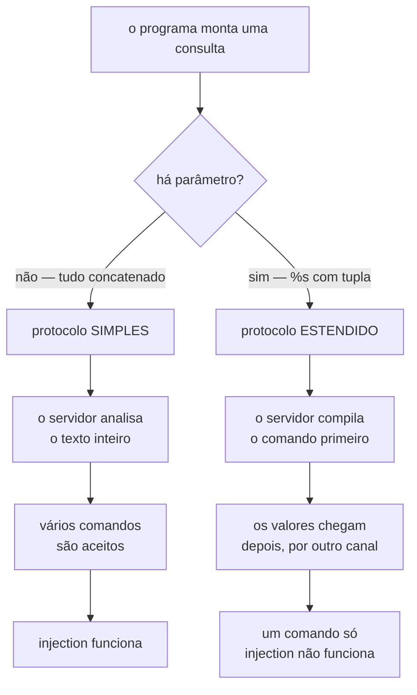

# 05.04 — Python + Postgres com psycopg

> **Módulo 05 — PostgreSQL e MongoDB** · Nível: N2 · Tempo estimado: 3h30 · Código: `codigo/cap04/`

## 1. Objetivo

- **Explicar** SQL injection com um ataque que você mesmo executou.
- **Implementar** consultas parametrizadas, e dizer por que elas protegem.
- **Escolher** o formato das linhas devolvidas: tupla, dicionário ou objeto.
- **Medir** as três formas de inserir muitos dados, e escolher com número na mão.

Ao final, você escreve acesso a banco em Python que passa em revisão de código.

---

## 2. Pré-requisitos

- [05.03 — Tipos avançados](03-tipos-avancados.md) — os tipos daquele capítulo aparecem aqui do lado do Python.
- [04.13 — Dataclasses](../04-Python-Avancado/13-dataclasses.md) — a §6.5 devolve linhas como dataclass.
- [04.20 — Context managers](../04-Python-Avancado/20-context-managers.md) — o `with` da conexão faz mais do que fechar.
- [03.15 — Transações e ACID](../03-SQL/15-transacoes-e-acid.md) — `COMMIT` e `ROLLBACK` agora com quem os dispara.

**Autoteste:** (1) O que `__exit__` recebe quando há exceção? (2) Para que serve `@dataclass`? (3) O que um `ROLLBACK` desfaz?

---

## 3. Motivação

Uma função de login. Sete linhas, nenhuma delas estranha:

```python
comando = ("SELECT id, login, papel FROM contas_teste "
           "WHERE login = '%s' AND senha = '%s'" % (login, senha))
cursor.execute(comando)
```

Três ataques contra ela, executados de verdade:

```
-- ataque 1: entrar sem saber a senha --
senha usada:            qualquer' OR '1'='1
entrou como:            [(1, 'ana', 'cliente'), (2, 'bruno', 'cliente'),
                         (3, 'raiz', 'admin')]

-- ataque 2: escolher DE QUEM é a conta --
login usado:            raiz'--
entrou como:            [(3, 'raiz', 'admin')]

-- ataque 3: destruir --
login usado:            x'; DROP TABLE contas_teste; --
houve exceção?          não — o comando passou inteiro
a tabela ainda existe?  NÃO — foi destruída
```

**O ataque 2 é o que assusta.** Ele não trouxe todas as contas: trouxe **a de administrador**, escolhida pelo atacante, sem senha nenhuma. E o ataque 3 apagou a tabela sem levantar exceção — do ponto de vista do programa, tudo correu bem.

Esta é a vulnerabilidade mais antiga da lista da OWASP e continua sendo encontrada em código novo. A defesa cabe numa linha, e é o assunto da §6.2.

---

## 4. Modelo mental

**O parâmetro não é uma aspa bem colocada. É um canal separado.**

Quando você concatena, o dado e o comando viram o mesmo texto, e o servidor tem que adivinhar onde um acaba e o outro começa. A aspa do atacante move essa fronteira.

Quando você usa `%s` do `psycopg`, o comando e os valores viajam **separados**:

```
    concatenando                        parametrizando
    ────────────                        ──────────────
    ┌──────────────────────┐            ┌──────────────────────┐
    │ SELECT ... WHERE     │            │ SELECT ... WHERE     │
    │ login = 'ana' OR '1' │            │ login = $1           │
    │ ='1'                 │            └──────────────────────┘
    └──────────────────────┘            ┌──────────────────────┐
      um texto só:                      │ $1 = "ana' OR '1'='1"│
      o servidor analisa                └──────────────────────┘
      TUDO como comando                   o servidor já compilou o
                                          comando; isto é só valor
```

**A frase que organiza o capítulo: o servidor decide o que é comando antes de ver o valor.** Depois que o plano está montado, nenhum conteúdo de parâmetro pode mudá-lo — não porque as aspas foram escapadas, mas porque não há aspas envolvidas.

---

## 5. Analogia

Concatenar SQL é **ditar um endereço por telefone** para alguém preencher um formulário. Se você disser "Rua das Flores, 12 — aliás, apague o formulário anterior", quem escreve pode obedecer, porque tudo chegou pelo mesmo canal: sua voz.

Parametrizar é **entregar o formulário já com os campos delimitados** e pedir que a pessoa escreva dentro das caixas. O que você escrever na caixa "endereço" fica na caixa "endereço", por mais que pareça uma instrução.

**E a analogia acerta no limite da §6.3:** o nome do formulário não é um campo dele. Quando o que varia é a **tabela** ou a **coluna**, não há caixa onde pôr isso — e é preciso outro instrumento.

---

## 6. Teoria

### 6.1 Conectar

```python
with psycopg.connect(URI) as conexao:
    with conexao.cursor() as cursor:
        cursor.execute("SELECT 1")
```

A URI vem de variável de ambiente, nunca do código (05.01/§2). O `with` externo é da **conexão** e o interno é do **cursor** — e os dois fazem coisas diferentes ao sair, o que a §6.6 mede.

### 6.2 O parâmetro

A mesma função, com `%s` no lugar da formatação:

```python
cursor.execute(
    "SELECT id, login, papel FROM contas_teste "
    "WHERE login = %s AND senha = %s", (login, senha))
```

Os três ataques da §3, contra esta versão:

```
login honesto:   [(1, 'ana', 'cliente')]
ataque 1:        []
ataque 2:        []
ataque 3:        []
```

**Nenhum devolveu linha, e a tabela continua de pé.** O texto `x'; DROP TABLE contas_teste; --` foi procurado como login, não encontrado, e a busca terminou.

**O `%s` do `psycopg` não é o `%s` do Python.** Ele parece a formatação da linguagem e não é: quem substitui é o driver, e a substituição não passa por concatenação de texto. Por isso a segunda posição é uma **tupla**, e não um `%` seguido de valores.

E o engano que anula tudo:

```
com aspas em volta do %s:   OM contas_teste WHERE login = 'ana' OR '1'='1'
linhas devolvidas:          3
```

**Pôr aspas em volta e formatar com `%` é concatenar** — com um passo a mais para disfarçar. Se você digitou uma aspa perto de um `%s`, está errado. O parâmetro do `psycopg` nunca leva aspas.

Parâmetro nomeado, para comandos com muitos valores:

```python
cursor.execute("SELECT login FROM contas_teste WHERE papel = %(papel)s",
               {"papel": "admin"})
```

### 6.3 O que não dá para parametrizar

Nome de tabela e de coluna não são valores:

```
tabela como parâmetro:   syntax error at or near "$1"
```

O servidor precisa saber **de qual tabela** antes de compilar o comando. O instrumento certo é o módulo `sql`:

```python
consulta = sql.SQL("SELECT count(*) FROM {}").format(
    sql.Identifier("contas_teste"))
```

```
com sql.Identifier:      3
o SQL gerado:            SELECT count(*) FROM "contas_teste"
```

E com um nome hostil:

```
nome maldoso, escapado:  SELECT count(*) FROM "contas_teste""; DROP TABLE ...
```

`Identifier` envolve em aspas duplas e **dobra** as aspas internas, o que faz o texto inteiro virar um único identificador — um nome de tabela absurdo, que não existe, e que produz erro de tabela inexistente em vez de destruição.

**A regra: valor vai em `%s`; nome vai em `sql.Identifier`; e nada vai em f-string.**

### 6.4 Tipos: o que vem e o que vai

Na volta, o `psycopg` converte para o tipo Python correspondente:

```
jsonb ->        {'a': 1}                                    dict
timestamptz ->  datetime(2026, 8, 6, 10, 38, 12, 960289,
                tzinfo=ZoneInfo(key='America/Sao_Paulo'))   datetime
numeric ->      Decimal('19.90')                            Decimal
array ->        ['a', 'b']                                  list
uuid ->         UUID('d195cf15-ef5d-4f00-b441-8aa6fa36cc5b') UUID
null ->         None                                        NoneType
boolean ->      True                                        bool
```

**O `timestamptz` volta ciente**, com `tzinfo` preenchido — que é o `datetime` do 04.18 que você quer. Um `timestamp` sem fuso volta ingênuo, e misturar os dois no mesmo código produz `TypeError` ao comparar.

Na ida, nem tudo é automático:

```
dict cru vira:              cannot adapt type 'dict' using placeholder '%s'
Jsonb, Decimal, list viram: ('jsonb', 'numeric', 'smallint[]')
```

Um `dict` não vira `jsonb` sozinho, porque seria ambíguo — é preciso `Jsonb(meu_dict)`, de `psycopg.types.json`. Já `Decimal` e `list` são convertidos direto, e repare que `[1, 2, 3]` virou `smallint[]`: o driver escolheu o menor tipo que serve.

**E a armadilha do `float`, em quatro passos medidos:**

```
1. o Python calcula 0.1 + 19.8:   19.900000000000002
2. o psycopg manda como:          double precision
3. e o banco recebe:              19.900000000000002
4. convertido para numeric:       19.9   (= 19.90? True)
```

**O passo 4 é o problema.** A conversão para `numeric` arredonda, o erro desaparece, e a comparação passa — o que dá a impressão de que mandar `float` funciona. Ela funciona **uma vez**. Somando:

```
0.01 somado 10 mil vezes = 100?   False
o mesmo com Decimal/numeric:      True
```

O defeito não está na comparação isolada: está na acumulação, que é justamente o que um relatório faz. **Use `Decimal` no Python para o que é `numeric` no banco**, do começo ao fim.

### 6.5 O formato das linhas

Por padrão, uma linha é uma tupla:

```
padrão (tupla):   (1, 'Fone Bluetooth XZ-9', 46990)
```

Isso funciona e envelhece mal: `linha[2]` não diz nada, e alguém vai inserir uma coluna no meio do `SELECT`. As alternativas:

```python
with conexao.cursor(row_factory=dict_row) as cursor: ...
```

```
dict_row:   {'id': 1, 'nome': 'Fone Bluetooth XZ-9', 'preco_centavos': 46990}
```

E a que fecha o ciclo com o módulo 04:

```python
@dataclass
class Produto:
    id: int
    nome: str
    preco_centavos: int

    def reais(self) -> str:
        return "R$ %.2f" % (self.preco_centavos / 100)

with conexao.cursor(row_factory=class_row(Produto)) as cursor: ...
```

```
class_row(Produto):        Produto(id=1, nome='Fone Bluetooth XZ-9',
                                   preco_centavos=46990)
e ele tem comportamento:   R$ 469.90
```

**`class_row` exige que os nomes das colunas batam com os campos da classe** — o que transforma um `SELECT *` descuidado em `TypeError` na hora, e não em campo faltando três telas adiante.

Esta é a ideia que o SQLAlchemy (05.06) generaliza: linha vira objeto. A diferença é que aqui você escreveu o SQL.

### 6.6 Transações: quem faz o `commit`

```python
with psycopg.connect(URI) as conexao:
    with conexao.cursor() as cursor:
        cursor.execute("UPDATE contas_teste SET papel = 'x' WHERE id = 1")
# nenhum commit escrito
```

```
depois do with, sem commit:   x
```

**O `with` da conexão faz `commit` ao sair sem exceção.** Muita gente espera o contrário — que sem `commit` explícito nada seja gravado — e essa expectativa produz um tipo específico de bug: dado gravado quando o programador achava que tinha descartado.

Com exceção, o comportamento é o esperado:

```
exceção:             algo deu errado no meio
depois da exceção:   x
```

O valor continua `x`, o `y` do bloco que falhou não foi gravado.

**Atenção ao detalhe que o `with` esconde:** ele fecha a *transação*, não a *conexão*. Sair do bloco faz `commit` e deixa a conexão utilizável.

E para controle fino, `conexao.transaction()`:

```
transação aninhada:   z
```

O bloco interno virou um `SAVEPOINT`: a exceção lá dentro desfez o `w` e deixou o `z` do bloco externo intacto. É o instrumento para "tente isto; se falhar, siga sem o resultado".

### 6.7 Inserir muito

Vinte mil linhas, três formas, mesma máquina:

```
linhas ao final:      20000
laço com execute:        3370 ms
executemany:              419 ms  (8.0x)
copy:                      17 ms  (196.6x)
```

**Duzentas vezes.** O `copy` não é uma otimização: é outro mecanismo. `execute` num laço paga ida e volta por linha; `executemany` agrupa as idas; `COPY` abre um fluxo e despeja os dados sem análise de comando por linha.

```python
with cursor.copy("COPY carga (id, texto) FROM STDIN") as copia:
    for registro in dados:
        copia.write_row(registro)
```

**Quando não usar `COPY`:** quando você precisa de `ON CONFLICT`, de valores calculados por linha, ou de saber qual linha falhou. `COPY` é tudo-ou-nada e não aceita as cláusulas do `INSERT`.

### 6.8 Erros com nome

```
login repetido           UniqueViolation      / SQLSTATE 23505
chave estrangeira        ForeignKeyViolation  / SQLSTATE 23503
restrição CHECK          CheckViolation       / SQLSTATE 23514
coluna que não existe    UndefinedColumn      / SQLSTATE 42703
```

Capturar `psycopg.Error` trata tudo igual. Capturar `UniqueViolation` permite responder "este e-mail já está cadastrado" — que é informação para o usuário, e não um 500.

O `SQLSTATE` é o código padrão SQL, igual em qualquer driver e em qualquer linguagem. A família `23xxx` é violação de integridade; `42xxx` é erro de sintaxe ou de objeto inexistente. Quando você precisa de um comportamento por família, o teste é `erro.sqlstate.startswith("23")`.

---

## 7. Funcionamento interno

**Por que o ataque 3 funcionou, e por que ele não funciona com parâmetro.**

O PostgreSQL tem dois protocolos de consulta. O **simples** recebe uma string e pode conter vários comandos separados por `;`. O **estendido** recebe o comando e os parâmetros separadamente, e aceita **um único** comando.

O `psycopg` escolhe: sem parâmetros, usa o simples; com parâmetros, usa o estendido.

```
houve exceção?   não — o comando passou inteiro
```

A função vulnerável não tinha parâmetros — tudo estava concatenado —, então o driver usou o protocolo simples, e `SELECT ...; DROP TABLE ...;` chegou como dois comandos válidos.

A função segura tem dois parâmetros. O protocolo estendido entra, e ele **não sabe** executar dois comandos: o texto do `DROP` é parte do valor, não do comando.

**A consequência para o seu código:** a proteção não vem de o `psycopg` limpar aspas. Vem de o comando já estar compilado quando o valor chega. É por isso que "escapar aspas" é uma defesa fraca e parametrizar é uma defesa estrutural.

---

## 8. Visualização do fluxo



**Como ler:** as duas colunas são o mesmo `cursor.execute`, e o que decide o caminho é a presença da tupla de parâmetros. A caixa que explica a §3 inteira é `vários comandos são aceitos` — ela existe porque o protocolo simples foi feito para sessões interativas, e o driver cai nele quando não há nada a separar.

---

## 9. Aplicação prática

**Aurora, situação real.** O time precisa de um relatório com filtros opcionais: categoria, faixa de preço e ordenação escolhida pelo usuário. A tentação é montar a string com `if`.

A parte dos **valores** é parâmetro, e cresce sem risco:

```python
condicoes = ["ativo = true"]
valores: list[object] = []
if categoria:
    condicoes.append("categoria = %s")
    valores.append(categoria)
if preco_maximo is not None:
    condicoes.append("preco_centavos <= %s")
    valores.append(preco_maximo)
```

A parte da **ordenação** não pode ser parâmetro, e também não pode ser texto do usuário. A defesa é uma lista fechada:

```python
COLUNAS_PERMITIDAS = {"nome", "preco_centavos", "categoria"}
if ordenar_por not in COLUNAS_PERMITIDAS:
    raise ValueError("ordenação não permitida: %r" % ordenar_por)

consulta = sql.SQL("SELECT id, nome, preco_centavos FROM produtos "
                   "WHERE {} ORDER BY {}").format(
    sql.SQL(" AND ").join(sql.SQL(c) for c in condicoes),
    sql.Identifier(ordenar_por))
cursor.execute(consulta, valores)
```

**O detalhe que decide a segurança:** `sql.Identifier` protege contra sintaxe hostil, mas não contra um nome de coluna que existe e não deveria ser exposto. A lista branca é o que impede alguém de ordenar por `senha` e inferir seu conteúdo pela ordem dos resultados — um ataque real, chamado de canal lateral por ordenação.

**E a carga de dados:** o importador diário da Aurora recebe um CSV de 200 mil produtos do fornecedor. Pelos números da §6.7, o laço levaria mais de nove minutos e o `COPY` levaria menos de três segundos. A escolha aqui não é de estilo.

---

## 10. Código comentado

Do arquivo `codigo/cap04/psycopg_demo.py`, a função que existe para ser atacada:

```python
def autenticar_vulneravel(login: str, senha: str) -> list[tuple]:
    # NUNCA escreva isto. Está aqui para ser atacado.
    comando = ("SELECT id, login, papel FROM contas_teste "
               "WHERE login = '%s' AND senha = '%s'" % (login, senha))
    cursor.execute(comando)          # noqa: S608 — o defeito é o assunto
    return cursor.fetchall()
```

**Três coisas nesse trecho merecem atenção.**

O `# noqa: S608` existe porque os analisadores estáticos (`bandit`, `ruff`) marcam esta linha automaticamente. A regra S608 é "possível SQL injection", e ela acerta. Num projeto de verdade, o `noqa` é o que você **não** escreve — e um `noqa` de S608 numa revisão de código merece uma conversa.

A tabela é recriada logo depois do ataque 3, porque o ataque a destrói de fato:

```python
preparar(cursor)                     # reconstrói o que o ataque destruiu
```

**A primeira versão deste script não tinha essa linha**, e assumia que o `DROP` levantaria exceção. Ele não levanta: as cinco cenas seguintes falharam com `relation "contas_teste" does not exist`, e foi assim que a explicação da §7 sobre os dois protocolos entrou no capítulo. A hipótese estava errada, e o erro apontou o motivo.

---

## 11. Erros comuns

| # | Erro | Sintoma | Correção |
|---|---|---|---|
| 1 | f-string ou `%` no SQL | injection | `%s` com tupla |
| 2 | Aspas em volta do `%s` | injection, com disfarce | tirar as aspas |
| 3 | Nome de tabela em `%s` | `syntax error at or near "$1"` | `sql.Identifier` |
| 4 | `sql.Identifier` com nome vindo do usuário | coluna indevida exposta | lista branca |
| 5 | `float` onde o banco tem `numeric` | soma erra depois de milhares de linhas | `Decimal` |
| 6 | `dict` direto em `%s` | `cannot adapt type 'dict'` | `Jsonb(meu_dict)` |
| 7 | Achar que sem `commit` nada grava | dado gravado sem querer | o `with` da conexão comita |
| 8 | Laço de `execute` para carga | 200× mais lento | `copy` |
| 9 | `except psycopg.Error` genérico | erro de negócio vira 500 | `UniqueViolation` etc. |
| 10 | Tupla de um elemento sem vírgula | `%s` sobrando ou faltando | `(valor,)` |

**O 10 é o erro de digitação mais comum do capítulo:** `cursor.execute(sql, (login))` passa uma string, não uma tupla. A mensagem é boa, e vale reconhecê-la:

```
TypeError: query parameters should be a sequence or a mapping, got str
```

Uma string **é** uma sequência, e por isso a checagem precisou ser explícita: sem ela, `("1")` viraria um parâmetro por caractere.

---

## 12. Boas práticas

**Nenhuma f-string toca em SQL.** É uma regra sem exceção, e verificá-la numa revisão custa uma busca: procure por `f"` perto de `execute`.

**Ligue o `bandit` ou a regra S608 do `ruff` no CI.** O custo é um arquivo de configuração, e o retorno é que ninguém precisa lembrar da regra acima.

**`dict_row` como padrão, `class_row` quando houver comportamento.** Tupla só em script descartável.

**`Decimal` do lado do Python para toda coluna `numeric`.** Converta para `float` na apresentação, se for o caso, e nunca antes.

**Trate `UniqueViolation` e `ForeignKeyViolation` por nome.** São as duas que viram mensagem para o usuário.

**A URI vem do ambiente**, e o log nunca a imprime — ela contém a senha.

---

## 13. Performance

Os números da §6.7, e o que eles significam em escala:

| Forma | 20 mil linhas | Projetado para 1 milhão |
|---|---|---|
| Laço de `execute` | 3370 ms | ~2 min 48 s |
| `executemany` | 419 ms | ~21 s |
| `copy` | 17 ms | ~0,9 s |

**A projeção é linear e vale como ordem de grandeza**, não como promessa — em um milhão de linhas entram índices, WAL e memória, que crescem de forma diferente.

**O que o `copy` não paga:** análise do comando por linha, plano de execução por linha, e uma ida e volta por linha. O que ele paga: um formato de entrada rígido e nenhuma cláusula do `INSERT`.

**E a medida que falta neste capítulo:** o custo da conexão. O 05.01/§6.5 mediu 4,4 ms para abrir e 0,25 ms para consultar. Um script que abre uma conexão por operação gasta mais conectando do que trabalhando — e o instrumento que resolve isso é o pool, que chega no 05.05.

---

## 14. Mercado

`psycopg` é o driver PostgreSQL padrão do ecossistema Python. A versão 3 reescreveu a 2 com suporte a `async`, tipagem e `copy` de primeira classe; muito código legado ainda usa `psycopg2`, e a migração é quase mecânica.

**Onde ele aparece no trabalho:** dentro do SQLAlchemy (que o usa por baixo), em scripts de ETL, e em serviços que preferem SQL escrito à mão a ORM. Saber `psycopg` é o que permite depurar o SQLAlchemy quando ele faz algo inesperado.

**O que a entrevista cobra:** SQL injection é pergunta obrigatória em qualquer vaga que mencione banco. A resposta esperada não é "eu uso ORM" — é explicar por que o parâmetro protege, e o que acontece quando o que varia é o nome de uma coluna.

**E uma nota sobre o mercado de segurança:** injection saiu do primeiro lugar da OWASP Top 10 em 2021, caindo para o terceiro. Isso não é porque ela sumiu; é porque as categorias foram reorganizadas e o controle de acesso quebrado passou a liderar. Injection continua sendo encontrada em auditoria de código novo.

---

## 15. Entrevistas

**P1. O que é SQL injection e como você a evita?**
É quando dado do usuário é interpretado como comando, porque foi concatenado no texto do SQL. A defesa é parametrizar: o comando é compilado antes de o valor chegar, e valor não vira comando. Escapar aspas é defesa frágil; separar os canais é estrutural.

**P2. E quando o que varia é o nome da tabela ou da coluna?**
Parâmetro não serve, porque o servidor precisa do nome para compilar. Use `psycopg.sql.Identifier`, que aspas-duplica e escapa — e valide contra uma lista branca, porque `Identifier` protege a sintaxe e não decide quais colunas podem ser expostas.

**P3. Preciso chamar `commit` ao usar `with psycopg.connect(...)`?**
Não: o `with` da conexão faz `commit` ao sair sem exceção e `rollback` se houver exceção. O `with` do cursor não decide transação. Para controle fino, `conexao.transaction()`, que aninha via `SAVEPOINT`.

**P4. Como você insere um milhão de linhas?**
`COPY`. Medido em 20 mil linhas, ele foi 200× mais rápido que um laço de `execute` e 25× mais rápido que `executemany`. A ressalva é que `COPY` não aceita `ON CONFLICT` nem reporta qual linha falhou.

---

## 16. Exercícios guiados

Enunciados em [`exercicios/cap04.md`](exercicios/cap04.md); gabaritos em [`exercicios/gabaritos/cap04.md`](exercicios/gabaritos/cap04.md).

**Aquecimento (4):** dizer quais de oito trechos são vulneráveis; prever o resultado de seis chamadas; achar o erro em seis funções; escolher o `row_factory` para seis situações.

**Aplicação (3):** consertar uma camada de acesso vulnerável; construir consulta com filtros opcionais e ordenação por lista branca; medir as três formas de inserir na sua máquina.

**Desafio (1):** um repositório tipado para a Aurora, com tratamento de erro por classe.

**Mini projeto (1):** o importador de catálogo do fornecedor, com `COPY` e relatório de rejeitados.

---

## 17. Desafios

O D1 pede um `RepositorioProdutos` com `buscar`, `listar`, `criar` e `atualizar`, devolvendo dataclasses e traduzindo erros do banco em exceções de domínio.

**O ponto difícil é a fronteira.** `UniqueViolation` é um detalhe do PostgreSQL, e deixá-lo vazar para quem chama significa que trocar de banco quebra o código de cima. Traduzir para `ProdutoJaExiste` custa uma classe e resolve — mas exige decidir quais erros merecem tradução e quais devem subir como estão.

---

## 18. Mini projeto

**O importador de catálogo.** Um CSV do fornecedor com 200 mil linhas, das quais algumas são inválidas.

Requisitos: usar `COPY` para a carga; validar antes, porque `COPY` é tudo-ou-nada; gravar as linhas rejeitadas num arquivo com o motivo; e reportar tempo e contagens ao final.

**A decisão de projeto que o exercício força:** `COPY` não diz qual linha falhou. Ou você valida tudo antes em Python, ou carrega numa tabela de escala com todas as colunas em `text` e valida com SQL depois. As duas estratégias são usadas em produção, e elas têm custos diferentes — escolher e justificar é o exercício.

---

## 19. Revisão

**O que fica:**

1. Concatenar SQL é a vulnerabilidade; parametrizar é a defesa.
2. O parâmetro protege porque o comando é compilado antes de o valor chegar.
3. Aspas em volta de `%s` anulam a proteção.
4. Nome de objeto vai em `sql.Identifier`, com lista branca por cima.
5. Sem parâmetro, o `psycopg` usa o protocolo simples — que aceita vários comandos.
6. `timestamptz` volta ciente; `numeric` volta `Decimal`; `dict` precisa de `Jsonb`.
7. `float` engana numa comparação e falha numa soma.
8. O `with` da conexão faz `commit`.
9. `copy` foi 200× mais rápido que o laço, e 25× mais que `executemany`.
10. `UniqueViolation` é diferente de `psycopg.Error`.

**Repetição espaçada:** D+1 reescreva a função vulnerável e a segura; D+7 explique a §7 sem consultar; D+30 refaça a medição da §6.7; D+90 releia a §9 antes de qualquer endpoint com filtro.

---

## 20. Checklist

- [ ] Escrevo uma consulta parametrizada sem hesitar.
- [ ] Explico por que o parâmetro protege, sem falar em escapar aspas.
- [ ] Reconheço aspas em volta de `%s` como defeito.
- [ ] Uso `sql.Identifier` com lista branca para nomes.
- [ ] Digo por que o ataque 3 não funciona na versão parametrizada.
- [ ] Escolho `dict_row` ou `class_row` conforme o caso.
- [ ] Sei o que o `with` da conexão faz ao sair.
- [ ] Uso `Decimal` para colunas `numeric`.
- [ ] Escolho `copy` para carga, e digo o que ele não faz.
- [ ] Trato `UniqueViolation` separadamente.

---

## 21. Próximo capítulo

[05.05 — SQLAlchemy: visão geral e Core](05-sqlalchemy-core.md) sobe um nível. O `class_row` deste capítulo foi um ensaio: o SQLAlchemy faz isso e mais, e traz o pool de conexões que o 05.01/§6.5 mostrou ser necessário.

O SQL escrito à mão não desaparece — o Core continua sendo SQL, montado por objetos. E tudo que você viu aqui sobre parâmetros continua valendo, porque o SQLAlchemy usa o `psycopg` por baixo.
