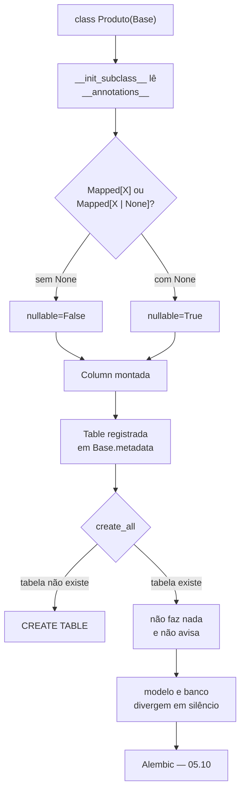

# 05.06 — ORM: modelos declarativos

> **Módulo 05 — PostgreSQL e MongoDB** · Nível: N2 · Tempo estimado: 3h · Código: `codigo/cap06/` e `codigo/modelo.py`

## 1. Objetivo

- **Mapear** classes para tabelas com `Mapped` e `mapped_column`.
- **Explicar** como a anotação de tipo do 04.14 vira restrição no banco.
- **Distinguir** `default` de `server_default`, e dizer quem alcança cada um.
- **Reconhecer** o que `create_all` não faz — e por que isso cria a necessidade do 05.10.

Ao final, você escreve os modelos da Aurora e prova que eles descrevem as tabelas que já existem.

---

## 2. Pré-requisitos

- [05.05 — SQLAlchemy Core](05-sqlalchemy-core.md) — a engine e o pool são os mesmos; muda o que vai por cima.
- [04.14 — Type hints](../04-Python-Avancado/14-type-hints.md) — aqui a anotação deixa de ser só documentação.
- [04.13 — Dataclasses](../04-Python-Avancado/13-dataclasses.md) — a comparação entre as duas formas de declarar campos.
- [05.03 — Tipos avançados](03-tipos-avancados.md) — a §6.3 depende de você lembrar por que `timestamptz` importa.

**Autoteste:** (1) O que o Python faz com `nome: str` em execução? (2) O que `@dataclass` gera? (3) Por que `timestamptz` e não `timestamp`?

---

## 3. Motivação

No 05.05, uma consulta parecia com isto:

```python
produtos.c.categoria
```

`produtos` veio da reflexão, e os 139 ms que ela custou aparecem em toda partida. Pior: nada em `produtos.c.categoriax` falha até virar SQL, e nenhuma ferramenta sabe que existe uma tabela de produtos.

Com um modelo declarativo, a mesma coisa vira:

```
Produto.__tablename__:        produtos
colunas:                      ['id', 'nome', 'categoria', 'preco_centavos', 'ativo']
Produto.nome é um:            InstrumentedAttribute
e Produto.nome == 'x' vira:   produtos.nome = :nome_1
```

**A linha que importa é a última.** `Produto.nome == 'x'` não devolve `True` nem `False`: devolve uma **expressão SQL**. É isso que permite escrever `select(Produto).where(Produto.nome == "x")` e ter o `mypy` conferindo os nomes antes de o programa rodar.

---

## 4. Modelo mental

**A classe não guarda dados. Ela descreve a tabela.**

Uma classe de modelo tem duas vidas ao mesmo tempo, e confundi-las é a origem de quase todo mal-entendido com ORM:

```
    Produto  (a CLASSE)               produto  (uma INSTÂNCIA)
    ───────────────────               ───────────────────────
    Produto.nome                      produto.nome
      → expressão SQL                   → o texto 'Mouse Sem Fio'
      → serve para WHERE                → serve para imprimir

    Produto.__table__                 produto.__dict__
      → a descrição da tabela           → os valores desta linha
```

O mesmo nome, `nome`, significa uma coisa na classe e outra na instância. O SQLAlchemy consegue isso porque `Produto.nome` é um descritor (`InstrumentedAttribute`) que se comporta diferente conforme quem pergunta.

**A frase que organiza o capítulo: a anotação decide o schema.** No 04.14 ela era uma promessa que o Python ignorava e o `mypy` cobrava. Aqui ela vira `NOT NULL` numa tabela de verdade — o que a torna, pela primeira vez no manual, executável.

---

## 5. Analogia

Um modelo é a **planta de um cômodo**, e uma instância é o cômodo construído.

Na planta você mede as paredes, marca onde vai a tomada e escreve "esta parede é estrutural". No cômodo você põe os móveis.

**E a analogia acerta no limite da §6.6:** alterar a planta depois de a casa construída não move parede nenhuma. Você precisa de uma obra — e obra em banco de dados tem nome, tem ferramenta e é o assunto do 05.10.

---

## 6. Teoria

### 6.1 A forma mínima

```python
class Base(DeclarativeBase):
    """A raiz de todos os modelos. Ela guarda o MetaData do projeto."""


class Produto(Base):
    __tablename__ = "produtos"

    id: Mapped[int] = mapped_column(primary_key=True)
    nome: Mapped[str] = mapped_column(Text)
    categoria: Mapped[str] = mapped_column(Text)
    preco_centavos: Mapped[int]
    ativo: Mapped[bool] = mapped_column(default=True, server_default="true")
```

Três coisas merecem nota. `Base` guarda o `MetaData` — o mesmo objeto que no 05.05 recebia as tabelas refletidas; agora ele é preenchido pelas classes. `__tablename__` é obrigatório. E `preco_centavos: Mapped[int]` **sem** `mapped_column` funciona: quando não há nada a configurar, a anotação sozinha já é a declaração.

### 6.2 A anotação decide `NOT NULL`

```
Cliente.nome              Mapped[str]          -> TEXT NOT NULL
Cliente.email             Mapped[str | None]   -> TEXT NULL
Produto.preco_centavos    Mapped[int]          -> INTEGER NOT NULL
Cotacao.observacao        Mapped[str | None]   -> TEXT NULL
```

**Este é o recurso que define o SQLAlchemy 2.0.** Na versão 1.x era preciso escrever `Column(String, nullable=False)`, e a anotação de tipo — quando existia — era decoração paralela que podia discordar da coluna.

Agora as duas coisas são a mesma declaração. Um campo que o `mypy` considera opcional é uma coluna que aceita nulo, por construção. **A classe inteira de bug em que o tipo Python diz uma coisa e o schema diz outra deixa de existir.**

O mapeamento padrão dos tipos:

| Anotação | Coluna |
|---|---|
| `Mapped[int]` | `INTEGER NOT NULL` |
| `Mapped[str]` | `VARCHAR NOT NULL` |
| `Mapped[bool]` | `BOOLEAN NOT NULL` |
| `Mapped[datetime.date]` | `DATE NOT NULL` |
| `Mapped[datetime.datetime]` | `TIMESTAMP` **sem fuso** |
| `Mapped[Decimal]` | `NUMERIC NOT NULL` |
| `Mapped[X \| None]` | a mesma coluna, `NULL` |

### 6.3 Onde o padrão está errado, e o comentário que ficou no código

Duas linhas da tabela acima precisam de intervenção, e as duas por motivos do 05.03.

`Mapped[str]` vira `VARCHAR` **sem tamanho**. Funciona no PostgreSQL e não é o que o 05.03/§6.7 recomenda; os modelos deste manual declaram `Text` de propósito.

E a segunda é mais séria:

```python
# `Mapped[datetime]` sozinho produz TIMESTAMP **WITHOUT TIME ZONE** — o
# tipo que o 05.03/§6.8 recomenda evitar para eventos. O SQLAlchemy não
# tem como adivinhar, e o padrão dele é o do SQL. Declarar é obrigatório.
INSTANTE = DateTime(timezone=True)
```

**Esse comentário existe porque o defeito aconteceu.** A primeira versão de `modelo.py` escreveu `criado_em: Mapped[dt.datetime]` e o DDL saiu assim:

```
registrada_em TIMESTAMP WITHOUT TIME ZONE DEFAULT now() NOT NULL
```

Um capítulo inteiro (05.03) argumentando que evento vai em `timestamptz`, e o modelo do capítulo seguinte gerando o tipo sem fuso — em silêncio, porque é o padrão da biblioteca. Com a correção:

```
registrada_em TIMESTAMP WITH TIME ZONE DEFAULT now() NOT NULL
```

**A lição não é sobre o SQLAlchemy.** O padrão dele é o padrão do SQL, e está tecnicamente certo. A lição é que **padrão razoável de biblioteca não é decisão de projeto**, e que a §6.7 existe justamente para pegar isso.

### 6.4 `default` e `server_default`

```
Produto.ativo default (Python):    ScalarElementColumnDefault(True)
Produto.ativo server_default:      true
Cotacao.registrada_em default:     None
... e server_default:              now()
INSERT cru, sem passar pelo ORM:   2026-08-06 11:05:54.488853-03:00
```

São dois mecanismos diferentes com nomes parecidos:

- **`default`** é do Python. O SQLAlchemy preenche o valor **antes** de mandar o `INSERT`. Ele vale só para objetos criados pelo ORM.
- **`server_default`** vira `DEFAULT` no `CREATE TABLE`. Ele vale para **qualquer** escrita — inclusive um `INSERT` cru, uma migração, um script de carga, ou outro serviço em outra linguagem.

A última linha da medição prova a diferença: aquele `INSERT` não passou pelo ORM em momento algum, e a data apareceu.

**A regra: `server_default` para tudo que precisa valer sempre.** `default` do Python é conveniência para o caso comum; `server_default` é garantia. Quando o campo importa — carimbo de criação, estado inicial, contador —, declare os dois.

### 6.5 `create_all`, e a lacuna que ele deixa

```
cotacoes existe agora?             True
colunas no banco:                  ['id', 'moeda', 'valor', 'observacao',
                                    'registrada_em']
depois de acrescentar 'fonte':     ['id', 'moeda', 'valor', 'observacao',
                                    'registrada_em']
```

A coluna `fonte` foi acrescentada ao modelo, `create_all` rodou de novo, e **nada aconteceu**.

`Base.metadata.create_all(engine)` cria as tabelas que **faltam**. Ele não altera as que existem, não acrescenta coluna, não muda tipo e não cria índice em tabela já criada — e **não avisa**.

A consequência é a pior possível: o modelo diz que a coluna existe, o banco não tem, e a falha acontece na primeira consulta que a mencionar, em produção, com uma mensagem sobre coluna inexistente que ninguém relaciona com o `create_all` de três meses atrás.

**`create_all` serve para testes e para a primeira criação.** Qualquer schema que evolui precisa de migrações, e é por isso que o 05.10 existe.

O mesmo fenômeno com índices:

```
índices declarados:                [('produtos_categoria_idx', ['categoria'])]
índices que existem no banco:      []
```

### 6.6 Conferir modelo contra banco

O modelo pode divergir do banco de duas formas, e uma delas se esconde bem:

```
clientes (5 colunas)      nomes iguais
produtos (5 colunas)      nomes iguais
pedidos (4 colunas)       nomes iguais
itens_pedido (5 colunas)  nomes iguais

-- e agora comparando os TIPOS, e não os nomes --
(nenhuma divergência)
```

**A segunda parte dessa cena foi acrescentada depois, e foi ela que encontrou o defeito da §6.3.** Comparar nomes de coluna dizia "iguais" enquanto `criado_em` era `timestamptz` no banco e `timestamp` no modelo — uma divergência que só apareceria ao gravar um `datetime` com fuso e vê-lo voltar sem.

Uma conferência de modelo contra banco que compara só nomes dá uma sensação de segurança que ela não sustenta. Comparar tipos custa cinco linhas a mais.

### 6.7 Restrições e índices na classe

```python
__table_args__ = (
    CheckConstraint("preco_centavos >= 0", name="produtos_preco_centavos_check"),
    Index("produtos_categoria_idx", "categoria"),
)
```

```
CheckConstraint         produtos_preco_centavos_check
PrimaryKeyConstraint    None
índices declarados:     [('produtos_categoria_idx', ['categoria'])]
```

**Nomeie as restrições.** Sem nome, o PostgreSQL gera um e o Alembic (05.10) tem dificuldade em referenciá-lo numa migração. Com nome, a mensagem de erro que chega ao Python (`UniqueViolation`, 05.04/§6.8) diz **qual** restrição foi violada, e o código pode reagir de acordo.

`unique=True` e `index=True` também podem ir direto no `mapped_column`, quando a restrição envolve uma coluna só.

### 6.8 Propriedades: o que o ORM não faz e a classe faz

```python
@property
def preco(self) -> Decimal:
    return Decimal(self.preco_centavos) / 100
```

Isto é Python puro (04.09) dentro de um modelo, e é onde o ORM ganha da tupla do 05.04: os dados e a regra que os interpreta ficam no mesmo lugar.

**A ressalva importante:** uma `@property` **não existe para o banco**. Você não pode filtrar por ela — `where(Produto.preco > 100)` não compila, porque `preco` não é coluna. Quando o cálculo precisa ir para o `WHERE`, o instrumento é `hybrid_property`, que sabe se traduzir em SQL, ou uma coluna gerada no banco (05.03/A3.6).

---

## 7. Funcionamento interno

**Como a anotação vira coluna.** Quando o Python cria a classe, o `DeclarativeBase` intercepta a criação através do `__init_subclass__` (04.11) e lê `__annotations__`. Para cada anotação do tipo `Mapped[X]`, ele consulta um registro que associa tipos Python a tipos SQL, decide `nullable` pela presença de `| None`, e monta um objeto `Column`.

**Por que `Produto.nome` se comporta de duas formas.** O que fica no atributo de classe é um `InstrumentedAttribute`, que implementa o protocolo de descritor (`__get__`). Quando acessado pela classe, ele devolve a si mesmo — e ele sobrecarrega `__eq__`, `__gt__`, `__lt__` para devolver expressões em vez de booleanos. Quando acessado por uma instância, ele devolve o valor guardado.

É o mesmo mecanismo dos métodos especiais do 04.12, aplicado a um propósito que o capítulo não previa: **`__eq__` que não responde "são iguais?" e sim "monte a comparação"**.

**E a sobrecarga tem uma consequência prática que vale medir em vez de supor.** `if produto.nome == "x"` numa instância funciona normalmente. Na classe, o resultado depende do operador:

```
Produto.nome == 'x'        bool = False    tipo = BinaryExpression
Produto.ativo == True      bool = False    tipo = BinaryExpression
Produto.nome != 'x'        bool = True     tipo = BinaryExpression
Produto.id > 5             bool -> TypeError: Boolean value of this clause
                                             is not defined
Produto.nome.in_(['a'])    bool -> TypeError: Boolean value of this clause
                                             is not defined
```

**Três comportamentos diferentes, e nenhum deles é o esperado.** Com `==`, o `if` **nunca entra** — o SQLAlchemy define `__bool__` para comparar **identidade**, e `Produto.nome` nunca é a string `"x"`. Com `!=`, ele **sempre entra**, pelo mesmo motivo invertido. E com `>`, `<` ou `in_()`, ele levanta `TypeError`.

**O terceiro caso é o bom**, e é o único: ele falha alto. Os dois primeiros são silenciosos — um `if` que nunca entra e outro que sempre entra, ambos sem erro nenhum.

---

## 8. Visualização do fluxo



**Como ler:** a metade de cima acontece no `import`, uma vez, sem tocar no banco. A metade de baixo acontece quando alguém chama `create_all` — e o ramo da direita é o assunto do capítulo 05.10, que existe por causa dele.

---

## 9. Aplicação prática

**Aurora, situação real.** Os modelos em `codigo/modelo.py` descrevem as quatro tabelas que o módulo 03 já usava. Não há schema novo — e isso é deliberado, porque o exercício de escrever modelos para um banco que já existe é o que você vai fazer no trabalho.

O ponto de decisão aparece em `ItemPedido`:

```python
pedido_id: Mapped[int] = mapped_column(
    ForeignKey("pedidos.id", ondelete="CASCADE"))
```

```python
itens: Mapped[list[ItemPedido]] = relationship(
    back_populates="pedido", cascade="all, delete-orphan")
```

**São duas cascatas diferentes, e ter as duas é intencional.** `ondelete="CASCADE"` é do **banco**: apagar um pedido com um `DELETE` direto remove os itens, e vale para qualquer cliente do banco. `cascade="all, delete-orphan"` é do **ORM**: remover um item da lista `pedido.itens` em Python o apaga do banco.

Ter só a do ORM deixa o banco sem proteção contra quem escreve por fora. Ter só a do banco faz o ORM ficar com objetos órfãos em memória. **É a mesma dualidade da §6.4** — o Python cobre o caminho do Python, o servidor cobre todos.

**E a `@property total_centavos`** existe para responder à pergunta que o 05.04/D1 deixou aberta: onde mora a regra de negócio. Aqui ela mora na classe, ao lado dos dados que ela usa — com a ressalva da §6.8 de que ela não vai para o `WHERE`.

---

## 10. Código comentado

De `codigo/cap06/modelos.py`, a cena que conferiu tipos:

```python
tipos_banco = {c["name"]: c["type"].compile(engine.dialect)
               for c in inspetor.get_columns(modelo.__tablename__)}
for coluna in modelo.__table__.columns:
    no_banco = tipos_banco[coluna.name]
    no_modelo = coluna.type.compile(engine.dialect)
    if no_banco != no_modelo:
        linha(...)
```

**A primeira versão usava `str(c["type"])` no lado do banco e `compile()` no lado do modelo.** O resultado foi uma divergência falsa: `TIMESTAMP` contra `TIMESTAMP WITH TIME ZONE`, porque `str()` de um tipo do PostgreSQL usa a representação genérica e `compile()` usa a do dialeto. Os dois lados precisam ser compilados pelo mesmo dialeto para a comparação significar alguma coisa.

**O detalhe é pequeno e a lição não:** uma conferência automática que compara representações diferentes gera alarme falso, e alarme falso treina a equipe a ignorar o alarme. Uma verificação em que ninguém confia é pior do que nenhuma.

---

## 11. Erros comuns

| # | Erro | Sintoma | Correção |
|---|---|---|---|
| 1 | `Mapped[datetime]` para evento | coluna sem fuso | `DateTime(timezone=True)` |
| 2 | Esquecer `| None` numa coluna opcional | `NOT NULL` indevido | anotar corretamente |
| 3 | Confiar em `create_all` para evoluir | coluna some sem aviso | Alembic (05.10) |
| 4 | Só `default`, sem `server_default` | escrita externa fica sem valor | os dois |
| 5 | Restrição sem `name` | migração difícil, erro anônimo | nomear |
| 6 | Filtrar por `@property` | não compila | `hybrid_property` ou coluna |
| 7 | `if Produto.nome == "x"` | **nunca** entra, sem erro | usar a instância |
| 8 | Conferência que compara só nomes | divergência de tipo passa | comparar compilado |
| 9 | `Mapped[str]` sem `Text` | `VARCHAR` sem tamanho | declarar `Text` |

**O 7 é o mais difícil de encontrar**, porque a linha parece correta e não levanta erro. Com `==` o `if` nunca entra; com `!=` ele sempre entra. Só os operadores de ordem (`>`, `<`) e `in_()` falham alto, com `TypeError`.

---

## 12. Boas práticas

**Um módulo `modelo.py` com todos os modelos e nada mais.** Sem consultas, sem engine, sem sessão — só a descrição do schema. Isso permite que o Alembic (05.10) importe os modelos sem arrastar a aplicação inteira.

**Declare `Text` e `DateTime(timezone=True)` explicitamente.** Os dois padrões da biblioteca são razoáveis e não são a decisão deste projeto.

**`server_default` para tudo que precisa valer sempre.**

**Nomeie todas as restrições**, e considere adotar uma convenção de nomes no `MetaData` — ela faz o SQLAlchemy gerar nomes previsíveis para todas as restrições sozinho.

**Rode `mypy --strict` nos modelos.** Eles passam:

```
Success: no issues found in 1 source file
```

**E escreva a conferência modelo-contra-banco como teste**, comparando nomes **e** tipos. Ela custa vinte linhas e pega a classe inteira de defeito da §6.5.

---

## 13. Performance

O ganho principal deste capítulo é de partida: os 139 ms da reflexão do 05.05 viram **zero**, porque as classes são código Python que o `import` já carrega.

**O custo que aparece em troca** é o do próprio `import`: definir modelos executa o `__init_subclass__` de cada classe, monta as colunas e registra as tabelas. Para quatro modelos isso é imperceptível; para os duzentos de um sistema grande, é a diferença entre um processo que sobe em 0,3 s e um que sobe em 1,5 s — o que importa em ambientes que criam processos sob demanda.

**E há um custo que este capítulo não mede e o 05.09 vai medir:** transformar linhas em objetos. Cada `Produto` construído a partir de uma linha custa mais do que uma tupla, e essa diferença é o argumento central de quem prefere o Core. O 05.09 põe número nisso.

---

## 14. Mercado

O estilo declarativo com `Mapped` é o padrão desde o SQLAlchemy 2.0 (2023). Código anterior usa `Column(...)` sem anotação, e as duas formas convivem — mas material da internet escrito para 1.x induz ao estilo antigo, que funciona e perde a integração com o `mypy`.

**O que aparece em entrevista:** a diferença entre `default` e `server_default` é pergunta de nível pleno. "Por que `create_all` não resolve" é a pergunta que abre para migrações, e quem responde "porque ele não altera tabelas existentes" já demonstrou ter operado um sistema.

**E uma comparação que vale conhecer:** o ORM do Django usa uma abordagem diferente — os modelos são a fonte da verdade e o framework gera as migrações automaticamente, com menos configuração e menos controle. SQLAlchemy separa modelo de migração de propósito, o que dá mais trabalho e permite schemas que o ORM não descreve inteiramente.

---

## 15. Entrevistas

**P1. Como o SQLAlchemy 2.0 decide se uma coluna aceita nulo?**
Pela anotação: `Mapped[str]` gera `NOT NULL` e `Mapped[str | None]` gera coluna anulável. É a mesma declaração que o `mypy` lê, o que elimina a possibilidade de o tipo Python e o schema discordarem.

**P2. `default` ou `server_default`?**
`default` é preenchido pelo Python antes do `INSERT` e vale só para objetos criados pelo ORM. `server_default` vira `DEFAULT` no `CREATE TABLE` e vale para qualquer escrita, inclusive migrações e outros serviços. Para campos que importam, declare os dois.

**P3. `create_all` serve em produção?**
Não. Ele cria as tabelas que faltam e **não altera** as que existem — acrescentar uma coluna ao modelo e rodar `create_all` de novo não faz nada e não avisa. O modelo e o banco divergem em silêncio até a primeira consulta falhar. Para schema que evolui, migrações.

**P4. Por que `Produto.nome == "x"` não devolve um booleano?**
Porque `Produto.nome` é um `InstrumentedAttribute` que sobrecarrega `__eq__` para devolver uma expressão SQL, o que permite montar consultas em Python. E num `if`, essa expressão se comporta de três formas: `==` é sempre falso (o `__bool__` compara identidade), `!=` é sempre verdadeiro, e `>` ou `in_()` levantam `TypeError`. Só o terceiro caso falha alto.

---

## 16. Exercícios guiados

Enunciados em [`exercicios/cap06.md`](exercicios/cap06.md); gabaritos em [`exercicios/gabaritos/cap06.md`](exercicios/gabaritos/cap06.md).

**Aquecimento (4):** dizer o DDL de oito anotações; prever o que `create_all` faz em seis situações; achar o erro em seis modelos; escolher `default`, `server_default` ou os dois.

**Aplicação (3):** escrever os modelos de um schema dado; escrever a conferência modelo-contra-banco como teste; corrigir um modelo que diverge do banco.

**Desafio (1):** uma convenção de nomes de restrições aplicada a todo o `MetaData`.

**Mini projeto (1):** os modelos do catálogo com `JSONB` do 05.03.

---

## 17. Desafios

O D1 pede uma `naming_convention` no `MetaData` que gere nomes previsíveis para chaves primárias, estrangeiras, únicas, `CHECK` e índices.

**O que o exercício ensina não é a sintaxe do dicionário.** É que restrições sem nome são um problema que só aparece na primeira migração — quando o Alembic precisa remover uma restrição e descobre que o nome dela foi gerado pelo PostgreSQL, é diferente em cada ambiente, e não está em lugar nenhum do código.

A pergunta que fecha pede que você descreva o que acontece ao adotar a convenção num projeto que **já tem** tabelas criadas com nomes gerados. A resposta honesta envolve uma migração de renomeação, e ela não é automática.

---

## 18. Mini projeto

**Os modelos do catálogo**, unindo este capítulo com o 05.03.

Requisitos: a tabela `produtos` da §9 do 05.03, com `atributos jsonb`; o `CHECK` de `jsonb_typeof`; o índice GIN declarado no modelo; `Mapped[dict[str, Any]]` para a coluna JSONB; e a conferência modelo-contra-banco passando.

**A parte que ensina:** `Mapped[dict]` não vira `JSONB` sozinho — o SQLAlchemy precisa de `mapped_column(JSONB)`, do dialeto do PostgreSQL. E aí surge a pergunta de projeto que o exercício cobra: um modelo que usa tipos específicos de um banco deixa de ser portável. Quando isso é aceitável, e quando não é?

---

## 19. Revisão

**O que fica:**

1. A classe descreve a tabela; a instância guarda a linha.
2. `Produto.nome` é expressão SQL; `produto.nome` é valor.
3. `Mapped[X]` vira `NOT NULL`; `Mapped[X | None]` aceita nulo.
4. `Mapped[datetime]` sozinho gera coluna **sem** fuso — declare `DateTime(timezone=True)`.
5. `default` alcança o ORM; `server_default` alcança todo mundo.
6. `create_all` cria o que falta e não altera o que existe, sem avisar.
7. Conferência que compara só nomes deixa passar divergência de tipo.
8. `@property` não vai para o `WHERE`.
9. Num `if`, `Produto.nome == "x"` é sempre falso, `!=` é sempre verdadeiro, e `>` levanta `TypeError`.

**Repetição espaçada:** D+1 escreva um modelo de memória e confira o DDL; D+7 explique a P3; D+30 refaça a conferência da §6.6; D+90 releia a §6.3 antes de criar qualquer coluna de data.

---

## 20. Checklist

- [ ] Escrevo um modelo declarativo com `Mapped` e `mapped_column`.
- [ ] Explico como a anotação decide `NOT NULL`.
- [ ] Declaro `Text` e `DateTime(timezone=True)` de propósito.
- [ ] Distingo `default` de `server_default` com um exemplo.
- [ ] Digo o que `create_all` não faz.
- [ ] Escrevo a conferência modelo-contra-banco comparando tipos.
- [ ] Nomeio restrições.
- [ ] Sei por que `@property` não filtra.
- [ ] Reconheço `if Produto.nome == "x"` como defeito, e sei o que ele faz.

---

## 21. Próximo capítulo

[05.07 — ORM: sessões e ciclo de vida](07-orm-sessoes.md) traz o objeto que faltava: a `Session`, que guarda os objetos que você carregou, acompanha o que mudou neles e decide **quando** mandar SQL.

É o capítulo que explica por que um `produto.preco_centavos = 100` grava sozinho sem você chamar `UPDATE` — e por que às vezes não grava.
