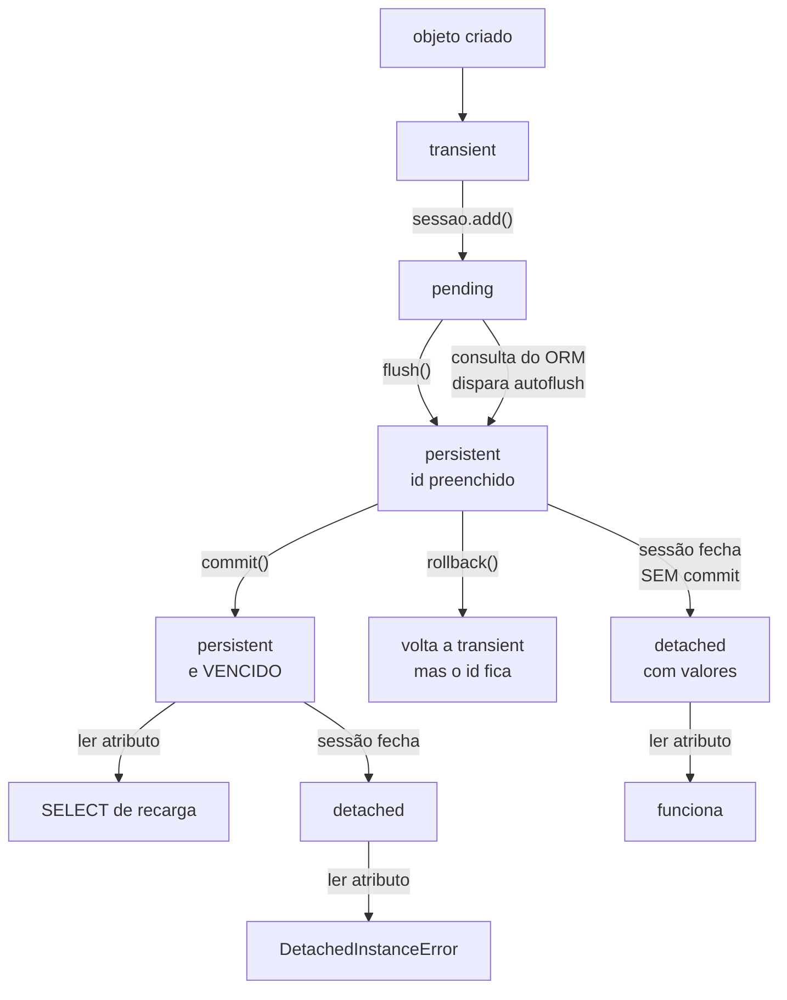

# 05.07 — ORM: sessões e ciclo de vida

> **Módulo 05 — PostgreSQL e MongoDB** · Nível: N2 · Tempo estimado: 3h30 · Código: `codigo/cap07/`

## 1. Objetivo

- **Prever** quando a sessão manda SQL, e quando ela não manda.
- **Distinguir** `flush` de `commit`, e dizer o que cada um encerra.
- **Explicar** o `DetachedInstanceError` pela causa certa.
- **Escolher** o escopo de uma sessão numa aplicação.

Ao final, você sabe por que `produto.preco_centavos = 1` grava sem ninguém escrever `UPDATE` — e quando não grava.

---

## 2. Pré-requisitos

- [05.06 — Modelos declarativos](06-orm-modelos.md) — a §7 daquele capítulo (o `InstrumentedAttribute`) é o mecanismo que este usa.
- [05.05 — Core](05-sqlalchemy-core.md) — `engine.begin()` e `sessao.begin()` têm o mesmo desenho.
- [03.15 — Transações e ACID](../03-SQL/15-transacoes-e-acid.md) — `commit` e `rollback` agora com objetos junto.
- [04.20 — Context managers](../04-Python-Avancado/20-context-managers.md).

**Autoteste:** (1) O que é um `InstrumentedAttribute`? (2) O que `engine.begin()` faz ao sair sem exceção? (3) O que um `ROLLBACK` desfaz no banco?

---

## 3. Motivação

Uma função de três linhas, sem nenhum `UPDATE`:

```python
produto = sessao.get(Produto, 2)
produto.preco_centavos = 9990
sessao.commit()
```

O preço mudou no banco. Ninguém escreveu SQL.

E a mesma sessão, respondendo à mesma pergunta de duas formas:

```
um cliente pendente, sem flush:
COUNT nomeando a CLASSE:    9
COUNT nomeando a TABELA:    8
```

**Duas respostas para "quantos clientes existem", na mesma sessão, no mesmo instante.** A primeira contou o cliente que ainda não foi gravado; a segunda não. A diferença entre as duas linhas de código é ter escrito `Cliente` ou `Cliente.__table__`.

Este capítulo é sobre o objeto que decide essas coisas. Ele é a parte do ORM que mais surpreende, e a que mais aparece em incidente.

---

## 4. Modelo mental

**A sessão é uma área de rascunho com memória de quem já foi buscado.**

Ela faz três coisas ao mesmo tempo:

```
    1. MAPA DE IDENTIDADE       um objeto por chave primária
       sessao.get(Produto, 1)   ─┐
       sessao.get(Produto, 1)   ─┴─► o MESMO objeto, um SELECT só

    2. RASTRO DE MUDANÇAS       o que você mexeu, e o valor anterior
       produto.preco = 9990     ─► dirty={2}, antes=[8990], depois=[9990]

    3. UNIDADE DE TRABALHO      junta tudo e manda de uma vez
       sessao.commit()          ─► os UPDATE/INSERT/DELETE necessários
```

Medido:

```
é o MESMO objeto?                True
quantos SELECT foram emitidos?   1
por select(), é o mesmo?         True
```

**A frase que organiza o capítulo: você não manda comandos, você descreve um estado — e a sessão calcula os comandos.** É por isso que atribuir a um atributo grava, e é por isso que prever *quando* o SQL sai exige saber as regras deste capítulo.

---

## 5. Analogia

A sessão é o **carrinho de compras**, e o `commit` é o caixa.

Enquanto você anda pelo mercado, o carrinho acumula: você pega, troca de ideia, devolve à prateleira. Nada disso é uma compra — é rascunho.

**E a analogia acerta em três limites de uma vez.** O `flush` é passar os produtos no caixa sem pagar: os itens já estão registrados, o total aparece, e ainda dá para cancelar tudo. O `commit` é pagar. E o `rollback` é desistir na fila — o carrinho volta vazio, **inclusive na sua memória**, que é o que a §6.8 mede, e contraria a intuição.

---

## 6. Teoria

### 6.1 O mapa de identidade

```
primeira busca:                  Produto(id=1, nome='Fone Bluetooth XZ-9', ...)
segunda busca:                   Produto(id=1, nome='Fone Bluetooth XZ-9', ...)
é o MESMO objeto?                True
quantos SELECT foram emitidos?   1
por select(), é o mesmo?         True
objetos na sessão:               1
```

Dentro de uma sessão existe **um objeto por chave primária**. Buscar duas vezes não traz duas cópias, e a segunda busca por `get()` nem vai ao banco.

**A consequência boa:** alterar o objeto num lugar altera "os dois", porque nunca houve dois. Duas funções que carregam o pedido 7 e mexem nele estão mexendo no mesmo objeto, e a sessão consolida.

**A consequência ruim:** o objeto pode estar velho. Se outra transação alterou aquela linha, a sessão continua entregando o que carregou — e é justamente para isso que existe o vencimento da §6.6.

Repare que `select()` **foi** ao banco (é uma consulta, não uma busca por chave) e mesmo assim devolveu o mesmo objeto: o SQLAlchemy leu a linha, viu que aquela chave já está no mapa, e devolveu o objeto existente **descartando os valores lidos**. Isso surpreende quem espera que uma consulta atualize os objetos em memória.

### 6.2 Os quatro estados

```
recém-criado:        transient
depois de add():     pending
depois de flush():   persistent
depois de expunge(): detached
```

| Estado | A sessão conhece? | Existe no banco? |
|---|---|---|
| **transient** | não | não |
| **pending** | sim | ainda não |
| **persistent** | sim | sim, nesta transação |
| **detached** | não | sim |

`detached` é o estado que produz o erro mais comum do capítulo, e a §6.7 mostra que a causa não é a que todo mundo diz.

### 6.3 Como a sessão sabe o que mudou

```
antes de mexer, dirty:    set()
depois de mexer, dirty:   {2}
valor antigo guardado:    [8990]
valor novo:               [9990]
depois do rollback:       8990
```

Cada atributo mapeado é um `InstrumentedAttribute` (05.06/§7), e o `__set__` dele não guarda só o valor novo: ele guarda também **o anterior**. É por isso que a sessão consegue montar um `UPDATE` com apenas as colunas que mudaram, em vez de reescrever a linha inteira.

**Esse é o padrão *unit of work*.** Você descreve o estado desejado; a biblioteca calcula a diferença e emite o mínimo de SQL para chegar lá.

### 6.4 `flush` e `commit`

```
id antes do flush:                None
id depois do flush:               21
no flush:                         INSERT INTO pedidos (cliente_id, data, status)
                                  VALUES (...)
a transação ainda está aberta?    True
depois do rollback, o id:         21
e o estado:                       transient
```

- **`flush()`** manda o SQL pendente e **não** encerra a transação.
- **`commit()`** faz um `flush` e depois encerra a transação.

O `id` apareceu no `flush`, porque quem o gera é o banco (a coluna de identidade) e ele só responde quando o `INSERT` sai.

**E a última linha é uma armadilha bonita.** Depois do `rollback`, o objeto voltou a `transient` — aquele `INSERT` deixou de existir —, mas o atributo `id` **continua valendo 21** em memória. Readicionar esse objeto tentaria inserir com o id 21, que pode já pertencer a outra linha. Objeto que passou por `rollback` deve ser descartado, não reaproveitado.

### 6.5 Autoflush, e a pegadinha das duas respostas

```
COUNT nomeando a CLASSE:   9
emitido:                   INSERT INTO clientes (...)
                           SELECT count(*) AS count_1 FROM clientes

COUNT nomeando a TABELA:   8
emitido:                   SELECT count(*) AS count_1 FROM clientes
```

Antes de executar uma consulta, a sessão manda o que está pendente. O motivo é coerência: uma consulta deve enxergar o que você acabou de adicionar.

**Mas isso só vale para comandos do ORM.** `select_from(Cliente)` nomeia a classe e é ORM; `select_from(Cliente.__table__)` nomeia a tabela e é Core. O Core passa direto, sem disparar o `flush` — e devolve um número que ignora o que está na sessão.

**Não é defeito: é a fronteira das duas camadas do 05.05 aparecendo.** Mas é a fonte de um bug difícil, porque as duas linhas de código são quase idênticas e as duas respostas são plausíveis.

O efeito colateral mais assustador do autoflush é outro: **um `SELECT` que falha com erro de `INSERT`**. A consulta disparou a gravação pendente, a gravação violou uma restrição, e o rastro aponta para uma linha que só lia.

`with sessao.no_autoflush:` desliga o comportamento num trecho, quando você precisa consultar sem gravar ainda.

### 6.6 O commit que vence tudo

```
ler um atributo depois do commit:   Teclado Mecanico K2
quantos SELECT isso custou?         1
recarga:                            SELECT produtos.id, produtos.nome, ...

com expire_on_commit=False:         Teclado Mecanico K2
quantos SELECT isso custou?         0
```

Por padrão, `commit()` marca **todos** os objetos da sessão como vencidos. O próximo acesso a qualquer atributo dispara um `SELECT` para recarregar.

**Isso é correto e é caro.** Correto porque, encerrada a transação, o que está na memória pode estar desatualizado — outra transação pode ter alterado a linha. Caro porque é uma consulta por objeto, invisível no código, e num laço sobre cem objetos são cem consultas.

`expire_on_commit=False` desliga. **O preço é trabalhar com dados possivelmente vencidos**, e a escolha depende do que a aplicação faz depois do commit. Em serviço web que responde e encerra, desligar costuma ser certo; em processo longo que continua usando os objetos, é como ler o jornal de ontem.

### 6.7 `DetachedInstanceError`, e a causa que quase todo mundo erra

```
fechada SEM commit, estado:   detached
lendo um atributo fora:       Webcam HD 1080

fechada COM commit, estado:   detached
lendo um atributo fora:       DetachedInstanceError: Instance <Produto ...>
                              is not bound to a Session

com expire_on_commit=False:   Webcam HD 1080
```

**Os dois objetos estão `detached`. Só um falha.**

A explicação repetida por aí — "você não pode usar um objeto depois de fechar a sessão" — está errada. O objeto fechado **sem** commit continua com todos os valores carregados e responde normalmente.

**A causa real é a combinação de duas coisas:** o `commit` venceu o objeto, e depois a sessão fechou. Quando o acesso ao atributo tenta recarregar, não há mais sessão para fazê-lo. O erro não é sobre o objeto estar solto — é sobre ele estar **vazio e sem quem o preencha**.

Daí saem as três correções possíveis, e escolher entre elas é decisão de projeto:

1. `expire_on_commit=False` — o objeto sai da sessão com os valores.
2. Converter para dataclass ou dicionário **dentro** da sessão — a fronteira do 04.15, aplicada aqui.
3. Manter a sessão aberta enquanto os objetos forem usados — o que é a §6.9.

### 6.8 O `rollback` mexe na memória

```
na memória, antes do rollback:   1
na memória, depois:              12900
o valor original era:            12900
estado do objeto:                persistent
```

O `rollback` não desfaz só o banco: ele vence todos os objetos da sessão, que recarregam do banco no próximo acesso. **O valor que você tinha atribuído em Python desaparece.**

Isso contraria a intuição de quem pensa no `rollback` como algo que acontece "lá no servidor" — e é o comportamento correto, porque a alternativa seria uma sessão cujos objetos afirmam um estado que o banco não tem.

### 6.9 O escopo de uma sessão

```python
with Session(engine) as sessao:
    with sessao.begin():
        pedido = Pedido(cliente_id=1, data=hoje, status="pendente")
        sessao.add(pedido)
```

```
pedido criado com id:        22
depois do with, gravado?     True
status fora do CHECK:        CheckViolation
pedidos ao final:            20
```

`with sessao.begin()` comita ao sair sem exceção e desfaz quando há exceção — o mesmo desenho de `engine.begin()` do 05.05, agora com os objetos junto. O segundo bloco levantou `CheckViolation` e a contagem final ficou intacta.

**A regra de escopo: uma sessão por unidade de trabalho.** Numa API, isso costuma ser uma sessão por requisição. Numa tarefa em lote, uma por lote.

**O que não fazer:** uma sessão global compartilhada. Ela acumula objetos indefinidamente (o mapa de identidade nunca esvazia), mistura o trabalho de contextos diferentes, e não é segura entre threads.

---

## 7. Funcionamento interno

**O que acontece no `commit()`, em ordem:**

1. Um `flush`: a sessão percorre os objetos novos, alterados e removidos, ordena as operações respeitando as dependências de chave estrangeira, e emite os `INSERT`, `UPDATE` e `DELETE`.
2. `COMMIT` na conexão.
3. Todos os objetos são marcados como vencidos.
4. A conexão volta para o pool do 05.05.

**O passo 1 tem uma sutileza que evita muito erro:** você pode adicionar um `Pedido` e os `ItemPedido` dele na mesma sessão sem se preocupar com a ordem. A sessão sabe que o item depende do pedido pela chave estrangeira, insere o pedido primeiro, pega o `id` gerado, e preenche o `pedido_id` dos itens.

**E o passo 3 é o que a §6.6 mede.** Vencer é barato — só marca; o custo aparece no próximo acesso, e por isso ele não está no `commit` e sim espalhado pelo código seguinte, onde ninguém o procura.

**Sobre threads:** uma `Session` não é segura para uso concorrente. O mapa de identidade e o rastro de mudanças são estruturas mutáveis sem trava, e duas threads mexendo na mesma sessão produzem os defeitos do 04.21 — inclusive o tipo que não reproduz em teste. A regra é uma sessão por thread, o que o `scoped_session` automatiza.

---

## 8. Visualização do fluxo



**Como ler:** a coluna do meio é o caminho feliz. Os dois ramos de baixo são a §6.7 — o mesmo estado `detached` com dois destinos, e o que os separa é o `commit` ter acontecido antes. O ramo `rollback` guarda a armadilha da §6.4: o estado volta, o `id` não.

---

## 9. Aplicação prática

**Aurora, situação real.** Criar um pedido com itens, baixando estoque, é a operação que decide o desenho da camada de dados.

```python
def criar_pedido(sessao: Session, cliente_id: int,
                 linhas: list[tuple[int, int]]) -> Pedido:
    pedido = Pedido(cliente_id=cliente_id, data=date.today(),
                    status="pendente")
    for produto_id, quantidade in linhas:
        produto = sessao.get(Produto, produto_id)
        if produto is None:
            raise ProdutoInexistente(produto_id)
        pedido.itens.append(ItemPedido(
            produto_id=produto_id, quantidade=quantidade,
            preco_unitario_centavos=produto.preco_centavos))
    sessao.add(pedido)
    return pedido
```

**Três decisões estão embutidas nessas linhas.**

A função **não comita**. Ela recebe a sessão e devolve o objeto; quem chama decide o escopo da transação. É a resposta à pergunta que ficou aberta no 05.04/D1 e no 05.05/§18 — e agora ela tem um nome: a unidade de trabalho pertence a quem sabe qual é o trabalho.

Os itens são acrescentados a `pedido.itens`, e não inseridos separadamente. A sessão resolve a ordem e a chave estrangeira sozinha (§7).

E `preco_unitario_centavos` é copiado do produto **agora**. Não é redundância: é o preço no momento da compra, que precisa sobreviver a uma alteração de tabela de preços. Um `JOIN` com `produtos` para descobrir quanto o cliente pagou é um defeito de modelagem, não uma otimização de espaço.

**No endpoint, o escopo:**

```python
with Session(engine) as sessao, sessao.begin():
    pedido = criar_pedido(sessao, cliente_id, linhas)
    baixar_estoque(sessao, linhas)
    resposta = PedidoSaida.model_validate(pedido, from_attributes=True)
return resposta
```

A conversão para o modelo Pydantic acontece **dentro** do bloco, o que é a correção 2 da §6.7 — e é a mesma fronteira do 04.15: objeto do ORM não sai da camada de dados.

---

## 10. Código comentado

O `codigo/cap07/sessoes.py` traz um instrumento que os capítulos 05.08 e 05.09 vão usar muito:

```python
@event.listens_for(engine, "before_cursor_execute")
def _anotar(conn, cursor, comando, parametros, contexto, muitos):
    SQL_VISTO.append(" ".join(comando.split())[:88])
```

**Isso é melhor do que `echo=True` para o propósito do capítulo**, porque permite *contar*. As perguntas da §6.6 — "quantos `SELECT` isso custou?" — só se respondem com uma lista que dá para zerar antes e medir depois.

É o mesmo instrumento que o 05.09 vai usar para tornar o problema N+1 visível, e vale copiar para os seus projetos: um registrador de SQL que conta é a forma mais barata de descobrir que uma função inocente emite trinta consultas.

**E uma correção que a execução impôs.** A cena 4 falhou na primeira vez:

```
psycopg.errors.NotNullViolation: null value in column "id" of relation "pedidos"
```

O `laboratorio.py` criava as tabelas com `id integer PRIMARY KEY`, sem geração automática — o módulo 03 carregava ids explícitos e nunca precisou de mais. O modelo do 05.06 assume que o banco gera o `id`, e a conferência da §6.6 daquele capítulo **não pegou isso**, porque ela compara nomes e tipos, e não a existência de uma sequência.

A correção mudou o laboratório para `GENERATED BY DEFAULT AS IDENTITY` — e trouxe junto um problema clássico, que virou comentário no código:

```python
# As linhas acima entraram com id EXPLÍCITO, e isso não avança a
# sequência da coluna de identidade: o próximo INSERT sem id tentaria
# 1 e daria chave duplicada. É o defeito clássico de restaurar um
# dump — e a correção é empurrar a sequência para depois do maior id.
```

---

## 11. Erros comuns

| # | Erro | Sintoma | Correção |
|---|---|---|---|
| 1 | Sessão global compartilhada | memória crescendo, dados cruzados | uma por unidade de trabalho |
| 2 | Sessão entre threads | defeitos que não reproduzem | uma por thread |
| 3 | Devolver objeto do ORM da camada de dados | `DetachedInstanceError` | converter dentro da sessão |
| 4 | Culpar o fechamento da sessão pelo erro | correção errada | a causa é o `commit` ter vencido |
| 5 | `select_from(X.__table__)` esperando autoflush | número desatualizado | nomear a classe |
| 6 | Reaproveitar objeto depois de `rollback` | conflito de chave | descartar |
| 7 | Laço lendo atributos depois do commit | N consultas invisíveis | `expire_on_commit=False` |
| 8 | Comitar dentro da função de domínio | não dá para agrupar operações | comitar na borda |
| 9 | Esperar que `select()` atualize objetos em memória | valores velhos | `populate_existing()` |

**O 9 merece nota**, porque parece impossível: você consulta, o banco devolve valores novos, e o objeto em memória continua com os antigos — porque o mapa de identidade devolveu o objeto que já existia. `execution_options(populate_existing=True)` força a substituição.

---

## 12. Boas práticas

**Uma sessão por unidade de trabalho, criada com `with`.** Em API, uma por requisição; em lote, uma por lote.

**Comite na borda, não no domínio.** Funções de domínio recebem a sessão e não decidem transação.

**Converta objetos do ORM antes de devolvê-los** para fora da camada de dados. Dataclass, `TypedDict` ou modelo Pydantic — qualquer coisa que não dependa de sessão.

**Use um registrador de SQL no desenvolvimento** e olhe a contagem. É o instrumento do 05.09.

**Prefira `sessao.get()` a `select().where(id == ...)`** quando a busca é por chave primária: ele consulta o mapa de identidade antes de ir ao banco.

**Não guarde objetos do ORM em cache** entre requisições. Eles carregam uma referência à sessão de origem.

---

## 13. Performance

O número que mais importa deste capítulo é invisível no código:

| Situação | Consultas |
|---|---|
| `get()` do mesmo id, duas vezes | 1 |
| Ler um atributo depois do `commit` | 1 por objeto |
| O mesmo com `expire_on_commit=False` | 0 |

**Um laço que percorre cem objetos depois de um `commit` emite cem `SELECT`.** Não há nada no código que sugira isso — a linha é `for p in produtos: print(p.nome)`.

**A defesa em ordem de preferência:** não fazer trabalho depois do `commit` (o escopo da §6.9 resolve sozinho); `expire_on_commit=False` quando o trabalho é curto e o dado pode ser de um instante atrás; e conversão para objetos simples dentro da sessão quando os dados vão viajar.

**O que este capítulo ainda não mede** é o custo de transformar linha em objeto, e o custo do carregamento preguiçoso de relacionamentos. Os dois são o assunto do 05.09, e o segundo é o problema mais conhecido de ORM.

---

## 14. Mercado

A sessão é o assunto de ORM que mais gera pergunta em entrevista de nível pleno, porque é onde o abstrato encosta no concreto: quem já operou sabe explicar `DetachedInstanceError`; quem só leu repete a explicação errada da §6.7.

**O padrão *unit of work* não é do SQLAlchemy.** Ele foi catalogado por Martin Fowler em *Patterns of Enterprise Application Architecture* (2002), e aparece no Hibernate (Java), no Entity Framework (.NET) e no Doctrine (PHP) com o mesmo nome e o mesmo comportamento. Aprender aqui transfere.

**A diferença em relação ao Django** vale conhecer: o ORM do Django não tem sessão. Cada `save()` emite SQL na hora, e a transação é controlada por um decorador. É mais simples de prever e não faz o cálculo de diferenças da §6.3 — cada `save()` reescreve a linha inteira, salvo se você listar os campos.

---

## 15. Entrevistas

**P1. O que a sessão do SQLAlchemy faz?**
Três coisas: mantém um mapa de identidade (um objeto por chave primária), rastreia o que mudou em cada objeto guardando o valor anterior, e no `commit` calcula e emite o SQL mínimo. É o padrão *unit of work*.

**P2. `flush` ou `commit`?**
`flush` manda o SQL pendente e mantém a transação aberta — é quando o `id` gerado pelo banco aparece. `commit` faz o `flush` e encerra a transação. Um `rollback` depois de um `flush` desfaz tudo.

**P3. Por que dá `DetachedInstanceError`?**
Não é por fechar a sessão: um objeto fechado sem `commit` continua respondendo. O erro vem de o `commit` ter **vencido** o objeto e a sessão ter fechado depois — o acesso tenta recarregar e não há quem faça. Correções: `expire_on_commit=False`, converter dentro da sessão, ou manter a sessão aberta.

**P4. O que é autoflush, e onde ele surpreende?**
Antes de uma consulta do ORM, a sessão grava o que está pendente, para que a consulta enxergue. Surpreende de duas formas: um `SELECT` pode falhar com erro de `INSERT`, e um comando do Core (nomeando `__table__` em vez da classe) **não** dispara o autoflush, devolvendo um resultado que ignora o que está na sessão.

---

## 16. Exercícios guiados

Enunciados em [`exercicios/cap07.md`](exercicios/cap07.md); gabaritos em [`exercicios/gabaritos/cap07.md`](exercicios/gabaritos/cap07.md).

**Aquecimento (4):** prever quantas consultas cada trecho emite; dizer o estado do objeto em oito pontos; achar o erro em seis funções; decidir onde fica o `commit`.

**Aplicação (3):** instrumentar um registrador de SQL e medir; consertar uma camada que devolve objetos do ORM; escrever `criar_pedido` com transação na borda.

**Desafio (1):** um `unit of work` explícito para a Aurora, com teste.

**Mini projeto (1):** o serviço de pedidos, com sessão por requisição.

---

## 17. Desafios

O D1 pede uma classe `UnidadeDeTrabalho` que encapsule a sessão e exponha repositórios, no estilo que aparece em projetos maiores.

**A parte que ensina é a segunda pergunta:** como testar sem banco? A resposta habitual — trocar a implementação por uma falsa que guarda em listas — funciona, e esconde exatamente o que este capítulo mostrou: autoflush, vencimento e ordenação de `INSERT` não existem numa lista Python. Um teste que passa contra a falsa e falha contra o Postgres é o resultado esperado do exercício, e a lição é sobre o limite de dublês.

---

## 18. Mini projeto

**O serviço de pedidos**, com sessão por requisição.

Requisitos: uma `sessionmaker` no módulo; um gerador que abre e fecha a sessão por operação; `criar_pedido`, `cancelar_pedido` e `listar_pedidos_do_cliente`; conversão para dataclasses na saída; e o registrador de SQL contando as consultas de cada operação.

**O número que o projeto cobra:** `listar_pedidos_do_cliente` com os itens de cada pedido. Conte as consultas. Se der uma por pedido, você reproduziu o problema N+1 — e o 05.09 é o capítulo que o resolve.

---

## 19. Revisão

**O que fica:**

1. A sessão mantém um objeto por chave primária.
2. `select()` devolve o objeto que já está no mapa, descartando os valores lidos.
3. Cada atributo guarda o valor anterior — é assim que o `UPDATE` sai mínimo.
4. `flush` manda SQL; `commit` manda e encerra.
5. Depois de `rollback`, o objeto volta a `transient` e o `id` fica.
6. Autoflush vale para comandos do ORM, não para os do Core.
7. `commit` vence todos os objetos; o próximo acesso custa um `SELECT` cada.
8. `DetachedInstanceError` vem do vencimento, não do fechamento.
9. `rollback` também desfaz a memória.
10. Uma sessão por unidade de trabalho; commit na borda.

**Repetição espaçada:** D+1 refaça as cenas 5 e 7; D+7 explique a P3 sem consultar; D+30 conte as consultas de uma função sua; D+90 releia a §6.5 antes de depurar qualquer número que "não bate".

---

## 20. Checklist

- [ ] Explico o mapa de identidade e o que `is` responde.
- [ ] Nomeio os quatro estados e passo um objeto por todos.
- [ ] Digo a diferença entre `flush` e `commit`.
- [ ] Sei por que o `id` aparece no `flush`.
- [ ] Reconheço a diferença entre nomear a classe e nomear `__table__`.
- [ ] Explico `DetachedInstanceError` pela causa certa.
- [ ] Digo o que `rollback` faz com os objetos em memória.
- [ ] Escolho o escopo de uma sessão para um cenário dado.
- [ ] Instrumento e conto as consultas de uma operação.

---

## 21. Próximo capítulo

[05.08 — ORM: relacionamentos](08-orm-relacionamentos.md) usa o `relationship` que já apareceu nos modelos e explica o que ele faz: navegar de pedido para itens, de item para produto, e de cliente para pedidos — com `back_populates` mantendo os dois lados coerentes.

E é lá que o carregamento preguiçoso entra em cena, preparando o problema que o 05.09 vai medir.
