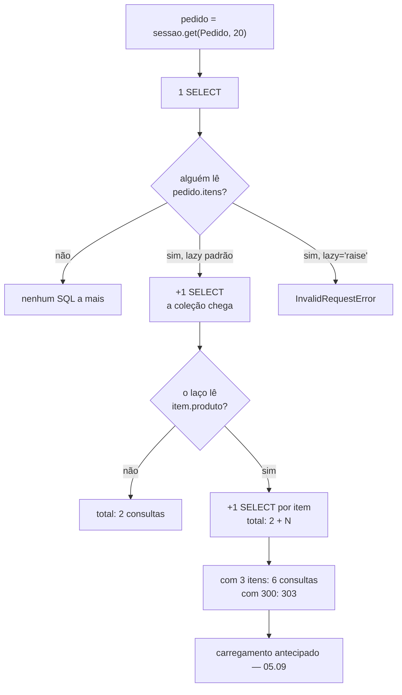

# 05.08 — ORM: relacionamentos

> **Módulo 05 — PostgreSQL e MongoDB** · Nível: N2 · Tempo estimado: 3h · Código: `codigo/cap08/`

## 1. Objetivo

- **Implementar** 1-N e N-N com `relationship` e `back_populates`.
- **Contar** as consultas que um ponto custa.
- **Distinguir** a cascata do ORM da cascata do banco.
- **Decidir** entre `secondary` e uma classe de associação.

Ao final, você navega entre objetos sem escrever `JOIN` — e sabe o preço disso.

---

## 2. Pré-requisitos

- [05.07 — Sessões](07-orm-sessoes.md) — o carregamento preguiçoso depende de haver sessão.
- [05.06 — Modelos](06-orm-modelos.md) — `relationship` já apareceu lá, sem explicação.
- [03.07 — JOIN](../03-SQL/07-join-parte-1-inner.md) — é o que o ORM emite por baixo.
- [03.13 — Constraints e integridade](../03-SQL/13-constraints-e-integridade.md) — `ON DELETE CASCADE`.

**Autoteste:** (1) O que o `commit` faz com os objetos da sessão? (2) O que é uma chave estrangeira? (3) O que `ON DELETE CASCADE` faz?

---

## 3. Motivação

Quatro tabelas atravessadas com pontos, sem escrever um `JOIN`:

```
o pedido:                     Pedido(id=1, data=date(2026, 6, 2), status='pago')
pedido.cliente:               Cliente(id=1, nome='Ana Souza')
pedido.itens:                 [ItemPedido(id=1, produto_id=2, quantidade=1),
                               ItemPedido(id=2, produto_id=9, quantidade=2)]
o produto do primeiro item:   Produto(id=2, nome='Mouse Sem Fio', preco=89.9)
e de volta: cliente.pedidos:  [1, 3, 8, 15]
total do pedido (property):   R$ 189.70
```

Isso é o argumento a favor de ORM, e ele é forte: nenhum `JOIN` escrito, nenhum id manipulado à mão, e a regra de negócio (`total_centavos`) ao lado dos dados.

E aqui está a conta:

```
get(Pedido, 20):              1 consulta(s)
ler .cliente:                 1 consulta(s)
ler .itens:                   1 consulta(s)
ler .produto de 3 itens:      3 consulta(s)
total para UM pedido:         6 consultas
```

**Seis consultas para exibir um pedido.** Nenhuma delas aparece no código — o que aparece são pontos. Este capítulo é sobre as duas coisas ao mesmo tempo: a comodidade e o custo dela.

---

## 4. Modelo mental

**O `relationship` não é uma coluna. É uma consulta guardada, que roda quando alguém olha.**

```
    o que está na tabela              o que o relationship faz
    ────────────────────              ────────────────────────
    pedidos.cliente_id = 1            pedido.cliente
                                        → SELECT * FROM clientes WHERE id = 1
                                        → e devolve o OBJETO

    (nada em pedidos)                 pedido.itens
                                        → SELECT * FROM itens_pedido
                                          WHERE pedido_id = 20
                                        → e devolve uma LISTA
```

A chave estrangeira mora numa tabela só. O `relationship` existe **nos dois lados**, e `back_populates` é o que os mantém sincronizados na memória.

**A frase que organiza o capítulo: cada ponto é uma ida ao banco que você não escreveu.** Enquanto o objeto está sozinho, isso é comodidade. Dentro de um laço, é o problema que o 05.09 mede.

---

## 5. Analogia

Um `relationship` é o **botão "ver pedidos deste cliente"** de um sistema.

Ele parece um atributo do cliente e não é: é uma busca que alguém escreveu uma vez e você aciona sem pensar. Clicar num cliente é barato. Clicar em cem clientes, um por um, é cem buscas — e é a mesma operação.

**E a analogia acerta no `lazy="raise"` da §6.7:** existem telas em que o botão deve estar desabilitado, porque quem a projetou já trouxe os dados de outro jeito e um clique a mais estragaria o desempenho. Desabilitar o botão é melhor do que confiar que ninguém vai clicar.

---

## 6. Teoria

### 6.1 Um-para-muitos, nos dois lados

```python
class Pedido(Base):
    itens: Mapped[list[ItemPedido]] = relationship(
        back_populates="pedido", cascade="all, delete-orphan",
        order_by="ItemPedido.id")

class ItemPedido(Base):
    pedido_id: Mapped[int] = mapped_column(
        ForeignKey("pedidos.id", ondelete="CASCADE"))
    pedido: Mapped[Pedido] = relationship(back_populates="itens")
```

A **chave estrangeira** fica no lado "muitos" — é `itens_pedido.pedido_id`. Os **relacionamentos** ficam nos dois, e `back_populates` diz a cada um qual é o seu par.

O tipo da anotação decide a forma: `Mapped[list[ItemPedido]]` é coleção, `Mapped[Pedido]` é um só. O SQLAlchemy 2.0 lê isso da anotação, como fez com `NOT NULL` no 05.06.

### 6.2 O custo de um ponto

```
get(Pedido, 20):           1 consulta(s)
ler .cliente:              1 consulta(s)
                           SELECT clientes.id, clientes.nome, clientes...
ler .itens:                1 consulta(s)
ler .produto de 3 itens:   3 consulta(s)
```

O carregamento padrão é **preguiçoso** (`lazy="select"`): a coleção só vai ao banco quando alguém a lê.

**A vantagem é real:** carregar um pedido não arrasta cliente, itens e produtos se você só queria a data. **A desvantagem também:** ler `item.produto` dentro de um laço de três itens custa três consultas, e o código que faz isso é `for item in pedido.itens: print(item.produto.nome)`.

**Três é aceitável. Trezentos não é** — e a diferença entre os dois é o tamanho da lista, não o código. É por isso que o problema tem nome e capítulo próprio.

### 6.3 `back_populates` mantém a memória coerente

```
o item novo conhece o pedido?    None
depois do append, item.pedido:   Pedido(id=3, data=date(2026, 6, 11), ...)
e sem nenhum flush?              True
itens antes / depois:            2 / 3
```

Acrescentar à lista de um lado preencheu o atributo do outro, **na memória, antes de qualquer SQL**.

**Sem `back_populates`, os dois lados discordam** até você recarregar do banco — e o código que lê `item.pedido` logo depois de um `append` recebe `None`, o que produz um `AttributeError` distante da causa.

O parâmetro antigo `backref` cria o outro lado automaticamente e é desencorajado hoje: ele deixa um atributo que não aparece na classe onde você o procura, o que atrapalha o `mypy` e a leitura.

### 6.4 Duas cascatas, e por que ter as duas

```
itens criados:                 2
depois de pop() na lista:      1
o item removido virou:         órfão, apagado pelo delete-orphan
depois de delete(pedido):      0
DELETE cru, sem ORM nenhum:    sobraram 0 itens
```

São mecanismos independentes com efeitos parecidos:

| Mecanismo | Onde vive | Vale para |
|---|---|---|
| `cascade="all, delete-orphan"` | o ORM | quem passa pelo Python |
| `ON DELETE CASCADE` | o banco | **todo mundo** |

`delete-orphan` faz `pedido.itens.pop()` apagar a linha: o item ficou sem dono, e um item de pedido não existe sozinho.

`ON DELETE CASCADE` faz um `DELETE FROM pedidos` levar os itens junto — inclusive quando o `DELETE` vem do `psql`, de uma migração ou de outro serviço.

**Ter só a do ORM deixa o banco desprotegido.** Ter só a do banco deixa o ORM com objetos em memória que não existem mais. **É a mesma dualidade do `default` e `server_default` do 05.06/§6.4**, e a resposta é a mesma: declare as duas.

### 6.5 Muitos-para-muitos

```python
produto_etiqueta = Table(
    "produto_etiqueta", Base.metadata,
    Column("produto_id", Integer, ForeignKey("produtos.id",
                                             ondelete="CASCADE"),
           primary_key=True),
    Column("etiqueta_id", Integer, ForeignKey("etiquetas.id",
                                              ondelete="CASCADE"),
           primary_key=True),
)

class Produto(Base):
    etiquetas: Mapped[list[Etiqueta]] = relationship(
        secondary=produto_etiqueta, back_populates="produtos")
```

```
etiquetas do fone:              [Etiqueta('sem-fio'), Etiqueta('promocao')]
produtos da etiqueta sem-fio:   [1, 2]
linhas na tabela de ligação:    3
consultando por etiqueta:       [1, 2]
```

`secondary=` esconde a tabela do meio: você trabalha com duas listas e nunca escreve a terceira tabela.

**Repare que a tabela de ligação é uma `Table` do Core, e não uma classe.** Isso é intencional e é a §6.6.

### 6.6 Quando o vínculo tem atributo, ele vira classe

```
item 1:   Mouse Sem Fio x1 a R$ 89.90
item 2:   Mousepad Grande x2 a R$ 49.90
```

Um pedido também "tem produtos", e a tentação é modelar isso com `secondary`. **Seria errado**, porque a ligação carrega informação: quantidade e preço unitário.

**O critério é limpo:** se a ligação é só uma ligação, `secondary`. Se ela guarda qualquer atributo — quantidade, preço, data de inclusão, quem incluiu —, ela é uma entidade e merece uma classe.

E o preço unitário guardado em `itens_pedido` merece nota: ele é o preço **no momento da compra**, e não uma cópia redundante da tabela de produtos. Descobrir quanto o cliente pagou com um `JOIN` em `produtos` daria a resposta errada assim que alguém mudar a tabela de preços.

### 6.7 `lazy="raise"`: transformar surpresa em erro

```
o pedido carregou:   Pedido(id=4, data=date(2026, 6, 14), status='cancelado')
lendo .itens:        InvalidRequestError: 'Pedido.itens' is not available
                     due to lazy='raise'
```

`raiseload(Pedido.itens)` faz a consulta preguiçosa **virar erro**.

É um instrumento de disciplina, e o lugar dele é claro: num endpoint que você otimizou com carregamento antecipado (05.09), `raiseload` garante que ninguém acrescente um ponto inocente meses depois e reintroduza o N+1 sem perceber.

O mesmo efeito se declara no modelo com `lazy="raise"`, valendo para todos os usos daquele relacionamento — o que é uma decisão mais forte e exige que toda consulta declare o que quer carregar.

### 6.8 A ordem de uma coleção não é estável

```
itens do pedido 20:              [28, 29, 30]
declarado no modelo:             order_by="ItemPedido.id"

-- e por que isso não é preciosismo --
sem ORDER BY, agora:             [28, 29, 30]
depois de um UPDATE no id 28:    [29, 30, 28]
depois de um UPDATE no id 29:    [30, 28, 29]
a posição física de cada linha:  [(30, '(0,30)'), (28, '(0,35)'), (29, '(0,36)')]
```

**Dois `UPDATE` inofensivos inverteram a ordem da lista.**

A causa está no 05.01/§6.3: o MVCC **não altera a linha** — ele escreve uma versão nova, que vai para o fim da tabela. A coluna `ctid` mostra a posição física, e ela confirma: a linha 28 saiu de onde estava e foi para `(0,35)`.

Sem `ORDER BY`, o PostgreSQL devolve na ordem que for mais barata, que costuma ser a física. **A ordem "certa" que aparece em desenvolvimento é uma coincidência que sobrevive até a primeira atualização em produção.**

**Declare `order_by` em toda coleção que alguém vai exibir.** É uma linha, e o defeito que ela evita é do tipo que ninguém reproduz.

---

## 7. Funcionamento interno

**Como o SQLAlchemy sabe qual `JOIN` fazer.** Ao definir o `relationship`, ele procura uma chave estrangeira entre as duas tabelas e usa aquela condição. Quando existe mais de um caminho — duas chaves estrangeiras da mesma tabela para a mesma outra —, ele não adivinha e levanta `AmbiguousForeignKeysError`, exigindo `primaryjoin` explícito. Um `Pedido` com `endereco_entrega_id` e `endereco_cobranca_id` cai nesse caso.

**Como a coleção sabe que precisa carregar.** O atributo é um `InstrumentedAttribute` (05.06/§7) cujo `__get__` verifica se o valor já está no dicionário do objeto. Se não estiver, ele pede à sessão que emita a consulta — e é por isso que um objeto `detached` não consegue: não há sessão para pedir (05.07/§6.7).

**E o que acontece no `flush` com uma coleção alterada.** A sessão compara a lista atual com a que carregou, calcula acrescentados e removidos, e decide entre `INSERT`, `UPDATE` do `pedido_id` para `NULL`, ou `DELETE`. O `delete-orphan` é o que muda a segunda opção para a terceira: sem ele, o item removido da lista fica no banco com a chave estrangeira nula — e, se a coluna for `NOT NULL`, o `flush` falha com uma mensagem que não menciona a lista.

---

## 8. Visualização do fluxo



**Como ler:** cada losango é um ponto no seu código. O caminho da direita é o custo acumulado, e a caixa de baixo mostra por que o mesmo código muda de categoria conforme o tamanho dos dados — o que é a definição do problema que o próximo capítulo resolve.

---

## 9. Aplicação prática

**Aurora, situação real.** A tela "meus pedidos" mostra, para cada pedido, a data, o status, o total e os nomes dos produtos.

O código natural:

```python
for pedido in cliente.pedidos:
    print(pedido.data, pedido.status, pedido.total_centavos)
    for item in pedido.itens:
        print("  ", item.produto.nome)
```

Contando pelos números da §6.2: uma consulta para os pedidos, uma por pedido para os itens, uma por item para o produto. Com quatro pedidos de três itens, são **17 consultas** para uma tela.

**A correção não é reescrever em SQL.** É dizer ao ORM o que você vai usar:

```python
pedidos = sessao.scalars(
    sa.select(Pedido)
    .where(Pedido.cliente_id == cliente_id)
    .options(selectinload(Pedido.itens).selectinload(ItemPedido.produto))
).all()
```

O 05.09 mede o efeito disso e explica as opções. O que importa aqui é o diagnóstico: **o defeito não está no laço, está no que ele não declarou**.

**E há uma decisão de modelagem escondida na tela.** `pedido.total_centavos` é uma `@property` que soma os itens em Python — o que exige carregar todos os itens de todos os pedidos só para mostrar um número. Um `total_centavos` gravado na tabela seria denormalização, com o custo de manter a coerência; uma coluna gerada no banco resolveria a coerência e não funciona porque a soma vem de outra tabela. **A terceira via é uma consulta agregada separada**, que traz só os totais — e é o que a §17 pede.

---

## 10. Código comentado

De `codigo/modelo.py`, o comentário sobre a tabela de associação:

```python
# Tabela de associação pura: ela só liga duas chaves e não tem atributo
# nenhum. Quando o vínculo TEM atributo — como quantidade e preço em
# `itens_pedido` —, ele merece uma classe, e não uma Table.
```

E de `codigo/cap08/relacionamentos.py`, a parte da cena 8 que foi acrescentada depois:

```python
sessao.execute(sa.text(
    "UPDATE itens_pedido SET quantidade = quantidade WHERE id = 28"))
sessao.commit()
linha("depois de um UPDATE no id 28:", sessao.scalars(crua).all())
```

**A primeira versão do capítulo afirmava que "a ordem pode mudar depois de um `UPDATE`" e não mostrava.** Uma afirmação assim é do tipo que se aceita sem incorporar — soa a preciosismo.

Mostrando, ela vira outra coisa. O `UPDATE` é deliberadamente vazio (`quantidade = quantidade`), o que torna o resultado mais forte: **nem o valor mudou, e a ordem mudou**. E o `ctid` na linha seguinte explica por quê, ligando de volta ao MVCC do 05.01.

**A lição de método:** quando o manual for afirmar que algo "pode acontecer", ou ele mostra acontecendo, ou a afirmação sai. Foi a mesma decisão do 04.21 com a corrida que não reproduzia — só que ali a execução contrariou o roteiro, e aqui confirmou.

---

## 11. Erros comuns

| # | Erro | Sintoma | Correção |
|---|---|---|---|
| 1 | Laço lendo relacionamento | N+1 consultas invisíveis | carregamento antecipado (05.09) |
| 2 | Sem `back_populates` | um lado desatualizado na memória | declarar nos dois |
| 3 | Só cascata do ORM | `DELETE` externo deixa órfãos | `ON DELETE CASCADE` também |
| 4 | Só cascata do banco | objetos fantasmas na sessão | `delete-orphan` também |
| 5 | Coleção sem `order_by` | ordem muda depois de `UPDATE` | declarar |
| 6 | `secondary` para vínculo com atributo | não há onde pôr a quantidade | classe de associação |
| 7 | `JOIN` com `produtos` para saber o preço pago | preço muda o histórico | guardar no item |
| 8 | Duas chaves estrangeiras para a mesma tabela | `AmbiguousForeignKeysError` | `primaryjoin` |
| 9 | `backref` em código novo | atributo que não aparece na classe | `back_populates` |

**O 7 não é erro de ORM — é de modelagem** — e aparece aqui porque o relacionamento torna o atalho tentador: `item.produto.preco_centavos` está a um ponto de distância e responde a pergunta errada.

---

## 12. Boas práticas

**`back_populates` nos dois lados, sempre.** `backref` só em código legado.

**As duas cascatas.** `cascade="all, delete-orphan"` no relacionamento e `ondelete="CASCADE"` na chave estrangeira.

**`order_by` em toda coleção exibida.**

**`secondary` só para ligação pura.** No primeiro atributo, vire classe.

**Conte as consultas de cada tela** com o registrador do 05.07/§10. É a única forma de descobrir o N+1 antes do usuário.

**`raiseload` nos endpoints que você otimizou**, para que a otimização não seja desfeita por engano.

---

## 13. Performance

| Operação | Consultas |
|---|---|
| Carregar um pedido | 1 |
| Mais o cliente | 2 |
| Mais os itens | 3 |
| Mais o produto de cada um dos 3 itens | 6 |
| A tela da §9, com 4 pedidos de 3 itens | 17 |

**A progressão é o ponto.** Cada linha acrescenta um ponto no código e uma ida ao banco. Em desenvolvimento, com um cliente de dois pedidos, ninguém nota. Em produção, com um cliente de duzentos pedidos, a mesma tela emite mais de oitocentas consultas.

**E o custo real não é o tempo de cada consulta** — elas são rápidas, como o 05.02/§13 mediu (0,7 ms). É a **latência acumulada**: oitocentas idas e voltas de 0,7 ms são 560 ms de espera, e num banco em outra máquina, com 2 ms de rede, são 1,6 s.

O 05.09 mede a alternativa e mostra que ela custa uma consulta a mais, não duzentas.

---

## 14. Mercado

Relacionamentos são a parte do ORM que mais aparece em código de produção e a que mais gera incidente de desempenho. A pergunta "o que é N+1" é obrigatória em entrevista de backend, e a resposta completa inclui o que este capítulo mostrou: o defeito nasce da comodidade do ponto.

**A crítica de quem prefere SQL** é exatamente aqui: um `JOIN` escrito à mão declara o que traz, e um `relationship` esconde. A defesa do ORM é que a declaração existe — em `options()` — e que ela fica junto da consulta, não espalhada. As duas posições são defensáveis, e a maioria dos projetos usa ORM para o caminho comum e SQL para relatórios.

**O padrão de associação com atributo** tem nome no catálogo de Fowler: *association class*. Ele aparece igual em Hibernate e Entity Framework, e o critério da §6.6 vale nos três.

---

## 15. Entrevistas

**P1. Como você mapeia 1-N no SQLAlchemy?**
Chave estrangeira no lado "muitos", `relationship` nos dois lados, ligados por `back_populates`. A anotação decide a forma: `Mapped[list[X]]` é coleção, `Mapped[X]` é referência única.

**P2. Qual a diferença entre `cascade="delete-orphan"` e `ON DELETE CASCADE`?**
O primeiro é do ORM e vale para quem passa pelo Python — remover da lista apaga a linha. O segundo é do banco e vale para qualquer cliente, inclusive um `DELETE` no `psql`. São independentes, e um sistema correto declara os dois.

**P3. Quando usar `secondary` e quando criar uma classe?**
`secondary` quando a ligação é só uma ligação. Se ela guarda qualquer atributo — quantidade, preço, data —, vira entidade e merece classe. `itens_pedido` é o exemplo: ele tem quantidade e preço unitário.

**P4. Por que declarar `order_by` numa coleção?**
Porque sem `ORDER BY` o banco devolve na ordem que quiser, e no PostgreSQL essa ordem muda depois de um `UPDATE` — o MVCC escreve uma versão nova no fim da tabela. Medido: dois `UPDATE` que não alteraram valor nenhum inverteram uma lista de três itens.

---

## 16. Exercícios guiados

Enunciados em [`exercicios/cap08.md`](exercicios/cap08.md); gabaritos em [`exercicios/gabaritos/cap08.md`](exercicios/gabaritos/cap08.md).

**Aquecimento (4):** contar consultas em seis trechos; dizer onde fica a chave estrangeira em seis casos; achar o erro em seis modelos; escolher `secondary` ou classe.

**Aplicação (3):** modelar um catálogo com etiquetas; provar as duas cascatas; instrumentar a tela da §9 e contar.

**Desafio (1):** o total do pedido sem carregar os itens.

**Mini projeto (1):** o painel do cliente, com contagem de consultas medida.

---

## 17. Desafios

O D1 pede o total de cada pedido **sem** carregar os itens — o problema que a §9 deixou aberto.

Há três soluções, e o exercício pede as três com medição: uma consulta agregada separada, devolvendo `pedido_id → total`; uma `column_property` com subconsulta, que faz o SQLAlchemy acrescentar a soma ao `SELECT` do pedido; e uma coluna denormalizada mantida por gatilho.

**A terceira pergunta é a que vale a nota:** qual delas você usaria numa tela que lista mil pedidos, e qual usaria num relatório mensal? As respostas são diferentes, e o motivo é que a `column_property` adiciona uma subconsulta a **toda** carga de pedido, inclusive as que não precisam do total.

---

## 18. Mini projeto

**O painel do cliente**: pedidos, itens, produtos e totais numa tela.

Requisitos: montar a versão ingênua e medir; montar a versão declarada e medir; e um teste que **afirme** um limite de consultas — no espírito do D-034 do módulo 04.

**O teste é a parte que ensina.** Ele falha quando alguém acrescenta um ponto, meses depois, e é a única defesa automática contra o N+1 voltar. A pergunta que fecha pede o número que você escolheu como limite e a justificativa — e "o que mede hoje" é resposta ruim, porque qualquer mudança legítima o quebra.

---

## 19. Revisão

**O que fica:**

1. `relationship` é uma consulta guardada, não uma coluna.
2. A chave estrangeira fica no lado "muitos"; os relacionamentos, nos dois.
3. Cada ponto é uma consulta que você não escreveu.
4. Um pedido com três itens custa seis consultas para exibir.
5. `back_populates` mantém os dois lados coerentes antes de qualquer SQL.
6. Duas cascatas independentes: a do ORM e a do banco. Declare as duas.
7. `secondary` para ligação pura; classe quando há atributo.
8. Preço pago mora no item, não no produto.
9. `raiseload` transforma consulta preguiçosa em erro.
10. Sem `order_by`, a ordem muda depois de um `UPDATE`.

**Repetição espaçada:** D+1 conte as consultas da §6.2 de memória; D+7 explique a P2; D+30 refaça a cena 8; D+90 releia a §9 antes de montar qualquer tela com lista.

---

## 20. Checklist

- [ ] Escrevo 1-N com `relationship` nos dois lados.
- [ ] Conto as consultas que uma navegação custa.
- [ ] Explico o que `back_populates` faz antes do `flush`.
- [ ] Declaro as duas cascatas e digo o que cada uma cobre.
- [ ] Escolho entre `secondary` e classe de associação.
- [ ] Sei por que o preço pago mora no item.
- [ ] Uso `raiseload` para proteger um endpoint otimizado.
- [ ] Declaro `order_by` e explico por quê com o `ctid`.

---

## 21. Próximo capítulo

[05.09 — ORM: consultas e carregamento](09-orm-consultas.md) é o capítulo N3 do bloco, e o mais denso do módulo. Ele mede o N+1 que este capítulo montou, compara as estratégias de carregamento com números, e responde quando o ORM deixa de compensar.

É também onde o registrador de SQL do 05.07 vira instrumento principal: quase todo o capítulo é contar consultas.
