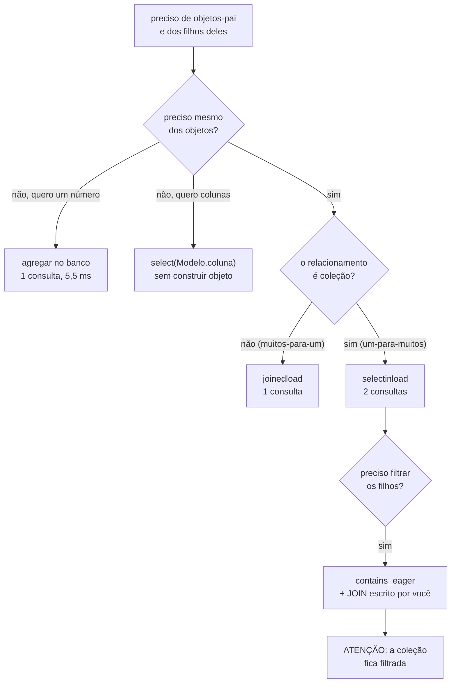

# 05.09 — ORM: consultas e carregamento

> **Módulo 05 — PostgreSQL e MongoDB** · Nível: N3 · Tempo estimado: 4h · Código: `codigo/cap09/`

## 1. Objetivo

- **Depurar** o problema N+1 contando consultas, e não por intuição.
- **Escolher** entre `joinedload`, `selectinload` e `subqueryload` com número na mão.
- **Reconhecer** as armadilhas de cada estratégia, inclusive a que devolve dados errados.
- **Decidir** quando não usar o ORM.

Ao final, você mede o custo de uma tela antes de o usuário medi-lo por você.

---

## 2. Pré-requisitos

- [05.08 — Relacionamentos](08-orm-relacionamentos.md) — o N+1 foi montado lá.
- [05.07 — Sessões](07-orm-sessoes.md) — o registrador de SQL da §10 é o instrumento deste capítulo.
- [05.05 — Core](05-sqlalchemy-core.md) — a §6.8 compara ORM com Core.
- [03.14 — Índices](../03-SQL/14-indices.md) e [03.09 — Subconsultas](../03-SQL/09-subconsultas.md).

**Autoteste:** (1) Quantas consultas custa ler `pedido.itens`? (2) O que faz `raiseload`? (3) O que é uma subconsulta?

---

## 3. Motivação

O laço que o 05.08 ensinou a escrever, sobre 300 pedidos:

```
laço ingênuo sobre 300 pedidos:   301 consulta(s)   660.0 ms
```

O mesmo laço, com uma linha a mais dizendo o que ele vai usar:

```
joinedload:                         1 consulta(s)    33.8 ms
```

**Trezentas e uma consultas viraram uma. Seiscentos e sessenta milissegundos viraram trinta e três.** Vinte vezes mais rápido, com a mesma lógica, o mesmo banco e o mesmo resultado.

E o mais importante: **o código lento não tem nada de errado à vista.** Ele lê `pedido.itens`, que é exatamente o que o capítulo anterior ensinou. O defeito não está no que foi escrito — está no que não foi declarado.

---

## 4. Modelo mental

**O ORM não sabe o que você vai usar. Você precisa dizer.**

```
    sem declarar                        declarando
    ────────────                        ──────────
    select(Pedido)                      select(Pedido)
      → 1 consulta                        .options(selectinload(Pedido.itens))
                                          → 2 consultas, sempre
    pedido.itens (300 vezes)
      → +300 consultas                  pedido.itens (300 vezes)
                                          → +0, já está na memória
    total: 301                          total: 2
```

O carregamento preguiçoso é um bom padrão: ele não traz o que ninguém pediu. **O problema é que "pedir" acontece uma vez por objeto, dentro de um laço, e nada no código soma isso para você.**

**A frase que organiza o capítulo: o N+1 não é um erro de escrita, é uma omissão de declaração.** Por isso ele não aparece em revisão de código lendo o laço — aparece contando consultas.

---

## 5. Analogia

Fazer compras para uma receita de vinte ingredientes.

O carregamento preguiçoso é ir ao mercado quando você precisa de cada um: pega a farinha, volta, começa, percebe que falta ovo, vai de novo. Vinte viagens. **Cada viagem é curta** — e é isso que engana: nenhuma delas parece cara.

O carregamento antecipado é ler a receita inteira antes e fazer uma lista. Uma viagem.

**E a analogia acerta nos três limites do capítulo.** `joinedload` é levar tudo num carrinho só, e se a lista for enorme o carrinho não passa na porta (§6.4). `selectinload` é duas viagens combinadas, uma para secos e outra para frios. E a §6.7 é a lição maior: **se você só quer saber quanto vai custar, não precisa comprar nada** — pergunte o preço.

---

## 6. Teoria

### 6.1 O N+1, medido

```
(base de medição: 2020 pedidos, 10031 itens)

laço ingênuo sobre 300 pedidos:   301 consulta(s)   660.0 ms
```

Uma consulta para os 300 pedidos, e uma para os itens de cada um. O nome vem daí: **N + 1**.

**Ele cresce com os dados, não com o código.** Em desenvolvimento, com vinte pedidos, são 21 consultas e ninguém nota. Em produção são trezentas, e depois três mil — sem que uma linha tenha mudado.

### 6.2 As três estratégias

```
sem opção (preguiçoso):   301 consulta(s)   509.0 ms
joinedload:                 1 consulta(s)    33.8 ms
selectinload:               2 consulta(s)    60.1 ms
subqueryload:               2 consulta(s)    38.6 ms
```

| Estratégia | Como | Consultas |
|---|---|---|
| `lazy` (padrão) | uma por acesso | 1 + N |
| `joinedload` | `LEFT OUTER JOIN` na mesma consulta | 1 |
| `selectinload` | segunda consulta com `WHERE id IN (...)` | 2 |
| `subqueryload` | segunda consulta repetindo a original como subconsulta | 2 |

**As três resolvem o N+1.** A escolha entre elas depende da forma do relacionamento, e não do tamanho da diferença de tempo — que aqui é pequena.

**`joinedload`** é o melhor para **muitos-para-um** (`item.produto`, `pedido.cliente`): o `JOIN` acrescenta colunas, não linhas.

**`selectinload`** é o melhor para **um-para-muitos** (`pedido.itens`): ele não multiplica linhas e lida bem com muitos objetos-pai. É a escolha padrão recomendada.

**`subqueryload`** é a estratégia mais antiga e hoje raramente é a melhor: ela repete a consulta original inteira, com todos os seus `JOIN` e ordenações, dentro de uma subconsulta.

### 6.3 `joinedload` multiplica linhas

```
sem unique():                  InvalidRequestError: The unique() method must
                               be invoked on this Result
com unique(), pedidos:         [1, 2, 3]
itens de cada um:              [2, 1, 2]
linhas que o JOIN devolveu:    5
```

Três pedidos, cinco linhas. **O `JOIN` devolve uma linha por item**, e o mesmo pedido aparece repetido.

O SQLAlchemy 2.0 **exige** `.unique()` quando há `joinedload` de coleção, e essa exigência é uma correção histórica: na versão 1.x a deduplicação era automática e silenciosa, o que fazia `len(resultado)` mentir em alguns caminhos e não em outros.

**A consequência prática que decide a escolha:** um pedido com 50 itens, carregado com `joinedload`, traz as colunas do pedido repetidas 50 vezes pela rede. Com dois relacionamentos em coleção no mesmo `joinedload`, o produto cartesiano multiplica — 50 itens e 20 pagamentos viram 1000 linhas.

### 6.4 `joinedload` com `LIMIT`

```
pedidos pedidos:      3
pedidos recebidos:    3
o SQL gerado:         SELECT anon_1.id, anon_1.cliente_id, anon_1.data, ...
```

Um `LIMIT 3` aplicado sobre o `JOIN` cortaria no meio dos itens e traria **menos de três pedidos**, com o último incompleto.

O SQLAlchemy evita isso sozinho: ele embrulha a consulta original numa subconsulta (o `anon_1` do SQL), aplica o `LIMIT` lá dentro, e faz o `JOIN` por fora.

**Vale saber que ele faz isso** porque o SQL gerado fica bem mais complicado do que o que você escreveu — e porque quem escreve o `JOIN` à mão precisa lembrar de fazer o mesmo.

### 6.5 `contains_eager`, e a armadilha que ele carrega

```
pedido 1:                     1 item(ns) com quantidade >= 2
consultas emitidas:           1
o pedido 1 tem, de verdade:   2 itens
```

`contains_eager` diz "eu já escrevi o `JOIN`; use o que veio nele para preencher a coleção". É o instrumento para casos em que você precisa de controle total do `JOIN`.

**E a última linha é o perigo.** O `WHERE` filtrou os itens, e a coleção `pedido.itens` ficou com **apenas os que passaram no filtro** — um pedido que tem dois itens apareceu com um.

Isso está correto do ponto de vista da ferramenta e é uma bomba do ponto de vista do sistema: se esse objeto for usado para calcular o total, o total sai errado. E se ele for gravado, o `delete-orphan` do 05.08 pode apagar os itens que "sumiram".

**A regra: `contains_eager` com `WHERE` sobre a coleção produz um objeto que não representa a linha do banco.** Use para leitura, num escopo curto, e nunca para gravar.

### 6.6 Trazer só o que vai usar

```
select(Produto):        SELECT produtos.id, produtos.nome, produtos.categoria,
                        produtos.preco_centavos, produtos.ativo FROM produtos
com load_only(nome):    SELECT produtos.id, produtos.nome FROM produtos
select(Produto.nome):   SELECT produtos.nome FROM produtos
e o que volta:          ['Fone Bluetooth XZ-9', 'Mouse Sem Fio']
```

Três formas com custos diferentes:

- **`select(Produto)`** traz todas as colunas e constrói o objeto.
- **`load_only(Produto.nome)`** traz o mínimo (a chave primária sempre vem) e **ainda constrói o objeto** — acessar uma coluna não carregada dispara uma consulta.
- **`select(Produto.nome)`** não constrói objeto: devolve texto.

**A escolha não é "qual é mais rápida", é "eu preciso do objeto?"**. Se a resposta é não — e num relatório ou numa lista de opções costuma ser —, a terceira forma evita todo o custo da §6.8.

### 6.7 A otimização que mais rende: não carregar

```
somando em Python:    2 consulta(s)   31.1 ms
somando no banco:     1 consulta(s)    5.5 ms
```

A pergunta era um número: a receita de 300 pedidos. A versão de cima já estava otimizada com `selectinload` — duas consultas, sem N+1 — e ainda assim trouxe **milhares de objetos** para chegar a um inteiro.

A versão de baixo faz `sum()` no banco: **seis vezes mais rápida, com uma consulta**.

**Este é o ponto que a discussão sobre estratégias de carregamento costuma esconder.** Antes de escolher entre `joinedload` e `selectinload`, pergunte se é preciso carregar. Agregação, contagem, existência (`EXISTS`) e paginação são coisas que o banco faz melhor, e o resultado cabe num escalar.

### 6.8 O custo de virar objeto

```
5000 linhas como objetos:   1 consulta(s)   60.0 ms
5000 linhas como tuplas:    1 consulta(s)    8.2 ms
razão:                      7.3x
```

**A mesma consulta, o mesmo banco, sete vezes o tempo.** A diferença é o que o ORM faz depois de receber as linhas: construir objetos, instrumentar cada atributo (05.06/§7), guardar o valor original para o rastro de mudanças (05.07/§6.3) e registrar tudo no mapa de identidade.

**Isso não é desperdício — é o preço do que o 05.07 e o 05.08 dão de graça.** Sem esse trabalho não haveria `pedido.itens`, nem `UPDATE` automático, nem cascata.

**A conclusão prática:** para cinco mil linhas que você vai só somar, o ORM cobra 52 ms por nada. Para cinquenta linhas que você vai alterar e gravar, ele cobra microssegundos e economiza um dia de código.

O critério é o verbo: **carregou para modificar, use o ORM; carregou para ler, considere o Core.**

---

## 7. Funcionamento interno

**Como `selectinload` monta a segunda consulta.** Depois de carregar os pedidos, o SQLAlchemy junta as chaves primárias e emite `SELECT ... FROM itens_pedido WHERE pedido_id IN (1, 2, ..., 300)`. Se houver mais chaves do que o limite de parâmetros do banco, ele quebra em lotes de 500 — o que significa que `selectinload` sobre dez mil objetos-pai emite vinte consultas, não duas.

**Por que `joinedload` usa `LEFT OUTER JOIN` e não `INNER`.** Um `INNER JOIN` sumiria com os pedidos sem itens. O `LEFT` garante que todo objeto-pai apareça, com a coleção vazia quando for o caso — e é por isso que a contagem de linhas é "uma por item, no mínimo uma por pai".

**Como o `unique()` funciona.** Ele deduplica pela identidade do objeto, e não pelos valores da linha — o que só é possível porque o mapa de identidade (05.07/§6.1) garante um objeto por chave. É a mesma propriedade que faz `select()` devolver o objeto que já estava na sessão.

**E o detalhe que explica a §6.5:** o SQLAlchemy preenche a coleção com o que veio no resultado e **marca a coleção como carregada**. Ele não tem como saber que o seu `WHERE` filtrou os filhos — do ponto de vista dele, aquele pedido tem um item.

---

## 8. Visualização do fluxo



**Como ler:** de cima para baixo, e as duas primeiras saídas são as que mais rendem — elas evitam o problema em vez de resolvê-lo. O ramo da direita é a escolha entre estratégias, que só importa depois de você ter respondido "sim, preciso dos objetos". A caixa final é a armadilha da §6.5.

---

## 9. Aplicação prática

**Aurora, situação real.** A tela "meus pedidos" do 05.08/§9 emitia 17 consultas para quatro pedidos. Com um cliente de duzentos pedidos, passa de oitocentas.

A correção declara os dois níveis:

```python
pedidos = sessao.scalars(
    sa.select(Pedido)
    .where(Pedido.cliente_id == cliente_id)
    .order_by(Pedido.data.desc())
    .options(selectinload(Pedido.itens).selectinload(ItemPedido.produto))
).all()
```

Três consultas: pedidos, itens de todos os pedidos, produtos de todos os itens. **Independente do número de pedidos.**

**E a decisão que vem antes.** A tela mostra data, status, total e nomes de produtos. Se o total fosse a única coisa exibida, a §6.7 diria para não carregar item nenhum e trazer uma agregação. Como os nomes aparecem, os itens precisam vir — mas os **produtos** poderiam ser uma consulta separada de `id → nome`, alimentando um dicionário.

**A defesa contra o retorno do problema** é o `raiseload` do 05.08/§6.7 combinado com um teste que conta:

```python
def test_tela_de_pedidos_nao_regride(sessao, contador):
    listar_pedidos_do_cliente(sessao, cliente_id=1)
    assert contador.total <= 3
```

É o mesmo princípio do D-034 do módulo 04: **onde o teste de correção não alcança, o teste precisa afirmar outra coisa.** Um `assert` sobre número de consultas falha no dia em que alguém acrescenta um ponto — e não seis meses depois, em produção.

---

## 10. Código comentado

De `codigo/cap09/carregamento.py`, a função que estrutura o capítulo inteiro:

```python
def medir(rotulo: str, funcao) -> tuple[int, float]:
    SQL_VISTO.clear()
    inicio = time.perf_counter()
    funcao()
    ms = (time.perf_counter() - inicio) * 1000
    quantas = len(SQL_VISTO)
    linha(rotulo, "%5d consulta(s)   %8.1f ms" % (quantas, ms))
    return quantas, ms
```

**Duas medidas juntas, e a primeira é a que importa.**

O tempo varia com a máquina, com o cache e com a carga do banco — 660 ms aqui podem ser 200 ms na sua máquina. **A contagem de consultas não varia.** Trezentas e uma são trezentas e uma em qualquer lugar, e é por isso que ela serve para um `assert` e o tempo não serve.

**É a diferença entre uma medição e um invariante**, e é o que permite ao mini projeto da §18 escrever um teste que não fica intermitente.

Uma nota sobre a semeadura: a função `semear` só insere se o banco ainda não tiver volume, e insere itens apenas para `p.id > 20`. **Os vinte pedidos do módulo 03 ficam intactos**, para que as consultas dos capítulos anteriores continuem devolvendo os mesmos números.

---

## 11. Erros comuns

| # | Erro | Sintoma | Correção |
|---|---|---|---|
| 1 | Laço lendo relacionamento | N+1, lento em produção | declarar `options()` |
| 2 | `joinedload` em coleção grande | linhas repetidas pela rede | `selectinload` |
| 3 | Dois `joinedload` de coleção | produto cartesiano | `selectinload` nos dois |
| 4 | Esquecer `.unique()` | `InvalidRequestError` | acrescentar |
| 5 | `contains_eager` com filtro, e depois gravar | itens apagados pelo `delete-orphan` | só leitura |
| 6 | Carregar objetos para somar | 6× mais lento | agregar no banco |
| 7 | `load_only` e depois ler outra coluna | uma consulta por objeto | trazer o que precisa |
| 8 | `selectinload` com dezenas de milhares de pais | consultas em lotes de 500 | paginar |
| 9 | Otimizar sem medir | esforço no lugar errado | contar antes |

**O 5 é o mais grave da lista**, porque produz perda de dados. Os demais custam desempenho.

**O 9 merece a última posição por ser o mais frequente.** A intuição sobre onde está o custo erra com regularidade — o capítulo inteiro é feito de casos em que a resposta não era a esperada.

---

## 12. Boas práticas

**Meça antes de escolher.** O registrador de SQL do 05.07/§10 custa cinco linhas.

**`selectinload` como padrão para coleções**, `joinedload` para muitos-para-um.

**Declare o carregamento na consulta, não no modelo.** `lazy="joined"` no `relationship` afeta **todas** as cargas daquele objeto, inclusive as que não precisam. A exceção é `lazy="raise"`, que é uma proteção e não uma otimização.

**Antes de otimizar o carregamento, pergunte se precisa carregar.**

**Teste o número de consultas** das telas que importam.

**Use o Core para leitura em volume** — relatórios, exportações, cargas. O ORM para o que vai ser modificado.

---

## 13. Performance

A tabela completa do capítulo, sobre 2020 pedidos e 10031 itens:

| Operação | Consultas | Tempo |
|---|---|---|
| Laço ingênuo, 300 pedidos | 301 | 660,0 ms |
| `joinedload` | 1 | 33,8 ms |
| `subqueryload` | 2 | 38,6 ms |
| `selectinload` | 2 | 60,1 ms |
| Somar em Python (com `selectinload`) | 2 | 31,1 ms |
| Somar no banco | 1 | 5,5 ms |
| 5000 linhas como objetos | 1 | 60,0 ms |
| 5000 linhas como tuplas | 1 | 8,2 ms |

**Três leituras que valem mais do que os números isolados.**

A primeira: a distância entre 660 ms e 33,8 ms é **vinte vezes**, e a distância entre as três estratégias é menos de duas. **Resolver o N+1 rende muito; escolher a estratégia perfeita rende pouco.** Otimize na ordem certa.

A segunda: `selectinload` ficou mais lento que `joinedload` **nesta medição**, com trezentos pais e cinco filhos cada. Com pais muito maiores ou coleções muito maiores, a conta inverte — porque o `joinedload` passa a repetir muitas colunas pela rede. **Os números de uma medição não são uma regra.**

A terceira: os 52 ms de diferença entre objetos e tuplas são o preço do ORM, e ele é fixo por linha. Num sistema que carrega dezenas de linhas por requisição, é irrelevante; num que carrega centenas de milhares num relatório, é a diferença entre segundos e minutos.

---

## 14. Mercado

"O que é N+1 e como resolver" é a pergunta de ORM mais frequente em entrevista de backend, em qualquer linguagem. O problema tem o mesmo nome no Hibernate, no Entity Framework, no Active Record e no Django.

**As ferramentas de observação** valem conhecer: o `django-debug-toolbar` conta consultas por requisição, e no ecossistema Python geral o padrão é instrumentar como fizemos aqui. APMs comerciais (Datadog, New Relic) detectam N+1 automaticamente e mostram o rastro.

**A crítica ao ORM tem aqui o seu melhor argumento**, e vale apresentá-la com honestidade: quem escreve SQL declara o que traz, e um `JOIN` não vira trezentas consultas por omissão. A resposta de quem defende o ORM é que a declaração existe, fica junto da consulta, e o resto do sistema ganha as garantias do 05.07 e do 05.08.

**A posição mais comum em projetos maduros** não é escolher um lado: ORM para escrita e para o caminho comum, Core ou SQL para relatórios e cargas. É o que a §6.8 recomenda, com o número que justifica.

---

## 15. Entrevistas

**P1. O que é o problema N+1?**
Uma consulta para trazer N objetos e mais uma por objeto para trazer o relacionamento. Medido em 300 pedidos: 301 consultas e 660 ms, contra 1 consulta e 33,8 ms com `joinedload`. Ele cresce com os dados, não com o código, e por isso não aparece em desenvolvimento.

**P2. `joinedload` ou `selectinload`?**
`joinedload` para muitos-para-um, onde o `JOIN` acrescenta colunas. `selectinload` para coleções, onde o `JOIN` multiplicaria linhas — com 50 itens, as colunas do pedido viriam 50 vezes. E dois `joinedload` de coleção na mesma consulta produzem produto cartesiano.

**P3. Como você descobre um N+1?**
Contando consultas, com um `event.listen` no `before_cursor_execute` ou uma ferramenta de observação. A contagem é um invariante — não varia com a máquina —, e por isso serve para um teste automatizado que impede a regressão.

**P4. Quando você não usaria o ORM?**
Quando carrega para ler e não para modificar. Medido: 5000 linhas custam 60 ms como objetos e 8,2 ms como tuplas, uma razão de 7,3×. Relatórios, exportações e agregações não precisam do rastro de mudanças nem do mapa de identidade, que são o que se está pagando.

---

## 16. Exercícios guiados

Enunciados em [`exercicios/cap09.md`](exercicios/cap09.md); gabaritos em [`exercicios/gabaritos/cap09.md`](exercicios/gabaritos/cap09.md).

**Aquecimento (4):** prever a contagem de consultas em seis trechos; escolher a estratégia para seis relacionamentos; achar o N+1 escondido em seis funções; dizer o que cada `options()` gera.

**Aplicação (3):** instrumentar e medir na sua máquina; corrigir três funções com N+1; reescrever um relatório em Core e comparar.

**Desafio (1):** um detector de N+1 automático para a suíte de testes.

**Mini projeto (1):** o relatório mensal da Aurora, com orçamento de consultas.

---

## 17. Desafios

O D1 pede um utilitário de teste que **falhe** quando uma função emitir mais consultas do que o declarado.

**A parte difícil não é contar** — é decidir o que fazer com consultas que variam legitimamente. Uma função que carrega em lotes de 500 emite um número que depende do volume; um teste com limite fixo fica intermitente conforme os dados de teste crescem.

A resposta madura envolve declarar o limite como **função do tamanho da entrada**, e não como constante — e reconhecer que o valor do teste está em detectar mudança de **ordem de grandeza**, não em travar um número exato.

A terceira pergunta pede que você rode o detector contra o código dos capítulos 05.07 e 05.08 e reporte o que encontrar. Há N+1 lá, de propósito.

---

## 18. Mini projeto

**O relatório mensal da Aurora**, com orçamento de consultas declarado.

Requisitos: receita por mês e por categoria; os cinco produtos mais vendidos; o ticket médio; clientes sem pedido no período. Tudo com um **orçamento de no máximo cinco consultas**, declarado como teste.

**A restrição é o exercício.** Com orçamento de cinco, carregar objetos deixa de ser opção para a maior parte do relatório — e você descobre que quatro das cinco perguntas são agregações que o banco responde sozinho, como a §6.7 mostrou.

**A pergunta que fecha:** qual das quatro perguntas justifica carregar objetos, e por quê? A resposta tem a ver com o que precisa ser exibido item a item, e não com o que precisa ser somado.

---

## 19. Revisão

**O que fica:**

1. O N+1 é omissão de declaração, não erro de escrita.
2. 301 consultas e 660 ms viram 1 consulta e 33,8 ms.
3. `joinedload` para muitos-para-um; `selectinload` para coleções.
4. `joinedload` em coleção multiplica linhas e exige `.unique()`.
5. Dois `joinedload` de coleção dão produto cartesiano.
6. O SQLAlchemy embrulha `LIMIT` numa subconsulta para não cortar filhos.
7. `contains_eager` com filtro deixa a coleção **incompleta** — nunca grave com ela.
8. `load_only` reduz colunas e ainda constrói objeto.
9. Agregar no banco foi 6× mais rápido que somar objetos já otimizados.
10. Objeto custa 7,3× mais que tupla; carregou para ler, considere o Core.

**Repetição espaçada:** D+1 refaça a cena 2 e explique cada linha; D+7 responda a P2 sem consultar; D+30 conte as consultas de uma tela sua; D+90 releia a §6.5 antes de usar `contains_eager`.

---

## 20. Checklist

- [ ] Instrumento uma sessão e conto consultas.
- [ ] Reconheço um N+1 lendo um laço.
- [ ] Escolho entre as três estratégias com justificativa.
- [ ] Explico por que `joinedload` exige `.unique()`.
- [ ] Sei o que dois `joinedload` de coleção produzem.
- [ ] Digo por que `contains_eager` com filtro é perigoso.
- [ ] Prefiro agregação a carregamento quando a resposta é um número.
- [ ] Escrevo um teste que afirma um número de consultas.
- [ ] Decido entre ORM e Core pelo verbo: modificar ou ler.

---

## 21. Próximo capítulo

[05.10 — Alembic](10-alembic.md) fecha a lacuna que o 05.06/§6.5 abriu: o `create_all` não altera tabelas existentes, e o schema de um sistema em produção muda toda semana.

O bloco do ORM termina aqui. Os dois próximos capítulos são de operação — migrar e medir —, e o 05.11 volta ao `EXPLAIN` com o volume que este capítulo criou.
