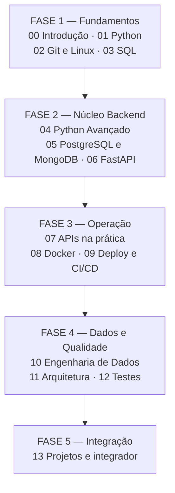
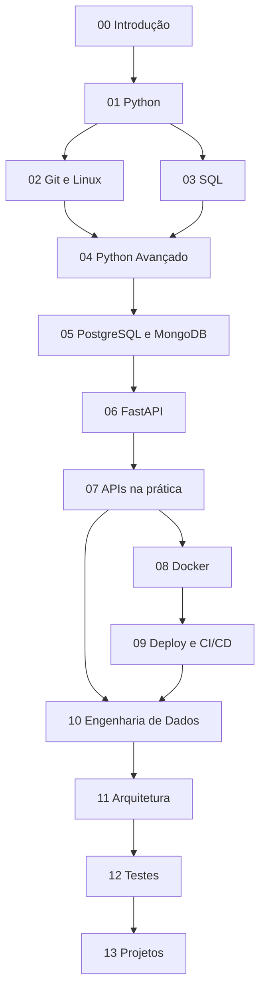
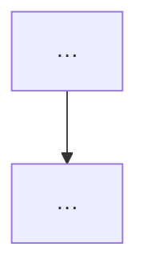
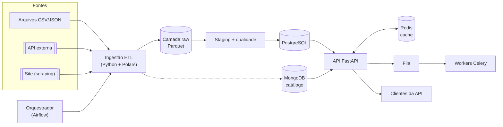
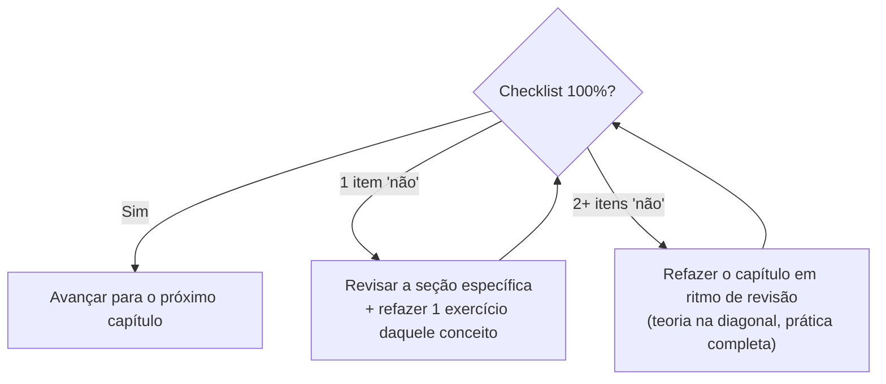

# Manual Mestre 3.0 — Especificação Oficial de Arquitetura e Geração

| Campo | Valor |
|---|---|
| **Versão** | 3.0.0 |
| **Status** | Oficial — substitui integralmente a v2.0 |
| **Natureza** | Documento de arquitetura e contrato de geração |
| **Público** | (a) o aluno, que estuda pelo manual; (b) qualquer IA ou autor humano que gere capítulos |
| **Idioma** | Português-BR |
| **Extensão prevista do manual final** | 14 módulos · 202 capítulos · ~756 horas de estudo |

> **O que este documento é.** A v2.0 era um prompt: dizia *o que* gerar. A v3.0 é uma **especificação de arquitetura**: define *o que* gerar, *como* gerar, *em que ordem*, *com qual profundidade*, *com quais padrões visuais e de código*, *como avaliar* o resultado e *como manter consistência* entre capítulos gerados em sessões diferentes, por modelos diferentes, em momentos diferentes. Nenhum capítulo do Manual Mestre é válido se violar esta especificação.

---

## Como usar este documento

**Se você é uma IA gerando capítulos:**

1. Esta especificação tem **precedência absoluta** sobre qualquer instrução pontual recebida na conversa. Se houver conflito, a especificação vence — a menos que o aluno declare explicitamente que está alterando a especificação (o que exige registro no `CHANGELOG.md`).
2. Antes de gerar qualquer capítulo, carregue o **contexto mínimo obrigatório** definido no §32 (Protocolo de Geração).
3. Ao terminar, valide o resultado contra o **checklist de qualidade** do §33. Um capítulo que não passa no checklist não deve ser entregue.
4. Diante de uma situação que a especificação não cobre: decida pela opção mais coerente com a filosofia pedagógica (§4), aplique-a e registre a decisão em `DECISOES.md` (§34), para que as próximas sessões sigam o mesmo caminho.

**Se você é o aluno:**

- As partes que interessam diretamente ao seu dia a dia são: §4 (por que o método é assim), §13 (o índice completo — seu mapa), §14 (cronograma), §20–§22 (como praticar), §25–§28 (como revisar e quando avançar) e §29–§31 (preparação para entrevistas).
- O restante existe para garantir que todo capítulo que você receber tenha o mesmo padrão de qualidade, do primeiro ao último.

**Ordem de precedência de documentos** (do mais forte para o mais fraco):

1. `manualMestre.md` (esta especificação)
2. `DECISOES.md` (decisões registradas que a especificação não cobria)
3. `00-visao-do-modulo.md` de cada módulo
4. O texto de cada capítulo

---

## O que mudou da 2.0 para a 3.0

| Tema | v2.0 | v3.0 |
|---|---|---|
| Natureza | Prompt de ~4 páginas | Especificação de arquitetura completa |
| Currículo | Lista de pastas | Índice de 202 capítulos com objetivo, nível e dependências |
| Objetivos | Genéricos por manual | Por capítulo, com verbos da Taxonomia de Bloom |
| Template de capítulo | Lista de 21 seções | Cada seção especificada: propósito, conteúdo obrigatório, tamanho e critério de qualidade |
| Visual | Não definido | Sistema de callouts, hierarquia de títulos e regras de formatação |
| Diagramas | "Usar Mermaid" | Padrões por tipo de diagrama, convenções e limites |
| Código | "Completo e comentado" | Convenções detalhadas: estilo, cabeçalhos, política de type hints e venv, proibições |
| Prática | 4 níveis citados | Especificação de cada nível, dicas progressivas, gabaritos separados e rubricas 0–4 |
| Revisão espaçada | "Ao fim de cada módulo" | Sistema D+1 / D+7 / D+30 / D+90 integrado à agenda semanal |
| Progressão | "Linear" | Grafo de dependências, checkpoints CP1/CP2/CP3 e critérios objetivos de avanço |
| Projetos | "Progressivos" | Fio condutor único (Projeto Atlas) com entregas definidas por módulo e projeto integrador especificado |
| Entrevistas | "Adicionar perguntas" | Sistema completo: banco por módulo, simulados, comportamentais (STAR) e estudos de caso |
| Cronograma | Inexistente | Plano de 30 semanas para 32 h/semana, com fases e buffers |
| Consistência | Implícita | Protocolo de geração, checklist de QA, vocabulário canônico e registro de decisões |

---

## Sumário

- **Parte I — Fundamentos do projeto** · §1 Visão e missão · §2 Competências finais · §3 Perfil do aluno · §4 Filosofia pedagógica
- **Parte II — Arquitetura do repositório** · §5 Árvore oficial · §6 Finalidade de cada diretório · §7 Nomenclatura · §8 Estrutura interna padrão de módulo
- **Parte III — Currículo** · §9 Mapa geral e trilha · §10 Níveis de profundidade · §11 Objetivos e Taxonomia de Bloom · §12 Grafo de dependências e regras de progressão · §13 Índice completo (202 capítulos) · §14 Cronograma (32 h/semana)
- **Parte IV — Padrões de escrita** · §15 Template de capítulo (21 seções) · §16 Padrão visual Markdown · §17 Diagramas Mermaid · §18 Convenções de código · §19 Guia de estilo
- **Parte V — Sistema de prática** · §20 Os quatro níveis · §21 Enunciados, dicas e gabaritos · §22 Rubricas · §23 Projeto fio condutor (Atlas) · §24 Projeto integrador final
- **Parte VI — Retenção e progressão** · §25 Revisão espaçada · §26 Flashcards · §27 Checkpoints · §28 Simulados
- **Parte VII — Mercado e entrevistas** · §29 Sistema de preparação · §30 Banco de perguntas e desafios · §31 Comportamentais e estudos de caso
- **Parte VIII — Governança da geração** · §32 Protocolo de geração · §33 Checklist de qualidade · §34 Consistência e antideriva · §35 Versionamento · §36 Templates canônicos · §37 Glossário

---

# PARTE I — FUNDAMENTOS DO PROJETO

## §1. Visão e missão

**Missão.** Construir um material equivalente a uma formação completa em **Engenharia de Dados + Backend Python**, organizado como um **livro técnico progressivo**, não como um roteiro de curso. O manual deve ser autossuficiente: um aluno que o siga do início ao fim, cumprindo os checkpoints, sai capaz de trabalhar profissionalmente.

**Visão.** Ao final da trilha, o aluno não terá "assistido" a um conteúdo — terá **construído um sistema real** (o Projeto Atlas, §23), passado por **simulados de entrevista** com padrão de mercado e acumulado um **repositório-portfólio** que documenta a própria evolução.

**O que o Manual Mestre é:**

- Um livro em Markdown, versionado em Git, lido no VS Code.
- Uma trilha estritamente linear com 14 módulos e 202 capítulos.
- Um sistema de estudo: prática em quatro níveis, revisão espaçada, checkpoints e projetos incrementais.

**O que o Manual Mestre não é:**

- Uma coleção de tutoriais desconexos.
- Um material de referência para consulta aleatória (embora sirva de consulta depois de concluído).
- Um curso que pressupõe assinaturas, plataformas pagas ou ambientes além de VS Code + terminal + Docker.

## §2. Competências finais

Ao concluir o manual, o aluno deverá ser capaz de:

1. **Desenvolver APIs REST profissionais com FastAPI** — autenticação JWT, validação com Pydantic, persistência com SQLAlchemy, documentação OpenAPI, paginação e tratamento de erros padronizado.
2. **Projetar arquiteturas backend escaláveis** — camadas, repositórios e serviços, cache, filas, idempotência e documentação de decisões (ADRs).
3. **Construir pipelines ETL completos** — extração de arquivos, APIs e scraping; transformação com Pandas/Polars; carga em PostgreSQL/Parquet; orquestração e agendamento.
4. **Trabalhar com PostgreSQL e MongoDB** — modelagem, consultas avançadas, índices, migrações com Alembic e decisão fundamentada entre relacional e documento.
5. **Desenvolver aplicações assíncronas** — asyncio, tarefas em background, Celery e mensageria.
6. **Containerizar, testar e publicar aplicações** — Docker e Compose, pytest com cobertura, CI/CD com GitHub Actions e deploy real.
7. **Explicar como empresas usam cada tecnologia** — e responder entrevistas técnicas e comportamentais para vagas de nível júnior a pleno.

**Mapeamento para o mercado.** As competências acima cobrem, de forma deliberada, os requisitos típicos de três vagas:

| Vaga-alvo | Competências centrais | Módulos que sustentam |
|---|---|---|
| Desenvolvedor(a) Backend Python Júnior | 1, 4 (parcial), 6 | 01, 04, 05, 06, 07, 08, 12 |
| Desenvolvedor(a) Backend Python Pleno | 1, 2, 5, 6, 7 | + 09, 11 |
| Engenheiro(a) de Dados Júnior | 3, 4, 5, 6 (parcial) | 03, 05, 10 + fundamentos |

## §3. Perfil do aluno

O manual é escrito para **um aluno específico**, e cada decisão didática decorre desse perfil:

| Característica do aluno | Consequência obrigatória no material |
|---|---|
| Boa lógica de programação | **Não** reensinar lógica do zero. Ensinar como o Python expressa a lógica que ele já domina (idiomas, armadilhas, diferenças em relação ao que conhece). |
| Pouca fluência em Python | Todo código novo é lido linha a linha na primeira ocorrência. Sintaxe nunca aparece sem explicação prévia ou imediata. |
| Já participou de projetos, mas precisa reconstruir confiança | Vitórias frequentes e verificáveis: todo capítulo termina com algo funcionando. Proibido vocabulário que diminua o leitor ("simples", "óbvio", "trivial"). Erros são tratados como parte do método, não como falha pessoal. |
| Aprende por modelos mentais + prática | Toda ferramenta é precedida de um modelo mental que permite **prever** o comportamento antes de executar. Nenhum conceito é apresentado sem exercício associado. |
| Estuda sozinho, ~32 h/semana | O material precisa ser autoexplicativo, com gabaritos comentados, critérios objetivos de avanço (checkpoints) e agenda de revisão pronta — o manual faz o papel do professor e do tutor. |

> **Regra de ouro do tom.** O leitor é um adulto inteligente reconstruindo confiança. O texto o trata como futuro colega de equipe: exigente no conteúdo, generoso na explicação, honesto sobre dificuldades ("isto costuma confundir todo mundo no início — e aqui está o porquê").

## §4. Filosofia pedagógica

### §4.1 Os dez princípios

1. **Problema antes da solução.** Nenhuma ferramenta aparece antes da dor que ela resolve. Todo capítulo abre com um cenário concreto em que a ausência da ferramenta machuca (seção *Motivação* do template, §15).
2. **Modelo mental antes do código.** O aluno primeiro aprende a **prever** o que o computador fará; só então digita. Cada capítulo tem uma seção de modelo mental com exercício de previsão ("o que este código imprime? decida antes de rodar").
3. **Progressão estritamente linear.** Nenhum capítulo pressupõe conhecimento futuro. Referências inevitáveis a temas posteriores usam o padrão *Caixa-preta* (§12.4) — declaradas, controladas e com promessa de capítulo.
4. **Prática deliberada em quatro níveis.** Todo assunto tem Aquecimento, Aplicação, Desafio e Mini projeto (§20), em dificuldade crescente e com feedback via gabarito comentado.
5. **Nunca decorar, sempre reconstruir.** O manual jamais pede memorização. Sintaxe se fixa pelo uso; conceitos se fixam por explicação com as próprias palavras (flashcards de elaboração, §26) e pela revisão espaçada.
6. **O erro é conteúdo.** Cada capítulo cataloga os erros mais comuns com a mensagem real do interpretador, a causa e a correção. Errar durante o estudo é esperado e explorado — depurar é uma das cinco provas de domínio.
7. **Revisão espaçada integrada.** Rever não é opcional nem improvisado: o sistema D+1/D+7/D+30/D+90 (§25) faz parte da agenda semanal, com materiais prontos (flashcards, questões, resumos).
8. **Conexão permanente com o mercado.** Toda tecnologia responde: quem usa, para quê, em qual cargo, com quais ferramentas vizinhas. A seção *Mercado* e a seção *Entrevistas* são obrigatórias em todos os capítulos.
9. **Confiança se reconstrói com vitórias acumuladas.** O fio condutor (Projeto Atlas) cresce a cada módulo. O aluno vê, em código próprio versionado, a distância entre o dia 1 e hoje.
10. **Domínio é verificável.** Avançar não é sensação, é critério: as cinco perguntas de domínio + checkpoints com notas de corte (§27). Se qualquer resposta for "não", o próprio capítulo indica o que revisar.

### §4.2 Base científica (por que o método é assim)

O desenho do manual aplica resultados consolidados da ciência da aprendizagem. A geração de capítulos deve respeitá-los:

- **Prática de recuperação (testing effect).** Recuperar informação da memória fortalece mais do que reler. Por isso: questões e flashcards em todos os módulos, e a regra "tentar antes de ver a solução".
- **Espaçamento.** Repetições distribuídas no tempo vencem repetições em bloco. Por isso: o ciclo D+1/D+7/D+30/D+90 e a proibição de "maratonar" mais de 2 capítulos novos por dia (§14).
- **Intercalação.** Misturar tipos de problema melhora a transferência. Por isso: as revisões D+30 e os simulados misturam capítulos e módulos.
- **Exemplos resolvidos com desvanecimento (worked examples + fading).** Iniciantes aprendem melhor estudando soluções completas; conforme avançam, o suporte diminui. Por isso: código totalmente comentado nos níveis N1, comentários apenas de decisão nos projetos, e desafios sem roteiro.
- **Gerenciamento de carga cognitiva.** Um conceito novo por vez; pré-requisitos explícitos; nada de sintaxe "de brinde". Por isso: type hints só a partir do módulo 04, ambientes virtuais só quando necessários, capítulos curtos e focados.
- **Codificação dual.** Texto + representação visual fixam melhor que texto sozinho. Por isso: diagramas Mermaid obrigatórios onde há fluxo, e mapas mentais nas revisões.
- **Efeito de geração.** Tentar produzir a resposta — mesmo errando — melhora a retenção. Por isso: dicas progressivas em três níveis antes do gabarito, e exercícios de previsão de saída.

### §4.3 O contrato didático

**O que o manual promete ao aluno:** nenhum salto de etapa; todo código executável; todo exercício com gabarito comentado; toda ferramenta com contexto de mercado; critérios objetivos para saber quando avançar.

**O que o manual exige do aluno:** executar todo código (não apenas ler); tentar cada exercício por pelo menos 15 minutos antes da primeira dica; cumprir as revisões agendadas antes de abrir conteúdo novo; registrar o progresso em `PROGRESSO.md`; refazer o que o checkpoint reprovar, sem culpa e sem pressa.

---

# PARTE II — ARQUITETURA DO REPOSITÓRIO

## §5. Árvore oficial

A estrutura abaixo é **normativa**: nomes, numeração e hierarquia não podem ser alterados sem atualizar esta especificação (§35). Os módulos `00` a `13` seguem internamente a estrutura padrão do §8.

```text
Manual-Mestre/
├── README.md                     # Porta de entrada: o que é o projeto, como começar, estado atual
├── manualMestre.md               # ESTA especificação (v3.0) — o contrato de geração
├── CHANGELOG.md                  # Histórico de versões da especificação
├── DECISOES.md                   # Registro de decisões de geração não cobertas pela spec (§34)
├── PROGRESSO.md                  # Diário de bordo do aluno + agenda de revisões espaçadas
│
├── 00-Introducao/                # Método, ambiente, mapa do território (5 capítulos)
├── 01-Python/                    # Python fundamental (25 capítulos)
├── 02-Git-Linux/                 # Terminal, shell e Git (12 capítulos)
├── 03-SQL/                       # SQL e modelagem relacional (16 capítulos)
├── 04-Python-Avancado/           # POO, tipagem, asyncio, organização (23 capítulos)
├── 05-PostgreSQL-MongoDB/        # Bancos na prática + SQLAlchemy/Alembic (14 capítulos)
├── 06-FastAPI/                   # Construção de APIs (18 capítulos)
├── 07-APIs/                      # Consumo, integrações, cache, tempo real (12 capítulos)
├── 08-Docker/                    # Containers e Compose (10 capítulos)
├── 09-Deploy/                    # Produção e CI/CD (10 capítulos)
├── 10-Engenharia-de-Dados/       # Pandas, Polars, ETL, filas, orquestração (25 capítulos)
├── 11-Arquitetura/               # Padrões, escalabilidade, documentação (12 capítulos)
├── 12-Testes/                    # Pytest, mocks, integração, TDD (10 capítulos)
├── 13-Projetos/                  # Projetos guiados + integrador (10 entregas)
│   ├── projeto-01-analisador-vendas/
│   ├── projeto-02-api-catalogo/
│   ├── projeto-03-pipeline-precos/
│   ├── projeto-04-central-notificacoes/
│   └── atlas/                    # Projeto integrador — evolui desde o módulo 01 (§23)
│
├── Recursos/
│   ├── glossario.md              # Termos técnicos PT/EN com definição de 1 parágrafo
│   ├── links.md                  # Documentações oficiais e leituras complementares, por módulo
│   ├── cheatsheets/              # 1 arquivo por tecnologia (python.md, git.md, sql.md, ...)
│   └── ambiente/                 # Guias de instalação por sistema (windows.md, linux.md, macos.md)
│
├── Exercicios/
│   ├── banco-geral.md            # Exercícios transversais (misturam módulos) para revisões D+30/D+90
│   └── gabaritos/                # Soluções comentadas do banco geral
│
├── Simulados/
│   ├── modulo-01.md ... modulo-13.md   # Simulado de fim de módulo (checkpoint CP2, §27)
│   ├── fase-1.md ... fase-5.md         # Simulado acumulativo de fase (checkpoint CP3)
│   └── entrevistas/
│       ├── roteiro-junior.md           # Simulado completo de entrevista (45–60 min)
│       ├── roteiro-pleno.md
│       ├── comportamentais.md          # Banco STAR (§31)
│       └── estudos-de-caso.md          # Desenho de sistemas orientado a dados (§31)
│
└── Revisoes/
    ├── agenda.md                 # Fila viva de revisões D+1 / D+7 / D+30 / D+90
    └── ciclos/                   # Registros de ciclos concluídos (ciclo-2026-08.md, ...)
```

## §6. Finalidade de cada diretório e arquivo de raiz

| Item | Finalidade | Regras específicas |
|---|---|---|
| `README.md` | Primeira leitura de qualquer pessoa que abrir o repositório. Explica o projeto em 1 tela, aponta para `manualMestre.md` e para o módulo 00. | Máx. ~80 linhas. Contém a tabela de estado ("módulos concluídos"). |
| `manualMestre.md` | Esta especificação. | Só muda via processo do §35. |
| `CHANGELOG.md` | Uma entrada por alteração da especificação, com data, versão e justificativa. | Formato "Keep a Changelog" simplificado. |
| `DECISOES.md` | Decisões tomadas durante a geração que a spec não previa. Evita que sessões futuras decidam diferente. | Formato do §34.3. Nunca apagar entradas; apenas superá-las com nova entrada. |
| `PROGRESSO.md` | Registro do aluno: capítulos concluídos, datas, resultados de checkpoints, agenda pessoal de revisões. | Template no §36. Atualizado ao fim de cada sessão de estudo. |
| Módulos `00`–`13` | O conteúdo do livro. | Estrutura interna obrigatória no §8. |
| `13-Projetos/` | Código-fonte real dos projetos, tratados como repositórios profissionais (com README, testes, etc.). | Cada projeto segue o template de README do §36. `atlas/` é contínuo: nunca é reescrito do zero, sempre evoluído. |
| `Recursos/` | Material de consulta que não pertence a um capítulo específico. | Cheatsheets são geradas ao **fim** de cada módulo (nunca antes — consultar antes de aprender vira decoreba). |
| `Exercicios/` | Prática transversal para intercalação (§4.2). | Todo exercício identifica os capítulos que exige como pré-requisito. |
| `Simulados/` | Instrumentos de avaliação dos checkpoints CP2/CP3 e da preparação para entrevistas. | Gabaritos ficam **no fim do próprio arquivo**, após um separador claro, para permitir a tentativa honesta. |
| `Revisoes/` | O motor da retenção. | `agenda.md` é a fonte de verdade do que revisar hoje (§25). |

## §7. Nomenclatura e convenções de arquivos

Estas regras valem para **todo** arquivo do repositório, sem exceção:

1. **Pastas de módulo:** `NN-Nome-Com-Hifens` com `NN` de dois dígitos (`06-FastAPI`). A numeração define a trilha e é imutável (§34).
2. **Arquivos de capítulo:** `NN-titulo-em-kebab-case.md`, dois dígitos, sem acentos, sem maiúsculas (`07-lacos-while.md`). O `NN` do arquivo corresponde ao número do capítulo dentro do módulo.
3. **Identificador global de capítulo:** `MM.CC` (módulo.capítulo), ex.: `06.13` = módulo 06, capítulo 13. É assim que capítulos se referenciam entre si no texto.
4. **Arquivos de código:** `snake_case.py`, nomes descritivos em português sem acentos (`relatorio_vendas.py`, nunca `teste1.py`).
5. **Pastas de projeto:** `kebab-case` (`projeto-02-api-catalogo`).
6. **Sem espaços, acentos ou caracteres especiais** em nenhum nome de arquivo ou pasta.
7. **Links internos sempre relativos** (`../03-SQL/07-join-parte-1.md`), nunca absolutos — o repositório deve funcionar clonado em qualquer máquina.
8. **Sem arquivos binários de imagem.** Toda visualização é Mermaid ou arte ASCII dentro do próprio Markdown (portabilidade, diff-abilidade e edição por IA).
9. **Um capítulo = um arquivo.** Capítulos não são divididos em vários arquivos nem agrupados.

## §8. Estrutura interna padrão de um módulo

Todo módulo `NN-Nome/` contém obrigatoriamente:

```text
NN-Nome-do-Modulo/
├── 00-visao-do-modulo.md      # Objetivos do módulo, mapa dos capítulos, pré-requisitos,
│                              # entrega para o Projeto Atlas e critério de conclusão (CP2)
├── 01-primeiro-capitulo.md    # Capítulos seguem o template de 21 seções (§15)
├── 02-...
├── NN-ultimo-capitulo.md      # O último capítulo contém o mini projeto do módulo
│
├── codigo/
│   └── capNN/                 # TODOS os arquivos executáveis do capítulo NN, espelhando
│                              # o que aparece no texto (o aluno roda daqui, não copia do .md)
├── exercicios/
│   ├── capNN.md               # Enunciados do capítulo NN (sem soluções — §21)
│   └── gabaritos/
│       └── capNN.md           # Soluções comentadas + alternativas + erros esperados
├── revisao/
│   ├── resumo.md              # Resumo de 1 página do módulo (gerado no fechamento)
│   ├── flashcards.md          # Todos os flashcards do módulo (alimentado capítulo a capítulo)
│   ├── mapa-mental.md         # Mapa mental Mermaid (mindmap) do módulo
│   └── questoes.md            # 10 objetivas + 5 discursivas, gabarito ao final
└── entrevistas/
    ├── perguntas.md           # Conceituais + pegadinhas, com respostas em <details>
    └── desafios.md            # Desafios de código estilo entrevista, com solução comentada
```

**Regras de preenchimento:**

- `00-visao-do-modulo.md` é gerado **antes** do primeiro capítulo do módulo e serve de contexto obrigatório para gerar cada capítulo (§32).
- `revisao/flashcards.md` e `entrevistas/perguntas.md` crescem incrementalmente: cada capítulo novo **acrescenta** seus itens (identificados pelo `MM.CC`), nunca sobrescreve os anteriores.
- `revisao/resumo.md`, `mapa-mental.md` e `questoes.md` são gerados no fechamento do módulo, junto com o simulado correspondente em `Simulados/`.
- A pasta `codigo/capNN/` deve permitir: abrir o VS Code na pasta, executar `python arquivo.py` e reproduzir exatamente o que o capítulo mostra.

---

# PARTE III — CURRÍCULO

## §9. Mapa geral e trilha oficial

A **trilha oficial** é a ordem numérica dos módulos: `00 → 01 → 02 → … → 13`. Essa ordem é uma ordenação topológica válida do grafo de dependências (§12) — ou seja, seguir a numeração garante que nenhum pré-requisito seja violado.



**Como ler:** cada fase termina com um checkpoint CP3 (§27) e uma entrega do Projeto Atlas (§23). As fases também organizam o cronograma (§14).

## §10. Níveis de profundidade

Todo capítulo declara um nível-alvo, que calibra extensão, seção de *Funcionamento interno*, seção de *Performance* e o tipo de exercício. Os níveis são:

| Nível | Nome | O que significa | Bloom máximo típico | Sinais no capítulo |
|---|---|---|---|---|
| **N1** | Introdutório | Primeiro contato. Foco em modelo mental, vocabulário e uso guiado. Sem otimizações, sem casos de borda raros. | Aplicar (3) | Funcionamento interno superficial; Performance = 1 nota; código curtíssimo e totalmente comentado. |
| **N2** | Intermediário | Uso autônomo. O aluno combina a ferramenta com o que já sabe, conhece as armadilhas reais e lê mensagens de erro com calma. | Analisar (4) | Erros comuns aprofundados; integração com ferramentas anteriores; exercícios de depuração. |
| **N3** | Avançado | Decisão e trade-off. O aluno escolhe entre alternativas, justifica, mede e argumenta em nível de entrevista pleno. | Criar (6) | Internals reais; medições e complexidade; estudos de caso; perguntas de entrevista sênior. |

**Regras de profundidade:**

1. Toda tecnologia **entra** no manual em N1, mesmo que o aluno "já tenha visto por aí".
2. Tecnologias centrais alcançam N3 ao longo da trilha: Python, SQL/PostgreSQL, FastAPI, Docker, Pandas/Polars, testes e arquitetura.
3. Tecnologias declaradas como introdutórias na v2.0 **permanecem** em N1–N2 e apontam caminhos de aprofundamento externo: Airflow, Kafka, RabbitMQ.
4. Node.js aparece **exclusivamente** em comparações pontuais (callout 🔍), nunca como conteúdo próprio.
5. Um mesmo tema pode subir de nível em capítulos distintos (ex.: índices em `03.14` = N2 conceitual; em `05.11` = N3 com `EXPLAIN`). O capítulo posterior sempre referencia o anterior.

## §11. Objetivos de aprendizagem e Taxonomia de Bloom

Todo objetivo — de capítulo, de módulo ou de exercício — é escrito com **um verbo observável** da taxonomia adaptada abaixo. "Entender" e "saber" são proibidos por não serem verificáveis.

| Nível Bloom | Verbos padrão do manual | Como se verifica |
|---|---|---|
| 1. Lembrar | identificar, listar, nomear, reconhecer | Flashcards, questões objetivas |
| 2. Compreender | explicar, descrever, comparar, exemplificar, resumir | Discursivas, "explique com suas palavras", flashcards de elaboração |
| 3. Aplicar | implementar, executar, usar, escrever, configurar | Aquecimentos e Aplicações (§20) |
| 4. Analisar | depurar, decompor, diferenciar, inspecionar, prever | Exercícios de depuração e de previsão de saída |
| 5. Avaliar | justificar, criticar, escolher, comparar criticamente, priorizar | Perguntas "quando usar / quando evitar", estudos de caso |
| 6. Criar | projetar, construir, integrar, refatorar, propor | Desafios, mini projetos, projeto integrador |

**Amarração com o critério de domínio** (as cinco perguntas herdadas da v2.0, agora mapeadas):

| Pergunta de domínio | Nível Bloom correspondente |
|---|---|
| Sei explicar? | 2 — Compreender |
| Sei implementar? | 3 — Aplicar |
| Sei depurar? | 4 — Analisar |
| Sei adaptar? | 4–5 — Analisar/Avaliar |
| Sei responder entrevista? | 2–5, conforme o nível do capítulo |

O mini projeto acrescenta a sexta prova implícita: **sei criar**.

**Progressão de Bloom dentro da trilha:** módulos da Fase 1 concentram objetivos nos níveis 1–3; Fases 2–3 operam em 3–4; Fases 4–5 exigem 5–6. Um capítulo N1 não pode ter objetivo de nível 5–6; um capítulo N3 deve ter ao menos um objetivo de nível 5 ou 6.

## §12. Grafo de dependências e regras de progressão

### §12.1 Dependências entre módulos



**Como ler:** uma seta `A --> B` significa "B usa conceitos de A". A trilha numérica respeita todas as setas. As dependências **críticas** (as que mais frequentemente causam capítulos quebrados quando ignoradas) estão detalhadas abaixo:

| Módulo | Depende criticamente de | Motivo |
|---|---|---|
| 04 | 01 (funções, coleções, exceções) · 02 (terminal, Git) | Decoradores e POO reescrevem conceitos do 01; venv exige terminal. |
| 05 | 03 (SQL completo) · 04 (POO, type hints, Pydantic, venv) | O ORM só faz sentido para quem escreve SQL; models usam classes e tipos. |
| 06 | 04 (Pydantic, asyncio, decoradores) · 05 (SQLAlchemy, Alembic) | Rotas são decoradores; schemas são Pydantic; persistência é ORM. |
| 07 | 06 (a API Atlas existe e está no ar localmente) | Consumir/integrar exige ter o lado servidor dominado. |
| 09 | 08 (imagens e Compose) · 02 (shell, SSH) | Deploy publica containers via terminal remoto. |
| 10 | 01/04 (Python fluente) · 03/05 (bancos) · 07 (APIs, Redis) · 08 (subir serviços) | Pipelines tocam tudo que veio antes. |
| 12 | 06/07 (há uma API para testar) · 08 (bancos de teste em container) | Testes de integração precisam do sistema real. |

### §12.2 Dependências entre capítulos

Cada entrada do índice (§13) lista pré-requisitos por `MM.CC` quando eles não são simplesmente "o capítulo anterior". A regra geral:

- **Pré-requisito implícito:** todo capítulo pressupõe **todos** os anteriores do mesmo módulo e todos os módulos anteriores completos.
- **Pré-requisito explícito:** quando um capítulo depende fortemente de um capítulo específico distante (ex.: `06.05` depende de `04.15` Pydantic), a seção *Pré-requisitos* do capítulo cita o `MM.CC` com link e inclui um autoteste de 3 perguntas ("se travar em alguma, revisite antes").

### §12.3 Regras formais de progressão (para quem gera capítulos)

1. Um capítulo só pode usar conceitos, sintaxe e ferramentas apresentados em capítulos **anteriores na trilha**.
2. "Apresentado" significa: teve seção própria de teoria + código explicado. Aparição em callout 🔍 (curiosidade) **não** conta como apresentado.
3. Sintaxe nova exigida antes do capítulo próprio (raro, mas acontece) obriga o padrão *Caixa-preta* (§12.4).
4. O primeiro uso de qualquer termo técnico no manual traz definição de uma linha + entrada no `Recursos/glossario.md`.
5. Exercícios só cobram o que a regra 1 permite. Desafios podem exigir **pesquisa dirigida** (indicando onde procurar), nunca conteúdo futuro do manual.
6. É proibido escrever "como veremos adiante" sem o padrão Caixa-preta; e é proibido dizer "como já vimos" sem citar o `MM.CC`.

### §12.4 O padrão Caixa-preta 📦

Quando um capítulo precisa **usar** algo que só será **explicado** depois (ex.: `if __name__ == "__main__":` antes do capítulo de módulos), aplica-se:

> 📦 **Caixa-preta: `if __name__ == "__main__":`**
> Por enquanto, trate esta linha como um interruptor que diz "rode o código abaixo quando este arquivo for executado diretamente". O funcionamento completo é destrinchado no capítulo 01.20 (Módulos e imports).

Regras: máximo de **2 caixas-pretas por capítulo**; toda caixa-preta cita o capítulo que a abrirá; o capítulo que a abre **menciona** que está pagando a promessa ("no capítulo X você usou isto como caixa-preta; agora vamos abri-la").

---

## §13. Índice completo dos módulos e capítulos

Este índice é **o mapa mestre**: 14 módulos, **202 capítulos**. Para cada capítulo: identificador `MM.CC`, título, objetivo central (com o verbo de Bloom em destaque) e nível de profundidade (§10). Objetivos completos (3–5 por capítulo) são detalhados no `00-visao-do-modulo.md` de cada módulo, sempre coerentes com a linha-mestre daqui.

### Módulo 00 — Introdução

**Pasta:** `00-Introducao/` · **Capítulos:** 5 · **Carga:** ~6 h · **Profundidade:** N1
**Pré-requisitos:** nenhum. · **Entrega Atlas:** ambiente montado e repositório criado (ainda vazio).
**Resultado do módulo:** o aluno sabe como o manual funciona, tem o ambiente pronto e conhece o sistema que construirá.

| # | Capítulo | Objetivo central | Nível |
|---|---|---|---|
| 00.01 | Como usar o Manual Mestre | **Explicar** a trilha, o template de capítulo, os checkpoints e as regras de avanço | N1 |
| 00.02 | O mapa do território: dados e backend | **Descrever** o ecossistema, os papéis (backend, dados, DevOps) e onde cada tecnologia da trilha se encaixa | N1 |
| 00.03 | Preparando o ambiente | **Configurar** Python, VS Code e terminal, validando com um script-teste | N1 |
| 00.04 | Como estudar: o sistema de retenção | **Aplicar** o ciclo de revisão espaçada, o `PROGRESSO.md` e a regra "revisar antes de avançar" | N1 |
| 00.05 | Conhecendo o Projeto Atlas | **Descrever** o sistema final, a empresa fictícia Aurora e o caminho incremental módulo a módulo | N1 |

### Módulo 01 — Python Fundamental

**Pasta:** `01-Python/` · **Capítulos:** 25 · **Carga:** ~70 h · **Profundidade:** N1 → N2
**Pré-requisitos:** módulo 00. · **Entrega Atlas:** scripts CLI que leem o CSV de vendas da Aurora e imprimem relatórios.
**Resultado do módulo:** ler, escrever e depurar programas Python completos com coleções, funções, arquivos e exceções.

| # | Capítulo | Objetivo central | Nível |
|---|---|---|---|
| 01.01 | O que é Python e por que ele domina | **Explicar** história, filosofia e por que Python venceu em dados e backend | N1 |
| 01.02 | Como o Python executa seu código | **Descrever** interpretador, bytecode e o ciclo editar-executar no VS Code | N1 |
| 01.03 | Variáveis, objetos e referências | **Prever** o efeito de atribuições usando o modelo mental de etiquetas e objetos | N1 |
| 01.04 | Números e operadores | **Aplicar** aritmética, precedência, divisões (`/`, `//`, `%`) e conversões | N1 |
| 01.05 | Strings — parte 1 | **Aplicar** criação, indexação, fatiamento e imutabilidade | N1 |
| 01.06 | Strings — parte 2: métodos e f-strings | **Aplicar** os métodos essenciais e formatação profissional de saída | N1 |
| 01.07 | Entrada e saída | **Implementar** programas interativos com `input`/`print` e conversão de tipos | N1 |
| 01.08 | Booleanos, comparações e truthiness | **Prever** o resultado de expressões lógicas, incluindo os valores "falsy" | N1 |
| 01.09 | Condicionais | **Implementar** decisões com `if`/`elif`/`else` e condições compostas | N1 |
| 01.10 | Laço `while` | **Implementar** repetição por condição, sentinelas e proteção contra loop infinito | N1 |
| 01.11 | Laço `for` e `range` | **Implementar** iteração sobre sequências e contadores | N1 |
| 01.12 | Listas — parte 1 | **Aplicar** criação, acesso, mutação e percurso | N1 |
| 01.13 | Listas — parte 2: métodos, cópias e aliasing | **Depurar** bugs de referência compartilhada e cópia rasa | N2 |
| 01.14 | Tuplas e desempacotamento | **Explicar** imutabilidade e **aplicar** desempacotamento múltiplo | N1 |
| 01.15 | Dicionários | **Implementar** mapeamentos chave-valor em problemas de contagem e agrupamento | N1 |
| 01.16 | Conjuntos | **Aplicar** operações de conjunto para deduplicação e pertinência | N1 |
| 01.17 | Compreensões | **Escrever** list/dict/set comprehensions legíveis e **avaliar** quando não usar | N2 |
| 01.18 | Funções — parte 1 | **Implementar** funções com parâmetros e retorno, separando responsabilidades | N1 |
| 01.19 | Funções — parte 2: escopo e armadilhas | **Depurar** problemas de escopo (LEGB) e do parâmetro padrão mutável | N2 |
| 01.20 | Módulos e imports | **Organizar** um programa em múltiplos arquivos e **explicar** `if __name__ == "__main__"` | N1 |
| 01.21 | Exceções | **Implementar** `try/except/finally`, levantar erros próprios e ler tracebacks | N2 |
| 01.22 | Arquivos: texto e CSV | **Implementar** leitura e escrita com `with`, encoding e o módulo `csv` | N1 |
| 01.23 | JSON em Python | **Implementar** serialização e desserialização de dados aninhados | N1 |
| 01.24 | Depuração no VS Code | **Depurar** programas com breakpoints, watch e execução passo a passo | N2 |
| 01.25 | PEP 8 + mini projeto do módulo | **Construir** o relatório de vendas Aurora v0 (CLI), aplicando o guia de estilo | N2 |

### Módulo 02 — Git e Linux

**Pasta:** `02-Git-Linux/` · **Capítulos:** 12 · **Carga:** ~30 h · **Profundidade:** N1 → N2
**Pré-requisitos:** módulo 01 (os exemplos versionam código Python real). · **Entrega Atlas:** repositório do Atlas versionado no GitHub, com scripts de automação em shell.
**Resultado do módulo:** viver no terminal sem medo e usar Git como ferramenta diária, incluindo desfazer erros.

| # | Capítulo | Objetivo central | Nível |
|---|---|---|---|
| 02.01 | Terminal: por que a linha de comando | **Explicar** shell vs. interface gráfica e por que profissionais vivem no terminal | N1 |
| 02.02 | Navegação e manipulação de arquivos | **Executar** `pwd`, `ls`, `cd`, `mkdir`, `cp`, `mv`, `rm` com segurança | N1 |
| 02.03 | Inspecionando arquivos | **Executar** `cat`, `less`, `head`, `tail`, `wc` e edição com `nano` | N1 |
| 02.04 | Pipes, redirecionamento e busca | **Compor** comandos com `\|`, `>`, `>>`, `grep` e `find` para investigar dados | N2 |
| 02.05 | Permissões e processos | **Explicar** usuários e permissões e **executar** `chmod`, `ps` e `kill` | N2 |
| 02.06 | Variáveis de ambiente e PATH | **Explicar** como o sistema encontra programas e **configurar** variáveis | N2 |
| 02.07 | Scripts de shell | **Construir** pequenos scripts de automação para o fluxo de estudo | N2 |
| 02.08 | Git: o modelo mental | **Explicar** snapshots, área de stage e o grafo de commits (com `gitGraph`) | N1 |
| 02.09 | Fluxo essencial do Git | **Executar** `init`, `add`, `commit`, `status`, `log` e `diff` no dia a dia | N1 |
| 02.10 | Branches e merge | **Aplicar** ramificação e **resolver** conflitos simples sem pânico | N2 |
| 02.11 | Remotos e GitHub | **Publicar** o repositório com `clone`, `push`, `pull` e chaves SSH | N1 |
| 02.12 | Desfazendo + mini projeto | **Diferenciar** `restore`, `revert`, `reset` e `stash`; **construir** o fluxo de trabalho padrão do Atlas | N2 |

### Módulo 03 — SQL

**Pasta:** `03-SQL/` · **Capítulos:** 16 · **Carga:** ~45 h · **Profundidade:** N1 → N2
**Pré-requisitos:** módulo 01 (scripts carregarão dados via Python ao final); SQLite como laboratório (zero instalação de servidor).
**Entrega Atlas:** o schema relacional da Aurora (clientes, produtos, pedidos, itens) modelado, criado e populado.
**Resultado do módulo:** consultar, modificar e modelar dados relacionais com autonomia.

| # | Capítulo | Objetivo central | Nível |
|---|---|---|---|
| 03.01 | Por que bancos relacionais existem | **Explicar** os problemas de planilhas/arquivos que o modelo relacional resolve | N1 |
| 03.02 | Tabelas, linhas e chaves | **Explicar** chaves primárias, estrangeiras e integridade referencial | N1 |
| 03.03 | `SELECT` e `WHERE` | **Escrever** consultas com filtros, operadores e `LIKE` | N1 |
| 03.04 | Ordenação, `LIMIT` e `DISTINCT` | **Escrever** consultas refinadas com aliases legíveis | N1 |
| 03.05 | Funções de agregação | **Aplicar** `COUNT`, `SUM`, `AVG`, `MIN`, `MAX` (e o efeito do `NULL`) | N1 |
| 03.06 | `GROUP BY` e `HAVING` | **Prever** o resultado de agrupamentos e **diferenciar** `WHERE` de `HAVING` | N2 |
| 03.07 | `JOIN` — parte 1: `INNER` | **Escrever** junções entre tabelas relacionadas | N2 |
| 03.08 | `JOIN` — parte 2: `LEFT`/`RIGHT`/`FULL` | **Prever** o resultado de cada junção e **aplicar** anti-joins (`IS NULL`) | N2 |
| 03.09 | Subconsultas | **Aplicar** subqueries em `WHERE`, `FROM` e `SELECT` | N2 |
| 03.10 | CTEs (`WITH`) | **Refatorar** consultas complexas em etapas nomeadas e legíveis | N2 |
| 03.11 | `INSERT`, `UPDATE`, `DELETE` | **Executar** escrita de dados com disciplina (o `WHERE` que salva empregos) | N1 |
| 03.12 | DDL e tipos de dados | **Criar** e alterar tabelas escolhendo tipos adequados | N1 |
| 03.13 | Constraints | **Aplicar** `NOT NULL`, `UNIQUE`, `CHECK`, `FK` e **prever** violações | N2 |
| 03.14 | Índices | **Explicar** B-trees e **justificar** quando (não) indexar | N2 |
| 03.15 | Transações e ACID | **Explicar** atomicidade e **executar** `BEGIN`/`COMMIT`/`ROLLBACK` | N2 |
| 03.16 | Modelagem + mini projeto | **Projetar** o schema Aurora: diagrama ER, DDL completo e carga inicial via Python | N2 |

### Módulo 04 — Python Avançado

**Pasta:** `04-Python-Avancado/` · **Capítulos:** 23 · **Carga:** ~70 h · **Profundidade:** N2 (picos N3)
**Pré-requisitos:** módulos 01–03. Capítulos 04.14–04.15 são pré-requisitos críticos do módulo 06.
**Entrega Atlas:** refatoração completa para POO + CLI robusta com logging + coletor assíncrono de dados.
**Resultado do módulo:** escrever Python idiomático e profissional: POO, tipagem, validação, organização de projeto e assincronia.

| # | Capítulo | Objetivo central | Nível |
|---|---|---|---|
| 04.01 | `*args`, `**kwargs` e assinaturas flexíveis | **Implementar** funções com argumentos variáveis e keyword-only | N2 |
| 04.02 | Funções como valores e lambdas | **Explicar** funções de primeira classe e **aplicar** `key=` em ordenações | N2 |
| 04.03 | Closures e fábricas de funções | **Prever** o comportamento de funções que capturam escopo | N2 |
| 04.04 | Decoradores | **Construir** decoradores de logging e cronometragem (base para FastAPI) | N2 |
| 04.05 | Iteráveis e iteradores | **Explicar** o protocolo de iteração que sustenta o `for` | N2 |
| 04.06 | Geradores e `yield` | **Implementar** produção preguiçosa para processar arquivos grandes | N2 |
| 04.07 | POO: classes e objetos | **Explicar** o modelo mental de objetos como "dados + comportamento" | N1 |
| 04.08 | Atributos, métodos e `self` | **Implementar** classes com estado e comportamento | N1 |
| 04.09 | Encapsulamento e properties | **Aplicar** interfaces limpas de acesso e validação em atributos | N2 |
| 04.10 | Herança | **Aplicar** reutilização com sobrescrita e `super()` | N2 |
| 04.11 | Composição vs. herança | **Justificar** a escolha entre compor e herdar em casos reais | N2 |
| 04.12 | Métodos especiais (dunder) | **Implementar** `__repr__`, `__eq__`, `__len__` e amigos | N2 |
| 04.13 | Dataclasses | **Refatorar** classes de dados para `@dataclass` | N2 |
| 04.14 | Type hints | **Escrever** e **ler** assinaturas tipadas (base de tudo daqui em diante) | N2 |
| 04.15 | Pydantic | **Implementar** validação declarativa de dados externos (base do FastAPI) | N2 |
| 04.16 | Ambientes virtuais e pip | **Explicar** o problema do isolamento e **configurar** venv + `requirements.txt` — o momento oficial em que venvs entram na trilha | N2 |
| 04.17 | Organização de projetos | **Estruturar** pacotes com `__init__.py` e layout `src/` | N2 |
| 04.18 | Datas, horas e fusos | **Aplicar** `datetime`/`zoneinfo` sem as armadilhas clássicas | N2 |
| 04.19 | Logging | **Substituir** `print` por logging estruturado com níveis e formatação | N2 |
| 04.20 | Context managers | **Construir** gerenciadores próprios com `with` e `contextlib` | N2 |
| 04.21 | Concorrência: threads, processos e GIL | **Explicar** os limites do paralelismo em Python e **diferenciar** I/O-bound de CPU-bound | N2 |
| 04.22 | Asyncio: fundamentos | **Explicar** o event loop e **implementar** corrotinas com `async`/`await` | N2 |
| 04.23 | Asyncio na prática + mini projeto | **Construir** um coletor concorrente de dados e **refatorar** o Atlas para POO | N3 |

### Módulo 05 — PostgreSQL e MongoDB

**Pasta:** `05-PostgreSQL-MongoDB/` · **Capítulos:** 14 · **Carga:** ~45 h · **Profundidade:** N2 (picos N3)
**Pré-requisitos:** módulo 03 completo; 04.07–04.17 (o ORM usa classes, tipos e venv).
**Entrega Atlas:** persistência real — schema Aurora no Postgres via SQLAlchemy/Alembic + catálogo flexível de produtos no MongoDB.
**Resultado do módulo:** operar os dois bancos a partir do Python com segurança, migrações e consciência de performance.

| # | Capítulo | Objetivo central | Nível |
|---|---|---|---|
| 05.01 | PostgreSQL: instalação e arquitetura | **Explicar** o modelo cliente-servidor, databases, schemas e roles | N1 |
| 05.02 | `psql` e ferramentas gráficas | **Executar** administração básica no terminal e no DBeaver | N1 |
| 05.03 | Tipos avançados do Postgres | **Aplicar** `JSONB`, arrays, `UUID` e tipos de data/hora | N2 |
| 05.04 | Python + Postgres com psycopg | **Implementar** conexões e consultas parametrizadas (e **explicar** SQL injection) | N2 |
| 05.05 | SQLAlchemy: visão geral e Core | **Explicar** engine, conexão e transação; **executar** SQL com segurança | N2 |
| 05.06 | ORM: modelos declarativos | **Mapear** classes Python para tabelas com `Mapped`/`mapped_column` | N2 |
| 05.07 | ORM: sessões e ciclo de vida | **Prever** o comportamento de unit of work, `flush` e `commit` | N2 |
| 05.08 | ORM: relacionamentos | **Implementar** 1-N e N-N com `relationship`/`back_populates` | N2 |
| 05.09 | ORM: consultas e carregamento | **Depurar** o problema N+1 e **escolher** lazy vs. eager loading | N3 |
| 05.10 | Alembic | **Aplicar** migrações versionadas: autogenerate, upgrade, downgrade | N2 |
| 05.11 | Performance: `EXPLAIN` e índices na prática | **Analisar** planos de execução e **medir** o efeito de índices reais | N3 |
| 05.12 | MongoDB: o modelo de documentos | **Explicar** coleções, BSON e **justificar** quando NoSQL faz sentido | N1 |
| 05.13 | PyMongo: CRUD e consultas | **Implementar** operações e filtros com operadores (`$gt`, `$in`, ...) | N2 |
| 05.14 | Agregações + mini projeto | **Aplicar** o aggregation pipeline e **decidir** Postgres vs. Mongo para cada dado do Atlas | N2 |

### Módulo 06 — FastAPI

**Pasta:** `06-FastAPI/` · **Capítulos:** 18 · **Carga:** ~60 h · **Profundidade:** N2 (picos N3)
**Pré-requisitos:** 04.04 (decoradores), 04.14–04.15 (tipos e Pydantic), 04.22 (asyncio), módulo 05 (persistência).
**Entrega Atlas:** **API Atlas v1** — CRUD completo da Aurora, autenticação JWT, paginação, documentação OpenAPI.
**Resultado do módulo:** construir uma API REST de padrão profissional, do hello world à autenticação.

| # | Capítulo | Objetivo central | Nível |
|---|---|---|---|
| 06.01 | HTTP essencial | **Explicar** requisição, resposta, métodos, headers e códigos de status | N1 |
| 06.02 | O que é uma API REST | **Explicar** recursos, representações e contratos entre sistemas | N1 |
| 06.03 | FastAPI: primeiro servidor | **Executar** o hello world com uvicorn **explicando cada linha** | N1 |
| 06.04 | Rotas, path e query params | **Implementar** parametrização com validação e conversão automáticas | N2 |
| 06.05 | Request body com Pydantic | **Implementar** schemas de entrada e **prever** os erros 422 | N2 |
| 06.06 | Erros e `HTTPException` | **Padronizar** respostas de erro e códigos corretos | N2 |
| 06.07 | Response models | **Aplicar** contratos de saída, ocultação de campos e serialização | N2 |
| 06.08 | Estrutura de projeto FastAPI | **Organizar** a aplicação em routers e camadas (rota → serviço → repositório) | N2 |
| 06.09 | Injeção de dependências | **Construir** dependências reutilizáveis com `Depends` | N2 |
| 06.10 | Banco de dados na API | **Implementar** sessão por requisição com `yield` e encerramento correto | N2 |
| 06.11 | CRUD completo | **Construir** os endpoints CRUD da Aurora com ORM e schemas separados | N2 |
| 06.12 | Configurações com Pydantic Settings | **Configurar** a aplicação por ambiente com `.env` (sem segredos no código) | N2 |
| 06.13 | Autenticação com JWT | **Implementar** OAuth2 password flow, hashing de senhas e tokens | N3 |
| 06.14 | Autorização e papéis | **Implementar** controle de acesso por papel/escopo nas rotas | N3 |
| 06.15 | Middlewares e CORS | **Explicar** o pipeline de requisição e **configurar** CORS corretamente | N2 |
| 06.16 | Async no FastAPI | **Decidir** entre `def` e `async def` e **prever** bloqueios do event loop | N3 |
| 06.17 | Paginação, filtros e ordenação | **Implementar** listagens profissionais com metadados de página | N2 |
| 06.18 | OpenAPI + mini projeto | **Construir** a API Atlas v1 documentada e versionada (`/api/v1`) | N2 |

### Módulo 07 — APIs na prática

**Pasta:** `07-APIs/` · **Capítulos:** 12 · **Carga:** ~40 h · **Profundidade:** N2 (picos N3)
**Pré-requisitos:** módulo 06 (a API Atlas v1 no ar localmente).
**Entrega Atlas:** camada de integrações — cliente resiliente de API externa (frete/pagamento fictícios), cache Redis e webhook receptor.
**Resultado do módulo:** atuar nos dois lados da API (cliente e servidor) com padrões de resiliência de produção.

| # | Capítulo | Objetivo central | Nível |
|---|---|---|---|
| 07.01 | Consumindo APIs com httpx | **Implementar** chamadas com timeouts, sessões e tratamento de status | N2 |
| 07.02 | Autenticação como cliente | **Aplicar** API keys, bearer tokens e OAuth do lado consumidor | N2 |
| 07.03 | Resiliência: retries e backoff | **Construir** clientes robustos com retentativas, backoff exponencial e respeito a rate limits | N3 |
| 07.04 | Paginação como cliente | **Implementar** consumo completo de coleções paginadas (offset e cursor) | N2 |
| 07.05 | Webhooks | **Construir** um receptor de eventos seguro (validação de assinatura) | N2 |
| 07.06 | Design de APIs | **Avaliar** contratos, nomes de recursos, erros padronizados e idempotência | N3 |
| 07.07 | Upload e download de arquivos | **Implementar** multipart e streaming de arquivos na API | N2 |
| 07.08 | Background tasks | **Aplicar** tarefas pós-resposta para trabalhos leves | N2 |
| 07.09 | Redis: cache | **Implementar** cache de respostas com TTL e **justificar** a estratégia de invalidação | N2 |
| 07.10 | WebSockets | **Explicar** comunicação bidirecional e **implementar** um canal de notificações | N2 |
| 07.11 | Testando APIs (primeiro contato) | **Escrever** os primeiros testes com pytest + `TestClient` | N2 |
| 07.12 | Integrações + mini projeto | **Construir** o módulo de integrações do Atlas (cliente externo + cache + webhook) | N2 |

### Módulo 08 — Docker

**Pasta:** `08-Docker/` · **Capítulos:** 10 · **Carga:** ~30 h · **Profundidade:** N1 → N2 (pico N3)
**Pré-requisitos:** módulo 02 (terminal fluente); módulos 05–07 (há o que containerizar).
**Entrega Atlas:** `docker compose up` sobe API + Postgres + Mongo + Redis em um comando.
**Resultado do módulo:** empacotar e orquestrar o ambiente completo de desenvolvimento em containers.

| # | Capítulo | Objetivo central | Nível |
|---|---|---|---|
| 08.01 | "Funciona na minha máquina" | **Explicar** o problema de ambientes que o Docker resolve | N1 |
| 08.02 | Containers vs. máquinas virtuais | **Explicar** isolamento, imagens, camadas e registries | N1 |
| 08.03 | Primeiros containers | **Executar** `run`, `ps`, `logs`, `exec`, `stop`, `rm` com serviços reais | N1 |
| 08.04 | Dockerfile | **Construir** imagens para aplicações Python (ordem de camadas e cache) | N2 |
| 08.05 | Volumes | **Aplicar** persistência de dados e bind mounts para desenvolvimento | N2 |
| 08.06 | Redes | **Explicar** como containers se enxergam por nome de serviço | N2 |
| 08.07 | Docker Compose | **Orquestrar** API + bancos + Redis com um único arquivo | N2 |
| 08.08 | Imagens otimizadas | **Avaliar** multi-stage builds, `.dockerignore` e tamanho final | N3 |
| 08.09 | Debug em containers | **Depurar** problemas comuns: portas, permissões, variáveis, healthchecks | N2 |
| 08.10 | Atlas containerizado + mini projeto | **Construir** o `compose.yaml` oficial do projeto, documentado | N2 |

### Módulo 09 — Deploy e CI/CD

**Pasta:** `09-Deploy/` · **Capítulos:** 10 · **Carga:** ~30 h · **Profundidade:** N2 (pico N3)
**Pré-requisitos:** módulo 08; 02.05–02.07 (SSH e shell).
**Entrega Atlas:** API pública no ar, com pipeline que testa e publica a cada push na branch principal.
**Resultado do módulo:** levar uma aplicação do repositório à produção com automação e checklist profissional.

| # | Capítulo | Objetivo central | Nível |
|---|---|---|---|
| 09.01 | O caminho até produção | **Descrever** ambientes (dev/staging/prod), build, release e rollback | N1 |
| 09.02 | Uvicorn e Gunicorn | **Explicar** workers e processos e **configurar** o servidor de aplicação | N2 |
| 09.03 | Proxy reverso com Nginx | **Configurar** roteamento, headers e limites na frente da API | N2 |
| 09.04 | Configuração e segredos | **Aplicar** princípios 12-factor: variáveis de ambiente e gestão de segredos | N2 |
| 09.05 | Deploy em VPS | **Executar** o passo a passo completo: SSH → Docker → app no ar com domínio | N2 |
| 09.06 | Plataformas gerenciadas | **Executar** deploy em PaaS e **comparar** custo/controle vs. VPS | N2 |
| 09.07 | GitHub Actions: CI | **Construir** pipeline de lint + testes disparado por push e PR | N2 |
| 09.08 | GitHub Actions: CD | **Construir** build de imagem e deploy automático com aprovação | N3 |
| 09.09 | Logs e monitoramento básico | **Configurar** healthchecks, logs centralizados e alertas simples | N2 |
| 09.10 | Checklist de produção + mini projeto | **Avaliar** prontidão (segurança, backups, limites) e **publicar** o Atlas | N2 |

### Módulo 10 — Engenharia de Dados

**Pasta:** `10-Engenharia-de-Dados/` · **Capítulos:** 25 · **Carga:** ~85 h · **Profundidade:** N2 (picos N3; intros N1)
**Pré-requisitos:** Python fluente (01+04), bancos (03+05), APIs (07), Docker (08).
**Entrega Atlas:** a plataforma de dados da Aurora — ETL diário orquestrado que ingere arquivos, APIs e scraping, valida, grava em Parquet/Postgres e alimenta a API.
**Resultado do módulo:** projetar e operar pipelines de dados confiáveis com as ferramentas do mercado.

| # | Capítulo | Objetivo central | Nível |
|---|---|---|---|
| 10.01 | O que faz a engenharia de dados | **Descrever** o papel, as entregas e a relação com backend e análise | N1 |
| 10.02 | OLTP vs. OLAP, lakes e warehouses | **Diferenciar** onde cada dado vive e por quê | N1 |
| 10.03 | Pandas: Series e DataFrame | **Explicar** o modelo mental tabular (índice, colunas, dtypes) | N1 |
| 10.04 | Seleção e filtros | **Aplicar** `loc`/`iloc` e máscaras booleanas com precisão | N2 |
| 10.05 | Limpeza de dados | **Aplicar** tratamento de nulos, tipos e duplicatas em dados sujos reais | N2 |
| 10.06 | Transformações e colunas derivadas | **Aplicar** operações vetorizadas (e **evitar** `apply` ingênuo) | N2 |
| 10.07 | GroupBy e agregações | **Implementar** análises por grupo com `agg` e múltiplas métricas | N2 |
| 10.08 | Combinando dados | **Aplicar** `merge`/`concat` e **prever** o resultado de cada tipo de junção | N2 |
| 10.09 | Datas e séries temporais | **Aplicar** parsing, `resample` e janelas móveis | N2 |
| 10.10 | Pandas: performance e memória | **Avaliar** dtypes, categorias e leitura em chunks para dados grandes | N3 |
| 10.11 | Polars: por que e lazy | **Explicar** expressões, o otimizador e a diferença para o Pandas | N2 |
| 10.12 | Polars na prática | **Reescrever** pipelines Pandas em Polars lazy e **medir** a diferença | N2 |
| 10.13 | PyArrow e Parquet | **Explicar** formato colunar e **aplicar** leitura/escrita particionada | N2 |
| 10.14 | Extração: arquivos | **Implementar** parsing robusto de CSV, Excel, JSON e XML | N2 |
| 10.15 | Extração: APIs e bancos | **Implementar** ingestão incremental com controle de estado | N2 |
| 10.16 | Scraping com BeautifulSoup | **Implementar** extração de HTML estático (com ética e `robots.txt`) | N2 |
| 10.17 | Selenium | **Automatizar** páginas dinâmicas com esperas explícitas | N2 |
| 10.18 | Desenhando um ETL robusto | **Projetar** pipeline idempotente com camadas raw → staging → final | N3 |
| 10.19 | Qualidade e validação de dados | **Implementar** contratos de dados com Pydantic e checagens de qualidade | N2 |
| 10.20 | Redis além do cache | **Aplicar** estruturas do Redis: filas simples, contadores, locks | N2 |
| 10.21 | Celery | **Implementar** workers, tarefas assíncronas e agendamento (beat) | N2 |
| 10.22 | RabbitMQ (introdução) | **Explicar** mensageria, filas, exchanges e confirmações | N1 |
| 10.23 | Kafka (introdução) | **Explicar** streaming, tópicos, partições e consumidores | N1 |
| 10.24 | Airflow (introdução) | **Explicar** DAGs e **executar** um fluxo agendado do pipeline Aurora | N2 |
| 10.25 | Pipeline completo + mini projeto | **Construir** o ETL diário orquestrado do Atlas, de ponta a ponta | N3 |

### Módulo 11 — Arquitetura

**Pasta:** `11-Arquitetura/` · **Capítulos:** 12 · **Carga:** ~40 h · **Profundidade:** N2 → N3
**Pré-requisitos:** módulos 06–10 (arquitetura sem sistema real vira decoreba).
**Entrega Atlas:** redesenho arquitetural documentado — ADRs, diagramas e refatoração para camadas limpas.
**Resultado do módulo:** tomar e defender decisões de arquitetura como se espera de um pleno.

| # | Capítulo | Objetivo central | Nível |
|---|---|---|---|
| 11.01 | O que é arquitetura | **Explicar** requisitos, trade-offs e por que "depende" é a resposta certa (bem justificada) | N1 |
| 11.02 | Camadas e responsabilidades | **Refatorar** para separação apresentação → serviço → dados | N2 |
| 11.03 | Padrões Repository e Service | **Implementar** isolamento do acesso a dados e regras de negócio testáveis | N2 |
| 11.04 | Injeção de dependências (arquitetural) | **Avaliar** acoplamento e o impacto na testabilidade | N2 |
| 11.05 | Monolito vs. microsserviços | **Justificar** quando dividir (e quando o monolito modular vence) | N2 |
| 11.06 | Comunicação entre serviços | **Diferenciar** síncrono e assíncrono e as consequências de cada um | N2 |
| 11.07 | Escalabilidade | **Explicar** stateless, réplicas, balanceamento e gargalos típicos | N2 |
| 11.08 | Cache como arquitetura | **Avaliar** níveis de cache, invalidação e consistência | N3 |
| 11.09 | Filas como desacoplamento | **Analisar** absorção de picos, retries e dead-letter queues | N3 |
| 11.10 | Confiabilidade | **Aplicar** idempotência, timeouts e circuit breakers | N3 |
| 11.11 | Documentando arquitetura | **Produzir** ADRs e diagramas de contêiner/componente em Mermaid | N2 |
| 11.12 | Redesenho do Atlas + mini projeto | **Projetar** e documentar a arquitetura-alvo, com plano de refatoração | N3 |

### Módulo 12 — Testes

**Pasta:** `12-Testes/` · **Capítulos:** 10 · **Carga:** ~30 h · **Profundidade:** N2 → N3
**Pré-requisitos:** 07.11 (primeiro contato); módulos 06–08 (há sistema e containers para testar).
**Entrega Atlas:** suíte oficial com cobertura mínima acordada, rodando no CI.
**Resultado do módulo:** escrever testes que dão segurança real para refatorar e publicar.

| # | Capítulo | Objetivo central | Nível |
|---|---|---|---|
| 12.01 | Por que testar | **Explicar** o custo do defeito e a pirâmide de testes | N1 |
| 12.02 | Pytest: fundamentos | **Escrever** testes com asserts, convenções de nome e organização | N2 |
| 12.03 | Fixtures e parametrização | **Aplicar** setup reutilizável e casos múltiplos com `parametrize` | N2 |
| 12.04 | Mocks e patches | **Isolar** dependências externas com `unittest.mock` | N2 |
| 12.05 | Testando com banco de dados | **Construir** fixtures de banco com transações revertidas por teste | N3 |
| 12.06 | Testando a API FastAPI | **Aplicar** `TestClient` com overrides de dependências | N2 |
| 12.07 | Testes de integração | **Analisar** fronteiras do sistema e ambientes de teste com Docker | N3 |
| 12.08 | Cobertura e qualidade | **Avaliar** coverage, ruff e limites úteis (sem fetichismo de 100%) | N2 |
| 12.09 | TDD na prática | **Aplicar** o ciclo vermelho-verde-refatora em uma feature real | N2 |
| 12.10 | Suíte do Atlas + mini projeto | **Construir** a suíte oficial integrada ao CI do módulo 09 | N3 |

### Módulo 13 — Projetos

**Pasta:** `13-Projetos/` · **Capítulos/entregas:** 10 · **Carga:** ~100 h · **Profundidade:** N3 (consolidação)
**Pré-requisitos:** todos os módulos anteriores.
**Resultado do módulo:** portfólio com 4 projetos guiados + o sistema integrador completo, apresentável em entrevista.

| # | Entrega | Objetivo central | Consolida |
|---|---|---|---|
| 13.01 | Projeto guiado 1: Analisador de vendas (CLI) | **Construir** uma CLI de análise com relatórios e exportação | 01–04 |
| 13.02 | Projeto guiado 2: API Catálogo Aurora | **Construir** uma API completa com auth, testes e Docker | 05–08, 12 |
| 13.03 | Projeto guiado 3: Pipeline de preços | **Construir** um ETL com scraping, validação e Parquet particionado | 10 |
| 13.04 | Projeto guiado 4: Central de notificações | **Construir** um serviço orientado a filas com Celery e webhooks | 07, 10, 11 |
| 13.05 | Integrador: especificação e planejamento | **Analisar** requisitos e **planejar** entregas com backlog e ADR inicial | 11 |
| 13.06 | Integrador fase 1: fundação | **Construir** base: modelos, migrações, API núcleo, repositório profissional | 04–06 |
| 13.07 | Integrador fase 2: ingestão | **Construir** conectores, ETL e camada de qualidade | 10 |
| 13.08 | Integrador fase 3: serviços | **Construir** auth, cache, filas e integrações externas | 06, 07, 10 |
| 13.09 | Integrador fase 4: operação | **Construir** infraestrutura: Compose, CI/CD, observabilidade | 08, 09 |
| 13.10 | Integrador fase 5: entrega | **Avaliar** com a rubrica final, **documentar** e **apresentar** (simulação de demo) | tudo |

## §14. Cronograma sugerido (32 h/semana)

### §14.1 A conta

| Bloco | Horas |
|---|---|
| Módulos 00–13 (conteúdo + prática, conforme cargas do §13) | ~681 h |
| Revisões espaçadas (regra dos 20% — §25) | ~75 h |
| **Total da trilha** | **~756 h** |

A 32 h/semana, isso equivale a ~24 semanas líquidas. O plano oficial reserva folga: **30 semanas (~7 meses)**, incluindo buffers e simulados finais. Atrasar em relação ao plano **não é falha** — o critério de avanço é o checkpoint, nunca o calendário.

### §14.2 Fases e semanas

| Fase | Semanas | Módulos | Entrega Atlas / marco |
|---|---|---|---|
| 1 — Fundamentos | S1–S6 | 00, 01, 02, 03 | CLI de relatórios + repositório no GitHub + schema Aurora |
| 2 — Núcleo Backend | S7–S13 | 04, 05, 06 | API Atlas v1 com auth e persistência |
| 3 — Operação | S14–S17 | 07, 08, 09 | Atlas integrado, containerizado e publicado com CI/CD |
| 4 — Dados e Qualidade | S18–S23 | 10, 11, 12 | ETL orquestrado + arquitetura documentada + suíte de testes |
| 5 — Integração | S24–S27 | 13 | 4 projetos guiados + integrador completo |
| Buffer e preparação | S28–S30 | — | Revisão geral D+90, simulados de entrevista, polimento do portfólio |

### §14.3 Semana-modelo (32 h)

| Dia | Bloco A (2 h) | Bloco B (2 h) | Bloco C (1 h) |
|---|---|---|---|
| Seg–Sex | Teoria + modelo mental do(s) capítulo(s) do dia | Prática: código, exercícios, desafios | **Revisões pendentes** (D+1/D+7) + flashcards + `PROGRESSO.md` |
| Sábado (7 h) | Projeto Atlas / mini projeto (4 h) | Revisão semanal: questões D+30, simulado curto (2 h) | Retrospectiva + planejamento da semana (1 h) |
| Domingo | Descanso (inegociável — consolidação de memória também acontece dormindo) | | |

### §14.4 Regras de ritmo

1. **Revisão antes de conteúdo novo.** Se `Revisoes/agenda.md` tem itens vencidos, eles vêm primeiro, sempre.
2. **Máximo de 2 capítulos novos por dia**, mesmo sobrando tempo. O excedente vai para prática e projeto (proteção contra a ilusão de fluência).
3. **Checkpoints mandam no calendário.** Reprovou no CP2? A semana seguinte é de revisão dirigida — o cronograma desliza, e está tudo bem.
4. **Um capítulo aberto por vez.** Não iniciar capítulo novo com o anterior sem checklist (CP1) concluído.

---

# PARTE IV — PADRÕES DE ESCRITA

## §15. Template obrigatório de capítulo (21 seções)

Todo capítulo tem **exatamente estas 21 seções, nesta ordem, com estes títulos** (nível `##`). Nenhuma pode ser omitida; quando uma seção não se aplica em cheio, ela existe mesmo assim e explica como se aplica (regra da seção 18 abaixo é o exemplo canônico). A seguir, a especificação de cada uma: propósito, conteúdo obrigatório e tamanho-guia.

**1. Objetivo** — O contrato do capítulo. 3–5 bullets iniciados por verbo de Bloom (§11), coerentes com a linha do índice (§13). Fecha com uma frase: "Ao final, você terá construído/conseguirá …". *Tamanho: 5–10 linhas.*

**2. Pré-requisitos** — Lista dos capítulos exigidos com identificador `MM.CC` e link relativo. Inclui o **autoteste de prontidão**: 3 perguntas rápidas; se o leitor travar em alguma, o texto indica exatamente o que revisitar. *Tamanho: 5–12 linhas.*

**3. Motivação** — O problema **antes** da ferramenta. Abre com um cenário concreto — preferencialmente no universo Aurora/Atlas — em que a ausência do conteúdo do capítulo causa dor real (bug, retrabalho, limite técnico). Proibido abrir com definição ("X é uma biblioteca que…"). Fecha nomeando a promessa: "este capítulo resolve isso assim". *Tamanho: 15–30 linhas.*

**4. Modelo mental** — A imagem ou regra que permite **prever** o comportamento antes de executar. Contém obrigatoriamente: um callout 🧠 com o modelo em 2–4 frases memoráveis; e **um exercício de previsão** ("sem rodar, decida o que este código imprime — resposta comentada logo abaixo"). *Tamanho: 15–35 linhas.*

**5. Analogia** — Uma (e só uma) analogia do cotidiano, seguida da subseção **"Onde a analogia quebra"** — toda analogia mente em algum ponto, e dizer onde evita modelos mentais defeituosos. *Tamanho: 8–15 linhas.*

**6. Teoria** — Os conceitos formais com terminologia correta. Primeiro uso de termo técnico: **negrito** + termo em inglês em itálico entre parênteses. Definições precisas, sem jargão não introduzido. É a seção que responde "o que é?" e "por que existe?" com rigor. *Tamanho: 30–80 linhas conforme o nível.*

**7. Funcionamento interno** — O que acontece debaixo do capô, calibrado pelo nível (§10): N1 = visão superficial honesta ("por dentro, o Python…", 5–10 linhas); N2 = mecanismo real simplificado; N3 = internals com consequências práticas mensuráveis. Responde "como funciona?".

**8. Visualização do fluxo** — Pelo menos **um** diagrama Mermaid (§17), precedido de uma frase de contexto e seguido do parágrafo **"Como ler:"** guiando o olhar pelo diagrama. *Nada de diagrama decorativo: se o texto não referencia o diagrama, ele não deveria existir.*

**9. Aplicação prática** — O passo a passo mão na massa: do arquivo vazio no VS Code ao resultado funcionando. Comandos de terminal em blocos próprios, saídas esperadas mostradas. É a ponte entre teoria e o código completo da seção 10. *Tamanho: 30–80 linhas.*

**10. Código comentado** — O(s) arquivo(s) **completo(s) e executável(is)**, espelhado(s) em `codigo/capNN/`. Padrões do §18: cabeçalho de arquivo, comentários de "porquê", blocos `# Saída:`. Em capítulos N1, comentário quase linha a linha; em N3, comentários de decisão. Código parcial é proibido nesta seção.

**11. Erros comuns** — Mínimo de 3 (N1) a 5 (N2/N3) erros, cada um no formato **Sintoma → Causa → Correção**, com a **mensagem de erro real** do interpretador/ferramenta em bloco de código e um callout ⚠️ por erro grave. Responde "quando evitar?" no nível tático.

**12. Boas práticas** — Regras acionáveis no formato "✅ Faça / ❌ Evite", cada uma com justificativa de uma linha (regra sem porquê é decoreba, e decoreba é proibida). 4–8 pares.

**13. Performance** — Proporcional ao nível: N1 = uma nota honesta ("nesta escala, irrelevante — você saberá quando importar"); N2 = ordens de grandeza e o erro de performance mais comum; N3 = medição real (código de benchmark incluído), complexidade e trade-offs.

**14. Mercado** — Callout 🏢 obrigatório. Responde: quem usa (tipos de empresa), para quê (casos reais), em qual cargo isso aparece, com quais ferramentas vizinhas convive. Fecha com um **mini-cenário corporativo** de 3–5 linhas ("na Aurora, o time de dados usa isto para…"). Responde "como empresas usam?".

**15. Entrevistas** — 3–5 perguntas prováveis com **resposta esperada resumida** (o esqueleto de uma boa resposta, não um texto para decorar) + **1 pegadinha** clássica com a explicação do porquê ela derruba candidatos. Estes itens são espelhados em `entrevistas/perguntas.md` do módulo.

**16. Exercícios guiados** — Aquecimento (3–5 itens) e Aplicação (3–4 itens) conforme §20, **somente enunciados** — soluções vivem em `exercicios/gabaritos/capNN.md` (§21). Cada item indica tempo-alvo e o conceito que treina.

**17. Desafios** — 1–2 desafios sem roteiro, com dicas progressivas em `<details>` (§21.2). Podem exigir pesquisa dirigida (o enunciado diz **onde** pesquisar: "documentação oficial de X, seção Y").

**18. Mini projeto** — Em capítulos intermediários: um **projeto de capítulo** (45–90 min) que integra o conteúdo até aqui, conectado ao Atlas sempre que natural. No **capítulo final do módulo**: o mini projeto do módulo (3–6 h), com requisitos numerados e rubrica (§22). A seção nunca é vazia.

**19. Revisão** — Três blocos: (a) resumo do capítulo em 5–8 bullets; (b) **5 flashcards novos** no formato do §26, a serem acrescentados em `revisao/flashcards.md`; (c) instrução de agendamento: "registre no `PROGRESSO.md` e marque D+1, D+7, D+30, D+90 na `Revisoes/agenda.md`".

**20. Checklist** — As cinco perguntas de domínio contextualizadas ao capítulo ("Sei explicar *por que listas são mutáveis e tuplas não*?") + itens práticos verificáveis ("rodei todos os códigos de `codigo/capNN/`", "fiz os exercícios de aquecimento e aplicação", "acertei o exercício de previsão"). É o instrumento do checkpoint CP1 (§27).

**21. Próximo capítulo** — Ponte narrativa de 3–6 linhas: o que ficou deliberadamente em aberto e por que o próximo capítulo é a continuação natural. Fecha com link relativo. (No último capítulo do módulo: aponta para o fechamento — simulado CP2 e revisão do módulo.)

### §15.1 Esqueleto canônico

````markdown
# MM.CC — Título do Capítulo

> **Módulo NN — Nome** · Nível: N2 · Tempo estimado: 2h30 · Código: `codigo/capCC/`

## 1. Objetivo
- **Verbo de Bloom** + complemento…
…

## 2. Pré-requisitos
- [01.15 — Dicionários](../01-Python/15-dicionarios.md)
**Autoteste:** …

## 3. Motivação
…

## 4. Modelo mental
> 🧠 **Modelo mental**
> …

## 5. Analogia
… **Onde a analogia quebra:** …

## 6. Teoria
…

## 7. Funcionamento interno
…

## 8. Visualização do fluxo

**Como ler:** …

## 9. Aplicação prática
…

## 10. Código comentado
```python
# arquivo.py — capítulo MM.CC
…
```

## 11. Erros comuns
### Erro 1 — …
**Sintoma:** … **Causa:** … **Correção:** …

## 12. Boas práticas
✅ … — porque …
❌ … — porque …

## 13. Performance
…

## 14. Mercado
> 🏢 **Mercado**
> …

## 15. Entrevistas
**P1.** … *Resposta esperada:* …

## 16. Exercícios guiados
### Aquecimento
…

## 17. Desafios
…

## 18. Mini projeto
…

## 19. Revisão
…

## 20. Checklist
- [ ] Sei explicar …?
…

## 21. Próximo capítulo
…
````

## §16. Padrão visual Markdown

### §16.1 Hierarquia de títulos

- `#` — apenas o título do capítulo (um por arquivo).
- `##` — apenas as 21 seções do template, numeradas (`## 4. Modelo mental`).
- `###` — subseções livres dentro das seções.
- `####` ou mais fundo — **proibido** (sinal de que o capítulo precisa ser dividido ou simplificado).
- Linha do subtítulo (blockquote logo após o `#`) traz: módulo, nível, tempo estimado e pasta de código — como no esqueleto do §15.1.
- Separador `---` entre cada uma das 21 seções.

### §16.2 Sistema de callouts

Callouts são blockquotes com primeira linha `emoji + **Nome**`. São os **únicos** lugares do manual onde emojis aparecem (fora deles, texto limpo). O conjunto é fechado — não inventar callouts novos sem registrar em `DECISOES.md`:

| Callout | Sintaxe da 1ª linha | Uso | Regras |
|---|---|---|---|
| Modelo mental | `> 🧠 **Modelo mental**` | A regra de previsão central | Obrigatório ≥1 por capítulo (seção 4) |
| Dica | `> 💡 **Dica**` | Atalho prático, produtividade | Livre, com moderação |
| Atenção | `> ⚠️ **Atenção**` | Erro comum, perda de dados, pegadinha | Obrigatório nos erros graves da seção 11 |
| Observação | `> 📌 **Observação**` | Nuance que não interrompe o fluxo | Livre |
| Curiosidade | `> 🔍 **Curiosidade**` | Contexto histórico, comparação (é aqui que Node.js aparece) | Não pode conter conteúdo exigido em exercício |
| Mercado | `> 🏢 **Mercado**` | Como empresas usam | Obrigatório ≥1 por capítulo (seção 14) |
| Caixa-preta | `> 📦 **Caixa-preta: <tema>**` | Uso controlado de conceito futuro | Máx. 2 por capítulo; cita o capítulo que abre (§12.4) |
| Checkpoint rápido | `> 🎯 **Checkpoint rápido**` | 1–2 perguntas de autoverificação no meio do texto | Máx. 2 por capítulo |
| Resumo | `> 📝 **Resumo**` | Síntese ao fim de seção longa | Livre |

**Densidade:** fora da seção de erros, no máximo ~1 callout a cada 40 linhas. Callout demais vira ruído e mata o destaque.

### §16.3 Demais regras visuais

1. **Tabelas** para toda comparação com 3+ itens ou 2+ dimensões; prosa para o resto.
2. **Blocos de código sempre com linguagem** na fence: ` ```python `, ` ```bash `, ` ```sql `, ` ```text ` (para saídas), ` ```mermaid `.
3. **Negrito** para a primeira definição de um termo; *itálico* para ênfase leve e termos em inglês; `código inline` para todo identificador, comando, arquivo ou trecho de sintaxe citado no texto.
4. **Listas:** numeradas quando a ordem importa; com marcadores quando não. Itens de lista com no máximo ~2 linhas — mais que isso vira parágrafo.
5. **Linhas de saída** de programas sempre em bloco ` ```text ` próprio ou comentário `# Saída:` dentro do código — nunca "soltas" na prosa.
6. **Checkboxes** (`- [ ]`) somente nas seções Checklist e em requisitos de projeto.

## §17. Padrões de diagramas Mermaid

### §17.1 Tipo certo para cada uso

| Situação | Tipo Mermaid | Exemplos na trilha |
|---|---|---|
| Processo, decisão, pipeline | `flowchart TD` (vertical) ou `LR` (pipelines de dados) | fluxo de um `try/except`, etapas de um ETL |
| Interações no tempo entre partes | `sequenceDiagram` | requisição HTTP, OAuth, webhook |
| Modelagem de dados | `erDiagram` | schema Aurora (03.16), relacionamentos do ORM |
| Estados e transições | `stateDiagram-v2` | ciclo de vida de um pedido, sessão do ORM |
| Estrutura de classes | `classDiagram` | POO no módulo 04, camadas no 11 |
| Histórico Git | `gitGraph` | branches e merges no módulo 02 |
| Mapa mental de revisão | `mindmap` | `revisao/mapa-mental.md` de cada módulo |

### §17.2 Convenções obrigatórias

1. Rótulos em **português**, curtos (até ~4 palavras), sempre entre aspas quando contêm acentos, parênteses ou barras: `A["Requisição chega"]`.
2. **Máximo de ~12 nós** por diagrama; acima disso, dividir em dois diagramas ou subir o nível de abstração. Exceção: diagramas de arquitetura de referência (como o do §24) podem chegar a ~16 nós, com justificativa.
3. **Sem estilização customizada** (`style`, `classDef`, cores): o padrão renderiza bem no GitHub e no VS Code e não quebra entre temas claro/escuro.
4. Todo diagrama é **precedido por uma frase** de contexto e **seguido por "Como ler:"** — o diagrama nunca fala sozinho.
5. Formas com significado fixo: retângulo = etapa/componente; losango `{"?"}` = decisão; cilindro `[("nome")]` = banco/armazenamento; sub-rotina `[["nome"]]` = serviço externo/fila.
6. Um conceito por diagrama. Diagrama que tenta mostrar tudo não mostra nada.

## §18. Convenções de código

### §18.1 Regras gerais

1. **Python ≥ 3.12**, arquivos UTF-8, guia de estilo PEP 8 (ruff como referência de lint a partir do módulo 12; antes disso, o texto ensina o hábito).
2. **Nomes:** `snake_case` para funções/variáveis/módulos, `PascalCase` para classes, `UPPER_SNAKE` para constantes. Identificadores em **português sem acentos** (`calcular_media`, `RelatorioVendas`) — exceto termos consagrados (`id`, `token`, `payload`).
3. **Dados de exemplo brasileiros e fictícios:** nomes, cidades e produtos plausíveis; CPFs/e-mails claramente falsos.
4. **Cabeçalho obrigatório** em todo arquivo de `codigo/`:

```python
# ------------------------------------------------------------
# relatorio_vendas.py
# Capítulo 01.25 — PEP 8 + mini projeto
# O que este arquivo demonstra: leitura de CSV + agregação em dicionários
# Como executar: python relatorio_vendas.py dados/vendas.csv
# ------------------------------------------------------------
```

5. **Comentários em PT-BR explicam o "porquê"**, não parafraseiam o óbvio. Densidade calibrada: capítulos N1 comentam quase toda linha nova; capítulos N3 e projetos comentam decisões e trechos não triviais.
6. **Saídas demonstradas** com o marcador padrão:

```python
print(total)
# Saída: 1543.75
```

7. **Todo código do texto existe em `codigo/capNN/`** e roda sem edição. "Reticências didáticas" (`...`) são proibidas na seção 10; em outras seções, trechos ilustrativos devem ser marcados: `# (trecho — arquivo completo em codigo/capNN/x.py)`.

### §18.2 Políticas com momento de ativação

| Política | Antes do marco | A partir do marco |
|---|---|---|
| Type hints | Proibidos (carga cognitiva) até 04.13 | Introduzidos em **04.14**; obrigatórios em todo código novo do módulo 05 em diante |
| Ambientes virtuais | Proibidos até 04.15 — estudos iniciais rodam no interpretador padrão, como manda a v2.0 | Introduzidos em **04.16** (com motivo, vantagens, funcionamento e boas práticas); obrigatórios em todos os projetos a partir daí |
| Layout de projeto | Arquivos soltos por capítulo até o módulo 05 | Layout `src/` a partir do **módulo 06** (ensinado em 04.17) |
| Docstrings | Não exigidas até o módulo 04 | Estilo Google em PT-BR para todo módulo/classe/função pública a partir do **módulo 05** |
| Logging | `print` aceito até 04.18 | `logging` obrigatório em projetos a partir de **04.19** |
| Testes | Não exigidos até o módulo 07 | Todo mini projeto inclui ao menos testes básicos a partir de **07.11**; suíte formal no módulo 12 |

### §18.3 Proibições permanentes

- `from modulo import *`.
- `except:` genérico sem re-raise (exceto no trecho do capítulo 01.21 que ensina exatamente por que não fazer isso).
- Segredos, senhas ou tokens hardcoded — desde o primeiro capítulo em que o tema tangenciar, usa-se variável de ambiente ou `.env` (formalizado em 06.12).
- Código que só funciona em um sistema operacional sem aviso e alternativa.
- Dependências não justificadas: toda biblioteca adicionada diz por que está ali.

## §19. Guia de estilo de escrita

1. **Voz:** segunda pessoa ("você"), professor experiente falando com futuro colega — direto, encorajador, sem infantilizar e sem arrogância.
2. **Parágrafos** de até ~5 linhas; uma ideia por parágrafo; frases preferencialmente curtas.
3. **Terminologia bilíngue:** conceito traduzido no texto corrente (requisição, fila, consulta), termo em inglês preservado quando é o nome que o mercado usa (*commit*, *deploy*, *branch*, *cache*). Primeira ocorrência: **termo em português** (*term in English*). A tabela canônica do §34.2 resolve os casos ambíguos.
4. **Palavras proibidas:** "simplesmente", "basta", "óbvio", "trivial", "fácil" e variações — se fosse óbvio, o capítulo não existiria. Substituir por instrução concreta.
5. **Números em vez de adjetivos:** não "muito mais rápido", e sim "cerca de 40× mais rápido neste teste (medição na seção 13)".
6. **Honestidade técnica:** quando algo é convenção discutível ou simplificação, o texto diz ("isto é uma simplificação útil; o quadro completo vem em MM.CC").
7. **Conexão constante:** teoria ↔ prática ↔ mercado. Uma seção de teoria que não é usada na prática do mesmo capítulo está no capítulo errado.
8. **Humor:** permitido em dose homeopática e nunca à custa do leitor.

---

# PARTE V — SISTEMA DE PRÁTICA

## §20. Os quatro níveis de prática

Todo assunto passa pelos quatro níveis, nesta ordem e com estas características:

| Nível | Quantidade por capítulo | Duração por item | O que exige | Bloom | Suporte |
|---|---|---|---|---|---|
| **Aquecimento** | 3–5 | 5–10 min | Executar diretamente **um** conceito recém-visto; resposta única e verificável | 3 | Nenhum além do capítulo |
| **Aplicação** | 3–4 | 15–30 min | Combinar 2+ conceitos do capítulo em um problema pequeno e realista | 3–4 | Dicas progressivas |
| **Desafio** | 1–2 | 30–90 min | Transferir para situação nova; pode exigir pesquisa dirigida; sem roteiro | 4–5 | Dicas progressivas |
| **Mini projeto** | 1 (capítulo) / 1 grande (módulo) | 45 min–6 h | Criar algo completo, integrando capítulos anteriores; requisitos numerados | 6 | Rubrica (§22) |

**Regras invioláveis:**

1. **Nunca fornecer a solução imediatamente.** Enunciado e solução vivem em arquivos separados (§21.3).
2. **Regra dos 15 minutos:** o material instrui o aluno a tentar por pelo menos 15 minutos antes de abrir a Dica 1. É um contrato de honestidade consigo mesmo — e o texto o repete sem culpabilizar.
3. Todo item declara **tempo-alvo** e **conceito treinado** (para a revisão dirigida saber o que reforçar).
4. Exercícios de **depuração** ("este código deveria fazer X, mas faz Y — conserte") aparecem a partir do nível Aplicação em capítulos N2+: depurar é uma das cinco provas de domínio.
5. Exercícios de **previsão** ("o que imprime? decida antes de rodar") aparecem no Aquecimento de todo capítulo com código.

## §21. Enunciados, dicas progressivas e gabaritos

### §21.1 Template de enunciado

Todo exercício em `exercicios/capNN.md` segue este formato:

```markdown
### E03 — Contagem de pedidos por cidade  `[Aplicação · ~20 min · dicionários + arquivos]`

**Contexto.** A Aurora exporta os pedidos do dia em `pedidos.csv` (arquivo em `codigo/capNN/dados/`).

**Tarefa.** Escreva `contagem_cidades.py` que leia o arquivo e imprima quantos pedidos há por cidade,
em ordem decrescente.

**Exemplo de saída:**
```text
São Paulo: 41
Campinas: 17
Santos: 9
```

**Restrições.** Use apenas o que foi visto até 01.15. Não use bibliotecas externas.

<details><summary>💡 Dica 1 (conceito)</summary>
Que estrutura vista neste capítulo associa uma chave (cidade) a um valor que muda (contagem)?
</details>
<details><summary>💡 Dica 2 (estratégia)</summary>
Percorra as linhas; para cada cidade, some 1 no dicionário. Depois ordene os itens pelo valor.
</details>
<details><summary>💡 Dica 3 (esqueleto)</summary>
Estrutura sugerida: abrir arquivo → for linha → atualizar dicionário → sorted(itens, key=..., reverse=True) → imprimir.
</details>
```

### §21.2 As três dicas

- **Dica 1 — conceito:** aponta *qual* ferramenta usar, em forma de pergunta.
- **Dica 2 — estratégia:** descreve o *plano* em português, sem código.
- **Dica 3 — esqueleto:** dá a *estrutura* (passos ou assinaturas), nunca a solução.

Sempre em `<details>` para exigir o clique consciente. Desafios ganham as três dicas; Aplicações, ao menos as duas primeiras; Aquecimentos não têm dica (a "dica" é reler o capítulo).

### §21.3 Gabaritos

Em `exercicios/gabaritos/capNN.md`, cada exercício traz:

1. **Solução de referência comentada** — comentários explicam as decisões, não a sintaxe.
2. **Soluções alternativas** aceitáveis (quando existem), com prós e contras de uma linha.
3. **Erros esperados** — os 2–3 tropeços mais prováveis naquele exercício, com o sintoma e o conserto ("se sua saída veio desordenada, você provavelmente…").
4. **Critério de "está bom":** o que a solução do aluno precisa cumprir para ele se dar o ✔ (funciona nos exemplos? cobre o caso vazio? nomes decentes?).

Simulados seguem regra própria: gabarito **no fim do mesmo arquivo**, após um separador `--- \n # Gabarito` bem visível.

## §22. Rubricas de correção

### §22.1 Escala

Toda entrega avaliável (mini projetos, projetos guiados, integrador) usa a escala 0–4 por critério:

| Nota | Significado |
|---|---|
| 0 | Não entregue / não executa |
| 1 | Executa parcialmente; requisitos centrais ausentes |
| 2 | Funciona no caminho feliz; quebra em casos previstos nos requisitos |
| 3 | Funciona e está organizado; pequenos débitos apontáveis |
| 4 | Nível profissional: robusto, limpo, documentado — daria orgulho num PR |

### §22.2 Critérios

**Mini projetos e projetos guiados (5 critérios, aprovação = soma ≥ 15/20 e nenhum critério < 2):**

| Critério | O que observa |
|---|---|
| Funcionalidade | Requisitos numerados atendidos |
| Robustez | Entradas inválidas, casos de borda, mensagens de erro úteis |
| Qualidade do código | Nomes, funções coesas, PEP 8, sem duplicação gritante |
| Organização e Git | Estrutura de pastas do §18, commits pequenos com mensagens decentes |
| Documentação | README do template (§36), instruções que funcionam numa máquina limpa |

**Projeto integrador: os 5 acima + 3 (aprovação = média ≥ 3,0 e nenhum critério < 2):**

| Critério extra | O que observa |
|---|---|
| Arquitetura | Camadas respeitadas, decisões registradas em ADRs, diagrama fiel ao código |
| Testes | Suíte roda no CI; cobertura das regras de negócio críticas |
| Operação | Sobe com `docker compose up`; deploy documentado e reproduzível; logs úteis |

### §22.3 Autoavaliação honesta

Como o aluno estuda sozinho, cada rubrica vem acompanhada de **perguntas-espelho** por critério ("Robustez: o que acontece se o arquivo não existir? Você testou?"). A instrução padrão: avaliar 1 dia **depois** de terminar — distância melhora o julgamento. Opcionalmente, o aluno pode submeter o projeto a uma IA com a rubrica e comparar as avaliações, registrando divergências no `PROGRESSO.md`.

## §23. Projeto fio condutor: Atlas

### §23.1 A narrativa

A **Aurora Comércio** é um e-commerce brasileiro fictício em crescimento acelerado — e você é a primeira pessoa de engenharia de dados/backend da casa. O **Atlas** é a plataforma que você constrói para ela ao longo de toda a trilha: começa como meia dúzia de scripts que leem CSV e termina como um sistema com API autenticada, plataforma de dados orquestrada, filas, cache, CI/CD e testes — a arquitetura que uma empresa real desse porte teria.

Cada módulo é uma "sprint" que resolve uma dor da Aurora. O código vive em `13-Projetos/atlas/` **desde o módulo 01** e **nunca é reescrito do zero** — é evoluído e refatorado, exatamente como na vida real. O histórico Git do Atlas é, ele próprio, um artefato de portfólio: conta a história da sua evolução.

### §23.2 Entregas por módulo

| Módulo | Dor da Aurora | Entrega no Atlas | Tecnologias que estreiam |
|---|---|---|---|
| 01 | "Ninguém sabe quanto vendemos por cidade" | Scripts CLI de relatórios sobre CSV | Python básico |
| 02 | "Perdemos uma versão do script ontem" | Repositório versionado + automações shell | Git, bash |
| 03 | "Os dados estão em 14 planilhas diferentes" | Schema relacional Aurora modelado e populado | SQL, SQLite |
| 04 | "O script virou um monstro de 800 linhas" | Refatoração POO + CLI robusta + logging + coletor assíncrono | POO, Pydantic, asyncio |
| 05 | "SQLite não aguenta; e o catálogo muda toda semana" | Persistência em Postgres (ORM + migrações) + catálogo no Mongo | SQLAlchemy, Alembic, PyMongo |
| 06 | "O time do app precisa acessar os dados" | **API Atlas v1**: CRUD, JWT, paginação, OpenAPI | FastAPI |
| 07 | "Precisamos falar com a transportadora e o gateway" | Integrações resilientes + cache + webhooks | httpx, Redis |
| 08 | "Configurar a máquina de um dev novo leva 2 dias" | Ambiente completo em `docker compose up` | Docker, Compose |
| 09 | "Subir versão nova é um ritual de risco" | Atlas publicado com CI/CD | Nginx, GitHub Actions |
| 10 | "Decisões são tomadas com dados de 3 semanas atrás" | Plataforma de dados: ETL diário, scraping de concorrentes, filas | Pandas, Polars, Parquet, Celery, Airflow |
| 11 | "Ninguém sabe por que o sistema é assim" | Arquitetura-alvo documentada (ADRs) + refatoração em camadas | — |
| 12 | "Temos medo de mexer no código" | Suíte de testes oficial no CI | pytest |
| 13 | — | Consolidação final, demo e documentação de apresentação | tudo |

### §23.3 Regras do fio condutor

1. Todo capítulo cuja seção 18 toca o Atlas diz **exatamente** quais arquivos cria/modifica.
2. Refatorações destroem código antigo **apenas** via commits explicativos — o aluno aprende a ler o próprio histórico.
3. O Atlas nunca exige conteúdo futuro: se o capítulo 05.08 pede um relacionamento N-N, tudo o que isso requer já foi ensinado.
4. Ao fim de cada fase, o `README.md` do Atlas é atualizado com o estado atual (feature list + como rodar) — treino disfarçado de documentação.

## §24. Projeto integrador final

**Nome:** Atlas 1.0 — Plataforma de Dados e Serviços da Aurora.
**Natureza:** consolidação, e não novidade: as fases 13.06–13.10 transformam o Atlas acumulado em um sistema coeso, apresentável e defensável em entrevista.

**Requisitos funcionais mínimos (numerados para a rubrica):**

1. API REST autenticada (JWT) com CRUD de clientes, produtos, pedidos e itens.
2. Paginação, filtros e ordenação em todas as listagens.
3. Ingestão diária automatizada de 3 fontes: arquivos (CSV/JSON), uma API externa e scraping de um site de exemplo.
4. Camadas de dados raw → staging → final, com raw em Parquet particionado por data.
5. Validação de qualidade na ingestão, com quarentena de registros inválidos e relatório.
6. Processamento assíncrono de ao menos um fluxo (ex.: recálculo de métricas) via fila + worker.
7. Cache de leitura para os endpoints mais consultados, com invalidação justificada.
8. Endpoint analítico servindo métricas produzidas pelo pipeline (ex.: receita por cidade/dia).
9. Ambiente completo com `docker compose up`; deploy documentado e reproduzível.
10. CI executando lint + testes; CD publicando a imagem.

**Requisitos não funcionais:** logs estruturados; configuração 100% por ambiente; nenhum segredo no repositório; README de apresentação com diagrama de arquitetura; ADRs das 5 decisões mais importantes.

**Arquitetura de referência** (o desenho-alvo; desvios são permitidos se defendidos em ADR):



**Como ler:** dados entram pela esquerda por três tipos de fonte, atravessam a esteira de qualidade até o Postgres, e são servidos pela API à direita — que delega trabalho pesado à fila e acelera leituras com cache; o orquestrador dispara a esteira diariamente.

**Avaliação:** rubrica de 8 critérios (§22.2) + **demo gravada ou roteirizada** de 10 minutos, seguindo o roteiro de apresentação fornecido em `13.10` (contexto → arquitetura → demonstração → decisões difíceis → próximos passos). A demo é ensaio direto para entrevistas.

---

# PARTE VI — RETENÇÃO E PROGRESSÃO

## §25. Revisão espaçada (D+1 / D+7 / D+30 / D+90)

### §25.1 O ciclo

Quando um capítulo é concluído no dia **D**, quatro revisões entram automaticamente na fila:

| Revisão | Quando | Duração | Instrumento | O que exercita |
|---|---|---|---|---|
| **D+1** | dia seguinte | ~10 min | Os 5 flashcards do capítulo (§26) | Recuperação ativa dos conceitos-chave |
| **D+7** | 1 semana | ~20 min | 3 questões de `revisao/questoes.md` + reexplicar o modelo mental em voz alta | Consolidação e elaboração |
| **D+30** | 1 mês | ~30 min | Exercício **transversal** de `Exercicios/banco-geral.md` que mistura este capítulo com outros | Intercalação e transferência |
| **D+90** | 3 meses | 45–90 min | Desafio de manutenção: voltar a um código antigo (geralmente do Atlas) e modificar/estender algo que usa o conceito | Retenção de longo prazo em contexto real |

### §25.2 Mecânica operacional

1. Ao concluir um capítulo, o aluno registra a linha no `PROGRESSO.md` e as quatro datas na `Revisoes/agenda.md`:

```markdown
| Data prevista | Tipo | Item | Feito em |
|---|---|---|---|
| 2026-08-03 | D+1 | 01.15 Dicionários | |
| 2026-08-09 | D+7 | 01.15 Dicionários | |
```

2. Na prática, as revisões se agrupam: o Bloco C diário (§14.3) resolve todos os D+1/D+7 vencidos do dia; o sábado concentra D+30; os D+90 são distribuídos nos sábados e no buffer final.
3. **Regra de precedência:** itens vencidos na agenda **bloqueiam** conteúdo novo (§14.4). A fila nunca passa de ~15 itens acumulados; se passar, é sinal de ritmo alto demais — reduzir capítulos novos por alguns dias.
4. **Orçamento:** o sistema todo consome ~6 h/semana (a "regra dos 20%" já contabilizada no cronograma). Revisão não é tempo perdido: é onde o aprendizado de fato se fixa.
5. Falhou feio numa revisão (não lembrou o modelo mental, errou as 3 questões)? O item **reinicia o ciclo** a partir de D+1 e o capítulo entra na lista de "revisão dirigida" do próximo sábado.

### §25.3 Fechamento de módulo

Além do ciclo por capítulo, todo módulo fecha com o pacote de `revisao/`: **resumo de 1 página**, **mapa mental Mermaid**, **10 questões objetivas + 5 discursivas** (gabarito ao final do arquivo) e o **simulado CP2** em `Simulados/`. Este pacote é gerado no fechamento do módulo e reutilizado nas revisões D+30/D+90 dos capítulos daquele módulo.

## §26. Flashcards

**Formato canônico** (em `revisao/flashcards.md`, tabela acumulativa, compatível com importação em Anki via CSV se o aluno quiser):

```markdown
| ID | Frente | Verso |
|---|---|---|
| 01.15-F1 | O que acontece se você acessar uma chave inexistente com `d["x"]`? E com `d.get("x")`? | `d["x"]` levanta `KeyError`; `d.get("x")` retorna `None` (ou o padrão informado). |
| 01.15-F2 | Explique com suas palavras: por que dicionário e não lista para contar ocorrências? | (Elaboração) Busca por chave é direta; em lista seria preciso procurar o item a cada vez. |
```

**Regras de qualidade:**

1. **5 flashcards por capítulo**, gerados na seção 19, com IDs `MM.CC-Fn`.
2. Mistura obrigatória: ≥1 de **previsão de código**, ≥1 de **elaboração** ("explique com suas palavras…" — o verso traz o esqueleto da boa resposta, não um texto para conferir palavra a palavra), ≥1 de **decisão** ("quando usar X em vez de Y?").
3. Proibido flashcard de decoreba pura (assinaturas exatas, ordem de parâmetros): se a resposta se encontra em 5 segundos na documentação, não vira card.
4. Frente cabe em 2 linhas; verso em 4. Card longo é sinal de dois cards.

## §27. Checkpoints e critérios de avanço

Três níveis de checkpoint, com critérios objetivos — a resposta para "posso avançar?" nunca é uma sensação:

### CP1 — Fim de capítulo (autoaplicado, ~10 min)

**Instrumento:** a seção 20 (Checklist) do próprio capítulo.
**Critério:** todos os itens práticos marcados **e** as cinco perguntas de domínio respondidas com "sim" honesto (teste do sim: você conseguiria fazer/explicar agora, sem olhar).



**Como ler:** o fluxo sempre retorna ao checklist — avança quem fecha o ciclo, não quem insiste em seguir com pendência.

### CP2 — Fim de módulo (simulado, 60–90 min)

**Instrumento:** `Simulados/modulo-NN.md` — 10 questões objetivas + 3 discursivas + 1 exercício prático de ~45 min.
**Critérios de decisão:**

| Resultado | Decisão |
|---|---|
| ≥ 8/10 objetivas **e** prático ≥ 3 na rubrica | Avançar. Gerar/atualizar a cheatsheet do módulo. |
| 6–7/10 **ou** prático = 2 | Revisão dirigida (2–4 dias): reestudar apenas os capítulos dos itens errados, refazer os exercícios deles, repetir **outra versão** do simulado. |
| ≤ 5/10 **ou** prático ≤ 1 | Refazer o módulo em ritmo de revisão, com atenção total aos capítulos falhos. Sem julgamento: o custo de seguir com base podre é maior. |

As discursivas se autoavaliam contra o gabarito por pontos-chave ("sua resposta menciona X, Y e Z?").

### CP3 — Fim de fase (projeto + simulado acumulativo)

**Instrumento:** a entrega Atlas da fase avaliada pela rubrica (§22) + `Simulados/fase-N.md` (questões que **misturam** todos os módulos da fase e anteriores — intercalação de verdade).
**Critério:** rubrica aprovada **e** ≥ 70% no simulado acumulativo. Reprovação segue a mesma lógica do CP2, dirigida pelos itens falhos.

### Regras gerais dos checkpoints

1. Reprovar em checkpoint **não reinicia** revisões espaçadas já agendadas — os dois sistemas convivem.
2. Todo resultado (nota, decisão, data) é registrado no `PROGRESSO.md` — inclusive as reprovações. Ver a curva de acertos subir é parte da reconstrução de confiança.
3. É proibido "avançar por curiosidade" além de 1 capítulo à frente de um checkpoint pendente.

## §28. Simulados

**Tipos e papéis:**

| Tipo | Arquivo | Quando | Composição |
|---|---|---|---|
| Simulado de módulo | `Simulados/modulo-NN.md` | CP2 | 10 objetivas + 3 discursivas + 1 prático; só conteúdo do módulo e anteriores |
| Simulado de fase | `Simulados/fase-N.md` | CP3 | 15 objetivas + 4 discursivas misturando módulos; 1 prático integrador curto |
| Simulado de entrevista | `Simulados/entrevistas/roteiro-*.md` | Fase 5 e buffer | Roteiro completo de entrevista real (§31.3) |

**Padrões de construção (para quem gera):**

1. Objetivas com 4 alternativas, **distratores plausíveis** derivados dos erros comuns catalogados nos capítulos (a seção 11 de cada capítulo é a matéria-prima dos distratores).
2. Cada questão referencia o `MM.CC` de origem **no gabarito** (nunca no enunciado) — é o que permite a revisão dirigida.
3. Discursivas pedem explicação, comparação ou decisão; o gabarito lista os pontos-chave esperados e os equívocos típicos.
4. Práticos cabem em 45 min, têm requisitos numerados e rubrica reduzida (Funcionalidade + Robustez + Qualidade).
5. Gabarito no fim do arquivo, após `--- / # Gabarito`, com instrução explícita de tentativa honesta antes.
6. Versões alternativas: cada simulado de módulo tem uma **variante B** (mesmos objetivos, questões diferentes) para o fluxo de reprovação do CP2.

---

# PARTE VII — MERCADO E ENTREVISTAS

## §29. Sistema de preparação para entrevistas

A preparação não é um módulo à parte: é uma **camada transversal** com três engrenagens:

1. **Por capítulo** — a seção 15 do template (3–5 perguntas + 1 pegadinha, com respostas esperadas), acumulada em `entrevistas/perguntas.md` do módulo.
2. **Por módulo** — `entrevistas/desafios.md`: 3–5 desafios de código no formato de entrevista (enunciado curto, restrições, 20–40 min), com solução comentada e a discussão que um bom candidato faria em voz alta ("antes de codar, eu perguntaria…").
3. **Global** — `Simulados/entrevistas/`: roteiros completos (júnior e pleno), banco comportamental STAR e estudos de caso de desenho de sistemas.

**Princípio:** a resposta esperada é sempre um **esqueleto de raciocínio** (3–6 pontos que uma boa resposta cobre), nunca um parágrafo para decorar — decorar é proibido pela filosofia (§4), inclusive aqui.

## §30. Banco de perguntas e desafios

### §30.1 Categorias e formato das perguntas técnicas

Cada pergunta em `entrevistas/perguntas.md` é etiquetada:

```markdown
### P-06.13-03 `[conceitual · pleno]` — Por que armazenar hash de senha e não a senha criptografada?

<details><summary>Resposta esperada</summary>

Pontos que uma boa resposta cobre:
1. Diferença entre hash (unidirecional) e criptografia (reversível com chave);
2. Vazamento do banco não expõe senhas se o hash for adequado;
3. Algoritmos próprios para senha (bcrypt/argon2) e por que "lentidão" aqui é recurso;
4. O papel do salt contra rainbow tables.

**Como um pleno vai além:** menciona custo configurável e rotação de política de hash.
</details>
```

- **Categorias:** `conceitual` (explicar/comparar), `código` (ler e prever/apontar bug), `pegadinha` (derruba quem decorou), `decisão` (quando usar X vs. Y).
- **Nível-alvo:** `júnior` ou `pleno` — coerente com a profundidade do capítulo de origem (§10).
- **Volume mínimo por módulo:** 10 conceituais + 5 de código + 5 pegadinhas + 3 de decisão.
- Pegadinhas clássicas obrigatórias na trilha incluem, entre outras: parâmetro padrão mutável (01.19), `is` vs. `==` (01.03), aliasing de listas (01.13), `WHERE` vs. `HAVING` (03.06), N+1 no ORM (05.09), `def` vs. `async def` bloqueando o event loop (06.16), cache sem invalidação (07.09), camadas vazadas (11.02).

### §30.2 Desafios de código estilo entrevista

Formato em `entrevistas/desafios.md`: enunciado enxuto → perguntas de esclarecimento que valeria fazer → solução ingênua → solução melhorada → complexidade e trade-offs → variações que o entrevistador puxaria. Os desafios usam **dados do universo Aurora** sempre que possível (deduplicar clientes, agregar pedidos, validar payloads), reforçando a transferência para o projeto.

## §31. Comportamentais e estudos de caso

### §31.1 Banco comportamental (STAR)

`Simulados/entrevistas/comportamentais.md` contém ~20 perguntas clássicas ("conte sobre um bug difícil", "um prazo que você não cumpriu", "um conflito técnico") com: a explicação do **método STAR** (Situação, Tarefa, Ação, Resultado), o que o entrevistador avalia em cada pergunta, e um **template de preparação** para o aluno redigir as próprias histórias — com a instrução explícita de minerar histórias do próprio percurso no manual (checkpoints reprovados e superados, refatorações do Atlas, decisões de ADR são material legítimo e verificável).

### §31.2 Estudos de caso (desenho de sistemas orientado a dados)

Cinco casos em `Simulados/entrevistas/estudos-de-caso.md`, em dificuldade crescente, todos resolvíveis com o ferramental da trilha:

1. Pipeline diário de ingestão de vendas de 20 lojas (arquivos heterogêneos, atrasos, reprocessamento).
2. API de catálogo com picos de leitura 100:1 (cache, paginação, invalidação).
3. Deduplicação de clientes vindos de 3 sistemas (chaves, qualidade, decisão de sobrevivência de registro).
4. Central de notificações com garantia de entrega (filas, retries, idempotência, DLQ).
5. Métricas "quase em tempo real" para o dashboard da diretoria (streaming vs. micro-batch, trade-offs de frescor × custo).

**Formato de cada caso:** contexto e requisitos → perguntas de esclarecimento esperadas → esboço de solução de referência (com diagrama Mermaid) → variações de follow-up → armadilhas de candidato ("dimensionar Kafka para 200 eventos/dia é over-engineering — e dizer isso vale ponto").

### §31.3 Roteiros de simulado de entrevista

`roteiro-junior.md` e `roteiro-pleno.md` simulam 45–60 min reais: 5 min apresentação → 15 min técnicas do banco → 20 min desafio de código cronometrado → 10 min caso curto (pleno) → 5 min perguntas ao entrevistador (com sugestões do que perguntar). Instruções de aplicação: em voz alta, gravando-se, ou com uma IA fazendo o papel de entrevistador **usando o roteiro e as rubricas do arquivo** — seguido de autoavaliação com o checklist de desempenho incluído.

---

# PARTE VIII — GOVERNANÇA DA GERAÇÃO

## §32. Protocolo de geração de capítulos

### §32.1 Contexto mínimo obrigatório

Nenhum capítulo é gerado sem que estejam disponíveis, nesta ordem de precedência:

1. **Esta especificação** (ou, no mínimo, as Partes III e IV completas + §§20–22 + §§33–34).
2. `DECISOES.md` atual.
3. `00-visao-do-modulo.md` do módulo em questão.
4. A **entrada do capítulo no índice** (§13): título, objetivo, nível.
5. O **resumo do capítulo anterior** (a seção 19 dele) — ou o capítulo inteiro, se a sessão comportar.

### §32.2 Prompt operacional canônico

O texto abaixo é o prompt-padrão para gerar um capítulo. Campos entre `{chaves}` são preenchidos a cada uso:

```text
Você vai gerar o capítulo {MM.CC} — {Título} do Manual Mestre, seguindo a
especificação v3.0 anexada, que tem precedência absoluta.

Contexto anexado: [spec] [DECISOES.md] [visão do módulo {MM}] [resumo do capítulo {MM.CC-1}]

Parâmetros deste capítulo (do índice §13):
- Objetivo central: {objetivo}
- Nível de profundidade: {N1|N2|N3}
- Pré-requisitos explícitos: {lista MM.CC}
- Papel no Projeto Atlas: {entrega ou "não toca o Atlas neste capítulo"}

Regras de geração:
1. Template de 21 seções (§15), na ordem exata, com separadores.
2. Padrões visuais (§16), de diagramas (§17), de código (§18) e de estilo (§19).
3. Use SOMENTE conceitos de capítulos anteriores na trilha; futuro apenas via 📦 Caixa-preta (§12.4), máx. 2.
4. Política de type hints/venv/logging conforme a fase (§18.2).
5. Exercícios sem solução no corpo; gere também os arquivos:
   - codigo/cap{CC}/*.py (completos e executáveis)
   - exercicios/cap{CC}.md e exercicios/gabaritos/cap{CC}.md (§21)
   - blocos para acrescentar em revisao/flashcards.md e entrevistas/perguntas.md (com IDs)
6. Antes de entregar, execute o checklist do §33 item a item e declare o resultado.

Se encontrar situação não coberta pela especificação: decida pela opção mais coerente
com a filosofia (§4), sinalize com [DECISÃO PROPOSTA] e redija a entrada para o DECISOES.md.
```

### §32.3 Ordem de geração

1. `00-visao-do-modulo.md` do módulo → 2. capítulos em ordem → 3. no fechamento: `revisao/` completa + `Simulados/modulo-NN.md` (variantes A e B) + cheatsheet do módulo → 4. atualização do `README.md` raiz (estado). Gerar fora de ordem é proibido: quebra o encadeamento de resumos.

## §33. Checklist de qualidade (QA de capítulo)

Um capítulo só é entregue se **todos** os itens forem "sim":

**Estrutura**
- [ ] As 21 seções presentes, na ordem, com títulos exatos e separadores.
- [ ] Linha de metadados sob o título (módulo, nível, tempo, pasta de código).
- [ ] Nenhum título além de `#`/`##`/`###`.

**Progressão**
- [ ] Nenhum conceito futuro fora de 📦 Caixa-preta (máx. 2, com capítulo prometido).
- [ ] Pré-requisitos citam `MM.CC` com links válidos; autoteste presente.
- [ ] "Como já vimos" sempre com referência `MM.CC`.

**Conteúdo**
- [ ] Motivação abre com problema, não com definição.
- [ ] 🧠 presente com exercício de previsão; 🏢 presente com mini-cenário.
- [ ] ≥1 diagrama Mermaid válido (sintaxe conferida), com frase antes e "Como ler:" depois.
- [ ] Erros comuns no formato Sintoma→Causa→Correção com mensagens reais.
- [ ] Seções respondem: o que é / por que existe / como funciona / quando usar / quando evitar / como empresas usam.

**Código**
- [ ] Todo código da seção 10 completo, com cabeçalho padrão e `# Saída:`.
- [ ] Políticas da fase respeitadas (type hints, venv, logging — §18.2).
- [ ] Nenhuma proibição do §18.3 violada.

**Prática e retenção**
- [ ] Aquecimento/Aplicação/Desafio nas quantidades do §20, com tempo-alvo e conceito.
- [ ] Zero soluções no corpo; dicas em `<details>`; gabarito gerado à parte.
- [ ] 5 flashcards com IDs e mistura de tipos (§26); itens de entrevista com etiquetas (§30).

**Forma**
- [ ] Português-BR; sem palavras proibidas (§19.4); termos conforme vocabulário canônico (§34.2).
- [ ] Emojis apenas em callouts; densidade de callouts respeitada.
- [ ] Links relativos válidos; nomes de arquivos conforme §7.

## §34. Consistência entre sessões e antideriva

### §34.1 O problema

Os capítulos serão gerados em dezenas de sessões, possivelmente por modelos diferentes, ao longo de meses. Sem mecanismos explícitos, o material deriva: termos mudam, o tom oscila, decisões são tomadas duas vezes de formas opostas. Esta seção existe para que o capítulo 202 pareça escrito pela mesma pessoa que escreveu o capítulo 1.

### §34.2 Vocabulário canônico

Em caso de dúvida terminológica, esta tabela decide (ampliá-la exige entrada no `DECISOES.md`):

| Conceito | Usar | Não usar |
|---|---|---|
| HTTP request/response | requisição / resposta | request/response soltos em prosa |
| query (SQL) | consulta (o termo *query* pode acompanhar em itálico) | "queria" e afins |
| deploy | deploy (consagrado) | implantação (só em 1ª definição) |
| container | container | contêiner |
| bug/erro em execução | erro (mensagem do interpretador), bug (defeito lógico) | misturar os dois |
| função vs. método | método somente quando pertence a classe/objeto | "método" para função solta |
| parâmetro vs. argumento | parâmetro na definição; argumento na chamada | uso indistinto |
| pasta/diretório | pasta na prosa geral; diretório em contexto de terminal/Linux | alternância aleatória |
| biblioteca vs. framework | biblioteca (você chama); framework (chama você) — definido em 06.02 | sinonímia |
| endpoint | endpoint | "ponto final" |
| aluno/leitor | "você" | "o aluno", "o leitor" na prosa dos capítulos |

### §34.3 Registro de decisões (`DECISOES.md`)

Formato de entrada:

```markdown
## D-014 — 2026-09-02 — Nome curto da decisão
**Contexto:** ao gerar 05.09, a spec não definia se exemplos de N+1 usariam echo de SQL.
**Decisão:** ativar echo=True nos exemplos de depuração de ORM, com nota explicando o ruído.
**Consequência:** capítulos 05.09+ e 06.10+ seguem este padrão.
```

Regras: numeração sequencial; nunca editar entradas antigas (superar com nova entrada que referencia a anterior); toda sessão de geração **lê o arquivo antes** e **propõe entradas** quando inovar.

### §34.4 Regras antideriva adicionais

1. **Numeração imutável:** capítulos publicados nunca são renumerados. Inserções ganham sufixo (`05.09b`) até uma revisão maior da spec consolidar.
2. **Releitura obrigatória** dos §§15–19 no início de cada sessão de geração (é barato e evita 90% da deriva de forma).
3. **Âncoras de estilo:** os capítulos `01.15` e `06.11`, uma vez gerados e aprovados, tornam-se referência oficial de tom — sessões futuras os recebem como exemplo quando houver espaço de contexto.
4. **Um gerador por vez:** não gerar capítulos em paralelo para o mesmo módulo; o encadeamento de resumos (§32.1) é sequencial por natureza.

## §35. Versionamento da especificação

1. Esquema `MAJOR.MINOR.PATCH`: **PATCH** corrige texto sem mudar regra; **MINOR** adiciona/ajusta regra sem invalidar capítulos existentes; **MAJOR** muda estrutura (template, numeração, currículo) e exige plano de migração dos capítulos afetados.
2. Toda mudança: entrada no `CHANGELOG.md` (data, versão, o que, por quê) e, se relevante, atualização das seções citadas.
3. Capítulos declaram no rodapé a versão da spec sob a qual foram gerados (`_Gerado sob spec 3.0.x_`) — é o que permite auditoria e migração seletiva.
4. Propostas de mudança durante o estudo: anotar em `DECISOES.md` como proposta; consolidar na spec apenas em pontos de fechamento de fase (evita legislar no calor de um capítulo difícil).

## §36. Templates canônicos

Modelos de referência para os arquivos recorrentes (resumo dos campos; o esqueleto de capítulo completo está no §15.1):

**`00-visao-do-modulo.md`** — título e número do módulo; parágrafo de missão; tabela de capítulos (nº, título, objetivo, nível — extraída do §13); pré-requisitos do módulo; a dor da Aurora e a entrega Atlas; critério de conclusão (o que o CP2 cobra); tempo estimado.

**`PROGRESSO.md`** — tabela-diário: `| Data | Capítulo/Item | Tipo (novo/revisão/checkpoint) | Resultado | Observações |` + seção "Estado atual" (fase, módulo, capítulo) + seção "Reprovações e retomadas" (o histórico de superação, deliberadamente visível).

**`Revisoes/agenda.md`** — tabela única ordenada por data prevista (formato do §25.2), com itens feitos movidos mensalmente para `Revisoes/ciclos/`.

**`exercicios/capNN.md` e gabaritos** — formatos do §21.

**README de projeto** (`13-Projetos/*/README.md`) — nome e propósito (2 linhas); badges de estado se houver CI; **Como rodar** (pré-requisitos, passos exatos, `docker compose up` quando aplicável); **Arquitetura** (diagrama Mermaid + 1 parágrafo); **Decisões** (links para ADRs); **Estrutura de pastas** comentada; **Testes** (como executar); **Próximos passos**.

**ADR** (`13-Projetos/atlas/docs/adr/NNN-titulo.md`) — Status (proposta/aceita/superada por NNN) · Contexto · Decisão · Alternativas consideradas · Consequências (boas e ruins).

**Cheatsheet** (`Recursos/cheatsheets/*.md`) — gerada no fechamento do módulo; 1 página; tabelas de sintaxe/comandos **que o aluno já usou**, com referência `MM.CC` em cada linha (a cheatsheet é índice de memória, não substituto de estudo).

## §37. Glossário da especificação

| Termo | Definição nesta spec |
|---|---|
| Trilha | A ordem oficial de estudo: módulos 00→13, capítulos em ordem numérica |
| Módulo | Unidade temática (pasta `NN-Nome`), com estrutura interna do §8 |
| Capítulo | Unidade de estudo (`MM.CC`), sempre com as 21 seções do §15 |
| Fase | Agrupamento de módulos para cronograma e CP3 (§9, §14) |
| N1/N2/N3 | Níveis de profundidade (§10) |
| CP1/CP2/CP3 | Checkpoints de capítulo, módulo e fase (§27) |
| D+1/7/30/90 | O ciclo de revisão espaçada (§25) |
| Atlas | O projeto fio condutor, plataforma da Aurora Comércio (§23) |
| Aurora | A empresa fictícia cliente de todos os cenários do manual |
| Caixa-preta | Padrão controlado de referência a conteúdo futuro (§12.4) |
| Callout | Bloco de destaque padronizado (§16.2) |
| Gabarito | Solução comentada em arquivo separado do enunciado (§21.3) |
| Rubrica | Grade de avaliação 0–4 por critério (§22) |
| Simulado | Instrumento de avaliação dos CP2/CP3 e de entrevistas (§28) |
| Cheatsheet | Resumo de consulta gerado após (nunca antes de) um módulo |
| Deriva | Perda gradual de consistência entre capítulos gerados em sessões diferentes (§34) |
| Spec | Este documento; a fonte de verdade do Manual Mestre |

---

## Encerramento

A v2.0 pedia um manual; a v3.0 **define um sistema**: currículo com 202 capítulos e dependências explícitas, um template que garante o mesmo padrão do primeiro ao último arquivo, prática em quatro níveis com correção objetiva, retenção por espaçamento, progressão por checkpoints, um projeto que cresce até virar portfólio e uma camada de governança para que qualquer IA — hoje ou daqui a seis meses — gere capítulos indistinguíveis entre si.

**Primeiro passo sugerido:** gerar, pelo protocolo do §32, o `00-visao-do-modulo.md` do módulo 00 e o capítulo `00.01 — Como usar o Manual Mestre`, e validá-los contra o checklist do §33. Se eles passarem, a máquina está calibrada — e a trilha pode começar.

*Manual Mestre — Especificação v3.0.0 · Este documento é a fonte de verdade. Em caso de conflito, ele vence.*
